# 重装windows11-配置


‍

## 激活windows

```py
https://learn.microsoft.com/zh-cn/answers/questions/5846111/windows11-0x8007007b-internet
```

更新到最新后，开始安装必备软件

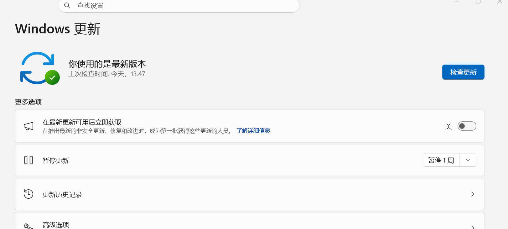

‍

## win简单配置

‍

### 结束任务菜单

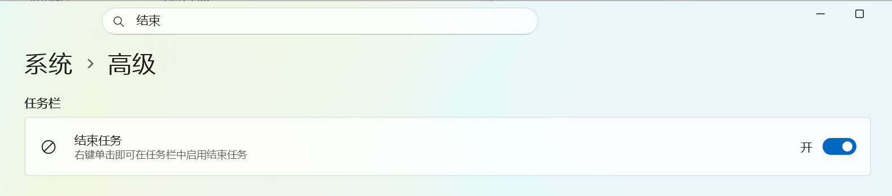

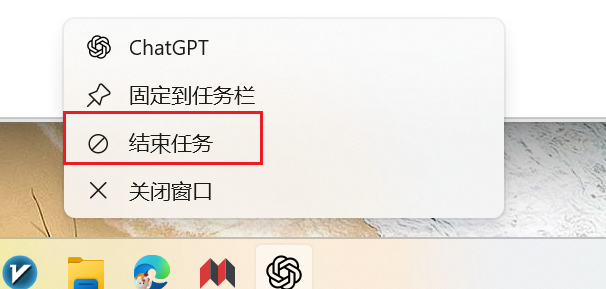

‍

‍

### powershell 7

安装最新powershell 7

```py
查看最新版本信息。
winget search --id Microsoft.PowerShell --exact


安装 MSIX 包
winget install --id Microsoft.PowerShell --source winget
```

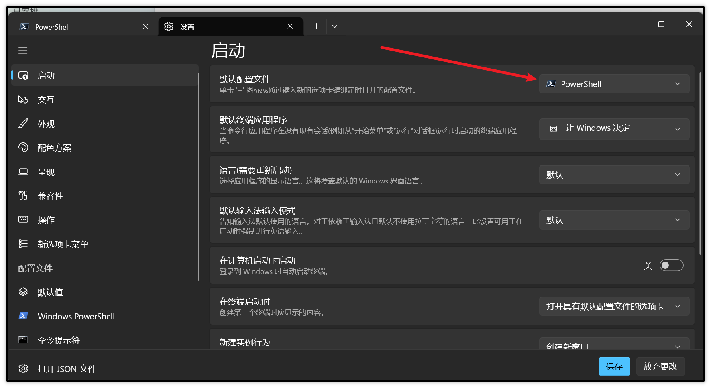

‍

### 输入速度

默认的输入字符的  速度和响应 感觉太慢了，通过修改控制面板里面的数值 还是有点慢

‍

方法修改注册表

```reg
计算机\HKEY_CURRENT_USER\Control Panel\Accessibility\Keyboard Response
```

‍

- 这是系统默认的值

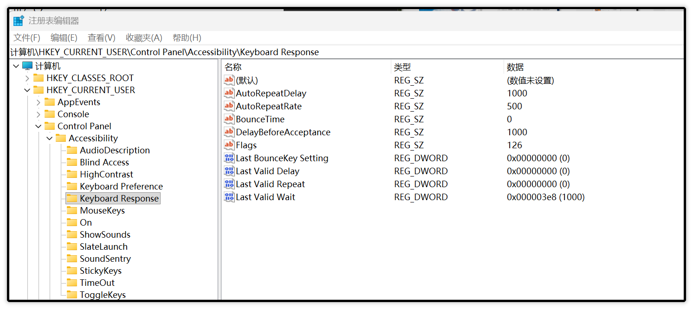

- 修改后，重启电脑

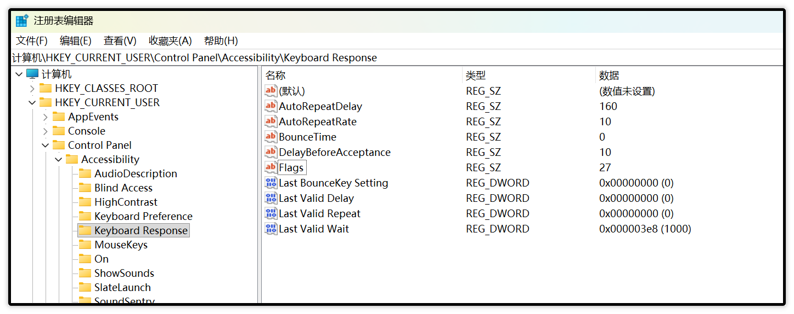

‍

### 中&英切换

‍

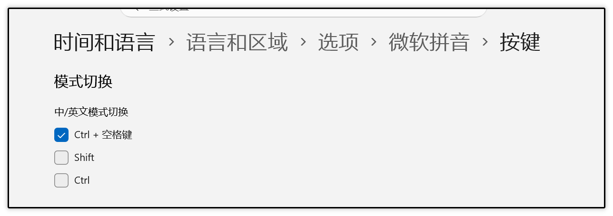

### PowerToys

功能挺多的，一般我用不到

```py
https://learn.microsoft.com/zh-cn/windows/powertoys/
```

‍

### 小工具ppw

```py
PS K:\my_Tools\ppw> .\ppw.cmd

Usage:
  ppw fwd LISTEN_IP:LISTEN_PORT:TARGET_IP:TARGET_PORT
  ppw fwd LISTEN_IP:LISTEN_PORT:TARGET_IP:TARGET_PORT -t DESCRIPTION
  ppw show
  ppw rm ID

Examples:
  ppw fwd 0.0.0.0:18080:172.28.188.30:8080
  ppw fwd 0.0.0.0:18080:172.28.188.30:8080 -t testfwd
  ppw rm 1
```

‍

添加到环境变量

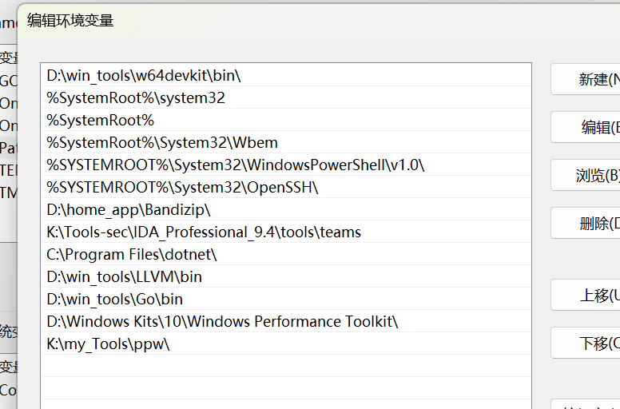

‍

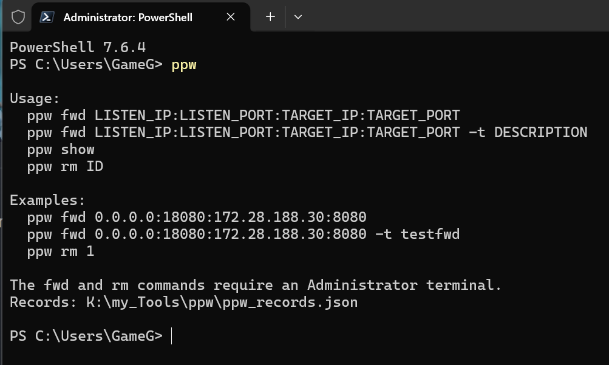

‍

‍

### ssh

```py
PS C:\Users\GameG> cd ~
PS C:\Users\GameG> mkdir .ssh

    Directory: C:\Users\GameG

Mode                 LastWriteTime         Length Name
----                 -------------         ------ ----
d----          2026-08-13    14:08                .ssh

PS C:\Users\GameG> cd .ssh
PS C:\Users\GameG\.ssh>
```

‍

为了安全可以使用

```py
ssh-keygen.exe -t rsa
```

为了方便 我直接默认

```py
PS C:\Users\GameG\.ssh> ssh-keygen.exe
PS C:\Users\GameG\.ssh> ls

    Directory: C:\Users\GameG\.ssh

Mode                 LastWriteTime         Length Name
----                 -------------         ------ ----
-a---          2026-08-13    14:09            411 id_ed25519
-a---          2026-08-13    14:09            103 id_ed25519.pub
```

## 娱乐软件

‍

### 微信

```py
https://pc.weixin.qq.com/
```

### QQ

```py
https://pc.weixin.qq.com/
```

### QQ 音乐

😂

```py
https://y.qq.com/
```

‍

## 必备软件

### 思源笔记

用来管理和写笔记，导出导入都很方便

```py
https://b3log.org/siyuan/download.html
```

‍

### Typora

临时可以一个 markdown 文档 也很方便

```py
https://typora.io/
```

‍


‍

### OBS-录屏软件

最强视频录制和直播软件

```py
https://obsproject.com/welcome
```

### PotPlayer

```py
https://potplayer.org/en/potplayer-installer.html
```

‍

### Chrome

虽然windows有自带edge 浏览器，但是 chrome 也必不可少啊

```py
https://www.google.com/intl/zh-CN/chrome/next-steps.html
```

‍

‍

‍

## 实用工具

2026 年以来，你可以使用 AI 破解任何 允许离线激活的付费版本软件

### 7z

```py
https://7-zip.org/download.html
```

### bandizip

```py
https://www.bandisoft.com/bandizip/
```

‍

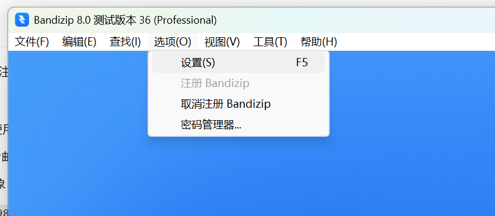

‍

### Everything

```py
https://www.voidtools.com/zh-cn/downloads/
```

### snipaste

截图软件免费版本

```py
https://www.snipaste.com/
```

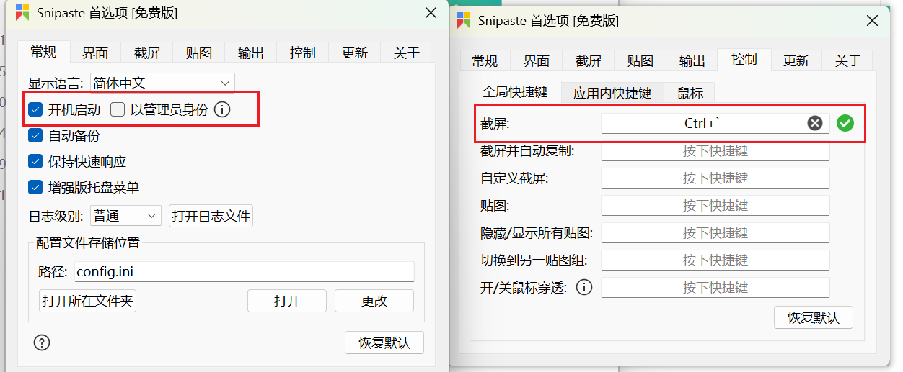

....  pro

```py
mov al, 1
ret
```

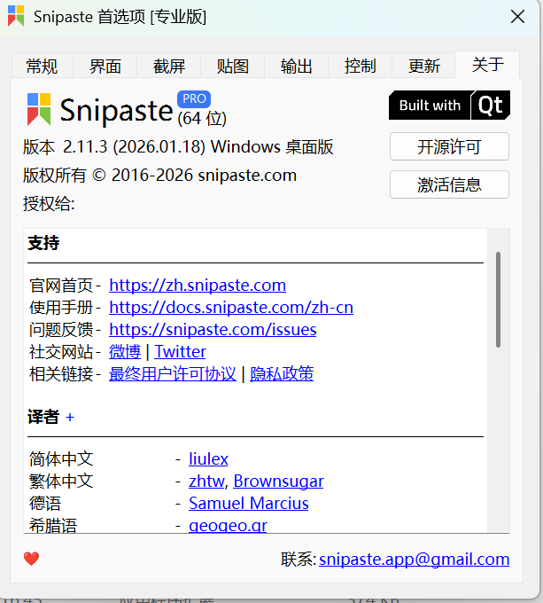

### v2rayN

```py
https://github.com/2dust/v2rayN
```

‍

### Dawn Launcher

‍

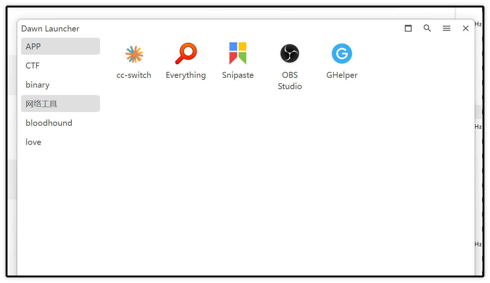

‍

## 实用工具2

### navicat

数据库管理工具

```py
https://www.navicat.com.cn/
```

### Systeminformer

一个**免费**、强大、多功能的工具，帮助您**监控系统资源**、**调试软件**并**检测恶意软件**。

```py
https://www.systeminformer.com/downloads
```

‍

### QtScrcpy

QtScrcpy 可以通过 USB / 网络连接Android设备，并进行显示和控制。无需root权限。

```py
https://github.com/barry-ran/QtScrcpy
```

‍

### Proxifier

最先进的代理客户端

Proxifier允许不支持通过代理服务器工作的网络应用程序通过SOCKS或HTTPS代理及链进行操作。

```py
https://www.proxifier.com/
```

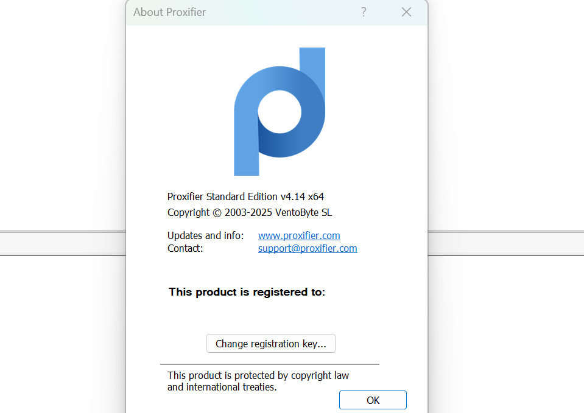

‍

‍

‍

### IDA Pro

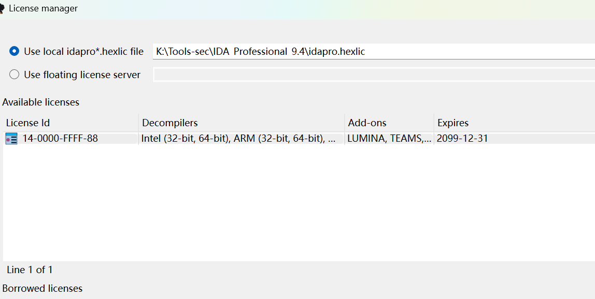

‍

- 插件

```py
https://github.com/gaasedelen/patching/tree/main/plugins
```

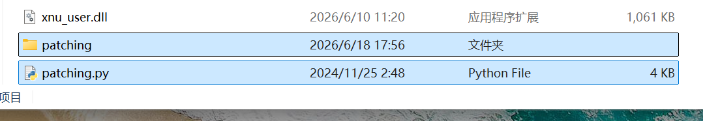

‍

‍

### HxD

免费十六进制编辑器和磁盘编辑器

```py
https://mh-nexus.de/en/hxd/
```

‍

### 快捷打开

‍

```py
计算机\HKEY_CLASSES_ROOT\*\shell\
```

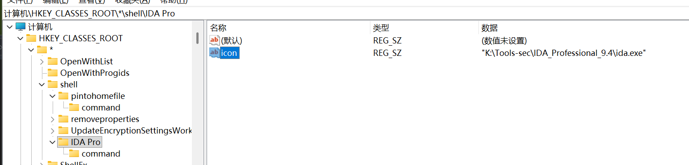

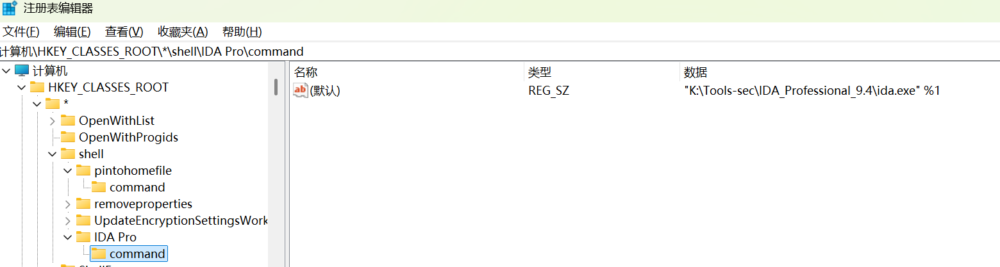

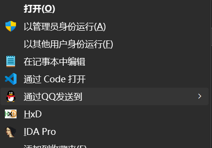

‍

‍

‍

### VMware-Workstation

```py
VMware-Workstation-Full-26H1-25388281.exe
```

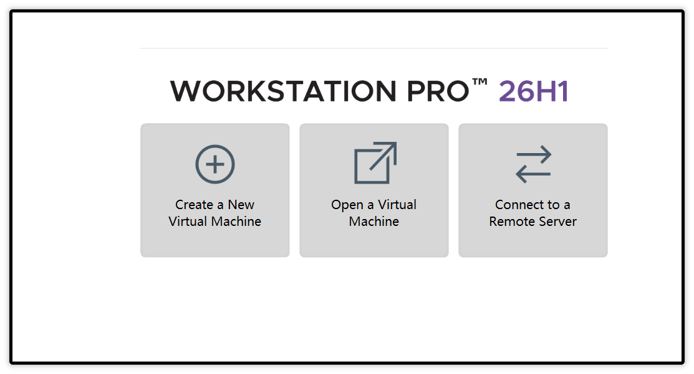

‍

### BurpSuitePro

‍

```py
https://portswigger.net/burp/releases
```


‍

‍

```py
PS C:\BurpSuite> .\Build-BurpCrackmePatch.ps1
Created original backup: C:\BurpSuite\burpsuite.original.jar
[1/3] Compiling the challenge license adapter...
[2/3] Rebuilding from the verified original JAR...
[3/3] Installed: C:\BurpSuite\burpsuite.jar

Launch the patched build with BurpSuite.exe.
Path                                        Hash
----                                        ----
C:\BurpSuite\burpsuite.original.jar         510BF1C87C766F09C3C20D3EF75E7A6978E60DD38346965DD4836CE64417BECF
C:\BurpSuite\burpsuite.challenge.manual.jar C7AB2FE5ED256CDB42F7D254CAD8D6FB23618F0352F960FFED1EF7C687FC2596
```

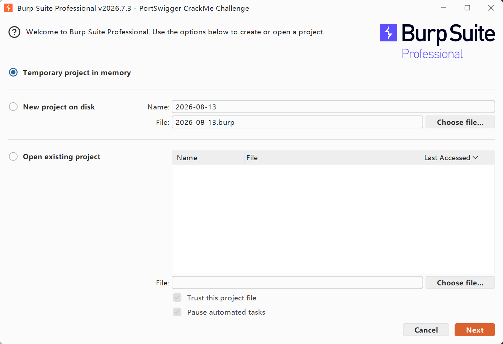

### Wireshark

‍

‍

‍

‍

‍

## AI相关

### ChatGPT

微软商店里面下载安装

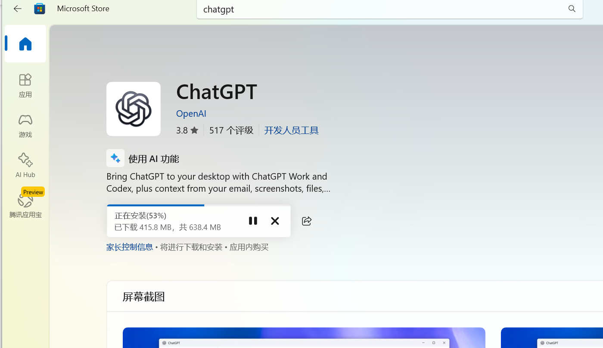

‍

### CC-swithch

```py
https://github.com/farion1231/cc-switch/releases/tag/v3.19.2
```

‍

‍

‍

### radare2

```py
https://github.com/radareorg/radare2
```

### LLVM

```py
https://github.com/llvm/llvm-project
```

### w64devkit

**w64devkit**是一个为Windows平台设计的C/C++编译环境，它提供了一个完整的开发套件，使得用户可以在没有安装Visual Studio或其他大型IDE的情况下进行C/C++程序的开发。这个工具集的主要特点是它的便携性和轻量级，以及它对现代C/C++标准的支持。

```py
https://github.com/skeeto/w64devkit/releases/tag/v2.9.1
```

‍

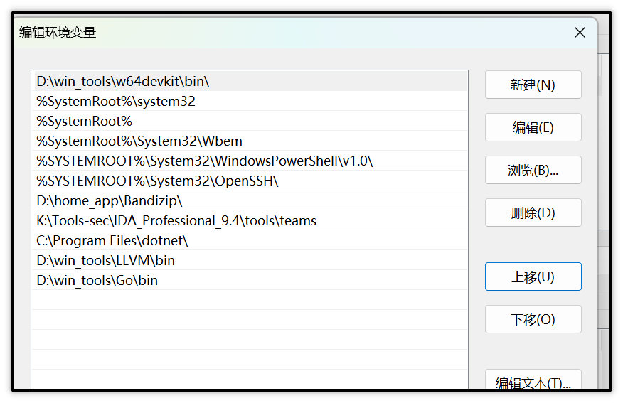

‍

‍

### git

```py
https://github.com/git-for-windows/git/releases/tag/v2.55.0.windows.4
```

‍

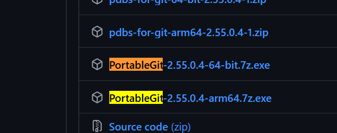

‍

### SysinternalsSuite

```py
https://learn.microsoft.com/zh-cn/sysinternals/downloads/
```

‍

‍

‍

### java

```py

https://www.oracle.com/java/technologies/downloads/#jdk25-windows
java


 -反编译

https://github.com/skylot/jadx/releases/tag/v1.5.6
jadx


https://www.benf.org/other/cfr/
cfr-0.152.jar


https://github.com/Vineflower/vineflower/releases/tag/1.12.0
vineflower-1.12.0.jar


https://github.com/Col-E/Recaf-Launcher/releases
Recaf

https://www.oracle.com/java/technologies/javase/products-jmc9-downloads.html
Java Mission Control：动态分析 JFR 时很方便。

```

‍

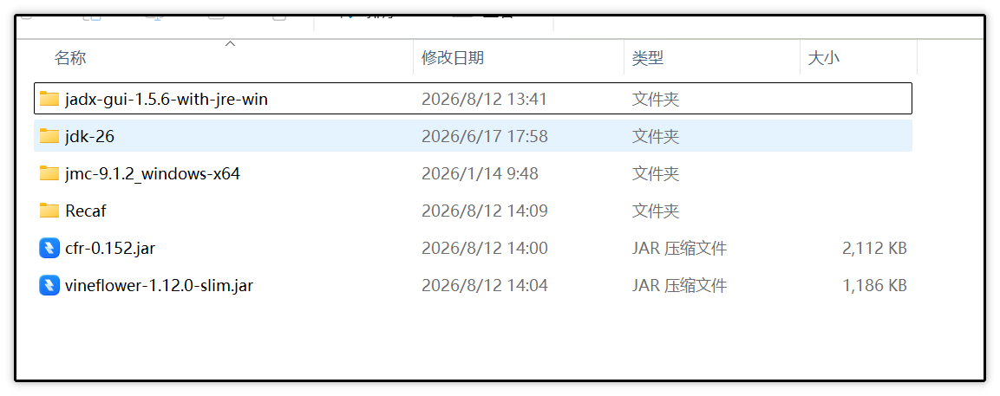

‍

这些工具都是给AI 用的

‍

‍

## 编程相关

### Python

```py
https://www.python.org/downloads/release/python-3147/
```

‍

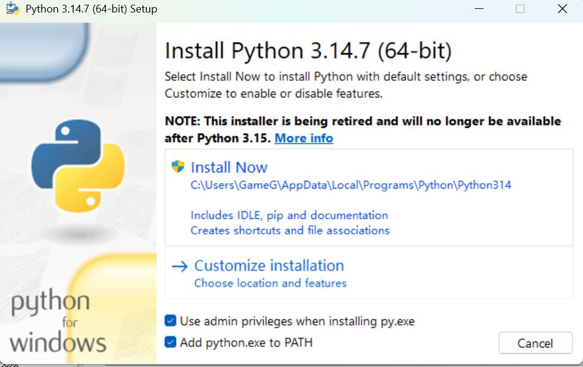

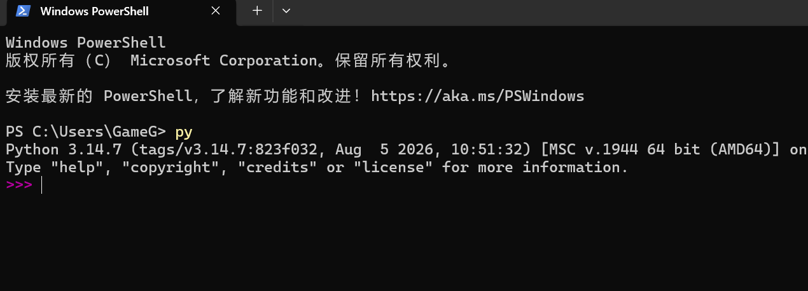

‍

‍

```py
pip install z3-solver 
pip install numpy
pip install pycryptodome
pip install requests

```

‍

### golang

开发用

```py
https://golang.google.cn/dl/
```

‍

### nodejs

```py
https://nodejs.org/zh-cn/download/current
```

我比较喜欢用便捷版本，所以我现在的是便捷版本，再添加个环境变量

‍

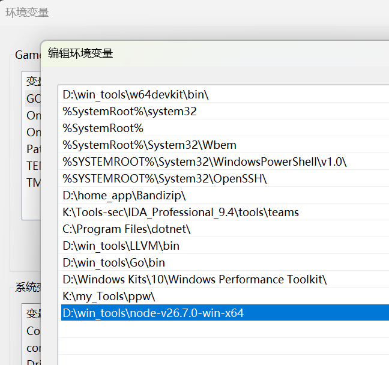

‍

- 装个 dsh

```py
npm install -g @deepseek-ai/dsh
```

‍

‍

### vscode

```py
https://code.visualstudio.com/
```

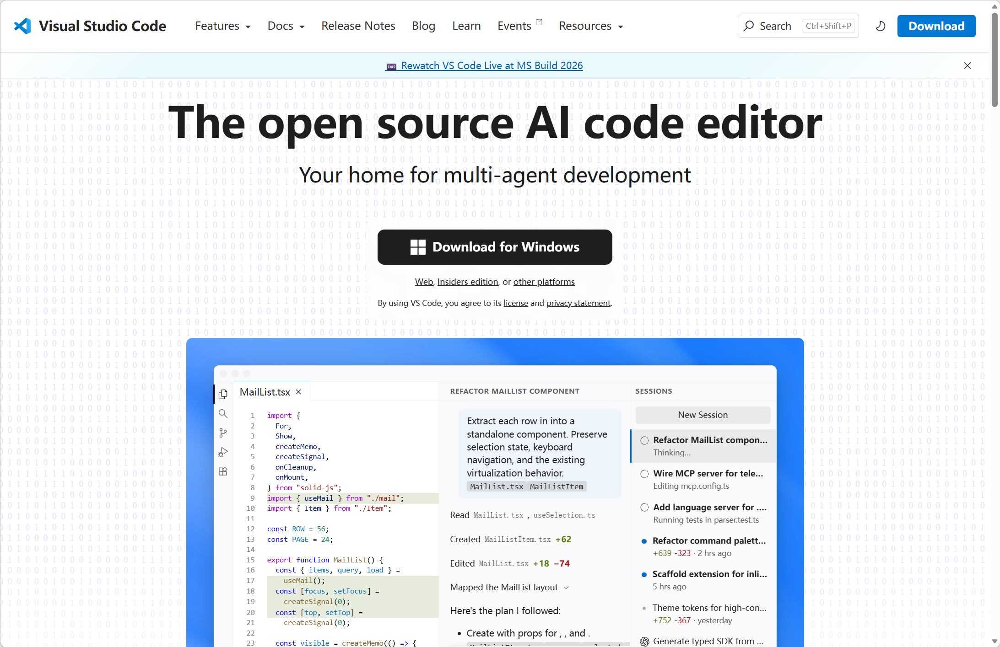

‍

开启自动保存

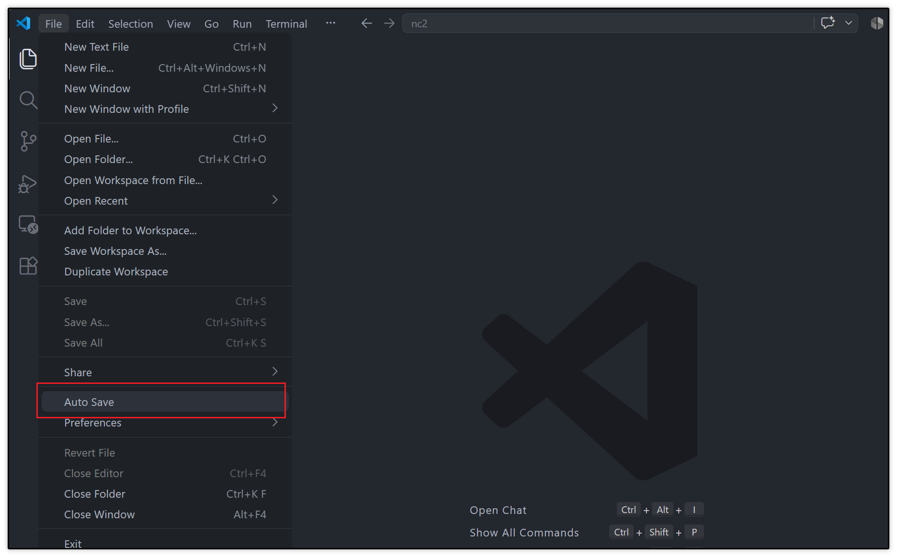

‍

- 插件

1. Remote - SSH

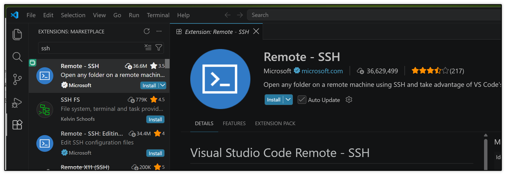

2. Vim

熟练掌握vim,所以写代码离不开vim 

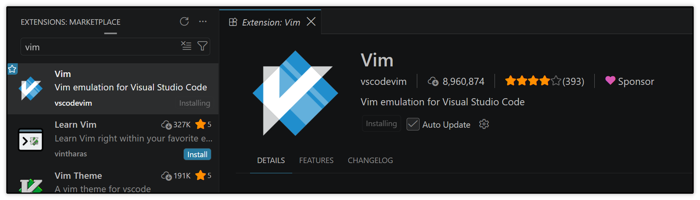

3. One Dark Pro

主题

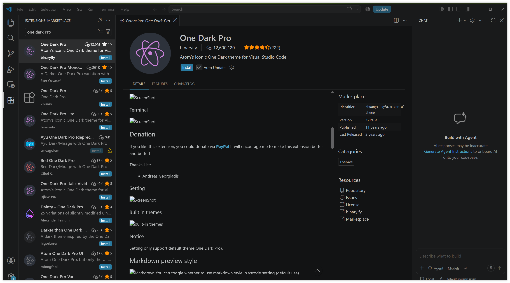

4. python

微软官方推出的核心插件，提供智能补全、类型检查、调试等功能

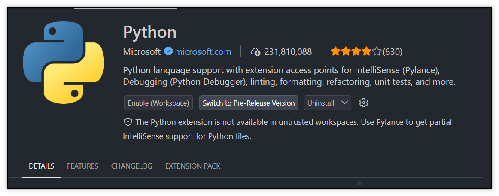

5. go

‍

### Visual Studio 2026

‍
