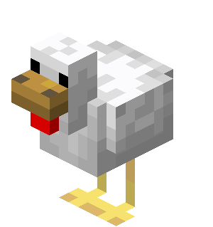

# 🚀 喜欢肘击

> 记录技术成长，分享学习心得

## 📋 关于我

### 👨‍💻 个人简介

- **技能**：Pwn
- **状态**：年轻多折腾😅

### 🎯 技术栈

- **二进制安全**：IDA Pro、GDB、Pwntools
- **开发语言**：Python、C/C++

## 🎉 一些屁话

- **⚡ AAAA**: xxxx
- **🌙 BBBB**：xxxx

## 🔗 联系我

**QQ**：3461665835
**email**：qingwachong[@]qq.com

---

**END**

> 年轻不折腾😅，三角洲启动

*最后更新：2025年10月*

 

### 🤝 共同创作

本网站由 **[ImLZH1](https://github.com/ImLZH1)** 和 **[DeepSeek](https://www.deepseek.com)** 共同打造

> 技术让创作更简单，AI让想法更精彩

